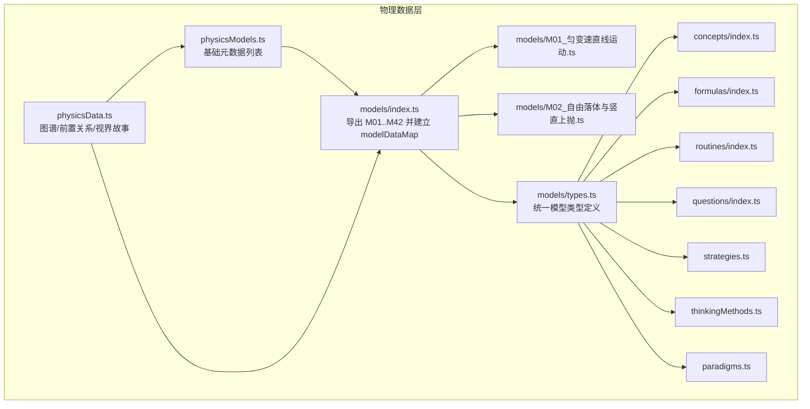
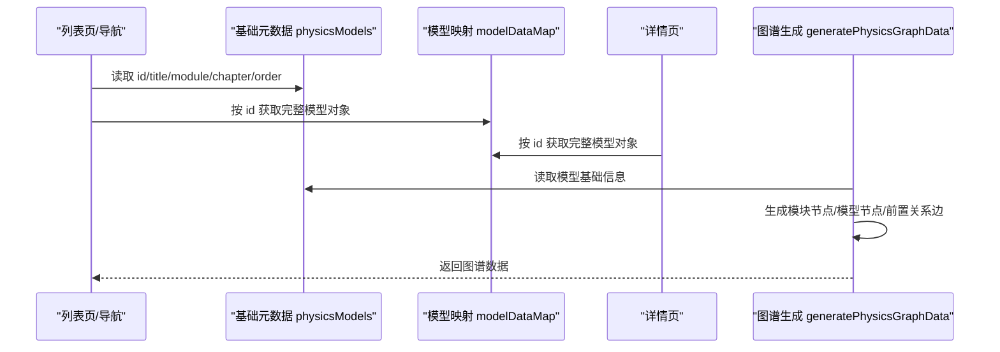
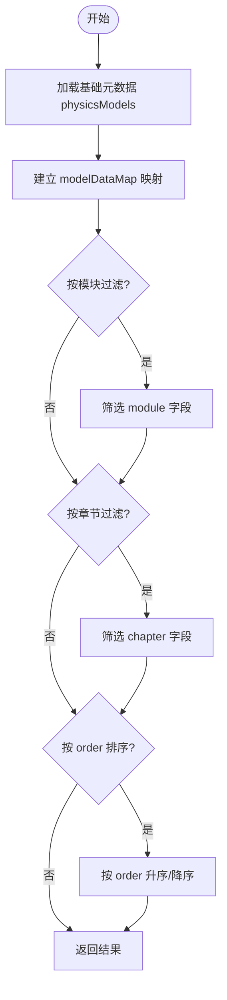
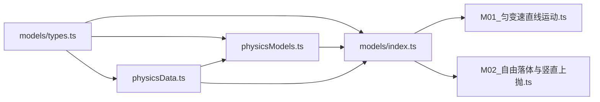

# 物理核心模型数据结构（M层）

<cite>
**本文引用的文件**
- [src/data/physics/models/index.ts](file://src/data/physics/models/index.ts)
- [src/data/physics/physicsModels.ts](file://src/data/physics/physicsModels.ts)
- [src/data/physics/physicsData.ts](file://src/data/physics/physicsData.ts)
- [src/data/physics/models/M01_匀变速直线运动.ts](file://src/data/physics/models/M01_匀变速直线运动.ts)
- [src/data/physics/models/M02_自由落体与竖直上抛.ts](file://src/data/physics/models/M02_自由落体与竖直上抛.ts)
- [src/data/physics/models/types.ts](file://src/data/physics/models/types.ts)
- [src/data/physics/index.ts](file://src/data/physics/index.ts)
- [src/data/physics/paradigms.ts](file://src/data/physics/paradigms.ts)
- [src/data/physics/thinkingMethods.ts](file://src/data/physics/thinkingMethods.ts)
- [src/data/physics/routines/index.ts](file://src/data/physics/routines/index.ts)
- [src/data/physics/questions/index.ts](file://src/data/physics/questions/index.ts)
- [src/data/physics/concepts/index.ts](file://src/data/physics/concepts/index.ts)
- [src/data/physics/formulas/index.ts](file://src/data/physics/formulas/index.ts)
- [src/data/physics/strategies.ts](file://src/data/physics/strategies.ts)
- [src/data/physics/visionStories.ts](file://src/data/physics/visionStories.ts)
</cite>

## 目录
1. [引言](#引言)
2. [项目结构](#项目结构)
3. [核心组件](#核心组件)
4. [架构总览](#架构总览)
5. [详细组件分析](#详细组件分析)
6. [依赖分析](#依赖分析)
7. [性能考虑](#性能考虑)
8. [故障排查指南](#故障排查指南)
9. [结论](#结论)
10. [附录](#附录)

## 引言
本文件聚焦“物理核心模型数据结构（M层）”，系统梳理物理模型的字段定义、分类体系、章节组织、模块化设计以及查询/过滤/排序能力，并给出导入导出与批量更新的实践建议。目标是帮助开发者与内容编辑在不深入源码的情况下，也能准确理解与使用物理M层数据。

## 项目结构
物理M层数据位于 src/data/physics 下，采用“按主题分层 + 模块化文件”的组织方式：
- models：存放42个物理模型的完整数据对象（M01~M42），每个模型一个文件，统一通过 index.ts 导出并建立 id 到模型对象的映射。
- physicsModels.ts：提供物理模型的基础元数据列表（id、title、module、chapter、order），用于列表页、导航与图谱节点展示。
- physicsData.ts：提供认知图谱数据生成函数、前置关系边集、视界故事等。
- 其他子目录：concepts（概念）、formulas（公式）、routines（典型套路）、questions（题库）、strategies（策略）、thinkingMethods（思维方法）、paradigms（范式）等，均以模块化方式组织，便于与M层模型联动。

图表来源
- [src/data/physics/models/index.ts:1-98](file://src/data/physics/models/index.ts#L1-L98)
- [src/data/physics/physicsModels.ts:1-66](file://src/data/physics/physicsModels.ts#L1-L66)
- [src/data/physics/physicsData.ts:1-138](file://src/data/physics/physicsData.ts#L1-L138)
- [src/data/physics/models/M01_匀变速直线运动.ts:1-85](file://src/data/physics/models/M01_匀变速直线运动.ts#L1-L85)
- [src/data/physics/models/M02_自由落体与竖直上抛.ts:1-65](file://src/data/physics/models/M02_自由落体与竖直上抛.ts#L1-L65)

章节来源
- [src/data/physics/models/index.ts:1-98](file://src/data/physics/models/index.ts#L1-L98)
- [src/data/physics/physicsModels.ts:1-66](file://src/data/physics/physicsModels.ts#L1-L66)
- [src/data/physics/physicsData.ts:1-138](file://src/data/physics/physicsData.ts#L1-L138)

## 核心组件
- 模型对象（M01~M42）：每个模型是一个完整对象，包含基础字段与七模块内容。
- 基础元数据列表（physicsModels）：仅包含 id、title、module、chapter、order 等静态字段，用于快速渲染与导航。
- 模型映射（modelDataMap）：id 到完整模型对象的字典，便于按 id 快速检索。
- 认知图谱数据（generatePhysicsGraphData）：基于基础元数据与前置关系生成节点与边。
- 视界故事（physicsVisionStories）：与模型学习体验配套的阅读素材。

章节来源
- [src/data/physics/models/index.ts:52-98](file://src/data/physics/models/index.ts#L52-L98)
- [src/data/physics/physicsModels.ts:22-65](file://src/data/physics/physicsModels.ts#L22-L65)
- [src/data/physics/physicsData.ts:81-120](file://src/data/physics/physicsData.ts#L81-L120)

## 架构总览
物理M层采用“轻量元数据 + 完整模型对象”的双轨设计：
- 元数据轨道：physicsModels 提供稳定、轻量的基础信息，适合列表页与导航。
- 完整模型轨道：modelDataMap 提供可扩展的七模块内容，适合详情页与深度学习。
- 关系轨道：physicsData 的前置关系边集与 generate 函数，支撑认知图谱与学习路径推荐。

图表来源
- [src/data/physics/physicsModels.ts:22-65](file://src/data/physics/physicsModels.ts#L22-L65)
- [src/data/physics/models/index.ts:52-98](file://src/data/physics/models/index.ts#L52-L98)
- [src/data/physics/physicsData.ts:81-120](file://src/data/physics/physicsData.ts#L81-L120)

## 详细组件分析

### 模型对象字段定义（M层）
每个物理模型对象包含以下字段（以 M01 为例）：
- 基础字段
  - id：模型唯一标识，如 “PHY-M01”
  - title：模型标题，如 “匀变速直线运动”
  - module：所属模块，如 “运动学”
  - chapter：所属章节，如 “运动的描述”
  - difficulty：难度等级（1/2/3），用于图谱节点难度标注
  - subtitle：简短摘要或口诀，如 “v = v0 + at, x = v0t + ½at²”
  - estimatedMinutes：预估学习时长（部分模型提供）
- 七模块内容
  - positioning：定位与本质（核心、本质、关键洞察）
  - principle：核心原理（公式与推导说明）
  - variations：分层变形（基础/进阶/挑战层级的公式与要点）
  - knowledgeNetwork：知识网络（parents/children/related/coreFormula）
  - methodology：方法论（解题思路、决策树、常见错误）
  - selfCheck：自我检测（题目与答案、信心等级）
  - lifeApplication：生活应用（现实场景与延伸思考）

章节来源
- [src/data/physics/models/M01_匀变速直线运动.ts:1-85](file://src/data/physics/models/M01_匀变速直线运动.ts#L1-L85)
- [src/data/physics/models/M02_自由落体与竖直上抛.ts:1-65](file://src/data/physics/models/M02_自由落体与竖直上抛.ts#L1-L65)

### 模型分类体系
物理模型的模块分类遵循高中物理教学大纲，覆盖12个主要类别：
- 运动学
- 力学
- 曲线运动
- 万有引力
- 机械能
- 动量
- 电场
- 电路
- 磁场
- 电磁感应
- 热学
- 光学
- 机械波
- 近代物理

上述分类在基础元数据与图谱节点中均有体现，模块节点带有难度标注，便于学习路径规划。

章节来源
- [src/data/physics/physicsModels.ts:22-65](file://src/data/physics/physicsModels.ts#L22-L65)
- [src/data/physics/physicsData.ts:84-92](file://src/data/physics/physicsData.ts#L84-L92)

### 模型章节（chapterModels）组织方式与模块化设计
- 章节维度：每个模型包含 chapter 字段，用于将模型归入具体章节（如“运动的描述”、“恒定电流”等）。
- 模块维度：每个模型包含 module 字段，用于将模型归入模块（如“运动学”、“力学”等）。
- 模块化文件：每个模型独立为一个文件，便于维护与扩展；通过 models/index.ts 统一导出与建立映射。
- 类型约束：通过 models/types.ts 对模型对象进行类型约束，确保字段一致性与可扩展性。

章节来源
- [src/data/physics/physicsModels.ts:22-65](file://src/data/physics/physicsModels.ts#L22-L65)
- [src/data/physics/models/index.ts:1-98](file://src/data/physics/models/index.ts#L1-L98)
- [src/data/physics/models/types.ts](file://src/data/physics/models/types.ts)

### 查询、过滤、排序功能实现
- 查询
  - 按 id 查询：通过 modelDataMap[id] 直接获取完整模型对象。
  - 按模块/章节过滤：遍历 physicsModels 或完整模型对象的 module/chapter 字段进行过滤。
- 过滤
  - 模块过滤：根据 module 字段筛选。
  - 章节过滤：根据 chapter 字段筛选。
  - 难度过滤：根据 difficulty 字段筛选。
- 排序
  - order 字段：用于模型在页面中的顺序排列。
  - 模块/章节排序：可按 module/chapter 的字母序或自定义顺序排序。
- 认知图谱排序
  - 图谱节点难度按 order 映射为 1/2/3，便于可视化呈现。

图表来源
- [src/data/physics/physicsModels.ts:22-65](file://src/data/physics/physicsModels.ts#L22-L65)
- [src/data/physics/models/index.ts:52-98](file://src/data/physics/models/index.ts#L52-L98)

章节来源
- [src/data/physics/physicsModels.ts:22-65](file://src/data/physics/physicsModels.ts#L22-L65)
- [src/data/physics/models/index.ts:52-98](file://src/data/physics/models/index.ts#L52-L98)

### 导入导出、批量更新与版本管理策略
- 导入
  - 新增模型：在 models 目录新增 Mxx_*.ts 文件，导出完整模型对象；在 models/index.ts 中引入并加入 modelDataMap。
  - 同步基础元数据：physicsModels.ts 中自动汇总（注释提示“自动同步，无需手动维护”），但若缺少对应 Mxx 文件，需先补齐 Mxx 文件。
- 导出
  - 导出模型映射：直接使用 modelDataMap。
  - 导出基础元数据：使用 physicsModels 数组。
  - 导出图谱数据：调用 generatePhysicsGraphData()。
- 批量更新
  - 批量修改模块/章节：通过遍历 physicsModels 或完整模型对象，统一更新 module/chapter 字段后重新导出。
  - 批量调整难度：更新 physicsData 中的难度映射逻辑或模型对象的 difficulty 字段。
- 版本管理
  - 建议以“模型文件版本号 + 基础元数据版本号 + 图谱生成函数版本号”协同管理。
  - 对于大规模变更，建议先在分支中完成，再合并并运行校验脚本（如 scripts 目录下的修复脚本）。

章节来源
- [src/data/physics/models/index.ts:1-98](file://src/data/physics/models/index.ts#L1-L98)
- [src/data/physics/physicsModels.ts:1-22](file://src/data/physics/physicsModels.ts#L1-L22)
- [src/data/physics/physicsData.ts:81-120](file://src/data/physics/physicsData.ts#L81-L120)

## 依赖分析
- 模型对象依赖
  - models/index.ts 依赖各 Mxx 文件并导出 modelDataMap。
  - physicsModels.ts 依赖 modelDataMap（注释提示自动同步）。
  - physicsData.ts 依赖基础元数据与前置关系边集。
- 类型依赖
  - models/types.ts 为所有学科共享的模型类型定义，确保跨学科一致性。
- 上下游依赖
  - 列表页/导航依赖 physicsModels。
  - 详情页依赖 modelDataMap。
  - 认知图谱依赖 physicsModels 与 physicsData。

图表来源
- [src/data/physics/models/index.ts:1-98](file://src/data/physics/models/index.ts#L1-L98)
- [src/data/physics/physicsModels.ts:1-66](file://src/data/physics/physicsModels.ts#L1-L66)
- [src/data/physics/physicsData.ts:1-138](file://src/data/physics/physicsData.ts#L1-L138)
- [src/data/physics/models/types.ts](file://src/data/physics/models/types.ts)

章节来源
- [src/data/physics/models/index.ts:1-98](file://src/data/physics/models/index.ts#L1-L98)
- [src/data/physics/physicsModels.ts:1-66](file://src/data/physics/physicsModels.ts#L1-L66)
- [src/data/physics/physicsData.ts:1-138](file://src/data/physics/physicsData.ts#L1-L138)
- [src/data/physics/models/types.ts](file://src/data/physics/models/types.ts)

## 性能考虑
- 数据规模
  - 当前模型数量有限（42个），内存占用与渲染开销可控。
- 查询性能
  - 使用 modelDataMap 进行 O(1) 的按 id 查询。
  - 过滤与排序在前端进行，建议在数据量扩大时考虑服务端分页与索引。
- 渲染优化
  - 列表页优先使用 physicsModels 的轻量数据，详情页再按需加载完整模型对象。
  - 认知图谱节点与边在首次渲染时生成，后续复用。

## 故障排查指南
- 模型缺失
  - 若在基础元数据列表中找不到某模型，说明其在 modelDataMap 中也不存在，需先在 models 目录新增对应 Mxx 文件并补全导出。
- 字段不一致
  - 使用 models/types.ts 确保字段类型一致，避免运行时报错。
- 图谱异常
  - 检查 physicsData.ts 中的前置关系边集是否正确，必要时修正边的方向与起点/终点。
- 导航错乱
  - 检查 physicsModels 的 order 字段是否连续且符合预期。

章节来源
- [src/data/physics/physicsModels.ts:1-22](file://src/data/physics/physicsModels.ts#L1-L22)
- [src/data/physics/models/types.ts](file://src/data/physics/models/types.ts)
- [src/data/physics/physicsData.ts:42-78](file://src/data/physics/physicsData.ts#L42-L78)

## 结论
物理M层数据结构以“轻量元数据 + 完整模型对象 + 统一类型约束”为核心，结合模块化文件组织与映射表，实现了清晰的职责分离与良好的扩展性。通过基础元数据与图谱生成函数，能够高效支持列表、导航、详情与认知图谱等多场景需求。建议在新增/修改模型时严格遵循现有模式，确保数据一致性与可维护性。

## 附录
- 相关子系统
  - 概念、公式、套路、题库、策略、思维方法、范式等均与M层模型保持松耦合，通过统一类型与模块化组织实现协同。
- 示例参考
  - M01 与 M02 的字段与模块组织可作为新增模型的模板。

章节来源
- [src/data/physics/concepts/index.ts](file://src/data/physics/concepts/index.ts)
- [src/data/physics/formulas/index.ts](file://src/data/physics/formulas/index.ts)
- [src/data/physics/routines/index.ts](file://src/data/physics/routines/index.ts)
- [src/data/physics/questions/index.ts](file://src/data/physics/questions/index.ts)
- [src/data/physics/strategies.ts](file://src/data/physics/strategies.ts)
- [src/data/physics/thinkingMethods.ts](file://src/data/physics/thinkingMethods.ts)
- [src/data/physics/paradigms.ts](file://src/data/physics/paradigms.ts)
- [src/data/physics/visionStories.ts](file://src/data/physics/visionStories.ts)