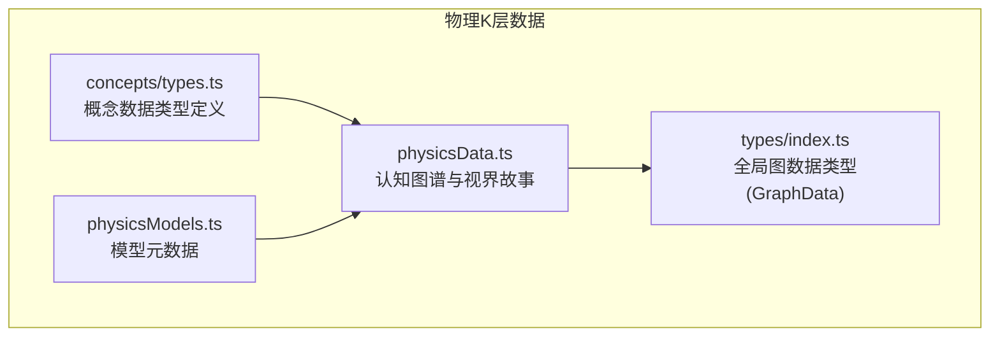
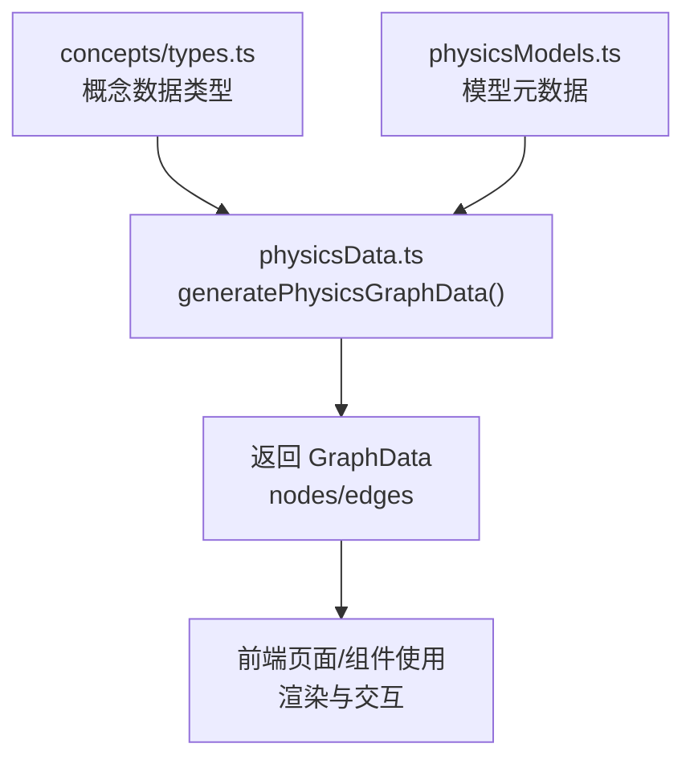
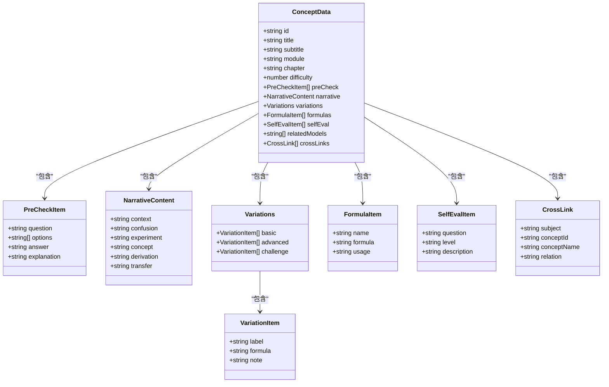
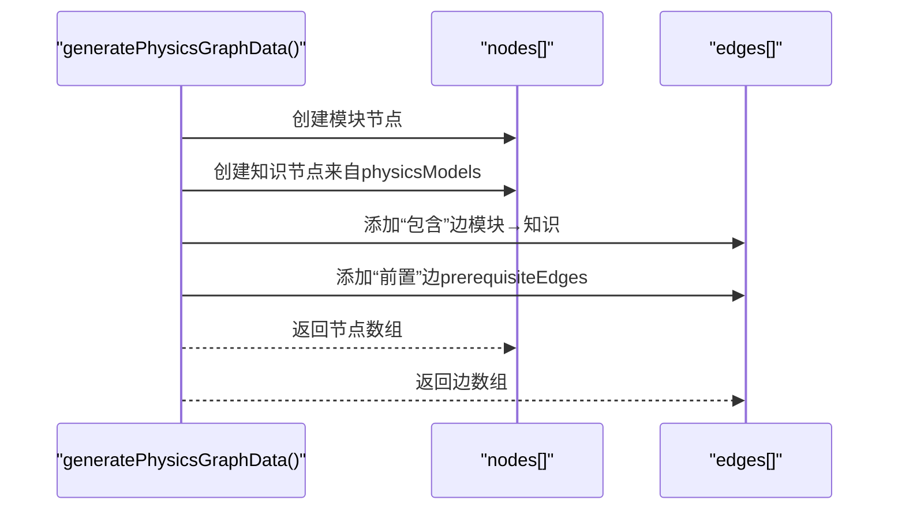
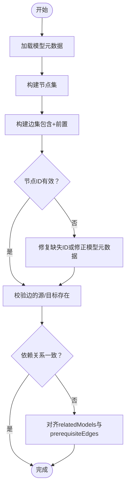
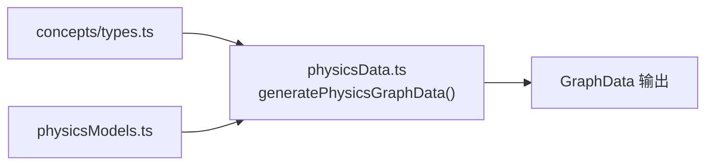

# 物理概念数据结构（K层）

<cite>
**本文引用的文件**
- [src/data/physics/concepts/types.ts](file://src/data/physics/concepts/types.ts)
- [src/data/physics/physicsData.ts](file://src/data/physics/physicsData.ts)
- [src/data/physics/physicsModels.ts](file://src/data/physics/physicsModels.ts)
- [src/types/index.ts](file://src/types/index.ts)
</cite>

## 目录
1. [引言](#引言)
2. [项目结构](#项目结构)
3. [核心组件](#核心组件)
4. [架构总览](#架构总览)
5. [详细组件分析](#详细组件分析)
6. [依赖分析](#依赖分析)
7. [性能考虑](#性能考虑)
8. [故障排查指南](#故障排查指南)
9. [结论](#结论)
10. [附录](#附录)

## 引言
本文件系统化梳理物理K层（知识节点）的数据结构设计，聚焦以下目标：
- 概念节点（ConceptData）字段定义：概念ID、标题、副标题、所属模块与章节、难度等级、前置知识检测、叙事正文、分层变形、公式卡片、理解度自评、关联模型与跨学科链接等。
- 概念原理（NarrativeContent）结构：情境锚定、困惑预设、实验/现象呈现、概念涌现、推导叙事、迁移与应用。
- 知识网络（GraphData）数据格式：节点类型（模块、知识）、边关系标签（包含、前置）。
- 方法论（SelfEvalItem、PreCheckItem）结构：学习步骤、要点提示、常见错误。
- 增删改查操作示例与依赖关系维护、数据一致性保障策略。

## 项目结构
物理K层数据位于 src/data/physics 下，核心文件包括：
- 概念数据类型定义：src/data/physics/concepts/types.ts
- 认知图谱与模型元数据：src/data/physics/physicsData.ts、src/data/physics/physicsModels.ts
- 全局图数据类型：src/types/index.ts

图表来源
- [src/data/physics/concepts/types.ts:1-78](file://src/data/physics/concepts/types.ts#L1-L78)
- [src/data/physics/physicsData.ts:1-138](file://src/data/physics/physicsData.ts#L1-L138)
- [src/data/physics/physicsModels.ts:1-66](file://src/data/physics/physicsModels.ts#L1-L66)
- [src/types/index.ts](file://src/types/index.ts)

章节来源
- [src/data/physics/concepts/types.ts:1-78](file://src/data/physics/concepts/types.ts#L1-L78)
- [src/data/physics/physicsData.ts:1-138](file://src/data/physics/physicsData.ts#L1-L138)
- [src/data/physics/physicsModels.ts:1-66](file://src/data/physics/physicsModels.ts#L1-L66)
- [src/types/index.ts](file://src/types/index.ts)

## 核心组件
本节对K层核心数据结构进行逐项说明，涵盖字段含义、取值范围与约束。

- 概念节点（ConceptData）
  - 字段
    - id：概念唯一标识，如“P01”
    - title：概念标题
    - subtitle：副标题
    - module：所属板块（如“运动学”）
    - chapter：所属章节（如“运动的描述”）
    - difficulty：难度等级（1-3）
    - preCheck：前置知识检测条目数组
    - narrative：叙事正文（见下节）
    - variations：分层变形（基础/进阶/挑战）
    - formulas：公式卡片数组
    - selfEval：理解度自评条目数组
    - relatedModels：关联模型ID数组（如“PHY-M01”）
    - crossLinks：跨学科关联数组
  - 约束
    - module/chapter与模型元数据一致
    - difficulty为整数且在1-3范围内
    - relatedModels与模型元数据id集合对齐
    - crossLinks中subject与学科枚举一致

- 概念原理（NarrativeContent）
  - 组成部分
    - context：情境锚定（约100-150字）
    - confusion：困惑预设（约150-200字）
    - experiment：实验/现象呈现（约200-250字）
    - concept：概念涌现（约150-200字）
    - derivation：推导叙事（约300-400字）
    - transfer：迁移与应用（约150-200字）
  - 设计意图
    - 以“情境—困惑—实验—概念—推导—迁移”的闭环叙事驱动理解

- 分层变形（Variations）
  - 结构
    - basic：基础层级（B级）
    - advanced：进阶层级（J级）
    - challenge：挑战层级（T级）
  - 用途
    - 提供不同难度层次的变式练习与应用

- 公式卡片（FormulaItem）
  - 字段
    - name：公式名称
    - formula：公式表达
    - usage：使用场景说明

- 自评条目（SelfEvalItem）
  - 字段
    - question：自评问题
    - level：等级（A/B/C）
    - description：等级描述

- 前置检测条目（PreCheckItem）
  - 字段
    - question：题目
    - options：选项数组
    - answer：正确答案
    - explanation：解析

- 跨学科链接（CrossLink）
  - 字段
    - subject：学科标识
    - conceptId：概念ID
    - conceptName：概念名称
    - relation：关系标签

章节来源
- [src/data/physics/concepts/types.ts:51-77](file://src/data/physics/concepts/types.ts#L51-L77)
- [src/data/physics/concepts/types.ts:11-18](file://src/data/physics/concepts/types.ts#L11-L18)
- [src/data/physics/concepts/types.ts:26-30](file://src/data/physics/concepts/types.ts#L26-L30)
- [src/data/physics/concepts/types.ts:32-36](file://src/data/physics/concepts/types.ts#L32-L36)
- [src/data/physics/concepts/types.ts:38-42](file://src/data/physics/concepts/types.ts#L38-L42)
- [src/data/physics/concepts/types.ts:4-9](file://src/data/physics/concepts/types.ts#L4-L9)
- [src/data/physics/concepts/types.ts:44-49](file://src/data/physics/concepts/types.ts#L44-L49)

## 架构总览
物理K层数据通过“概念类型定义 + 认知图谱生成 + 模型元数据”协同工作，形成从概念到知识网络的完整数据流。

图表来源
- [src/data/physics/concepts/types.ts:1-78](file://src/data/physics/concepts/types.ts#L1-L78)
- [src/data/physics/physicsData.ts:80-120](file://src/data/physics/physicsData.ts#L80-L120)
- [src/data/physics/physicsModels.ts:22-65](file://src/data/physics/physicsModels.ts#L22-L65)

章节来源
- [src/data/physics/physicsData.ts:80-120](file://src/data/physics/physicsData.ts#L80-L120)
- [src/data/physics/physicsModels.ts:1-66](file://src/data/physics/physicsModels.ts#L1-L66)

## 详细组件分析

### 概念节点（ConceptData）类图

图表来源
- [src/data/physics/concepts/types.ts:4-49](file://src/data/physics/concepts/types.ts#L4-L49)
- [src/data/physics/concepts/types.ts:51-77](file://src/data/physics/concepts/types.ts#L51-L77)

章节来源
- [src/data/physics/concepts/types.ts:4-49](file://src/data/physics/concepts/types.ts#L4-L49)
- [src/data/physics/concepts/types.ts:51-77](file://src/data/physics/concepts/types.ts#L51-L77)

### 认知图谱（GraphData）与节点/边关系
- 节点类型
  - module：模块节点（如“M-运动学”）
  - knowledge：知识节点（如“PHY-M01”）
- 边关系标签
  - 包含：模块→知识，表示模块包含知识
  - prerequisite：知识→知识，表示前置依赖
- 生成流程
  - 由 generatePhysicsGraphData() 统一产出 nodes/edges

图表来源
- [src/data/physics/physicsData.ts:80-120](file://src/data/physics/physicsData.ts#L80-L120)
- [src/data/physics/physicsModels.ts:22-65](file://src/data/physics/physicsModels.ts#L22-L65)

章节来源
- [src/data/physics/physicsData.ts:80-120](file://src/data/physics/physicsData.ts#L80-L120)
- [src/data/physics/physicsModels.ts:22-65](file://src/data/physics/physicsModels.ts#L22-L65)

### 前置关系维护与一致性策略
- 前置关系定义
  - prerequisiteEdges：显式声明的知识依赖边
- 维护策略
  - 新增模型时同步更新 prerequisiteEdges
  - 保持 relatedModels 与 prerequisiteEdges 的一致性
- 一致性校验建议
  - 生成图谱前校验所有节点ID存在于模型元数据
  - 校验边的源/目标节点均存在
  - 对于模块→知识的“包含”边，确保 module/chapter 与模型元数据一致

图表来源
- [src/data/physics/physicsData.ts:42-78](file://src/data/physics/physicsData.ts#L42-L78)
- [src/data/physics/physicsModels.ts:22-65](file://src/data/physics/physicsModels.ts#L22-L65)

章节来源
- [src/data/physics/physicsData.ts:42-78](file://src/data/physics/physicsData.ts#L42-L78)
- [src/data/physics/physicsModels.ts:22-65](file://src/data/physics/physicsModels.ts#L22-L65)

### 增删改查（CRUD）操作示例
- 创建（Create）
  - 步骤
    - 定义 ConceptData 字段（id/title/module/chapter/difficulty）
    - 填充 preCheck/narrative/variations/formulas/selfEval/crossLinks
    - 在 relatedModels 中登记关联模型ID
  - 依赖维护
    - 若新增前置依赖，同步更新 prerequisiteEdges
- 读取（Read）
  - 获取单个概念：按 id 查询
  - 获取模块/章节维度：按 module/chapter 过滤
  - 获取图谱：调用 generatePhysicsGraphData() 获取 nodes/edges
- 更新（Update）
  - 修改字段：title/subtitle/module/chapter/difficulty
  - 更新依赖：修改 relatedModels 或 prerequisiteEdges
  - 更新自评/公式/变式：替换对应数组
- 删除（Delete）
  - 删除概念：清理 nodes/edges 中对应节点与边
  - 清理依赖：从其他节点的 relatedModels 中移除引用
  - 同步更新 prerequisiteEdges

章节来源
- [src/data/physics/concepts/types.ts:51-77](file://src/data/physics/concepts/types.ts#L51-L77)
- [src/data/physics/physicsData.ts:80-120](file://src/data/physics/physicsData.ts#L80-L120)

## 依赖分析
- 概念类型对认知图谱的影响
  - ConceptData 的 module/chapter 决定节点归属模块
  - relatedModels 决定“包含”边的建立
  - crossLinks 与概念ID共同决定跨学科边
- 认知图谱对概念类型的影响
  - generatePhysicsGraphData() 依赖 physicsModels 的 id/module/chapter/order
  - prerequisiteEdges 依赖概念间的前置关系
- 类型耦合与内聚
  - concepts/types.ts 与 physicsData.ts/physicsModels.ts 通过 id 与 module/chapter 建立松耦合
  - GraphData 作为统一输出接口，降低前端对内部实现的依赖

图表来源
- [src/data/physics/concepts/types.ts:1-78](file://src/data/physics/concepts/types.ts#L1-L78)
- [src/data/physics/physicsData.ts:80-120](file://src/data/physics/physicsData.ts#L80-L120)
- [src/data/physics/physicsModels.ts:22-65](file://src/data/physics/physicsModels.ts#L22-L65)

章节来源
- [src/data/physics/concepts/types.ts:1-78](file://src/data/physics/concepts/types.ts#L1-L78)
- [src/data/physics/physicsData.ts:80-120](file://src/data/physics/physicsData.ts#L80-L120)
- [src/data/physics/physicsModels.ts:22-65](file://src/data/physics/physicsModels.ts#L22-L65)

## 性能考虑
- 图谱生成复杂度
  - 节点数≈模块数+模型数；边数≈模块→模型边数+前置关系边数
  - 生成流程为线性扫描与映射，时间复杂度 O(N+M)，N为模块数，M为模型数
- 数据规模优化
  - 将模型元数据集中管理，避免重复扫描
  - 对 prerequisiteEdges 建立索引，便于快速查询与去重
- 前端渲染
  - 按需加载节点/边，支持懒加载与虚拟化
  - 对跨学科链接与模型关联采用延迟解析

## 故障排查指南
- 常见问题
  - 节点ID缺失：检查 physicsModels 是否包含对应 id
  - 边的目标不存在：校验 prerequisiteEdges 的源/目标是否在 nodes 中
  - 模块/章节不匹配：确认 module/chapter 与模型元数据一致
  - 自评/公式/变式为空：确认对应数组已填充
- 排查步骤
  - 生成图谱后打印 nodes/edges 数量与示例
  - 校验 prerequisiteEdges 与 relatedModels 的一致性
  - 对 crossLinks 的 subject 与 relation 进行枚举校验

章节来源
- [src/data/physics/physicsData.ts:80-120](file://src/data/physics/physicsData.ts#L80-L120)
- [src/data/physics/physicsModels.ts:22-65](file://src/data/physics/physicsModels.ts#L22-L65)

## 结论
本文件系统化定义了物理K层概念节点的数据结构与知识网络格式，明确了概念原理的叙事闭环、分层变形与公式卡片的组织方式，并给出了认知图谱的生成与依赖维护策略。通过严格的字段约束与一致性校验，可确保概念数据在多模块、多学科场景下的稳定与可维护性。

## 附录
- 相关类型定义参考
  - GraphData：统一的图数据结构，包含 nodes 与 edges
- 参考实现
  - generatePhysicsGraphData()：统一生成认知图谱
  - physicsModels：模型元数据静态列表

章节来源
- [src/types/index.ts](file://src/types/index.ts)
- [src/data/physics/physicsData.ts:80-120](file://src/data/physics/physicsData.ts#L80-L120)
- [src/data/physics/physicsModels.ts:22-65](file://src/data/physics/physicsModels.ts#L22-L65)