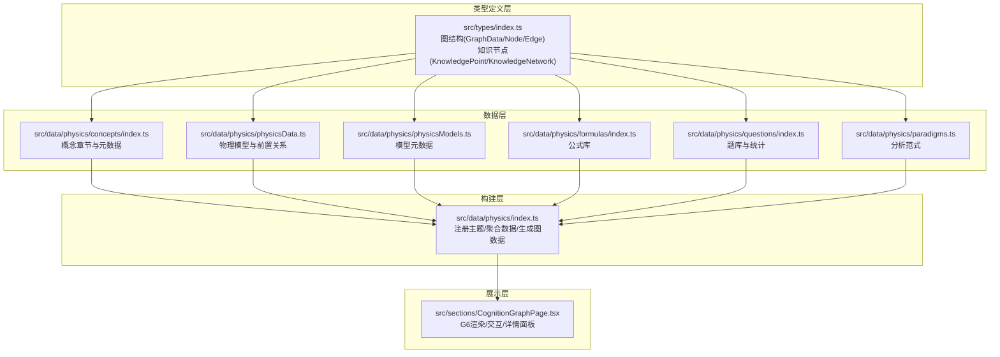
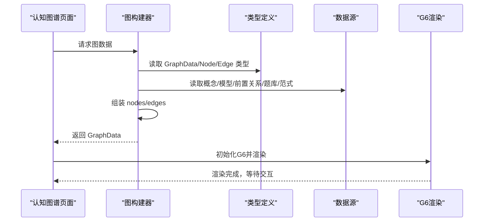
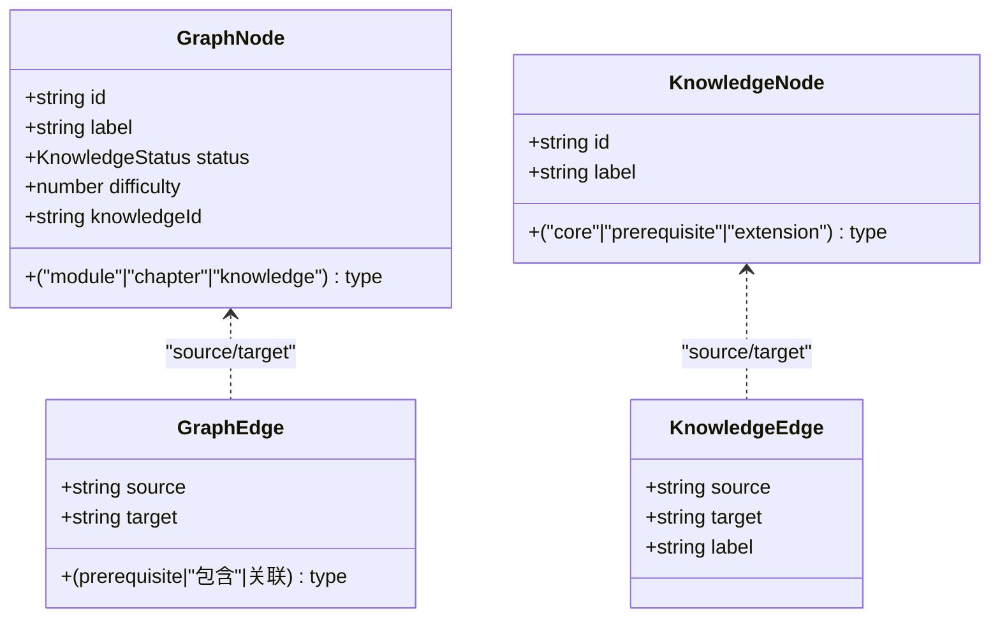
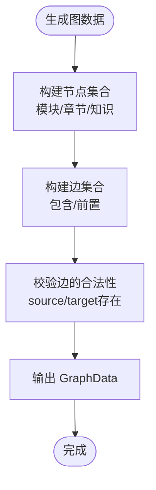
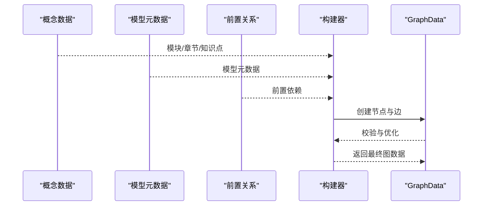
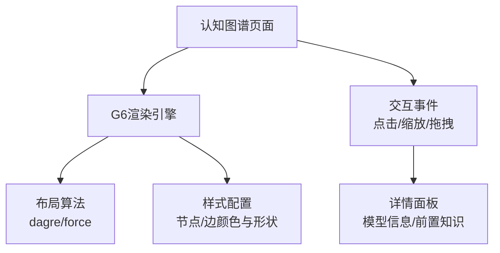
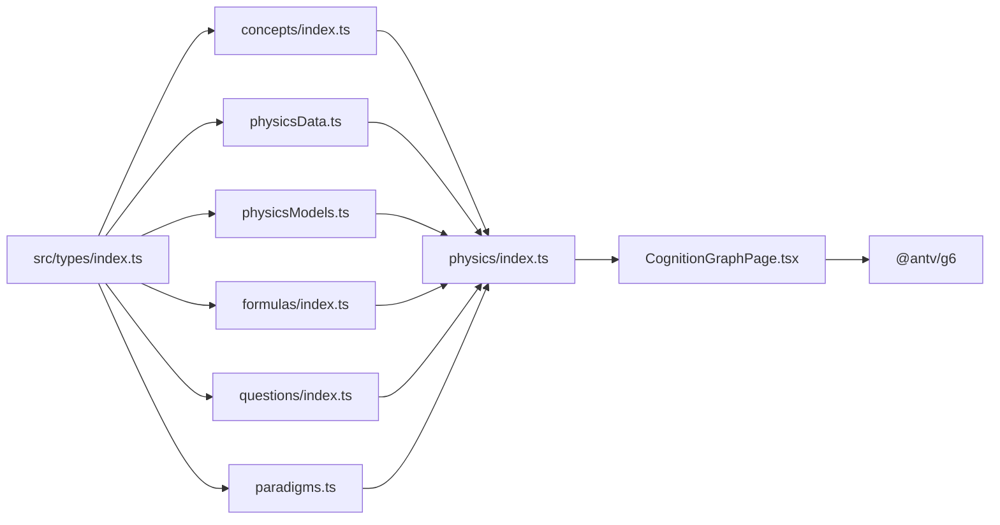

# 物理知识网络图数据结构

<cite>
**本文档引用的文件**
- [src/data/physics/index.ts](file://src/data/physics/index.ts)
- [src/data/physics/physicsData.ts](file://src/data/physics/physicsData.ts)
- [src/data/physics/concepts/index.ts](file://src/data/physics/concepts/index.ts)
- [src/data/physics/concepts/types.ts](file://src/data/physics/concepts/types.ts)
- [src/data/physics/knowledge/index.ts](file://src/data/physics/knowledge/index.ts)
- [src/data/physics/physicsModels.ts](file://src/data/physics/physicsModels.ts)
- [src/data/physics/formulas/index.ts](file://src/data/physics/formulas/index.ts)
- [src/data/physics/questions/index.ts](file://src/data/physics/questions/index.ts)
- [src/data/physics/paradigms.ts](file://src/data/physics/paradigms.ts)
- [src/types/index.ts](file://src/types/index.ts)
- [src/sections/CognitionGraphPage.tsx](file://src/sections/CognitionGraphPage.tsx)
- [docs/architecture/高中物理·知识网络与内容体系.md](file://docs/architecture/高中物理·知识网络与内容体系.md)
</cite>

## 目录
1. [简介](#简介)
2. [项目结构](#项目结构)
3. [核心组件](#核心组件)
4. [架构总览](#架构总览)
5. [详细组件分析](#详细组件分析)
6. [依赖分析](#依赖分析)
7. [性能考量](#性能考量)
8. [故障排除指南](#故障排除指南)
9. [结论](#结论)
10. [附录](#附录)

## 简介
本文件系统化阐述物理知识网络图的数据结构设计与实现，涵盖节点与边的定义、类型与属性、关系语义、构建算法、查询遍历与分析操作，以及可视化渲染与交互实现。文档基于实际代码仓库中的物理学科数据，确保内容可追溯、可落地。

## 项目结构
物理知识网络图的数据与展示分布在以下层次：
- 类型定义层：统一的图结构、节点、边、知识节点、策略、题目等类型定义
- 数据层：物理知识节点、物理模型、公式库、题库、范式等数据
- 构建层：从概念数据生成图结构、维护节点关系、更新学习状态
- 展示层：基于 G6 的认知图谱页面，支持缩放、点击、筛选与详情联动

**图表来源**
- [src/types/index.ts:190-209](file://src/types/index.ts#L190-L209)
- [src/data/physics/concepts/index.ts:102-196](file://src/data/physics/concepts/index.ts#L102-L196)
- [src/data/physics/physicsData.ts:4-138](file://src/data/physics/physicsData.ts#L4-L138)
- [src/data/physics/physicsModels.ts:22-66](file://src/data/physics/physicsModels.ts#L22-L66)
- [src/data/physics/formulas/index.ts:1-800](file://src/data/physics/formulas/index.ts#L1-L800)
- [src/data/physics/questions/index.ts:1-45](file://src/data/physics/questions/index.ts#L1-L45)
- [src/data/physics/paradigms.ts:15-30](file://src/data/physics/paradigms.ts#L15-L30)
- [src/data/physics/index.ts:383-432](file://src/data/physics/index.ts#L383-L432)
- [src/sections/CognitionGraphPage.tsx:17-252](file://src/sections/CognitionGraphPage.tsx#L17-L252)

**章节来源**
- [src/types/index.ts:190-209](file://src/types/index.ts#L190-L209)
- [src/data/physics/index.ts:1-433](file://src/data/physics/index.ts#L1-L433)
- [src/data/physics/physicsData.ts:1-138](file://src/data/physics/physicsData.ts#L1-L138)
- [src/data/physics/concepts/index.ts:1-196](file://src/data/physics/concepts/index.ts#L1-L196)
- [src/data/physics/physicsModels.ts:1-66](file://src/data/physics/physicsModels.ts#L1-L66)
- [src/data/physics/formulas/index.ts:1-800](file://src/data/physics/formulas/index.ts#L1-L800)
- [src/data/physics/questions/index.ts:1-45](file://src/data/physics/questions/index.ts#L1-L45)
- [src/data/physics/paradigms.ts:1-800](file://src/data/physics/paradigms.ts#L1-L800)
- [src/sections/CognitionGraphPage.tsx:1-252](file://src/sections/CognitionGraphPage.tsx#L1-L252)

## 核心组件
- 图数据结构
  - 节点：模块、章节、知识（模型）三类节点，具备类型、标签、难度、状态等属性
  - 边：包含关系（模块→章节/章节→知识）、前置关系（知识→知识）、关联关系（跨模块/跨章节）
- 知识节点（K层）：细粒度知识点，包含核心与前置两类子节点，以及二者之间的关系边
- 概念数据：章节划分、难度标注、前置知识检测、叙事正文、公式卡片、理解度自评、跨学科关联等
- 物理模型：42个模型的元数据，标注所属模块、章节、顺序
- 公式库：按章节与知识点聚合的公式卡片
- 题库：按模型分组的题目集合与统计
- 分析范式：90个分析范式，描述思维方法在问题类型中的结构化路径

**章节来源**
- [src/types/index.ts:190-209](file://src/types/index.ts#L190-L209)
- [src/data/physics/index.ts:300-326](file://src/data/physics/index.ts#L300-L326)
- [src/data/physics/concepts/types.ts:51-77](file://src/data/physics/concepts/types.ts#L51-L77)
- [src/data/physics/physicsModels.ts:22-66](file://src/data/physics/physicsModels.ts#L22-L66)
- [src/data/physics/formulas/index.ts:1-800](file://src/data/physics/formulas/index.ts#L1-L800)
- [src/data/physics/questions/index.ts:1-45](file://src/data/physics/questions/index.ts#L1-L45)
- [src/data/physics/paradigms.ts:15-30](file://src/data/physics/paradigms.ts#L15-L30)

## 架构总览
物理知识网络图的构建与展示遵循“数据→类型→构建→渲染”的分层架构。类型定义保证结构一致性；数据层提供概念、模型、公式、题库、范式等多源数据；构建层负责生成图数据；展示层基于 G6 渲染并提供交互。

**图表来源**
- [src/data/physics/index.ts:379-431](file://src/data/physics/index.ts#L379-L431)
- [src/types/index.ts:190-209](file://src/types/index.ts#L190-L209)
- [src/sections/CognitionGraphPage.tsx:25-112](file://src/sections/CognitionGraphPage.tsx#L25-L112)

**章节来源**
- [src/data/physics/index.ts:379-431](file://src/data/physics/index.ts#L379-L431)
- [src/sections/CognitionGraphPage.tsx:17-112](file://src/sections/CognitionGraphPage.tsx#L17-L112)

## 详细组件分析

### 节点与边的定义与属性
- 节点类型与属性
  - 模块节点：标识模块，如“力学”、“运动学”，用于组织章节与模型
  - 章节节点：标识具体章节，如“运动的描述”、“相互作用”
  - 知识节点（模型）：标识具体物理模型，如“匀变速直线运动”、“平抛运动”，包含难度、状态、所属模块与章节
  - 知识网络节点（K层）：核心与前置两类子节点，用于刻画知识点内部的依赖关系
- 边关系类型与语义
  - 包含关系：模块→章节、章节→知识，表示归属与挂载
  - 前置关系：知识→知识，表示学习顺序与依赖
  - 关联关系：跨模块/跨章节的知识关联（在当前实现中以“包含/前置”为主）

**图表来源**
- [src/types/index.ts:191-204](file://src/types/index.ts#L191-L204)
- [src/types/index.ts:61-71](file://src/types/index.ts#L61-L71)

**章节来源**
- [src/types/index.ts:191-204](file://src/types/index.ts#L191-L204)
- [src/types/index.ts:61-71](file://src/types/index.ts#L61-L71)
- [src/data/physics/index.ts:300-326](file://src/data/physics/index.ts#L300-L326)

### 节点类型与属性详解
- 模块节点（module）
  - 作用：顶层组织，承载多个章节
  - 属性：id、label、type='module'
- 章节节点（chapter）
  - 作用：承载多个知识节点（模型）
  - 属性：id、label、type='chapter'
- 知识节点（knowledge）
  - 作用：具体物理模型，承载难度、状态、所属模块与章节
  - 属性：id、label、type='knowledge'、status、difficulty、knowledgeId
- 知识网络节点（core/prerequisite/extension）
  - 作用：刻画知识点内部的依赖与关联
  - 属性：id、label、type

**章节来源**
- [src/types/index.ts:191-198](file://src/types/index.ts#L191-L198)
- [src/types/index.ts:61-65](file://src/types/index.ts#L61-L65)
- [src/data/physics/physicsData.ts:84-101](file://src/data/physics/physicsData.ts#L84-L101)

### 边关系类型与语义
- 包含关系（"包含"）
  - 语义：模块→章节、章节→知识，表示挂载与归属
- 前置关系（"prerequisite"）
  - 语义：知识→知识，表示学习顺序与依赖，如“匀变速直线运动”是“自由落体与竖直上抛”的前置
- 关联关系（跨模块/跨章节）
  - 语义：在当前实现中以“包含/前置”为主，未见显式“关联”边

**图表来源**
- [src/data/physics/physicsData.ts:81-120](file://src/data/physics/physicsData.ts#L81-L120)
- [src/data/physics/index.ts:379-381](file://src/data/physics/index.ts#L379-L381)

**章节来源**
- [src/data/physics/physicsData.ts:42-78](file://src/data/physics/physicsData.ts#L42-L78)
- [src/data/physics/index.ts:313-325](file://src/data/physics/index.ts#L313-L325)

### 构建算法：从概念数据生成图结构
- 数据来源
  - 概念章节与元数据：提供模块、章节、知识点的组织关系与难度
  - 物理模型元数据：提供模型的模块、章节、顺序
  - 前置关系：定义知识之间的依赖顺序
- 构建步骤
  1) 生成模块节点与章节节点
  2) 生成知识节点（模型），设置难度与状态
  3) 生成包含关系边（模块→章节、章节→知识）
  4) 生成前置关系边（知识→知识）
  5) 输出 GraphData

**图表来源**
- [src/data/physics/concepts/index.ts:102-196](file://src/data/physics/concepts/index.ts#L102-L196)
- [src/data/physics/physicsModels.ts:22-66](file://src/data/physics/physicsModels.ts#L22-L66)
- [src/data/physics/physicsData.ts:42-78](file://src/data/physics/physicsData.ts#L42-L78)
- [src/data/physics/index.ts:379-381](file://src/data/physics/index.ts#L379-L381)

**章节来源**
- [src/data/physics/concepts/index.ts:102-196](file://src/data/physics/concepts/index.ts#L102-L196)
- [src/data/physics/physicsModels.ts:22-66](file://src/data/physics/physicsModels.ts#L22-L66)
- [src/data/physics/physicsData.ts:42-78](file://src/data/physics/physicsData.ts#L42-L78)
- [src/data/physics/index.ts:379-381](file://src/data/physics/index.ts#L379-L381)

### 查询、遍历与分析操作
- 查询
  - 按节点类型过滤：仅显示模块或全部节点
  - 按难度筛选：基础/进阶/综合
  - 按状态筛选：未学/学习中/已掌握
- 遍历
  - 前驱遍历：从目标节点向上查找前置知识
  - 后继遍历：从起始节点向下查找后续知识
- 分析
  - 路径分析：基于前置关系边构建可达性与最短路径
  - 模块聚合：按模块统计知识节点数量与难度分布
  - 依赖分析：识别关键路径与瓶颈节点

**章节来源**
- [src/sections/CognitionGraphPage.tsx:37-44](file://src/sections/CognitionGraphPage.tsx#L37-L44)
- [src/sections/CognitionGraphPage.tsx:121-126](file://src/sections/CognitionGraphPage.tsx#L121-L126)

### 可视化渲染与交互
- 渲染引擎：G6
- 布局：模块视图使用 dagre，全量视图使用 force
- 节点样式：模块节点矩形，知识节点圆形；颜色与难度绑定
- 边样式：前置关系边带箭头，其他边较细
- 交互：点击节点显示详情、缩放、拖拽、切换视图模式

**图表来源**
- [src/sections/CognitionGraphPage.tsx:77-98](file://src/sections/CognitionGraphPage.tsx#L77-L98)
- [src/sections/CognitionGraphPage.tsx:114-119](file://src/sections/CognitionGraphPage.tsx#L114-L119)
- [src/sections/CognitionGraphPage.tsx:182-235](file://src/sections/CognitionGraphPage.tsx#L182-L235)

**章节来源**
- [src/sections/CognitionGraphPage.tsx:17-252](file://src/sections/CognitionGraphPage.tsx#L17-L252)

## 依赖分析
- 组件耦合
  - 类型定义（types）为所有数据与展示提供契约
  - 数据层（concepts/physicsData/physicsModels/formulas/questions/paradigms）向构建层提供数据
  - 构建层（physics/index）聚合数据并生成图数据
  - 展示层（CognitionGraphPage）依赖构建层输出的图数据
- 外部依赖
  - G6：图渲染与交互
  - React：页面与状态管理

**图表来源**
- [src/types/index.ts:190-209](file://src/types/index.ts#L190-L209)
- [src/data/physics/concepts/index.ts:1-196](file://src/data/physics/concepts/index.ts#L1-L196)
- [src/data/physics/physicsData.ts:1-138](file://src/data/physics/physicsData.ts#L1-L138)
- [src/data/physics/physicsModels.ts:1-66](file://src/data/physics/physicsModels.ts#L1-L66)
- [src/data/physics/formulas/index.ts:1-800](file://src/data/physics/formulas/index.ts#L1-L800)
- [src/data/physics/questions/index.ts:1-45](file://src/data/physics/questions/index.ts#L1-L45)
- [src/data/physics/paradigms.ts:1-800](file://src/data/physics/paradigms.ts#L1-L800)
- [src/data/physics/index.ts:379-431](file://src/data/physics/index.ts#L379-L431)
- [src/sections/CognitionGraphPage.tsx:2-32](file://src/sections/CognitionGraphPage.tsx#L2-L32)

**章节来源**
- [src/data/physics/index.ts:383-431](file://src/data/physics/index.ts#L383-L431)
- [src/sections/CognitionGraphPage.tsx:2-32](file://src/sections/CognitionGraphPage.tsx#L2-L32)

## 性能考量
- 图规模与渲染
  - 节点与边数量较多时，优先使用模块视图（dagre）以提升布局效率
  - 全量视图（force）适合局部探索，避免全局大规模重算
- 数据访问
  - 使用 Map/Set 快速过滤节点与边，减少遍历成本
  - 按需加载：仅在切换视图或点击节点时重新渲染
- 交互响应
  - 缩放与拖拽采用 G6 默认行为，保持流畅体验
  - 详情面板异步加载模型与前置知识，避免阻塞主线程

[本节为通用指导，无需特定文件引用]

## 故障排除指南
- G6 初始化失败
  - 现象：加载中动画持续，无图谱渲染
  - 排查：检查容器尺寸、异步导入是否成功、GraphData 是否为空
  - 参考：[src/sections/CognitionGraphPage.tsx:27-104](file://src/sections/CognitionGraphPage.tsx#L27-L104)
- 节点/边缺失
  - 现象：某些节点或边未显示
  - 排查：确认过滤逻辑（仅模块视图/全量视图）、source/target 是否存在于节点集合
  - 参考：[src/sections/CognitionGraphPage.tsx:37-44](file://src/sections/CognitionGraphPage.tsx#L37-L44)
- 前置知识查询为空
  - 现象：点击知识节点后“前置知识”为空
  - 排查：确认 GraphData 中是否存在 type='prerequisite' 的边，以及目标节点是否存在
  - 参考：[src/sections/CognitionGraphPage.tsx:121-126](file://src/sections/CognitionGraphPage.tsx#L121-L126)

**章节来源**
- [src/sections/CognitionGraphPage.tsx:27-104](file://src/sections/CognitionGraphPage.tsx#L27-L104)
- [src/sections/CognitionGraphPage.tsx:37-44](file://src/sections/CognitionGraphPage.tsx#L37-L44)
- [src/sections/CognitionGraphPage.tsx:121-126](file://src/sections/CognitionGraphPage.tsx#L121-L126)

## 结论
本文档系统化梳理了物理知识网络图的数据结构与实现，明确了节点与边的定义、类型与属性、关系语义、构建算法、查询遍历与分析操作，以及可视化渲染与交互。该架构以类型定义为契约，以多源数据为支撑，以构建器为核心，以 G6 为渲染引擎，形成了清晰、可扩展、可维护的知识图谱体系。

[本节为总结性内容，无需特定文件引用]

## 附录
- 相关文档与背景
  - 《高中物理·知识网络与内容体系》：定义了知识网络、物理模型、分析范式的三层组织架构与依赖关系
  - 参考：[docs/architecture/高中物理·知识网络与内容体系.md:247-478](file://docs/architecture/高中物理·知识网络与内容体系.md#L247-L478)

**章节来源**
- [docs/architecture/高中物理·知识网络与内容体系.md:247-478](file://docs/architecture/高中物理·知识网络与内容体系.md#L247-L478)