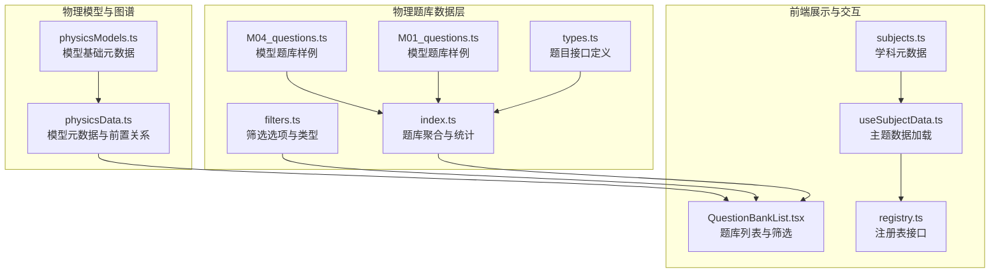
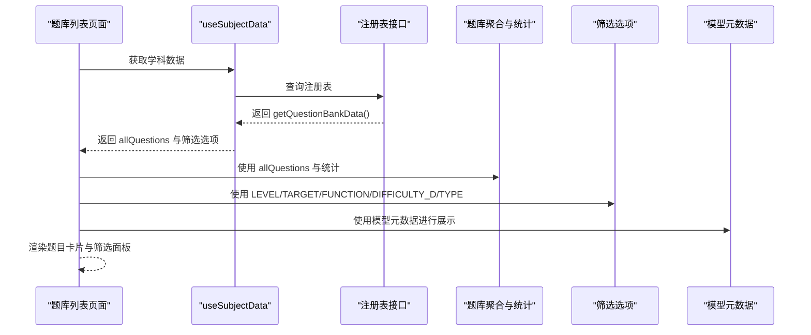
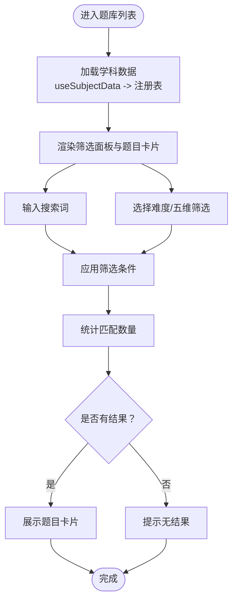
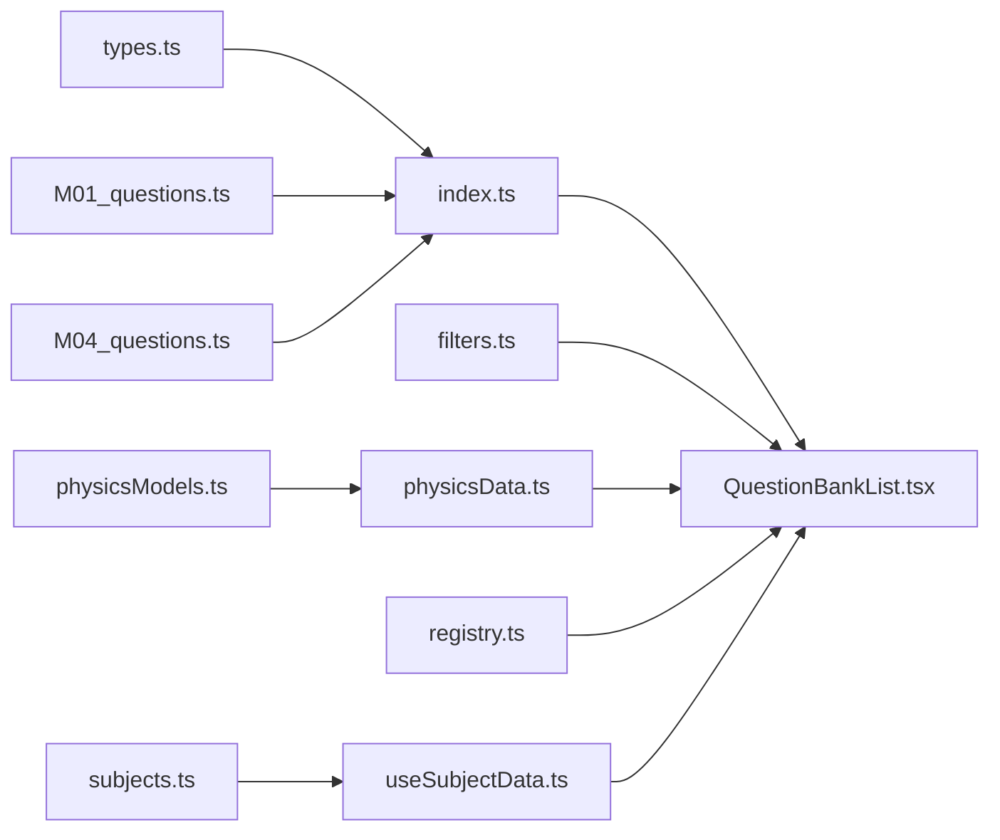

# 物理练习题库数据结构（P层）

<cite>
**本文引用的文件**
- [src/data/physics/questions/types.ts](file://src/data/physics/questions/types.ts)
- [src/data/physics/questions/index.ts](file://src/data/physics/questions/index.ts)
- [src/data/physics/questions/filters.ts](file://src/data/physics/questions/filters.ts)
- [src/data/physics/questions/M01_questions.ts](file://src/data/physics/questions/M01_questions.ts)
- [src/data/physics/questions/M04_questions.ts](file://src/data/physics/questions/M04_questions.ts)
- [src/data/physics/physicsData.ts](file://src/data/physics/physicsData.ts)
- [src/data/physics/physicsModels.ts](file://src/data/physics/physicsModels.ts)
- [src/sections/QuestionBankList.tsx](file://src/sections/QuestionBankList.tsx)
- [src/hooks/useSubjectData.ts](file://src/hooks/useSubjectData.ts)
- [src/data/registry.ts](file://src/data/registry.ts)
- [src/data/subjects.ts](file://src/data/subjects.ts)
</cite>

## 目录
1. [简介](#简介)
2. [项目结构](#项目结构)
3. [核心组件](#核心组件)
4. [架构总览](#架构总览)
5. [详细组件分析](#详细组件分析)
6. [依赖分析](#依赖分析)
7. [性能考虑](#性能考虑)
8. [故障排查指南](#故障排查指南)
9. [结论](#结论)
10. [附录](#附录)

## 简介
本文件系统化梳理物理练习题库（P层）的数据结构与筛选机制，覆盖题目字段定义、题型分类体系、五维筛选条件、统计数据结构、以及查询/排序/分页/搜索的实现思路与索引优化策略。目标是帮助开发者与产品人员快速理解并高效扩展物理题库数据。

## 项目结构
物理题库相关代码集中在 src/data/physics/questions 下，配合 src/data/physics/physicsData.ts 提供模型元数据与图谱数据，前端页面通过 src/sections/QuestionBankList.tsx 展示与筛选，数据加载与注册通过 src/hooks/useSubjectData.ts 与 src/data/registry.ts 协调。

**图表来源**
- [src/data/physics/questions/types.ts:1-35](file://src/data/physics/questions/types.ts#L1-L35)
- [src/data/physics/questions/index.ts:1-45](file://src/data/physics/questions/index.ts#L1-L45)
- [src/data/physics/questions/filters.ts:1-56](file://src/data/physics/questions/filters.ts#L1-L56)
- [src/data/physics/questions/M01_questions.ts:1-161](file://src/data/physics/questions/M01_questions.ts#L1-L161)
- [src/data/physics/questions/M04_questions.ts:1-175](file://src/data/physics/questions/M04_questions.ts#L1-L175)
- [src/data/physics/physicsData.ts:1-138](file://src/data/physics/physicsData.ts#L1-L138)
- [src/data/physics/physicsModels.ts:1-66](file://src/data/physics/physicsModels.ts#L1-L66)
- [src/sections/QuestionBankList.tsx:1-424](file://src/sections/QuestionBankList.tsx#L1-L424)
- [src/hooks/useSubjectData.ts:1-46](file://src/hooks/useSubjectData.ts#L1-L46)
- [src/data/registry.ts:1-52](file://src/data/registry.ts#L1-L52)
- [src/data/subjects.ts:1-30](file://src/data/subjects.ts#L1-L30)

**章节来源**
- [src/data/physics/questions/types.ts:1-35](file://src/data/physics/questions/types.ts#L1-L35)
- [src/data/physics/questions/index.ts:1-45](file://src/data/physics/questions/index.ts#L1-L45)
- [src/data/physics/questions/filters.ts:1-56](file://src/data/physics/questions/filters.ts#L1-L56)
- [src/data/physics/questions/M01_questions.ts:1-161](file://src/data/physics/questions/M01_questions.ts#L1-L161)
- [src/data/physics/questions/M04_questions.ts:1-175](file://src/data/physics/questions/M04_questions.ts#L1-L175)
- [src/data/physics/physicsData.ts:1-138](file://src/data/physics/physicsData.ts#L1-L138)
- [src/data/physics/physicsModels.ts:1-66](file://src/data/physics/physicsModels.ts#L1-L66)
- [src/sections/QuestionBankList.tsx:1-424](file://src/sections/QuestionBankList.tsx#L1-L424)
- [src/hooks/useSubjectData.ts:1-46](file://src/hooks/useSubjectData.ts#L1-L46)
- [src/data/registry.ts:1-52](file://src/data/registry.ts#L1-L52)
- [src/data/subjects.ts:1-30](file://src/data/subjects.ts#L1-L30)

## 核心组件
- 题目接口定义（Question）：统一承载题目ID、学科标识、模块章节、知识点关联、套路关联、题目类型、难度等级、内容、选项、答案、解析、提示、来源、年份标签、标签分类等字段。
- 题库聚合与统计：按模型分组题目、输出模型题库概览（难度分布与总数）。
- 筛选选项与类型：定义能力层级、学习目标、题目功能、六级难度、题型等筛选维度。
- 模型元数据与图谱：提供模型基础信息与前置关系，支撑题库与模型的关联管理。
- 前端题库列表：实现搜索、筛选、难度标签、分页占位等交互。

**章节来源**
- [src/data/physics/questions/types.ts:4-35](file://src/data/physics/questions/types.ts#L4-L35)
- [src/data/physics/questions/index.ts:5-37](file://src/data/physics/questions/index.ts#L5-L37)
- [src/data/physics/questions/filters.ts:1-56](file://src/data/physics/questions/filters.ts#L1-L56)
- [src/data/physics/physicsData.ts:4-39](file://src/data/physics/physicsData.ts#L4-L39)
- [src/sections/QuestionBankList.tsx:29-83](file://src/sections/QuestionBankList.tsx#L29-L83)

## 架构总览
物理题库数据从“模型题库文件”汇聚到“题库聚合”，再通过“注册表接口”暴露给前端页面。前端页面基于“筛选选项”与“搜索输入”对题目进行过滤，并以卡片形式展示。

**图表来源**
- [src/sections/QuestionBankList.tsx:29-83](file://src/sections/QuestionBankList.tsx#L29-L83)
- [src/hooks/useSubjectData.ts:7-46](file://src/hooks/useSubjectData.ts#L7-L46)
- [src/data/registry.ts:25-34](file://src/data/registry.ts#L25-L34)
- [src/data/physics/questions/index.ts:1-45](file://src/data/physics/questions/index.ts#L1-L45)
- [src/data/physics/questions/filters.ts:1-56](file://src/data/physics/questions/filters.ts#L1-L56)
- [src/data/physics/physicsModels.ts:22-65](file://src/data/physics/physicsModels.ts#L22-L65)

## 详细组件分析

### 题目数据结构（Question）
- 字段说明
  - 标识与归属：id、modelId
  - 难度与类型：difficulty（B/J/T）、type（选择题/填空题/计算题/多选题/图像分析题/多过程综合计算题/实验设计题/选做题）、estimatedMinutes、tags、hint
  - 内容与解析：question（支持Markdown）、options（选择题可用，填空/计算题为null）、answer、explanation（支持Markdown）
  - 关联：points（知识点ID数组）、routineIds（套路ID数组，可选）
  - 五维筛选：level（L1/L2/L3）、target（SYNC/EXAM/GAOKAO/FOUNDATION/COMPETE）、function（DIAG/PRACTICE/VARIATION/INTEGRATED/REAL/METHOD）、difficultyD（1~6）
- 设计要点
  - 采用可空字段处理不同题型差异（如选择题的选项）
  - 通过 difficulty 与 difficultyD 双层难度标注，便于用户与系统使用
  - routineIds 支持与套路体系联动，便于方法训练与迁移

**章节来源**
- [src/data/physics/questions/types.ts:4-35](file://src/data/physics/questions/types.ts#L4-L35)

### 题库聚合与统计
- 聚合：将多个模型题库合并为 allQuestions
- 分组：按 modelId 分组存储
- 统计：输出每个模型的 B/J/T 数量与总数，便于列表页展示

**章节来源**
- [src/data/physics/questions/index.ts:5-37](file://src/data/physics/questions/index.ts#L5-L37)

### 筛选选项与类型
- 能力层级：L1（诊断）、L2（模型题）、L3（综合）
- 学习目标：SYNC（同步学习）、EXAM（期末考试）、GAOKAO（高考备考）、FOUNDATION（强基校测）、COMPETE（学科竞赛）
- 题目功能：DIAG（诊断题）、PRACTICE（巩固题）、VARIATION（变式题）、INTEGRATED（综合题）、REAL（真题）、METHOD（方法题）
- 六级难度：D1（识记）、D2（辨析）、D3（应用）、D4（综合）、D5（高考）、D6（压轴）
- 题型：选择题、多选题、填空题、计算题、图像分析题、多过程综合计算题、实验设计题、选做题
- 类型定义：提供枚举值与类型别名，确保前端与数据层一致

**章节来源**
- [src/data/physics/questions/filters.ts:1-56](file://src/data/physics/questions/filters.ts#L1-L56)

### 模型元数据与图谱
- 模型元数据：包含 id、title、module、chapter、order 等，用于页面展示与导航
- 前置关系：定义模型间的依赖边，用于生成认知图谱
- 图谱数据：生成节点与边，包含模块与模型节点、包含关系与前置关系

**章节来源**
- [src/data/physics/physicsModels.ts:22-65](file://src/data/physics/physicsModels.ts#L22-L65)
- [src/data/physics/physicsData.ts:4-39](file://src/data/physics/physicsData.ts#L4-L39)
- [src/data/physics/physicsData.ts:81-120](file://src/data/physics/physicsData.ts#L81-L120)

### 前端题库列表与筛选
- 搜索：支持题目内容与标签的模糊匹配
- 难度：支持 B/J/T 三级筛选
- 五维筛选：能力层级、学习目标、题目功能、六级难度、题型
- 展示：难度标签、题型、模型名称、标签、预估时长等
- 分页：当前实现为一次性渲染，建议后续引入虚拟滚动或服务端分页

**图表来源**
- [src/sections/QuestionBankList.tsx:29-83](file://src/sections/QuestionBankList.tsx#L29-L83)
- [src/sections/QuestionBankList.tsx:387-419](file://src/sections/QuestionBankList.tsx#L387-L419)

**章节来源**
- [src/sections/QuestionBankList.tsx:29-424](file://src/sections/QuestionBankList.tsx#L29-L424)
- [src/hooks/useSubjectData.ts:7-46](file://src/hooks/useSubjectData.ts#L7-L46)
- [src/data/registry.ts:25-34](file://src/data/registry.ts#L25-L34)

### 题型分类体系
- 单选题：支持选项数组与唯一答案
- 多选题：支持选项数组与多个答案
- 填空题：无选项，答案为字符串
- 计算题：无选项，答案为字符串（可能包含数值与单位）
- 图像分析题：题干包含图像信息，答案为文字或数值
- 多过程综合计算题：涉及多个物理过程的复杂计算
- 实验设计题：要求设计实验方案或分析实验数据
- 选做题：可选题目，通常用于拓展或竞赛

**章节来源**
- [src/data/physics/questions/types.ts](file://src/data/physics/questions/types.ts#L9)
- [src/data/physics/questions/filters.ts:33-42](file://src/data/physics/questions/filters.ts#L33-L42)

### 题目筛选过滤机制
- 难度选项：B/J/T 三级难度筛选
- 层级选项：L1/L2/L3 能力层级筛选
- 目标选项：SYNC/EXAM/GAOKAO/FOUNDATION/COMPETE 学习目标筛选
- 功能选项：DIAG/PRACTICE/VARIATION/INTEGRATED/REAL/METHOD 题目功能筛选
- 类型选项：选择题/多选题/填空题/计算题/图像分析题/多过程综合计算题/实验设计题/选做题
- 搜索：支持题目内容与标签的模糊匹配

**章节来源**
- [src/sections/QuestionBankList.tsx:69-83](file://src/sections/QuestionBankList.tsx#L69-L83)
- [src/data/physics/questions/filters.ts:1-56](file://src/data/physics/questions/filters.ts#L1-L56)

### 题目统计数据结构
- 模型题目统计：按模型统计 B/J/T 数量与总数
- 难度分布：按 difficulty 分组统计
- 使用频率：可通过埋点与日志采集，结合后端统计接口实现

**章节来源**
- [src/data/physics/questions/index.ts:19-37](file://src/data/physics/questions/index.ts#L19-L37)

### 查询、排序、分页、搜索实现示例
- 查询：基于 allQuestions 的数组过滤
- 排序：可按 difficulty、difficultyD、estimatedMinutes 或创建时间排序
- 分页：建议采用虚拟滚动或服务端分页，避免一次性渲染大量题目
- 搜索：支持题目内容与标签的模糊匹配

**章节来源**
- [src/sections/QuestionBankList.tsx:69-83](file://src/sections/QuestionBankList.tsx#L69-L83)

### 题目与知识点、模型的关联关系管理与索引优化策略
- 关联关系
  - 题目与模型：通过 modelId 关联
  - 题目与知识点：通过 points 关联
  - 题目与套路：通过 routineIds 关联
- 索引优化
  - 前端：对 allQuestions 建立索引（如按 modelId、points、type、difficultyD 建立 Map）
  - 后端：数据库层面为 modelId、points、type、difficultyD 建立索引，支持高效查询与统计
  - 缓存：对高频查询结果（如模型题库概览）进行缓存

**章节来源**
- [src/data/physics/questions/types.ts:25-28](file://src/data/physics/questions/types.ts#L25-L28)
- [src/data/physics/questions/index.ts:13-17](file://src/data/physics/questions/index.ts#L13-L17)

## 依赖分析
- 数据层依赖
  - types.ts 定义题目接口
  - index.ts 聚合题目与统计
  - filters.ts 定义筛选选项
  - M01/M04 等模型题库文件提供具体题目数据
  - physicsModels.ts 与 physicsData.ts 提供模型元数据与图谱
- 前端依赖
  - QuestionBankList.tsx 依赖 useSubjectData 与注册表接口
  - useSubjectData.ts 依赖注册表与学科元数据

**图表来源**
- [src/data/physics/questions/types.ts:1-35](file://src/data/physics/questions/types.ts#L1-L35)
- [src/data/physics/questions/index.ts:1-45](file://src/data/physics/questions/index.ts#L1-L45)
- [src/data/physics/questions/filters.ts:1-56](file://src/data/physics/questions/filters.ts#L1-L56)
- [src/data/physics/questions/M01_questions.ts:1-161](file://src/data/physics/questions/M01_questions.ts#L1-L161)
- [src/data/physics/questions/M04_questions.ts:1-175](file://src/data/physics/questions/M04_questions.ts#L1-L175)
- [src/data/physics/physicsModels.ts:1-66](file://src/data/physics/physicsModels.ts#L1-L66)
- [src/data/physics/physicsData.ts:1-138](file://src/data/physics/physicsData.ts#L1-L138)
- [src/sections/QuestionBankList.tsx:1-424](file://src/sections/QuestionBankList.tsx#L1-L424)
- [src/hooks/useSubjectData.ts:1-46](file://src/hooks/useSubjectData.ts#L1-L46)
- [src/data/registry.ts:1-52](file://src/data/registry.ts#L1-L52)
- [src/data/subjects.ts:1-30](file://src/data/subjects.ts#L1-L30)

**章节来源**
- [src/data/physics/questions/types.ts:1-35](file://src/data/physics/questions/types.ts#L1-L35)
- [src/data/physics/questions/index.ts:1-45](file://src/data/physics/questions/index.ts#L1-L45)
- [src/data/physics/questions/filters.ts:1-56](file://src/data/physics/questions/filters.ts#L1-L56)
- [src/data/physics/questions/M01_questions.ts:1-161](file://src/data/physics/questions/M01_questions.ts#L1-L161)
- [src/data/physics/questions/M04_questions.ts:1-175](file://src/data/physics/questions/M04_questions.ts#L1-L175)
- [src/data/physics/physicsModels.ts:1-66](file://src/data/physics/physicsModels.ts#L1-L66)
- [src/data/physics/physicsData.ts:1-138](file://src/data/physics/physicsData.ts#L1-L138)
- [src/sections/QuestionBankList.tsx:1-424](file://src/sections/QuestionBankList.tsx#L1-L424)
- [src/hooks/useSubjectData.ts:1-46](file://src/hooks/useSubjectData.ts#L1-L46)
- [src/data/registry.ts:1-52](file://src/data/registry.ts#L1-L52)
- [src/data/subjects.ts:1-30](file://src/data/subjects.ts#L1-L30)

## 性能考虑
- 前端渲染
  - 一次性渲染大量题目会导致卡顿，建议采用虚拟滚动或分页
  - 对 allQuestions 建立索引（按 modelId、points、type、difficultyD），减少重复遍历
- 搜索与筛选
  - 将搜索词标准化（小写、去空白），提升匹配效率
  - 优先应用最窄范围的筛选条件，减少后续过滤成本
- 数据加载
  - 使用注册表接口延迟加载学科数据，避免首屏阻塞
  - 对高频统计（如模型题库概览）进行缓存

## 故障排查指南
- 题目未显示
  - 检查模型题库文件是否正确导出并被 index.ts 聚合
  - 确认 modelId 是否与模型元数据一致
- 筛选无效
  - 检查筛选选项是否与题目字段一致（如 difficulty、type、level、target、function、difficultyD）
  - 确认前端筛选逻辑是否正确应用到 allQuestions
- 搜索无结果
  - 检查搜索词是否包含在 question 或 tags 中
  - 确认大小写与特殊字符处理逻辑
- 加载缓慢
  - 检查是否启用虚拟滚动或分页
  - 对高频查询结果进行缓存

**章节来源**
- [src/data/physics/questions/index.ts:5-17](file://src/data/physics/questions/index.ts#L5-L17)
- [src/sections/QuestionBankList.tsx:69-83](file://src/sections/QuestionBankList.tsx#L69-L83)

## 结论
物理练习题库（P层）通过清晰的题目接口、完善的筛选体系与统计结构，实现了从数据到页面的高效流转。建议在保持现有结构稳定的基础上，逐步引入索引优化、虚拟滚动与服务端分页，以进一步提升性能与用户体验。

## 附录
- 示例：M01 与 M04 模型题库展示了不同难度与题型的题目组织方式，可作为新增模型题库的参考模板
- 扩展建议：新增模型题库时，遵循 types.ts 的接口定义，完善 filters.ts 的筛选选项，并在 index.ts 中进行聚合与统计

**章节来源**
- [src/data/physics/questions/M01_questions.ts:1-161](file://src/data/physics/questions/M01_questions.ts#L1-L161)
- [src/data/physics/questions/M04_questions.ts:1-175](file://src/data/physics/questions/M04_questions.ts#L1-L175)
- [src/data/physics/questions/types.ts:4-35](file://src/data/physics/questions/types.ts#L4-L35)
- [src/data/physics/questions/filters.ts:1-56](file://src/data/physics/questions/filters.ts#L1-L56)
- [src/data/physics/questions/index.ts:5-37](file://src/data/physics/questions/index.ts#L5-L37)