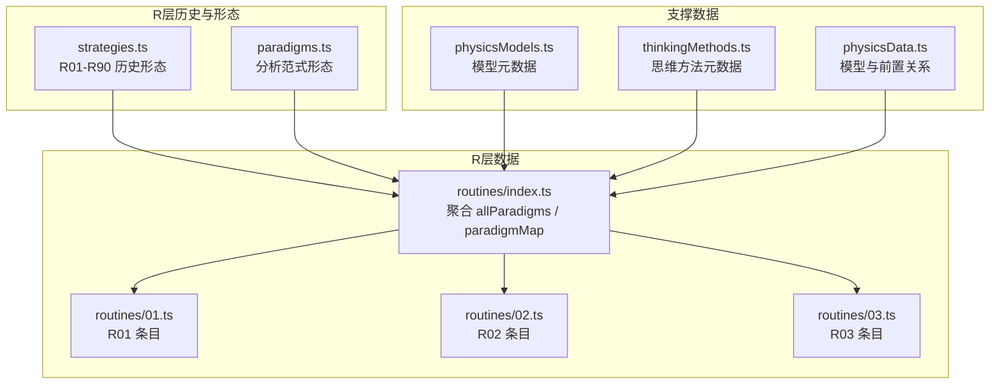
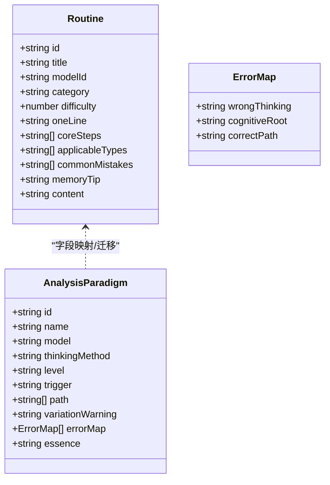
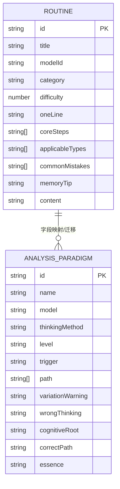
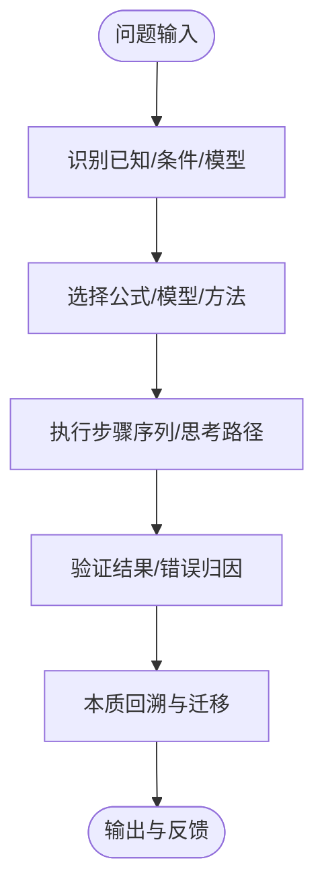
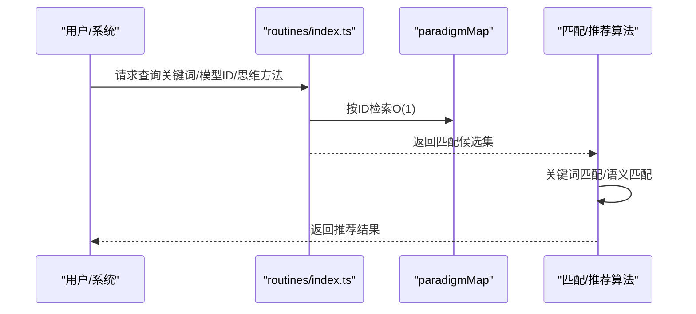
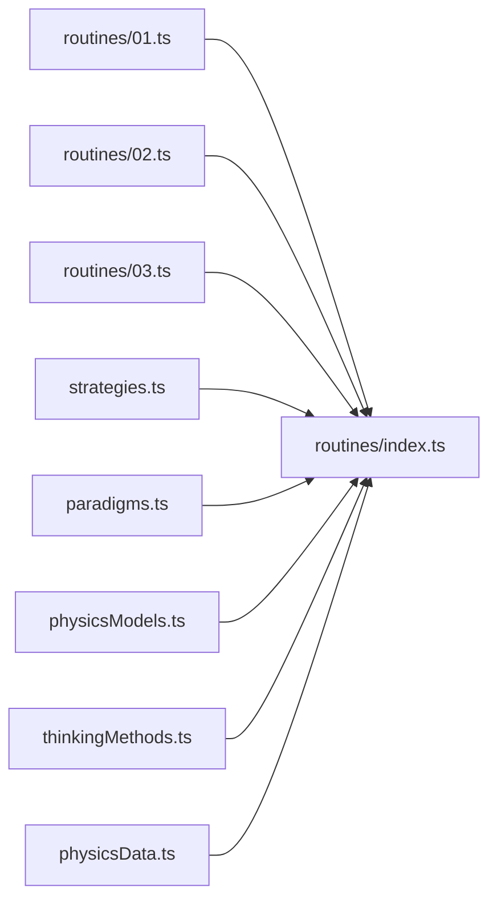

# 物理解题套路数据结构（R层）

<cite>
**本文引用的文件**
- [strategies.ts](file://src/data/physics/strategies.ts)
- [paradigms.ts](file://src/data/physics/paradigms.ts)
- [index.ts](file://src/data/physics/routines/index.ts)
- [01.ts](file://src/data/physics/routines/01.ts)
- [02.ts](file://src/data/physics/routines/02.ts)
- [03.ts](file://src/data/physics/routines/03.ts)
- [physicsData.ts](file://src/data/physics/physicsData.ts)
- [thinkingMethods.ts](file://src/data/physics/thinkingMethods.ts)
- [physicsModels.ts](file://src/data/physics/physicsModels.ts)
</cite>

## 目录
1. [引言](#引言)
2. [项目结构](#项目结构)
3. [核心组件](#核心组件)
4. [架构总览](#架构总览)
5. [详细组件分析](#详细组件分析)
6. [依赖分析](#依赖分析)
7. [性能考量](#性能考量)
8. [故障排查指南](#故障排查指南)
9. [结论](#结论)
10. [附录](#附录)

## 引言
本文件聚焦“物理解题套路数据结构（R层）”，系统阐述物理R层（解题套路）的数据模型、字段定义、分类体系、典型套路与应用场景、步骤的有序性与递进关系、检索与匹配算法、以及扩展与版本控制实践。R层数据以“套路”为核心载体，既承载“解题步骤序列”的执行路径，也承载“错误归因图谱”“思维方法”“模型归属”等认知要素，服务于智能推荐、自适应学习与知识图谱联动。

## 项目结构
R层数据位于物理数据目录下，采用“模块化+索引聚合”的组织方式：
- routines/index.ts：R层套路的聚合入口，导出 allParadigms 与 paradigmMap，便于按ID快速检索。
- routines/*.ts：每个 PHY-Rxx 的具体套路条目，包含标准化字段与错误归因。
- strategies.ts：R01-R90 的历史版本数据，包含更丰富的字段（如 oneLine、applicableTypes、commonMistakes 等），用于迁移与对照。
- paradigms.ts：R层数据的“分析范式”形态，字段更贴近“思维—路径—错误—本质”的认知加工模型。
- physicsData.ts：物理模型元数据与前置关系，支撑“套路-模型-知识”的关联。
- thinkingMethods.ts：物理思维方法元数据，支撑“套路-思维方法”的关联。
- physicsModels.ts：物理模型基础元数据，支撑“套路-模型”的映射。

图表来源
- [index.ts:1-279](file://src/data/physics/routines/index.ts#L1-L279)
- [01.ts:1-22](file://src/data/physics/routines/01.ts#L1-L22)
- [02.ts:1-23](file://src/data/physics/routines/02.ts#L1-L23)
- [03.ts:1-23](file://src/data/physics/routines/03.ts#L1-L23)
- [strategies.ts:1-1920](file://src/data/physics/strategies.ts#L1-L1920)
- [paradigms.ts:1-1978](file://src/data/physics/paradigms.ts#L1-L1978)
- [physicsModels.ts:1-66](file://src/data/physics/physicsModels.ts#L1-L66)
- [thinkingMethods.ts:1-691](file://src/data/physics/thinkingMethods.ts#L1-L691)
- [physicsData.ts:1-138](file://src/data/physics/physicsData.ts#L1-L138)

章节来源
- [index.ts:1-279](file://src/data/physics/routines/index.ts#L1-L279)
- [strategies.ts:1-1920](file://src/data/physics/strategies.ts#L1-L1920)
- [paradigms.ts:1-1978](file://src/data/physics/paradigms.ts#L1-L1978)
- [physicsModels.ts:1-66](file://src/data/physics/physicsModels.ts#L1-L66)
- [thinkingMethods.ts:1-691](file://src/data/physics/thinkingMethods.ts#L1-L691)
- [physicsData.ts:1-138](file://src/data/physics/physicsData.ts#L1-L138)

## 核心组件
- Routine（历史形态）：来自 strategies.ts 的 R01-R90，字段覆盖“套路ID、标题、模型ID、类别、难度、一句话口诀、核心步骤、适用类型、常见错误、记忆口诀、内容”。适用于传统“步骤+错误清单”的教学与复习。
- AnalysisParadigm（分析范式形态）：来自 paradigms.ts，字段覆盖“ID、名称、模型、思维方法、级别、触发信号、思考路径、变式预警、错误归因图谱、本质回溯”。强调“触发—路径—错误—本质”的认知加工闭环。
- 聚合入口 routines/index.ts：导出 allParadigms 与 paradigmMap，支持按ID检索与批量访问。
- 支撑数据：
  - physicsModels.ts：模型元数据，支撑“套路-模型”映射。
  - thinkingMethods.ts：思维方法元数据，支撑“套路-思维方法”映射。
  - physicsData.ts：模型前置关系与认知图谱生成，支撑“套路-知识”关联。

章节来源
- [strategies.ts:5-17](file://src/data/physics/strategies.ts#L5-L17)
- [paradigms.ts:15-30](file://src/data/physics/paradigms.ts#L15-L30)
- [index.ts:95-279](file://src/data/physics/routines/index.ts#L95-L279)
- [physicsModels.ts:12-18](file://src/data/physics/physicsModels.ts#L12-L18)
- [thinkingMethods.ts:4-49](file://src/data/physics/thinkingMethods.ts#L4-L49)
- [physicsData.ts:1-138](file://src/data/physics/physicsData.ts#L1-L138)

## 架构总览
R层数据的“形态-聚合-支撑”三层架构：
- 形态层：strategies.ts（Routine）与 paradigms.ts（AnalysisParadigm）提供两种数据形态，满足不同阶段的教学与认知加工需求。
- 聚合层：routines/index.ts 将各 PHY-Rxx 条目聚合为 allParadigms 与 paradigmMap，统一检索入口。
- 支撑层：physicsModels.ts、thinkingMethods.ts、physicsData.ts 提供模型、思维方法与知识图谱的关联，形成“套路-模型-知识-思维”的多维关联。

图表来源
- [strategies.ts:5-17](file://src/data/physics/strategies.ts#L5-L17)
- [paradigms.ts:15-30](file://src/data/physics/paradigms.ts#L15-L30)

章节来源
- [strategies.ts:1-1920](file://src/data/physics/strategies.ts#L1-L1920)
- [paradigms.ts:1-1978](file://src/data/physics/paradigms.ts#L1-L1978)

## 详细组件分析

### 数据模型与字段定义
- Routine（strategies.ts）
  - 字段：id、title、modelId、category、difficulty、oneLine、coreSteps、applicableTypes、commonMistakes、memoryTip、content。
  - 适用：传统教学与复习，强调“步骤+口诀+错误清单”。
- AnalysisParadigm（paradigms.ts）
  - 字段：id、name、model、thinkingMethod、level、trigger、path、variationWarning、errorMap、essence。
  - 适用：认知加工与智能推荐，强调“触发—路径—错误—本质”。

图表来源
- [strategies.ts:5-17](file://src/data/physics/strategies.ts#L5-L17)
- [paradigms.ts:15-30](file://src/data/physics/paradigms.ts#L15-L30)

章节来源
- [strategies.ts:5-17](file://src/data/physics/strategies.ts#L5-L17)
- [paradigms.ts:15-30](file://src/data/physics/paradigms.ts#L15-L30)

### 典型套路与应用场景
- 运动学基础
  - 匀变速公式三步选择法（R01）：强调“给什么→选什么”的信号识别，避免盲目套用公式。
  - v-t 图像面积法（R02）：将“位移=面积”可视化，强调正负面积与组合计算。
  - 相对运动换参考系法（R03）：将双体问题降级为单体问题，强调“视角切换”。
- 力学基础与模型
  - 整体法与隔离法（R16）：先整体求加速度，再隔离求内力，强调“先整体后隔离”的流程。
  - 传送带模型（R24）：速度相等临界点的分段处理，强调“共速突变”。
  - 板块模型（R25）：最大静摩擦与所需摩擦的比较，判断是否相对滑动。
- 能量与动量
  - 动能定理（R35）：将“合外力做功=动能变化”作为单体应用的通法。
  - 机械能守恒（R37）：判断条件与列式，强调“只有重力/弹力做功”。
  - 子弹打木块（R31）：动量守恒求共同速度，能量损失算热量。
- 电磁感应
  - 变力做功（R36）：微元法将变力做功转化为积分，强调“取极限后近似变精确”。

章节来源
- [strategies.ts:25-204](file://src/data/physics/strategies.ts#L25-L204)
- [paradigms.ts:62-122](file://src/data/physics/paradigms.ts#L62-L122)
- [paradigms.ts:380-420](file://src/data/physics/paradigms.ts#L380-L420)
- [paradigms.ts:594-613](file://src/data/physics/paradigms.ts#L594-L613)
- [paradigms.ts:636-655](file://src/data/physics/paradigms.ts#L636-L655)
- [paradigms.ts:700-718](file://src/data/physics/paradigms.ts#L700-L718)

### 步骤的有序性与递进关系设计
- 步骤序列（Routine）：以“StepX：…”为序，强调“先做什么、再做什么、最后做什么”，确保执行路径清晰。
- 思考路径（AnalysisParadigm）：以“trigger→path→errorMap→essence”的认知闭环设计，强调“触发—路径—错误—本质”的递进。
- 递进关系：
  - 从“已知识别”到“公式/模型选择”，再到“列式求解”；
  - 从“现象识别”到“模型定位”，再到“流程执行”；
  - 从“错误归因”到“正确路径”，再到“本质回溯”。

图表来源
- [strategies.ts:29-33](file://src/data/physics/strategies.ts#L29-L33)
- [paradigms.ts:68-73](file://src/data/physics/paradigms.ts#L68-L73)

章节来源
- [strategies.ts:29-33](file://src/data/physics/strategies.ts#L29-L33)
- [paradigms.ts:68-73](file://src/data/physics/paradigms.ts#L68-L73)

### 检索、匹配与推荐算法实现
- 检索
  - routines/index.ts 提供 paradigmMap（ID→套路）与 allParadigms（数组），支持 O(1) 按ID检索与遍历。
- 匹配
  - 基于 trigger/path/errorMap 的关键词与模式匹配，实现“问题-套路”的语义匹配。
  - 基于模型ID（model/modelId）与思维方法ID（thinkingMethod）的结构化匹配。
- 推荐
  - 基于“模型-套路-知识”的前置关系与认知图谱，实现“知识驱动”的推荐。
  - 基于“错误归因图谱”与“思维方法”实现“错因驱动”的个性化推荐。

图表来源
- [index.ts:188-279](file://src/data/physics/routines/index.ts#L188-L279)
- [paradigms.ts:15-30](file://src/data/physics/paradigms.ts#L15-L30)

章节来源
- [index.ts:188-279](file://src/data/physics/routines/index.ts#L188-L279)
- [paradigms.ts:15-30](file://src/data/physics/paradigms.ts#L15-L30)

### 扩展、更新与版本控制
- 扩展
  - 新增套路：在 routines/ 下新增 PHY-Rxx.ts，按现有结构编写字段与步骤。
  - 更新聚合：在 routines/index.ts 中导入并加入 allParadigms 与 paradigmMap。
- 版本控制
  - strategies.ts 与 paradigms.ts 的字段映射与迁移，确保历史数据与新形态的兼容。
  - 版本号与迁移时间戳（如“迁移时间: 2026-04-26”）用于追踪变更。
- 关联关系维护
  - “套路-模型”：通过 model/modelId 字段与 physicsModels.ts 对齐。
  - “套路-思维方法”：通过 thinkingMethod 字段与 thinkingMethods.ts 对齐。
  - “模型-知识”：通过 physicsData.ts 的前置关系与认知图谱生成。

章节来源
- [index.ts:4-93](file://src/data/physics/routines/index.ts#L4-L93)
- [strategies.ts:6-13](file://src/data/physics/strategies.ts#L6-L13)
- [paradigms.ts:6-13](file://src/data/physics/paradigms.ts#L6-L13)
- [physicsModels.ts:22-65](file://src/data/physics/physicsModels.ts#L22-L65)
- [thinkingMethods.ts:137-139](file://src/data/physics/thinkingMethods.ts#L137-L139)
- [physicsData.ts:41-78](file://src/data/physics/physicsData.ts#L41-L78)

## 依赖分析
- routines/index.ts 依赖 routines/01.ts、02.ts、03.ts 等具体条目，形成“聚合-条目”的依赖关系。
- paradigms.ts 与 strategies.ts 在字段层面存在映射关系，便于历史数据迁移与对照。
- physicsModels.ts 与 thinkingMethods.ts 为“套路-模型-思维方法”的关联提供基础元数据。
- physicsData.ts 提供模型前置关系与认知图谱生成，支撑“知识-模型-套路”的多维关联。

图表来源
- [index.ts:4-93](file://src/data/physics/routines/index.ts#L4-L93)
- [01.ts:1-22](file://src/data/physics/routines/01.ts#L1-L22)
- [02.ts:1-23](file://src/data/physics/routines/02.ts#L1-L23)
- [03.ts:1-23](file://src/data/physics/routines/03.ts#L1-L23)
- [strategies.ts:1-1920](file://src/data/physics/strategies.ts#L1-L1920)
- [paradigms.ts:1-1978](file://src/data/physics/paradigms.ts#L1-L1978)
- [physicsModels.ts:1-66](file://src/data/physics/physicsModels.ts#L1-L66)
- [thinkingMethods.ts:1-691](file://src/data/physics/thinkingMethods.ts#L1-L691)
- [physicsData.ts:1-138](file://src/data/physics/physicsData.ts#L1-L138)

章节来源
- [index.ts:4-93](file://src/data/physics/routines/index.ts#L4-L93)
- [strategies.ts:1-1920](file://src/data/physics/strategies.ts#L1-L1920)
- [paradigms.ts:1-1978](file://src/data/physics/paradigms.ts#L1-L1978)
- [physicsModels.ts:1-66](file://src/data/physics/physicsModels.ts#L1-L66)
- [thinkingMethods.ts:1-691](file://src/data/physics/thinkingMethods.ts#L1-L691)
- [physicsData.ts:1-138](file://src/data/physics/physicsData.ts#L1-L138)

## 性能考量
- 检索性能：paradigmMap 使用对象映射，按ID检索为 O(1)，适合高频查询。
- 聚合规模：allParadigms 为数组，适合批量遍历与排序；建议在前端按需加载与懒渲染。
- 匹配复杂度：关键词匹配与语义匹配建议采用索引与缓存策略，避免重复计算。
- 数据一致性：模型与思维方法的ID需与 routines 保持一致，避免运行时关联失败。

## 故障排查指南
- ID不匹配
  - 现象：按ID检索不到或返回空。
  - 排查：确认 routines/index.ts 中的 paradigmMap 与 routines/*.ts 的 id 是否一致。
- 字段缺失
  - 现象：推荐/匹配结果异常。
  - 排查：对照 paradigms.ts 与 strategies.ts 的字段映射，确保迁移字段齐全。
- 关联失败
  - 现象：模型/思维方法无法关联。
  - 排查：核对 physicsModels.ts 与 thinkingMethods.ts 的 ID 与 routines 中的 model/modelId/thinkingMethod 是否一致。
- 前置关系错误
  - 现象：知识图谱或推荐不符合预期。
  - 排查：核对 physicsData.ts 的 prerequisiteEdges 与模型顺序，确保依赖方向正确。

章节来源
- [index.ts:188-279](file://src/data/physics/routines/index.ts#L188-L279)
- [paradigms.ts:6-13](file://src/data/physics/paradigms.ts#L6-L13)
- [strategies.ts:6-13](file://src/data/physics/strategies.ts#L6-L13)
- [physicsModels.ts:22-65](file://src/data/physics/physicsModels.ts#L22-L65)
- [thinkingMethods.ts:137-139](file://src/data/physics/thinkingMethods.ts#L137-L139)
- [physicsData.ts:41-78](file://src/data/physics/physicsData.ts#L41-L78)

## 结论
R层数据以“套路”为核心，通过 Routine 与 AnalysisParadigm 两种形态，实现了从“步骤+错误清单”到“触发—路径—错误—本质”的认知闭环。配合 routines/index.ts 的聚合与 routines/*.ts 的条目化管理，形成可扩展、可检索、可推荐的物理解题套路体系。结合 physicsModels.ts、thinkingMethods.ts 与 physicsData.ts 的支撑，R层数据能够有效服务知识图谱、智能推荐与个性化学习。

## 附录
- 字段对照与迁移
  - strategies.ts → paradigms.ts：title→name、modelId→model、difficulty→level、oneLine→trigger、coreSteps→path、commonMistakes→errorMap、memoryTip→essence、content→errorMap[].correctPath。
- 典型套路示例
  - R01：匀变速公式三步选择法（步骤序列、适用类型、常见错误、记忆口诀）。
  - R02：v-t 图像面积法（图像识别、面积计算、正负处理）。
  - R03：相对运动换参考系法（参考系选择、相对运动、换系与回系）。

章节来源
- [strategies.ts:6-13](file://src/data/physics/strategies.ts#L6-L13)
- [paradigms.ts:6-13](file://src/data/physics/paradigms.ts#L6-L13)
- [01.ts:4-18](file://src/data/physics/routines/01.ts#L4-L18)
- [02.ts:4-18](file://src/data/physics/routines/02.ts#L4-L18)
- [03.ts:4-18](file://src/data/physics/routines/03.ts#L4-L18)