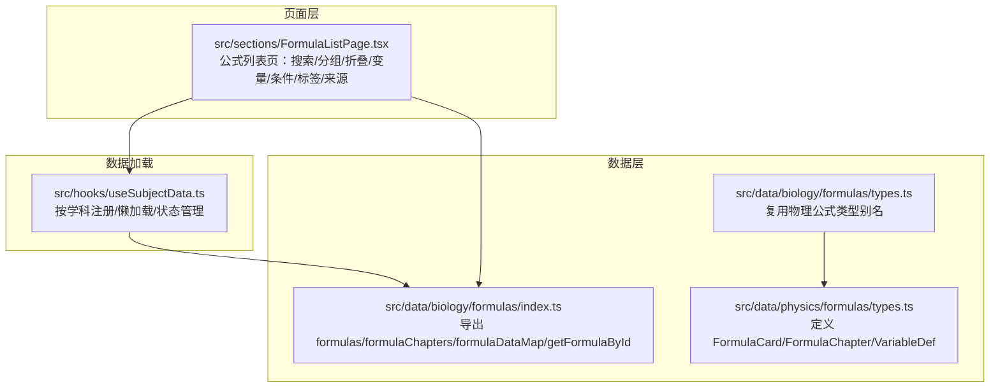
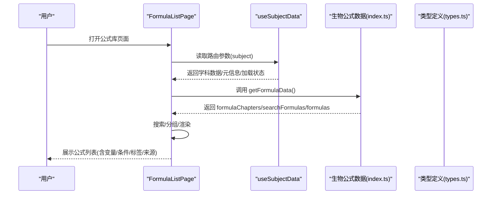
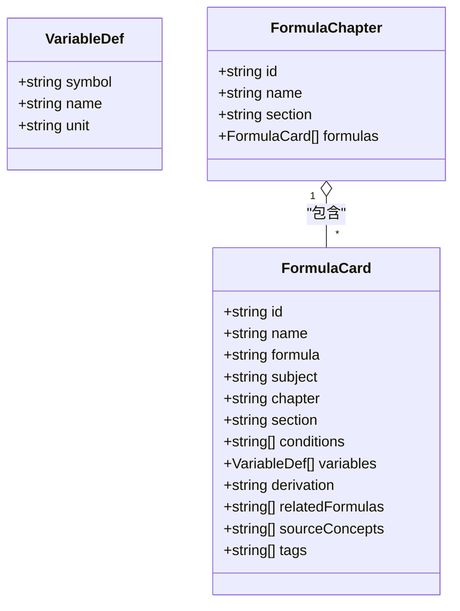
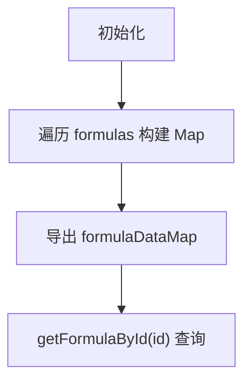
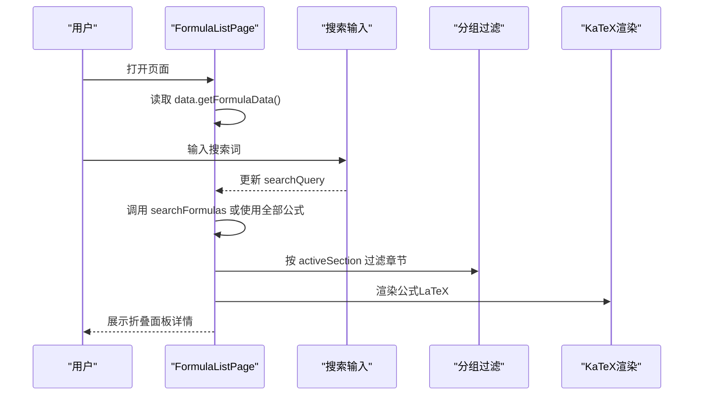
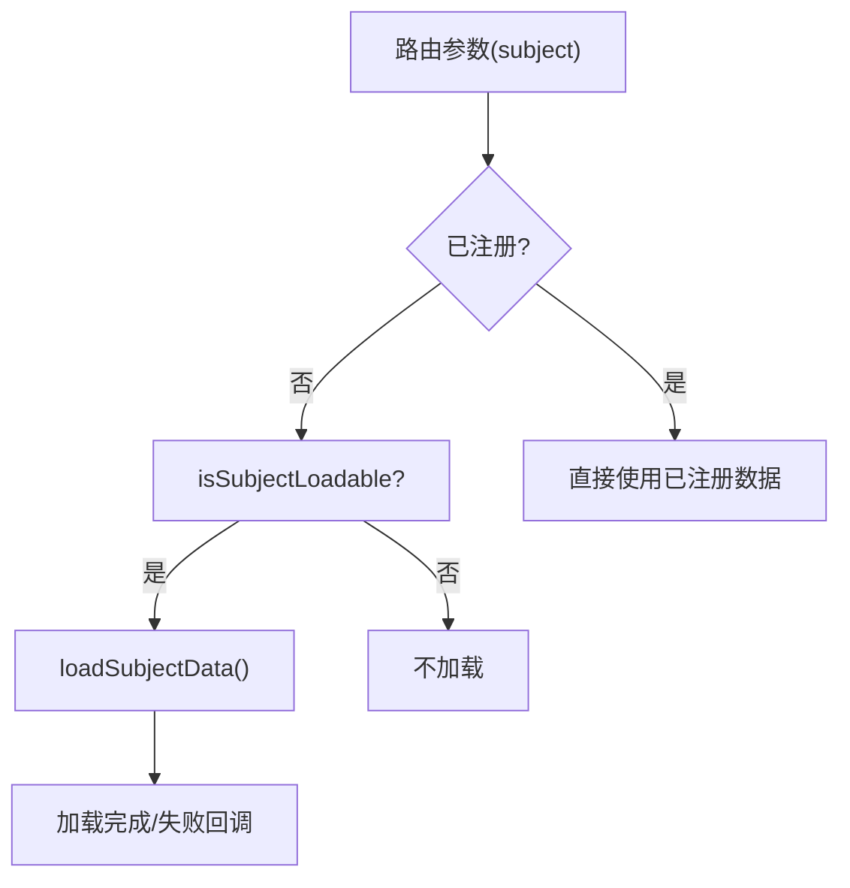
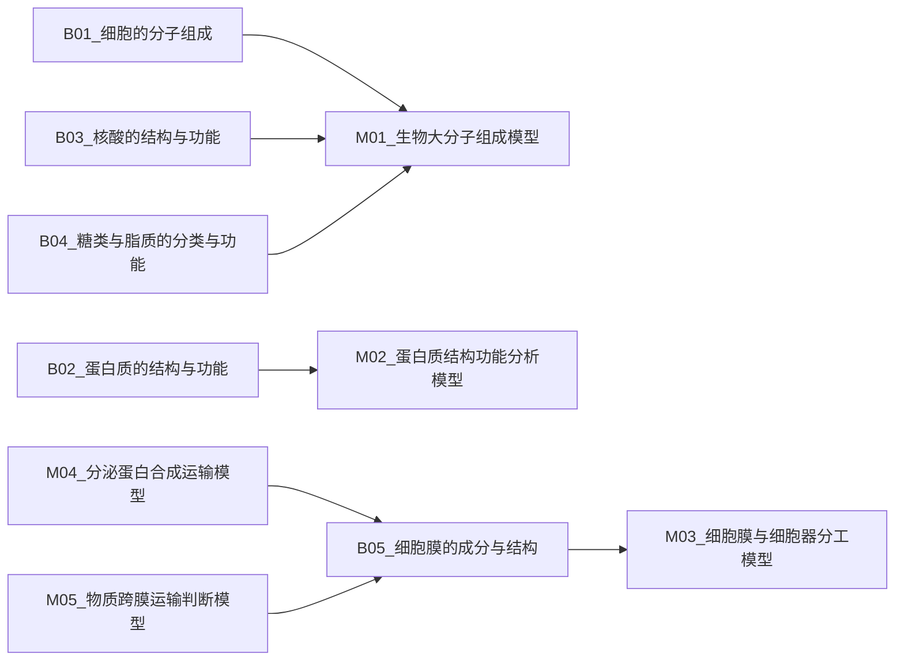
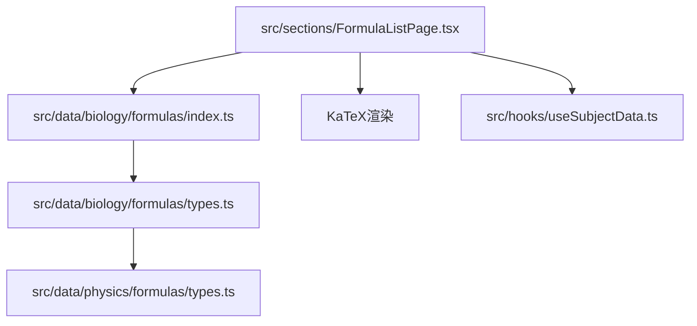

# 生物公式层（F层）

<cite>
**本文引用的文件**
- [src/data/biology/formulas/index.ts](file://src/data/biology/formulas/index.ts)
- [src/data/biology/formulas/types.ts](file://src/data/biology/formulas/types.ts)
- [src/data/physics/formulas/types.ts](file://src/data/physics/formulas/types.ts)
- [src/sections/FormulaListPage.tsx](file://src/sections/FormulaListPage.tsx)
- [src/hooks/useSubjectData.ts](file://src/hooks/useSubjectData.ts)
- [src/data/biology/concepts/B01_细胞的分子组成.ts](file://src/data/biology/concepts/B01_细胞的分子组成.ts)
- [src/data/biology/concepts/B02_蛋白质的结构与功能.ts](file://src/data/biology/concepts/B02_蛋白质的结构与功能.ts)
- [src/data/biology/concepts/B03_核酸的结构与功能.ts](file://src/data/biology/concepts/B03_核酸的结构与功能.ts)
- [src/data/biology/concepts/B04_糖类与脂质的分类与功能.ts](file://src/data/biology/concepts/B04_糖类与脂质的分类与功能.ts)
- [src/data/biology/concepts/B05_细胞膜的成分与结构.ts](file://src/data/biology/concepts/B05_细胞膜的成分与结构.ts)
- [src/data/biology/models/M01_生物大分子组成模型.ts](file://src/data/biology/models/M01_生物大分子组成模型.ts)
- [src/data/biology/models/M02_蛋白质结构功能分析模型.ts](file://src/data/biology/models/M02_蛋白质结构功能分析模型.ts)
- [src/data/biology/models/M03_细胞膜与细胞器分工模型.ts](file://src/data/biology/models/M03_细胞膜与细胞器分工模型.ts)
- [src/data/biology/models/M04_分泌蛋白合成运输模型.ts](file://src/data/biology/models/M04_分泌蛋白合成运输模型.ts)
- [src/data/biology/models/M05_物质跨膜运输判断模型.ts](file://src/data/biology/models/M05_物质跨膜运输判断模型.ts)
</cite>

## 目录
1. [简介](#简介)
2. [项目结构](#项目结构)
3. [核心组件](#核心组件)
4. [架构总览](#架构总览)
5. [详细组件分析](#详细组件分析)
6. [依赖分析](#依赖分析)
7. [性能考虑](#性能考虑)
8. [故障排查指南](#故障排查指南)
9. [结论](#结论)
10. [附录](#附录)

## 简介
本文件系统性阐述“生物公式层（F层）”的设计与实现，覆盖生物学科重要公式与定理的组织、管理与呈现。内容包括：
- 公式数据结构与章节分类
- 关键词索引与关联知识点
- 可视化展示、动态演示与交互式学习
- 搜索检索、智能推荐与记忆辅助机制
- 科学性验证、准确性保证与更新维护流程

该层以“公式卡片（FormulaCard）”为核心载体，结合“章节（FormulaChapter）”进行组织，并通过页面组件实现搜索、折叠展开、变量说明、适用条件、来源知识节点与标签等能力。

## 项目结构
生物公式层位于 src/data/biology/formulas 下，采用“数据导出 + 类型定义”的方式组织；页面层通过 FormulaListPage 进行展示与交互；数据加载由 useSubjectData 钩子负责按学科动态加载。

图表来源
- [src/data/biology/formulas/index.ts:1-13](file://src/data/biology/formulas/index.ts#L1-L13)
- [src/data/biology/formulas/types.ts:1-3](file://src/data/biology/formulas/types.ts#L1-L3)
- [src/data/physics/formulas/types.ts:1-30](file://src/data/physics/formulas/types.ts#L1-L30)
- [src/sections/FormulaListPage.tsx:1-261](file://src/sections/FormulaListPage.tsx#L1-L261)
- [src/hooks/useSubjectData.ts:1-46](file://src/hooks/useSubjectData.ts#L1-L46)

章节来源
- [src/data/biology/formulas/index.ts:1-13](file://src/data/biology/formulas/index.ts#L1-L13)
- [src/data/biology/formulas/types.ts:1-3](file://src/data/biology/formulas/types.ts#L1-L3)
- [src/data/physics/formulas/types.ts:1-30](file://src/data/physics/formulas/types.ts#L1-L30)
- [src/sections/FormulaListPage.tsx:1-261](file://src/sections/FormulaListPage.tsx#L1-L261)
- [src/hooks/useSubjectData.ts:1-46](file://src/hooks/useSubjectData.ts#L1-L46)

## 核心组件
- 公式卡片（FormulaCard）：承载单个公式的标识、名称、LaTeX 表达式、所属章节与小节、适用条件、变量说明、推导过程、关联公式、来源知识节点与标签等字段。
- 章节（FormulaChapter）：按主题或教材章节聚合公式，便于分组展示与筛选。
- 数据映射与查询：通过 Map 快速按 ID 查询公式，提供 getFormulaById 辅助函数。
- 页面组件（FormulaListPage）：提供搜索框、章节过滤按钮、折叠面板、变量说明、适用条件、来源知识节点链接与标签展示。
- 数据加载钩子（useSubjectData）：根据路由参数按学科动态加载数据，处理加载状态与错误回退。

章节来源
- [src/data/physics/formulas/types.ts:10-30](file://src/data/physics/formulas/types.ts#L10-L30)
- [src/data/biology/formulas/index.ts:3-13](file://src/data/biology/formulas/index.ts#L3-L13)
- [src/sections/FormulaListPage.tsx:40-56](file://src/sections/FormulaListPage.tsx#L40-L56)
- [src/hooks/useSubjectData.ts:16-45](file://src/hooks/useSubjectData.ts#L16-L45)

## 架构总览
下图展示了从数据到页面的端到端流程：页面通过 useSubjectData 获取学科数据，再调用数据层提供的公式数据接口，渲染公式列表页并支持搜索与分组。

图表来源
- [src/sections/FormulaListPage.tsx:20-40](file://src/sections/FormulaListPage.tsx#L20-L40)
- [src/hooks/useSubjectData.ts:16-45](file://src/hooks/useSubjectData.ts#L16-L45)
- [src/data/biology/formulas/index.ts:3-13](file://src/data/biology/formulas/index.ts#L3-L13)

## 详细组件分析

### 公式数据结构与类型
- 变量定义（VariableDef）：包含符号、名称与单位，用于变量说明展示。
- 公式卡片（FormulaCard）：包含唯一 ID、名称、LaTeX 表达式、学科、章节、小节、适用条件、变量说明、可选推导过程、关联公式 ID 数组、来源知识节点 ID 数组、标签数组。
- 章节（FormulaChapter）：包含章节 ID、名称、小节、公式数组。

图表来源
- [src/data/physics/formulas/types.ts:4-30](file://src/data/physics/formulas/types.ts#L4-L30)

章节来源
- [src/data/physics/formulas/types.ts:4-30](file://src/data/physics/formulas/types.ts#L4-L30)

### 公式数据导出与查询
- 导出数组：formulas、formulaChapters。
- 数据映射：formulaDataMap 以公式 ID 为键，加速按 ID 查询。
- 查询函数：getFormulaById 支持快速定位公式。

图表来源
- [src/data/biology/formulas/index.ts:7-13](file://src/data/biology/formulas/index.ts#L7-L13)

章节来源
- [src/data/biology/formulas/index.ts:3-13](file://src/data/biology/formulas/index.ts#L3-L13)

### 公式列表页（交互与展示）
- 加载状态：当数据未就绪时显示加载提示。
- 搜索：支持按名称、LaTeX 内容、变量名搜索。
- 分组：按章节过滤，支持“全部”与具体章节切换。
- 折叠面板：点击展开查看变量说明、适用条件、来源知识节点与标签。
- 渲染：使用 KaTeX 将 LaTeX 表达式渲染为数学公式。

图表来源
- [src/sections/FormulaListPage.tsx:20-97](file://src/sections/FormulaListPage.tsx#L20-L97)
- [src/sections/FormulaListPage.tsx:115-242](file://src/sections/FormulaListPage.tsx#L115-L242)

章节来源
- [src/sections/FormulaListPage.tsx:20-261](file://src/sections/FormulaListPage.tsx#L20-L261)

### 数据加载与学科注册
- useSubjectData：根据路由参数获取学科数据，若未注册或可加载则触发懒加载，返回加载状态与学科元信息。
- 页面通过 data.getFormulaData() 获取公式数据接口，确保按学科维度隔离与扩展。

图表来源
- [src/hooks/useSubjectData.ts:16-45](file://src/hooks/useSubjectData.ts#L16-L45)

章节来源
- [src/hooks/useSubjectData.ts:16-45](file://src/hooks/useSubjectData.ts#L16-L45)

### 生物概念与模型（关联知识点）
- 概念数据（ConceptData）：描述知识点的章节、模块、难度、前置要求、关联模型与策略等，体现知识网络。
- 模型数据（ModelData）：描述模型的章节、核心思维、关联概念与策略等，支撑公式来源与理解。

图表来源
- [src/data/biology/concepts/B01_细胞的分子组成.ts:3-13](file://src/data/biology/concepts/B01_细胞的分子组成.ts#L3-L13)
- [src/data/biology/concepts/B02_蛋白质的结构与功能.ts:3-13](file://src/data/biology/concepts/B02_蛋白质的结构与功能.ts#L3-L13)
- [src/data/biology/concepts/B03_核酸的结构与功能.ts:3-13](file://src/data/biology/concepts/B03_核酸的结构与功能.ts#L3-L13)
- [src/data/biology/concepts/B04_糖类与脂质的分类与功能.ts:3-13](file://src/data/biology/concepts/B04_糖类与脂质的分类与功能.ts#L3-L13)
- [src/data/biology/concepts/B05_细胞膜的成分与结构.ts:3-13](file://src/data/biology/concepts/B05_细胞膜的成分与结构.ts#L3-L13)
- [src/data/biology/models/M01_生物大分子组成模型.ts:3-12](file://src/data/biology/models/M01_生物大分子组成模型.ts#L3-L12)
- [src/data/biology/models/M02_蛋白质结构功能分析模型.ts:3-12](file://src/data/biology/models/M02_蛋白质结构功能分析模型.ts#L3-L12)
- [src/data/biology/models/M03_细胞膜与细胞器分工模型.ts:3-12](file://src/data/biology/models/M03_细胞膜与细胞器分工模型.ts#L3-L12)
- [src/data/biology/models/M04_分泌蛋白合成运输模型.ts:3-12](file://src/data/biology/models/M04_分泌蛋白合成运输模型.ts#L3-L12)
- [src/data/biology/models/M05_物质跨膜运输判断模型.ts:3-12](file://src/data/biology/models/M05_物质跨膜运输判断模型.ts#L3-L12)

章节来源
- [src/data/biology/concepts/B01_细胞的分子组成.ts:3-13](file://src/data/biology/concepts/B01_细胞的分子组成.ts#L3-L13)
- [src/data/biology/concepts/B02_蛋白质的结构与功能.ts:3-13](file://src/data/biology/concepts/B02_蛋白质的结构与功能.ts#L3-L13)
- [src/data/biology/concepts/B03_核酸的结构与功能.ts:3-13](file://src/data/biology/concepts/B03_核酸的结构与功能.ts#L3-L13)
- [src/data/biology/concepts/B04_糖类与脂质的分类与功能.ts:3-13](file://src/data/biology/concepts/B04_糖类与脂质的分类与功能.ts#L3-L13)
- [src/data/biology/concepts/B05_细胞膜的成分与结构.ts:3-13](file://src/data/biology/concepts/B05_细胞膜的成分与结构.ts#L3-L13)
- [src/data/biology/models/M01_生物大分子组成模型.ts:3-12](file://src/data/biology/models/M01_生物大分子组成模型.ts#L3-L12)
- [src/data/biology/models/M02_蛋白质结构功能分析模型.ts:3-12](file://src/data/biology/models/M02_蛋白质结构功能分析模型.ts#L3-L12)
- [src/data/biology/models/M03_细胞膜与细胞器分工模型.ts:3-12](file://src/data/biology/models/M03_细胞膜与细胞器分工模型.ts#L3-L12)
- [src/data/biology/models/M04_分泌蛋白合成运输模型.ts:3-12](file://src/data/biology/models/M04_分泌蛋白合成运输模型.ts#L3-L12)
- [src/data/biology/models/M05_物质跨膜运输判断模型.ts:3-12](file://src/data/biology/models/M05_物质跨膜运输判断模型.ts#L3-L12)

## 依赖分析
- 类型复用：生物公式层通过别名复用物理公式类型，保持一致的数据结构与扩展性。
- 页面依赖：FormulaListPage 依赖 useSubjectData 提供的数据接口，依赖 KaTeX 渲染数学公式。
- 数据依赖：数据层依赖导出的数组与 Map，提供 O(1) 查询能力。

图表来源
- [src/data/biology/formulas/types.ts:1-3](file://src/data/biology/formulas/types.ts#L1-L3)
- [src/data/physics/formulas/types.ts:1-30](file://src/data/physics/formulas/types.ts#L1-L30)
- [src/data/biology/formulas/index.ts:1-13](file://src/data/biology/formulas/index.ts#L1-L13)
- [src/sections/FormulaListPage.tsx:17-18](file://src/sections/FormulaListPage.tsx#L17-L18)
- [src/hooks/useSubjectData.ts:16-45](file://src/hooks/useSubjectData.ts#L16-L45)

章节来源
- [src/data/biology/formulas/types.ts:1-3](file://src/data/biology/formulas/types.ts#L1-L3)
- [src/data/physics/formulas/types.ts:1-30](file://src/data/physics/formulas/types.ts#L1-L30)
- [src/data/biology/formulas/index.ts:1-13](file://src/data/biology/formulas/index.ts#L1-L13)
- [src/sections/FormulaListPage.tsx:17-18](file://src/sections/FormulaListPage.tsx#L17-L18)
- [src/hooks/useSubjectData.ts:16-45](file://src/hooks/useSubjectData.ts#L16-L45)

## 性能考虑
- 查询优化：通过 Map 以 O(1) 时间复杂度按 ID 查找公式，避免线性扫描。
- 渲染优化：LaTeX 渲染仅在需要时执行，建议在大量公式场景下引入虚拟列表与懒加载。
- 搜索与分组：前端搜索与分组在内存中进行，建议对大数据集增加服务端搜索与分页。
- 图片与资源：KaTeX 资源按需加载，避免重复渲染相同公式。

## 故障排查指南
- 页面空白或加载提示：检查 useSubjectData 是否正确注册与加载学科数据，确认路由参数与学科标识一致。
- 公式不显示：检查公式 LaTeX 字符串是否正确，确认 KaTeX 渲染配置与样式加载正常。
- 搜索无结果：确认搜索词是否匹配公式名称、LaTeX 内容或变量名；检查 searchFormulas 实现与数据一致性。
- 章节过滤无效：确认 formulaChapters 结构与 activeSection 切换逻辑一致。
- 来源知识节点链接：确认 sourceConcepts 中的 ID 与概念数据一致，路由跳转路径正确。

章节来源
- [src/hooks/useSubjectData.ts:19-43](file://src/hooks/useSubjectData.ts#L19-L43)
- [src/sections/FormulaListPage.tsx:25-38](file://src/sections/FormulaListPage.tsx#L25-L38)
- [src/sections/FormulaListPage.tsx:133-141](file://src/sections/FormulaListPage.tsx#L133-L141)

## 结论
生物公式层（F层）以清晰的数据结构与页面组件实现了公式的组织、展示与交互。通过类型复用与 Map 查询提升性能，借助章节分组与搜索增强可用性。未来可在以下方面持续优化：完善公式数据骨架、引入服务端搜索与分页、增强可视化与动态演示、建立科学性审核与版本更新流程。

## 附录

### 公式数据字段说明
- id：公式唯一标识
- name：公式名称
- formula：LaTeX 数学表达式
- subject：学科（预留扩展）
- chapter：所属章节
- section：所属小节/板块
- conditions：适用条件数组
- variables：变量说明数组（symbol/name/unit）
- derivation：推导过程（可选）
- relatedFormulas：关联公式 ID 数组
- sourceConcepts：来源知识节点 ID 数组
- tags：标签数组

章节来源
- [src/data/physics/formulas/types.ts:10-23](file://src/data/physics/formulas/types.ts#L10-L23)