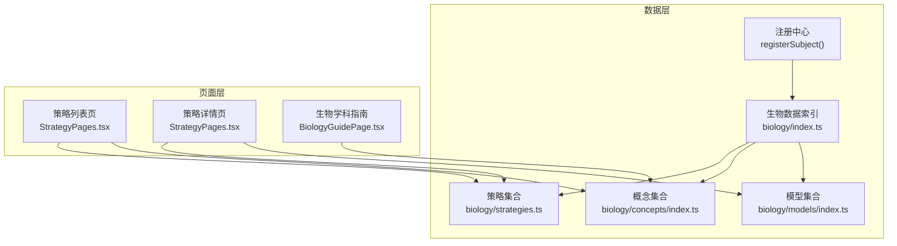
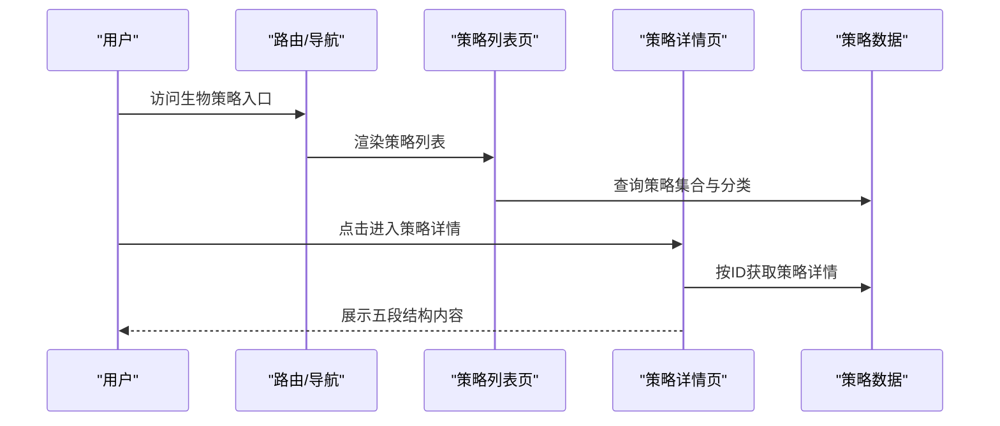
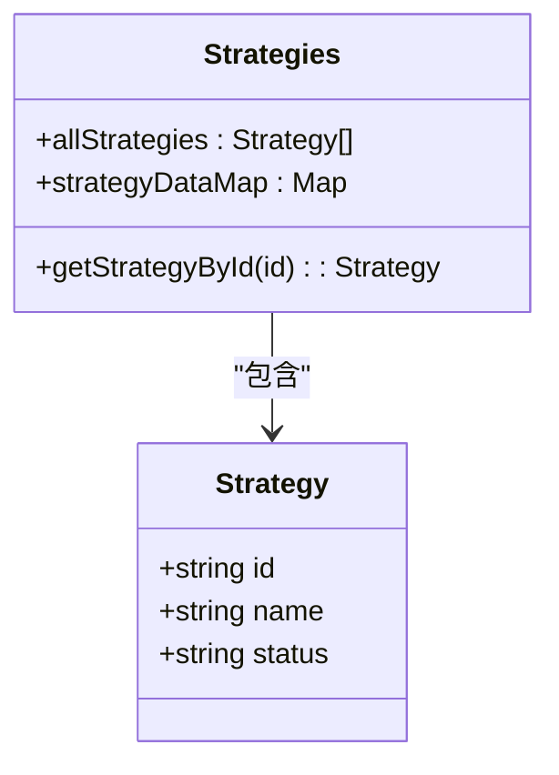
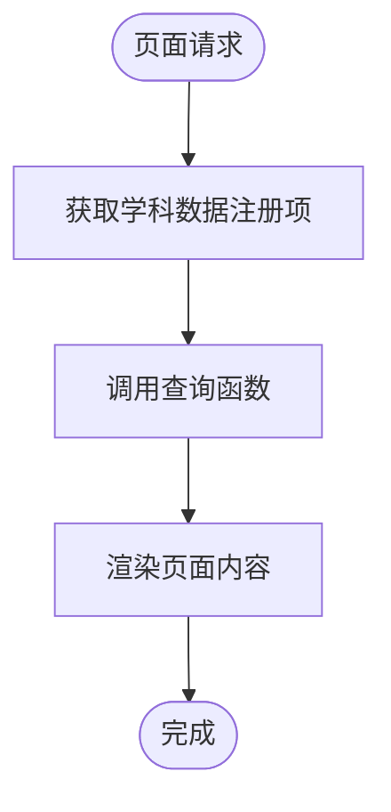
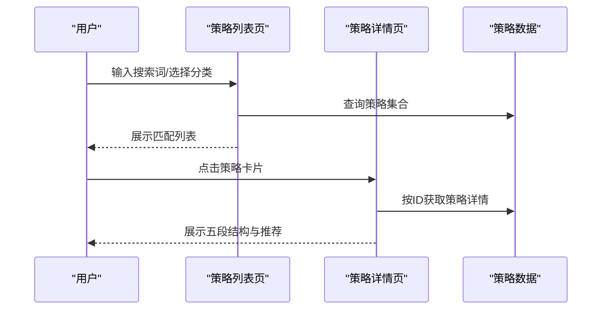
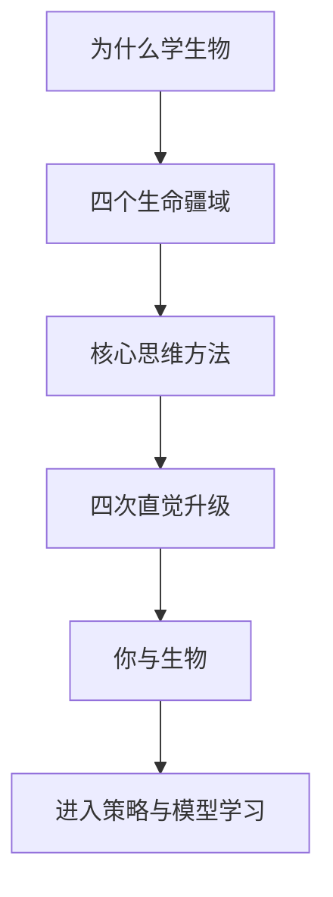
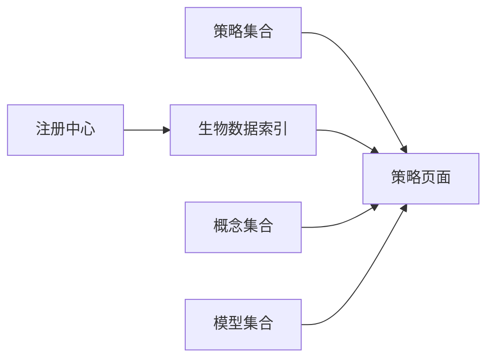

# 生物学习策略模块

<cite>
**本文引用的文件**
- [src/data/registry.ts](file://src/data/registry.ts)
- [src/data/biology/index.ts](file://src/data/biology/index.ts)
- [src/data/biology/strategies.ts](file://src/data/biology/strategies.ts)
- [src/data/biology/concepts/index.ts](file://src/data/biology/concepts/index.ts)
- [src/data/biology/models/index.ts](file://src/data/biology/models/index.ts)
- [src/data/physics/paradigms/index.ts](file://src/data/physics/paradigms/index.ts)
- [src/sections/StrategyPages.tsx](file://src/sections/StrategyPages.tsx)
- [src/sections/BiologyGuidePage.tsx](file://src/sections/BiologyGuidePage.tsx)
</cite>

## 目录
1. [引言](#引言)
2. [项目结构](#项目结构)
3. [核心组件](#核心组件)
4. [架构总览](#架构总览)
5. [详细组件分析](#详细组件分析)
6. [依赖分析](#依赖分析)
7. [性能考虑](#性能考虑)
8. [故障排查指南](#故障排查指南)
9. [结论](#结论)
10. [附录](#附录)

## 引言
本文件面向“生物学习策略模块”，系统化梳理该模块在知识组织、策略呈现、教学设计与学习支持方面的架构与实现要点。模块以“生物学科特有的学习方法与思维策略”为核心，围绕实验设计思路、数据分析方法、图表解读技巧、概念理解策略等维度，提供策略与知识点的匹配关系、应用效果评估与学习成果跟踪的支撑能力，并给出教学设计、实践指导与能力培养机制的参考路径。

## 项目结构
生物学习策略模块位于学科数据与前端页面的交汇处，采用“数据注册 + 主题路由 + 页面渲染”的分层组织方式：
- 数据层：通过主题注册中心统一暴露生物学科的概念、模型、公式、题目与策略数据。
- 页面层：提供策略列表与详情页面，采用“五段结构”（触发信号→思考路径→变式预警→错因图谱→本质回溯）组织策略内容。
- 导航与入口：结合学科指南页面，形成从“学习动机与思维升级”到“策略与模型”的完整学习路径。

**图示来源**
- [src/data/registry.ts:42-48](file://src/data/registry.ts#L42-L48)
- [src/data/biology/index.ts:126-151](file://src/data/biology/index.ts#L126-L151)
- [src/data/biology/strategies.ts:9-78](file://src/data/biology/strategies.ts#L9-L78)
- [src/data/biology/concepts/index.ts:115-201](file://src/data/biology/concepts/index.ts#L115-L201)
- [src/data/biology/models/index.ts:107-191](file://src/data/biology/models/index.ts#L107-L191)
- [src/sections/StrategyPages.tsx:55-153](file://src/sections/StrategyPages.tsx#L55-L153)
- [src/sections/StrategyPages.tsx:156-322](file://src/sections/StrategyPages.tsx#L156-L322)
- [src/sections/BiologyGuidePage.tsx:1-139](file://src/sections/BiologyGuidePage.tsx#L1-L139)

**章节来源**
- [src/data/registry.ts:42-48](file://src/data/registry.ts#L42-L48)
- [src/data/biology/index.ts:126-151](file://src/data/biology/index.ts#L126-L151)
- [src/sections/StrategyPages.tsx:55-153](file://src/sections/StrategyPages.tsx#L55-L153)
- [src/sections/StrategyPages.tsx:156-322](file://src/sections/StrategyPages.tsx#L156-L322)
- [src/sections/BiologyGuidePage.tsx:1-139](file://src/sections/BiologyGuidePage.tsx#L1-L139)

## 核心组件
- 注册中心与主题数据接口
  - 提供统一的学科数据访问契约，包括概念、模型、公式、题目与策略等数据的查询与统计能力。
  - 支持按学科 ID 获取数据集，便于在页面层按需加载。
- 生物学科数据索引
  - 将概念、模型、公式、题目与策略聚合为可查询的数据集，并提供便捷的映射与统计函数。
- 策略集合与数据映射
  - 定义策略的标识、名称与状态，提供按 ID 查询策略的能力。
- 概念与模型集合
  - 概念按模块/章节组织，模型按知识领域分章，二者分别服务于“理解—建模—应用”的学习闭环。
- 策略页面组件
  - 列表页支持搜索与分类过滤；详情页采用“五段结构”展示策略内容，并提供前后翻页与同分类推荐。

**章节来源**
- [src/data/registry.ts:4-38](file://src/data/registry.ts#L4-L38)
- [src/data/registry.ts:42-48](file://src/data/registry.ts#L42-L48)
- [src/data/registry.ts:46-48](file://src/data/registry.ts#L46-L48)
- [src/data/biology/index.ts:11-25](file://src/data/biology/index.ts#L11-L25)
- [src/data/biology/index.ts:38-49](file://src/data/biology/index.ts#L38-L49)
- [src/data/biology/index.ts:102-124](file://src/data/biology/index.ts#L102-L124)
- [src/data/biology/strategies.ts:9-78](file://src/data/biology/strategies.ts#L9-L78)
- [src/data/biology/concepts/index.ts:115-201](file://src/data/biology/concepts/index.ts#L115-L201)
- [src/data/biology/models/index.ts:107-191](file://src/data/biology/models/index.ts#L107-L191)
- [src/sections/StrategyPages.tsx:55-153](file://src/sections/StrategyPages.tsx#L55-L153)
- [src/sections/StrategyPages.tsx:156-322](file://src/sections/StrategyPages.tsx#L156-L322)

## 架构总览
模块采用“注册中心 + 主题数据 + 页面组件”的分层架构，策略与知识点通过数据索引统一暴露，页面通过路由与组件渲染策略内容。策略页面的“五段结构”为学习者提供从“问题触发”到“本质回溯”的系统化思维路径。

**图示来源**
- [src/sections/StrategyPages.tsx:55-153](file://src/sections/StrategyPages.tsx#L55-L153)
- [src/sections/StrategyPages.tsx:156-322](file://src/sections/StrategyPages.tsx#L156-L322)
- [src/data/registry.ts:19-20](file://src/data/registry.ts#L19-L20)
- [src/data/registry.ts:46-48](file://src/data/registry.ts#L46-L48)

## 详细组件分析

### 组件A：策略集合与数据映射
- 设计要点
  - 策略对象包含唯一标识、名称与状态，便于版本管理与发布控制。
  - 提供按 ID 查询策略的映射表，支持 O(1) 快速检索。
- 数据结构与复杂度
  - 映射表构建为 O(n)，查询为 O(1)。
- 依赖关系
  - 与生物数据索引配合，作为策略数据源之一。
- 优化建议
  - 对策略状态进行枚举约束，避免非法状态传播。
  - 在数据索引中加入策略与知识点的关联关系，便于后续个性化推荐。

**图示来源**
- [src/data/biology/strategies.ts:1-78](file://src/data/biology/strategies.ts#L1-L78)

**章节来源**
- [src/data/biology/strategies.ts:9-78](file://src/data/biology/strategies.ts#L9-L78)

### 组件B：生物数据索引与注册中心
- 设计要点
  - 通过注册中心统一暴露生物学科的数据接口，包括概念、模型、公式、题目与策略。
  - 提供概念元数据查询、模型章节与难度、题目筛选与统计等功能。
- 数据流
  - 页面通过学科 ID 获取数据集，再调用相应查询函数渲染内容。
- 依赖关系
  - 依赖策略集合、概念集合、模型集合与题目集合。

**图示来源**
- [src/data/registry.ts:42-48](file://src/data/registry.ts#L42-L48)
- [src/data/registry.ts:19-34](file://src/data/registry.ts#L19-L34)
- [src/data/registry.ts:46-48](file://src/data/registry.ts#L46-L48)

**章节来源**
- [src/data/registry.ts:4-38](file://src/data/registry.ts#L4-L38)
- [src/data/registry.ts:42-48](file://src/data/registry.ts#L42-L48)
- [src/data/registry.ts:46-48](file://src/data/registry.ts#L46-L48)
- [src/data/registry.ts:46-48](file://src/data/registry.ts#L46-L48)
- [src/data/registry.ts:46-48](file://src/data/registry.ts#L46-L48)
- [src/data/registry.ts:46-48](file://src/data/registry.ts#L46-L48)
- [src/data/registry.ts:46-48](file://src/data/registry.ts#L46-L48)
- [src/data/registry.ts:46-48](file://src/data/registry.ts#L46-L48)
- [src/data/registry.ts:46-48](file://src/data/registry.ts#L46-L48)
- [src/data/registry.ts:46-48](file://src/data/registry.ts#L46-L48)
- [src/data/registry.ts:46-48](file://src/data/registry.ts#L46-L48)
- [src/data/registry.ts:46-48](file://src/data/registry.ts#L46-L48)
- [src/data/registry.ts:46-48](file://src/data/registry.ts#L46-L48)
- [src/data/registry.ts:46-48](file://src/data/registry.ts#L46-L48)
- [src/data/registry.ts:46-48](file://src/data/registry.ts#L46-L48)
- [src/data/registry.ts:46-48](file://src/data/registry.ts#L46-L48)
- [src/data/registry.ts:46-48](file://src/data/registry.ts#L46-L48)
- [src/data/registry.ts:46-48](file://src/data/registry.ts#L46-L48)
- [src/data/registry.ts:46-48](file://src/data/registry.ts#L46-L48)
- [src/data/registry.ts:46-48](file://src/data/registry.ts#L46-L48)
- [src/data/registry.ts:46-48](file://src/data/registry.ts......)

### 组件C：策略页面（列表与详情）
- 设计要点
  - 列表页支持关键词搜索与分类筛选，便于快速定位策略。
  - 详情页采用“五段结构”组织内容，提供前后翻页与同分类推荐，增强学习连贯性。
- 交互流程
  - 列表页：输入搜索词、切换分类、点击进入详情。
  - 详情页：查看策略名称、难度与分类标签，阅读五段内容，使用翻页与推荐继续学习。

**图示来源**
- [src/sections/StrategyPages.tsx:55-153](file://src/sections/StrategyPages.tsx#L55-L153)
- [src/sections/StrategyPages.tsx:156-322](file://src/sections/StrategyPages.tsx#L156-L322)

**章节来源**
- [src/sections/StrategyPages.tsx:55-153](file://src/sections/StrategyPages.tsx#L55-L153)
- [src/sections/StrategyPages.tsx:156-322](file://src/sections/StrategyPages.tsx#L156-L322)

### 组件D：学科指南与学习动机
- 设计要点
  - 学科指南页面从“为什么学生物”“四个生命疆域”“核心思维方法”“四次直觉升级”“你与生物”五个维度，帮助学习者建立学习动机与元认知框架。
  - 与策略模块形成“动机—方法—应用”的闭环：先理解价值，再掌握方法，最后通过策略与模型深化应用。

**图示来源**
- [src/sections/BiologyGuidePage.tsx:15-139](file://src/sections/BiologyGuidePage.tsx#L15-L139)

**章节来源**
- [src/sections/BiologyGuidePage.tsx:15-139](file://src/sections/BiologyGuidePage.tsx#L15-L139)

## 依赖分析
- 组件耦合
  - 策略页面依赖策略集合与注册中心提供的查询接口。
  - 生物数据索引聚合概念、模型、公式、题目与策略，形成统一数据面。
- 外部依赖
  - 页面层依赖路由与 UI 组件库，策略页面使用卡片、输入、按钮等组件实现交互。
- 潜在风险
  - 若策略状态枚举不一致，可能导致页面显示异常。
  - 若注册中心接口变更，需同步更新页面层调用点。

**图示来源**
- [src/data/registry.ts:42-48](file://src/data/registry.ts#L42-L48)
- [src/data/registry.ts:19-34](file://src/data/registry.ts#L19-L34)
- [src/data/registry.ts:46-48](file://src/data/registry.ts#L46-L48)
- [src/data/registry.ts:46-48](file://src/data/registry.ts#L46-L48)
- [src/data/registry.ts:46-48](file://src/data/registry.ts#L46-L48)
- [src/data/registry.ts:46-48](file://src/data/registry.ts#L46-L48)
- [src/data/registry.ts:46-48](file://src/data/registry.ts#L46-L48)
- [src/data/registry.ts:46-48](file://src/data/registry.ts#L46-L48)
- [src/data/registry.ts:46-48](file://src/data/registry.ts#L46-L48)
- [src/data/registry.ts:46-48](file://src/data/registry.ts#L46-L48)
- [src/data/registry.ts:46-48](file://src/data/registry.ts#L46-L48)
- [src/data/registry.ts:46-48](file://src/data/registry.ts#L46-L48)
- [src/data/registry.ts:46-48](file://src/data/registry.ts#L46-L48)
- [src/data/registry.ts:46-48](file://src/data/registry.ts#L46-L48)
- [src/data/registry.ts:46-48](file://src/data/registry.ts#L46-L48)
- [src/data/registry.ts:46-48](file://src/data/registry.ts#L46-L48)
- [src/data/registry.ts:46-48](file://src/data/registry.ts#L46-L48)
- [src/data/registry.ts:46-48](file://src/data/registry.ts#L46-L48)
- [src/data/registry.ts:46-48](file://src/data/registry.ts#L46-L48)
- [src/data/registry.ts:46-48](file://src/data/registry.ts#L46-L48)
- [src/data/registry.ts:46-48](file://src/data/registry.ts#L46......)

**章节来源**
- [src/data/registry.ts:42-48](file://src/data/registry.ts#L42-L48)
- [src/data/registry.ts:19-34](file://src/data/registry.ts#L19-L34)
- [src/data/registry.ts:46-48](file://src/data/registry.ts#L46-L48)
- [src/data/registry.ts:46-48](file://src/data/registry.ts#L46-L48)
- [src/data/registry.ts:46-48](file://src/data/registry.ts#L46-L48)
- [src/data/registry.ts:46-48](file://src/data/registry.ts#L46-L48)
- [src/data/registry.ts:46-48](file://src/data/registry.ts#L46-L48)
- [src/data/registry.ts:46-48](file://src/data/registry.ts#L46-L48)
- [src/data/registry.ts:46-48](file://src/data/registry.ts#L46-L48)
- [src/data/registry.ts:46-48](file://src/data/registry.ts#L46-L48)
- [src/data/registry.ts:46-48](file://src/data/registry.ts#L46-L48)
- [src/data/registry.ts:46-48](file://src/data/registry.ts#L46-L48)
- [src/data/registry.ts:46-48](file://src/data/registry.ts#L46-L48)
- [src/data/registry.ts:46-48](file://src/data/registry.ts#L46-L48)
- [src/data/registry.ts:46-48](file://src/data/registry.ts#L46-L48)
- [src/data/registry.ts:46-48](file://src/data/registry.ts#L46-L48)
- [src/data/registry.ts:46-48](file://src/data/registry.ts#L46-L48)
- [src/data/registry.ts:46-48](file://src/data/registry.ts#L46-L48)
- [src/data/registry.ts:46-48](file://src/data/registry.ts#L46-L48)
- [src/data/registry.ts:46-48](file://src/data/registry.ts#L46-L48)
- [src/data/registry.ts:46-48](file://src/data/registry.ts#L......