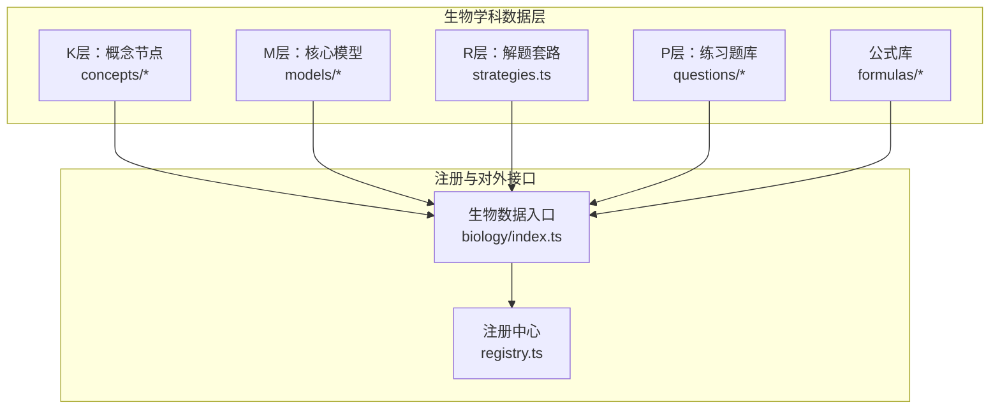
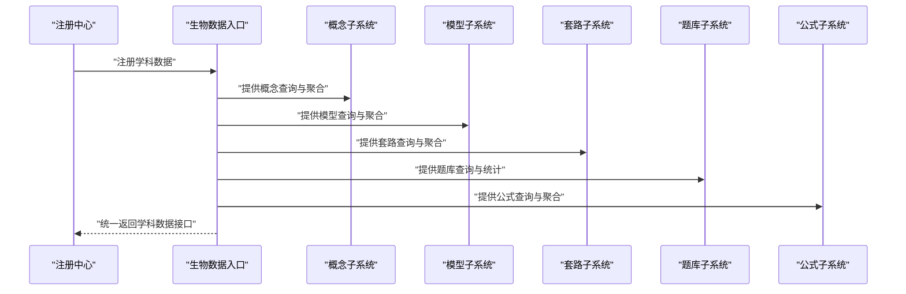
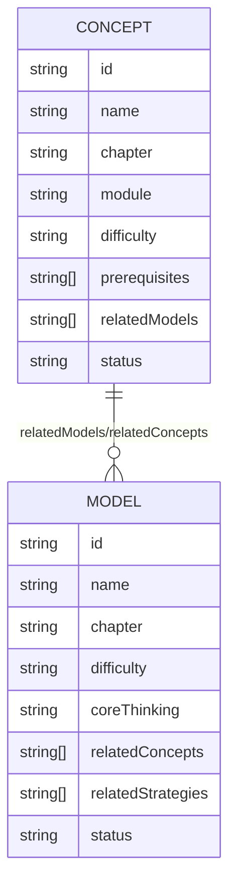
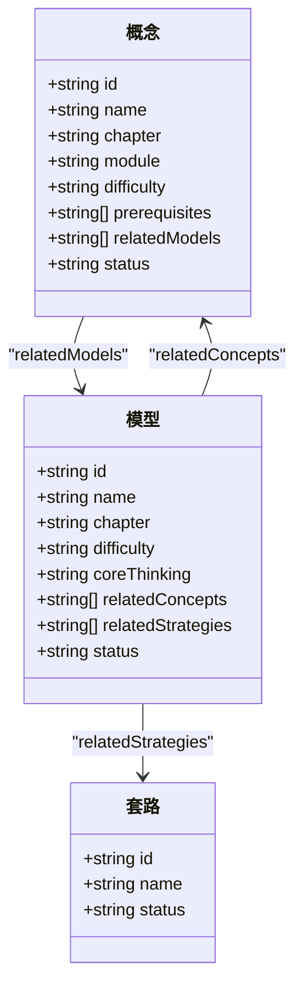
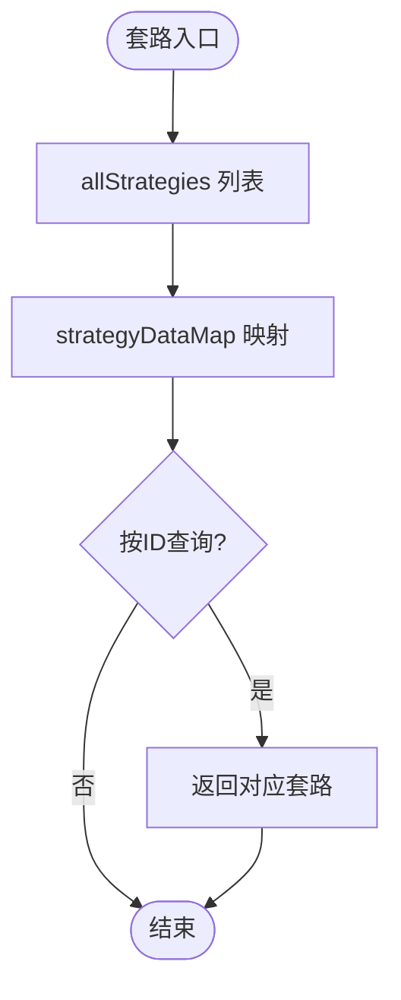
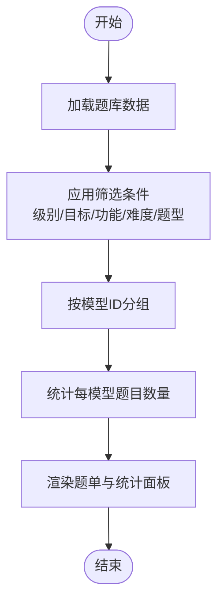
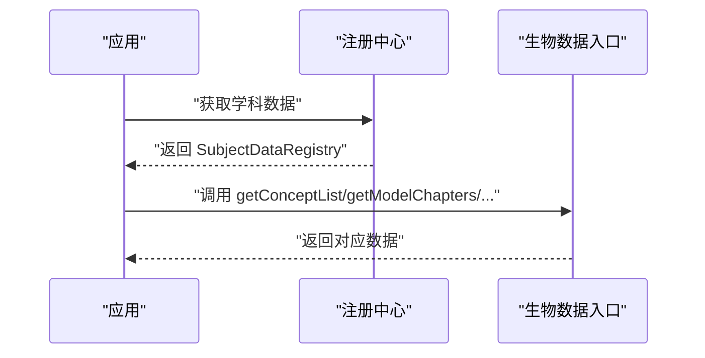
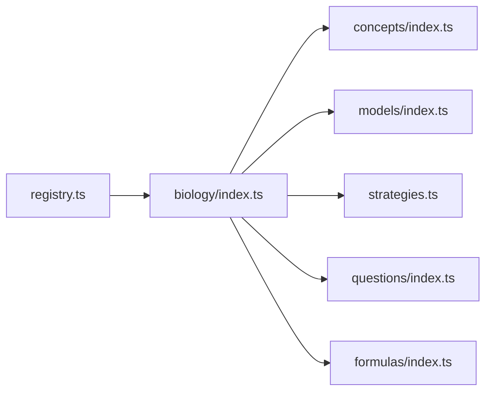

# 生物学科数据结构

<cite>
**本文引用的文件**
- [src/data/biology/index.ts](file://src/data/biology/index.ts)
- [src/data/biology/concepts/index.ts](file://src/data/biology/concepts/index.ts)
- [src/data/biology/concepts/types.ts](file://src/data/biology/concepts/types.ts)
- [src/data/biology/concepts/B01_细胞的分子组成.ts](file://src/data/biology/concepts/B01_细胞的分子组成.ts)
- [src/data/biology/models/index.ts](file://src/data/biology/models/index.ts)
- [src/data/biology/models/types.ts](file://src/data/biology/models/types.ts)
- [src/data/biology/models/M01_生物大分子组成模型.ts](file://src/data/biology/models/M01_生物大分子组成模型.ts)
- [src/data/biology/questions/index.ts](file://src/data/biology/questions/index.ts)
- [src/data/biology/questions/filters.ts](file://src/data/biology/questions/filters.ts)
- [src/data/biology/strategies.ts](file://src/data/biology/strategies.ts)
- [src/data/biology/formulas/index.ts](file://src/data/biology/formulas/index.ts)
- [src/data/registry.ts](file://src/data/registry.ts)
</cite>

## 目录
1. [引言](#引言)
2. [项目结构](#项目结构)
3. [核心组件](#核心组件)
4. [架构总览](#架构总览)
5. [详细组件分析](#详细组件分析)
6. [依赖分析](#依赖分析)
7. [性能考虑](#性能考虑)
8. [故障排查指南](#故障排查指南)
9. [结论](#结论)
10. [附录](#附录)

## 引言
本文件系统化梳理生物学科在本项目中的数据结构设计，围绕K层（知识节点）、M层（核心模型）、R层（解题套路）、P层（练习题库）四个层次，阐明知识组织方式、知识点关联、核心模型实现细节、题库组织与筛选维度，以及可视化与科学性保障机制。文档面向开发者与内容编辑者，兼顾可读性与可维护性。

## 项目结构
生物学科数据位于 src/data/biology 目录，采用“按主题分层 + 模块化文件”的组织方式：
- concepts：K层知识节点，按模块章节组织，每个概念文件定义一个概念实体及关联关系
- models：M层核心模型，按模块章节组织，每个模型文件定义一个模型实体及与概念的关联
- questions：P层练习题库，当前为空数组占位，提供过滤与统计接口
- strategies：R层解题套路，统一的策略列表与映射
- formulas：公式卡片与章节，当前为空占位
- index.ts：生物学科数据注册入口，统一导出查询与统计接口

图表来源
- [src/data/biology/index.ts:1-151](file://src/data/biology/index.ts#L1-L151)
- [src/data/registry.ts:1-52](file://src/data/registry.ts#L1-L52)

章节来源
- [src/data/biology/index.ts:1-151](file://src/data/biology/index.ts#L1-L151)
- [src/data/biology/concepts/index.ts:1-201](file://src/data/biology/concepts/index.ts#L1-L201)
- [src/data/biology/models/index.ts:1-191](file://src/data/biology/models/index.ts#L1-L191)
- [src/data/biology/questions/index.ts:1-15](file://src/data/biology/questions/index.ts#L1-L15)
- [src/data/biology/strategies.ts:1-78](file://src/data/biology/strategies.ts#L1-L78)
- [src/data/biology/formulas/index.ts:1-13](file://src/data/biology/formulas/index.ts#L1-L13)
- [src/data/registry.ts:1-52](file://src/data/registry.ts#L1-L52)

## 核心组件
- 注册中心与学科接口
  - 通过注册中心统一暴露学科数据能力，包括概念、模型、公式、套路、题库等的查询与统计接口
  - 生物学科通过入口文件完成注册，形成统一的 subject 数据访问面
- K层（概念节点）
  - 概念实体包含：标识、名称、所属模块与章节、难度、前置概念、关联模型、状态等
  - 概念按模块章节聚合，便于导航与检索
- M层（核心模型）
  - 模型实体包含：标识、名称、所属模块与章节、难度、核心思维、关联概念、状态等
  - 模型与概念之间建立双向关联，支撑知识到模型的映射
- R层（解题套路）
  - 统一的套路列表与映射，提供按ID查询能力
  - 套路命名遵循“领域-方法-范式”风格，覆盖生物各模块核心思维
- P层（练习题库）
  - 当前为占位，提供过滤选项、难度标签与颜色、题型等配置
  - 提供按模型ID筛选题目、统计模型题目数量等接口
- 公式库
  - 当前为空占位，提供章节与卡片的结构化定义

章节来源
- [src/data/registry.ts:4-38](file://src/data/registry.ts#L4-L38)
- [src/data/biology/index.ts:126-151](file://src/data/biology/index.ts#L126-L151)
- [src/data/biology/concepts/index.ts:115-117](file://src/data/biology/concepts/index.ts#L115-L117)
- [src/data/biology/models/index.ts:107-111](file://src/data/biology/models/index.ts#L107-L111)
- [src/data/biology/questions/filters.ts:1-38](file://src/data/biology/questions/filters.ts#L1-L38)
- [src/data/biology/strategies.ts:72-78](file://src/data/biology/strategies.ts#L72-L78)

## 架构总览
下图展示生物学科数据在注册中心与入口文件之间的交互关系，以及各子层的职责边界：

图表来源
- [src/data/registry.ts:42-48](file://src/data/registry.ts#L42-L48)
- [src/data/biology/index.ts:126-151](file://src/data/biology/index.ts#L126-L151)

## 详细组件分析

### K层（概念节点）数据结构与组织
- 结构要点
  - 概念实体字段：id、name、chapter、module、difficulty、prerequisites、relatedModels、status
  - 概念按模块章节聚合，形成 conceptList；同时建立 conceptDataMap 以支持快速查找
- 关联关系
  - prerequisites：前置知识链，用于构建知识图谱边
  - relatedModels：指向相关模型，建立概念到模型的映射
- 示例
  - 细胞的分子组成概念与生物大分子组成模型存在直接关联
- 可视化（概念-模型关联）

图表来源
- [src/data/biology/concepts/B01_细胞的分子组成.ts:3-13](file://src/data/biology/concepts/B01_细胞的分子组成.ts#L3-L13)
- [src/data/biology/models/M01_生物大分子组成模型.ts:3-12](file://src/data/biology/models/M01_生物大分子组成模型.ts#L3-L12)

章节来源
- [src/data/biology/concepts/index.ts:60-117](file://src/data/biology/concepts/index.ts#L60-L117)
- [src/data/biology/concepts/B01_细胞的分子组成.ts:3-13](file://src/data/biology/concepts/B01_细胞的分子组成.ts#L3-L13)

### M层（核心模型）数据结构与组织
- 结构要点
  - 模型实体字段：id、name、chapter、difficulty、coreThinking、relatedConcepts、relatedStrategies、status
  - 模型按模块章节聚合，形成 biologyModels；同时建立 modelDataMap 与 ALL_MODEL_IDS
- 关联关系
  - relatedConcepts：指向相关概念，建立模型到概念的映射
  - relatedStrategies：指向相关套路，建立模型到方法的映射
- 示例
  - 生物大分子组成模型与多个基础概念存在关联
- 可视化（模型-概念-套路）

图表来源
- [src/data/biology/models/index.ts:56-111](file://src/data/biology/models/index.ts#L56-L111)
- [src/data/biology/models/M01_生物大分子组成模型.ts:3-12](file://src/data/biology/models/M01_生物大分子组成模型.ts#L3-L12)
- [src/data/biology/strategies.ts:9-70](file://src/data/biology/strategies.ts#L9-L70)

章节来源
- [src/data/biology/models/index.ts:56-187](file://src/data/biology/models/index.ts#L56-L187)
- [src/data/biology/models/M01_生物大分子组成模型.ts:3-12](file://src/data/biology/models/M01_生物大分子组成模型.ts#L3-L12)

### R层（解题套路）数据结构与组织
- 结构要点
  - 套路实体字段：id、name、status
  - 提供 allStrategies 列表与 strategyDataMap，支持按ID查询
- 命名规范
  - 统一采用“领域-方法-范式”命名风格，覆盖生物各模块核心思维
- 可视化（套路清单）

图表来源
- [src/data/biology/strategies.ts:9-78](file://src/data/biology/strategies.ts#L9-L78)

章节来源
- [src/data/biology/strategies.ts:1-78](file://src/data/biology/strategies.ts#L1-L78)

### P层（练习题库）数据结构与组织
- 结构要点
  - 当前 questions 为空数组，提供占位接口
  - 提供过滤选项：LEVEL、TARGET、FUNCTION、DIFFICULTY、TYPE
  - 提供难度标签与颜色映射，便于UI渲染
  - 提供按模型ID筛选题目、统计模型题目数量等接口
- 可视化（题库筛选流程）

图表来源
- [src/data/biology/questions/index.ts:3-15](file://src/data/biology/questions/index.ts#L3-L15)
- [src/data/biology/questions/filters.ts:1-38](file://src/data/biology/questions/filters.ts#L1-L38)

章节来源
- [src/data/biology/questions/index.ts:1-15](file://src/data/biology/questions/index.ts#L1-L15)
- [src/data/biology/questions/filters.ts:1-38](file://src/data/biology/questions/filters.ts#L1-L38)

### 公式库（占位）与注册中心
- 结构要点
  - 公式库当前为空占位，提供公式卡片与章节的结构化定义
  - 注册中心定义统一的学科数据接口契约，确保不同学科的一致性
- 可视化（注册与查询）

图表来源
- [src/data/registry.ts:42-48](file://src/data/registry.ts#L42-L48)
- [src/data/biology/index.ts:126-151](file://src/data/biology/index.ts#L126-L151)

章节来源
- [src/data/biology/formulas/index.ts:1-13](file://src/data/biology/formulas/index.ts#L1-L13)
- [src/data/registry.ts:1-52](file://src/data/registry.ts#L1-L52)

## 依赖分析
- 组件耦合
  - 生物数据入口依赖概念、模型、套路、题库、公式子系统
  - 各子系统内部通过索引（Map/数组）提升查询效率
- 外部依赖
  - 注册中心提供统一接口契约，避免上层直接依赖具体实现
- 可能的循环依赖
  - 当前未发现直接循环依赖；概念与模型的关联为单向或通过ID间接关联

图表来源
- [src/data/biology/index.ts:1-151](file://src/data/biology/index.ts#L1-L151)
- [src/data/registry.ts:1-52](file://src/data/registry.ts#L1-L52)

章节来源
- [src/data/biology/index.ts:1-151](file://src/data/biology/index.ts#L1-L151)
- [src/data/registry.ts:1-52](file://src/data/registry.ts#L1-L52)

## 性能考虑
- 查询性能
  - 概念与模型均提供 Map 索引，支持 O(1) 级别的按ID查询
  - 概念与模型列表按模块章节聚合，便于前端分页与懒加载
- 计算开销
  - 题目统计与按模型分组在运行时进行，建议在数据量增大后引入缓存或服务端聚合
- 渲染优化
  - 难度标签与颜色映射集中管理，减少重复计算
- 扩展性
  - 注册中心接口契约明确，新增学科或模块无需修改上层调用代码

## 故障排查指南
- 常见问题
  - 概念或模型ID缺失：检查 ID 是否存在于相应 Map 中
  - 关联关系不一致：确认 relatedModels 与 relatedConcepts 的双向一致性
  - 题目统计异常：确认题目是否正确设置 modelId 字段
- 排查步骤
  - 使用 getConceptMeta 与 getModelById 校验元数据
  - 使用 getQuestionsByModel 校验题目分组
  - 使用 getModelQuestionStats 校验统计结果
- 建议
  - 在构建阶段增加校验脚本，确保 ID 唯一性与关联完整性
  - 对外暴露的接口增加参数校验与默认值处理

章节来源
- [src/data/biology/index.ts:27-36](file://src/data/biology/index.ts#L27-L36)
- [src/data/biology/index.ts:106-124](file://src/data/biology/index.ts#L106-L124)
- [src/data/biology/models/index.ts:189-191](file://src/data/biology/models/index.ts#L189-L191)
- [src/data/biology/concepts/index.ts:199-201](file://src/data/biology/concepts/index.ts#L199-L201)

## 结论
本项目以清晰的K/M/R/P四层结构组织生物学科数据，通过注册中心统一暴露接口，辅以概念-模型-套路的关联设计，为知识导航、模型学习与题库训练提供了可扩展的数据骨架。当前题库与公式库处于占位状态，后续可通过完善数据与增强统计能力进一步提升教学效果与用户体验。

## 附录
- 数据类型与接口契约
  - 概念类型与模型类型复用物理学科类型定义，保持跨学科一致性
- 套路命名规范
  - 统一采用“领域-方法-范式”风格，便于检索与教学使用
- 题库筛选维度
  - 级别、目标、功能、难度、题型等维度已标准化，便于前端统一渲染

章节来源
- [src/data/biology/concepts/types.ts:1-3](file://src/data/biology/concepts/types.ts#L1-L3)
- [src/data/biology/models/types.ts:1-3](file://src/data/biology/models/types.ts#L1-L3)
- [src/data/biology/questions/types.ts:1-3](file://src/data/biology/questions/types.ts#L1-L3)
- [src/data/biology/strategies.ts:9-70](file://src/data/biology/strategies.ts#L9-L70)
- [src/data/biology/questions/filters.ts:1-38](file://src/data/biology/questions/filters.ts#L1-L38)