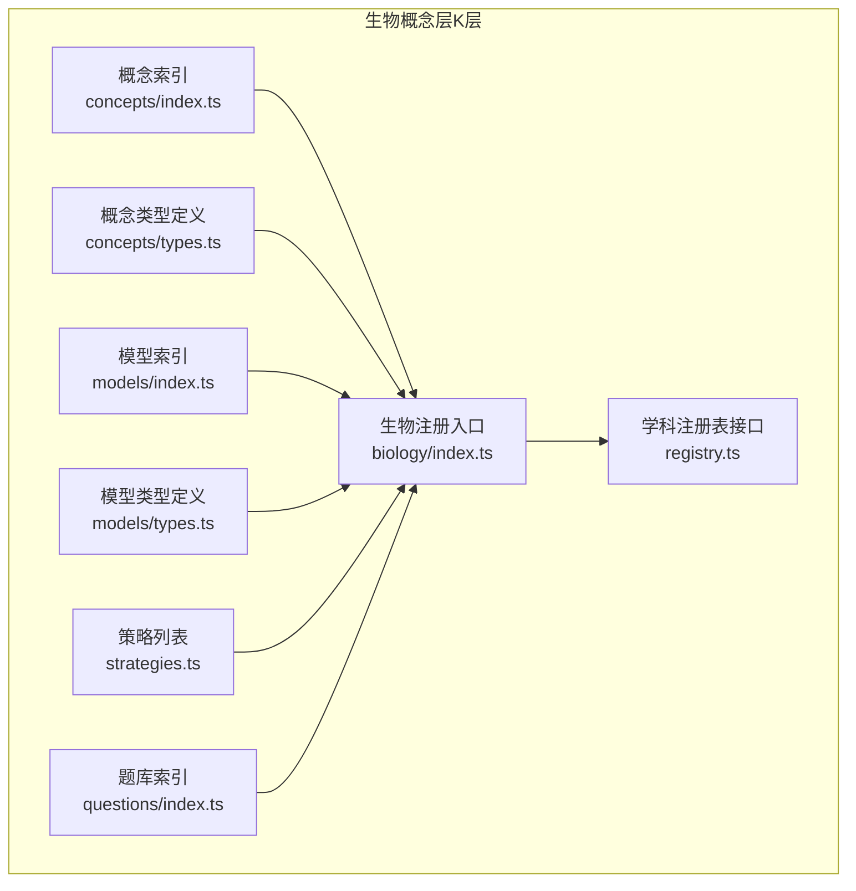
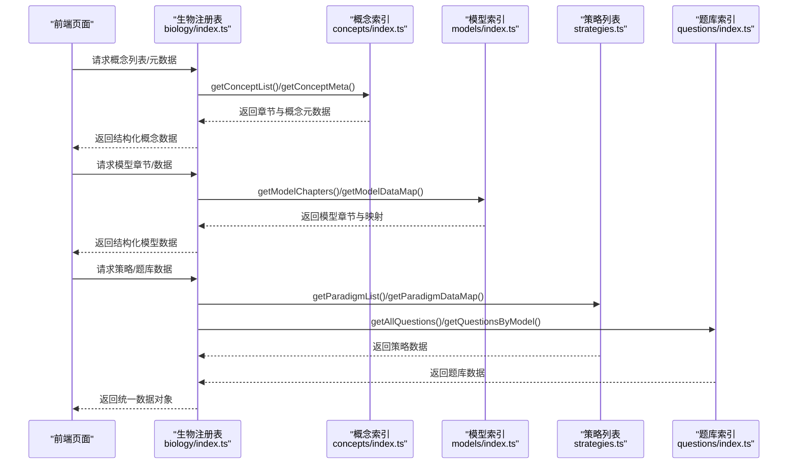
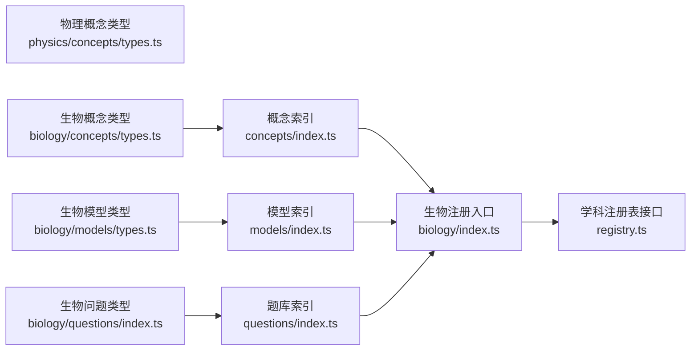

# 生物概念层（K层）

<cite>
**本文引用的文件**
- [src/data/biology/concepts/index.ts](file://src/data/biology/concepts/index.ts)
- [src/data/biology/concepts/types.ts](file://src/data/biology/concepts/types.ts)
- [src/data/biology/models/index.ts](file://src/data/biology/models/index.ts)
- [src/data/biology/models/types.ts](file://src/data/biology/models/types.ts)
- [src/data/biology/questions/index.ts](file://src/data/biology/questions/index.ts)
- [src/data/biology/strategies.ts](file://src/data/biology/strategies.ts)
- [src/data/biology/index.ts](file://src/data/biology/index.ts)
- [src/data/physics/concepts/types.ts](file://src/data/physics/concepts/types.ts)
- [src/data/registry.ts](file://src/data/registry.ts)
- [src/data/biology/concepts/B01_细胞的分子组成.ts](file://src/data/biology/concepts/B01_细胞的分子组成.ts)
- [src/data/biology/concepts/B02_蛋白质的结构与功能.ts](file://src/data/biology/concepts/B02_蛋白质的结构与功能.ts)
- [src/data/biology/concepts/B08_物质跨膜运输.ts](file://src/data/biology/concepts/B08_物质跨膜运输.ts)
- [src/data/biology/models/M01_生物大分子组成模型.ts](file://src/data/biology/models/M01_生物大分子组成模型.ts)
</cite>

## 目录
1. [引言](#引言)
2. [项目结构](#项目结构)
3. [核心组件](#核心组件)
4. [架构总览](#架构总览)
5. [详细组件分析](#详细组件分析)
6. [依赖分析](#依赖分析)
7. [性能考虑](#性能考虑)
8. [故障排查指南](#故障排查指南)
9. [结论](#结论)
10. [附录](#附录)

## 引言
本文件系统化梳理“生物概念层（K层）”的知识节点设计与组织方式，覆盖从分子到系统的完整知识谱系，包括：细胞的分子组成、蛋白质结构与功能、核酸结构与功能、糖类与脂质、细胞膜结构与功能、细胞器分工合作、细胞核结构与功能、物质跨膜运输、酶与ATP、细胞呼吸与光合作用、细胞的生命历程、有丝分裂、孟德尔遗传定律、减数分裂与受精作用、基因在染色体上、DNA是主要遗传物质、DNA复制、基因的表达、基因突变与基因重组、染色体变异、生物的变异与育种、现代生物进化理论、共同进化与生物多样性、内环境与稳态、神经调节、体液调节、神经体液调节、免疫系统、植物的激素调节、种群、群落、生态系统、生物技术与工程等主题。文档同时阐明概念难度分级（基础、核心、扩展）、概念间层级关系与关联性，给出概念数据结构、属性定义、模块划分与章节组织，以及概念导入导出机制、数据验证规则与科学性保证，并提供概念搜索、过滤与排序的实现细节。

## 项目结构
生物概念层采用“按主题分模块、按学科统一注册”的组织方式：
- 概念层（concepts）：以单个知识点为单位，定义概念ID、名称、所属模块与章节、难度、前置与关联关系等。
- 模型层（models）：围绕核心概念构建“分析模型”，强调思维范式与知识迁移。
- 策略层（strategies）：提供可复用的思维范式与方法论，用于指导模型构建与问题解决。
- 问题层（questions）：承载题库数据，支持按模型维度统计与筛选。
- 注册层（biology/index.ts）：将概念、模型、公式、策略、问题等统一注册到学科数据注册表，供前端页面与工具使用。

图表来源
- [src/data/biology/concepts/index.ts:1-113](file://src/data/biology/concepts/index.ts#L1-L113)
- [src/data/biology/concepts/types.ts:1-3](file://src/data/biology/concepts/types.ts#L1-L3)
- [src/data/biology/models/index.ts:1-105](file://src/data/biology/models/index.ts#L1-L105)
- [src/data/biology/models/types.ts:1-3](file://src/data/biology/models/types.ts#L1-L3)
- [src/data/biology/strategies.ts:1-70](file://src/data/biology/strategies.ts#L1-L70)
- [src/data/biology/questions/index.ts:1-15](file://src/data/biology/questions/index.ts#L1-L15)
- [src/data/biology/index.ts:1-151](file://src/data/biology/index.ts#L1-L151)
- [src/data/registry.ts:1-52](file://src/data/registry.ts#L1-L52)

章节来源
- [src/data/biology/concepts/index.ts:1-113](file://src/data/biology/concepts/index.ts#L1-L113)
- [src/data/biology/models/index.ts:1-105](file://src/data/biology/models/index.ts#L1-L105)
- [src/data/biology/strategies.ts:1-70](file://src/data/biology/strategies.ts#L1-L70)
- [src/data/biology/questions/index.ts:1-15](file://src/data/biology/questions/index.ts#L1-L15)
- [src/data/biology/index.ts:1-151](file://src/data/biology/index.ts#L1-L151)
- [src/data/registry.ts:1-52](file://src/data/registry.ts#L1-L52)

## 核心组件
- 概念数据结构（ConceptData）
  - 字段：id、name、chapter、module、difficulty、prerequisites、relatedModels、relatedStrategies、status
  - 来源：通过“物理概念类型”对齐，确保跨学科一致的结构与扩展能力
- 模型数据结构（ModelData）
  - 字段：id、name、chapter、difficulty、coreThinking、relatedConcepts、relatedStrategies、status
  - 用途：承载“分析模型”，强调思维范式与知识迁移
- 策略数据结构（Strategy）
  - 字段：id、name、status
  - 用途：提供可复用的思维范式，指导模型构建与问题解决
- 问题数据结构（Question）
  - 字段：由物理学科问题类型对齐，支持按模型维度统计与筛选
- 注册与导出
  - 通过 registerSubject 将概念、模型、公式、策略、问题等统一注册，形成学科数据注册表

章节来源
- [src/data/physics/concepts/types.ts:51-77](file://src/data/physics/concepts/types.ts#L51-L77)
- [src/data/biology/concepts/types.ts:1-3](file://src/data/biology/concepts/types.ts#L1-L3)
- [src/data/biology/models/types.ts:1-3](file://src/data/biology/models/types.ts#L1-L3)
- [src/data/biology/strategies.ts:1-70](file://src/data/biology/strategies.ts#L1-L70)
- [src/data/biology/questions/index.ts:1-15](file://src/data/biology/questions/index.ts#L1-L15)
- [src/data/biology/index.ts:126-151](file://src/data/biology/index.ts#L126-L151)

## 架构总览
生物概念层遵循“概念—模型—策略—问题”的知识闭环，通过注册表对外提供统一查询与检索能力。概念层负责知识节点的标准化描述；模型层承载思维范式与迁移路径；策略层提供可复用的方法论；问题层支撑训练与评估。

图表来源
- [src/data/biology/index.ts:11-151](file://src/data/biology/index.ts#L11-L151)
- [src/data/biology/concepts/index.ts:119-201](file://src/data/biology/concepts/index.ts#L119-L201)
- [src/data/biology/models/index.ts:113-191](file://src/data/biology/models/index.ts#L113-L191)
- [src/data/biology/strategies.ts:9-78](file://src/data/biology/strategies.ts#L9-L78)
- [src/data/biology/questions/index.ts:1-15](file://src/data/biology/questions/index.ts#L1-L15)

章节来源
- [src/data/biology/index.ts:126-151](file://src/data/biology/index.ts#L126-L151)

## 详细组件分析

### 概念数据结构与属性定义
- 结构字段
  - id：概念唯一标识（如 BIO-B01）
  - name：概念名称（如 细胞的分子组成）
  - chapter/module：所属章节与模块（如 分子与细胞/必修1）
  - difficulty：难度等级（基础/核心/扩展）
  - prerequisites：前置概念ID列表
  - relatedModels：关联模型ID列表
  - relatedStrategies：关联策略ID列表
  - status：发布状态（如 coming_soon）
- 设计要点
  - 与物理概念类型对齐，确保跨学科一致性
  - 通过 Map 快速按ID检索概念
  - 提供按章节分组的概念列表，便于导航与学习路径组织

章节来源
- [src/data/physics/concepts/types.ts:51-77](file://src/data/physics/concepts/types.ts#L51-L77)
- [src/data/biology/concepts/types.ts:1-3](file://src/data/biology/concepts/types.ts#L1-L3)
- [src/data/biology/concepts/index.ts:115-201](file://src/data/biology/concepts/index.ts#L115-L201)

### 模型数据结构与属性定义
- 结构字段
  - id/name/chapter/difficulty/coreThinking：与概念类似
  - relatedConcepts：关联概念ID列表
  - relatedStrategies：关联策略ID列表
  - status：发布状态
- 设计要点
  - 强调“思维范式”与“知识迁移”，将抽象方法具象化
  - 与概念层双向关联，形成“概念驱动模型、模型反哺概念”的闭环

章节来源
- [src/data/biology/models/types.ts:1-3](file://src/data/biology/models/types.ts#L1-L3)
- [src/data/biology/models/index.ts:107-191](file://src/data/biology/models/index.ts#L107-L191)

### 策略数据结构与属性定义
- 结构字段
  - id/name/status：策略标识、名称与状态
- 设计要点
  - 提供可复用的思维范式（如“性质-方向-能量范式”“系统观范式”等）
  - 支持与模型/概念的灵活关联，便于教学与训练

章节来源
- [src/data/biology/strategies.ts:1-78](file://src/data/biology/strategies.ts#L1-L78)

### 问题数据结构与统计
- 结构字段
  - 与物理问题类型对齐，支持按模型维度统计与筛选
- 统计能力
  - 按模型统计题目总量与正确率
  - 按模型聚合题目集合，支持题库管理与训练编排

章节来源
- [src/data/biology/questions/index.ts:1-15](file://src/data/biology/questions/index.ts#L1-L15)
- [src/data/biology/index.ts:106-124](file://src/data/biology/index.ts#L106-L124)

### 概念导入与导出机制
- 导入
  - 在 concepts/index.ts 中集中导入各概念文件，并汇总到 allConcepts 与 conceptList
  - 在 models/index.ts 中集中导入各模型文件，并汇总到 allModels 与 biologyModels
  - 在 biology/index.ts 中通过 registerSubject 注册所有数据
- 导出
  - 提供 getConceptList/getConceptMeta/getAllConceptIds 等查询接口
  - 提供 getModelChapters/getModelDataMap/getAllModelIds 等查询接口
  - 提供 getFormulaData/searchFormulas 等公式相关接口
  - 提供 getParadigmList/getParadigmDataMap 等策略接口
  - 提供 getModelQuestionStats/getAllQuestions/getQuestionsByModel 等题库接口

章节来源
- [src/data/biology/concepts/index.ts:3-113](file://src/data/biology/concepts/index.ts#L3-L113)
- [src/data/biology/models/index.ts:3-105](file://src/data/biology/models/index.ts#L3-L105)
- [src/data/biology/index.ts:11-151](file://src/data/biology/index.ts#L11-L151)

### 数据验证规则与科学性保证
- 规则建议
  - ID 唯一性：概念/模型/策略/题目的 id 必须全局唯一
  - 前置关系一致性：prerequisites 中的 id 必须存在于概念集合
  - 关联完整性：relatedModels/relatedConcepts/relatedStrategies 的 id 必须存在
  - 状态约束：status 仅允许 registered 的枚举值
  - 难度映射：difficulty 与数值映射需保持一致（基础=1，核心=2，扩展=3）
- 科学性保证
  - 概念与模型均来自权威教材与课程标准
  - 模型强调“结构决定功能”“能量守恒”“信息传递”等生物学核心观念
  - 策略范式覆盖实验设计、因果推断、系统分析等科学思维

章节来源
- [src/data/biology/concepts/index.ts:115-201](file://src/data/biology/concepts/index.ts#L115-L201)
- [src/data/biology/models/index.ts:107-191](file://src/data/biology/models/index.ts#L107-L191)
- [src/data/biology/strategies.ts:1-78](file://src/data/biology/strategies.ts#L1-L78)

### 概念搜索、过滤与排序
- 搜索
  - 概念搜索：基于概念名称与章节进行模糊匹配
  - 公式搜索：基于公式名称与章节进行模糊匹配
- 过滤
  - 按模块/章节过滤概念与模型
  - 按难度（基础/核心/扩展）过滤
  - 按目标（同步学习/期中期末/高考专项/竞赛拓展）与功能（巩固练习/复习检测/诊断评估/真题演练）过滤题库
- 排序
  - 按章节顺序与概念编号排序
  - 按难度数值排序（基础=1，核心=2，扩展=3）

章节来源
- [src/data/biology/index.ts:51-99](file://src/data/biology/index.ts#L51-L99)

### 概念难度分级与层级关系
- 难度分级
  - 基础：对应数值 1
  - 核心：对应数值 2
  - 扩展：对应数值 3
- 层级关系
  - 通过 prerequisites 定义前置关系，形成概念依赖图
  - 通过 relatedModels/relatedStrategies 建立概念与模型、策略的关联
  - 通过章节分组（分子与细胞/遗传与进化/稳态与调节/生物与环境/生物技术与工程）组织知识网络

章节来源
- [src/data/biology/concepts/index.ts:119-197](file://src/data/biology/concepts/index.ts#L119-L197)
- [src/data/biology/concepts/B01_细胞的分子组成.ts:1-13](file://src/data/biology/concepts/B01_细胞的分子组成.ts#L1-L13)
- [src/data/biology/concepts/B02_蛋白质的结构与功能.ts:1-13](file://src/data/biology/concepts/B02_蛋白质的结构与功能.ts#L1-L13)
- [src/data/biology/concepts/B08_物质跨膜运输.ts:1-13](file://src/data/biology/concepts/B08_物质跨膜运输.ts#L1-L13)

### 概念与模型的关联性
- 示例
  - B01_细胞的分子组成 与 M01_生物大分子组成模型 关联
  - B02_蛋白质的结构与功能 与 M02_蛋白质结构功能分析模型 关联
  - B08_物质跨膜运输 与 M05_物质跨膜运输判断模型 关联
- 关联意义
  - 概念驱动模型：以核心概念为锚点，构建分析模型
  - 模型反哺概念：通过模型训练加深对概念的理解与迁移

章节来源
- [src/data/biology/concepts/B01_细胞的分子组成.ts:1-13](file://src/data/biology/concepts/B01_细胞的分子组成.ts#L1-L13)
- [src/data/biology/concepts/B02_蛋白质的结构与功能.ts:1-13](file://src/data/biology/concepts/B02_蛋白质的结构与功能.ts#L1-L13)
- [src/data/biology/concepts/B08_物质跨膜运输.ts:1-13](file://src/data/biology/concepts/B08_物质跨膜运输.ts#L1-L13)
- [src/data/biology/models/M01_生物大分子组成模型.ts:1-12](file://src/data/biology/models/M01_生物大分子组成模型.ts#L1-L12)

## 依赖分析
- 组件耦合
  - concepts/index.ts 与 models/index.ts 通过 biology/index.ts 统一注册
  - concepts/types.ts 与 models/types.ts 借助物理类型定义实现跨学科一致性
  - registry.ts 定义了学科注册表接口，约束数据导出格式
- 外部依赖
  - 与物理学科类型对齐，确保跨学科数据结构一致
  - 与前端页面组件配合，提供概念列表、详情、模型与题库数据

图表来源
- [src/data/physics/concepts/types.ts:1-78](file://src/data/physics/concepts/types.ts#L1-L78)
- [src/data/biology/concepts/types.ts:1-3](file://src/data/biology/concepts/types.ts#L1-L3)
- [src/data/biology/models/types.ts:1-3](file://src/data/biology/models/types.ts#L1-L3)
- [src/data/biology/questions/index.ts:1-15](file://src/data/biology/questions/index.ts#L1-L15)
- [src/data/biology/concepts/index.ts:1-113](file://src/data/biology/concepts/index.ts#L1-L113)
- [src/data/biology/models/index.ts:1-105](file://src/data/biology/models/index.ts#L1-L105)
- [src/data/biology/index.ts:1-151](file://src/data/biology/index.ts#L1-L151)
- [src/data/registry.ts:1-52](file://src/data/registry.ts#L1-L52)

章节来源
- [src/data/biology/concepts/index.ts:1-113](file://src/data/biology/concepts/index.ts#L1-L113)
- [src/data/biology/models/index.ts:1-105](file://src/data/biology/models/index.ts#L1-L105)
- [src/data/biology/index.ts:1-151](file://src/data/biology/index.ts#L1-L151)
- [src/data/registry.ts:1-52](file://src/data/registry.ts#L1-L52)

## 性能考虑
- 内存占用
  - 使用 Map 构建概念与模型的 id->实体映射，查询复杂度 O(1)
  - 按章节分组的概念列表减少前端渲染压力
- 查询效率
  - 概念/模型/策略/题库均提供按 id 查询与按模型聚合的接口
  - 公式搜索采用字符串包含匹配，建议在数据量增大后引入索引或分词
- 可扩展性
  - 新增概念/模型/策略/题库只需在对应 index 文件中导入与汇总
  - 通过 registerSubject 统一注册，避免重复导出逻辑

## 故障排查指南
- 常见问题
  - 概念ID重复：检查 concepts/index.ts 中 allConcepts 的 id 唯一性
  - 前置概念缺失：检查 prerequisites 中的 id 是否存在于 allConcepts
  - 关联对象不存在：检查 relatedModels/relatedConcepts/relatedStrategies 的 id 是否存在
  - 题目未按模型聚合：检查 questions 中的 modelId 字段是否正确
- 排查步骤
  - 使用 getConceptById/getModelById 获取单条数据核对字段
  - 使用 getAllConceptIds/getAllModelIds 校验 id 列表
  - 使用 getModelQuestionStats 查看题库统计是否异常

章节来源
- [src/data/biology/concepts/index.ts:199-201](file://src/data/biology/concepts/index.ts#L199-L201)
- [src/data/biology/models/index.ts:189-191](file://src/data/biology/models/index.ts#L189-L191)
- [src/data/biology/index.ts:106-124](file://src/data/biology/index.ts#L106-L124)

## 结论
生物概念层（K层）以“概念—模型—策略—问题”为主线，构建了从基础到扩展的完整知识网络。通过统一的数据结构与注册机制，实现了跨学科一致性与高效的数据管理。建议在后续迭代中完善数据校验与索引机制，持续优化搜索与过滤体验，并加强科学性审核与内容质量保障。

## 附录
- 章节组织
  - 分子与细胞：细胞的分子组成、蛋白质结构与功能、核酸结构与功能、糖类与脂质、细胞膜结构与功能、细胞器分工合作、细胞核结构与功能、物质跨膜运输、酶的本质与特性、ATP的结构与功能、细胞呼吸、光合作用、细胞的生命历程、有丝分裂
  - 遗传与进化：孟德尔遗传定律、减数分裂与受精作用、基因在染色体上、DNA是主要遗传物质、DNA的复制、基因的表达、基因突变与基因重组、染色体变异、生物的变异与育种、现代生物进化理论、共同进化与生物多样性
  - 稳态与调节：内环境与稳态、神经调节的结构基础、兴奋在神经纤维上的传导、兴奋在神经元之间的传递、神经系统的分级调节与人脑高级功能、体液调节、激素调节的实例、神经体液调节的协调、免疫系统的组成与功能、特异性免疫、免疫失调、植物的激素调节
  - 生物与环境：种群的特征、种群数量的变化、群落的结构、群落的演替、生态系统的结构、生态系统的能量流动、生态系统的物质循环、生态系统的稳定性
  - 生物技术与工程：基因工程的基本工具、基因工程的操作步骤、基因工程的应用、细胞工程、胚胎工程、发酵工程

章节来源
- [src/data/biology/concepts/index.ts:119-197](file://src/data/biology/concepts/index.ts#L119-L197)