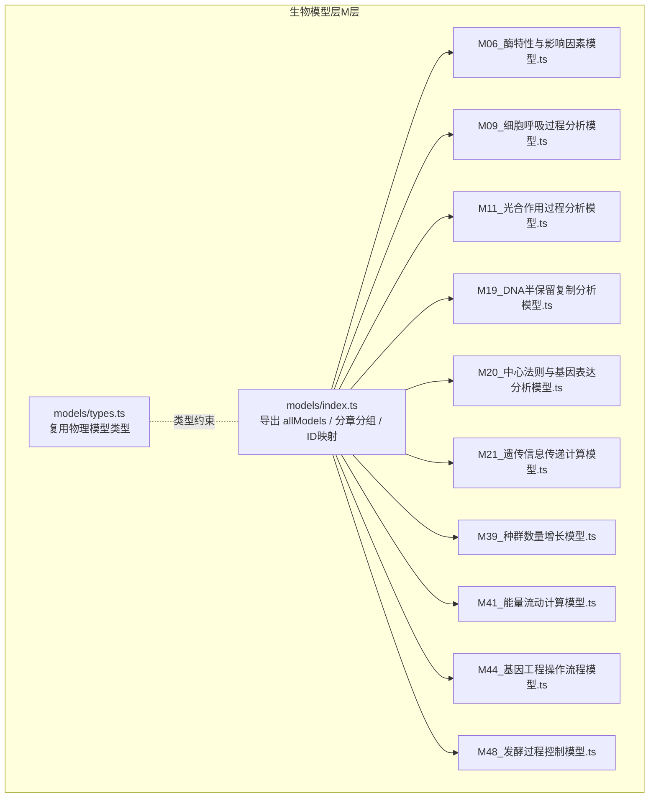
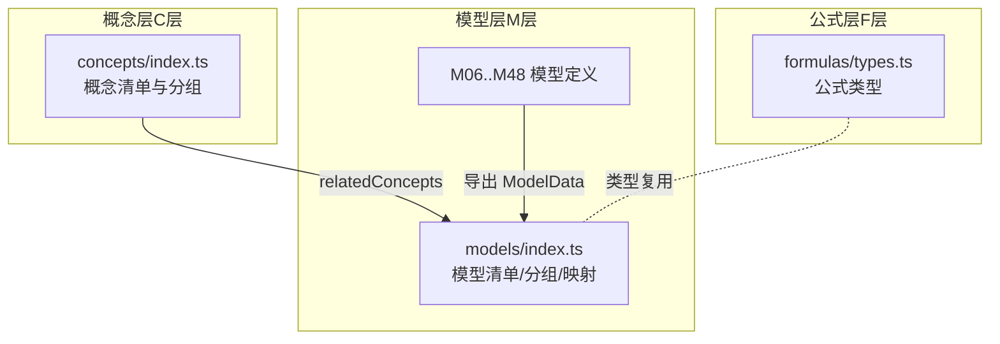
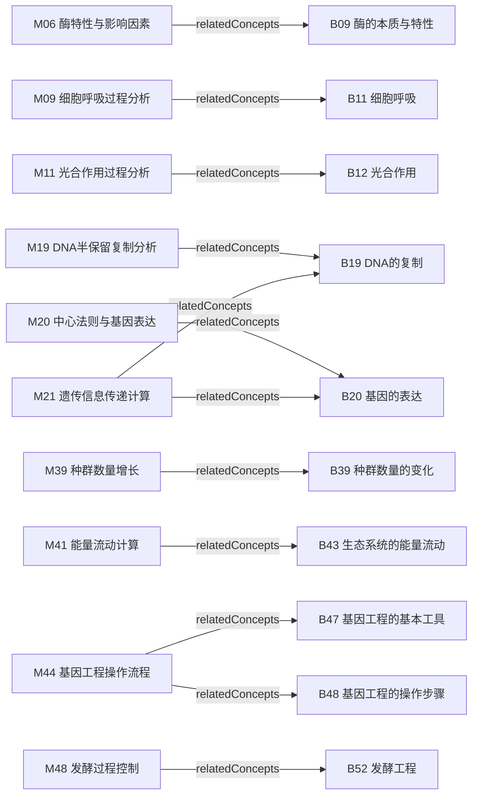

# 生物模型层（M层）

<cite>
**本文引用的文件**
- [src/data/biology/models/index.ts](file://src/data/biology/models/index.ts)
- [src/data/biology/models/types.ts](file://src/data/biology/models/types.ts)
- [src/data/biology/concepts/index.ts](file://src/data/biology/concepts/index.ts)
- [src/data/biology/concepts/types.ts](file://src/data/biology/concepts/types.ts)
- [src/data/biology/formulas/types.ts](file://src/data/biology/formulas/types.ts)
- [src/data/biology/models/M06_酶特性与影响因素模型.ts](file://src/data/biology/models/M06_酶特性与影响因素模型.ts)
- [src/data/biology/models/M09_细胞呼吸过程分析模型.ts](file://src/data/biology/models/M09_细胞呼吸过程分析模型.ts)
- [src/data/biology/models/M11_光合作用过程分析模型.ts](file://src/data/biology/models/M11_光合作用过程分析模型.ts)
- [src/data/biology/models/M19_DNA半保留复制分析模型.ts](file://src/data/biology/models/M19_DNA半保留复制分析模型.ts)
- [src/data/biology/models/M20_中心法则与基因表达分析模型.ts](file://src/data/biology/models/M20_中心法则与基因表达分析模型.ts)
- [src/data/biology/models/M21_遗传信息传递计算模型.ts](file://src/data/biology/models/M21_遗传信息传递计算模型.ts)
- [src/data/biology/models/M39_种群数量增长模型.ts](file://src/data/biology/models/M39_种群数量增长模型.ts)
- [src/data/biology/models/M41_能量流动计算模型.ts](file://src/data/biology/models/M41_能量流动计算模型.ts)
- [src/data/biology/models/M44_基因工程操作流程模型.ts](file://src/data/biology/models/M44_基因工程操作流程模型.ts)
- [src/data/biology/models/M48_发酵过程控制模型.ts](file://src/data/biology/models/M48_发酵过程控制模型.ts)
</cite>

## 目录
1. [引言](#引言)
2. [项目结构](#项目结构)
3. [核心组件](#核心组件)
4. [架构总览](#架构总览)
5. [详细组件分析](#详细组件分析)
6. [依赖分析](#依赖分析)
7. [性能考虑](#性能考虑)
8. [故障排查指南](#故障排查指南)
9. [结论](#结论)
10. [附录](#附录)

## 引言
本文件面向“生物模型层（M层）”，系统化梳理与文档化生物学核心模型的数据结构、参数定义、思维方法、相关概念与策略、以及模型间的关联关系与组合使用方式。重点覆盖以下主题：
- 细胞呼吸过程分析
- 光合作用过程分析
- DNA复制分析
- 基因表达分析
- 遗传信息传递计算
- 酶特性与影响因素
- 生态系统结构与功能（能量流动、种群增长、碳循环、稳定性等）
- 生物技术与工程流程（基因工程、发酵工程）

同时，给出模型可视化展示、动态演示与交互式学习的实现建议，帮助教师与学生高效掌握生物学科的建模与应用能力。

## 项目结构
生物模型层位于 src/data/biology 下，采用按“模型编号+名称”的模块化组织方式，每个模型以独立 TS 文件导出一个 ModelData 对象，统一由 models/index.ts 汇总导出，形成全量模型清单、按章节分组列表与按 ID 查询映射。

**图示来源**
- [src/data/biology/models/index.ts:56-105](file://src/data/biology/models/index.ts#L56-L105)
- [src/data/biology/models/types.ts:1-3](file://src/data/biology/models/types.ts#L1-L3)
- [src/data/biology/models/M06_酶特性与影响因素模型.ts:1-12](file://src/data/biology/models/M06_酶特性与影响因素模型.ts#L1-L12)
- [src/data/biology/models/M09_细胞呼吸过程分析模型.ts:1-12](file://src/data/biology/models/M09_细胞呼吸过程分析模型.ts#L1-L12)
- [src/data/biology/models/M11_光合作用过程分析模型.ts:1-12](file://src/data/biology/models/M11_光合作用过程分析模型.ts#L1-L12)
- [src/data/biology/models/M19_DNA半保留复制分析模型.ts:1-12](file://src/data/biology/models/M19_DNA半保留复制分析模型.ts#L1-L12)
- [src/data/biology/models/M20_中心法则与基因表达分析模型.ts:1-12](file://src/data/biology/models/M20_中心法则与基因表达分析模型.ts#L1-L12)
- [src/data/biology/models/M21_遗传信息传递计算模型.ts:1-12](file://src/data/biology/models/M21_遗传信息传递计算模型.ts#L1-L12)
- [src/data/biology/models/M39_种群数量增长模型.ts:1-12](file://src/data/biology/models/M39_种群数量增长模型.ts#L1-L12)
- [src/data/biology/models/M41_能量流动计算模型.ts:1-12](file://src/data/biology/models/M41_能量流动计算模型.ts#L1-L12)
- [src/data/biology/models/M44_基因工程操作流程模型.ts:1-12](file://src/data/biology/models/M44_基因工程操作流程模型.ts#L1-L12)
- [src/data/biology/models/M48_发酵过程控制模型.ts:1-12](file://src/data/biology/models/M48_发酵过程控制模型.ts#L1-L12)

**章节来源**
- [src/data/biology/models/index.ts:1-191](file://src/data/biology/models/index.ts#L1-L191)
- [src/data/biology/models/types.ts:1-3](file://src/data/biology/models/types.ts#L1-L3)

## 核心组件
- 模型数据结构（ModelData）：统一承载模型标识、名称、所属章节、难度、核心思维方法、关联概念与策略、状态等字段；当前类型复用自物理模型类型，便于跨学科一致化管理。
- 模型清单与分组：
  - 全量模型数组：allModels
  - 按章节分组：ALL_MODEL_IDS、biologyModels（按“分子与细胞”“遗传与进化”“稳态与调节”“生物与环境”“生物技术与工程”分组）
  - ID 到模型对象映射：modelDataMap，支持 O(1) 查询
- 概念层与公式层：
  - 概念层（B01–B52）：与模型通过 relatedConcepts 关联
  - 公式层类型：复用物理公式类型，便于跨学科统一

**章节来源**
- [src/data/biology/models/index.ts:56-191](file://src/data/biology/models/index.ts#L56-L191)
- [src/data/biology/models/types.ts:1-3](file://src/data/biology/models/types.ts#L1-L3)
- [src/data/biology/concepts/index.ts:115-201](file://src/data/biology/concepts/index.ts#L115-L201)
- [src/data/biology/concepts/types.ts:1-3](file://src/data/biology/concepts/types.ts#L1-L3)
- [src/data/biology/formulas/types.ts:1-3](file://src/data/biology/formulas/types.ts#L1-L3)

## 架构总览
下图展示模型层的总体组织与关系：模型文件按编号命名并导出 ModelData；index.ts 负责汇总、分组与查询；概念层通过 ID 关联到模型；公式层类型与之并行存在。

**图示来源**
- [src/data/biology/concepts/index.ts:115-201](file://src/data/biology/concepts/index.ts#L115-L201)
- [src/data/biology/models/index.ts:56-191](file://src/data/biology/models/index.ts#L56-L191)
- [src/data/biology/formulas/types.ts:1-3](file://src/data/biology/formulas/types.ts#L1-L3)

## 详细组件分析

### 细胞呼吸过程分析模型（M09）
- 模型定位：分子与细胞章节
- 核心思维：过程分析
- 关联概念：B11（细胞呼吸）
- 难度：J（进阶）
- 状态：coming_soon（待完善）

该模型聚焦于细胞呼吸的三个阶段（糖酵解、柠檬酸循环、电子传递链）的物质与能量变化，强调过程的阶段性、关键酶与产物通量。建议配套图示（如反应路径图、能量收支图）与交互式动画（展示 NADH/FADH2 电子传递、ATP 合成位置）。

**章节来源**
- [src/data/biology/models/M09_细胞呼吸过程分析模型.ts:1-12](file://src/data/biology/models/M09_细胞呼吸过程分析模型.ts#L1-L12)

### 光合作用过程分析模型（M11）
- 模型定位：分子与细胞章节
- 核心思维：过程建模
- 关联概念：B12（光合作用）
- 难度：J（进阶）
- 状态：coming_soon（待完善）

该模型聚焦光反应与暗反应的物质与能量转换，强调光能捕获、电子传递链、碳固定与再生循环。建议配合光反应与暗反应对比图、CO2 固定途径图与影响因素（光照、温度、CO2 浓度）的交互演示。

**章节来源**
- [src/data/biology/models/M11_光合作用过程分析模型.ts:1-12](file://src/data/biology/models/M11_光合作用过程分析模型.ts#L1-L12)

### DNA 半保留复制分析模型（M19）
- 模型定位：遗传与进化章节
- 核心思维：半保留机制
- 关联概念：B19（DNA 的复制）
- 难度：J（进阶）
- 状态：coming_soon（待完善）

该模型强调 DNA 双链解开、引物合成、子链延伸与错配修复，突出半保留复制的保真性与关键酶（解旋酶、引物酶、DNA 聚合酶、DNA 连接酶）。建议用动态图展示复制叉推进、随从链不连续合成与冈崎片段连接。

**章节来源**
- [src/data/biology/models/M19_DNA半保留复制分析模型.ts:1-12](file://src/data/biology/models/M19_DNA半保留复制分析模型.ts#L1-L12)

### 中心法则与基因表达分析模型（M20）
- 模型定位：遗传与进化章节
- 核心思维：信息传递
- 关联概念：B20（基因的表达）
- 难度：J（进阶）
- 状态：coming_soon（待完善）

该模型涵盖转录（启动子、RNA 聚合酶、mRNA 合成）与翻译（核糖体、tRNA、密码子/反密码子配对、终止密码子）全过程，强调信息从 DNA→RNA→蛋白质的流向与调控位点。建议用时序图展示转录起始复合物组装与翻译起始复合物组装。

**章节来源**
- [src/data/biology/models/M20_中心法则与基因表达分析模型.ts:1-12](file://src/data/biology/models/M20_中心法则与基因表达分析模型.ts#L1-L12)

### 遗传信息传递计算模型（M21）
- 模型定位：遗传与进化章节
- 核心思维：定量计算
- 关联概念：B19、B20（DNA 复制与基因表达）
- 难度：T（挑战）
- 状态：coming_soon（待完善）

该模型聚焦于复制与表达过程中的定量关系，如碱基配对数、mRNA 与蛋白质拷贝数估算、突变率与表达水平变化的计算。建议提供计算模板与典型题型的交互式求解流程。

**章节来源**
- [src/data/biology/models/M21_遗传信息传递计算模型.ts:1-12](file://src/data/biology/models/M21_遗传信息传递计算模型.ts#L1-L12)

### 酶特性与影响因素模型（M06）
- 模型定位：分子与细胞章节
- 核心思维：变量控制
- 关联概念：B09（酶的本质与特性）
- 难度：B（基础）
- 状态：coming_soon（待完善）

该模型聚焦酶的催化特性（高效性、专一性）、影响因素（温度、pH、抑制剂、激活剂、底物浓度）与实验设计思路。建议用对照实验图示与变量控制流程图帮助理解。

**章节来源**
- [src/data/biology/models/M06_酶特性与影响因素模型.ts:1-12](file://src/data/biology/models/M06_酶特性与影响因素模型.ts#L1-L12)

### 种群数量增长模型（M39）
- 模型定位：生物与环境章节
- 核心思维：增长曲线
- 关联概念：B39（种群数量的变化）
- 难度：J（进阶）
- 状态：coming_soon（待完善）

该模型聚焦指数增长与逻辑斯蒂增长的数学表达、环境容纳量 K 的含义、密度制约因素与非密度制约因素。建议用 S 型曲线图与参数调节交互演示（r、K、t 的影响）。

**章节来源**
- [src/data/biology/models/M39_种群数量增长模型.ts:1-12](file://src/data/biology/models/M39_种群数量增长模型.ts#L1-L12)

### 能量流动计算模型（M41）
- 模型定位：生物与环境章节
- 核心思维：能量传递
- 关联概念：B43（生态系统的能量流动）
- 难度：J（进阶）
- 状态：coming_soon（待完善）

该模型聚焦生产者、消费者与分解者的能量分配、相邻营养级间的能量传递效率（通常为 10%–20%）、能量金字塔与生态足迹计算。建议用能量金字塔图与传递效率计算交互演示。

**章节来源**
- [src/data/biology/models/M41_能量流动计算模型.ts:1-12](file://src/data/biology/models/M41_能量流动计算模型.ts#L1-L12)

### 基因工程操作流程模型（M44）
- 模型定位：生物技术与工程章节
- 核心思维：工程流程
- 关联概念：B47、B48（基因工程的基本工具与操作步骤）
- 难度：T（挑战）
- 状态：coming_soon（待完善）

该模型聚焦工具酶（限制性内切酶、DNA 连接酶）、载体（质粒、病毒载体）、受体细胞（大肠杆菌、农杆菌）与转化/转染流程。建议用流程图与步骤交互演示（切割→连接→转化→筛选）。

**章节来源**
- [src/data/biology/models/M44_基因工程操作流程模型.ts:1-12](file://src/data/biology/models/M44_基因工程操作流程模型.ts#L1-L12)

### 发酵过程控制模型（M48）
- 模型定位：生物技术与工程章节
- 核心思维：过程优化
- 关联概念：B52（发酵工程）
- 难度：J（进阶）
- 状态：coming_soon（待完善）

该模型聚焦微生物发酵的菌种选育、培养基设计、pH、温度、溶氧、补料策略与产物抑制效应。建议用动态控制图与参数调节演示（pH、温度、溶氧、补糖/补氮）。

**章节来源**
- [src/data/biology/models/M48_发酵过程控制模型.ts:1-12](file://src/data/biology/models/M48_发酵过程控制模型.ts#L1-L12)

## 依赖分析
- 模型与概念的关联：模型通过 relatedConcepts 字段指向概念 ID（如 B11、B12、B19、B20、B39、B43、B47、B48、B52），实现“模型驱动的知识导航”。
- 模型与策略的关联：模型通过 relatedStrategies 字段预留策略关联（当前为空），未来可扩展为“解题策略—模型—知识点”的三层联动。
- 数据结构与类型复用：模型类型复用自物理模型类型，确保跨学科一致的字段语义与扩展能力。

**图示来源**
- [src/data/biology/models/M06_酶特性与影响因素模型.ts](file://src/data/biology/models/M06_酶特性与影响因素模型.ts#L9)
- [src/data/biology/models/M09_细胞呼吸过程分析模型.ts](file://src/data/biology/models/M09_细胞呼吸过程分析模型.ts#L9)
- [src/data/biology/models/M11_光合作用过程分析模型.ts](file://src/data/biology/models/M11_光合作用过程分析模型.ts#L9)
- [src/data/biology/models/M19_DNA半保留复制分析模型.ts](file://src/data/biology/models/M19_DNA半保留复制分析模型.ts#L9)
- [src/data/biology/models/M20_中心法则与基因表达分析模型.ts](file://src/data/biology/models/M20_中心法则与基因表达分析模型.ts#L9)
- [src/data/biology/models/M21_遗传信息传递计算模型.ts](file://src/data/biology/models/M21_遗传信息传递计算模型.ts#L9)
- [src/data/biology/models/M39_种群数量增长模型.ts](file://src/data/biology/models/M39_种群数量增长模型.ts#L9)
- [src/data/biology/models/M41_能量流动计算模型.ts](file://src/data/biology/models/M41_能量流动计算模型.ts#L9)
- [src/data/biology/models/M44_基因工程操作流程模型.ts](file://src/data/biology/models/M44_基因工程操作流程模型.ts#L9)
- [src/data/biology/models/M48_发酵过程控制模型.ts](file://src/data/biology/models/M48_发酵过程控制模型.ts#L9)

**章节来源**
- [src/data/biology/models/index.ts:107-111](file://src/data/biology/models/index.ts#L107-L111)

## 性能考虑
- 模型查询：modelDataMap 提供 O(1) 的按 ID 查询，适合在前端路由与详情页快速定位模型。
- 模型分组：biologyModels 将模型按章节分组，有利于按教材单元组织学习路径与练习。
- 扩展性：类型复用与统一字段设计便于新增模型时保持一致的元数据结构，降低维护成本。

[本节为通用指导，无需特定文件来源]

## 故障排查指南
- 模型未显示或查询不到：
  - 检查模型是否已加入 allModels 与 modelDataMap
  - 检查模型 id 是否唯一且与 relatedConcepts 的概念 ID 一致
- 概念关联异常：
  - 确认 relatedConcepts 中的概念 ID 存在于概念层清单中
- 类型不匹配：
  - 确认 models/types.ts 与 concepts/types.ts/physics/types.ts 的类型复用一致

**章节来源**
- [src/data/biology/models/index.ts:107-111](file://src/data/biology/models/index.ts#L107-L111)
- [src/data/biology/concepts/index.ts:115-117](file://src/data/biology/concepts/index.ts#L115-L117)

## 结论
生物模型层（M层）以统一的 ModelData 结构为核心，围绕“过程分析、信息传递、工程流程、增长曲线、能量传递”等核心思维方法，系统覆盖从分子到生态、从基础到工程的关键模型。通过与概念层的 ID 关联与分章分组，实现“模型—概念—章节”的清晰映射。建议在后续迭代中逐步完善各模型的数学表达、适用条件、应用场景与验证机制，并结合可视化与交互式学习工具提升教学效果。

[本节为总结性内容，无需特定文件来源]

## 附录

### 模型数据结构与字段说明
- id：模型唯一标识（如 BIO-M06）
- name：模型名称（用于展示与检索）
- chapter：所属章节（如“分子与细胞”“遗传与进化”等）
- difficulty：难度等级（如 B、J、T）
- coreThinking：核心思维方法（如“过程分析”“信息传递”“工程流程”等）
- relatedConcepts：关联概念 ID 数组（用于知识导航）
- relatedStrategies：关联策略 ID 数组（预留）
- status：模型状态（如 coming_soon）

**章节来源**
- [src/data/biology/models/types.ts:1-3](file://src/data/biology/models/types.ts#L1-L3)
- [src/data/biology/models/M06_酶特性与影响因素模型.ts:3-11](file://src/data/biology/models/M06_酶特性与影响因素模型.ts#L3-L11)

### 模型与概念的对应关系（示例）
- M06 → B09
- M09 → B11
- M11 → B12
- M19 → B19
- M20 → B20
- M21 → B19, B20
- M39 → B39
- M41 → B43
- M44 → B47, B48
- M48 → B52

**章节来源**
- [src/data/biology/models/M06_酶特性与影响因素模型.ts](file://src/data/biology/models/M06_酶特性与影响因素模型.ts#L9)
- [src/data/biology/models/M09_细胞呼吸过程分析模型.ts](file://src/data/biology/models/M09_细胞呼吸过程分析模型.ts#L9)
- [src/data/biology/models/M11_光合作用过程分析模型.ts](file://src/data/biology/models/M11_光合作用过程分析模型.ts#L9)
- [src/data/biology/models/M19_DNA半保留复制分析模型.ts](file://src/data/biology/models/M19_DNA半保留复制分析模型.ts#L9)
- [src/data/biology/models/M20_中心法则与基因表达分析模型.ts](file://src/data/biology/models/M20_中心法则与基因表达分析模型.ts#L9)
- [src/data/biology/models/M21_遗传信息传递计算模型.ts](file://src/data/biology/models/M21_遗传信息传递计算模型.ts#L9)
- [src/data/biology/models/M39_种群数量增长模型.ts](file://src/data/biology/models/M39_种群数量增长模型.ts#L9)
- [src/data/biology/models/M41_能量流动计算模型.ts](file://src/data/biology/models/M41_能量流动计算模型.ts#L9)
- [src/data/biology/models/M44_基因工程操作流程模型.ts](file://src/data/biology/models/M44_基因工程操作流程模型.ts#L9)
- [src/data/biology/models/M48_发酵过程控制模型.ts](file://src/data/biology/models/M48_发酵过程控制模型.ts#L9)

### 实现可视化与交互式学习的建议
- 动画与图示：
  - 使用 SVG 或 Canvas 展示反应路径、复制叉推进、转录/翻译复合物组装、种群增长曲线、能量金字塔、基因工程流程图、发酵过程控制曲线
- 交互式演示：
  - 提供滑块调节温度/pH/底物浓度/光照强度/CO2 浓度/环境容量等参数，观察产物变化或种群动态
- 评估与反馈：
  - 在关键节点设置小测验（选择/连线/排序），即时反馈并链接到相关模型与概念
- 路径化学习：
  - 基于 biologyModels 的章节分组，设计“从基础到进阶”的学习路径，引导学生按顺序掌握模型

[本节为通用指导，无需特定文件来源]