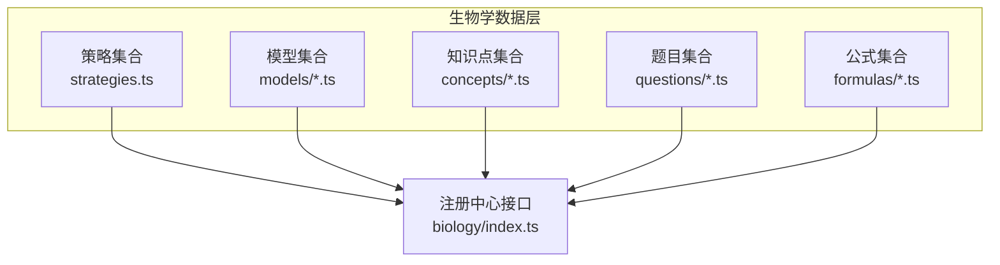
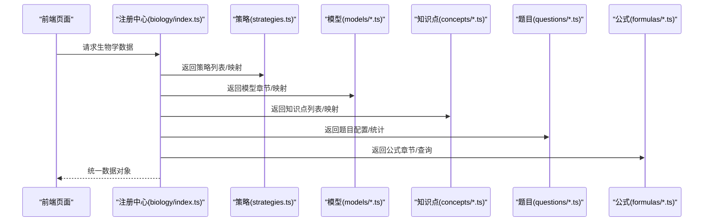
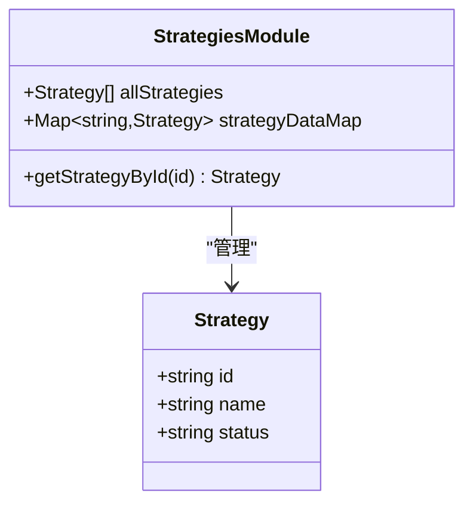
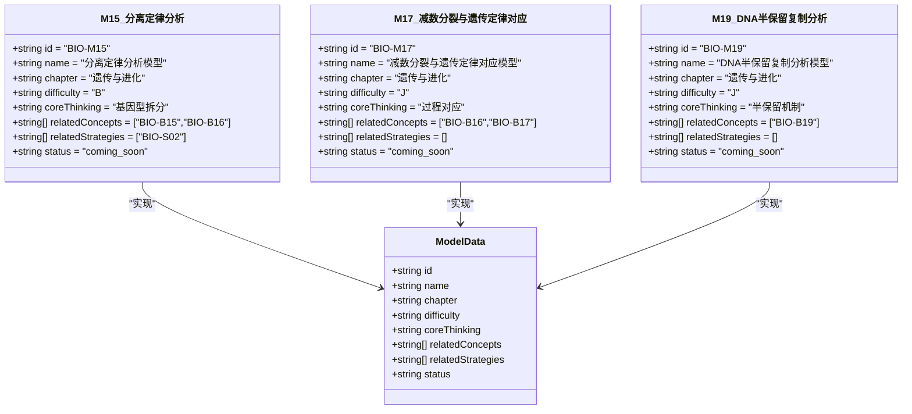
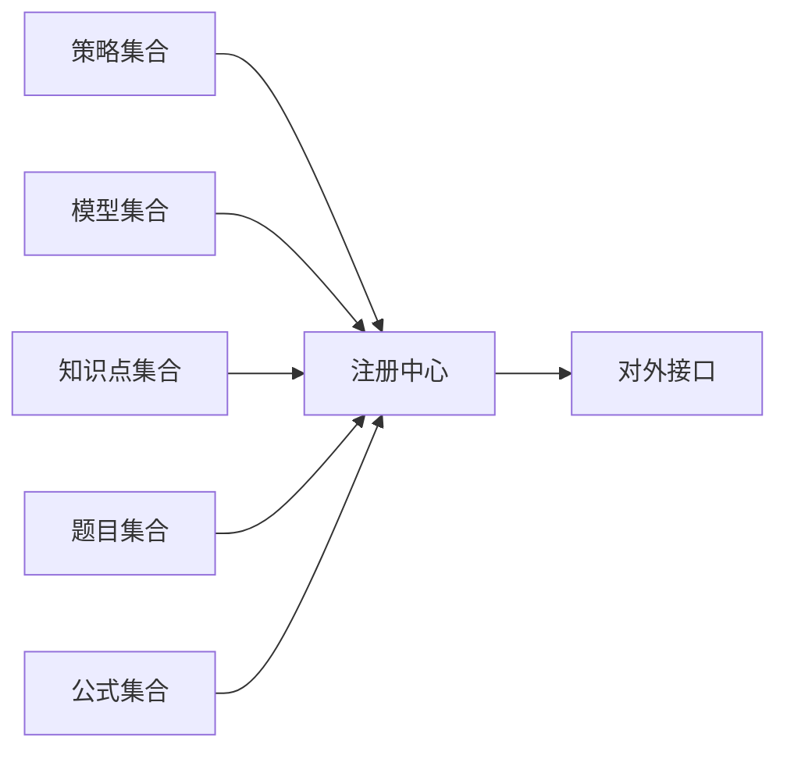

# 生物解题套路层（R层）

<cite>
**本文引用的文件**
- [strategies.ts](file://src/data/biology/strategies.ts)
- [index.ts](file://src/data/biology/index.ts)
- [M15_分离定律分析模型.ts](file://src/data/biology/models/M15_分离定律分析模型.ts)
- [M17_减数分裂与遗传定律对应模型.ts](file://src/data/biology/models/M17_减数分裂与遗传定律对应模型.ts)
- [M19_DNA半保留复制分析模型.ts](file://src/data/biology/models/M19_DNA半保留复制分析模型.ts)
- [types.ts](file://src/data/biology/models/types.ts)
</cite>

## 目录
1. [引言](#引言)
2. [项目结构](#项目结构)
3. [核心组件](#核心组件)
4. [架构总览](#架构总览)
5. [详细组件分析](#详细组件分析)
6. [依赖分析](#依赖分析)
7. [性能考虑](#性能考虑)
8. [故障排查指南](#故障排查指南)
9. [结论](#结论)
10. [附录](#附录)

## 引言
本文件面向“生物解题套路层（R层）”的系统化文档建设目标，聚焦于构建一套可复用、可教学、可评估的生物学科解题方法论体系。该体系以“套路”为最小单元，覆盖遗传定律分析、减数分裂与遗传定律对应、DNA半保留复制分析、中心法则与基因表达分析、基因突变分析、染色体变异分析、育种方案设计、种群基因频率变化分析等主题，形成“套路—模型—知识点”的三层映射关系，支撑从概念到应用的完整学习闭环。

## 项目结构
生物R层位于生物学数据层，采用“策略（Strategies）+ 模型（Models）+ 知识点（Concepts）+ 题目（Questions）”的组织方式，通过注册中心统一暴露接口，供前端页面与教学系统使用。

图示来源
- [index.ts:126-151](file://src/data/biology/index.ts#L126-L151)
- [strategies.ts:9-78](file://src/data/biology/strategies.ts#L9-L78)

章节来源
- [index.ts:1-151](file://src/data/biology/index.ts#L1-L151)
- [strategies.ts:1-78](file://src/data/biology/strategies.ts#L1-L78)

## 核心组件
- 策略（Strategies）：定义生物解题套路的清单与元数据，包含ID、名称、状态等字段；提供按ID检索的索引映射。
- 模型（Models）：以“模型”形式承载具体题型的结构化知识，标注核心思维、关联知识点与策略、难度等级等。
- 知识点（Concepts）：学科核心概念条目，用于支撑模型与策略的落地。
- 题目（Questions）：配套练习与评估资源，支持按模型维度统计与筛选。
- 公式（Formulas）：辅助解题的公式体系，便于检索与呈现。

章节来源
- [strategies.ts:1-78](file://src/data/biology/strategies.ts#L1-L78)
- [index.ts:126-151](file://src/data/biology/index.ts#L126-L151)

## 架构总览
R层通过注册中心集中暴露以下能力：
- 获取策略列表与数据映射
- 获取模型章节与数据映射
- 获取知识点列表与元数据
- 获取公式章节与查询接口
- 获取题目库配置与统计
- 生成认知图谱数据占位

图示来源
- [index.ts:126-151](file://src/data/biology/index.ts#L126-L151)

章节来源
- [index.ts:126-151](file://src/data/biology/index.ts#L126-L151)

## 详细组件分析

### 策略（Strategies）：套路清单与检索
- 数据结构
  - 策略接口包含：id、name、status（已发布/草稿/即将上线）
  - 提供全量策略数组与ID到策略的映射
  - 提供按ID检索的便捷函数
- 分类与命名规范
  - 采用“编号-名称”的命名方式，如“BIO-S02 分离定律分析”
  - 名称体现“范式”或“模型”的关键词，便于检索与教学
- 适用范围
  - 已发布：可直接进入教学与练习
  - 即将上线：作为开发与排期依据
- 关联关系
  - 模型可声明关联策略（如“基因型拆分范式”与“分离定律分析模型”）
  - 知识点可反向指向策略，形成“知识—套路—模型”的闭环

图示来源
- [strategies.ts:1-78](file://src/data/biology/strategies.ts#L1-L78)

章节来源
- [strategies.ts:1-78](file://src/data/biology/strategies.ts#L1-L78)

### 模型（Models）：题型结构化知识
- 数据结构
  - 模型接口继承通用模型数据类型，包含：id、name、chapter、difficulty、coreThinking、relatedConcepts、relatedStrategies、status
  - difficulty为难度等级（如基础、进阶、挑战），便于分层教学
- 关键要点
  - coreThinking：提炼模型的核心思维范式（如“基因型拆分”“过程对应”“半保留机制”）
  - relatedConcepts：与知识点的双向映射，支撑“知识—模型—套路”的联动
  - relatedStrategies：与策略的关联，便于教学设计与练习编排
- 示例
  - 分离定律分析模型：核心思维为“基因型拆分”，关联知识点“孟德尔遗传定律”“减数分裂与受精作用”
  - 减数分裂与遗传定律对应模型：核心思维为“过程对应”，强调减数分裂与遗传定律的时空对应
  - DNA半保留复制分析模型：核心思维为“半保留机制”，聚焦复制过程与证据分析

图示来源
- [M15_分离定律分析模型.ts:1-12](file://src/data/biology/models/M15_分离定律分析模型.ts#L1-L12)
- [M17_减数分裂与遗传定律对应模型.ts:1-12](file://src/data/biology/models/M17_减数分裂与遗传定律对应模型.ts#L1-L12)
- [M19_DNA半保留复制分析模型.ts:1-12](file://src/data/biology/models/M19_DNA半保留复制分析模型.ts#L1-L12)
- [types.ts:1-3](file://src/data/biology/models/types.ts#L1-L3)

章节来源
- [M15_分离定律分析模型.ts:1-12](file://src/data/biology/models/M15_分离定律分析模型.ts#L1-L12)
- [M17_减数分裂与遗传定律对应模型.ts:1-12](file://src/data/biology/models/M17_减数分裂与遗传定律对应模型.ts#L1-L12)
- [M19_DNA半保留复制分析模型.ts:1-12](file://src/data/biology/models/M19_DNA半保留复制分析模型.ts#L1-L12)
- [types.ts:1-3](file://src/data/biology/models/types.ts#L1-L3)

### 知识点（Concepts）与题目（Questions）
- 知识点
  - 以条目形式组织，包含章节、模块、难度等级等元信息，便于与模型/策略建立映射
- 题目
  - 支持按难度、目标、功能、题型等维度筛选
  - 提供按模型维度的统计与分组，便于练习与评估

章节来源
- [index.ts:11-36](file://src/data/biology/index.ts#L11-L36)
- [index.ts:66-100](file://src/data/biology/index.ts#L66-L100)
- [index.ts:106-124](file://src/data/biology/index.ts#L106-L124)

### 教学设计与应用规则
- 教学顺序建议
  - 以“模型—策略—知识点”为主线，先建立范式意识，再深入知识点，最后通过题目巩固
- 练习安排
  - 基础：围绕核心思维进行概念与模型匹配
  - 进阶：结合过程对应与机制分析，提升推理能力
  - 挑战：综合多个模型与策略，解决复杂情境题
- 能力评估
  - 通过题目维度统计（总量、正确率）与模型维度分布，评估学生掌握程度
  - 利用难度与目标选项进行分层测试与诊断

章节来源
- [index.ts:66-100](file://src/data/biology/index.ts#L66-L100)
- [index.ts:106-124](file://src/data/biology/index.ts#L106-L124)

## 依赖分析
- 组件耦合
  - 注册中心聚合策略、模型、知识点、题目、公式，形成统一入口
  - 模型与策略之间通过ID建立弱耦合关联，便于扩展与维护
- 外部依赖
  - 类型系统复用物理学科的通用类型，保持跨学科一致性

图示来源
- [index.ts:126-151](file://src/data/biology/index.ts#L126-L151)

章节来源
- [index.ts:126-151](file://src/data/biology/index.ts#L126-L151)
- [types.ts:1-3](file://src/data/biology/models/types.ts#L1-L3)

## 性能考虑
- 数据访问
  - 使用Map进行策略与模型的O(1)检索，降低查找成本
- 数据规模
  - 当前策略与模型数量适中，无需分页；若扩展至千级，建议引入分页与缓存
- 渲染效率
  - 前端按需加载章节与模型，避免一次性渲染全部数据

章节来源
- [strategies.ts:72-78](file://src/data/biology/strategies.ts#L72-L78)
- [index.ts:126-151](file://src/data/biology/index.ts#L126-L151)

## 故障排查指南
- 现象：无法按ID获取策略
  - 排查：确认ID格式是否正确，策略是否处于“已发布”状态
- 现象：模型未显示在页面
  - 排查：检查模型的status字段与注册中心的过滤逻辑
- 现象：题目统计异常
  - 排查：确认题目是否绑定modelId，是否存在缺失或重复

章节来源
- [strategies.ts:76-78](file://src/data/biology/strategies.ts#L76-L78)
- [index.ts:106-124](file://src/data/biology/index.ts#L106-L124)

## 结论
生物R层以“策略—模型—知识点—题目—公式”为核心，构建了可教、可练、可评的解题方法论体系。通过范式化的模型与清晰的关联关系，能够有效支撑从基础到高阶的学习路径设计，并为教师提供可操作的教学与评估工具。

## 附录
- 术语
  - 策略：解题范式或思维模板
  - 模型：题型结构化知识载体
  - 知识点：学科核心概念条目
  - 题目：配套练习与评估资源
  - 公式：辅助解题的知识工具