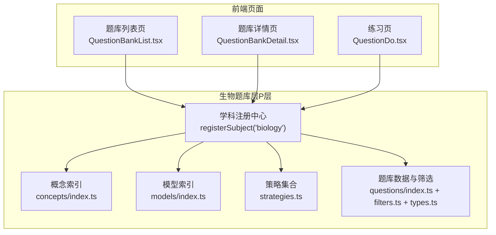
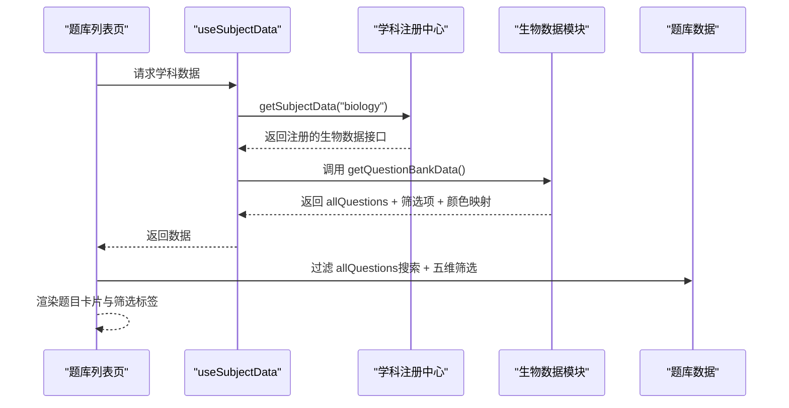
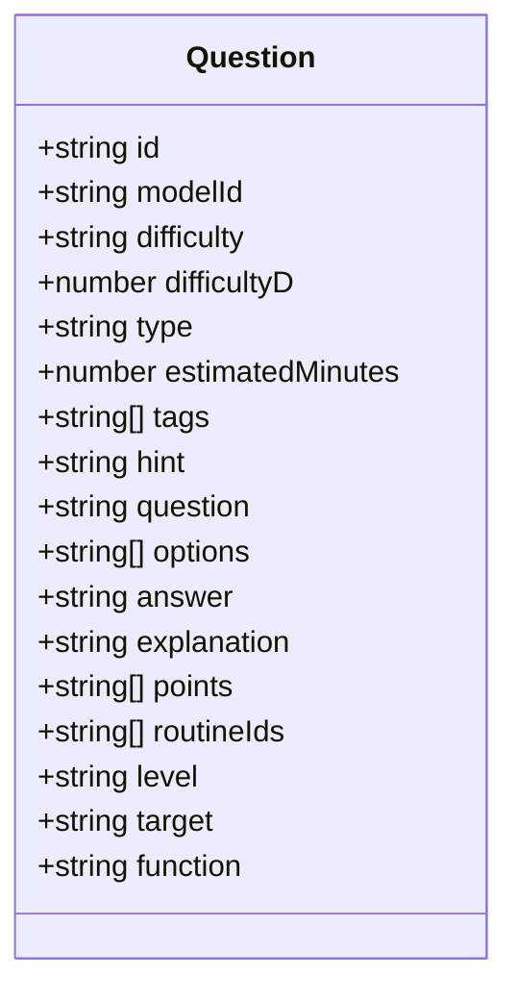
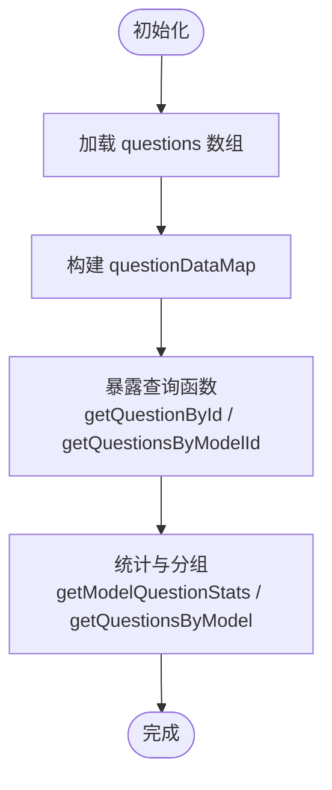
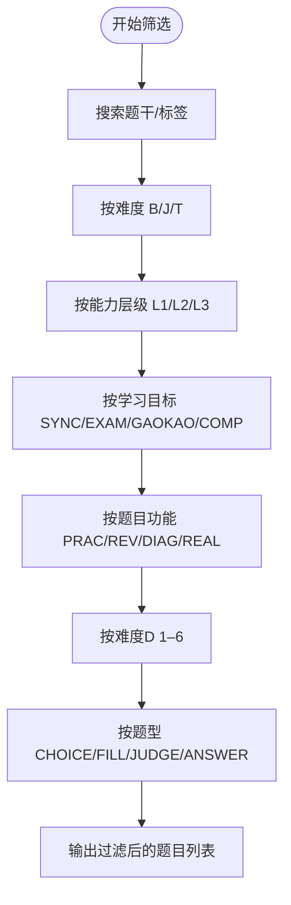
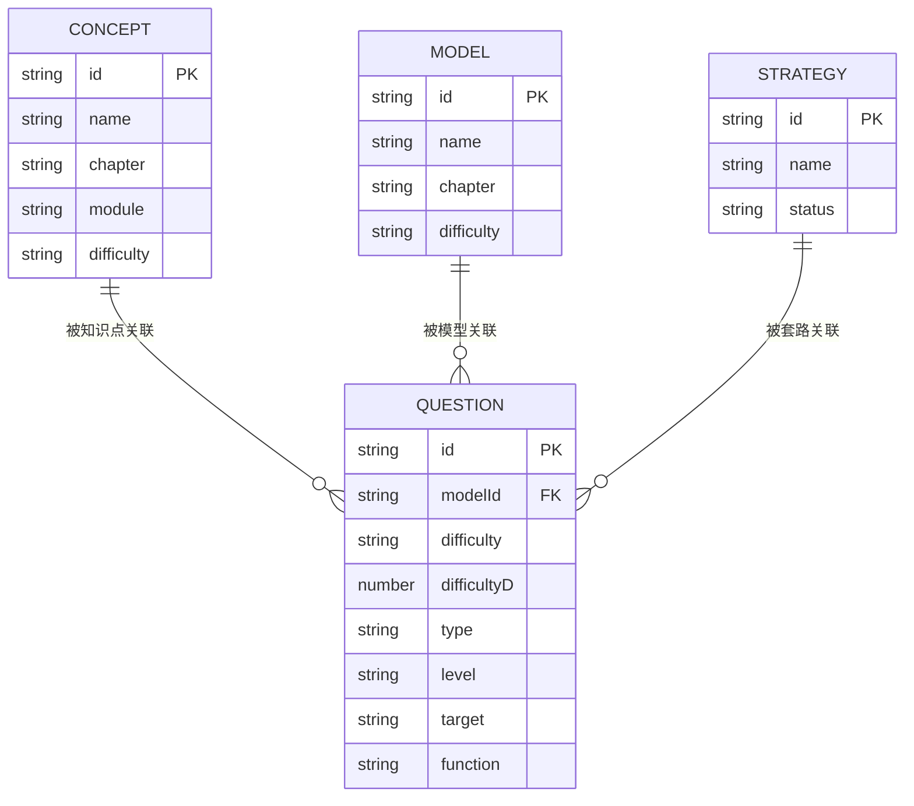
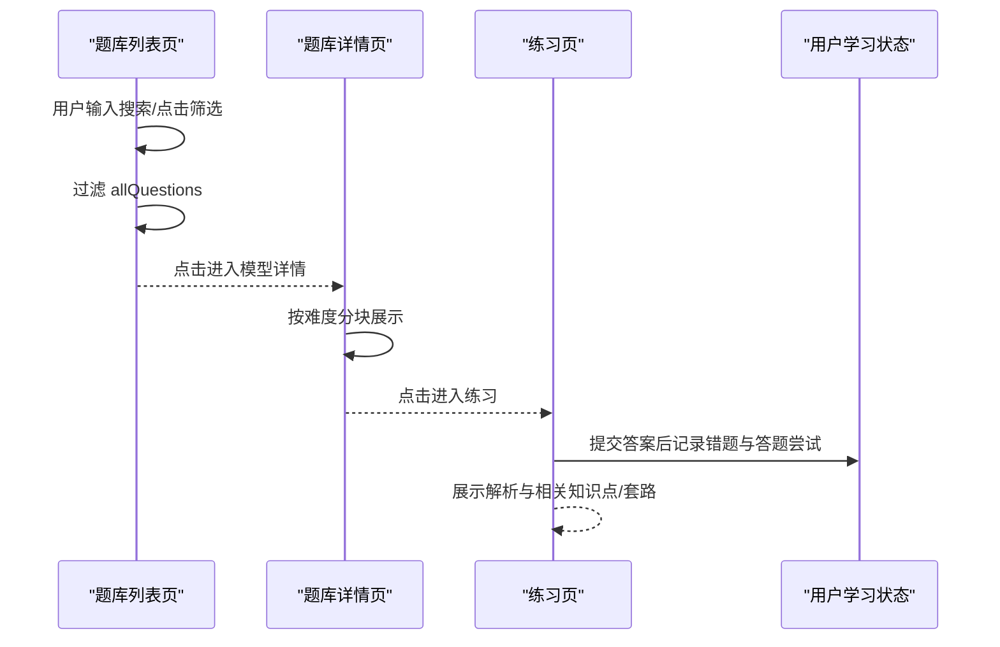
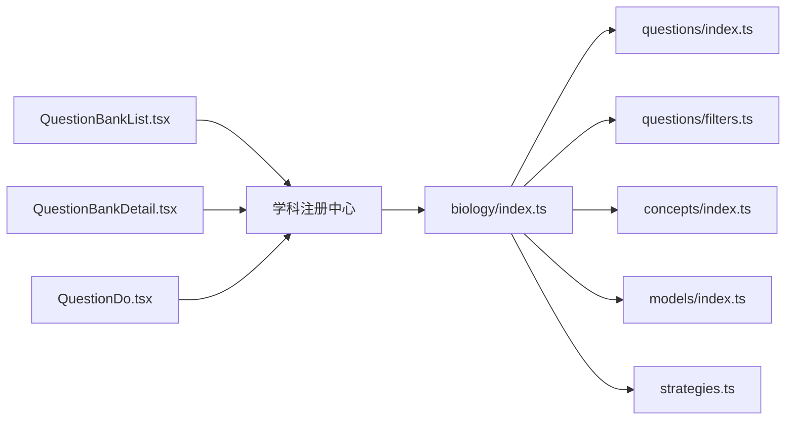

# 生物题库层（P层）

<cite>
**本文引用的文件**
- [src/data/biology/index.ts](file://src/data/biology/index.ts)
- [src/data/biology/questions/index.ts](file://src/data/biology/questions/index.ts)
- [src/data/biology/questions/filters.ts](file://src/data/biology/questions/filters.ts)
- [src/data/biology/questions/types.ts](file://src/data/biology/questions/types.ts)
- [src/data/biology/concepts/index.ts](file://src/data/biology/concepts/index.ts)
- [src/data/biology/models/index.ts](file://src/data/biology/models/index.ts)
- [src/data/biology/strategies.ts](file://src/data/biology/strategies.ts)
- [src/data/registry.ts](file://src/data/registry.ts)
- [src/sections/QuestionBankList.tsx](file://src/sections/QuestionBankList.tsx)
- [src/sections/QuestionBankDetail.tsx](file://src/sections/QuestionBankDetail.tsx)
- [src/sections/QuestionDo.tsx](file://src/sections/QuestionDo.tsx)
</cite>

## 目录
1. [引言](#引言)
2. [项目结构](#项目结构)
3. [核心组件](#核心组件)
4. [架构总览](#架构总览)
5. [详细组件分析](#详细组件分析)
6. [依赖分析](#依赖分析)
7. [性能考虑](#性能考虑)
8. [故障排查指南](#故障排查指南)
9. [结论](#结论)
10. [附录](#附录)

## 引言
本文件系统化梳理“生物题库层（P层）”的设计与实现，覆盖题库的数据结构、筛选与呈现、练习与评测、错题与学习分析、以及题库的注册与扩展机制。文档以“五维筛选”为核心，结合“难度等级（B/J/T 与 D1–D6）”、“能力层级（L1/L2/L3）”、“学习目标（同步/期中期末/高考/竞赛）”、“题目功能（巩固/复习/诊断/真题）”、“题型（选择/填空/判断/解答）”，形成完整的题库组织与使用闭环。

## 项目结构
生物题库层位于学科数据子系统中，采用“学科注册 + 概念/模型/公式/题库/策略”的模块化组织方式：
- 数据注册与对外接口：通过学科注册中心统一暴露能力
- 概念与模型：支撑知识点与模型化思维的组织
- 题库：承载题目数据与筛选、统计能力
- 策略：范式/套路集合，辅助题目解析与迁移
- 前端页面：题库列表、题库详情、练习页面

图表来源
- [src/data/biology/index.ts:126-151](file://src/data/biology/index.ts#L126-L151)
- [src/data/biology/questions/index.ts:1-15](file://src/data/biology/questions/index.ts#L1-L15)
- [src/data/biology/questions/filters.ts:1-38](file://src/data/biology/questions/filters.ts#L1-L38)
- [src/data/biology/concepts/index.ts:1-201](file://src/data/biology/concepts/index.ts#L1-L201)
- [src/data/biology/models/index.ts:1-191](file://src/data/biology/models/index.ts#L1-L191)
- [src/data/biology/strategies.ts:1-78](file://src/data/biology/strategies.ts#L1-L78)
- [src/sections/QuestionBankList.tsx:29-424](file://src/sections/QuestionBankList.tsx#L29-L424)
- [src/sections/QuestionBankDetail.tsx:92-185](file://src/sections/QuestionBankDetail.tsx#L92-L185)
- [src/sections/QuestionDo.tsx:277-348](file://src/sections/QuestionDo.tsx#L277-L348)

章节来源
- [src/data/biology/index.ts:1-151](file://src/data/biology/index.ts#L1-L151)
- [src/data/registry.ts:1-52](file://src/data/registry.ts#L1-L52)

## 核心组件
- 学科注册中心：统一注册生物学科的数据能力，提供概念、模型、公式、策略、题库等查询与统计接口
- 题库数据与筛选：内置五维筛选项与难度映射，提供按模型分组、按难度分布统计的能力
- 前端页面：题库列表页支持全文检索与多维筛选；题库详情页按难度分块展示；练习页支持计时、提示、解析与错题记录

章节来源
- [src/data/biology/index.ts:66-100](file://src/data/biology/index.ts#L66-L100)
- [src/data/biology/questions/filters.ts:1-38](file://src/data/biology/questions/filters.ts#L1-L38)
- [src/sections/QuestionBankList.tsx:69-83](file://src/sections/QuestionBankList.tsx#L69-L83)
- [src/sections/QuestionBankDetail.tsx:92-185](file://src/sections/QuestionBankDetail.tsx#L92-L185)
- [src/sections/QuestionDo.tsx:277-348](file://src/sections/QuestionDo.tsx#L277-L348)

## 架构总览
题库层遵循“数据层 + 页面层”的分层设计：
- 数据层：questions/index.ts 暴露题目数组与查询函数；filters.ts 定义筛选项；types.ts 定义题目数据结构
- 注册层：biology/index.ts 将概念、模型、公式、策略、题库等能力注册到学科注册中心
- 页面层：QuestionBankList/Detail/Do 三个页面分别承担“浏览/筛选/练习”的职责

图表来源
- [src/sections/QuestionBankList.tsx:29-100](file://src/sections/QuestionBankList.tsx#L29-L100)
- [src/data/biology/index.ts:66-100](file://src/data/biology/index.ts#L66-L100)
- [src/data/registry.ts:46-48](file://src/data/registry.ts#L46-L48)

## 详细组件分析

### 题目数据结构与属性定义
- 基本字段：id、modelId、question、options、answer、explanation、hint、tags、points、routineIds
- 难度与时间：difficulty（B/J/T）、difficultyD（1–6）、estimatedMinutes
- 五维筛选：level（L1/L2/L3）、target（SYNC/EXAM/GAOKAO/COMP）、function（PRAC/REV/DIAG/REAL）、type（CHOICE/FILL/JUDGE/ANSWER）

图表来源
- [src/data/biology/questions/types.ts:4-35](file://src/data/biology/questions/types.ts#L4-L35)

章节来源
- [src/data/biology/questions/types.ts:1-35](file://src/data/biology/questions/types.ts#L1-L35)

### 题库数据与查询接口
- 题目数组与映射：questions 数组与 questionDataMap（id -> Question）
- 查询函数：按 id 获取题目、按 modelId 过滤题目
- 统计与分组：按模型统计题目数量、按模型聚合题目

图表来源
- [src/data/biology/questions/index.ts:1-15](file://src/data/biology/questions/index.ts#L1-L15)

章节来源
- [src/data/biology/questions/index.ts:1-15](file://src/data/biology/questions/index.ts#L1-L15)

### 筛选机制与标签系统
- 筛选项定义：LEVEL_OPTIONS、TARGET_OPTIONS、FUNCTION_OPTIONS、DIFFICULTY_OPTIONS、TYPE_OPTIONS
- 颜色映射：DIFF_COLOR（B/J/T 对应不同样式）
- 列表页筛选逻辑：支持搜索题干与标签、难度（B/J/T）、能力层级、学习目标、题目功能、难度D、题型

图表来源
- [src/data/biology/questions/filters.ts:1-38](file://src/data/biology/questions/filters.ts#L1-L38)
- [src/sections/QuestionBankList.tsx:69-83](file://src/sections/QuestionBankList.tsx#L69-L83)

章节来源
- [src/data/biology/questions/filters.ts:1-38](file://src/data/biology/questions/filters.ts#L1-L38)
- [src/sections/QuestionBankList.tsx:69-83](file://src/sections/QuestionBankList.tsx#L69-L83)

### 题库组织与模型关联
- 概念与模型：概念按章节组织，模型按章节组织，二者通过 id 关联
- 策略集合：提供范式/套路列表与映射，用于解析与迁移
- 注册中心：将上述能力统一注册，供页面层调用

图表来源
- [src/data/biology/concepts/index.ts:119-197](file://src/data/biology/concepts/index.ts#L119-L197)
- [src/data/biology/models/index.ts:113-187](file://src/data/biology/models/index.ts#L113-L187)
- [src/data/biology/strategies.ts:1-78](file://src/data/biology/strategies.ts#L1-L78)
- [src/data/biology/questions/types.ts:4-35](file://src/data/biology/questions/types.ts#L4-L35)

章节来源
- [src/data/biology/concepts/index.ts:1-201](file://src/data/biology/concepts/index.ts#L1-L201)
- [src/data/biology/models/index.ts:1-191](file://src/data/biology/models/index.ts#L1-L191)
- [src/data/biology/strategies.ts:1-78](file://src/data/biology/strategies.ts#L1-L78)

### 题库页面工作流
- 题库列表页：加载学科数据，渲染筛选区与题目卡片，支持清除筛选、展开/收起筛选面板
- 题库详情页：按模型聚合题目，按难度分块展示，支持按题型过滤
- 练习页：单题答题卡，支持计时、提示、解析、错题记录与学习统计上报

图表来源
- [src/sections/QuestionBankList.tsx:69-100](file://src/sections/QuestionBankList.tsx#L69-L100)
- [src/sections/QuestionBankDetail.tsx:92-185](file://src/sections/QuestionBankDetail.tsx#L92-L185)
- [src/sections/QuestionDo.tsx:88-125](file://src/sections/QuestionDo.tsx#L88-L125)

章节来源
- [src/sections/QuestionBankList.tsx:29-424](file://src/sections/QuestionBankList.tsx#L29-L424)
- [src/sections/QuestionBankDetail.tsx:92-185](file://src/sections/QuestionBankDetail.tsx#L92-L185)
- [src/sections/QuestionDo.tsx:277-348](file://src/sections/QuestionDo.tsx#L277-L348)

### 错题管理与学习分析
- 错题记录：练习页在选择题答错时，向用户学习状态存储添加错题记录
- 答题尝试：记录每次答题的正确性、耗时、时间戳
- 学习统计：上报学习统计，用于后续个性化路径与推荐

章节来源
- [src/sections/QuestionDo.tsx:88-125](file://src/sections/QuestionDo.tsx#L88-L125)

### 个性化学习路径与推荐（概念与模型维度）
- 概念与模型：通过概念/模型章节与 ID，建立知识点与模型的映射关系
- 推荐思路：基于模型聚合题目，结合用户学习进度与错题情况，优先推送薄弱模型或相关联知识点的题目
- 实现建议：在用户学习状态中维护“已掌握模型”“待强化模型”“关联知识点”，并据此筛选题目

章节来源
- [src/data/biology/concepts/index.ts:119-197](file://src/data/biology/concepts/index.ts#L119-L197)
- [src/data/biology/models/index.ts:113-187](file://src/data/biology/models/index.ts#L113-L187)

## 依赖分析
- 页面层依赖注册中心提供的学科数据接口
- 题库层依赖 filters.ts 中的筛选项与颜色映射
- 练习页依赖用户学习状态存储（错题与答题尝试）

图表来源
- [src/sections/QuestionBankList.tsx:29-59](file://src/sections/QuestionBankList.tsx#L29-L59)
- [src/sections/QuestionBankDetail.tsx:92-95](file://src/sections/QuestionBankDetail.tsx#L92-L95)
- [src/sections/QuestionDo.tsx:277-282](file://src/sections/QuestionDo.tsx#L277-L282)
- [src/data/biology/index.ts:126-151](file://src/data/biology/index.ts#L126-L151)
- [src/data/biology/questions/index.ts:1-15](file://src/data/biology/questions/index.ts#L1-L15)
- [src/data/biology/questions/filters.ts:1-38](file://src/data/biology/questions/filters.ts#L1-L38)
- [src/data/biology/concepts/index.ts:1-201](file://src/data/biology/concepts/index.ts#L1-L201)
- [src/data/biology/models/index.ts:1-191](file://src/data/biology/models/index.ts#L1-L191)
- [src/data/biology/strategies.ts:1-78](file://src/data/biology/strategies.ts#L1-L78)

章节来源
- [src/data/registry.ts:40-52](file://src/data/registry.ts#L40-L52)

## 性能考虑
- 题目过滤：列表页使用内存过滤（allQuestions.filter），建议在题目规模较大时引入分页或服务端筛选
- 渲染优化：列表页对题干进行截断与 Markdown 渲染，注意避免重复渲染与过度计算
- 统计与分组：按模型统计与分组在页面层复用，减少重复遍历

## 故障排查指南
- 题库为空：确认 biology/index.ts 是否正确注册了 getQuestionBankData 与 getAllQuestions
- 筛选无效：检查 filters.ts 的选项是否与题目字段一致（level/target/function/difficulty/type）
- 练习无记录：确认练习页是否正确调用用户学习状态存储的 addWrongQuestion 与 addQuestionAttempt

章节来源
- [src/data/biology/index.ts:126-151](file://src/data/biology/index.ts#L126-L151)
- [src/data/biology/questions/filters.ts:1-38](file://src/data/biology/questions/filters.ts#L1-L38)
- [src/sections/QuestionDo.tsx:88-125](file://src/sections/QuestionDo.tsx#L88-L125)

## 结论
生物题库层以“五维筛选 + 模型聚合 + 题型与难度分层”为核心，配合概念/模型/策略的组织，形成了从“浏览—筛选—练习—错题—统计”的完整闭环。通过学科注册中心统一暴露能力，前端页面与数据层解耦清晰，便于后续扩展与维护。

## 附录

### 五维筛选与难度映射速查
- 能力层级：L1（基础）、L2（进阶）、L3（挑战）
- 学习目标：SYNC（同步学习）、EXAM（期中期末）、GAOKAO（高考专项）、COMP（竞赛拓展）
- 题目功能：PRAC（巩固练习）、REV（复习检测）、DIAG（诊断评估）、REAL（真题演练）
- 难度等级：B（基础）、J（进阶）、T（挑战）；另提供 D1–D6 的六级难度映射
- 题型：CHOICE（选择题）、FILL（填空题）、JUDGE（判断题）、ANSWER（解答题）

章节来源
- [src/data/biology/questions/filters.ts:1-38](file://src/data/biology/questions/filters.ts#L1-L38)