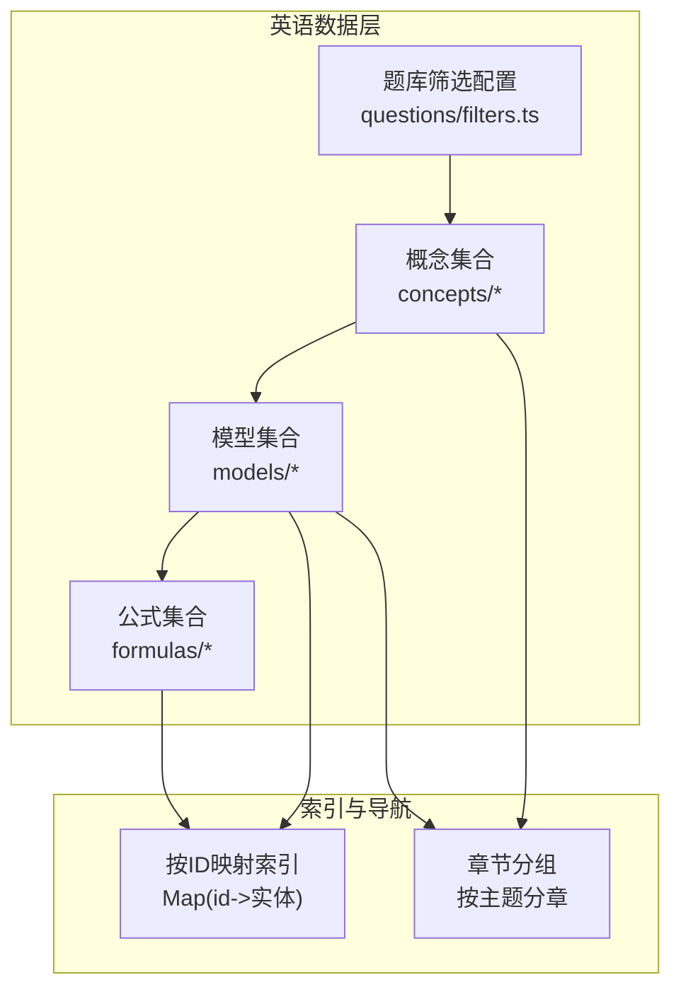
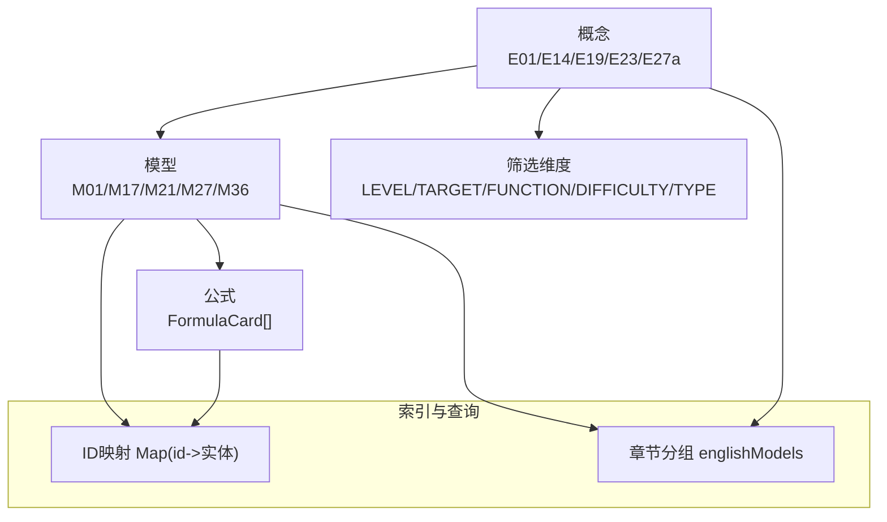
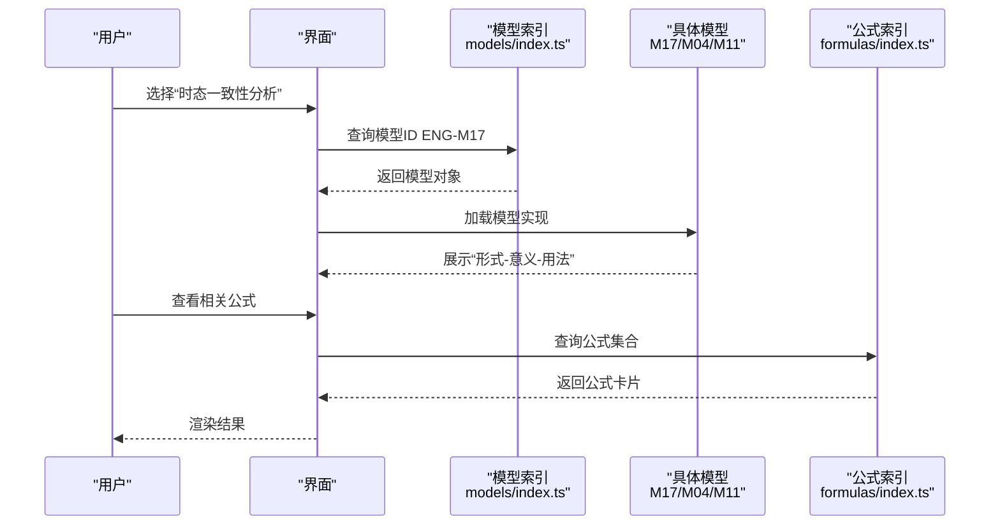
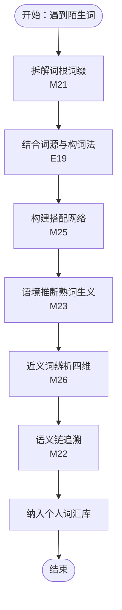
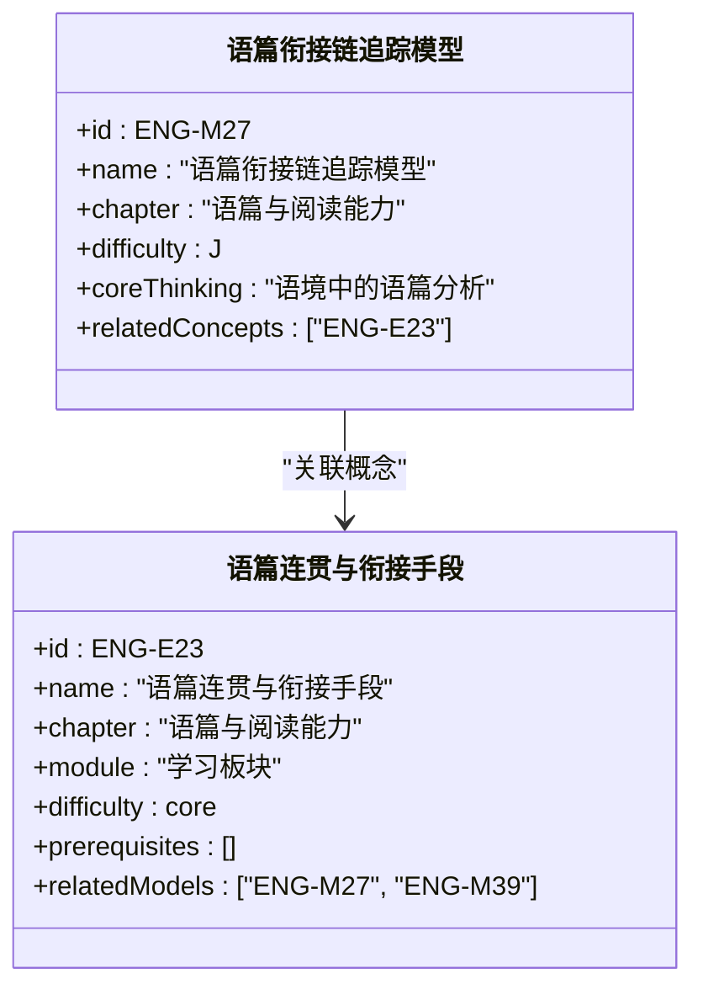
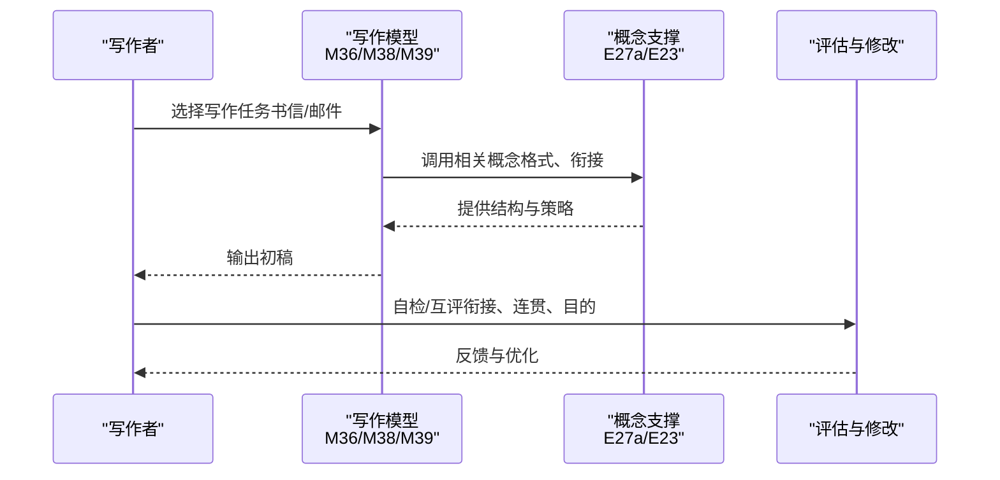
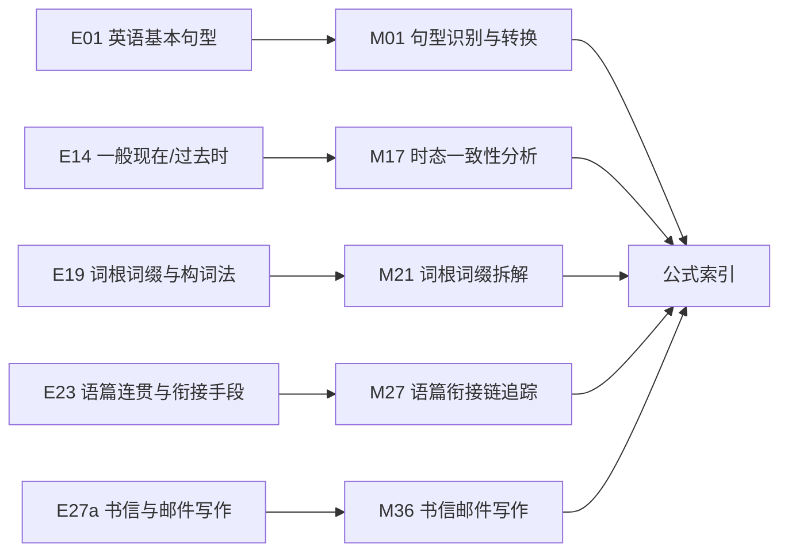

# 英语公式与术语

<cite>
**本文引用的文件**
- [src/data/english/formulas/index.ts](file://src/data/english/formulas/index.ts)
- [src/data/english/formulas/types.ts](file://src/data/english/formulas/types.ts)
- [src/data/english/models/index.ts](file://src/data/english/models/index.ts)
- [src/data/english/models/types.ts](file://src/data/english/models/types.ts)
- [src/data/english/questions/filters.ts](file://src/data/english/questions/filters.ts)
- [src/data/english/concepts/E01_英语基本句型.ts](file://src/data/english/concepts/E01_英语基本句型.ts)
- [src/data/english/concepts/E14_一般现在时与一般过去时.ts](file://src/data/english/concepts/E14_一般现在时与一般过去时.ts)
- [src/data/english/concepts/E19_词根词缀与构词法.ts](file://src/data/english/concepts/E19_词根词缀与构词法.ts)
- [src/data/english/concepts/E23_语篇连贯与衔接手段.ts](file://src/data/english/concepts/E23_语篇连贯与衔接手段.ts)
- [src/data/english/concepts/E27a_书信与邮件写作.ts](file://src/data/english/concepts/E27a_书信与邮件写作.ts)
- [src/data/english/models/M01_句型识别与转换模型.ts](file://src/data/english/models/M01_句型识别与转换模型.ts)
- [src/data/english/models/M17_时态一致性分析模型.ts](file://src/data/english/models/M17_时态一致性分析模型.ts)
- [src/data/english/models/M21_词根词缀拆解模型.ts](file://src/data/english/models/M21_词根词缀拆解模型.ts)
- [src/data/english/models/M27_语篇衔接链追踪模型.ts](file://src/data/english/models/M27_语篇衔接链追踪模型.ts)
- [src/data/english/models/M36_书信邮件写作模型.ts](file://src/data/english/models/M36_书信邮件写作模型.ts)
</cite>

## 目录
1. [引言](#引言)
2. [项目结构](#项目结构)
3. [核心组件](#核心组件)
4. [架构总览](#架构总览)
5. [详细组件分析](#详细组件分析)
6. [依赖分析](#依赖分析)
7. [性能考虑](#性能考虑)
8. [故障排查指南](#故障排查指南)
9. [结论](#结论)
10. [附录](#附录)

## 引言
本文件面向“英语公式与术语”主题，系统化梳理英语学科的知识骨架与可复用范式，涵盖语言学公式、语法公式、词汇记忆公式与语篇能力模型的组织方式；阐明时态转换、从句简化等语法公式的表达形式与应用场景；总结词根词缀、联想记忆等词汇记忆规律；并给出公式检索与分类、数据维护与更新机制的设计建议。目标是帮助教师与学习者以“公式化思维”高效掌握英语知识网络，提升教学与学习效率。

## 项目结构
英语数据模块采用“概念-模型-公式-题库筛选”的分层组织，配合章节划分与映射索引，形成可检索、可扩展、可维护的知识体系。

图示来源
- [src/data/english/models/index.ts:117-221](file://src/data/english/models/index.ts#L117-L221)
- [src/data/english/formulas/index.ts:7-13](file://src/data/english/formulas/index.ts#L7-L13)
- [src/data/english/questions/filters.ts:1-38](file://src/data/english/questions/filters.ts#L1-L38)

章节来源
- [src/data/english/models/index.ts:1-225](file://src/data/english/models/index.ts#L1-L225)
- [src/data/english/formulas/index.ts:1-13](file://src/data/english/formulas/index.ts#L1-L13)
- [src/data/english/questions/filters.ts:1-38](file://src/data/english/questions/filters.ts#L1-L38)

## 核心组件
- 概念（Concepts）
  - 描述语言点或知识点，标注难度、前置要求、关联模型与策略，支撑“从概念到模型”的学习路径。
- 模型（Models）
  - 将语言现象抽象为“形式-意义-用法”的可执行范式，覆盖句法、时态、词汇、语篇、写作、听力口语等能力域。
- 公式（Formulas）
  - 以结构化卡片呈现“公式化表达”，便于检索、对比与迁移应用。
- 题库筛选（Filters）
  - 提供层级、目标、功能、难度、题型等维度的筛选项，辅助个性化练习与评估。

章节来源
- [src/data/english/concepts/E01_英语基本句型.ts:3-13](file://src/data/english/concepts/E01_英语基本句型.ts#L3-L13)
- [src/data/english/models/index.ts:62-115](file://src/data/english/models/index.ts#L62-L115)
- [src/data/english/formulas/index.ts:3-9](file://src/data/english/formulas/index.ts#L3-L9)
- [src/data/english/questions/filters.ts:1-38](file://src/data/english/questions/filters.ts#L1-L38)

## 架构总览
下图展示“概念-模型-公式-题库筛选”的数据流与交互关系，体现从知识点到可操作范式再到练习与评估的闭环。

图示来源
- [src/data/english/concepts/E01_英语基本句型.ts:3-13](file://src/data/english/concepts/E01_英语基本句型.ts#L3-L13)
- [src/data/english/models/M01_句型识别与转换模型.ts:3-12](file://src/data/english/models/M01_句型识别与转换模型.ts#L3-L12)
- [src/data/english/models/M17_时态一致性分析模型.ts:3-12](file://src/data/english/models/M17_时态一致性分析模型.ts#L3-L12)
- [src/data/english/models/M21_词根词缀拆解模型.ts:3-12](file://src/data/english/models/M21_词根词缀拆解模型.ts#L3-L12)
- [src/data/english/models/M27_语篇衔接链追踪模型.ts:3-12](file://src/data/english/models/M27_语篇衔接链追踪模型.ts#L3-L12)
- [src/data/english/models/M36_书信邮件写作模型.ts:3-12](file://src/data/english/models/M36_书信邮件写作模型.ts#L3-L12)
- [src/data/english/models/index.ts:117-221](file://src/data/english/models/index.ts#L117-L221)
- [src/data/english/formulas/index.ts:7-13](file://src/data/english/formulas/index.ts#L7-L13)
- [src/data/english/questions/filters.ts:1-38](file://src/data/english/questions/filters.ts#L1-L38)

## 详细组件分析

### 语言学公式与术语（F层）设计
- 设计原则
  - 结构化：以“公式卡片”承载“形式-意义-用法”的三元结构，便于检索与迁移。
  - 可索引：通过ID映射与章节分组，支持快速定位与批量管理。
  - 可扩展：新增公式仅需扩展数组与映射，不破坏既有接口。
- 组织方式
  - 公式数组与章节分组：集中声明与分组，便于前端渲染与导航。
  - ID映射：基于Map实现O(1)查询，避免线性扫描。
  - 类型复用：与物理等学科共享类型定义，保持一致的数据契约。

章节来源
- [src/data/english/formulas/index.ts:3-13](file://src/data/english/formulas/index.ts#L3-L13)
- [src/data/english/formulas/types.ts:1-3](file://src/data/english/formulas/types.ts#L1-L3)

### 语法公式与应用场景
- 时态转换公式
  - 示例：一般现在/过去时一致性分析模型，用于识别与修正时态不一致问题。
  - 应用场景：写作检查、语法填空、长难句分析。
- 从句简化公式
  - 示例：主从复合句解析模型、名词性/定语/状语从句引导词选择模型。
  - 应用场景：阅读理解、翻译、写作句式优化。
- 非谓语动词与特殊结构
  - 示例：不定式/动名词选择模型、分词作定语/状语模型、独立主格结构模型。
  - 应用场景：长难句精读、语法改错、写作句式多样化。

图示来源
- [src/data/english/models/index.ts:117-221](file://src/data/english/models/index.ts#L117-L221)
- [src/data/english/models/M17_时态一致性分析模型.ts:3-12](file://src/data/english/models/M17_时态一致性分析模型.ts#L3-L12)
- [src/data/english/formulas/index.ts:7-13](file://src/data/english/formulas/index.ts#L7-L13)

章节来源
- [src/data/english/models/M17_时态一致性分析模型.ts:3-12](file://src/data/english/models/M17_时态一致性分析模型.ts#L3-L12)
- [src/data/english/models/index.ts:79-82](file://src/data/english/models/index.ts#L79-L82)

### 词汇记忆公式与技巧
- 词根词缀记忆法
  - 示例：词根词缀拆解模型，将单词按前缀/词根/后缀拆分，结合语义链追溯。
  - 应用场景：高频词扩展、阅读生词处理、作文词汇丰富。
- 联想记忆法
  - 示例：熟词生义语境推断模型、搭配网络构建模型、近义词辨析四维模型。
  - 应用场景：完形填空、七选五、写作词汇选择。
- 一词多义与语义链
  - 示例：一词多义语义链追溯模型，建立多义词的语义网络。
  - 应用场景：阅读理解、完形填空、翻译。

图示来源
- [src/data/english/models/M21_词根词缀拆解模型.ts:3-12](file://src/data/english/models/M21_词根词缀拆解模型.ts#L3-L12)
- [src/data/english/concepts/E19_词根词缀与构词法.ts:3-13](file://src/data/english/concepts/E19_词根词缀与构词法.ts#L3-L13)
- [src/data/english/models/M25_搭配网络构建模型.ts](file://src/data/english/models/M25_搭配网络构建模型.ts)
- [src/data/english/models/M23_熟词生义语境推断模型.ts](file://src/data/english/models/M23_熟词生义语境推断模型.ts)
- [src/data/english/models/M26_近义词辨析四维模型.ts](file://src/data/english/models/M26_近义词辨析四维模型.ts)
- [src/data/english/models/M22_一词多义语义链追溯模型.ts](file://src/data/english/models/M22_一词多义语义链追溯模型.ts)

章节来源
- [src/data/english/models/M21_词根词缀拆解模型.ts:3-12](file://src/data/english/models/M21_词根词缀拆解模型.ts#L3-L12)
- [src/data/english/models/M23_熟词生义语境推断模型.ts](file://src/data/english/models/M23_熟词生义语境推断模型.ts)
- [src/data/english/models/M25_搭配网络构建模型.ts](file://src/data/english/models/M25_搭配网络构建模型.ts)
- [src/data/english/models/M26_近义词辨析四维模型.ts](file://src/data/english/models/M26_近义词辨析四维模型.ts)
- [src/data/english/concepts/E19_词根词缀与构词法.ts:3-13](file://src/data/english/concepts/E19_词根词缀与构词法.ts#L3-L13)

### 语篇与阅读能力模型
- 语篇衔接链追踪
  - 示例：语篇衔接链追踪模型，聚焦指称、替代、省略、连接等衔接手段。
  - 应用场景：阅读理解、概要写作、长难句精读。
- 文体与阅读策略
  - 示例：记叙文/说明文/议论文阅读模型，配合主旨概括、细节定位、推理判断等。
  - 应用场景：各类阅读题型与写作任务。

图示来源
- [src/data/english/models/M27_语篇衔接链追踪模型.ts:3-12](file://src/data/english/models/M27_语篇衔接链追踪模型.ts#L3-L12)
- [src/data/english/concepts/E23_语篇连贯与衔接手段.ts:3-13](file://src/data/english/concepts/E23_语篇连贯与衔接手段.ts#L3-L13)

章节来源
- [src/data/english/models/M27_语篇衔接链追踪模型.ts:3-12](file://src/data/english/models/M27_语篇衔接链追踪模型.ts#L3-L12)
- [src/data/english/concepts/E23_语篇连贯与衔接手段.ts:3-13](file://src/data/english/concepts/E23_语篇连贯与衔接手段.ts#L3-L13)

### 写作与翻译范式
- 书信与邮件写作
  - 示例：书信邮件写作模型，强调格式、语气、衔接与目的导向。
  - 应用场景：应用文写作、口语表达、跨文化交际。
- 段落展开与连贯性
  - 示例：段落展开模型、连贯性与衔接手段运用模型。
  - 应用场景：议论文、说明文写作。
- 长难句精读与翻译
  - 示例：长难句精读模型，配合从句简化与主干提取。
  - 应用场景：阅读理解、翻译技巧。

图示来源
- [src/data/english/models/M36_书信邮件写作模型.ts:3-12](file://src/data/english/models/M36_书信邮件写作模型.ts#L3-L12)
- [src/data/english/concepts/E27a_书信与邮件写作.ts:3-13](file://src/data/english/concepts/E27a_书信与邮件写作.ts#L3-L13)
- [src/data/english/models/M38_段落展开模型.ts](file://src/data/english/models/M38_段落展开模型.ts)
- [src/data/english/models/M39_连贯性与衔接手段运用模型.ts](file://src/data/english/models/M39_连贯性与衔接手段运用模型.ts)

章节来源
- [src/data/english/models/M36_书信邮件写作模型.ts:3-12](file://src/data/english/models/M36_书信邮件写作模型.ts#L3-L12)
- [src/data/english/concepts/E27a_书信与邮件写作.ts:3-13](file://src/data/english/concepts/E27a_书信与邮件写作.ts#L3-L13)

## 依赖分析
- 组件耦合
  - 概念与模型：概念驱动模型，模型反向指向概念，形成双向关联。
  - 模型与公式：模型作为“范式”，公式作为“可检索卡片”，通过ID映射解耦。
  - 筛选配置：与概念/模型解耦，仅提供维度选项，便于扩展。
- 外部依赖
  - 类型复用：与物理等学科共享类型定义，降低重复成本。
  - 前端索引：Map与数组分组保证查询与渲染性能。

图示来源
- [src/data/english/concepts/E01_英语基本句型.ts:3-13](file://src/data/english/concepts/E01_英语基本句型.ts#L3-L13)
- [src/data/english/concepts/E14_一般现在时与一般过去时.ts:3-13](file://src/data/english/concepts/E14_一般现在时与一般过去时.ts#L3-L13)
- [src/data/english/concepts/E19_词根词缀与构词法.ts:3-13](file://src/data/english/concepts/E19_词根词缀与构词法.ts#L3-L13)
- [src/data/english/concepts/E23_语篇连贯与衔接手段.ts:3-13](file://src/data/english/concepts/E23_语篇连贯与衔接手段.ts#L3-L13)
- [src/data/english/concepts/E27a_书信与邮件写作.ts:3-13](file://src/data/english/concepts/E27a_书信与邮件写作.ts#L3-L13)
- [src/data/english/models/M01_句型识别与转换模型.ts:3-12](file://src/data/english/models/M01_句型识别与转换模型.ts#L3-L12)
- [src/data/english/models/M17_时态一致性分析模型.ts:3-12](file://src/data/english/models/M17_时态一致性分析模型.ts#L3-L12)
- [src/data/english/models/M21_词根词缀拆解模型.ts:3-12](file://src/data/english/models/M21_词根词缀拆解模型.ts#L3-L12)
- [src/data/english/models/M27_语篇衔接链追踪模型.ts:3-12](file://src/data/english/models/M27_语篇衔接链追踪模型.ts#L3-L12)
- [src/data/english/models/M36_书信邮件写作模型.ts:3-12](file://src/data/english/models/M36_书信邮件写作模型.ts#L3-L12)
- [src/data/english/formulas/index.ts:7-13](file://src/data/english/formulas/index.ts#L7-L13)

章节来源
- [src/data/english/models/index.ts:117-221](file://src/data/english/models/index.ts#L117-L221)
- [src/data/english/formulas/index.ts:7-13](file://src/data/english/formulas/index.ts#L7-L13)

## 性能考虑
- 查询性能
  - 使用Map(id->实体)实现O(1)查找，适合频繁检索场景。
  - 数组+分组适合一次性渲染与导航，避免重复遍历。
- 数据规模
  - 当模型/公式数量增长时，优先通过分页/懒加载与服务端过滤优化。
- 渲染优化
  - 按章节分块渲染，减少DOM重排。
  - 利用虚拟列表处理长列表（如题库筛选结果）。

## 故障排查指南
- 常见问题
  - 模型未显示：检查模型是否正确加入allModels与englishModels分组。
  - 公式未检索：确认formula数组已填充且ID映射已建立。
  - 筛选无效：核对filters.ts中的选项值与题库数据是否匹配。
- 排查步骤
  - 在浏览器控制台打印模型/公式Map与分组数组，确认长度与键值。
  - 检查概念与模型的relatedConcepts/relatedModels字段是否正确引用ID。
  - 校验ID命名规范（ENG-前缀）与唯一性。

章节来源
- [src/data/english/models/index.ts:117-221](file://src/data/english/models/index.ts#L117-L221)
- [src/data/english/formulas/index.ts:7-13](file://src/data/english/formulas/index.ts#L7-L13)
- [src/data/english/questions/filters.ts:1-38](file://src/data/english/questions/filters.ts#L1-L38)

## 结论
通过“概念-模型-公式-题库筛选”的分层设计，英语知识体系实现了从“知识点”到“可执行范式”的跃迁。语法公式与词汇记忆公式以“形式-意义-用法”为核心，辅以章节分组与ID映射，既满足教学系统化需求，又支持学习者个性化检索与迁移应用。建议持续完善公式卡片与题库筛选维度，强化语篇与写作范式的实证案例，以进一步提升教学与学习效果。

## 附录
- 公式检索与分类
  - 检索：通过ID映射快速定位；支持按章节分组浏览。
  - 分类：按“句法基础/三大从句/非谓语与特殊结构/时态与语态/词汇与语义/语篇与阅读/写作与翻译/听力口语/高考衔接策略”组织。
- 公式数据维护与更新
  - 新增：在相应数组中添加条目，自动进入Map与分组。
  - 修改：统一修改类型定义与字段，确保前后端一致。
  - 扩展：增加筛选维度时，同步更新filters.ts与前端筛选UI。

章节来源
- [src/data/english/models/index.ts:123-221](file://src/data/english/models/index.ts#L123-L221)
- [src/data/english/questions/filters.ts:1-38](file://src/data/english/questions/filters.ts#L1-L38)