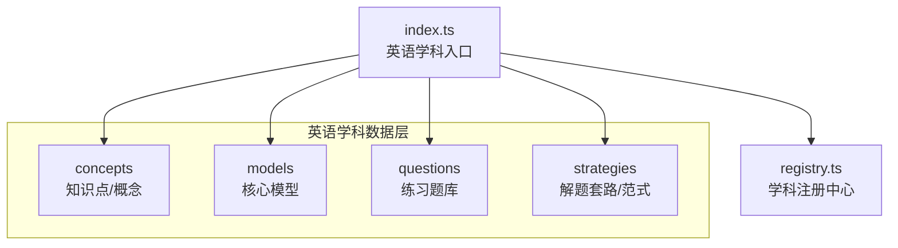
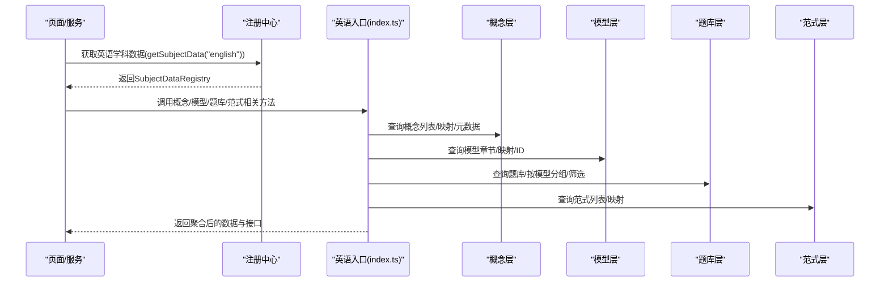
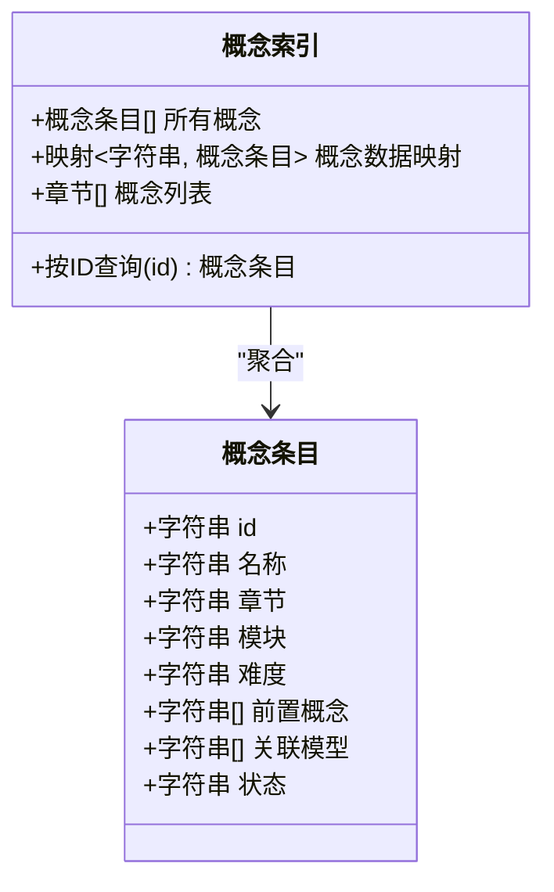
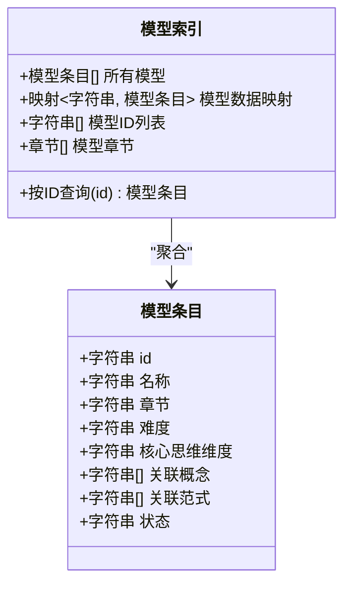
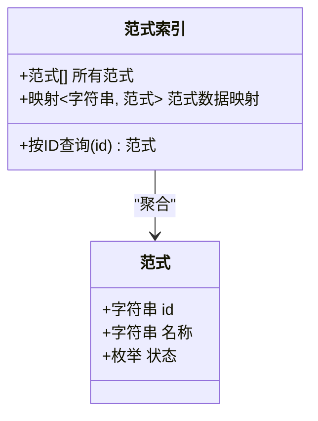
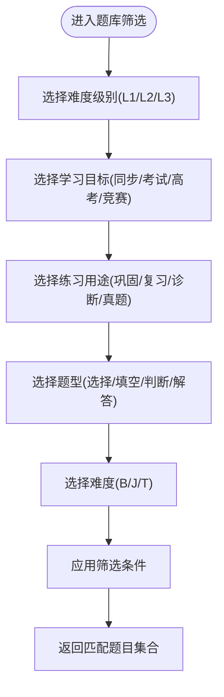
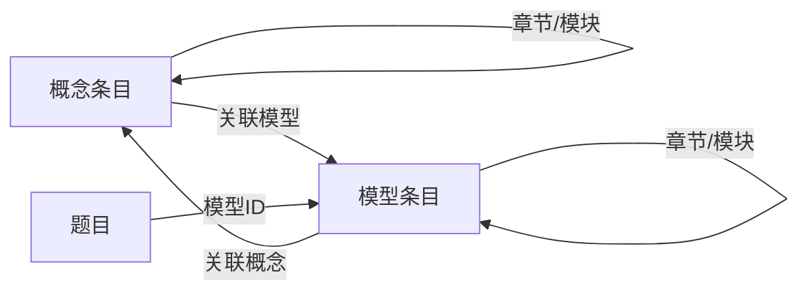

# 英语学科数据结构

<cite>
**本文引用的文件**
- [src/data/english/index.ts](file://src/data/english/index.ts)
- [src/data/english/concepts/index.ts](file://src/data/english/concepts/index.ts)
- [src/data/english/concepts/types.ts](file://src/data/english/concepts/types.ts)
- [src/data/english/concepts/E01_英语基本句型.ts](file://src/data/english/concepts/E01_英语基本句型.ts)
- [src/data/english/models/index.ts](file://src/data/english/models/index.ts)
- [src/data/english/models/types.ts](file://src/data/english/models/types.ts)
- [src/data/english/models/M01_句型识别与转换模型.ts](file://src/data/english/models/M01_句型识别与转换模型.ts)
- [src/data/english/questions/index.ts](file://src/data/english/questions/index.ts)
- [src/data/english/questions/filters.ts](file://src/data/english/questions/filters.ts)
- [src/data/english/strategies.ts](file://src/data/english/strategies.ts)
- [src/data/registry.ts](file://src/data/registry.ts)
</cite>

## 目录
1. [引言](#引言)
2. [项目结构](#项目结构)
3. [核心组件](#核心组件)
4. [架构总览](#架构总览)
5. [详细组件分析](#详细组件分析)
6. [依赖分析](#依赖分析)
7. [性能考虑](#性能考虑)
8. [故障排查指南](#故障排查指南)
9. [结论](#结论)
10. [附录](#附录)

## 引言
本文件系统化梳理英语学科在本项目中的数据结构设计，围绕K层（知识点/概念）、M层（核心模型）、R层（解题套路/范式）、P层（练习题库）四个层级，结合语法、词汇、阅读、写作、听力等模块，给出可落地的知识点组织、模型映射、题库筛选与学习路径建议。同时，阐明英语学习路径与技能培养目标，解释阅读理解、写作、语法填空等核心模型的实现思路，并提供题库按题型、难度、主题的多维组织方式及资源分类管理机制。

## 项目结构
英语学科数据位于 src/data/english 目录下，采用“模块化+分层”的组织方式：
- concepts：知识点/概念层，按模块与章节组织，每个概念文件对应一个具体知识点条目
- models：核心模型层，按模块与章节组织，每个模型文件对应一个可复用的思维模型或解题模型
- questions：练习题库层，集中存放题目数据与筛选配置
- strategies：解题套路/范式层，定义可迁移的解题范式清单
- index.ts：英语学科数据入口，统一注册与导出接口，供上层页面与服务使用

图表来源
- [src/data/english/index.ts:1-150](file://src/data/english/index.ts#L1-L150)
- [src/data/registry.ts:40-52](file://src/data/registry.ts#L40-L52)

章节来源
- [src/data/english/index.ts:1-150](file://src/data/english/index.ts#L1-L150)
- [src/data/registry.ts:40-52](file://src/data/registry.ts#L40-L52)

## 核心组件
- 英语学科入口与注册
  - 通过 registerSubject 将英语学科注册到全局注册中心，暴露概念、模型、公式、范式、题库等查询与统计接口
  - 提供概念列表、概念元数据、模型章节、题库筛选选项、图谱数据占位等统一访问入口
- 知识点/概念层（K层）
  - 概念索引聚合所有概念条目，按“章节-条目”组织；提供概念数据映射、概念ID列表、按ID查询等能力
  - 概念条目包含：ID、名称、所属章节、所属模块、难度、前置概念、关联模型、状态等字段
- 核心模型层（M层）
  - 模型索引聚合所有模型条目，按“章节-模型”组织；提供模型数据映射、模型ID列表、按ID查询等能力
  - 模型条目包含：ID、名称、所属章节、难度、核心思维维度、关联概念、关联范式、状态等字段
- 解题套路/范式层（R层）
  - 范式清单以统一接口暴露，支持按ID查询；为未来扩展“可迁移解题范式”提供结构化支撑
- 练习题库层（P层）
  - 题库提供题目数组、按模型分组、按ID查询、筛选配置（难度、目标、用途、题型、难度颜色）等
  - 题目对象包含：ID、模型ID、题型、难度、目标、用途、内容、答案等字段（结构由上层使用约定）

章节来源
- [src/data/english/index.ts:101-150](file://src/data/english/index.ts#L101-L150)
- [src/data/english/concepts/index.ts:61-216](file://src/data/english/concepts/index.ts#L61-L216)
- [src/data/english/models/index.ts:62-225](file://src/data/english/models/index.ts#L62-L225)
- [src/data/english/questions/index.ts:3-15](file://src/data/english/questions/index.ts#L3-L15)
- [src/data/english/questions/filters.ts:1-38](file://src/data/english/questions/filters.ts#L1-L38)
- [src/data/english/strategies.ts:9-77](file://src/data/english/strategies.ts#L9-L77)

## 架构总览
英语学科数据在运行时通过注册中心对外提供统一接口，前端页面与服务通过学科ID获取相应能力。下图展示英语学科数据在注册中心中的角色与依赖：

图表来源
- [src/data/registry.ts:46-48](file://src/data/registry.ts#L46-L48)
- [src/data/english/index.ts:125-150](file://src/data/english/index.ts#L125-L150)

章节来源
- [src/data/registry.ts:40-52](file://src/data/registry.ts#L40-L52)
- [src/data/english/index.ts:125-150](file://src/data/english/index.ts#L125-L150)

## 详细组件分析

### 知识点/概念层（K层）
- 组织方式
  - 概念按“章节-条目”组织，章节包括：句法基础、三大从句、非谓语动词与特殊结构、时态与语态、词汇与语义系统、语篇与阅读能力、写作与翻译、听力与口语、高考衔接策略
  - 每个概念文件是一个概念条目，包含ID、名称、章节、模块、难度、前置概念、关联模型、状态等
- 数据结构要点
  - 概念ID唯一标识，便于与模型、题库建立关联
  - 难度字段支持“核心/扩展/入门”映射为数值，便于排序与筛选
  - 关联模型用于建立“学-练-模”闭环
- 典型示例
  - 基本句型概念条目：包含5种句型、所属章节、难度、关联模型等
  - 参考路径：[src/data/english/concepts/E01_英语基本句型.ts:3-13](file://src/data/english/concepts/E01_英语基本句型.ts#L3-L13)

图表来源
- [src/data/english/concepts/index.ts:61-216](file://src/data/english/concepts/index.ts#L61-L216)
- [src/data/english/concepts/E01_英语基本句型.ts:3-13](file://src/data/english/concepts/E01_英语基本句型.ts#L3-L13)

章节来源
- [src/data/english/concepts/index.ts:61-216](file://src/data/english/concepts/index.ts#L61-L216)
- [src/data/english/concepts/types.ts:1-3](file://src/data/english/concepts/types.ts#L1-L3)
- [src/data/english/concepts/E01_英语基本句型.ts:3-13](file://src/data/english/concepts/E01_英语基本句型.ts#L3-L13)

### 核心模型层（M层）
- 组织方式
  - 模型按“章节-模型”组织，章节包括：句法基础、三大从句、非谓语动词与特殊结构、时态与语态、词汇与语义系统、语篇与阅读能力、写作与翻译、听力与口语、高考衔接策略
  - 每个模型文件是一个模型条目，包含ID、名称、章节、难度、核心思维维度、关联概念、关联范式、状态等
- 数据结构要点
  - 模型ID唯一标识，便于与题库建立关联
  - 核心思维维度体现模型的抽象能力（如“形式-意义-用法”）
  - 关联概念用于建立“学-练-模”闭环
- 典型示例
  - 句型识别与转换模型：包含核心思维维度、关联概念、难度等级等
  - 参考路径：[src/data/english/models/M01_句型识别与转换模型.ts:3-12](file://src/data/english/models/M01_句型识别与转换模型.ts#L3-L12)

图表来源
- [src/data/english/models/index.ts:62-225](file://src/data/english/models/index.ts#L62-L225)
- [src/data/english/models/types.ts:1-3](file://src/data/english/models/types.ts#L1-L3)
- [src/data/english/models/M01_句型识别与转换模型.ts:3-12](file://src/data/english/models/M01_句型识别与转换模型.ts#L3-L12)

章节来源
- [src/data/english/models/index.ts:62-225](file://src/data/english/models/index.ts#L62-L225)
- [src/data/english/models/types.ts:1-3](file://src/data/english/models/types.ts#L1-L3)
- [src/data/english/models/M01_句型识别与转换模型.ts:3-12](file://src/data/english/models/M01_句型识别与转换模型.ts#L3-L12)

### 解题套路/范式层（R层）
- 组织方式
  - 范式清单以统一接口暴露，包含ID、名称、状态等字段
  - 为未来扩展“可迁移解题范式”提供结构化支撑
- 数据结构要点
  - 范式ID唯一标识，便于与模型、题库建立关联
  - 状态字段支持发布/草稿/即将上线等状态管理
- 典型示例
  - 句型快速识别范式、句子成分分析范式、复合句层次分析范式等
  - 参考路径：[src/data/english/strategies.ts:9-77](file://src/data/english/strategies.ts#L9-L77)

图表来源
- [src/data/english/strategies.ts:9-77](file://src/data/english/strategies.ts#L9-L77)

章节来源
- [src/data/english/strategies.ts:9-77](file://src/data/english/strategies.ts#L9-L77)

### 练习题库层（P层）
- 组织方式
  - 题库提供题目数组、按模型分组、按ID查询等能力
  - 筛选配置包含：难度（L1/L2/L3）、目标（同步学习/期中期末/高考专项/竞赛拓展）、用途（巩固练习/复习检测/诊断评估/真题演练）、题型（选择/填空/判断/解答）、难度颜色映射
- 数据结构要点
  - 题目对象包含：ID、模型ID、题型、难度、目标、用途、内容、答案等字段（结构由上层使用约定）
  - 题库统计接口可用于分析各模型的练习分布与正确率趋势
- 典型示例
  - 题库入口与筛选配置：参考路径 [src/data/english/questions/index.ts:3-15](file://src/data/english/questions/index.ts#L3-L15)、[src/data/english/questions/filters.ts:1-38](file://src/data/english/questions/filters.ts#L1-L38)

图表来源
- [src/data/english/questions/filters.ts:1-38](file://src/data/english/questions/filters.ts#L1-L38)
- [src/data/english/questions/index.ts:3-15](file://src/data/english/questions/index.ts#L3-L15)

章节来源
- [src/data/english/questions/index.ts:3-15](file://src/data/english/questions/index.ts#L3-L15)
- [src/data/english/questions/filters.ts:1-38](file://src/data/english/questions/filters.ts#L1-L38)

### 英语模块与学习路径
- 模块划分
  - 句法基础、三大从句、非谓语动词与特殊结构、时态与语态、词汇与语义系统、语篇与阅读能力、写作与翻译、听力与口语、高考衔接策略
- 学习路径建议
  - 语法：从基本句型→句子成分→并列结构→复合句→非谓语动词→时态语态，形成“句型→结构→时态”的递进
  - 词汇：从词根词缀→一词多义→熟词生义→短语动词→固定搭配→近义词辨析，形成“构词→语义→搭配→辨析”的递进
  - 阅读：从衔接链追踪→记叙文/说明文/议论文→主旨/细节/推理/词义→长难句精读，形成“结构→体裁→能力→深度”的递进
  - 写作：从应用文→段落展开→衔接手段→读后续写→概要写作→翻译技巧，形成“体裁→结构→表达→整合”的递进
  - 听力口语：从语音基础→短对话→长对话与独白→笔记结构→话题展开→跨文化交际，形成“基础→情境→输出→文化”的递进
- 技能培养
  - 通过“学-练-模”闭环：先学概念，再做题训练，最后用模型总结提升

章节来源
- [src/data/english/concepts/index.ts:117-212](file://src/data/english/concepts/index.ts#L117-L212)
- [src/data/english/models/index.ts:123-221](file://src/data/english/models/index.ts#L123-L221)

### 核心模型实现细节
- 句型识别与转换模型
  - 核心思维维度：形式-意义-用法
  - 关联概念：基本句型、句子成分识别
  - 适用场景：语法填空、长难句分析、阅读理解中的句意把握
- 阅读理解模型
  - 记叙文/说明文/议论文阅读模型：分别针对不同体裁的阅读策略
  - 主旨概括与标题选择、细节定位与信息比对、推理判断与态度推断、词义猜测、长难句精读
- 写作模型
  - 应用文写作（书信/通知/倡议书）、段落展开、衔接手段运用、读后续写（情节构建/语言润色）、概要写作（信息提取/语言浓缩）
- 语法填空模型
  - 语法填空解题模型、七选五语篇衔接模型、语法改错策略模型、卷面书写规范模型

章节来源
- [src/data/english/models/M01_句型识别与转换模型.ts:3-12](file://src/data/english/models/M01_句型识别与转换模型.ts#L3-L12)
- [src/data/english/models/index.ts:123-221](file://src/data/english/models/index.ts#L123-L221)

### 题库组织与资源分类
- 多维筛选
  - 难度：L1（基础）、L2（进阶）、L3（挑战）
  - 目标：同步学习、期中期末、高考专项、竞赛拓展
  - 用途：巩固练习、复习检测、诊断评估、真题演练
  - 题型：选择题、填空题、判断题、解答题
  - 难度颜色：B（基础）、J（进阶）、T（挑战）
- 按模型分组
  - 通过模型ID将题目归类，便于“以模型为中心”的练习与评估
- 资源分类管理
  - 以“章节-模块-题型-难度-目标-用途”为维度进行分类，支持灵活检索与推荐

章节来源
- [src/data/english/questions/filters.ts:1-38](file://src/data/english/questions/filters.ts#L1-L38)
- [src/data/english/questions/index.ts:65-123](file://src/data/english/questions/index.ts#L65-L123)

## 依赖分析
- 概念与模型的双向关联
  - 概念层通过“关联模型”指向模型层
  - 模型层通过“关联概念”指向概念层
- 概念与题库的单向关联
  - 题库通过“模型ID”与模型层关联，从而间接与概念层关联
- 注册中心的统一接口
  - 英语入口通过注册中心暴露统一接口，屏蔽内部模块细节

图表来源
- [src/data/english/concepts/E01_英语基本句型.ts:3-13](file://src/data/english/concepts/E01_英语基本句型.ts#L3-L13)
- [src/data/english/models/M01_句型识别与转换模型.ts:3-12](file://src/data/english/models/M01_句型识别与转换模型.ts#L3-L12)
- [src/data/english/questions/index.ts:3-15](file://src/data/english/questions/index.ts#L3-L15)

章节来源
- [src/data/english/concepts/E01_英语基本句型.ts:3-13](file://src/data/english/concepts/E01_英语基本句型.ts#L3-L13)
- [src/data/english/models/M01_句型识别与转换模型.ts:3-12](file://src/data/english/models/M01_句型识别与转换模型.ts#L3-L12)
- [src/data/english/questions/index.ts:3-15](file://src/data/english/questions/index.ts#L3-L15)

## 性能考虑
- 数据结构与复杂度
  - 概念/模型/题库均以数组+映射的方式存储，查询复杂度为O(1)，适合前端直取
  - 按模型分组的统计与过滤在内存中完成，适合小中规模数据集
- 优化建议
  - 对于大规模题库，可考虑分页加载、懒加载与缓存策略
  - 对筛选条件较多的场景，可引入索引或预聚合统计以降低计算开销
- 可扩展性
  - 通过注册中心与统一接口，新增模块或模型无需改动上层调用代码

## 故障排查指南
- 常见问题
  - 概念/模型ID缺失或重复：检查ID生成与导出，确保唯一性
  - 关联关系不一致：校验“关联概念/关联模型/模型ID”是否与实际条目一致
  - 题库筛选结果为空：确认筛选条件与题库数据是否匹配
- 定位方法
  - 使用按ID查询接口快速定位条目
  - 利用“按模型分组”接口查看模型对应的题目集合
  - 检查注册中心是否成功注册英语学科数据

章节来源
- [src/data/english/questions/index.ts:9-15](file://src/data/english/questions/index.ts#L9-L15)
- [src/data/english/concepts/index.ts:214-216](file://src/data/english/concepts/index.ts#L214-L216)
- [src/data/english/models/index.ts:223-225](file://src/data/english/models/index.ts#L223-L225)

## 结论
本英语学科数据结构以“K-M-R-P”四层为核心，配合注册中心统一接口，实现了知识点、核心模型、解题范式与题库的有机联动。通过模块化组织与多维筛选，既满足了教学与学习的阶段性需求，也为未来的国际化与跨文化交流提供了可扩展的数据骨架。建议在后续迭代中逐步完善题库与范式内容，持续优化学习路径与资源推荐。

## 附录
- 国际化与跨文化价值
  - 通过“跨文化交际案例分析”等模型，融入国际视野与跨文化理解，提升学生的全球胜任力
  - 题库与范式可结合不同文化背景材料进行扩展，增强语言学习的真实情境与文化敏感性