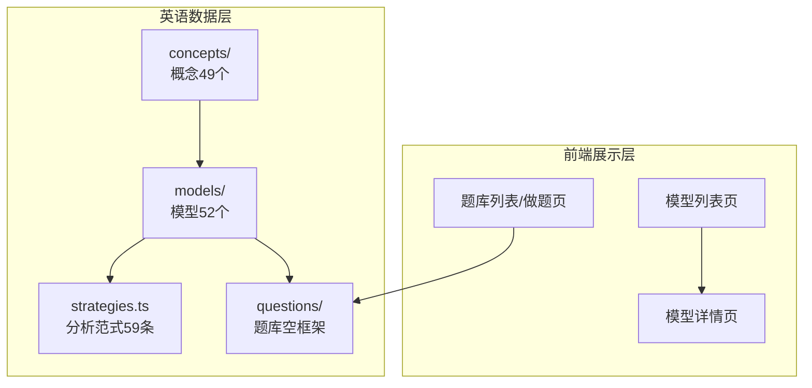
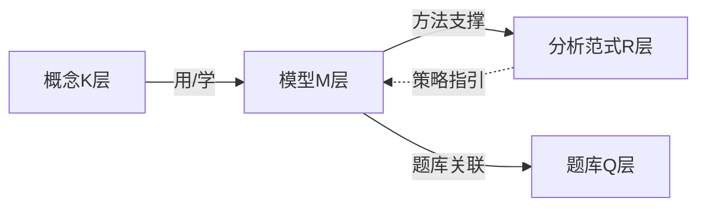
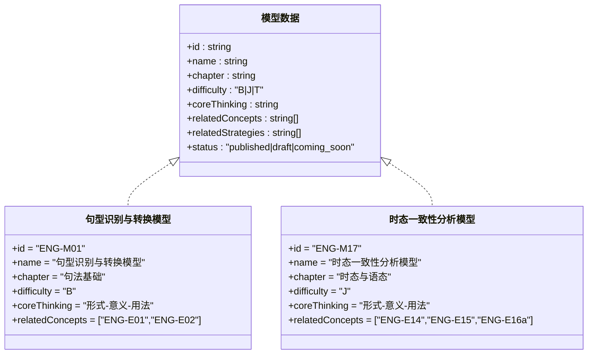
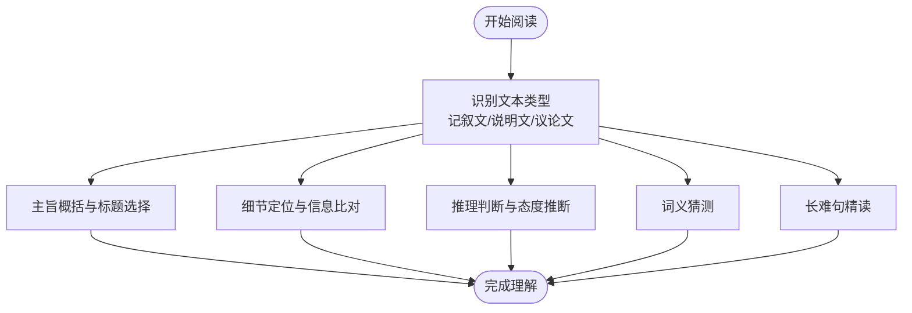
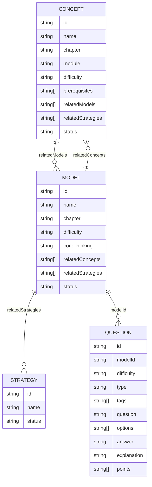

# 英语核心模型

<cite>
**本文档引用的文件**
- [SPEC.md](file://SPEC.md)
- [FEATURE-英语学科数据骨架完成记录.md](file://docs/FEATURE-英语学科数据骨架完成记录.md)
- [models/index.ts](file://src/data/english/models/index.ts)
- [models/types.ts](file://src/data/english/models/types.ts)
- [M01_句型识别与转换模型.ts](file://src/data/english/models/M01_句型识别与转换模型.ts)
- [M17_时态一致性分析模型.ts](file://src/data/english/models/M17_时态一致性分析模型.ts)
- [M28_记叙文阅读模型.ts](file://src/data/english/models/M28_记叙文阅读模型.ts)
- [M36_书信邮件写作模型.ts](file://src/data/english/models/M36_书信邮件写作模型.ts)
- [M44_短对话听力预判验证模型.ts](file://src/data/english/models/M44_短对话听力预判验证模型.ts)
- [concepts/index.ts](file://src/data/english/concepts/index.ts)
- [concepts/types.ts](file://src/data/english/concepts/types.ts)
- [E01_英语基本句型.ts](file://src/data/english/concepts/E01_英语基本句型.ts)
- [E14_一般现在时与一般过去时.ts](file://src/data/english/concepts/E14_一般现在时与一般过去时.ts)
- [strategies.ts](file://src/data/english/strategies.ts)
- [questions/index.ts](file://src/data/english/questions/index.ts)
- [questions/filters.ts](file://src/data/english/questions/filters.ts)
</cite>

## 目录
1. [简介](#简介)
2. [项目结构](#项目结构)
3. [核心组件](#核心组件)
4. [架构总览](#架构总览)
5. [详细组件分析](#详细组件分析)
6. [依赖分析](#依赖分析)
7. [性能考虑](#性能考虑)
8. [故障排查指南](#故障排查指南)
9. [结论](#结论)
10. [附录](#附录)

## 简介
本文件系统化阐述英语学科的核心模型（M层）设计，面向“英语学科数据骨架”的实现现状，聚焦于语法模型、阅读理解模型、写作模型、听力模型等语言技能模型的结构化组织与数据骨架。文档基于仓库现有文件，总结模型的理论基础、应用场景与解决的问题类型，梳理模型的数据结构字段（如模型ID、名称、难度、描述、适用场景等），并说明模型与知识点（K层）及分析范式（R层）的关联关系，以及在题库中的应用方式。

## 项目结构
英语学科数据骨架采用与物理学科一致的三层架构（K/M/R/P/V），其中M层为核心模型层，按9大板块分组管理52个模型。模型文件位于英文数据目录，通过 barrel 导出聚合，配合概念、题库、分析范式等模块协同使用。

图表来源
- [models/index.ts:123-221](file://src/data/english/models/index.ts#L123-L221)
- [strategies.ts:9-69](file://src/data/english/strategies.ts#L9-L69)
- [questions/index.ts:1-15](file://src/data/english/questions/index.ts#L1-L15)

章节来源
- [FEATURE-英语学科数据骨架完成记录.md:81-96](file://docs/FEATURE-英语学科数据骨架完成记录.md#L81-L96)
- [models/index.ts:123-221](file://src/data/english/models/index.ts#L123-L221)

## 核心组件
- 模型数据结构（ModelData）
  - 字段：id、name、chapter、difficulty、coreThinking、relatedConcepts、relatedStrategies、status
  - 用途：统一描述模型的定位、难度、核心思维、关联知识点与范式、发布状态
- 模型聚合与查询
  - allModels：模型数组
  - modelDataMap：以模型ID为键的映射
  - englishModels：按9大板块分组的模型集合
  - getModelById：按ID检索模型
- 概念与模型的双向关联
  - 概念文件中维护 relatedModels，模型文件中维护 relatedConcepts
- 分析范式（Strategy）
  - 字段：id、name、status
  - 用途：为模型提供“解题范式”支撑，当前处于骨架阶段
- 题库（Questions）
  - 当前为空框架，提供按模型ID过滤的接口与筛选常量

章节来源
- [models/types.ts:1-3](file://src/data/english/models/types.ts#L1-L3)
- [models/index.ts:62-121](file://src/data/english/models/index.ts#L62-L121)
- [strategies.ts:1-77](file://src/data/english/strategies.ts#L1-L77)
- [questions/index.ts:1-15](file://src/data/english/questions/index.ts#L1-L15)
- [questions/filters.ts:1-38](file://src/data/english/questions/filters.ts#L1-L38)

## 架构总览
英语M层模型围绕“语言技能—知识节点—解题范式—题库”的闭环组织，模型作为能力单元承载具体语言技能，与K层概念形成“用—学”关系，与R层范式形成“方法—应用”关系，最终通过题库实现练习与评估。

图表来源
- [SPEC.md:372-462](file://SPEC.md#L372-L462)
- [concepts/index.ts](file://src/data/english/concepts/index.ts)
- [models/index.ts:62-121](file://src/data/english/models/index.ts#L62-L121)
- [strategies.ts:9-69](file://src/data/english/strategies.ts#L9-L69)
- [questions/index.ts:13-15](file://src/data/english/questions/index.ts#L13-L15)

## 详细组件分析

### 语法模型
- 设计理念
  - 以“形式-意义-用法”为核心思维，强调句法结构与语义功能的统一
  - 按语法范畴分组：句型基础、三大从句、非谓语动词与特殊结构、时态与语态
- 典型模型
  - 句型识别与转换模型：识别并转换基础句型（SV/SVO/SVP/SVOO/SVOC）
  - 时态一致性分析模型：处理一般现在/过去时等基础时态的一致性判断
- 数据结构要点
  - 模型ID：ENG-M01、ENG-M17 等
  - 难度：B（基础）、J（进阶）、T（挑战）
  - 关联概念：如 ENG-E01、ENG-E14 等
- 应用场景
  - 语法填空、改错、长难句分析、阅读理解中的时态/语态定位

图表来源
- [models/types.ts:1-3](file://src/data/english/models/types.ts#L1-L3)
- [M01_句型识别与转换模型.ts:3-12](file://src/data/english/models/M01_句型识别与转换模型.ts#L3-L12)
- [M17_时态一致性分析模型.ts:3-12](file://src/data/english/models/M17_时态一致性分析模型.ts#L3-L12)

章节来源
- [M01_句型识别与转换模型.ts:3-12](file://src/data/english/models/M01_句型识别与转换模型.ts#L3-L12)
- [M17_时态一致性分析模型.ts:3-12](file://src/data/english/models/M17_时态一致性分析模型.ts#L3-L12)
- [SPEC.md:372-462](file://SPEC.md#L372-L462)

### 阅读理解模型
- 设计理念
  - 以“语境中的语篇分析”为核心思维，强调文本类型与题型的匹配
  - 按文本类型分组：记叙文、说明文、议论文
  - 按题型分组：主旨概括、细节定位、推理判断、词义猜测、长难句精读
- 典型模型
  - 记叙文阅读模型：围绕人物、事件、情感线索的把握
  - 主旨概括与标题选择模型：提炼中心思想与恰当标题
  - 长难句精读模型：复杂句式的拆解与整合
- 数据结构要点
  - 模型ID：ENG-M28、ENG-M31、ENG-M35 等
  - 难度：B（基础）、J（进阶）、T（挑战）
  - 关联概念：如 ENG-E24（文本类型）、ENG-E25a（主旨概括）等
- 应用场景
  - 阅读理解题、七选五、语法填空中的语篇衔接与信息定位

图表来源
- [M28_记叙文阅读模型.ts:3-12](file://src/data/english/models/M28_记叙文阅读模型.ts#L3-L12)
- [M36_书信邮件写作模型.ts:3-12](file://src/data/english/models/M36_书信邮件写作模型.ts#L3-L12)
- [SPEC.md:372-462](file://SPEC.md#L372-L462)

章节来源
- [M28_记叙文阅读模型.ts:3-12](file://src/data/english/models/M28_记叙文阅读模型.ts#L3-L12)
- [SPEC.md:372-462](file://SPEC.md#L372-L462)

### 写作模型
- 设计理念
  - 以“策略性输入与输出”为核心思维，强调结构化写作与语言润色
  - 按文体分组：应用文（书信/邮件/通知/演讲稿）、读后续写、概要写作
  - 按能力分组：段落展开、连贯性与衔接手段运用、语言润色、信息提取与浓缩
- 典型模型
  - 书信邮件写作模型：格式、语气、信息完整性
  - 读后续写情节构建模型：基于原文的逻辑延展
  - 概要写作信息提取与语言浓缩模型：信息筛选与语言压缩
- 数据结构要点
  - 模型ID：ENG-M36、ENG-M40、ENG-M42 等
  - 难度：B（基础）、J（进阶）、T（挑战）
  - 关联概念：如 ENG-E27a（应用文）、ENG-E29b（语言浓缩）等
- 应用场景
  - 应用文写作、读后续写、概要写作、作文评分与修改

章节来源
- [M36_书信邮件写作模型.ts:3-12](file://src/data/english/models/M36_书信邮件写作模型.ts#L3-L12)
- [SPEC.md:372-462](file://SPEC.md#L372-L462)

### 听力模型
- 设计理念
  - 以“策略性输入与输出”为核心思维，强调预判、解码与笔记结构
  - 按材料分组：短对话、长对话与独白
  - 按能力分组：预判验证、语音解码、笔记结构、口语话题展开、跨文化交际
- 典型模型
  - 短对话听力预判验证模型：听前预测与听后验证
  - 语音解码模型：音素与语义的对应关系
  - 长对话与独白听力笔记结构模型：结构化记录与信息提取
- 数据结构要点
  - 模型ID：ENG-M44、ENG-M45、ENG-M46 等
  - 难度：B（基础）、J（进阶）、T（挑战）
  - 关联概念：如 ENG-E32a（短对话策略）、ENG-E32b（长对话与独白策略）等
- 应用场景
  - 听力填空、信息匹配、数字信息捕捉、口语表达与跨文化理解

章节来源
- [M44_短对话听力预判验证模型.ts:3-12](file://src/data/english/models/M44_短对话听力预判验证模型.ts#L3-L12)
- [SPEC.md:372-462](file://SPEC.md#L372-L462)

### 高考衔接策略模型
- 设计理念
  - 针对高考题型的专项策略，强调解题范式与卷面规范
  - 涵盖语法填空、七选五、语法改错、卷面书写规范等
- 典型模型
  - 语法填空解题模型：语境与语法的综合判断
  - 七选五语篇衔接模型：上下文逻辑与衔接手段
  - 语法改错策略模型：常见错误类型与纠错路径
  - 卷面书写规范模型：整洁度与得分策略
- 数据结构要点
  - 模型ID：ENG-M49、ENG-M50、ENG-M51、ENG-M52 等
  - 难度：B（基础）、J（进阶）、T（挑战）
  - 关联概念：如 ENG-E35（语法填空策略）、ENG-E36（七选五衔接）等
- 应用场景
  - 高考专项训练、模拟考试、答题规范强化

章节来源
- [SPEC.md:372-462](file://SPEC.md#L372-L462)

## 依赖分析
- 模型与概念的双向关联
  - 概念文件维护 relatedModels，模型文件维护 relatedConcepts，形成“学—用”闭环
- 模型与分析范式的潜在关联
  - 模型文件维护 relatedStrategies，分析范式文件提供策略骨架，未来可实现动态绑定
- 模型与题库的关联
  - 题库提供按模型ID过滤的接口，题库数据填充后可实现“模型—题目”精准匹配

图表来源
- [concepts/E01_英语基本句型.ts:3-13](file://src/data/english/concepts/E01_英语基本句型.ts#L3-L13)
- [models/M01_句型识别与转换模型.ts:3-12](file://src/data/english/models/M01_句型识别与转换模型.ts#L3-L12)
- [strategies.ts:1-77](file://src/data/english/strategies.ts#L1-L77)
- [questions/index.ts:1-15](file://src/data/english/questions/index.ts#L1-L15)

章节来源
- [concepts/E01_英语基本句型.ts:3-13](file://src/data/english/concepts/E01_英语基本句型.ts#L3-L13)
- [models/M01_句型识别与转换模型.ts:3-12](file://src/data/english/models/M01_句型识别与转换模型.ts#L3-L12)
- [strategies.ts:1-77](file://src/data/english/strategies.ts#L1-L77)
- [questions/index.ts:1-15](file://src/data/english/questions/index.ts#L1-L15)

## 性能考虑
- 模型聚合与查询
  - 使用 Map（modelDataMap）进行 O(1) 按ID检索，适合高频访问
  - allModels 与 englishModels 便于分组展示与导航
- 题库扩展
  - questions/index.ts 提供按模型ID过滤的接口，便于按模型维度加载题目
  - filters.ts 提供难度、类型等筛选常量，利于前端高效筛选
- 类型安全
  - types.ts 与 SPEC.md 的字段规范保持一致，确保编译期校验与运行时稳定

章节来源
- [models/index.ts:117-121](file://src/data/english/models/index.ts#L117-L121)
- [questions/index.ts:13-15](file://src/data/english/questions/index.ts#L13-L15)
- [questions/filters.ts:1-38](file://src/data/english/questions/filters.ts#L1-L38)
- [SPEC.md:465-480](file://SPEC.md#L465-L480)

## 故障排查指南
- 模型ID缺失或重复
  - 现象：getModelById 返回 undefined
  - 排查：确认模型ID是否符合 ENG-Mxx 格式，是否存在于 modelDataMap
- 关联概念/范式不存在
  - 现象：模型 relatedConcepts/relatedStrategies 中存在无效ID
  - 排查：核对 concepts 与 strategies 的 ID 是否正确
- 题库无法按模型过滤
  - 现象：getQuestionsByModelId 返回空数组
  - 排查：确认题库数据中 question.modelId 与模型ID一致，且 questions 数组已填充
- 难度/类型筛选异常
  - 现象：DIFFICULTY_OPTIONS/TYPE_OPTIONS 未生效
  - 排查：确认 filters.ts 常量与题库数据字段一致

章节来源
- [models/index.ts:223-225](file://src/data/english/models/index.ts#L223-L225)
- [questions/index.ts:9-15](file://src/data/english/questions/index.ts#L9-L15)
- [questions/filters.ts:21-38](file://src/data/english/questions/filters.ts#L21-L38)

## 结论
英语学科数据骨架已完成M层模型的结构化设计与聚合导出，涵盖语法、阅读、写作、听力与高考衔接五大能力域，形成“概念—模型—范式—题库”的完整闭环。模型以“形式-意义-用法”“语境中的语篇分析”“策略性输入与输出”为核心思维，通过明确的数据结构字段与关联关系，为后续内容填充与前端展示提供了清晰的实现路径。

## 附录
- 模型与概念的对应关系示例
  - ENG-M01 ↔ ENG-E01（句型识别与转换 ↔ 英语基本句型）
  - ENG-M17 ↔ ENG-E14（时态一致性分析 ↔ 一般现在时与一般过去时）
- 模型分组概览（来自 FEATURE 文档）
  - 句法基础、三大从句、非谓语动词与特殊结构、时态与语态、词汇与语义系统、语篇与阅读能力、写作与翻译、听力与口语、高考衔接策略

章节来源
- [FEATURE-英语学科数据骨架完成记录.md:81-96](file://docs/FEATURE-英语学科数据骨架完成记录.md#L81-L96)
- [E01_英语基本句型.ts:3-13](file://src/data/english/concepts/E01_英语基本句型.ts#L3-L13)
- [E14_一般现在时与一般过去时.ts:3-13](file://src/data/english/concepts/E14_一般现在时与一般过去时.ts#L3-L13)