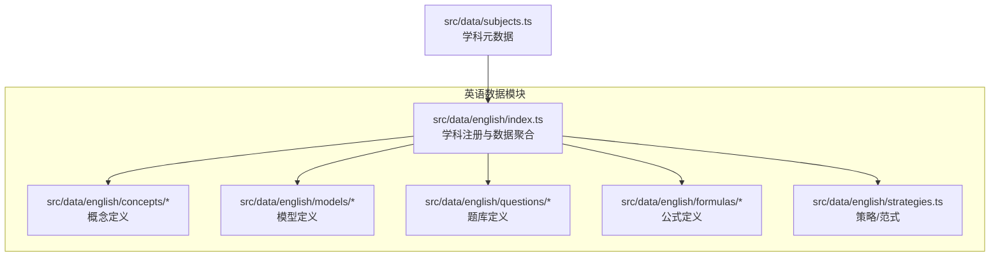
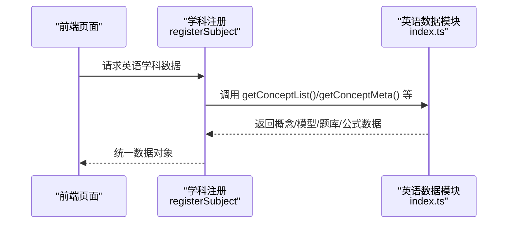
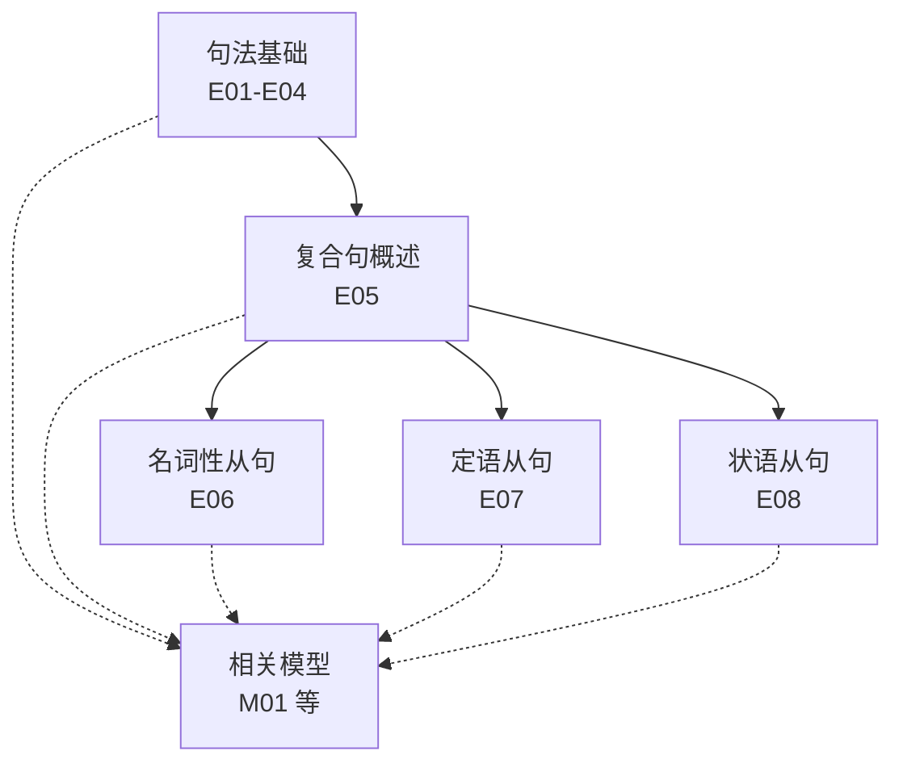
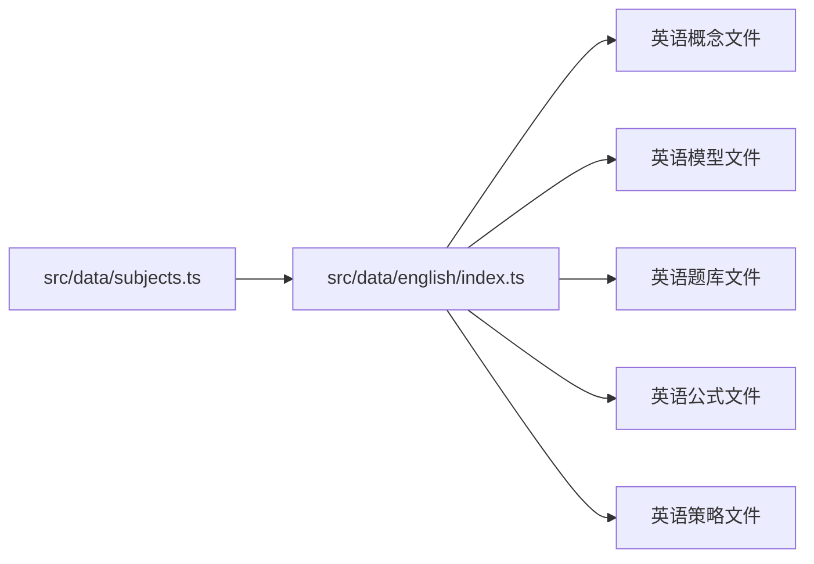

# 英语概念体系

<cite>
**本文引用的文件**
- [src/data/english/index.ts](file://src/data/english/index.ts)
- [src/data/english/concepts/types.ts](file://src/data/english/concepts/types.ts)
- [src/data/english/models/types.ts](file://src/data/english/models/types.ts)
- [src/data/english/questions/types.ts](file://src/data/english/questions/types.ts)
- [src/data/subjects.ts](file://src/data/subjects.ts)
- [src/data/english/concepts/E01_英语基本句型.ts](file://src/data/english/concepts/E01_英语基本句型.ts)
- [src/data/english/concepts/E02_句子成分识别.ts](file://src/data/english/concepts/E02_句子成分识别.ts)
- [src/data/english/concepts/E03_简单句的扩展.ts](file://src/data/english/concepts/E03_简单句的扩展.ts)
- [src/data/english/concepts/E04_并列句与并列连词.ts](file://src/data/english/concepts/E04_并列句与并列连词.ts)
- [src/data/english/concepts/E05_复合句概述.ts](file://src/data/english/concepts/E05_复合句概述.ts)
- [src/data/english/concepts/E06_名词性从句.ts](file://src/data/english/concepts/E06_名词性从句.ts)
- [src/data/english/concepts/E07_定语从句.ts](file://src/data/english/concepts/E07_定语从句.ts)
- [src/data/english/concepts/E08_状语从句.ts](file://src/data/english/concepts/E08_状语从句.ts)
- [src/data/english/models/M01_句型识别与转换模型.ts](file://src/data/english/models/M01_句型识别与转换模型.ts)
</cite>

## 目录
1. [引言](#引言)
2. [项目结构](#项目结构)
3. [核心组件](#核心组件)
4. [架构总览](#架构总览)
5. [详细组件分析](#详细组件分析)
6. [依赖分析](#依赖分析)
7. [性能考虑](#性能考虑)
8. [故障排查指南](#故障排查指南)
9. [结论](#结论)
10. [附录](#附录)

## 引言
本文件系统化梳理英语学科“K层”（知识节点）概念体系的设计与实现，覆盖语法、词汇、阅读、写作、听力等语言技能模块。文档明确概念难度等级（基础、拓展、核心）划分标准，阐释概念间的层级关系与关联性；说明英语语法知识点（时态、语态、从句等）的组织方式与模型映射；给出概念数据结构设计理念（概念ID、名称、难度、模块、章节等字段）及检索与过滤机制，并讨论国际化支持的现状与建议。

## 项目结构
英语概念体系位于数据层子模块，采用“学科-主题-概念/模型/题库”的层次化组织。核心入口通过学科注册机制对外暴露统一接口，供前端页面按需调用。

图表来源
- [src/data/english/index.ts:1-150](file://src/data/english/index.ts#L1-L150)
- [src/data/subjects.ts:12-19](file://src/data/subjects.ts#L12-L19)

章节来源
- [src/data/english/index.ts:1-150](file://src/data/english/index.ts#L1-L150)
- [src/data/subjects.ts:12-19](file://src/data/subjects.ts#L12-L19)

## 核心组件
- 概念（ConceptData）
  - 字段：id、name、chapter、module、difficulty、prerequisites、relatedModels、relatedStrategies、status
  - 用途：描述知识点的唯一标识、所属章节与模块、难度等级、前置与关联关系、状态
- 模型（ModelData）
  - 字段：id、name、chapter、difficulty、coreThinking、relatedConcepts、relatedStrategies、status
  - 用途：以“形式-意义-用法”等思维维度组织可迁移的解题/分析模型
- 题库（Question）
  - 字段：与题型相关的属性（由具体文件定义），包含modelId用于模型-题目映射
- 公式（Formula）
  - 字段：name、chapter等，提供章节与搜索能力
- 策略（Paradigm/Strategy）
  - 字段：策略名称与适用场景，作为范式支撑概念与模型

章节来源
- [src/data/english/concepts/types.ts:1-3](file://src/data/english/concepts/types.ts#L1-L3)
- [src/data/english/models/types.ts:1-3](file://src/data/english/models/types.ts#L1-L3)
- [src/data/english/questions/types.ts:1-3](file://src/data/english/questions/types.ts#L1-L3)

## 架构总览
英语数据模块通过注册机制向系统提供统一查询接口，包括：
- 概念列表与元数据
- 概念数据映射
- 概念ID集合
- 模型章节与映射
- 公式章节与搜索
- 题库筛选选项与统计
- 图谱数据占位

图表来源
- [src/data/english/index.ts:125-150](file://src/data/english/index.ts#L125-L150)

章节来源
- [src/data/english/index.ts:10-150](file://src/data/english/index.ts#L10-L150)

## 详细组件分析

### 概念体系设计与难度等级
- 难度等级
  - 基础（basic）：对应数值1
  - 拓展（extended）：对应数值3
  - 核心（core）：对应数值2
  - 在返回给前端的列表与元数据中，难度被标准化为数值编码，便于排序与筛选
- 模块与章节
  - module：学习板块/技能模块（如“学习板块”）
  - chapter：具体章节（如“句法基础”、“三大从句”）
- 前置与关联
  - prerequisites：概念间的先修关系
  - relatedModels：与模型的关联，用于学习-实践闭环
  - relatedStrategies：策略关联（当前英语模块策略字段为空）

章节来源
- [src/data/english/index.ts:10-35](file://src/data/english/index.ts#L10-L35)
- [src/data/english/concepts/E01_英语基本句型.ts:3-13](file://src/data/english/concepts/E01_英语基本句型.ts#L3-L13)
- [src/data/english/concepts/E02_句子成分识别.ts:3-13](file://src/data/english/concepts/E02_句子成分识别.ts#L3-L13)
- [src/data/english/concepts/E03_简单句的扩展.ts:3-13](file://src/data/english/concepts/E03_简单句的扩展.ts#L3-L13)
- [src/data/english/concepts/E04_并列句与并列连词.ts:3-13](file://src/data/english/concepts/E04_并列句与并列连词.ts#L3-L13)
- [src/data/english/concepts/E05_复合句概述.ts:3-13](file://src/data/english/concepts/E05_复合句概述.ts#L3-L13)
- [src/data/english/concepts/E06_名词性从句.ts:3-13](file://src/data/english/concepts/E06_名词性从句.ts#L3-L13)
- [src/data/english/concepts/E07_定语从句.ts:3-13](file://src/data/english/concepts/E07_定语从句.ts#L3-L13)
- [src/data/english/concepts/E08_状语从句.ts:3-13](file://src/data/english/concepts/E08_状语从句.ts#L3-L13)

### 语法知识点组织（时态、语态、从句）
- 句法基础
  - 基本句型、句子成分识别、简单句扩展、并列句与并列连词
- 复合句与从句
  - 复合句概述、名词性从句、定语从句、状语从句
- 时态与语态
  - 时态与语态相关概念在本仓库中以编号呈现，但未在示例文件中直接展示具体条目，可在后续扩展中补充
- 组织方式
  - 以“章节-概念-模型”的层级组织，概念之间通过prerequisites形成学习路径，模型提供可迁移的思维框架

图表来源
- [src/data/english/concepts/E01_英语基本句型.ts:3-13](file://src/data/english/concepts/E01_英语基本句型.ts#L3-L13)
- [src/data/english/concepts/E02_句子成分识别.ts:3-13](file://src/data/english/concepts/E02_句子成分识别.ts#L3-L13)
- [src/data/english/concepts/E03_简单句的扩展.ts:3-13](file://src/data/english/concepts/E03_简单句的扩展.ts#L3-L13)
- [src/data/english/concepts/E04_并列句与并列连词.ts:3-13](file://src/data/english/concepts/E04_并列句与并列连词.ts#L3-L13)
- [src/data/english/concepts/E05_复合句概述.ts:3-13](file://src/data/english/concepts/E05_复合句概述.ts#L3-L13)
- [src/data/english/concepts/E06_名词性从句.ts:3-13](file://src/data/english/concepts/E06_名词性从句.ts#L3-L13)
- [src/data/english/concepts/E07_定语从句.ts:3-13](file://src/data/english/concepts/E07_定语从句.ts#L3-L13)
- [src/data/english/concepts/E08_状语从句.ts:3-13](file://src/data/english/concepts/E08_状语从句.ts#L3-L13)
- [src/data/english/models/M01_句型识别与转换模型.ts:3-12](file://src/data/english/models/M01_句型识别与转换模型.ts#L3-L12)

章节来源
- [src/data/english/concepts/E01_英语基本句型.ts:3-13](file://src/data/english/concepts/E01_英语基本句型.ts#L3-L13)
- [src/data/english/concepts/E02_句子成分识别.ts:3-13](file://src/data/english/concepts/E02_句子成分识别.ts#L3-L13)
- [src/data/english/concepts/E03_简单句的扩展.ts:3-13](file://src/data/english/concepts/E03_简单句的扩展.ts#L3-L13)
- [src/data/english/concepts/E04_并列句与并列连词.ts:3-13](file://src/data/english/concepts/E04_并列句与并列连词.ts#L3-L13)
- [src/data/english/concepts/E05_复合句概述.ts:3-13](file://src/data/english/concepts/E05_复合句概述.ts#L3-L13)
- [src/data/english/concepts/E06_名词性从句.ts:3-13](file://src/data/english/concepts/E06_名词性从句.ts#L3-L13)
- [src/data/english/concepts/E07_定语从句.ts:3-13](file://src/data/english/concepts/E07_定语从句.ts#L3-L13)
- [src/data/english/concepts/E08_状语从句.ts:3-13](file://src/data/english/concepts/E08_状语从句.ts#L3-L13)
- [src/data/english/models/M01_句型识别与转换模型.ts:3-12](file://src/data/english/models/M01_句型识别与转换模型.ts#L3-L12)

### 词汇分类与管理机制
- 分类维度（建议）
  - 高频词：基于考纲与真题出现频率
  - 学术词：学科术语与表达
  - 文化词：跨文化背景与表达习惯
- 管理机制（建议）
  - 词汇概念与模型联动：词汇学习与语境运用结合
  - 与阅读、写作、听力模块的交叉标注，形成语义链
  - 与“熟词生义/一词多义”“语义场/近义词辨析”等模型协同
- 当前仓库现状
  - 仓库中未直接提供词汇概念文件，可在后续扩展中补充

章节来源
- [src/data/english/concepts/E20a_一词多义与语义链追溯.ts](file://src/data/english/concepts/E20a_一词多义与语义链追溯.ts)
- [src/data/english/concepts/E20b_熟词生义与语境推断.ts](file://src/data/english/concepts/E20b_熟词生义与语境推断.ts)
- [src/data/english/concepts/E22_语义场与近义词辨析.ts](file://src/data/english/concepts/E22_语义场与近义词辨析.ts)

### 阅读、写作、听力模块的概念组织
- 阅读
  - 文本类型与体裁特征、主旨概括与标题选择、细节定位与信息提取、推理判断与态度推断、词义猜测与语境推断、长难句分析方法
- 写作
  - 书信与邮件写作、演讲稿/通知/倡议书写作、读后续写（情节构建/语言润色）、概要写作（信息提取/语言浓缩）
- 听力
  - 短对话/长对话与独白策略、语音基础、口语表达基础
- 组织方式
  - 以“模块-章节-概念-模型-题库”的闭环组织，概念与模型相互印证，题库按模型分组

章节来源
- [src/data/english/concepts/E24_文本类型与体裁特征.ts](file://src/data/english/concepts/E24_文本类型与体裁特征.ts)
- [src/data/english/concepts/E25a_主旨概括与标题选择.ts](file://src/data/english/concepts/E25a_主旨概括与标题选择.ts)
- [src/data/english/concepts/E25b_细节定位与信息提取.ts](file://src/data/english/concepts/E25b_细节定位与信息提取.ts)
- [src/data/english/concepts/E25c_推理判断与态度推断.ts](file://src/data/english/concepts/E25c_推理判断与态度推断.ts)
- [src/data/english/concepts/E25d_词义猜测与语境推断.ts](file://src/data/english/concepts/E25d_词义猜测与语境推断.ts)
- [src/data/english/concepts/E26_长难句分析方法.ts](file://src/data/english/concepts/E26_长难句分析方法.ts)
- [src/data/english/concepts/E27a_书信与邮件写作.ts](file://src/data/english/concepts/E27a_书信与邮件写作.ts)
- [src/data/english/concepts/E27b_演讲稿通知与倡议书写作.ts](file://src/data/english/concepts/E27b_演讲稿通知与倡议书写作.ts)
- [src/data/english/concepts/E28a_读后续写情节构建.ts](file://src/data/english/concepts/E28a_读后续写情节构建.ts)
- [src/data/english/concepts/E28b_读后续写语言润色.ts](file://src/data/english/concepts/E28b_读后续写语言润色.ts)
- [src/data/english/concepts/E29a_概要写作信息提取.ts](file://src/data/english/concepts/E29a_概要写作信息提取.ts)
- [src/data/english/concepts/E29b_概要写作语言浓缩.ts](file://src/data/english/concepts/E29b_概要写作语言浓缩.ts)
- [src/data/english/concepts/E31_语音基础.ts](file://src/data/english/concepts/E31_语音基础.ts)
- [src/data/english/concepts/E32a_短对话听力策略.ts](file://src/data/english/concepts/E32a_短对话听力策略.ts)
- [src/data/english/concepts/E32b_长对话与独白听力策略.ts](file://src/data/english/concepts/E32b_长对话与独白听力策略.ts)
- [src/data/english/concepts/E33_口语表达基础.ts](file://src/data/english/concepts/E33_口语表达基础.ts)

### 概念数据结构设计理念
- 字段说明
  - id：全局唯一标识，遵循“学科-编号”格式（如 ENG-E01）
  - name：概念名称
  - chapter/module：章节与模块归属
  - difficulty：难度等级（基础/拓展/核心）
  - prerequisites：先修概念ID列表
  - relatedModels：关联模型ID列表
  - relatedStrategies：关联策略ID列表
  - status：状态（如 coming_soon）
- 设计原则
  - 可检索：通过id/name/chapter/module/difficulty快速定位
  - 可导航：通过prerequisites构建学习路径
  - 可扩展：relatedModels/relatedStrategies支持跨模块联动
  - 可维护：统一的字段与命名规范

章节来源
- [src/data/english/concepts/E01_英语基本句型.ts:3-13](file://src/data/english/concepts/E01_英语基本句型.ts#L3-L13)
- [src/data/english/concepts/E02_句子成分识别.ts:3-13](file://src/data/english/concepts/E02_句子成分识别.ts#L3-L13)
- [src/data/english/concepts/E03_简单句的扩展.ts:3-13](file://src/data/english/concepts/E03_简单句的扩展.ts#L3-L13)
- [src/data/english/concepts/E04_并列句与并列连词.ts:3-13](file://src/data/english/concepts/E04_并列句与并列连词.ts#L3-L13)
- [src/data/english/concepts/E05_复合句概述.ts:3-13](file://src/data/english/concepts/E05_复合句概述.ts#L3-L13)
- [src/data/english/concepts/E06_名词性从句.ts:3-13](file://src/data/english/concepts/E06_名词性从句.ts#L3-L13)
- [src/data/english/concepts/E07_定语从句.ts:3-13](file://src/data/english/concepts/E07_定语从句.ts#L3-L13)
- [src/data/english/concepts/E08_状语从句.ts:3-13](file://src/data/english/concepts/E08_状语从句.ts#L3-L13)

### 概念检索与过滤
- 检索接口
  - getConceptList：返回章节化的概念列表（含id、name、difficulty）
  - getConceptMeta：按id返回概念元数据（title/module/chapter/difficulty）
  - getAllConceptIds：返回所有概念ID
- 过滤与筛选
  - 按难度（基础/进阶/挑战）过滤
  - 按模块/章节过滤
  - 按先修关系构建学习路径
- 题库与公式
  - 题库提供难度、目标、功能、类型等选项
  - 公式提供章节与名称搜索

章节来源
- [src/data/english/index.ts:10-35](file://src/data/english/index.ts#L10-L35)
- [src/data/english/index.ts:65-99](file://src/data/english/index.ts#L65-L99)
- [src/data/english/index.ts:50-55](file://src/data/english/index.ts#L50-L55)

### 国际化支持
- 当前状态
  - 英语模块的名称与章节为中文，题库难度标签包含中英文混合（如“基础/J 进阶/T 挑战”）
- 建议
  - 采用资源文件或i18n库，将静态文案（章节名、难度标签、选项文案）抽离为可配置项
  - 保持概念ID与结构不变，仅替换显示文案，确保前后端一致

章节来源
- [src/data/english/index.ts:68-91](file://src/data/english/index.ts#L68-L91)

## 依赖分析
英语数据模块依赖学科元数据（subjects.ts）提供的学科注册信息，通过registerSubject统一导出接口；概念与模型文件彼此独立，通过ID建立松耦合关联。

图表来源
- [src/data/subjects.ts:12-19](file://src/data/subjects.ts#L12-L19)
- [src/data/english/index.ts:125-150](file://src/data/english/index.ts#L125-L150)

章节来源
- [src/data/subjects.ts:12-19](file://src/data/subjects.ts#L12-L19)
- [src/data/english/index.ts:125-150](file://src/data/english/index.ts#L125-L150)

## 性能考虑
- 数据加载
  - 概念/模型/题库均为静态数组，按需导入，避免运行时复杂计算
- 查询优化
  - 使用Map缓存（conceptDataMap、modelDataMap、paradigmDataMap）提升查找效率
- 前端渲染
  - 列表与元数据接口已做轻量化处理，建议在前端分页与懒加载

## 故障排查指南
- 概念缺失
  - 检查概念ID是否存在于conceptDataMap；若不存在，确认文件是否正确导入
- 学习路径异常
  - 核对prerequisites是否指向有效ID；检查章节顺序与依赖关系
- 题库统计异常
  - 确认题目的modelId是否正确；检查getModelQuestionStats与getQuestionsByModel的数据结构

章节来源
- [src/data/english/index.ts:105-123](file://src/data/english/index.ts#L105-L123)

## 结论
英语概念体系以“概念-模型-题库”为主线，通过清晰的难度等级与章节模块划分，构建了可检索、可导航、可扩展的知识网络。建议后续完善词汇与语法时态/语态的具体条目，强化国际化文案管理，并持续补充模型与题库，以形成完整的K层数据骨架。

## 附录
- 学科元数据
  - 英语学科在学科清单中已注册，具备路由前缀与颜色等元信息
- 示例概念与模型
  - 句法基础与从句相关概念与模型示例展示了典型的学习路径与模型映射

章节来源
- [src/data/subjects.ts:12-19](file://src/data/subjects.ts#L12-L19)
- [src/data/english/concepts/E01_英语基本句型.ts:3-13](file://src/data/english/concepts/E01_英语基本句型.ts#L3-L13)
- [src/data/english/models/M01_句型识别与转换模型.ts:3-12](file://src/data/english/models/M01_句型识别与转换模型.ts#L3-L12)