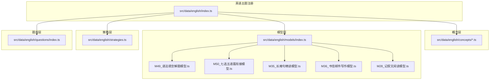
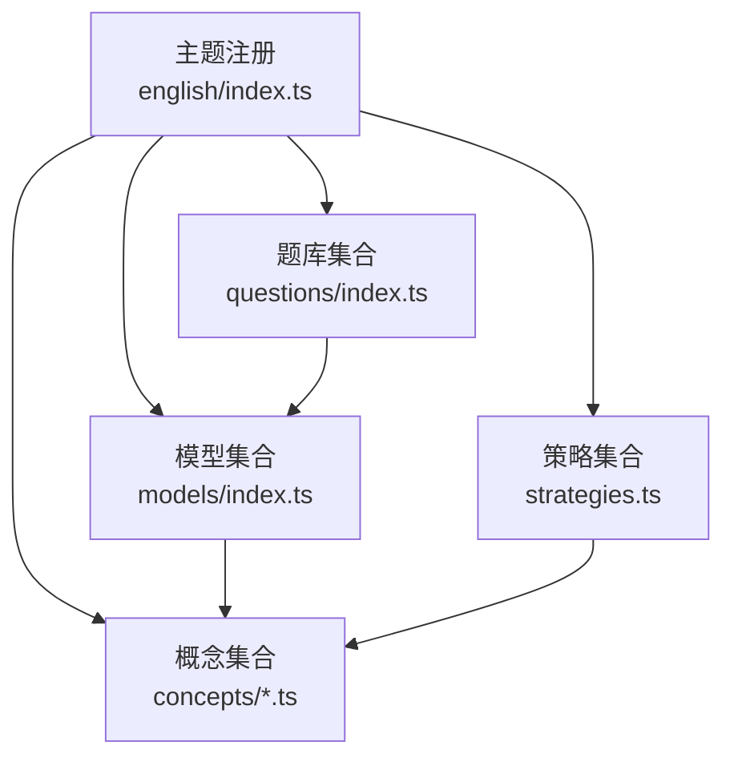
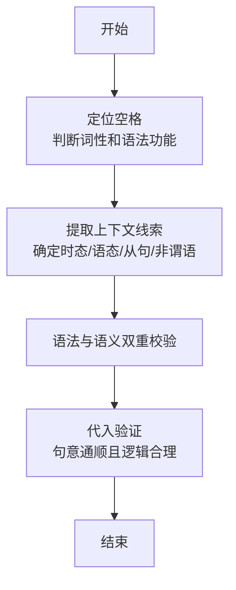
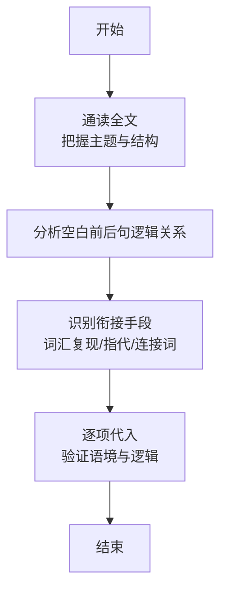
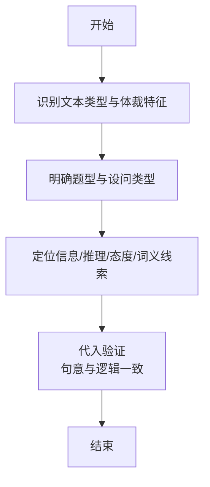
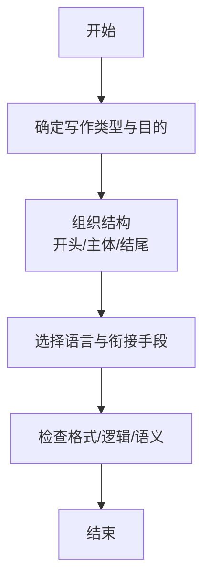
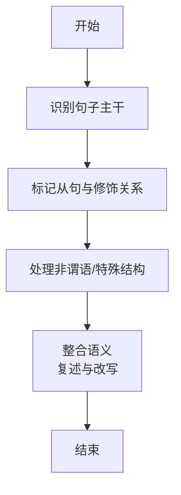
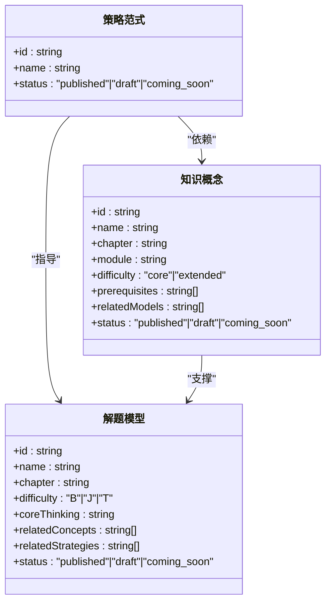
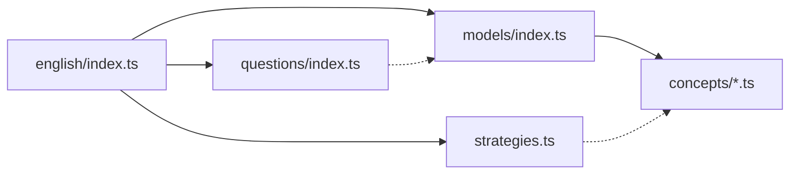

# 英语解题套路

<cite>
**本文引用的文件**
- [src/data/english/index.ts](file://src/data/english/index.ts)
- [src/data/english/strategies.ts](file://src/data/english/strategies.ts)
- [src/data/english/models/index.ts](file://src/data/english/models/index.ts)
- [src/data/english/models/M49_语法填空解题模型.ts](file://src/data/english/models/M49_语法填空解题模型.ts)
- [src/data/english/models/M50_七选五语篇衔接模型.ts](file://src/data/english/models/M50_七选五语篇衔接模型.ts)
- [src/data/english/models/M35_长难句精读模型.ts](file://src/data/english/models/M35_长难句精读模型.ts)
- [src/data/english/models/M36_书信邮件写作模型.ts](file://src/data/english/models/M36_书信邮件写作模型.ts)
- [src/data/english/models/M28_记叙文阅读模型.ts](file://src/data/english/models/M28_记叙文阅读模型.ts)
- [src/data/english/concepts/E35_语法填空解题策略.ts](file://src/data/english/concepts/E35_语法填空解题策略.ts)
- [src/data/english/concepts/E36_七选五语篇衔接策略.ts](file://src/data/english/concepts/E36_七选五语篇衔接策略.ts)
- [src/data/english/concepts/E26_长难句分析方法.ts](file://src/data/english/concepts/E26_长难句分析方法.ts)
- [src/data/english/concepts/E27a_书信与邮件写作.ts](file://src/data/english/concepts/E27a_书信与邮件写作.ts)
- [src/data/english/concepts/E24_文本类型与体裁特征.ts](file://src/data/english/concepts/E24_文本类型与体裁特征.ts)
- [src/data/english/questions/index.ts](file://src/data/english/questions/index.ts)
</cite>

## 目录
1. [引言](#引言)
2. [项目结构](#项目结构)
3. [核心组件](#核心组件)
4. [架构总览](#架构总览)
5. [详细组件分析](#详细组件分析)
6. [依赖分析](#依赖分析)
7. [性能考虑](#性能考虑)
8. [故障排查指南](#故障排查指南)
9. [结论](#结论)
10. [附录](#附录)

## 引言
本文件系统化梳理“英语解题套路（R层）”的设计与实施，面向高中英语教学与备考，覆盖阅读理解、完形填空、语法填空、写作、七选五、长难句等高频题型。文档以“套路=可复用的解题范式+配套模型”的思路，给出适用题型、解题流程、关键技巧与注意事项，并解释套路与核心模型的关系，以及如何通过套路提升解题效率与准确率。同时提供基础、进阶、挑战三级难度层次的分类体系与示例步骤，帮助学生建立可迁移的思维模型。

## 项目结构
英语学科的数据骨架采用“主题注册 + 概念/模型/策略/题库”的分层组织方式：
- 主题注册：在英语主题入口集中导出概念、模型、公式、策略、题库等数据接口，统一对外暴露。
- 概念层：定义知识点条目，标注前置要求、所属章节/模块、难度等级、关联模型与策略。
- 模型层：将“套路”具体化为“可执行的解题模型”，明确核心思维、章节归属、难度、关联概念与策略。
- 策略层：以编号化的“范式”呈现可复用的解题模板，作为模型的“方法论来源”。
- 题库层：承载题目数据与筛选维度，支撑练习与测评。

图表来源
- [src/data/english/index.ts:125-150](file://src/data/english/index.ts#L125-L150)
- [src/data/english/models/index.ts:123-221](file://src/data/english/models/index.ts#L123-L221)
- [src/data/english/strategies.ts:9-69](file://src/data/english/strategies.ts#L9-L69)
- [src/data/english/questions/index.ts:1-15](file://src/data/english/questions/index.ts#L1-L15)

章节来源
- [src/data/english/index.ts:1-150](file://src/data/english/index.ts#L1-L150)
- [src/data/english/models/index.ts:1-225](file://src/data/english/models/index.ts#L1-L225)
- [src/data/english/strategies.ts:1-77](file://src/data/english/strategies.ts#L1-L77)
- [src/data/english/questions/index.ts:1-15](file://src/data/english/questions/index.ts#L1-L15)

## 核心组件
- 主题注册与数据暴露
  - 提供概念列表/元数据、模型章节/映射、公式搜索与数据、题库筛选选项、模型-题目统计与按模型聚合等功能。
  - 关键接口：getConceptList、getConceptMeta、getModelChapters、getFormulaData、getQuestionBankData、getModelQuestionStats、getQuestionsByModel。
- 策略（范式）
  - 以编号化列表呈现“英语解题套路”，如句型识别、从句分析、阅读范式、写作范式、语法填空范式等，作为方法论来源。
- 模型（套路载体）
  - 将策略转化为可执行的“解题模型”，标注核心思维、章节、难度、关联概念与策略，形成“套路—模型—概念”的闭环。
- 概念（知识基础）
  - 定义知识点条目，标注前置要求、所属模块/章节、难度、关联模型与策略，支撑模型与策略的落地。
- 题库（训练与评估）
  - 提供题目集合、按难度/类型/目标筛选、按模型聚合统计等能力，支持练习与诊断。

章节来源
- [src/data/english/index.ts:101-150](file://src/data/english/index.ts#L101-L150)
- [src/data/english/strategies.ts:9-69](file://src/data/english/strategies.ts#L9-L69)
- [src/data/english/models/index.ts:117-121](file://src/data/english/models/index.ts#L117-L121)

## 架构总览
下图展示“主题注册”如何汇聚概念、模型、策略与题库，形成“知识—套路—训练”的闭环：

图表来源
- [src/data/english/index.ts:125-150](file://src/data/english/index.ts#L125-L150)
- [src/data/english/models/index.ts:123-221](file://src/data/english/models/index.ts#L123-L221)
- [src/data/english/strategies.ts:9-69](file://src/data/english/strategies.ts#L9-L69)
- [src/data/english/questions/index.ts:1-15](file://src/data/english/questions/index.ts#L1-L15)

## 详细组件分析

### 语法填空套路（M49 + E35）
- 适用题型
  - 高考语法填空（词形变化、虚词选择、语境补全）。
- 解题流程
  - 步骤1：定位空格，判断词性与语法功能（主语/宾语/定语/状语/补语）。
  - 步骤2：依据上下文语境，确定时态、语态、非谓语动词形式或从句引导词。
  - 步骤3：检查主谓一致、单复数、比较级/最高级、固定搭配等。
  - 步骤4：代入验证，确保句意通顺、逻辑合理。
- 关键技巧
  - 利用“策略性输入与输出”思维，先抓“输入线索”（上下文），再做“输出选择”（填空项）。
  - 结合“长难句精读”能力，拆解复杂句式，避免误判空格位置。
- 注意事项
  - 必须满足语法正确与语义合理的双重标准；避免孤立地看空格。
- 与核心模型的关系
  - 模型M49承载“语法填空解题范式”的可执行步骤；概念E35提供前置知识（基本句型、被动语态等）支撑。
- 难度层次
  - 进阶（J）：需要较强语感与语法迁移能力。

图表来源
- [src/data/english/models/M49_语法填空解题模型.ts:3-12](file://src/data/english/models/M49_语法填空解题模型.ts#L3-L12)
- [src/data/english/concepts/E35_语法填空解题策略.ts:3-13](file://src/data/english/concepts/E35_语法填空解题策略.ts#L3-L13)

章节来源
- [src/data/english/models/M49_语法填空解题模型.ts:1-12](file://src/data/english/models/M49_语法填空解题模型.ts#L1-L12)
- [src/data/english/concepts/E35_语法填空解题策略.ts:1-13](file://src/data/english/concepts/E35_语法填空解题策略.ts#L1-L13)

### 七选五语篇衔接套路（M50 + E36）
- 适用题型
  - 高考七选五（语篇衔接、逻辑关系、词汇复现与指代）。
- 解题流程
  - 步骤1：通读全文，把握主题与结构。
  - 步骤2：分析空白处前后句的逻辑关系（因果、转折、递进、并列等）。
  - 步骤3：关注词汇复现、代词指代、逻辑连接词等衔接手段。
  - 步骤4：逐项代入，验证语境一致性与逻辑连贯性。
- 关键技巧
  - “语境中的语篇分析”为核心思维，强调从整体到局部的解题视角。
  - 结合“语篇衔接链追踪”模型，建立关键词与逻辑链的映射。
- 注意事项
  - 避免仅凭个别关键词断定选项，需结合整段逻辑。
- 与核心模型的关系
  - 模型M50聚焦“语篇衔接”；概念E36提供“语篇衔接策略”的前置知识。
- 难度层次
  - 进阶（J）：对语篇整体性与衔接手段敏感度要求较高。

图表来源
- [src/data/english/models/M50_七选五语篇衔接模型.ts:3-12](file://src/data/english/models/M50_七选五语篇衔接模型.ts#L3-L12)
- [src/data/english/concepts/E36_七选五语篇衔接策略.ts:3-13](file://src/data/english/concepts/E36_七选五语篇衔接策略.ts#L3-L13)

章节来源
- [src/data/english/models/M50_七选五语篇衔接模型.ts:1-12](file://src/data/english/models/M50_七选五语篇衔接模型.ts#L1-L12)
- [src/data/english/concepts/E36_七选五语篇衔接策略.ts:1-13](file://src/data/english/concepts/E36_七选五语篇衔接策略.ts#L1-L13)

### 阅读理解套路（M28/M29/M30 + E24/E25a/E25b/E25c/E25d/E25e）
- 记叙文阅读（M28）
  - 适用题型：记叙文阅读理解。
  - 流程要点：把握人物、事件、时间线与情感脉络；关注细节定位与作者态度。
- 说明文阅读（M29）
  - 适用题型：说明文阅读理解。
  - 流程要点：识别说明对象、说明顺序与说明方法；关注信息提取与逻辑关系。
- 议论文阅读（M30）
  - 适用题型：议论文阅读理解。
  - 流程要点：识别论点、论据与论证结构；关注态度推断与推理判断。
- 关键技巧
  - “语境中的语篇分析”贯穿始终；结合“主旨概括与标题选择”“细节定位与信息比对”“推理判断与态度推断”“词义猜测”等模型。
- 注意事项
  - 不同体裁的侧重点不同，需灵活切换分析策略。
- 与核心模型的关系
  - 模型M28/M29/M30分别对应不同体裁；概念E24提供体裁与特征的基础知识。
- 难度层次
  - 基础（B）至挑战（T）不等，取决于文本长度、逻辑复杂度与设问深度。

图表来源
- [src/data/english/models/M28_记叙文阅读模型.ts:3-12](file://src/data/english/models/M28_记叙文阅读模型.ts#L3-L12)
- [src/data/english/concepts/E24_文本类型与体裁特征.ts:3-13](file://src/data/english/concepts/E24_文本类型与体裁特征.ts#L3-L13)

章节来源
- [src/data/english/models/M28_记叙文阅读模型.ts:1-12](file://src/data/english/models/M28_记叙文阅读模型.ts#L1-L12)
- [src/data/english/concepts/E24_文本类型与体裁特征.ts:1-13](file://src/data/english/concepts/E24_文本类型与体裁特征.ts#L1-L13)

### 写作套路（M36/M37/M38/M39/M40/M41/M42/M43）
- 书信/邮件写作（M36）
  - 适用题型：应用文写作（书信、邮件）。
  - 流程要点：明确写作目的、收件人与语气；组织开头、主体与结尾；注意格式与礼貌用语。
- 演讲稿/通知/倡议书写作（M37）
  - 适用题型：公告类应用文。
  - 流程要点：突出主题、结构清晰、语言得体；注意场合与受众。
- 段落展开与衔接（M38/M39）
  - 适用题型：议论文/说明文段落写作。
  - 流程要点：围绕中心句展开；使用衔接手段增强连贯性。
- 读后续写（M40/M41）
  - 适用题型：读后续写。
  - 流程要点：把握情节走向与人物性格；合理推进故事并进行语言润色。
- 概要写作（M42/M43）
  - 适用题型：概要写作。
  - 流程要点：提取关键信息；压缩语言，保持原意不变。
- 关键技巧
  - “策略性输入与输出”思维：先输入主题、结构、语言资源，再输出成文。
  - 使用“段落展开”“衔接手段运用”“语言润色”“信息提取与语言浓缩”等模型。
- 注意事项
  - 应用文需符合文体规范；议论文需逻辑严密；续写需尊重原文风格。
- 与核心模型的关系
  - 模型M36~M43覆盖多种写作类型；概念E27a提供写作基础与衔接知识支撑。
- 难度层次
  - 基础（B）至挑战（T）不等，视题材与语言要求而定。

图表来源
- [src/data/english/models/M36_书信邮件写作模型.ts:3-12](file://src/data/english/models/M36_书信邮件写作模型.ts#L3-L12)
- [src/data/english/concepts/E27a_书信与邮件写作.ts:3-13](file://src/data/english/concepts/E27a_书信与邮件写作.ts#L3-L13)

章节来源
- [src/data/english/models/M36_书信邮件写作模型.ts:1-12](file://src/data/english/models/M36_书信邮件写作模型.ts#L1-L12)
- [src/data/english/concepts/E27a_书信与邮件写作.ts:1-13](file://src/data/english/concepts/E27a_书信与邮件写作.ts#L1-L13)

### 长难句分析套路（M35 + E26）
- 适用题型
  - 各类阅读与写作中的长难句理解与改写。
- 解题流程
  - 步骤1：识别句子主干（主/谓/宾/表/定/状）。
  - 步骤2：标记从句类型与引导词，理清修饰关系。
  - 步骤3：处理非谓语动词、独立主格、with复合结构等特殊结构。
  - 步骤4：整合信息，复述句意并进行适当改写。
- 关键技巧
  - “形式-意义-用法”三维分析：先看结构形式，再析语义关系，最后考虑使用场景。
- 注意事项
  - 避免逐词直译，重视整体语义与逻辑。
- 与核心模型的关系
  - 模型M35提供长难句精读步骤；概念E26提供从句与句型的基础知识。
- 难度层次
  - 挑战（T）：适合有一定基础后强化训练。

图表来源
- [src/data/english/models/M35_长难句精读模型.ts:3-12](file://src/data/english/models/M35_长难句精读模型.ts#L3-L12)
- [src/data/english/concepts/E26_长难句分析方法.ts:3-13](file://src/data/english/concepts/E26_长难句分析方法.ts#L3-L13)

章节来源
- [src/data/english/models/M35_长难句精读模型.ts:1-12](file://src/data/english/models/M35_长难句精读模型.ts#L1-L12)
- [src/data/english/concepts/E26_长难句分析方法.ts:1-13](file://src/data/english/concepts/E26_长难句分析方法.ts#L1-L13)

### 策略与模型对照（范式—模型—概念）
- 策略（范式）
  - 以编号化“范式”呈现可复用的解题模板，如“句型识别范式”“从句分析范式”“阅读范式”“写作范式”“语法填空范式”等。
- 模型（套路）
  - 将范式转化为可执行的“解题模型”，标注核心思维、章节、难度、关联概念与策略。
- 概念（知识）
  - 为模型与策略提供前置知识与支撑，如“语法填空解题策略”“七选五语篇衔接策略”“长难句分析方法”“书信与邮件写作”“文本类型与体裁特征”。

图表来源
- [src/data/english/strategies.ts:1-77](file://src/data/english/strategies.ts#L1-L77)
- [src/data/english/models/index.ts:62-115](file://src/data/english/models/index.ts#L62-L115)
- [src/data/english/concepts/E35_语法填空解题策略.ts:3-13](file://src/data/english/concepts/E35_语法填空解题策略.ts#L3-L13)

章节来源
- [src/data/english/strategies.ts:1-77](file://src/data/english/strategies.ts#L1-L77)
- [src/data/english/models/index.ts:62-115](file://src/data/english/models/index.ts#L62-L115)
- [src/data/english/concepts/E35_语法填空解题策略.ts:1-13](file://src/data/english/concepts/E35_语法填空解题策略.ts#L1-L13)

## 依赖分析
- 组件耦合
  - 主题注册集中暴露所有数据，降低外部依赖复杂度。
  - 模型与概念之间存在双向依赖：模型依赖概念提供前置知识，概念反向指向相关模型。
  - 策略作为“方法论来源”，与模型/概念形成松耦合的三层关系。
- 外部依赖与集成点
  - 题库层提供筛选与统计能力，便于与练习/测评系统对接。
- 循环依赖
  - 当前结构未见直接循环依赖；概念与模型的相互引用通过ID映射实现。

图表来源
- [src/data/english/index.ts:125-150](file://src/data/english/index.ts#L125-L150)
- [src/data/english/models/index.ts:123-221](file://src/data/english/models/index.ts#L123-L221)
- [src/data/english/strategies.ts:9-69](file://src/data/english/strategies.ts#L9-L69)
- [src/data/english/questions/index.ts:1-15](file://src/data/english/questions/index.ts#L1-L15)

章节来源
- [src/data/english/index.ts:125-150](file://src/data/english/index.ts#L125-L150)
- [src/data/english/models/index.ts:123-221](file://src/data/english/models/index.ts#L123-L221)
- [src/data/english/strategies.ts:9-69](file://src/data/english/strategies.ts#L9-L69)
- [src/data/english/questions/index.ts:1-15](file://src/data/english/questions/index.ts#L1-L15)

## 性能考虑
- 数据加载与缓存
  - 概念/模型/策略均以Map索引存储，查询复杂度为O(1)，有利于页面渲染与交互响应。
- 分页与懒加载
  - 对于题库与模型列表，建议按章节/难度分页加载，减少首屏压力。
- 统计与筛选
  - 模型-题目统计与按模型聚合可在客户端或服务端进行，优先使用客户端缓存以提升体验。

## 故障排查指南
- 常见问题
  - 模型/概念ID缺失或重复：检查ID映射与导出一致性。
  - 题目未关联模型：确认题目字段modelId与模型ID一致。
  - 筛选维度不生效：核对题库配置项与选项映射。
- 排查步骤
  - 在主题注册处打印映射表，验证ID一致性。
  - 使用最小样例（单个模型/概念/策略）进行单元测试。
  - 对题库统计与按模型聚合函数进行边界测试（空数据、无匹配等）。

章节来源
- [src/data/english/index.ts:105-123](file://src/data/english/index.ts#L105-L123)
- [src/data/english/questions/index.ts:1-15](file://src/data/english/questions/index.ts#L1-L15)

## 结论
本“英语解题套路（R层）”以“策略—模型—概念—题库”为主线，构建了可迁移、可训练、可评估的解题体系。通过范式化的方法论与模型化的能力载体，学生可以系统掌握阅读、写作、语法填空、七选五等题型的解题步骤与思维模式；教师可据此组织教学与训练，实现高效提分与能力进阶。

## 附录
- 难度层级说明
  - 基础（B）：侧重基础语法与简单语篇，强调识别与理解。
  - 进阶（J）：强调语境分析与迁移应用，注重逻辑与衔接。
  - 挑战（T）：强调综合能力与高阶思维，注重整合与创新。
- 实施建议
  - 先概念后模型再策略，逐步深化。
  - 以题库驱动训练，以模型固化套路。
  - 定期复盘与迭代，持续优化解题流程。