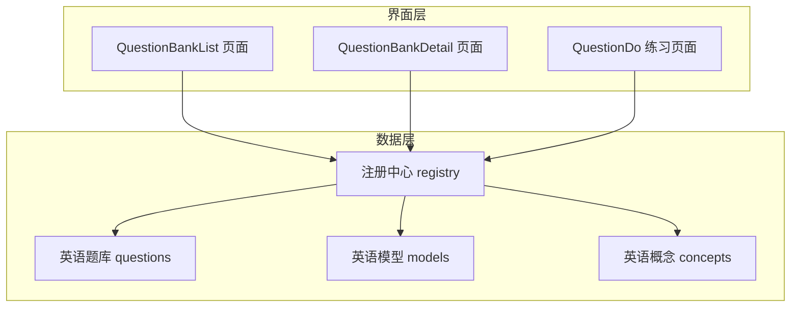
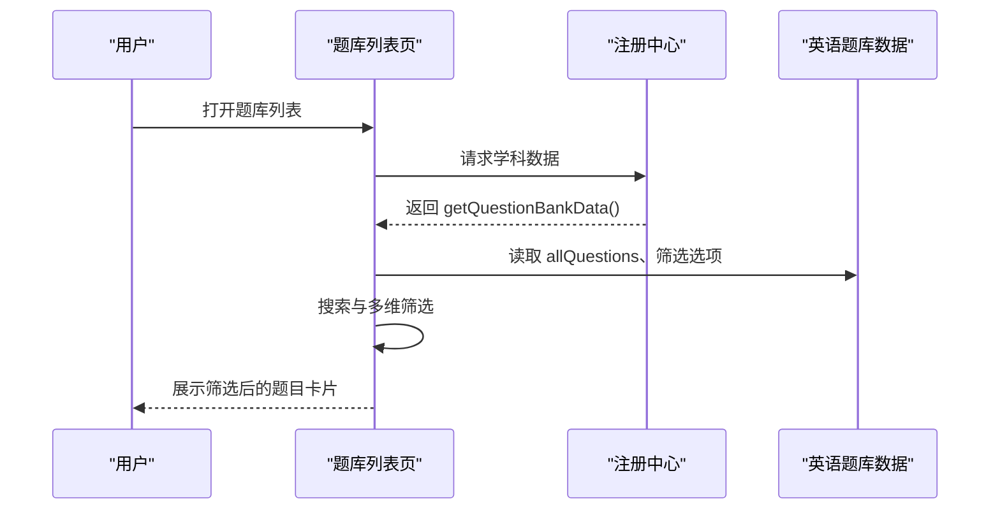
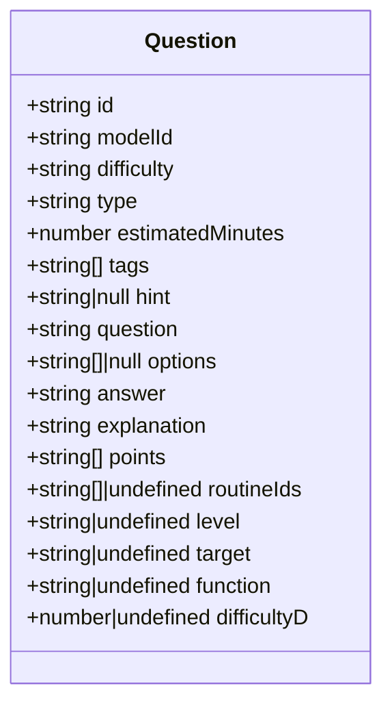
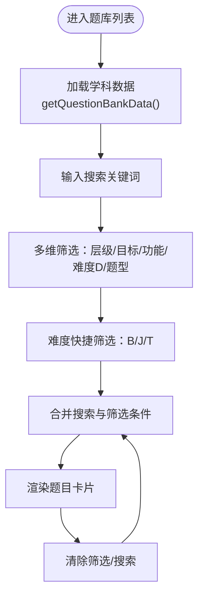
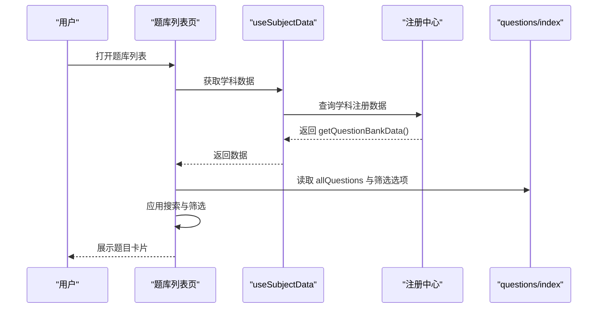
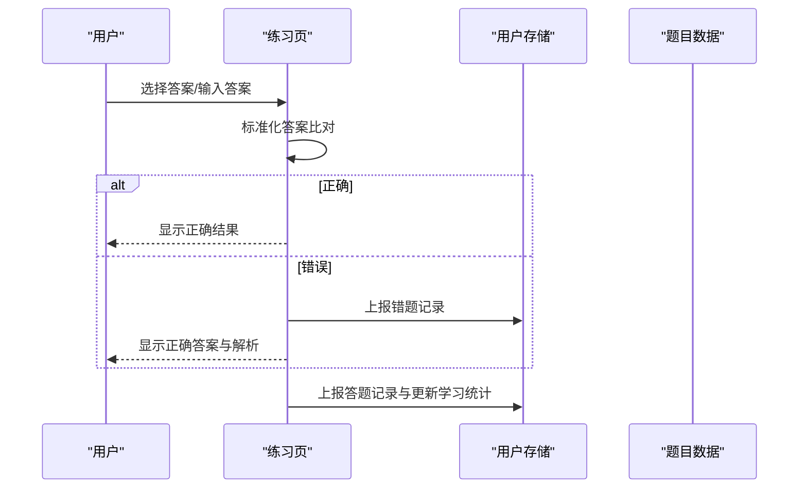
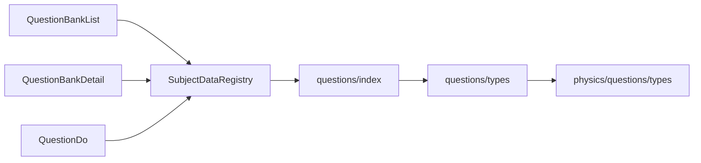

# 英语题库系统

<cite>
**本文档引用的文件**
- [src/data/english/questions/types.ts](file://src/data/english/questions/types.ts)
- [src/data/english/questions/filters.ts](file://src/data/english/questions/filters.ts)
- [src/data/english/questions/index.ts](file://src/data/english/questions/index.ts)
- [src/data/english/models/types.ts](file://src/data/english/models/types.ts)
- [src/data/english/concepts/types.ts](file://src/data/english/concepts/types.ts)
- [src/data/registry.ts](file://src/data/registry.ts)
- [src/sections/QuestionBankList.tsx](file://src/sections/QuestionBankList.tsx)
- [src/sections/QuestionBankDetail.tsx](file://src/sections/QuestionBankDetail.tsx)
- [src/sections/QuestionDo.tsx](file://src/sections/QuestionDo.tsx)
- [src/hooks/useSubjectData.ts](file://src/hooks/useSubjectData.ts)
- [src/data/physics/questions/types.ts](file://src/data/physics/questions/types.ts)
</cite>

## 目录
1. [引言](#引言)
2. [项目结构](#项目结构)
3. [核心组件](#核心组件)
4. [架构总览](#架构总览)
5. [详细组件分析](#详细组件分析)
6. [依赖分析](#依赖分析)
7. [性能考虑](#性能考虑)
8. [故障排除指南](#故障排除指南)
9. [结论](#结论)
10. [附录](#附录)

## 引言
本文件面向“英语题库系统”的P层（练习题库）设计与实现，系统性阐述英语学科题目的分类、难度分级、功能标签等组织方式；详细说明英语题目的类型分类（选择题、填空题、判断题、解答题等）结构设计；文档化难度等级（B/J/T）与学习目标（同步学习、期中期末、高考专项、竞赛拓展）的管理机制；解释题目的过滤与搜索功能（按模型、难度、类型、目标等维度的筛选）；提供题库的数据结构设计（题目ID、内容、答案、解析、模型关联等字段）；并包含题目的导入导出机制与质量控制流程建议。

## 项目结构
英语题库系统采用“学科-子域-数据层-界面层”分层组织：
- 数据层（P层）：位于 src/data/english，包含 questions、models、concepts 三个子域，分别承载题库、模型、概念数据。
- 界面层：位于 src/sections，包含题库列表、题库详情、练习页面等页面组件。
- 注册中心：通过 src/data/registry.ts 统一注册与暴露学科数据接口，供页面层按需加载与使用。
- 工具与钩子：src/hooks/useSubjectData.ts 提供学科数据加载与缓存逻辑。

图表来源
- [src/sections/QuestionBankList.tsx:1-424](file://src/sections/QuestionBankList.tsx#L1-L424)
- [src/sections/QuestionBankDetail.tsx:1-185](file://src/sections/QuestionBankDetail.tsx#L1-L185)
- [src/sections/QuestionDo.tsx:1-348](file://src/sections/QuestionDo.tsx#L1-L348)
- [src/data/registry.ts:1-52](file://src/data/registry.ts#L1-L52)
- [src/data/english/questions/index.ts:1-15](file://src/data/english/questions/index.ts#L1-L15)

章节来源
- [src/data/registry.ts:1-52](file://src/data/registry.ts#L1-L52)
- [src/sections/QuestionBankList.tsx:1-424](file://src/sections/QuestionBankList.tsx#L1-L424)
- [src/sections/QuestionBankDetail.tsx:1-185](file://src/sections/QuestionBankDetail.tsx#L1-L185)
- [src/sections/QuestionDo.tsx:1-348](file://src/sections/QuestionDo.tsx#L1-L348)

## 核心组件
- 题目数据结构（English Question Schema）
  - 字段覆盖：题目ID、所属模型ID、难度等级（B/J/T）、题型、预估时长、标签、提示、题干、选项、答案、解析、知识点关联、套路ID关联、能力层级、学习目标、题目功能、六级难度（D1-D6）。
  - 字段映射与约束：难度等级与六级难度存在映射关系（B/D2+D3，J/D4，T/D5），用于更精细的筛选与统计。
- 题目过滤与搜索（English Filters）
  - 难度等级：B（基础）、J（进阶）、T（挑战）。
  - 学习目标：同步学习、期中期末、高考专项、竞赛拓展。
  - 题目功能：巩固练习、复习检测、诊断评估、真题演练。
  - 能力层级：L1（基础）、L2（进阶）、L3（挑战）。
  - 题型：选择题、填空题、判断题、解答题。
  - 搜索：支持按题干与标签模糊检索。
- 题库数据访问（English Questions Index）
  - 提供按ID查询、按模型ID筛选题目、以及基于数组构建的Map索引，便于快速查找。
- 注册中心（SubjectDataRegistry）
  - 统一暴露学科数据接口，包括题库数据、难度标签与颜色映射、筛选选项、模型与问题统计等。
- 页面组件
  - 题库列表页：支持搜索、难度快捷筛选、多维筛选面板、筛选标签聚合与清除。
  - 题库详情页：按难度分组展示题目，支持按题型筛选。
  - 练习页：支持计时、提交校验、答案与解析展示、错题与答题记录上报。

章节来源
- [src/data/english/questions/types.ts:1-3](file://src/data/english/questions/types.ts#L1-L3)
- [src/data/english/questions/filters.ts:1-38](file://src/data/english/questions/filters.ts#L1-L38)
- [src/data/english/questions/index.ts:1-15](file://src/data/english/questions/index.ts#L1-L15)
- [src/data/registry.ts:25-34](file://src/data/registry.ts#L25-L34)
- [src/sections/QuestionBankList.tsx:69-83](file://src/sections/QuestionBankList.tsx#L69-L83)
- [src/sections/QuestionBankDetail.tsx:92-104](file://src/sections/QuestionBankDetail.tsx#L92-L104)
- [src/sections/QuestionDo.tsx:50-275](file://src/sections/QuestionDo.tsx#L50-L275)

## 架构总览
英语题库系统遵循“数据-接口-页面”三层协作：
- 数据层：questions、models、concepts 三类数据，questions 提供题库实体，models 提供模型元数据，concepts 提供知识点元数据。
- 接口层：registry.ts 定义 SubjectDataRegistry，统一暴露 getQuestionBankData、getQuestionsByModel 等方法，供页面按学科加载。
- 页面层：QuestionBankList、QuestionBankDetail、QuestionDo 三大页面，分别负责题库浏览、按模型查看、在线练习。

图表来源
- [src/sections/QuestionBankList.tsx:29-114](file://src/sections/QuestionBankList.tsx#L29-L114)
- [src/data/registry.ts:25-34](file://src/data/registry.ts#L25-L34)
- [src/data/english/questions/index.ts:1-15](file://src/data/english/questions/index.ts#L1-L15)

## 详细组件分析

### 题目数据结构设计
英语题目的数据结构以“物理题库类型定义”为模板，结合英语学科特点扩展字段，确保题库的可筛选性与可练习性。

图表来源
- [src/data/physics/questions/types.ts:4-35](file://src/data/physics/questions/types.ts#L4-L35)

章节来源
- [src/data/physics/questions/types.ts:4-35](file://src/data/physics/questions/types.ts#L4-L35)
- [src/data/english/questions/types.ts:1-3](file://src/data/english/questions/types.ts#L1-L3)

### 题目类型与结构设计
- 选择题：包含选项数组，支持标准化答案比对与交互式答题。
- 填空题：不包含选项，支持文本输入与参考答案展示。
- 判断题：可复用选择题结构或自定义类型，便于统一处理。
- 解答题：可复用填空题结构，强调解析与知识点关联。

章节来源
- [src/sections/QuestionDo.tsx:50-275](file://src/sections/QuestionDo.tsx#L50-L275)

### 难度等级与学习目标管理
- 难度等级（B/J/T）：用于用户可见的难度标识，配合六级难度（D1-D6）实现更细粒度的筛选与统计。
- 学习目标：同步学习、期中期末、高考专项、竞赛拓展，用于区分教学阶段与考试导向。
- 能力层级：L1/L2/L3，用于区分学生能力层次。
- 题目功能：巩固练习、复习检测、诊断评估、真题演练，用于区分训练目的。

章节来源
- [src/data/english/questions/filters.ts:1-38](file://src/data/english/questions/filters.ts#L1-L38)
- [src/data/registry.ts:25-34](file://src/data/registry.ts#L25-L34)

### 过滤与搜索功能
- 搜索：支持按题干与标签进行模糊匹配。
- 难度快捷筛选：按 B/J/T 一键切换。
- 多维筛选：能力层级、学习目标、题目功能、六级难度、题型。
- 筛选标签：显示当前激活的筛选项，支持逐项清除与一键清空。
- 数据访问：通过 questionDataMap 与 getQuestionsByModelId 实现快速查询。

图表来源
- [src/sections/QuestionBankList.tsx:69-100](file://src/sections/QuestionBankList.tsx#L69-L100)
- [src/data/english/questions/index.ts:5-11](file://src/data/english/questions/index.ts#L5-L11)

章节来源
- [src/sections/QuestionBankList.tsx:69-100](file://src/sections/QuestionBankList.tsx#L69-L100)
- [src/data/english/questions/index.ts:5-11](file://src/data/english/questions/index.ts#L5-L11)

### 题库数据访问与索引
- questionDataMap：基于题目数组构建的 Map，键为题目ID，值为题目对象，支持 O(1) 查找。
- getQuestionById：按ID快速获取题目。
- getQuestionsByModelId：按模型ID筛选题目，用于题库详情页按模型展示。

章节来源
- [src/data/english/questions/index.ts:5-15](file://src/data/english/questions/index.ts#L5-L15)

### 页面组件工作流

#### 题库列表页（QuestionBankList）
- 加载与展示：调用 useSubjectData 获取学科数据，渲染题目列表与筛选面板。
- 过滤逻辑：同时满足搜索关键词、难度快捷筛选、能力层级、学习目标、题目功能、六级难度、题型。
- 交互：支持展开/收起筛选面板、清除筛选、查看题目详情。

图表来源
- [src/sections/QuestionBankList.tsx:29-114](file://src/sections/QuestionBankList.tsx#L29-L114)
- [src/hooks/useSubjectData.ts:1-46](file://src/hooks/useSubjectData.ts#L1-L46)
- [src/data/registry.ts:25-34](file://src/data/registry.ts#L25-L34)
- [src/data/english/questions/index.ts:1-15](file://src/data/english/questions/index.ts#L1-L15)

章节来源
- [src/sections/QuestionBankList.tsx:29-114](file://src/sections/QuestionBankList.tsx#L29-L114)
- [src/hooks/useSubjectData.ts:1-46](file://src/hooks/useSubjectData.ts#L1-L46)

#### 题库详情页（QuestionBankDetail）
- 按模型展示：根据 modelId 从 questionsByModel 中取题，按难度分组展示。
- 题型筛选：仅展示当前模型存在的题型。
- 统计信息：显示 B/J/T 各层题目数量。

章节来源
- [src/sections/QuestionBankDetail.tsx:92-104](file://src/sections/QuestionBankDetail.tsx#L92-L104)

#### 练习页（QuestionDo）
- 计时与提交：每题显示剩余时间，提交后展示正确答案与解析，记录答题与错题。
- 标准化答案：去除LaTeX标记、反斜杠、空白字符，统一小写后比对。
- 结果反馈：正确/错误状态高亮，支持提示开关。

图表来源
- [src/sections/QuestionDo.tsx:50-275](file://src/sections/QuestionDo.tsx#L50-L275)

章节来源
- [src/sections/QuestionDo.tsx:50-275](file://src/sections/QuestionDo.tsx#L50-L275)

## 依赖分析
- 页面层依赖注册中心：QuestionBankList、QuestionBankDetail、QuestionDo 通过 useSubjectData 与注册中心交互，实现按学科动态加载。
- 数据层依赖：questions/index.ts 提供 Map 与查询函数，供页面直接使用。
- 类型复用：英语 questions/types.ts 复用物理 questions/types.ts 的 Question 接口，保证跨学科一致性。

图表来源
- [src/sections/QuestionBankList.tsx:1-424](file://src/sections/QuestionBankList.tsx#L1-L424)
- [src/sections/QuestionBankDetail.tsx:1-185](file://src/sections/QuestionBankDetail.tsx#L1-L185)
- [src/sections/QuestionDo.tsx:1-348](file://src/sections/QuestionDo.tsx#L1-L348)
- [src/data/registry.ts:1-52](file://src/data/registry.ts#L1-L52)
- [src/data/english/questions/index.ts:1-15](file://src/data/english/questions/index.ts#L1-L15)
- [src/data/english/questions/types.ts:1-3](file://src/data/english/questions/types.ts#L1-L3)
- [src/data/physics/questions/types.ts:1-35](file://src/data/physics/questions/types.ts#L1-L35)

章节来源
- [src/data/registry.ts:1-52](file://src/data/registry.ts#L1-L52)
- [src/data/english/questions/types.ts:1-3](file://src/data/english/questions/types.ts#L1-L3)
- [src/data/physics/questions/types.ts:1-35](file://src/data/physics/questions/types.ts#L1-L35)

## 性能考虑
- 数据索引：questionDataMap 使用 Map 结构，按ID查询复杂度为 O(1)，提升页面交互响应速度。
- 渲染优化：题库列表页对题目文本进行截断与清理，减少DOM节点渲染压力。
- 条件渲染：练习页仅在提交后渲染解析与知识点关联，避免不必要的计算。
- 缓存策略：通过注册中心与钩子实现按学科懒加载，减少初始包体与首屏等待。

## 故障排除指南
- 题库为空
  - 检查学科是否已注册：确认 isSubjectRegistered(subject) 返回 true。
  - 检查数据加载：useSubjectData 在未注册且可加载时会触发 loadSubjectData。
- 题目找不到
  - 确认 questionDataMap 中是否存在对应 ID。
  - 确认 getQuestionsByModelId 是否传入正确的 modelId。
- 筛选无效
  - 确认筛选条件是否与题目字段一致（如 difficulty、type、level、target、function、difficultyD）。
  - 确认搜索关键词是否与题干或标签匹配。
- 练习无法提交
  - 检查标准化答案逻辑是否正确（去除LaTeX、反斜杠、空白字符、统一小写）。
  - 确认 store 中的错题与答题记录上报是否成功。

章节来源
- [src/hooks/useSubjectData.ts:19-43](file://src/hooks/useSubjectData.ts#L19-L43)
- [src/data/english/questions/index.ts:5-15](file://src/data/english/questions/index.ts#L5-L15)
- [src/sections/QuestionBankList.tsx:69-83](file://src/sections/QuestionBankList.tsx#L69-L83)
- [src/sections/QuestionDo.tsx:17-25](file://src/sections/QuestionDo.tsx#L17-L25)

## 结论
英语题库系统通过统一的注册中心与跨学科类型复用，实现了题库数据的标准化与可扩展性；通过五维筛选与多维搜索，提升了题目的可发现性与学习效率；通过练习页的计时与反馈机制，强化了学习闭环。建议在后续迭代中完善题库导入导出与质量控制流程，持续优化性能与用户体验。

## 附录

### 数据结构字段说明
- 题目ID：唯一标识，用于索引与跳转。
- 所属模型ID：关联到具体模型，便于按模型查看与统计。
- 难度等级（B/J/T）：用户可见的难度标签。
- 题型：选择题、填空题、判断题、解答题等。
- 预估时长：分钟数，用于计时与学习规划。
- 标签：辅助检索与主题标注。
- 提示：可选提示信息，支持隐藏/显示。
- 题干：支持Markdown的题目正文。
- 选项：选择题的选项数组。
- 答案：标准答案，支持Markdown。
- 解析：题目解析，支持Markdown。
- 知识点关联：相关知识点ID列表。
- 套路ID关联：相关套路ID列表。
- 能力层级：L1/L2/L3。
- 学习目标：同步学习、期中期末、高考专项、竞赛拓展。
- 题目功能：巩固练习、复习检测、诊断评估、真题演练。
- 六级难度：D1-D6，与B/J/T存在映射关系。

章节来源
- [src/data/physics/questions/types.ts:4-35](file://src/data/physics/questions/types.ts#L4-L35)
- [src/data/english/questions/filters.ts:1-38](file://src/data/english/questions/filters.ts#L1-L38)