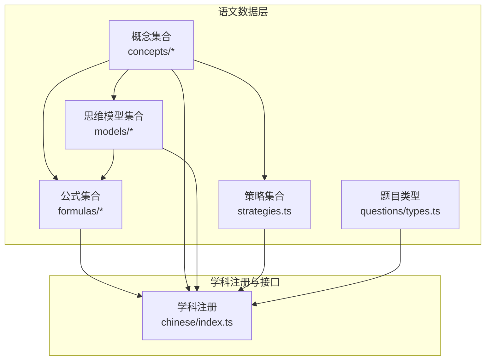
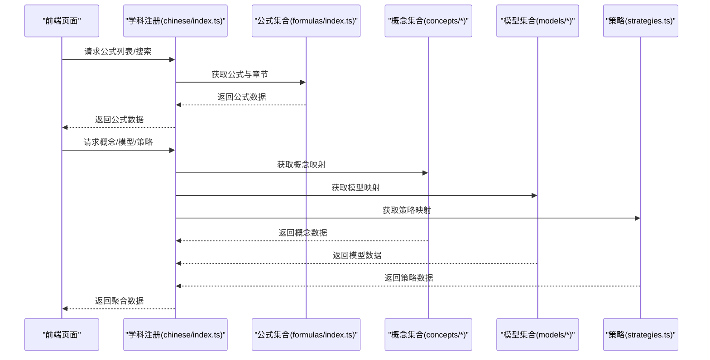
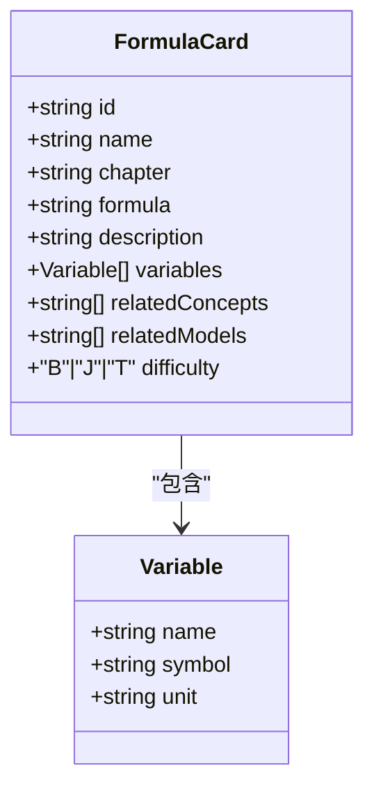
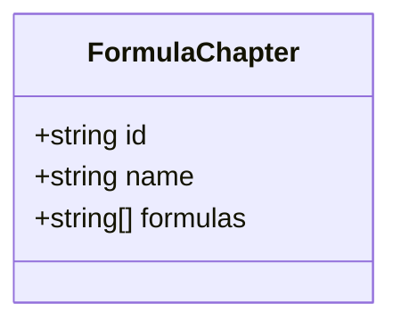
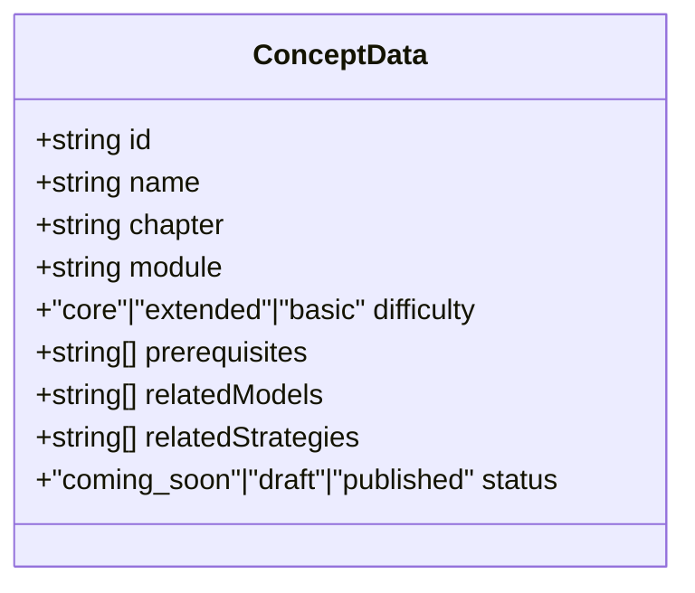
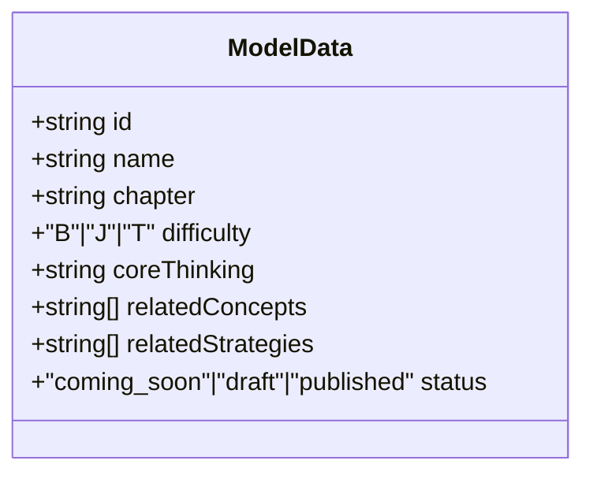
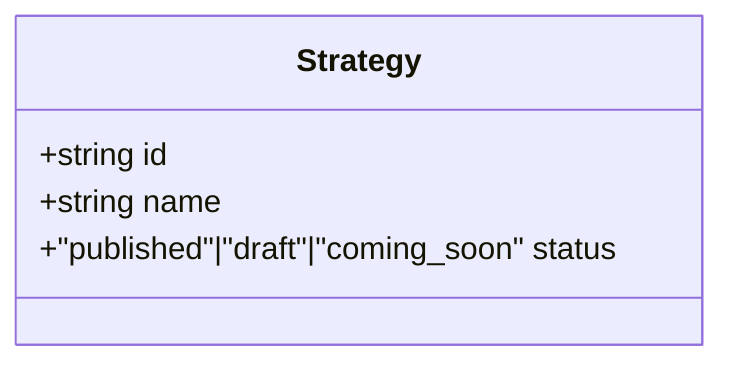
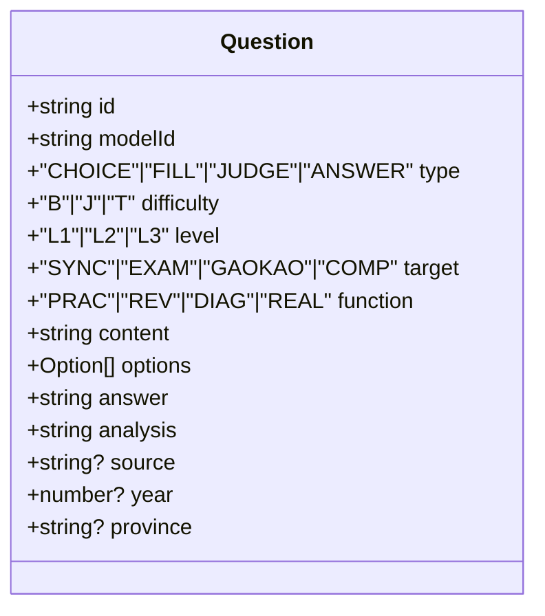
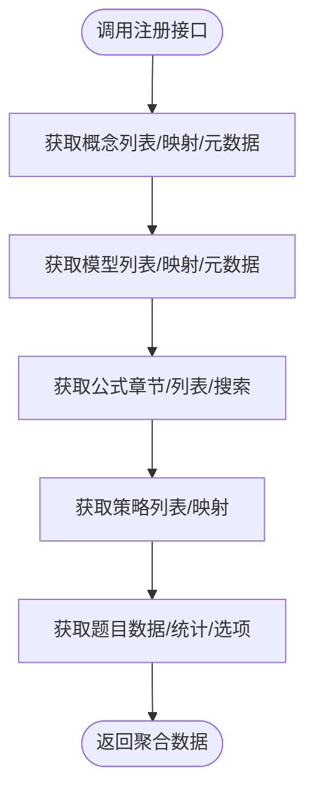
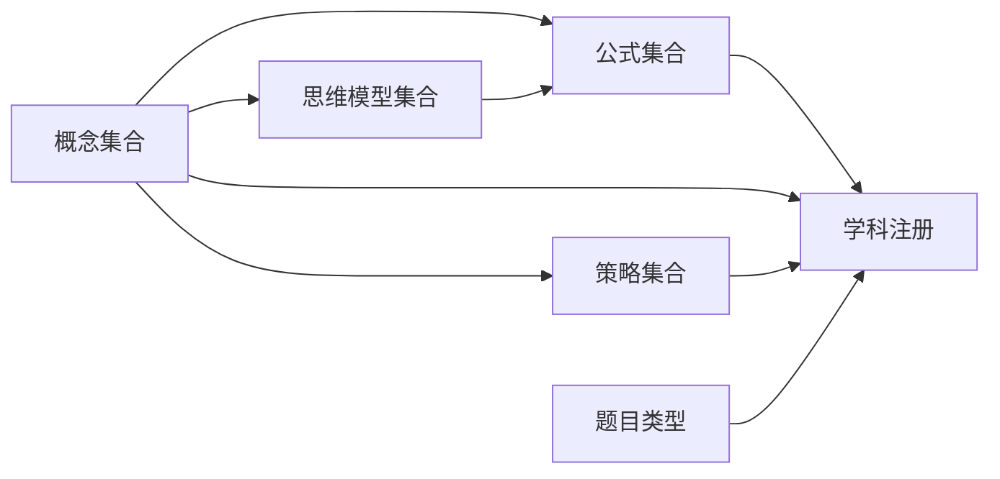

# 语文公式与知识点（F层）

<cite>
**本文引用的文件**
- [src/data/chinese/formulas/types.ts](file://src/data/chinese/formulas/types.ts)
- [src/data/chinese/formulas/index.ts](file://src/data/chinese/formulas/index.ts)
- [src/data/chinese/concepts/types.ts](file://src/data/chinese/concepts/types.ts)
- [src/data/chinese/concepts/Y01Y43.ts](file://src/data/chinese/concepts/Y01Y43.ts)
- [src/data/chinese/models/types.ts](file://src/data/chinese/models/types.ts)
- [src/data/chinese/models/C01C29.ts](file://src/data/chinese/models/C01C29.ts)
- [src/data/chinese/questions/types.ts](file://src/data/chinese/questions/types.ts)
- [src/data/chinese/strategies.ts](file://src/data/chinese/strategies.ts)
- [src/data/chinese/index.ts](file://src/data/chinese/index.ts)
</cite>

## 目录
1. [引言](#引言)
2. [项目结构](#项目结构)
3. [核心组件](#核心组件)
4. [架构总览](#架构总览)
5. [详细组件分析](#详细组件分析)
6. [依赖分析](#依赖分析)
7. [性能考虑](#性能考虑)
8. [故障排查指南](#故障排查指南)
9. [结论](#结论)
10. [附录](#附录)

## 引言
本文件系统化阐述“语文公式与知识点（F层）”的数据结构与组织方式，聚焦语文学习中的公式化知识点、记忆口诀与模板化内容。通过对语文F层（公式层）的建模，实现以下目标：
- 将语文知识抽象为可检索、可复用的“公式卡片”，覆盖文言文特殊句式、古诗词韵律与表现手法、作文写作模板等高频场景；
- 建立“概念—模型—公式—策略”的层级关联，形成从输入理解到输出表达的知识闭环；
- 提供分类体系与使用方法，帮助学习者高效掌握语文知识结构与应试策略。

## 项目结构
语文F层位于“src/data/chinese”目录下，采用按领域分层的组织方式：
- concepts：语文知识点（概念）定义与依赖关系
- models：阅读与写作的思维模型
- formulas：语文公式卡片与章节
- questions：题目数据类型
- strategies：语文学习策略清单
- index：学科注册与对外接口

**图示来源**
- [src/data/chinese/index.ts:126-151](file://src/data/chinese/index.ts#L126-L151)
- [src/data/chinese/formulas/index.ts:1-13](file://src/data/chinese/formulas/index.ts#L1-13)
- [src/data/chinese/concepts/types.ts:1-13](file://src/data/chinese/concepts/types.ts#L1-L13)
- [src/data/chinese/models/types.ts:1-10](file://src/data/chinese/models/types.ts#L1-L10)
- [src/data/chinese/strategies.ts:1-67](file://src/data/chinese/strategies.ts#L1-L67)
- [src/data/chinese/questions/types.ts:1-16](file://src/data/chinese/questions/types.ts#L1-L16)

**章节来源**
- [src/data/chinese/index.ts:1-151](file://src/data/chinese/index.ts#L1-L151)

## 核心组件
- 公式卡片（FormulaCard）：描述语文公式的核心字段，包含名称、章节、公式文本、变量、相关概念/模型、难度等级等，便于检索与教学应用。
- 公式章节（FormulaChapter）：将公式按章节组织，支持分组浏览与学习路径编排。
- 概念（ConceptData）：语文知识点条目，含前置要求、相关模型/策略、难度与状态，支撑知识网络构建。
- 思维模型（ModelData）：阅读与写作的思维模型，强调“核心思维”与难度等级，作为公式化的实践载体。
- 策略（Strategy）：语文学习方法与口诀，作为“公式化经验”的显性化表达。
- 题目类型（Question）：标准化题目结构，用于训练与测评。

**章节来源**
- [src/data/chinese/formulas/types.ts:1-17](file://src/data/chinese/formulas/types.ts#L1-L17)
- [src/data/chinese/formulas/index.ts:1-13](file://src/data/chinese/formulas/index.ts#L1-L13)
- [src/data/chinese/concepts/types.ts:1-13](file://src/data/chinese/concepts/types.ts#L1-L13)
- [src/data/chinese/models/types.ts:1-10](file://src/data/chinese/models/types.ts#L1-L10)
- [src/data/chinese/strategies.ts:1-67](file://src/data/chinese/strategies.ts#L1-L67)
- [src/data/chinese/questions/types.ts:1-16](file://src/data/chinese/questions/types.ts#L1-L16)

## 架构总览
语文F层通过“概念—模型—公式—策略—题目”的闭环，实现知识的结构化与可操作化。注册模块统一暴露查询与统计接口，支持前端页面按需加载与搜索。

**图示来源**
- [src/data/chinese/index.ts:126-151](file://src/data/chinese/index.ts#L126-L151)
- [src/data/chinese/formulas/index.ts:1-13](file://src/data/chinese/formulas/index.ts#L1-L13)

## 详细组件分析

### 组件A：语文公式卡片（FormulaCard）
- 设计要点
  - 字段覆盖：id、name、chapter、formula、description、variables、relatedConcepts、relatedModels、difficulty
  - 变量字段支持名称、符号与单位，便于模板化与迁移学习
  - relatedConcepts/relatedModels用于建立跨层级关联，支撑“从概念到公式”的知识路径
- 应用场景
  - 文言文特殊句式：以“句式模板+变量替换”快速定位与翻译
  - 古诗词韵律与表现手法：以“结构公式+效果口诀”提升鉴赏效率
  - 作文写作模板：以“结构公式+素材口诀”提升写作速度与质量
- 使用建议
  - 在“概念—模型—公式—策略”链路中，优先以概念驱动公式选择
  - 结合relatedConcepts与relatedModels进行交叉检索，避免遗漏关键知识点

**图示来源**
- [src/data/chinese/formulas/types.ts:1-17](file://src/data/chinese/formulas/types.ts#L1-L17)

**章节来源**
- [src/data/chinese/formulas/types.ts:1-17](file://src/data/chinese/formulas/types.ts#L1-L17)
- [src/data/chinese/formulas/index.ts:1-13](file://src/data/chinese/formulas/index.ts#L1-L13)

### 组件B：语文公式章节（FormulaChapter）
- 设计要点
  - 将公式按章节组织，便于教学进度与复习安排
  - 支持按章节浏览与按关键词搜索
- 使用建议
  - 与“概念—模型—公式—策略”联动：先确定概念与模型，再定位具体公式章节

**图示来源**
- [src/data/chinese/formulas/types.ts:13-17](file://src/data/chinese/formulas/types.ts#L13-L17)

**章节来源**
- [src/data/chinese/formulas/types.ts:13-17](file://src/data/chinese/formulas/types.ts#L13-L17)
- [src/data/chinese/formulas/index.ts:1-13](file://src/data/chinese/formulas/index.ts#L1-L13)

### 组件C：语文概念（ConceptData）
- 设计要点
  - 包含前置要求、相关模型/策略、难度与状态，支撑知识网络构建
  - 与公式层的relatedConcepts形成双向关联
- 分类体系
  - 模块：语言基础层、输入理解层、输出表达层、文化积淀层
  - 难度：core/extended/basic 对应 2/3/1 的数值化映射
- 示例场景
  - 文言实词、虚词、句式、翻译、内容理解、分析评价
  - 古诗词意象、语言、手法、情感与主旨
  - 语言文字运用：字音字形、词语成语、病句、衔接、表达等
  - 写作：审题立意、议论文结构、记叙文与散文写作、应用文写作
  - 文学文化常识：先秦至现当代文学、文化典故、传统思想

**图示来源**
- [src/data/chinese/concepts/types.ts:1-13](file://src/data/chinese/concepts/types.ts#L1-L13)

**章节来源**
- [src/data/chinese/concepts/types.ts:1-13](file://src/data/chinese/concepts/types.ts#L1-L13)
- [src/data/chinese/concepts/Y01Y43.ts:1-517](file://src/data/chinese/concepts/Y01Y43.ts#L1-L517)

### 组件D：语文思维模型（ModelData）
- 设计要点
  - 核心思维：如“文本细读与分层解读”“语言逻辑与修辞思维”“审美鉴赏与批判评价”“文体意识与表达规范”“思辨读写与观点建构”
  - 难度等级：B/J/T，与题目难度一致
  - 关联概念与策略，作为公式化的实践载体
- 示例场景
  - 小说叙事分析、主题解读、综合鉴赏
  - 论述类/实用类/非连续文本分析
  - 文言文基础积累、阅读理解、评价鉴赏
  - 诗歌意象语言、手法分析、主题情感
  - 语言表达应用、议论文写作、记叙文与散文写作、应用文写作
  - 文学史脉络、传统文化常识、名句名篇默写

**图示来源**
- [src/data/chinese/models/types.ts:1-10](file://src/data/chinese/models/types.ts#L1-L10)

**章节来源**
- [src/data/chinese/models/types.ts:1-10](file://src/data/chinese/models/types.ts#L1-L10)
- [src/data/chinese/models/C01C29.ts:1-320](file://src/data/chinese/models/C01C29.ts#L1-L320)

### 组件E：语文学习策略（Strategy）
- 设计要点
  - 策略编号与名称：如“人物形象多维分析法”“文言文翻译法”“议论文论证方法选择法”等
  - 与概念/模型/公式形成“经验—方法—实践”的闭环
- 使用建议
  - 将策略口诀化、模板化，便于记忆与迁移
  - 与公式层结合，形成“方法—模板—应用”的学习路径

**图示来源**
- [src/data/chinese/strategies.ts:1-67](file://src/data/chinese/strategies.ts#L1-L67)

**章节来源**
- [src/data/chinese/strategies.ts:1-67](file://src/data/chinese/strategies.ts#L1-L67)

### 组件F：题目类型（Question）
- 设计要点
  - 类型：选择、填空、判断、解答
  - 难度：B/J/T
  - 层级：L1/L2/L3
  - 目标：同步学习、期中期末、高考专项、竞赛拓展
  - 功能：巩固练习、复习检测、诊断评估、真题演练
- 价值
  - 为公式与模型提供实战训练与反馈
  - 通过统计分析优化学习路径与资源分配

**图示来源**
- [src/data/chinese/questions/types.ts:1-16](file://src/data/chinese/questions/types.ts#L1-L16)

**章节来源**
- [src/data/chinese/questions/types.ts:1-16](file://src/data/chinese/questions/types.ts#L1-L16)

### 组件G：学科注册与接口（chinese/index.ts）
- 设计要点
  - 注册语文学科，暴露概念、模型、公式、策略、题目等查询与统计接口
  - 提供难度标签与颜色映射、选项枚举等前端友好数据
- 关键能力
  - 搜索公式：按名称或章节关键词过滤
  - 统计：按模型统计题目数量
  - 图谱：生成节点与边（当前为空，预留扩展）

**图示来源**
- [src/data/chinese/index.ts:116-151](file://src/data/chinese/index.ts#L116-L151)

**章节来源**
- [src/data/chinese/index.ts:1-151](file://src/data/chinese/index.ts#L1-L151)

## 依赖分析
语文F层内部依赖关系清晰，遵循“概念—模型—公式—策略—题目”的单向依赖链，减少耦合并增强可维护性。

**图示来源**
- [src/data/chinese/index.ts:126-151](file://src/data/chinese/index.ts#L126-L151)
- [src/data/chinese/formulas/index.ts:1-13](file://src/data/chinese/formulas/index.ts#L1-L13)
- [src/data/chinese/concepts/types.ts:1-13](file://src/data/chinese/concepts/types.ts#L1-L13)
- [src/data/chinese/models/types.ts:1-10](file://src/data/chinese/models/types.ts#L1-L10)
- [src/data/chinese/strategies.ts:1-67](file://src/data/chinese/strategies.ts#L1-L67)
- [src/data/chinese/questions/types.ts:1-16](file://src/data/chinese/questions/types.ts#L1-L16)

**章节来源**
- [src/data/chinese/index.ts:126-151](file://src/data/chinese/index.ts#L126-L151)

## 性能考虑
- 数据结构
  - 使用Map进行O(1)级别的查询（公式、概念、模型、策略），降低前端渲染与交互延迟
- 搜索
  - 公式搜索基于字符串包含匹配，建议在数据量增大时引入索引或分词机制
- 渲染
  - 按章节懒加载公式与模型，减少首屏压力
- 统计
  - 题目统计按需触发，避免重复计算

## 故障排查指南
- 查询不到公式/概念/模型
  - 检查注册是否正确执行，确认Map初始化与id格式一致
  - 参考：[src/data/chinese/formulas/index.ts:7-13](file://src/data/chinese/formulas/index.ts#L7-L13)，[src/data/chinese/index.ts:126-151](file://src/data/chinese/index.ts#L126-L151)
- 搜索结果异常
  - 确认搜索函数的关键词匹配逻辑与大小写处理
  - 参考：[src/data/chinese/index.ts:51-56](file://src/data/chinese/index.ts#L51-L56)
- 题目统计不准确
  - 检查modelId字段与题目数据一致性
  - 参考：[src/data/chinese/index.ts:106-114](file://src/data/chinese/index.ts#L106-L114)
- 难度/选项显示异常
  - 核对难度映射与枚举值
  - 参考：[src/data/chinese/index.ts:69-99](file://src/data/chinese/index.ts#L69-L99)

**章节来源**
- [src/data/chinese/formulas/index.ts:7-13](file://src/data/chinese/formulas/index.ts#L7-L13)
- [src/data/chinese/index.ts:51-56](file://src/data/chinese/index.ts#L51-L56)
- [src/data/chinese/index.ts:106-114](file://src/data/chinese/index.ts#L106-L114)
- [src/data/chinese/index.ts:69-99](file://src/data/chinese/index.ts#L69-L99)

## 结论
语文F层通过“公式卡片+章节+关联关系+策略+题目”的结构化设计，将语文知识从碎片化走向模板化与可操作化。该体系既满足教学与复习的结构性需求，也为智能化学习路径与个性化推荐奠定基础。建议在后续迭代中完善公式内容、扩展策略口诀，并引入搜索与统计的性能优化。

## 附录
- 公式内容与应用场景建议
  - 文言文特殊句式：以“句式模板+变量替换+翻译口诀”组织，便于快速定位与互译
  - 古诗词韵律与表现手法：以“结构公式+效果口诀+情感归纳”组织，提升鉴赏效率
  - 作文写作模板：以“审题立意—结构布局—素材运用—语言润色”的公式化流程组织
- 分类体系与使用方法
  - 按模块与难度分级：语言基础层、输入理解层、输出表达层、文化积淀层；难度B/J/T
  - 使用方法：先概念后模型，再公式与策略，最后题目训练与反馈
- 实际应用指导
  - 建议将策略口诀与公式模板结合，形成“经验—方法—实践”的闭环
  - 利用搜索与统计接口，构建个人错题与薄弱环节的可视化看板