# 语文学科数据结构

<cite>
**本文引用的文件**
- [src/data/chinese/index.ts](file://src/data/chinese/index.ts)
- [src/data/chinese/concepts/types.ts](file://src/data/chinese/concepts/types.ts)
- [src/data/chinese/models/types.ts](file://src/data/chinese/models/types.ts)
- [src/data/chinese/questions/types.ts](file://src/data/chinese/questions/types.ts)
- [src/data/chinese/strategies.ts](file://src/data/chinese/strategies.ts)
- [src/data/chinese/concepts/Y01Y43.ts](file://src/data/chinese/concepts/Y01Y43.ts)
- [src/data/chinese/models/C01C29.ts](file://src/data/chinese/models/C01C29.ts)
- [src/data/chinese/questions/filters.ts](file://src/data/chinese/questions/filters.ts)
- [src/data/registry.ts](file://src/data/registry.ts)
- [src/data/chinese/concepts/index.ts](file://src/data/chinese/concepts/index.ts)
- [src/data/chinese/models/index.ts](file://src/data/chinese/models/index.ts)
- [src/data/chinese/questions/index.ts](file://src/data/chinese/questions/index.ts)
</cite>

## 目录
1. [引言](#引言)
2. [项目结构](#项目结构)
3. [核心组件](#核心组件)
4. [架构总览](#架构总览)
5. [详细组件分析](#详细组件分析)
6. [依赖分析](#依赖分析)
7. [性能考虑](#性能考虑)
8. [故障排查指南](#故障排查指南)
9. [结论](#结论)
10. [附录](#附录)

## 引言
本文件系统化梳理语文学科的数据结构与知识组织，围绕K层（知识节点）、M层（核心模型）、R层（解题套路）、P层（练习题库）四个层次，结合语文模块（现代文阅读、古代诗文、语言文字运用、写作、文学文化常识），完整呈现知识点、能力培养路径、模型实现与题库组织方式。同时阐明文化传承性与教育价值在数据结构中的体现。

## 项目结构
语文学科数据位于 src/data/chinese 目录下，采用“概念-模型-策略-题库”的分层组织，配合统一注册机制对外暴露查询接口。核心目录与职责如下：
- concepts：知识点（K层）定义与章节划分
- models：核心模型（M层）定义与章节划分
- strategies：解题套路（R层）清单与映射
- questions：题库（P层）数据与筛选配置
- index.ts：学科数据注册与对外接口聚合
- registry.ts：学科数据注册表接口契约

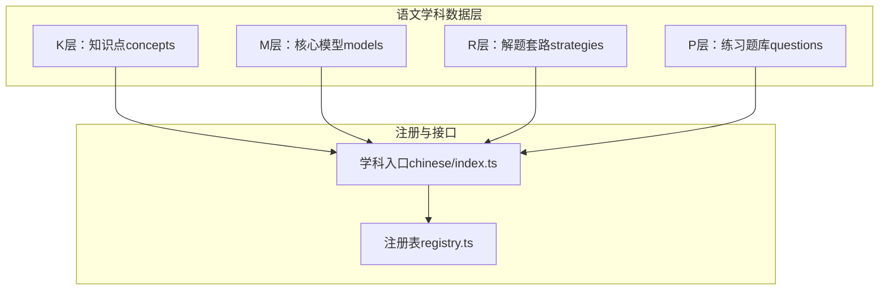

**图示来源**
- [src/data/chinese/index.ts:126-151](file://src/data/chinese/index.ts#L126-L151)
- [src/data/registry.ts:4-52](file://src/data/registry.ts#L4-L52)

**章节来源**
- [src/data/chinese/index.ts:1-151](file://src/data/chinese/index.ts#L1-L151)
- [src/data/registry.ts:1-52](file://src/data/registry.ts#L1-L52)

## 核心组件
- K层（知识点）：以 ConceptData 为数据载体，包含知识点ID、名称、所属章节与模块、难度、前置知识、关联模型与策略、状态等字段，支持按章节分组与ID映射查询。
- M层（核心模型）：以 ModelData 为数据载体，包含模型ID、名称、所属章节、难度等级、核心思维、关联知识点与策略、状态等字段，支持按章节分组与ID映射查询。
- R层（解题套路）：以 Strategy 为数据载体，包含套路ID、名称、状态，提供全局列表与ID映射查询。
- P层（练习题库）：以 Question 为数据载体，包含题目ID、所属模型、题型、难度、层级、目标、功能、内容、选项、答案、解析、来源等字段，提供筛选配置与按模型分组查询。

**章节来源**
- [src/data/chinese/concepts/types.ts:1-13](file://src/data/chinese/concepts/types.ts#L1-L13)
- [src/data/chinese/models/types.ts:1-10](file://src/data/chinese/models/types.ts#L1-L10)
- [src/data/chinese/questions/types.ts:1-16](file://src/data/chinese/questions/types.ts#L1-L16)
- [src/data/chinese/strategies.ts:1-67](file://src/data/chinese/strategies.ts#L1-L67)

## 架构总览
语文学科数据通过注册表统一对外暴露查询接口，包括：
- 知识点：列表、数据映射、ID集合、元数据查询
- 模型：章节分组、数据映射、ID集合
- 公式：章节、公式列表、检索
- 套路：列表、数据映射
- 题库：题目集合、难度/层级/目标/功能/题型配置、按模型统计与分组

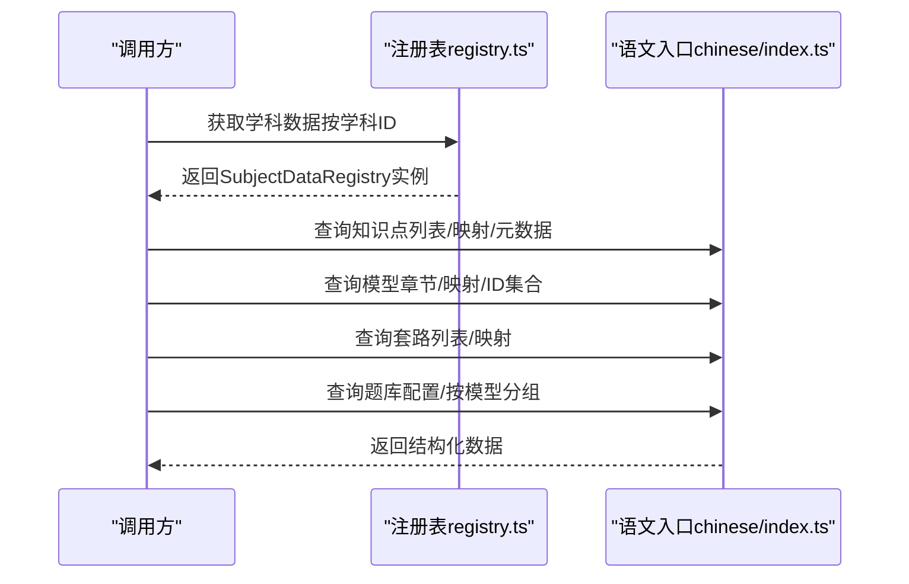

**图示来源**
- [src/data/registry.ts:40-52](file://src/data/registry.ts#L40-L52)
- [src/data/chinese/index.ts:126-151](file://src/data/chinese/index.ts#L126-L151)

**章节来源**
- [src/data/registry.ts:4-52](file://src/data/registry.ts#L4-L52)
- [src/data/chinese/index.ts:1-151](file://src/data/chinese/index.ts#L1-L151)

## 详细组件分析

### K层（知识点）数据结构与组织
- 数据结构：ConceptData
  - 关键字段：id、name、chapter、module、difficulty、prerequisites、relatedModels、relatedStrategies、status
- 组织方式：
  - 按模块与章节分组（如“现代文阅读·文学类文本”、“古代诗文·文言文”等）
  - 提供ID到概念对象的映射，支持按ID查询与批量ID集合
- 知识点示例与模块分布：
  - 现代文阅读·文学类文本：小说三要素、人物形象、叙事视角、情节结构、主题意蕴、阅读综合
  - 现代文阅读·实用类文本：信息筛选、论述类文本、实用类文本、非连续文本
  - 古代诗文·文言文：实词、虚词、句式、翻译、内容理解、分析评价
  - 古代诗文·古诗鉴赏：意象意境、语言鉴赏、表现手法、主题情感、比较鉴赏、现代诗歌阅读
  - 语言文字运用：字音字形、词语成语、病句修改、句子衔接、修辞辨析、语言表达、图文转换、仿写压缩
  - 写作：审题立意、议论文论点/论据/论证/结构、记叙文/散文/应用文写作、材料分析、思辨写作
  - 文学文化常识：先秦至现当代文学、古代文化常识、传统文化思想、名句名篇默写

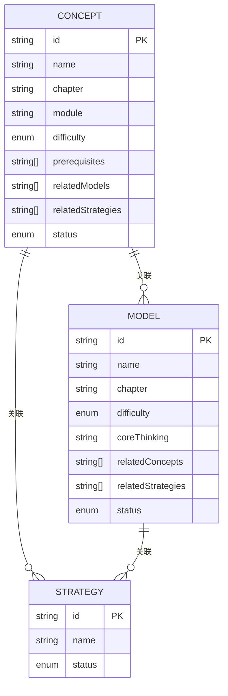

**图示来源**
- [src/data/chinese/concepts/types.ts:1-13](file://src/data/chinese/concepts/types.ts#L1-L13)
- [src/data/chinese/models/types.ts:1-10](file://src/data/chinese/models/types.ts#L1-L10)
- [src/data/chinese/strategies.ts:1-67](file://src/data/chinese/strategies.ts#L1-L67)

**章节来源**
- [src/data/chinese/concepts/index.ts:1-138](file://src/data/chinese/concepts/index.ts#L1-L138)
- [src/data/chinese/concepts/Y01Y43.ts:1-517](file://src/data/chinese/concepts/Y01Y43.ts#L1-L517)

### M层（核心模型）数据结构与组织
- 数据结构：ModelData
  - 关键字段：id、name、chapter、difficulty、coreThinking、relatedConcepts、relatedStrategies、status
- 组织方式：
  - 按章节分组（如“现代文阅读·文学类文本”、“古代诗文·文言文”等）
  - 提供ID到模型对象的映射，支持按ID查询与批量ID集合
- 模型示例与能力路径：
  - 阅读理解：小说叙事分析、主题解读、综合鉴赏；散文阅读分析；论述类/实用类/非连续文本分析
  - 文言文：基础积累、阅读理解、评价鉴赏
  - 古诗鉴赏：意象语言、手法分析、主题情感、比较鉴赏、现代诗歌阅读
  - 语言文字运用：字词成语辨析、病句衔接辨析、语言表达应用
  - 写作：立论、论据、论证、升格、记叙文/散文/应用文写作、材料分析、思辨写作
  - 文学文化常识：文学史脉络、传统文化常识、名句名篇默写

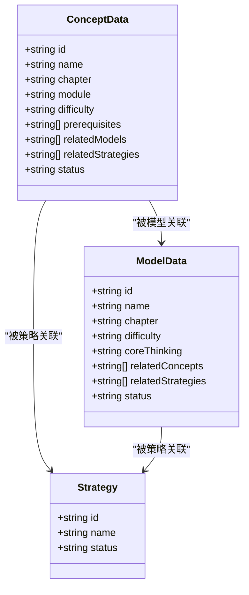

**图示来源**
- [src/data/chinese/concepts/types.ts:1-13](file://src/data/chinese/concepts/types.ts#L1-L13)
- [src/data/chinese/models/types.ts:1-10](file://src/data/chinese/models/types.ts#L1-L10)
- [src/data/chinese/strategies.ts:1-67](file://src/data/chinese/strategies.ts#L1-L67)

**章节来源**
- [src/data/chinese/models/index.ts:1-112](file://src/data/chinese/models/index.ts#L1-L112)
- [src/data/chinese/models/C01C29.ts:1-320](file://src/data/chinese/models/C01C29.ts#L1-L320)

### R层（解题套路）数据结构与组织
- 数据结构：Strategy
  - 关键字段：id、name、status
- 组织方式：
  - 全局策略列表（如人物形象多维分析法、叙事结构追踪法、文言文翻译法、诗歌鉴赏法、议论文论证链构建法等）
  - ID到策略对象的映射，支持按ID查询
- 套路覆盖领域：
  - 现代文阅读：人物分析、叙事结构、环境描写、主题提炼、散文线索与情感、图表信息提取等
  - 文言文：实词/虚词/句式/翻译/内容概括/人物事件分析/比较鉴赏等
  - 古诗鉴赏：意象意境、炼字、手法辨识与效果评价、比较鉴赏等
  - 语言文字运用：成语语境辨析、病句诊断、句子连贯、表达得体、仿写扩展压缩等
  - 写作：审题立意、分论点结构、论据加工、论证方法选择、逻辑链条、思辨写作、应用文格式等
  - 非连续文本：信息角度比较、跨材料整合等

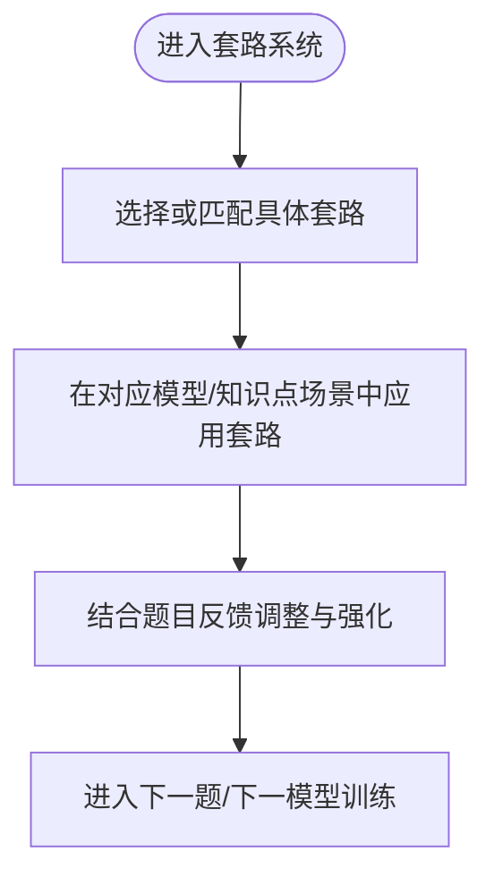

**图示来源**
- [src/data/chinese/strategies.ts:1-67](file://src/data/chinese/strategies.ts#L1-L67)

**章节来源**
- [src/data/chinese/strategies.ts:1-67](file://src/data/chinese/strategies.ts#L1-L67)

### P层（练习题库）数据结构与筛选
- 数据结构：Question
  - 关键字段：id、modelId、type、difficulty、level、target、function、content、options、answer、analysis、source、year、province
- 筛选维度：
  - 难度：B（基础）、J（进阶）、T（挑战）
  - 层级：L1（基础）、L2（进阶）、L3（挑战）
  - 目标：同步学习、期中期末、高考专项、竞赛拓展
  - 功能：巩固练习、复习检测、诊断评估、真题演练
  - 题型：选择题、填空题、判断题、解答题
- 组织方式：
  - 提供题库配置（难度标签/颜色、选项枚举等）
  - 支持按模型ID分组题目
  - 支持按模型统计题目数量

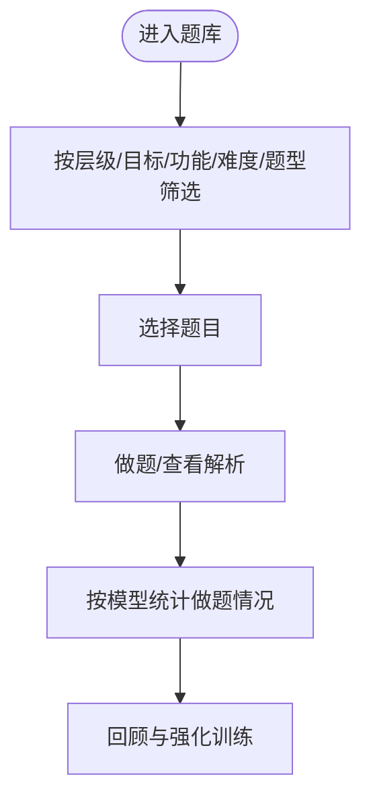

**图示来源**
- [src/data/chinese/questions/types.ts:1-16](file://src/data/chinese/questions/types.ts#L1-L16)
- [src/data/chinese/questions/filters.ts:1-38](file://src/data/chinese/questions/filters.ts#L1-L38)
- [src/data/chinese/questions/index.ts:1-15](file://src/data/chinese/questions/index.ts#L1-L15)

**章节来源**
- [src/data/chinese/questions/types.ts:1-16](file://src/data/chinese/questions/types.ts#L1-L16)
- [src/data/chinese/questions/filters.ts:1-38](file://src/data/chinese/questions/filters.ts#L1-L38)
- [src/data/chinese/questions/index.ts:1-15](file://src/data/chinese/questions/index.ts#L1-L15)

### 语文模块的知识组织与能力培养路径
- 现代文阅读
  - 文学类文本：从“三要素—人物—叙事—情节—主题”逐层推进，最终综合鉴赏，形成“文本细读—分层解读—审美评价”的能力闭环。
  - 实用类文本：从“信息筛选—论述/实用/非连续文本”逐步提升逻辑与整合能力。
- 古代诗文
  - 文言文：从“实词/虚词/句式”基础积累，到“翻译—内容理解—分析评价”，强调文化理解与语境还原。
  - 古诗鉴赏：从“意象意境—语言炼字—表现手法—主题情感—比较鉴赏”，形成审美与批判评价能力。
- 语言文字运用
  - 从“字词成语—病句修改—句子衔接—修辞辨析—语言表达—图文转换—仿写压缩”，构建语言运用与表达规范能力。
- 写作
  - 从“审题立意—议论文论点/论据/论证/结构—记叙文/散文/应用文—材料分析—思辨写作”，形成“观点建构—逻辑表达—文体规范”的综合写作能力。
- 文学文化常识
  - 从“先秦至现当代文学—古代文化常识—传统文化思想—名句名篇默写”，建立文化积淀与语境还原能力。

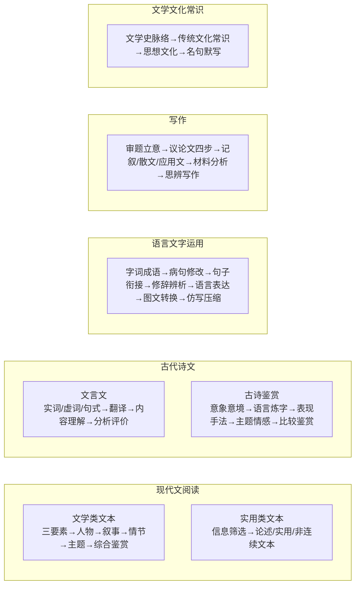

**图示来源**
- [src/data/chinese/concepts/Y01Y43.ts:1-517](file://src/data/chinese/concepts/Y01Y43.ts#L1-L517)
- [src/data/chinese/models/C01C29.ts:1-320](file://src/data/chinese/models/C01C29.ts#L1-L320)

**章节来源**
- [src/data/chinese/concepts/Y01Y43.ts:1-517](file://src/data/chinese/concepts/Y01Y43.ts#L1-L517)
- [src/data/chinese/models/C01C29.ts:1-320](file://src/data/chinese/models/C01C29.ts#L1-L320)

### 语文核心模型实现方式
- 阅读理解模型
  - 小说叙事分析：强调“文本细读与分层解读”，贯穿人物、叙事、情节、主题与综合鉴赏。
  - 论述/实用/非连续文本：强调“语言逻辑与修辞思维”，侧重信息筛选与整合。
- 文言文模型
  - 基础积累：强调“语言逻辑与修辞思维”，夯实实词、虚词、句式。
  - 阅读理解与评价鉴赏：强调“文化理解与语境还原”，提升深度理解与批判评价。
- 古诗鉴赏模型
  - 意象语言、手法分析、主题情感、比较鉴赏、现代诗歌阅读：强调“文本细读与分层解读”“语言逻辑与修辞思维”“审美鉴赏与批判评价”的多维融合。
- 语言文字运用模型
  - 字词成语辨析、病句衔接辨析、语言表达应用：强调“语言逻辑与修辞思维”“文体意识与表达规范”。
- 写作模型
  - 立论、论据、论证、升格、记叙文/散文/应用文、材料分析、思辨写作：强调“思辨读写与观点建构”“文体意识与表达规范”。

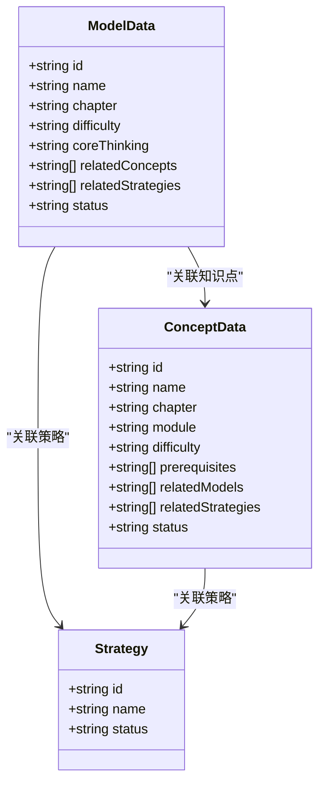

**图示来源**
- [src/data/chinese/models/types.ts:1-10](file://src/data/chinese/models/types.ts#L1-L10)
- [src/data/chinese/concepts/types.ts:1-13](file://src/data/chinese/concepts/types.ts#L1-L13)
- [src/data/chinese/strategies.ts:1-67](file://src/data/chinese/strategies.ts#L1-L67)

**章节来源**
- [src/data/chinese/models/C01C29.ts:1-320](file://src/data/chinese/models/C01C29.ts#L1-L320)

### 语文题库按文体、难度、考点的组织方式
- 文体组织：按现代文阅读（文学类/实用类）、古代诗文（文言文/古诗鉴赏）、语言文字运用、写作、文学文化常识分章组织。
- 难度与层级：B/J/T与L1/L2/L3双维度标注，便于分层教学与个性化练习。
- 目标与功能：同步学习、期中期末、高考专项、竞赛拓展；巩固练习、复习检测、诊断评估、真题演练。
- 考点映射：每道题绑定模型ID，实现“题—模—知—套”的多维关联，支持按模型统计与分组。

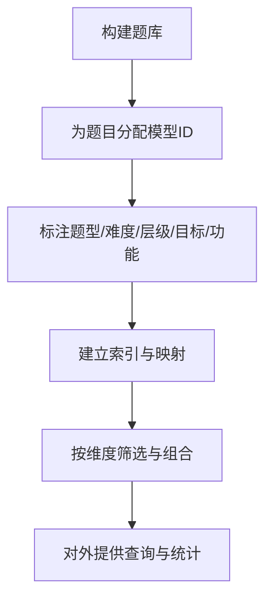

**图示来源**
- [src/data/chinese/questions/types.ts:1-16](file://src/data/chinese/questions/types.ts#L1-L16)
- [src/data/chinese/questions/filters.ts:1-38](file://src/data/chinese/questions/filters.ts#L1-L38)
- [src/data/chinese/questions/index.ts:1-15](file://src/data/chinese/questions/index.ts#L1-L15)

**章节来源**
- [src/data/chinese/questions/index.ts:1-15](file://src/data/chinese/questions/index.ts#L1-L15)
- [src/data/chinese/questions/filters.ts:1-38](file://src/data/chinese/questions/filters.ts#L1-L38)

### 语文知识的关联网络构建
- 知识点（K）与模型（M）：知识点作为模型的“输入”，模型作为知识点的“输出能力”，二者通过ID数组双向关联。
- 知识点（K）与套路（R）：知识点作为套路的应用场景，套路作为知识点的解题工具。
- 模型（M）与套路（R）：模型承载核心思维，套路提供可迁移的解题方法。
- 题目（P）与模型（M）：题目服务于模型训练与评估，支持按模型统计与分组。

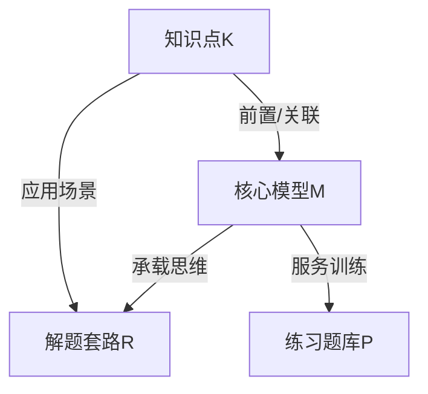

**图示来源**
- [src/data/chinese/concepts/types.ts:1-13](file://src/data/chinese/concepts/types.ts#L1-L13)
- [src/data/chinese/models/types.ts:1-10](file://src/data/chinese/models/types.ts#L1-L10)
- [src/data/chinese/strategies.ts:1-67](file://src/data/chinese/strategies.ts#L1-L67)
- [src/data/chinese/questions/types.ts:1-16](file://src/data/chinese/questions/types.ts#L1-L16)

**章节来源**
- [src/data/chinese/concepts/types.ts:1-13](file://src/data/chinese/concepts/types.ts#L1-L13)
- [src/data/chinese/models/types.ts:1-10](file://src/data/chinese/models/types.ts#L1-L10)
- [src/data/chinese/strategies.ts:1-67](file://src/data/chinese/strategies.ts#L1-L67)
- [src/data/chinese/questions/types.ts:1-16](file://src/data/chinese/questions/types.ts#L1-L16)

## 依赖分析
- 注册表接口契约（SubjectDataRegistry）定义了学科数据对外暴露的标准方法，确保不同学科（语文、数学、物理、英语等）以一致的方式提供数据。
- 语文入口（chinese/index.ts）实现注册表接口，聚合K/M/R/P四层数据，提供统一查询与统计能力。
- 各层内部通过ID映射与分组组织，降低耦合，提高可维护性与可扩展性。

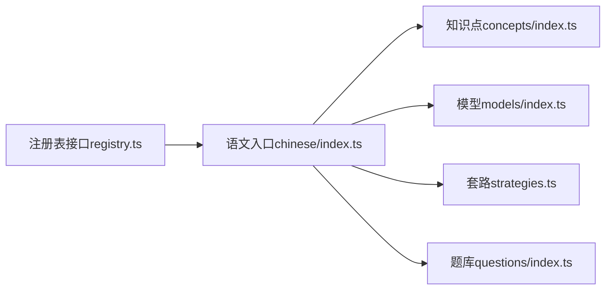

**图示来源**
- [src/data/registry.ts:4-52](file://src/data/registry.ts#L4-L52)
- [src/data/chinese/index.ts:1-151](file://src/data/chinese/index.ts#L1-L151)
- [src/data/chinese/concepts/index.ts:1-138](file://src/data/chinese/concepts/index.ts#L1-L138)
- [src/data/chinese/models/index.ts:1-112](file://src/data/chinese/models/index.ts#L1-L112)
- [src/data/chinese/strategies.ts:1-67](file://src/data/chinese/strategies.ts#L1-L67)
- [src/data/chinese/questions/index.ts:1-15](file://src/data/chinese/questions/index.ts#L1-L15)

**章节来源**
- [src/data/registry.ts:4-52](file://src/data/registry.ts#L4-L52)
- [src/data/chinese/index.ts:1-151](file://src/data/chinese/index.ts#L1-L151)

## 性能考虑
- 数据结构采用Map与数组，查询与分组操作时间复杂度低，适合前端运行时使用。
- 分层组织与ID映射减少跨模块查找成本，有利于按需加载与懒加载优化。
- 题库按模型分组与统计，便于实现“错题强化”“薄弱点突破”等个性化学习路径。

## 故障排查指南
- 知识点/模型/策略/题目的ID缺失或重复：检查各层index.ts中的ID定义与映射。
- 关联关系不一致：核对知识点与模型的relatedConcepts/relatedModels、知识点与策略的relatedStrategies、题目与模型的modelId。
- 筛选参数无效：确认题库filters.ts中的选项枚举与实际数据是否一致。
- 注册失败：确认chinese/index.ts中registerSubject调用与registry.ts接口契约一致。

**章节来源**
- [src/data/chinese/concepts/index.ts:1-138](file://src/data/chinese/concepts/index.ts#L1-L138)
- [src/data/chinese/models/index.ts:1-112](file://src/data/chinese/models/index.ts#L1-L112)
- [src/data/chinese/strategies.ts:1-67](file://src/data/chinese/strategies.ts#L1-L67)
- [src/data/chinese/questions/index.ts:1-15](file://src/data/chinese/questions/index.ts#L1-L15)
- [src/data/chinese/questions/filters.ts:1-38](file://src/data/chinese/questions/filters.ts#L1-L38)
- [src/data/chinese/index.ts:126-151](file://src/data/chinese/index.ts#L126-L151)
- [src/data/registry.ts:4-52](file://src/data/registry.ts#L4-L52)

## 结论
本语文学科数据结构以K/M/R/P四层为核心，通过概念-模型-策略-题库的有机联动，构建了从知识到能力再到实践的完整路径。模块化与分层组织体现了文化传承与教育价值：既强调语言文字的基础积累与文化理解，又注重思维能力与表达规范的协同提升，最终服务于学生语文素养的整体发展。

## 附录
- 术语说明
  - K层：知识点（Knowledge）
  - M层：核心模型（Model）
  - R层：解题套路（Paradigm/Strategy）
  - P层：练习题库（Practice）
- 数据来源
  - 知识点与模型：concepts/Y01Y43.ts、models/C01C29.ts
  - 套路：strategies.ts
  - 题库：questions/index.ts、questions/filters.ts
  - 注册与接口：registry.ts、chinese/index.ts