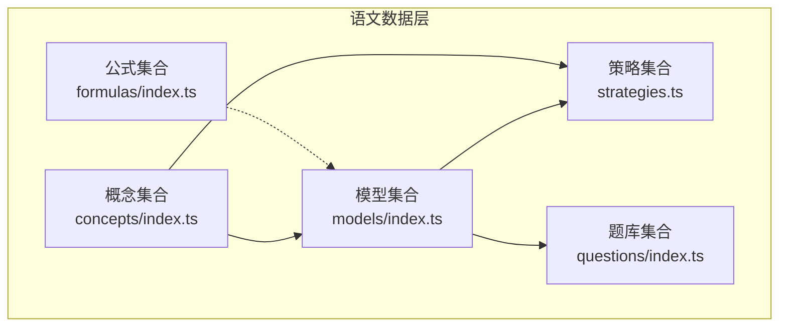
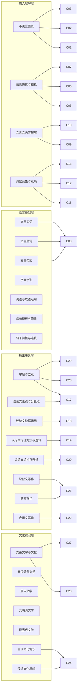
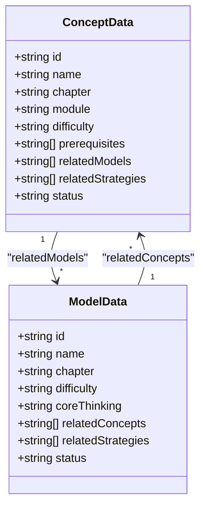
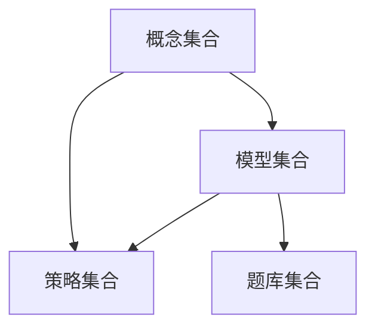

# 语文核心模型（M层）

<cite>
**本文引用的文件**
- [src/data/chinese/models/types.ts](file://src/data/chinese/models/types.ts)
- [src/data/chinese/models/index.ts](file://src/data/chinese/models/index.ts)
- [src/data/chinese/models/C01C29.ts](file://src/data/chinese/models/C01C29.ts)
- [src/data/chinese/concepts/types.ts](file://src/data/chinese/concepts/types.ts)
- [src/data/chinese/concepts/index.ts](file://src/data/chinese/concepts/index.ts)
- [src/data/chinese/concepts/Y01Y43.ts](file://src/data/chinese/concepts/Y01Y43.ts)
- [src/data/chinese/strategies.ts](file://src/data/chinese/strategies.ts)
- [src/data/chinese/questions/filters.ts](file://src/data/chinese/questions/filters.ts)
- [src/data/chinese/questions/types.ts](file://src/data/chinese/questions/types.ts)
- [src/data/chinese/index.ts](file://src/data/chinese/index.ts)
- [src/data/chinese/formulas/index.ts](file://src/data/chinese/formulas/index.ts)
- [src/data/chinese/questions/index.ts](file://src/data/chinese/questions/index.ts)
</cite>

## 目录
1. [引言](#引言)
2. [项目结构](#项目结构)
3. [核心组件](#核心组件)
4. [架构总览](#架构总览)
5. [详细组件分析](#详细组件分析)
6. [依赖分析](#依赖分析)
7. [性能考虑](#性能考虑)
8. [故障排查指南](#故障排查指南)
9. [结论](#结论)
10. [附录](#附录)

## 引言
本文件系统化梳理语文“核心模型（M层）”的数据结构与组织方式，覆盖现代文阅读理解模型、文言文阅读模型、古诗词鉴赏模型、写作技巧模型、语言文字运用模型以及文学文化常识模型。文档重点阐述：
- 模型与概念（知识点）的双向映射关系
- 模型的难度层级、核心思维、关联概念与策略
- 模型在教学中的应用场景与使用方法
- 模型间的组合与递进关系
- 数据结构示例与实际应用建议

## 项目结构
语文数据层采用“概念-模型-策略-题目”的分层组织，核心位于 src/data/chinese 目录下，包含：
- concepts：知识点（概念）定义与章节组织
- models：核心模型定义与章节组织
- strategies：解题/学习范式（策略）
- questions：题库数据与筛选配置
- formulas：公式卡片（当前为空）
- index.ts：对外注册与查询接口

图示来源
- [src/data/chinese/concepts/index.ts:1-138](file://src/data/chinese/concepts/index.ts#L1-L138)
- [src/data/chinese/models/index.ts:1-112](file://src/data/chinese/models/index.ts#L1-L112)
- [src/data/chinese/strategies.ts:1-67](file://src/data/chinese/strategies.ts#L1-L67)
- [src/data/chinese/questions/index.ts:1-15](file://src/data/chinese/questions/index.ts#L1-L15)
- [src/data/chinese/formulas/index.ts:1-13](file://src/data/chinese/formulas/index.ts#L1-L13)

章节来源
- [src/data/chinese/index.ts:1-151](file://src/data/chinese/index.ts#L1-L151)

## 核心组件
- 概念（ConceptData）：描述知识点的章节、模块、难度、前置要求、关联模型与策略
- 模型（ModelData）：描述模型的章节、难度、核心思维、关联概念与策略
- 策略（Strategy）：提供可复用的解题/学习范式
- 题目（Question）：承载题型、难度、目标、功能、内容、答案与解析等字段
- 注册与查询：通过注册中心统一暴露概念列表、模型章节、策略、题库等能力

章节来源
- [src/data/chinese/concepts/types.ts:1-13](file://src/data/chinese/concepts/types.ts#L1-L13)
- [src/data/chinese/models/types.ts:1-10](file://src/data/chinese/models/types.ts#L1-L10)
- [src/data/chinese/strategies.ts:1-67](file://src/data/chinese/strategies.ts#L1-L67)
- [src/data/chinese/questions/types.ts:1-16](file://src/data/chinese/questions/types.ts#L1-L16)

## 架构总览
语文M层以“概念驱动模型、模型驱动策略、策略支撑题目”的方式组织，形成“输入理解层—语言基础层—输出表达层—文化积淀层”的认知递进。

图示来源
- [src/data/chinese/concepts/Y01Y43.ts:1-517](file://src/data/chinese/concepts/Y01Y43.ts#L1-L517)
- [src/data/chinese/models/C01C29.ts:1-320](file://src/data/chinese/models/C01C29.ts#L1-L320)

## 详细组件分析

### 概念（ConceptData）与模型（ModelData）数据结构
- 概念（ConceptData）包含：id、name、chapter、module、difficulty、prerequisites、relatedModels、relatedStrategies、status
- 模型（ModelData）包含：id、name、chapter、difficulty、coreThinking、relatedConcepts、relatedStrategies、status
- 关系：概念通过 relatedModels 关联到多个模型；模型通过 relatedConcepts 反向指向概念

图示来源
- [src/data/chinese/concepts/types.ts:1-13](file://src/data/chinese/concepts/types.ts#L1-L13)
- [src/data/chinese/models/types.ts:1-10](file://src/data/chinese/models/types.ts#L1-L10)

章节来源
- [src/data/chinese/concepts/types.ts:1-13](file://src/data/chinese/concepts/types.ts#L1-L13)
- [src/data/chinese/models/types.ts:1-10](file://src/data/chinese/models/types.ts#L1-L10)

### 模型章节组织与难度标注
- 模型按“现代文阅读·文学类文本”“现代文阅读·实用类文本”“古代诗文·文言文”“古代诗文·古诗鉴赏”“语言文字运用”“写作”“文学文化常识”等章节组织
- 难度标注使用 B/J/T，分别对应基础、进阶、挑战
- 核心思维体现不同层次的认知能力：文本细读与分层解读、语言逻辑与修辞思维、文化理解与语境还原、审美鉴赏与批判评价、文体意识与表达规范、思辨读写与观点建构

章节来源
- [src/data/chinese/models/index.ts:43-108](file://src/data/chinese/models/index.ts#L43-L108)
- [src/data/chinese/models/C01C29.ts:1-320](file://src/data/chinese/models/C01C29.ts#L1-L320)

### 典型模型详解

#### 小说阅读理解模型
- 小说叙事分析模型：聚焦叙事视角与技巧、情节结构分析、人物形象分析等
- 小说主题解读模型：围绕主题与意蕴的多层提炼
- 小说综合鉴赏模型：整合多维度鉴赏能力
- 应用场景：现代文文学类文本阅读教学、期中期末与高考专项训练
- 使用方法：先以“人物形象分析”“叙事视角与技巧”等概念为输入，再进入模型进行分层解读与综合鉴赏

章节来源
- [src/data/chinese/models/C01C29.ts:3-34](file://src/data/chinese/models/C01C29.ts#L3-L34)
- [src/data/chinese/concepts/Y01Y43.ts:3-73](file://src/data/chinese/concepts/Y01Y43.ts#L3-L73)

#### 文言文阅读模型
- 文言基础积累模型：实词、虚词、句式的基础掌握
- 文言文阅读理解模型：翻译与内容理解
- 文言文评价鉴赏模型：分析与评价能力
- 应用场景：文言文专项训练、高考文言文板块
- 使用方法：以“实词、虚词、句式”为基础，逐步过渡到翻译与内容理解，最终达成分析与评价

章节来源
- [src/data/chinese/models/C01C29.ts:80-111](file://src/data/chinese/models/C01C29.ts#L80-L111)
- [src/data/chinese/concepts/Y01Y43.ts:123-193](file://src/data/chinese/concepts/Y01Y43.ts#L123-L193)

#### 古诗词鉴赏模型
- 诗歌意象语言模型：意象与意境的把握
- 诗歌手法分析模型：表现手法的辨识与效果分析
- 诗歌主题情感模型：主题与情感的深层挖掘
- 诗文比较鉴赏模型：跨文本对比鉴赏
- 应用场景：古诗词阅读与鉴赏教学、高考诗歌鉴赏
- 使用方法：从“意象与意境”入手，结合“表现手法”，最终指向“主题与情感”的整体把握

章节来源
- [src/data/chinese/models/C01C29.ts:113-144](file://src/data/chinese/models/C01C29.ts#L113-L144)
- [src/data/chinese/concepts/Y01Y43.ts:195-241](file://src/data/chinese/concepts/Y01Y43.ts#L195-L241)

#### 写作技巧模型
- 议论文立论、论据、论证、升格模型：围绕论点、论据、论证方法与结构展开
- 记叙文与散文写作模型：选材构思与形散神聚
- 应用文写作模型：格式规范与表达得体
- 作文材料分析与思辨写作模型：审题立意与思辨表达
- 应用场景：写作教学、作文专项训练、高考作文
- 使用方法：以“审题与立意”为起点，逐步构建“论点与分论点”，完善“论据与论证”，最终实现“结构升格与表达优化”

章节来源
- [src/data/chinese/models/C01C29.ts:179-320](file://src/data/chinese/models/C01C29.ts#L179-L320)
- [src/data/chinese/concepts/Y01Y43.ts:339-433](file://src/data/chinese/concepts/Y01Y43.ts#L339-L433)

#### 语言文字运用模型
- 字词成语辨析、病句衔接辨析、语言表达应用模型：语言基础与表达规范
- 应用场景：语言文字运用专项、基础题型训练
- 使用方法：以“字音字形、词语与成语”为基础，过渡到“病句辨析与修改”，最终落实到“语言表达简明连贯得体”

章节来源
- [src/data/chinese/models/C01C29.ts:146-177](file://src/data/chinese/models/C01C29.ts#L146-L177)
- [src/data/chinese/concepts/Y01Y43.ts:243-337](file://src/data/chinese/concepts/Y01Y43.ts#L243-L337)

#### 文学文化常识模型
- 文学史脉络、传统文化常识、名句名篇默写模型：文化积淀与记忆
- 应用场景：文学文化常识教学、默写与文化素养提升
- 使用方法：以“先秦—秦汉魏晋—唐宋—元明清—现当代”的文学史脉络为主线，结合“古代文化常识”“传统文化思想”进行系统梳理

章节来源
- [src/data/chinese/models/C01C29.ts:245-298](file://src/data/chinese/models/C01C29.ts#L245-L298)
- [src/data/chinese/concepts/Y01Y43.ts:435-517](file://src/data/chinese/concepts/Y01Y43.ts#L435-L517)

### 模型与策略的组合使用
- 策略（Strategy）提供可复用的解题/学习范式，如“人物形象多维分析法”“文言文翻译法”“议论文论证方法选择法”等
- 模型与策略通过 relatedStrategies 建立关联，便于在教学中按需组合
- 实际应用：在“小说叙事分析”中引入“叙事结构追踪法”，在“文言文翻译”中引入“文言文翻译法”，在“议论文论证”中引入“论证逻辑链条构建法”

章节来源
- [src/data/chinese/strategies.ts:1-67](file://src/data/chinese/strategies.ts#L1-L67)
- [src/data/chinese/models/C01C29.ts:1-320](file://src/data/chinese/models/C01C29.ts#L1-L320)
- [src/data/chinese/concepts/Y01Y43.ts:1-517](file://src/data/chinese/concepts/Y01Y43.ts#L1-L517)

### 题库与筛选配置
- 题目类型涵盖选择、填空、判断、解答
- 难度标注与模型难度一致，支持 L1/L2/L3 层级
- 目标与功能选项覆盖同步学习、期中期末、高考专项、竞赛拓展及巩固练习、复习检测、诊断评估、真题演练
- 通过 modelId 将题目与模型关联，便于按模型抽取题目集

章节来源
- [src/data/chinese/questions/types.ts:1-16](file://src/data/chinese/questions/types.ts#L1-L16)
- [src/data/chinese/questions/filters.ts:1-38](file://src/data/chinese/questions/filters.ts#L1-L38)
- [src/data/chinese/questions/index.ts:1-15](file://src/data/chinese/questions/index.ts#L1-L15)

## 依赖分析
- 概念到模型：概念通过 relatedModels 指向多个模型，体现“知识点驱动模型”的设计
- 模型到概念：模型通过 relatedConcepts 指向概念，体现“模型反哺知识点”的闭环
- 模型到策略：模型通过 relatedStrategies 指向策略，体现“范式支撑模型”的实践路径
- 注册中心：统一暴露概念列表、模型章节、策略、题库等能力，便于前端与服务端调用

图示来源
- [src/data/chinese/index.ts:126-151](file://src/data/chinese/index.ts#L126-L151)
- [src/data/chinese/concepts/index.ts:1-138](file://src/data/chinese/concepts/index.ts#L1-L138)
- [src/data/chinese/models/index.ts:1-112](file://src/data/chinese/models/index.ts#L1-L112)
- [src/data/chinese/strategies.ts:1-67](file://src/data/chinese/strategies.ts#L1-L67)
- [src/data/chinese/questions/index.ts:1-15](file://src/data/chinese/questions/index.ts#L1-L15)

章节来源
- [src/data/chinese/index.ts:126-151](file://src/data/chinese/index.ts#L126-L151)

## 性能考虑
- 数据结构扁平化：通过 Map 快速检索概念、模型、策略与题目，避免 O(n) 查找
- 分组与索引：按章节组织模型与概念，便于前端渲染与导航
- 扩展性：新增模型或概念时，遵循现有接口与命名规范，降低耦合

## 故障排查指南
- 模型未找到：确认 modelId 是否存在于模型映射中
- 概念未找到：确认概念 id 是否存在于概念映射中
- 题目缺失：确认题目是否绑定正确的 modelId，或检查题库数组是否为空
- 难度标注不一致：确保题目难度与模型难度保持一致，避免误导学习路径

章节来源
- [src/data/chinese/models/index.ts:37-41](file://src/data/chinese/models/index.ts#L37-L41)
- [src/data/chinese/concepts/index.ts:51-53](file://src/data/chinese/concepts/index.ts#L51-L53)
- [src/data/chinese/questions/index.ts:5-7](file://src/data/chinese/questions/index.ts#L5-L7)

## 结论
语文M层以“概念—模型—策略—题目”为主线，构建了从输入理解到输出表达、从语言基础到文化积淀的完整知识与能力体系。通过清晰的数据结构与章节组织，既满足教学与学习的阶段性需求，也为个性化路径与智能推荐提供了坚实基础。

## 附录

### 数据结构示例（路径指引）
- 概念数据结构定义：[src/data/chinese/concepts/types.ts:1-13](file://src/data/chinese/concepts/types.ts#L1-L13)
- 模型数据结构定义：[src/data/chinese/models/types.ts:1-10](file://src/data/chinese/models/types.ts#L1-L10)
- 策略数据结构定义：[src/data/chinese/strategies.ts:1-67](file://src/data/chinese/strategies.ts#L1-L67)
- 题目数据结构定义：[src/data/chinese/questions/types.ts:1-16](file://src/data/chinese/questions/types.ts#L1-L16)

### 章节组织示例（路径指引）
- 模型章节组织：[src/data/chinese/models/index.ts:43-108](file://src/data/chinese/models/index.ts#L43-L108)
- 概念章节组织：[src/data/chinese/concepts/index.ts:55-134](file://src/data/chinese/concepts/index.ts#L55-L134)

### 实际应用案例（路径指引）
- 小说阅读理解模型与概念关联：[src/data/chinese/models/C01C29.ts:3-34](file://src/data/chinese/models/C01C29.ts#L3-L34)，[src/data/chinese/concepts/Y01Y43.ts:3-73](file://src/data/chinese/concepts/Y01Y43.ts#L3-L73)
- 文言文阅读模型与概念关联：[src/data/chinese/models/C01C29.ts:80-111](file://src/data/chinese/models/C01C29.ts#L80-L111)，[src/data/chinese/concepts/Y01Y43.ts:123-193](file://src/data/chinese/concepts/Y01Y43.ts#L123-L193)
- 古诗词鉴赏模型与概念关联：[src/data/chinese/models/C01C29.ts:113-144](file://src/data/chinese/models/C01C29.ts#L113-L144)，[src/data/chinese/concepts/Y01Y43.ts:195-241](file://src/data/chinese/concepts/Y01Y43.ts#L195-L241)
- 写作技巧模型与概念关联：[src/data/chinese/models/C01C29.ts:179-320](file://src/data/chinese/models/C01C29.ts#L179-L320)，[src/data/chinese/concepts/Y01Y43.ts:339-433](file://src/data/chinese/concepts/Y01Y43.ts#L339-L433)
- 语言文字运用模型与概念关联：[src/data/chinese/models/C01C29.ts:146-177](file://src/data/chinese/models/C01C29.ts#L146-L177)，[src/data/chinese/concepts/Y01Y43.ts:243-337](file://src/data/chinese/concepts/Y01Y43.ts#L243-L337)
- 文学文化常识模型与概念关联：[src/data/chinese/models/C01C29.ts:245-298](file://src/data/chinese/models/C01C29.ts#L245-L298)，[src/data/chinese/concepts/Y01Y43.ts:435-517](file://src/data/chinese/concepts/Y01Y43.ts#L435-L517)