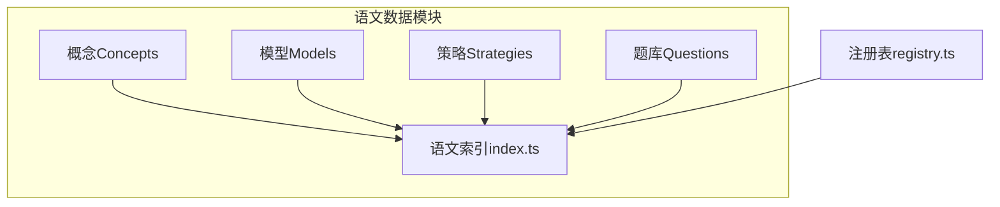
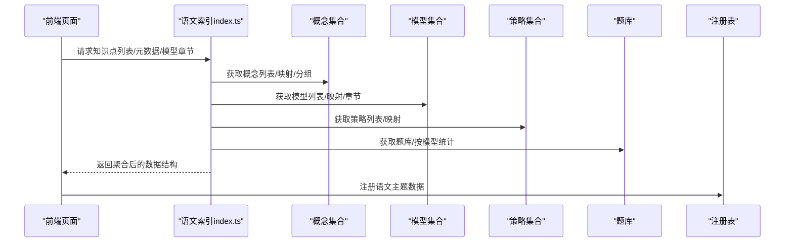
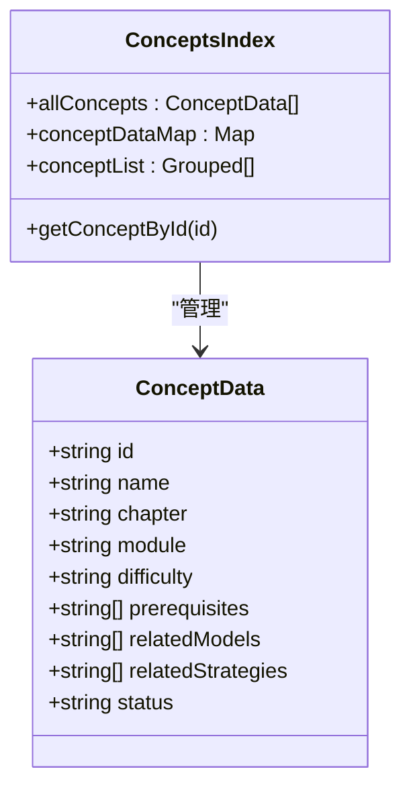
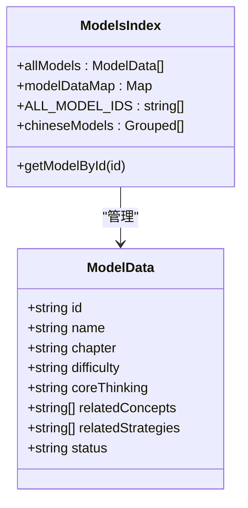
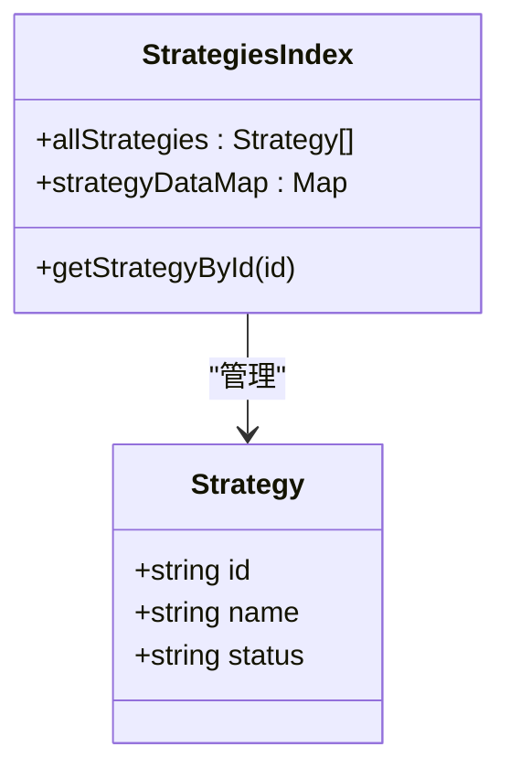
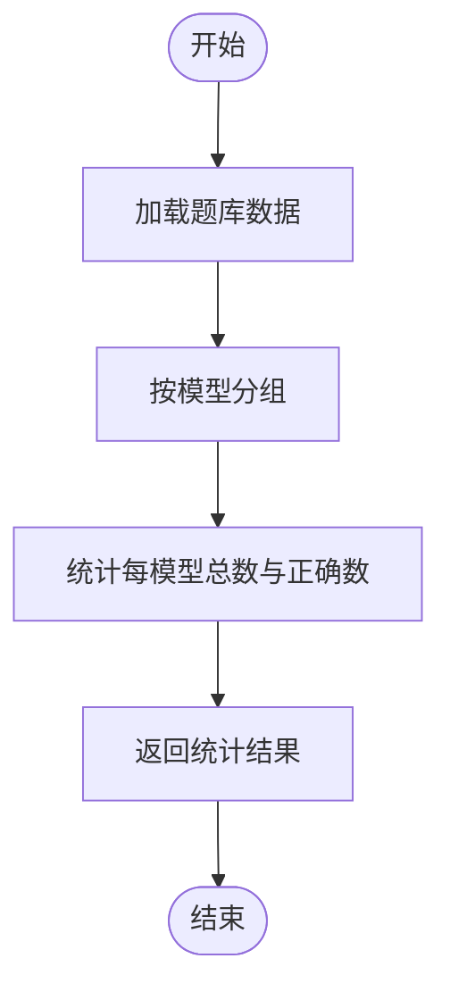
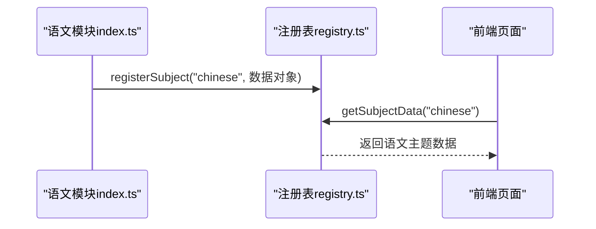
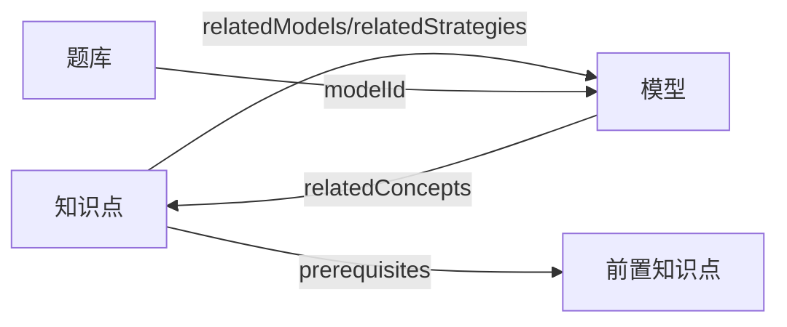

# 语文知识节点（K层）

<cite>
**本文引用的文件**
- [src/data/chinese/index.ts](file://src/data/chinese/index.ts)
- [src/data/chinese/concepts/Y01Y43.ts](file://src/data/chinese/concepts/Y01Y43.ts)
- [src/data/chinese/concepts/index.ts](file://src/data/chinese/concepts/index.ts)
- [src/data/chinese/models/C01C29.ts](file://src/data/chinese/models/C01C29.ts)
- [src/data/chinese/models/index.ts](file://src/data/chinese/models/index.ts)
- [src/data/chinese/questions/index.ts](file://src/data/chinese/questions/index.ts)
- [src/data/chinese/strategies.ts](file://src/data/chinese/strategies.ts)
- [src/data/registry.ts](file://src/data/registry.ts)
- [scripts/generate-klayer.js](file://scripts/generate-klayer.js)
</cite>

## 目录
1. [引言](#引言)
2. [项目结构](#项目结构)
3. [核心组件](#核心组件)
4. [架构总览](#架构总览)
5. [详细组件分析](#详细组件分析)
6. [依赖分析](#依赖分析)
7. [性能考虑](#性能考虑)
8. [故障排查指南](#故障排查指南)
9. [结论](#结论)
10. [附录](#附录)

## 引言
本文件系统化阐述“语文知识节点（K层）”的数据结构设计理念与实现方式，聚焦以下目标：
- 解释语文知识点的分类体系：按“模块—章节—知识点”的层级组织，覆盖现代文阅读、文言文、古诗鉴赏、语言文字运用、写作、文学文化常识六大板块。
- 难度等级划分：基础（B）、进阶（J）、挑战（T），并映射为内部数值编码，便于统一处理与展示。
- 模块组织方式：以“输入理解层、语言基础层、输出表达层、文化积淀层”四个思维层级作为模块划分依据，体现从“感知—理解—迁移—积淀”的学习进阶。
- 知识点内容组织：围绕古诗词鉴赏、文言文阅读、现代文阅读、写作技巧等模块，给出知识点的组织方式与关联关系。
- 层级关系与关联性：通过前置知识（prerequisites）与相关模型/策略的双向关联，刻画知识点之间的依赖与支撑关系。
- 数据结构示例与使用方法：提供增删改查（CRUD）的思路与接口路径，帮助开发者快速接入与扩展。

## 项目结构
语文数据模块位于 src/data/chinese 下，采用“概念（Concepts）—模型（Models）—策略（Strategies）—题库（Questions）—注册表（Registry）”的分层组织：
- concepts：知识点清单与分组，包含知识点的元数据、难度、所属模块与章节、前置知识、关联模型与策略。
- models：能力模型，描述“如何解决某类问题”，强调核心思维与难度等级。
- strategies：解题范式/方法论，作为知识点与模型之间的桥梁，提供可复用的思维工具。
- questions：题库数据，用于与模型绑定，支持统计与筛选。
- index.ts：对外暴露查询与聚合接口，并通过注册表统一注册到全局主题数据注册中心。

**图示来源**
- [src/data/chinese/index.ts:1-151](file://src/data/chinese/index.ts#L1-L151)
- [src/data/registry.ts:1-52](file://src/data/registry.ts#L1-L52)

**章节来源**
- [src/data/chinese/index.ts:1-151](file://src/data/chinese/index.ts#L1-L151)
- [src/data/registry.ts:1-52](file://src/data/registry.ts#L1-L52)

## 核心组件
- 概念（ConceptData）：描述单个知识点的元信息，包括 id、名称、所属章节与模块、难度、前置知识、关联模型与策略、状态等。
- 模型（ModelData）：描述“能力模型”，强调核心思维与难度等级，明确与哪些知识点相关联。
- 策略（Strategy）：提供可复用的解题范式或方法论，作为知识点与模型之间的桥梁。
- 题库（Question）：承载题目数据，支持按模型维度统计与筛选。
- 注册表（SubjectDataRegistry）：统一暴露查询接口，供前端页面与工具使用。

**章节来源**
- [src/data/chinese/concepts/Y01Y43.ts:1-517](file://src/data/chinese/concepts/Y01Y43.ts#L1-L517)
- [src/data/chinese/models/C01C29.ts:1-320](file://src/data/chinese/models/C01C29.ts#L1-L320)
- [src/data/chinese/strategies.ts:1-67](file://src/data/chinese/strategies.ts#L1-L67)
- [src/data/chinese/questions/index.ts:1-15](file://src/data/chinese/questions/index.ts#L1-L15)
- [src/data/registry.ts:1-52](file://src/data/registry.ts#L1-L52)

## 架构总览
语文数据模块通过 index.ts 将概念、模型、策略、题库与注册表整合，形成统一的查询与聚合入口；同时提供难度映射、章节分组、题库筛选等能力，便于前端按需渲染与交互。

**图示来源**
- [src/data/chinese/index.ts:11-151](file://src/data/chinese/index.ts#L11-L151)
- [src/data/registry.ts:40-48](file://src/data/registry.ts#L40-L48)

**章节来源**
- [src/data/chinese/index.ts:11-151](file://src/data/chinese/index.ts#L11-L151)
- [src/data/registry.ts:40-48](file://src/data/registry.ts#L40-L48)

## 详细组件分析

### 概念（Concepts）数据结构与组织
- 分类体系：按“模块—章节—知识点”三层组织。模块包括“输入理解层、语言基础层、输出表达层、文化积淀层”。章节覆盖现代文阅读（文学类与实用类）、文言文、古诗鉴赏、语言文字运用、写作、文学文化常识。
- 难度等级：核心（core）映射为内部数值 2；扩展（extended）映射为 3；基础（basic）映射为 1。该映射在对外接口中统一呈现。
- 前置知识（prerequisites）：用于刻画知识点之间的依赖关系，确保学习路径的合理性。
- 关联关系：每个知识点关联若干模型与策略，形成“知识点—模型—策略”的闭环支撑。

**图示来源**
- [src/data/chinese/concepts/Y01Y43.ts:3-73](file://src/data/chinese/concepts/Y01Y43.ts#L3-L73)
- [src/data/chinese/concepts/index.ts:5-138](file://src/data/chinese/concepts/index.ts#L5-L138)

**章节来源**
- [src/data/chinese/concepts/Y01Y43.ts:3-73](file://src/data/chinese/concepts/Y01Y43.ts#L3-L73)
- [src/data/chinese/concepts/index.ts:5-138](file://src/data/chinese/concepts/index.ts#L5-L138)

### 模型（Models）数据结构与组织
- 能力模型：每个模型描述“如何解决某类问题”，强调核心思维（coreThinking）与难度等级（B/J/T）。
- 知识点关联：模型明确列出与之相关的知识点集合，形成“模型—知识点”的支撑关系。
- 章节组织：按模块与章节分组，便于前端按板块展示与导航。

**图示来源**
- [src/data/chinese/models/C01C29.ts:3-122](file://src/data/chinese/models/C01C29.ts#L3-L122)
- [src/data/chinese/models/index.ts:5-112](file://src/data/chinese/models/index.ts#L5-L112)

**章节来源**
- [src/data/chinese/models/C01C29.ts:3-122](file://src/data/chinese/models/C01C29.ts#L3-L122)
- [src/data/chinese/models/index.ts:5-112](file://src/data/chinese/models/index.ts#L5-L112)

### 策略（Strategies）数据结构与组织
- 策略：提供可复用的解题范式或方法论，编号以 F 开头，便于与知识点/模型建立关联。
- 关联方式：概念与模型均可声明关联策略，形成“知识点/模型—策略”的双向映射。

**图示来源**
- [src/data/chinese/strategies.ts:9-67](file://src/data/chinese/strategies.ts#L9-L67)

**章节来源**
- [src/data/chinese/strategies.ts:9-67](file://src/data/chinese/strategies.ts#L9-L67)

### 题库（Questions）数据结构与组织
- 题目数据：支持按模型维度统计与筛选，便于评估学习成效与资源匹配。
- 统计接口：提供按模型的题目数量与正确率统计，辅助个性化推荐与诊断。

**图示来源**
- [src/data/chinese/questions/index.ts:1-15](file://src/data/chinese/questions/index.ts#L1-L15)

**章节来源**
- [src/data/chinese/questions/index.ts:1-15](file://src/data/chinese/questions/index.ts#L1-L15)

### 注册表（Registry）与对外接口
- 注册表：统一暴露查询接口，包括知识点列表、元数据、模型章节、公式、题库筛选、范式等。
- 主题注册：通过 registerSubject 将语文主题数据注册到全局注册表，供前端按主题访问。

**图示来源**
- [src/data/chinese/index.ts:126-151](file://src/data/chinese/index.ts#L126-L151)
- [src/data/registry.ts:40-48](file://src/data/registry.ts#L40-L48)

**章节来源**
- [src/data/chinese/index.ts:126-151](file://src/data/chinese/index.ts#L126-L151)
- [src/data/registry.ts:40-48](file://src/data/registry.ts#L40-L48)

## 依赖分析
- 概念到模型/策略：知识点通过 relatedModels 与 relatedStrategies 与模型/策略建立关联，体现“学以致用”的闭环。
- 模型到概念：模型通过 relatedConcepts 反向支撑知识点，形成“能力—知识”的双向映射。
- 前置知识（prerequisites）：刻画知识点之间的学习先后关系，保证学习路径的合理性。
- 题库与模型：题库按模型维度统计，便于评估与训练。

**图示来源**
- [src/data/chinese/concepts/Y01Y43.ts:10-12](file://src/data/chinese/concepts/Y01Y43.ts#L10-L12)
- [src/data/chinese/models/C01C29.ts:9-11](file://src/data/chinese/models/C01C29.ts#L9-L11)
- [src/data/chinese/questions/index.ts:13-15](file://src/data/chinese/questions/index.ts#L13-L15)

**章节来源**
- [src/data/chinese/concepts/Y01Y43.ts:10-12](file://src/data/chinese/concepts/Y01Y43.ts#L10-L12)
- [src/data/chinese/models/C01C29.ts:9-11](file://src/data/chinese/models/C01C29.ts#L9-L11)
- [src/data/chinese/questions/index.ts:13-15](file://src/data/chinese/questions/index.ts#L13-L15)

## 性能考虑
- 查询优化：通过 Map 结构（conceptDataMap、modelDataMap、strategyDataMap）实现 O(1) 的按 id 查询，降低前端渲染与交互延迟。
- 分组与缓存：章节分组（conceptList、chineseModels）减少重复计算，提升渲染效率。
- 题库统计：按模型维度统计，避免全量扫描，提高评估与推荐响应速度。
- 扩展性：注册表模式便于按主题扩展，新增学科仅需实现一致的接口契约。

## 故障排查指南
- 知识点/模型/策略缺失：检查对应 index.ts 中是否已导出并加入 allXxx 数组与数据映射。
- 前置知识不一致：校验 prerequisites 是否与实际学习路径一致，避免环依赖。
- 题库统计异常：确认题目数据中 modelId 字段是否正确，以及统计逻辑是否遍历了全部题目。
- 注册失败：确认 registerSubject 调用是否在模块初始化阶段执行，且主题 id 未被重复注册。

**章节来源**
- [src/data/chinese/concepts/index.ts:51-53](file://src/data/chinese/concepts/index.ts#L51-L53)
- [src/data/chinese/models/index.ts:37-39](file://src/data/chinese/models/index.ts#L37-L39)
- [src/data/chinese/strategies.ts:61-63](file://src/data/chinese/strategies.ts#L61-L63)
- [src/data/chinese/questions/index.ts:5-7](file://src/data/chinese/questions/index.ts#L5-L7)
- [src/data/chinese/index.ts:126-151](file://src/data/chinese/index.ts#L126-L151)

## 结论
语文知识节点（K层）通过“概念—模型—策略—题库—注册表”的分层设计，实现了知识点的系统化组织与可扩展的查询能力。模块化的层级划分与难度映射，使学习路径清晰、能力评估便捷；而前置知识与关联关系的建模，则为个性化教学与智能推荐提供了坚实基础。建议在后续迭代中逐步完善状态字段与内容填充，持续优化学习体验与教学效果。

## 附录

### 知识点与模型的层级关系示意

```mermaid
graph TB
subgraph "输入理解层"
Y01["小说三要素"]
Y02["人物形象分析"]
Y03["叙事视角与技巧"]
Y04["情节结构分析"]
Y05["小说主题与意蕴"]
Y06["小说阅读综合"]
end
subgraph "语言基础层"
Y11["文言实词"]
Y12["文言虚词"]
Y13["文言句式"]
Y14["文言文翻译"]
Y15["文言文内容理解"]
Y16["文言文分析与评价"]
end
subgraph "输出表达层"
Y29["审题与立意"]
Y30["议论文论点与分论点"]
Y31["议论文论据运用"]
Y32["议论文论证方法与逻辑"]
Y33["议论文结构与升格"]
Y34["记叙文写作"]
Y35["散文写作"]
Y36["应用文写作"]
end
subgraph "文化积淀层"
Y37["先秦文学与文化"]
Y38["秦汉魏晋文学"]
Y39["唐宋文学"]
Y40["元明清文学"]
Y41["现当代文学"]
Y42["古代文化常识"]
Y43["传统文化思想"]
end
Y01 --> C01["小说叙事分析模型"]
Y02 --> C02["小说主题解读模型"]
Y06 --> C03["小说综合鉴赏模型"]
Y11 --> C08["文言基础积累模型"]
Y14 --> C09["文言文阅读理解模型"]
Y16 --> C10["文言文评价鉴赏模型"]
Y29 --> C17["议论文立论模型"]
Y30 --> C18["议论文论据模型"]
Y32 --> C19["议论文论证模型"]
Y33 --> C20["议论文升格模型"]
Y37 --> C23["文学史脉络模型"]
Y42 --> C24["传统文化常识模型"]
Y43 --> C24
```

**图示来源**
- [src/data/chinese/concepts/Y01Y43.ts:3-73](file://src/data/chinese/concepts/Y01Y43.ts#L3-L73)
- [src/data/chinese/models/C01C29.ts:3-122](file://src/data/chinese/models/C01C29.ts#L3-L122)

### 数据结构示例与使用方法（接口路径）
- 获取知识点列表与难度映射
  - 接口路径：[src/data/chinese/index.ts:11-21](file://src/data/chinese/index.ts#L11-L21)
- 获取知识点元数据（标题、模块、章节、难度）
  - 接口路径：[src/data/chinese/index.ts:27-36](file://src/data/chinese/index.ts#L27-L36)
- 获取模型章节与难度
  - 接口路径：[src/data/chinese/index.ts:38-49](file://src/data/chinese/index.ts#L38-L49)
- 获取题库筛选配置与数据
  - 接口路径：[src/data/chinese/index.ts:66-100](file://src/data/chinese/index.ts#L66-L100)
- 获取模型题目统计
  - 接口路径：[src/data/chinese/index.ts:106-114](file://src/data/chinese/index.ts#L106-L114)
- 获取按模型分组的题目
  - 接口路径：[src/data/chinese/index.ts:116-124](file://src/data/chinese/index.ts#L116-L124)
- 注册语文主题数据
  - 接口路径：[src/data/chinese/index.ts:126-151](file://src/data/chinese/index.ts#L126-L151)
- 获取语文主题数据（前端调用）
  - 接口路径：[src/data/registry.ts:46-48](file://src/data/registry.ts#L46-L48)

### 批量生成 K 层骨架文件（参考）
- 脚本路径：[scripts/generate-klayer.js:1-73](file://scripts/generate-klayer.js#L1-L73)