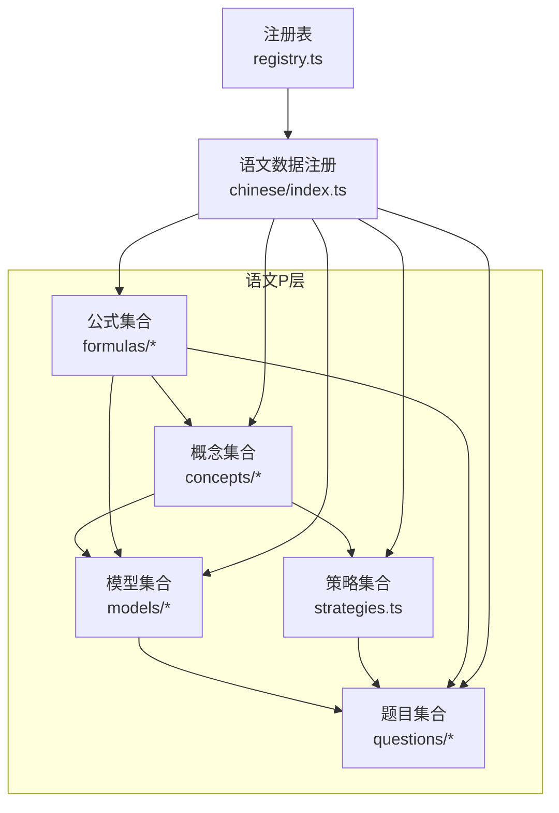
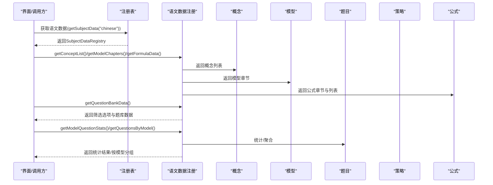
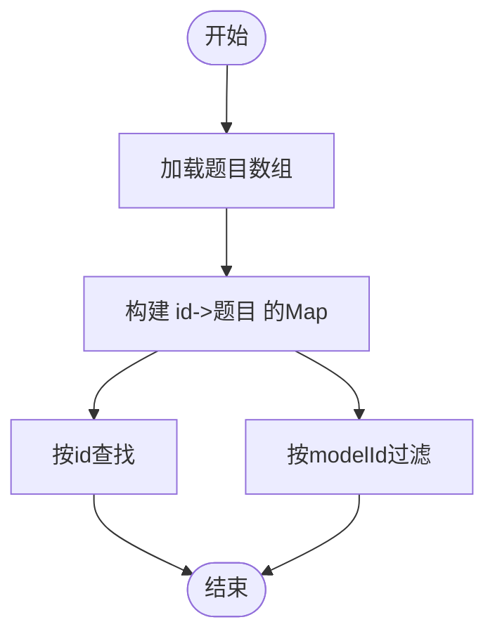
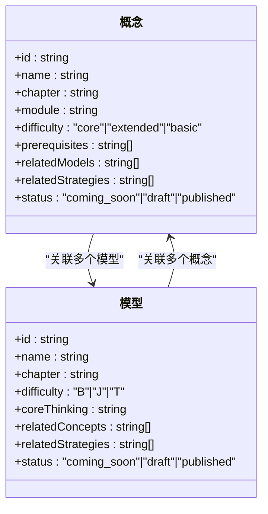
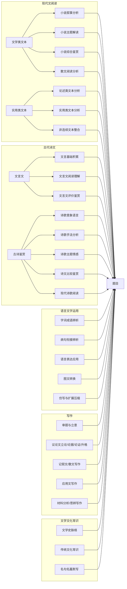
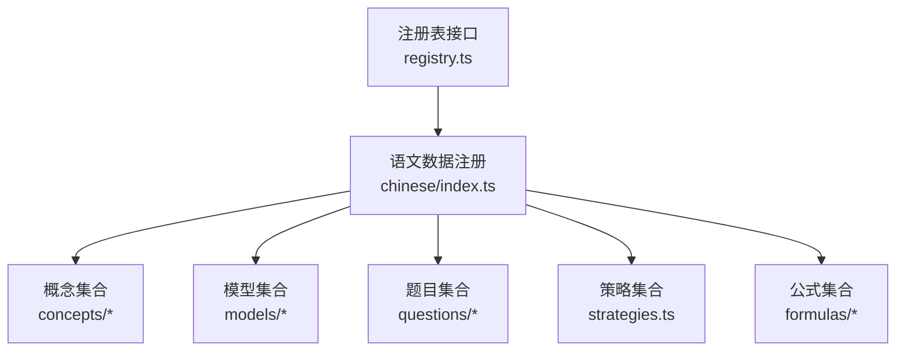

# 语文练习题库（P层）

<cite>
**本文引用的文件**   
- [src/data/chinese/questions/types.ts](file://src/data/chinese/questions/types.ts)
- [src/data/chinese/questions/filters.ts](file://src/data/chinese/questions/filters.ts)
- [src/data/chinese/questions/index.ts](file://src/data/chinese/questions/index.ts)
- [src/data/chinese/models/types.ts](file://src/data/chinese/models/types.ts)
- [src/data/chinese/models/C01C29.ts](file://src/data/chinese/models/C01C29.ts)
- [src/data/chinese/models/index.ts](file://src/data/chinese/models/index.ts)
- [src/data/chinese/concepts/types.ts](file://src/data/chinese/concepts/types.ts)
- [src/data/chinese/concepts/Y01Y43.ts](file://src/data/chinese/concepts/Y01Y43.ts)
- [src/data/chinese/concepts/index.ts](file://src/data/chinese/concepts/index.ts)
- [src/data/chinese/strategies.ts](file://src/data/chinese/strategies.ts)
- [src/data/chinese/index.ts](file://src/data/chinese/index.ts)
- [src/data/chinese/formulas/index.ts](file://src/data/chinese/formulas/index.ts)
- [src/data/chinese/formulas/types.ts](file://src/data/chinese/formulas/types.ts)
- [src/data/registry.ts](file://src/data/registry.ts)
</cite>

## 目录
1. [简介](#简介)
2. [项目结构](#项目结构)
3. [核心组件](#核心组件)
4. [架构总览](#架构总览)
5. [详细组件分析](#详细组件分析)
6. [依赖分析](#依赖分析)
7. [性能考虑](#性能考虑)
8. [故障排查指南](#故障排查指南)
9. [结论](#结论)
10. [附录](#附录)

## 简介
本文件系统化阐述语文练习题库（P层）的数据结构设计与实现，覆盖题目的分类体系、难度等级、知识点与模型关联、题目组织方式（阅读理解、古诗词鉴赏、文言文翻译、作文等）、筛选机制与过滤条件，并给出题目搜索、筛选、统计等能力的使用方法与可视化说明。目标是帮助开发者与产品人员快速理解语文题库的P层数据骨架与调用接口。

## 项目结构
语文P层数据位于 src/data/chinese 下，按“概念-模型-题目-策略-公式”的层次组织，配合注册表统一对外暴露查询与统计能力。



图示来源
- [src/data/chinese/index.ts:1-151](file://src/data/chinese/index.ts#L1-L151)
- [src/data/registry.ts:1-52](file://src/data/registry.ts#L1-L52)

章节来源
- [src/data/chinese/index.ts:1-151](file://src/data/chinese/index.ts#L1-L151)
- [src/data/registry.ts:1-52](file://src/data/registry.ts#L1-L52)

## 核心组件
- 题目数据结构：定义题目的字段、类型、难度、目标用途、功能场景、内容与答案等。
- 题目筛选选项：提供难度、层级、目标、功能、题型等维度的下拉选项与颜色标识。
- 题目集合与索引：维护题目数组与基于id的Map，提供按id与按模型id检索的能力。
- 概念数据结构：描述知识点的章节、模块、难度、前置要求、关联模型与策略、状态等。
- 模型数据结构：描述语文能力模型的章节、难度、核心思维、关联概念与策略、状态等。
- 策略集合：提供可复用的解题范式名称与状态。
- 公式数据结构：描述公式卡片的章节、变量、关联概念与模型、难度等。
- 注册表：统一暴露语文数据的查询、统计与展示所需接口。

章节来源
- [src/data/chinese/questions/types.ts:1-16](file://src/data/chinese/questions/types.ts#L1-L16)
- [src/data/chinese/questions/filters.ts:1-38](file://src/data/chinese/questions/filters.ts#L1-L38)
- [src/data/chinese/questions/index.ts:1-15](file://src/data/chinese/questions/index.ts#L1-L15)
- [src/data/chinese/concepts/types.ts:1-13](file://src/data/chinese/concepts/types.ts#L1-L13)
- [src/data/chinese/models/types.ts:1-10](file://src/data/chinese/models/types.ts#L1-L10)
- [src/data/chinese/strategies.ts:1-67](file://src/data/chinese/strategies.ts#L1-L67)
- [src/data/chinese/formulas/types.ts:1-17](file://src/data/chinese/formulas/types.ts#L1-L17)
- [src/data/registry.ts:1-52](file://src/data/registry.ts#L1-L52)

## 架构总览
语文P层通过注册表将概念、模型、题目、策略、公式等数据统一打包，提供以下能力：
- 获取概念列表与元数据
- 获取模型章节与模型列表
- 获取公式章节与公式列表
- 获取策略列表与数据映射
- 获取题库筛选选项与题库数据
- 统计模型题目分布与按模型聚合题目



图示来源
- [src/data/chinese/index.ts:66-151](file://src/data/chinese/index.ts#L66-L151)
- [src/data/registry.ts:40-52](file://src/data/registry.ts#L40-L52)

章节来源
- [src/data/chinese/index.ts:66-151](file://src/data/chinese/index.ts#L66-L151)
- [src/data/registry.ts:40-52](file://src/data/registry.ts#L40-L52)

## 详细组件分析

### 题目数据结构与筛选
- 题目字段涵盖：唯一id、所属模型id、题型（选择/填空/判断/解答）、难度（基础/进阶/挑战）、层级（L1/L2/L3）、目标（同步/期中期末/高考/竞赛）、功能（练习/复习/诊断/真题）、内容、选项、答案、解析、来源年份/省份等。
- 筛选维度：
  - 层级：L1基础、L2进阶、L3挑战
  - 目标：同步学习、期中期末、高考专项、竞赛拓展
  - 功能：巩固练习、复习检测、诊断评估、真题演练
  - 难度：基础(B)、进阶(J)、挑战(T)，并提供颜色标识
  - 题型：选择题、填空题、判断题、解答题

```mermaid
classDiagram
class 题目 {
+id : string
+modelId : string
+type : "CHOICE"|"FILL"|"JUDGE"|"ANSWER"
+difficulty : "B"|"J"|"T"
+level : "L1"|"L2"|"L3"
+target : "SYNC"|"EXAM"|"GAOKAO"|"COMP"
+function : "PRAC"|"REV"|"DIAG"|"REAL"
+content : string
+options : {key,value}[]
+answer : string
+analysis : string
+source? : string
+year? : number
+province? : string
}
class 筛选选项 {
+LEVEL_OPTIONS
+TARGET_OPTIONS
+FUNCTION_OPTIONS
+DIFFICULTY_OPTIONS
+TYPE_OPTIONS
+DIFF_COLOR
}
题目 <.. 筛选选项 : "用于前端展示/过滤"
```

图示来源
- [src/data/chinese/questions/types.ts:1-16](file://src/data/chinese/questions/types.ts#L1-L16)
- [src/data/chinese/questions/filters.ts:1-38](file://src/data/chinese/questions/filters.ts#L1-L38)

章节来源
- [src/data/chinese/questions/types.ts:1-16](file://src/data/chinese/questions/types.ts#L1-L16)
- [src/data/chinese/questions/filters.ts:1-38](file://src/data/chinese/questions/filters.ts#L1-L38)

### 题目集合与索引
- 维护题目数组与以id为键的Map，支持按id快速查找；提供按模型id过滤题目的方法。
- 提供获取单题与按模型聚合题目的接口，便于统计与展示。



图示来源
- [src/data/chinese/questions/index.ts:1-15](file://src/data/chinese/questions/index.ts#L1-L15)

章节来源
- [src/data/chinese/questions/index.ts:1-15](file://src/data/chinese/questions/index.ts#L1-L15)

### 概念与模型：知识点与能力模型
- 概念（ConceptData）：描述知识点的章节、模块、难度（核心/扩展/基础）、前置要求、关联模型与策略、状态。
- 模型（ModelData）：描述语文能力模型的章节、难度（B/J/T）、核心思维、关联概念与策略、状态。
- 概念与模型之间通过id建立双向关联，形成“知识点—能力模型”的知识网络。



图示来源
- [src/data/chinese/concepts/types.ts:1-13](file://src/data/chinese/concepts/types.ts#L1-L13)
- [src/data/chinese/models/types.ts:1-10](file://src/data/chinese/models/types.ts#L1-L10)

章节来源
- [src/data/chinese/concepts/types.ts:1-13](file://src/data/chinese/concepts/types.ts#L1-L13)
- [src/data/chinese/models/types.ts:1-10](file://src/data/chinese/models/types.ts#L1-L10)

### 模型与题目的组织方式
语文题目的组织遵循“模型驱动”的思路：每个题目绑定一个模型id，代表该题所训练或对应的语文能力模型。不同题型与能力模型的组合体现如下典型类别：
- 阅读理解类：现代文阅读（文学类/实用类），对应模型如“小说叙事分析”“散文阅读分析”“论述类文本分析”“实用类文本分析”“非连续文本整合”等。
- 古诗词鉴赏类：古诗鉴赏（意象语言、手法分析、主题情感、比较鉴赏、现代诗歌阅读）。
- 文言文类：文言基础（实词、虚词、句式）、文言文阅读（理解、评价鉴赏）。
- 语言文字运用类：字词成语辨析、病句衔接辨析、语言表达应用、图文转换、仿写与扩展压缩。
- 写作类：审题立意、议论文（立论、论据、论证、升格）、记叙文/散文写作、应用文写作、材料分析、思辨写作。
- 文学文化常识类：文学史脉络、传统文化常识、名句名篇默写。



图示来源
- [src/data/chinese/models/C01C29.ts:1-320](file://src/data/chinese/models/C01C29.ts#L1-L320)
- [src/data/chinese/models/index.ts:43-108](file://src/data/chinese/models/index.ts#L43-L108)

章节来源
- [src/data/chinese/models/C01C29.ts:1-320](file://src/data/chinese/models/C01C29.ts#L1-L320)
- [src/data/chinese/models/index.ts:1-112](file://src/data/chinese/models/index.ts#L1-L112)

### 策略与范式
- 策略（Strategy）：提供可复用的解题范式名称与状态，如“人物形象多维分析法”“文言文翻译法”“议论文论证方法选择法”等。
- 策略与概念、模型、题目形成“方法—知识—能力—题目”的闭环，便于在教学与练习中迁移应用。

章节来源
- [src/data/chinese/strategies.ts:1-67](file://src/data/chinese/strategies.ts#L1-L67)

### 公式数据结构
- 公式卡片（FormulaCard）：包含公式名称、章节、公式文本、描述、变量（名称/符号/单位）、关联概念与模型、难度。
- 公式章节（FormulaChapter）：描述公式的章节组织。
- 当前语文P层中公式集合为空，但结构已完备，便于后续扩展。

章节来源
- [src/data/chinese/formulas/types.ts:1-17](file://src/data/chinese/formulas/types.ts#L1-L17)
- [src/data/chinese/formulas/index.ts:1-13](file://src/data/chinese/formulas/index.ts#L1-L13)

### 题目筛选机制与过滤条件
- 前端筛选选项来源于语文注册表中的“题库数据”，包含层级、目标、功能、难度、题型等选项。
- 难度与层级提供颜色标识，便于视觉化呈现。
- 支持按模型id筛选题目，便于按能力模型组织练习。

章节来源
- [src/data/chinese/index.ts:66-100](file://src/data/chinese/index.ts#L66-L100)
- [src/data/chinese/questions/filters.ts:1-38](file://src/data/chinese/questions/filters.ts#L1-L38)

### 题目搜索、筛选、统计
- 搜索：提供按名称或章节模糊匹配的公式搜索函数（当前语文公式为空）。
- 筛选：通过题库数据提供的选项集合进行多维筛选。
- 统计：按模型id统计题目总数，便于生成学习进度与掌握情况报表。

章节来源
- [src/data/chinese/index.ts:51-64](file://src/data/chinese/index.ts#L51-L64)
- [src/data/chinese/index.ts:106-124](file://src/data/chinese/index.ts#L106-L124)

## 依赖分析
语文P层数据通过注册表统一对外暴露，避免直接耦合到上层业务，降低模块间依赖复杂度。



图示来源
- [src/data/registry.ts:1-52](file://src/data/registry.ts#L1-L52)
- [src/data/chinese/index.ts:1-151](file://src/data/chinese/index.ts#L1-L151)

章节来源
- [src/data/registry.ts:1-52](file://src/data/registry.ts#L1-L52)
- [src/data/chinese/index.ts:1-151](file://src/data/chinese/index.ts#L1-L151)

## 性能考虑
- 题目与概念/模型/策略均采用Map索引，查询复杂度为O(1)，适合高频访问场景。
- 按模型id过滤题目采用一次遍历，建议在数据量较大时考虑预构建“模型id->题目列表”的映射以提升性能。
- 题库数据中的筛选选项与颜色映射在渲染层复用，减少重复计算。

## 故障排查指南
- 题目id缺失或重复：检查题目数组与Map构建逻辑，确保每道题都有唯一id且与Map键一致。
- 模型id不匹配：确认题目modelId与模型id一致，避免统计与筛选异常。
- 筛选项未生效：检查题库数据返回的选项集合是否正确注入到前端筛选控件。
- 公式搜索无结果：当前语文公式为空，搜索会返回空数组，属预期行为。

章节来源
- [src/data/chinese/questions/index.ts:1-15](file://src/data/chinese/questions/index.ts#L1-L15)
- [src/data/chinese/index.ts:66-100](file://src/data/chinese/index.ts#L66-L100)
- [src/data/chinese/formulas/index.ts:1-13](file://src/data/chinese/formulas/index.ts#L1-L13)

## 结论
语文练习题库（P层）以清晰的“概念—模型—题目—策略—公式”层次结构为基础，结合注册表统一对外提供查询、筛选与统计能力。通过模型驱动的题目组织方式，能够有效支撑阅读理解、古诗词鉴赏、文言文翻译、写作、语言文字运用与文学文化常识等多类题目的教学与练习需求。建议在后续迭代中完善公式与题目数据，持续优化索引与统计性能，以满足更大规模的教学应用场景。

## 附录
- 使用建议
  - 在前端页面初始化时调用语文注册表提供的题库数据接口，一次性获取筛选选项与题库数据。
  - 使用按模型id聚合的题目数据进行能力训练与进度统计。
  - 如需扩展公式或题目，遵循现有types与index模式，保持结构一致性。