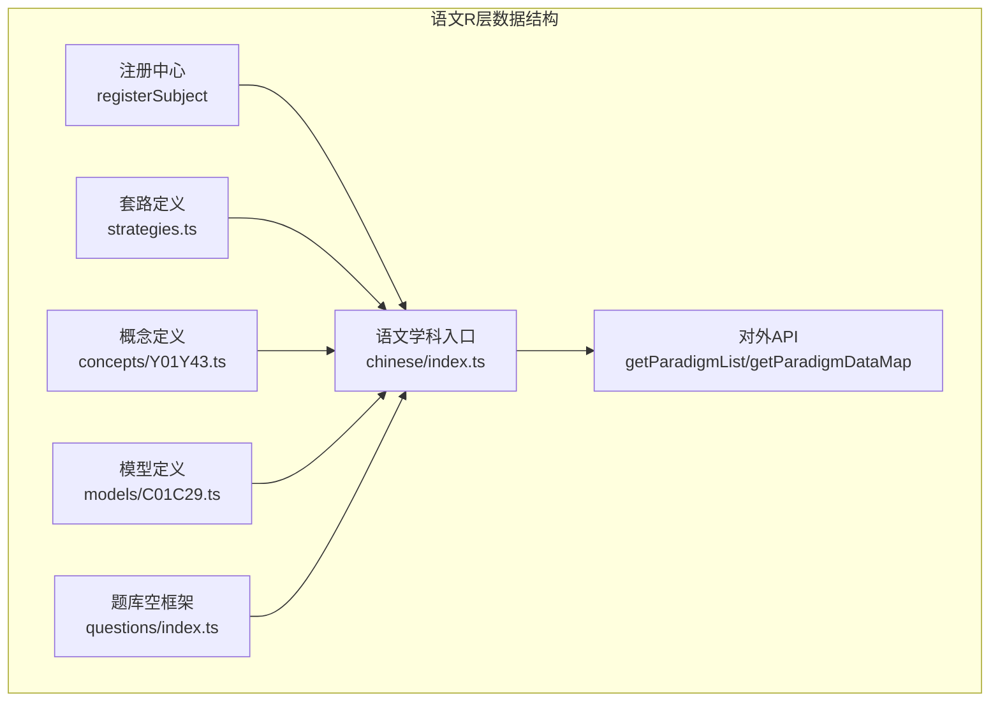
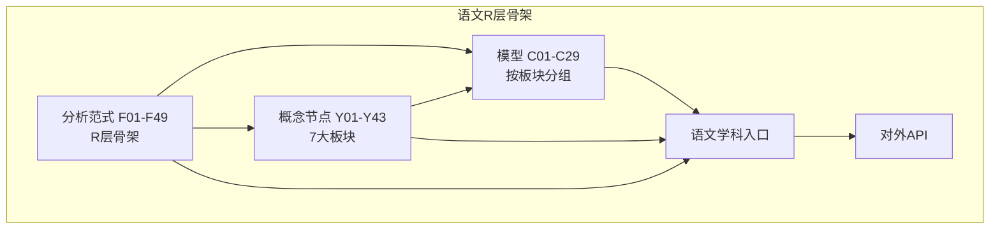
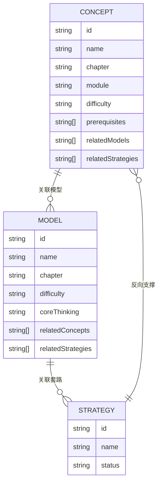
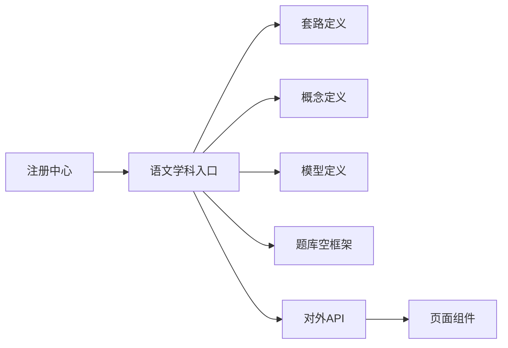

# 语文解题套路（R层）

<cite>
**本文档引用的文件**
- [src/data/chinese/index.ts](file://src/data/chinese/index.ts)
- [src/data/chinese/strategies.ts](file://src/data/chinese/strategies.ts)
- [src/data/chinese/models/C01C29.ts](file://src/data/chinese/models/C01C29.ts)
- [src/data/chinese/concepts/Y01Y43.ts](file://src/data/chinese/concepts/Y01Y43.ts)
- [src/data/chinese/questions/index.ts](file://src/data/chinese/questions/index.ts)
- [src/data/registry.ts](file://src/data/registry.ts)
- [src/data/chinese/models/types.ts](file://src/data/chinese/models/types.ts)
- [src/data/chinese/concepts/types.ts](file://src/data/chinese/concepts/types.ts)
- [src/sections/ChineseGuidePage.tsx](file://src/sections/ChineseGuidePage.tsx)
- [docs/FEATURE-语文学科数据骨架完成记录.md](file://docs/FEATURE-语文学科数据骨架完成记录.md)
- [SPEC.md](file://SPEC.md)
</cite>

## 目录
1. [引言](#引言)
2. [项目结构](#项目结构)
3. [核心组件](#核心组件)
4. [架构总览](#架构总览)
5. [详细组件分析](#详细组件分析)
6. [依赖分析](#依赖分析)
7. [性能考虑](#性能考虑)
8. [故障排查指南](#故障排查指南)
9. [结论](#结论)
10. [附录](#附录)

## 引言
本文件系统化阐述语文R层（解题套路）的数据结构设计理念与组织方式，面向语文教学与学习实践，解释“套路”在提升语文能力中的作用与价值。R层位于K层（知识节点）与M层（核心模型）之上，是对跨模型通用解题方法的抽象与沉淀，强调“可迁移”的思维方法与操作步骤，帮助学生从“背模板”走向“自动化文体意识”和“结构化思维”。

语文R层的组织遵循“板块-模型-套路”的三级联动：板块划分体现学习场域（现代文阅读、古代诗文、语言文字运用、写作、文学文化常识等）；模型聚焦具体能力单元；套路则提供可操作的解题步骤与思维路径。通过本文件，读者可理解R层的分类体系、适用范围与实际应用方法。

## 项目结构
语文R层数据骨架位于语文学科数据目录，采用“学科主入口 + 分类聚合 + 类型定义 + 注册机制”的结构化组织方式：

- 语文学科主入口负责聚合概念、模型、套路、题库等数据，并通过注册接口暴露给前端模块。
- 套路定义集中于策略文件，提供标准化的套路ID、名称与状态。
- 模型与概念文件分别定义能力模型与知识节点，形成“模型-概念-套路”的关联关系。
- 注册机制统一对外暴露查询与统计接口，便于页面组件按需调用。

**图表来源**
- [src/data/chinese/index.ts:126-151](file://src/data/chinese/index.ts#L126-L151)
- [src/data/chinese/strategies.ts:1-67](file://src/data/chinese/strategies.ts#L1-L67)
- [src/data/chinese/concepts/Y01Y43.ts:1-517](file://src/data/chinese/concepts/Y01Y43.ts#L1-L517)
- [src/data/chinese/models/C01C29.ts:1-320](file://src/data/chinese/models/C01C29.ts#L1-L320)
- [src/data/chinese/questions/index.ts:1-15](file://src/data/chinese/questions/index.ts#L1-L15)
- [src/data/registry.ts:40-52](file://src/data/registry.ts#L40-L52)

**章节来源**
- [src/data/chinese/index.ts:1-151](file://src/data/chinese/index.ts#L1-L151)
- [src/data/registry.ts:1-52](file://src/data/registry.ts#L1-L52)

## 核心组件
- 套路定义与映射
  - 套路接口包含ID、名称与状态字段，提供按ID检索的映射表，便于快速定位与展示。
  - 套路ID采用统一前缀与编号规则，确保跨模块一致性与可扩展性。
- 概念与模型
  - 概念定义包含所属板块、模块、难度、前置条件、关联模型与关联套路等元信息，支撑“从K到M再到R”的学习路径。
  - 模型定义包含章节、难度、核心思维、关联概念与关联套路等，体现能力模型的结构化组织。
- 语文学科入口
  - 聚合所有数据并通过注册接口暴露，提供获取套路列表、数据映射、题库配置等能力。
- 注册机制
  - 统一SubjectDataRegistry接口，保证不同学科的数据层具备一致的查询与统计能力。

**章节来源**
- [src/data/chinese/strategies.ts:1-67](file://src/data/chinese/strategies.ts#L1-L67)
- [src/data/chinese/concepts/types.ts:1-13](file://src/data/chinese/concepts/types.ts#L1-L13)
- [src/data/chinese/models/types.ts:1-10](file://src/data/chinese/models/types.ts#L1-L10)
- [src/data/chinese/index.ts:1-151](file://src/data/chinese/index.ts#L1-L151)
- [src/data/registry.ts:4-52](file://src/data/registry.ts#L4-L52)

## 架构总览
语文R层的架构遵循“数据骨架先行、内容逐步填充”的策略。当前已完成：
- 43个概念节点（Y01-Y43）按7大板块分组，定义了前置关系、关联模型与关联套路。
- 29个模型（C01-C29）按板块分组，明确了核心思维与关联概念。
- 49条分析范式（F01-F49）作为R层骨架，覆盖阅读理解、文言文、诗歌鉴赏、语言文字运用、写作等多个领域。
- 语文学科主入口完成注册，题库与公式为空框架，等待后续内容填充。

**图表来源**
- [src/data/chinese/concepts/Y01Y43.ts:1-517](file://src/data/chinese/concepts/Y01Y43.ts#L1-L517)
- [src/data/chinese/models/C01C29.ts:1-320](file://src/data/chinese/models/C01C29.ts#L1-L320)
- [src/data/chinese/strategies.ts:9-59](file://src/data/chinese/strategies.ts#L9-L59)
- [src/data/chinese/index.ts:126-151](file://src/data/chinese/index.ts#L126-L151)

**章节来源**
- [docs/FEATURE-语文学科数据骨架完成记录.md:81-121](file://docs/FEATURE-语文学科数据骨架完成记录.md#L81-L121)
- [SPEC.md:118-161](file://SPEC.md#L118-L161)

## 详细组件分析

### 套路（R层）分类体系与适用范围
语文R层的套路按照“板块-题型-思维方法”进行分类，覆盖以下主要领域：
- 现代文阅读
  - 人物形象多维分析法、叙事结构追踪法、环境描写分析法、主题多层提炼法、散文线索追踪法、散文情感分析法等，适用于小说、散文等文学类文本。
  - 论证链条追踪法、论证方法辨识法、信息角度比较法、图表信息提取法等，适用于论述类与实用类文本。
- 古代诗文
  - 实词词义推断法、虚词用法分析法、文言文翻译法、文言内容概括法、文言文人物事件分析法、文言诗文比较鉴赏法等，覆盖文言文阅读与鉴赏。
  - 意象意境情感分析法、炼字鉴赏法、诗歌手法辨识法、诗歌表现手法效果评价法、诗文比较鉴赏法等，适用于古诗鉴赏。
- 语言文字运用
  - 字词成语语境辨析法、病句六类型诊断法、句子连贯分析法、语言表达得体判断法、仿写扩展压缩法等，服务于语言表达与应用。
- 写作
  - 审题立意多维分析法、分论点结构设计法、论据选取加工法、论证方法选择法、论证逻辑链条构建法、辩证论证法等，支撑议论文写作。
  - 记叙文选材构思法、散文形散神聚写作法、应用文格式规范法、材料多维分析法、作文思辨写作法、作文综合升格等，覆盖多种写作类型。

适用范围与作用：
- 适用范围：上述各类文本与题型，贯穿同步学习、期中期末、高考专项与竞赛拓展等不同目标。
- 作用：将复杂的阅读与写作问题拆解为可执行的步骤，降低认知负荷，提升答题效率与准确性；同时培养“文体意识自动化”与“结构化思维”。

**章节来源**
- [src/data/chinese/strategies.ts:9-59](file://src/data/chinese/strategies.ts#L9-L59)
- [src/data/chinese/concepts/Y01Y43.ts:1-517](file://src/data/chinese/concepts/Y01Y43.ts#L1-L517)
- [src/data/chinese/models/C01C29.ts:1-320](file://src/data/chinese/models/C01C29.ts#L1-L320)

### 套路与模型、概念的关联关系
- 概念到模型：概念定义包含“关联模型”，体现K层到M层的承接关系。例如“小说三要素”关联多个小说阅读模型。
- 模型到套路：模型定义包含“相关套路”，体现M层到R层的迁移关系。例如“小说叙事分析模型”可配合“叙事结构追踪法”等。
- 套路到概念：部分套路在概念定义中被标注为“相关套路”，形成R层对K层的反向支撑。

**图表来源**
- [src/data/chinese/concepts/types.ts:3-12](file://src/data/chinese/concepts/types.ts#L3-L12)
- [src/data/chinese/models/types.ts:1-9](file://src/data/chinese/models/types.ts#L1-L9)
- [src/data/chinese/strategies.ts:1-5](file://src/data/chinese/strategies.ts#L1-L5)

**章节来源**
- [src/data/chinese/concepts/Y01Y43.ts:1-517](file://src/data/chinese/concepts/Y01Y43.ts#L1-L517)
- [src/data/chinese/models/C01C29.ts:1-320](file://src/data/chinese/models/C01C29.ts#L1-L320)
- [src/data/chinese/strategies.ts:1-67](file://src/data/chinese/strategies.ts#L1-L67)

### 套路在提高语文成绩中的作用
- 从“模板记忆”到“框架迁移”
  - 传统“背模板”容易导致机械套用，缺乏迁移能力。R层强调“方法论”和“结构化思维”，帮助学生在不同文本中自动切换正确的解读框架。
- 从“经验碎片”到“系统方法”
  - 将零散的答题经验系统化为可执行的步骤，形成“问题类型→方法步骤”的条件反射，显著提升应试稳定性。
- 从“结果导向”到“过程导向”
  - R层不仅关注答案，更关注“如何得出答案”。通过规范化的步骤与错误识别，减少思维漏洞，提高得分质量。

**章节来源**
- [src/sections/ChineseGuidePage.tsx:16-134](file://src/sections/ChineseGuidePage.tsx#L16-L134)

### 实际应用示例与使用指导
- 阅读理解答题套路
  - 小说阅读：以“人物-情节-环境”为框架，结合“人物形象多维分析法”“叙事结构追踪法”“主题多层提炼法”，实现从字面义到文化义的分层解读。
  - 论述类文本：以“论点-论据-论证”为框架，结合“论证链条追踪法”“论证方法辨识法”，识别逻辑关系与潜在漏洞。
  - 实用类文本：以“信息筛选与概括”为基础，结合“信息角度比较法”“图表信息提取法”，提升信息整合与表达能力。
- 文言文翻译套路
  - 以“实词词义推断法”“虚词用法分析法”“文言文翻译法”为核心步骤，结合“文言内容概括法”“文言文人物事件分析法”，实现准确、通顺、得体的翻译。
- 诗歌鉴赏套路
  - 以“意象意境情感分析法”“炼字鉴赏法”“诗歌手法辨识法”“诗歌表现手法效果评价法”为主线，结合“诗文比较鉴赏法”，形成完整的鉴赏闭环。
- 语言文字运用套路
  - 以“字词成语语境辨析法”“病句六类型诊断法”“句子连贯分析法”“语言表达得体判断法”“仿写扩展压缩法”为工具箱，覆盖高频考点。
- 写作套路
  - 以“审题立意多维分析法”“分论点结构设计法”“论据选取加工法”“论证方法选择法”“论证逻辑链条构建法”“辩证论证法”为写作主线，辅以“记叙文选材构思法”“散文形散神聚写作法”“应用文格式规范法”“作文思辨写作法”“作文综合升格法”，全面提升写作能力。

使用指导：
- 选择合适套路：根据题型与文本类型，选择对应的套路ID与步骤。
- 明确适用边界：注意不同文体的适用差异，避免跨文体滥用。
- 强化迁移训练：通过多文本练习，将套路转化为“自动化框架”，减少答题时间与错误率。
- 对照错误清单：在练习中对照套路中的常见错误，建立自我纠错机制。

**章节来源**
- [src/data/chinese/strategies.ts:9-59](file://src/data/chinese/strategies.ts#L9-L59)
- [src/data/chinese/concepts/Y01Y43.ts:1-517](file://src/data/chinese/concepts/Y01Y43.ts#L1-L517)
- [src/data/chinese/models/C01C29.ts:1-320](file://src/data/chinese/models/C01C29.ts#L1-L320)
- [src/sections/ChineseGuidePage.tsx:16-134](file://src/sections/ChineseGuidePage.tsx#L16-L134)

## 依赖分析
语文R层的依赖关系围绕“概念-模型-套路”展开，同时通过注册机制与前端页面组件耦合：

**图表来源**
- [src/data/chinese/index.ts:126-151](file://src/data/chinese/index.ts#L126-L151)
- [src/data/registry.ts:40-52](file://src/data/registry.ts#L40-L52)

**章节来源**
- [src/data/chinese/index.ts:1-151](file://src/data/chinese/index.ts#L1-L151)
- [src/data/registry.ts:1-52](file://src/data/registry.ts#L1-L52)

## 性能考虑
- 数据访问优化
  - 套路与概念均提供Map映射，支持O(1)按ID检索，适合在页面组件中快速渲染与跳转。
  - 语文学科入口提供聚合查询接口，减少重复计算与数据遍历。
- 渲染与交互
  - 建议在页面组件中缓存常用数据（如套路列表、模型-套路映射），避免频繁调用API。
  - 对于题库与练习数据，采用分页加载与懒加载策略，提升首屏性能。

[本节为通用性能建议，不直接分析具体文件]

## 故障排查指南
- 套路ID缺失或拼写错误
  - 现象：按ID查找返回空值。
  - 处理：核对ID是否符合约定格式（如CHN-Fxx），并在映射表中确认是否存在。
- 概念/模型关联不一致
  - 现象：概念或模型的关联列表与实际数据不匹配。
  - 处理：检查概念与模型的关联字段，确保双向引用一致。
- 题库数据为空
  - 现象：题库列表为空。
  - 处理：确认题库数据文件已导入，且与模型ID对应；当前题库为空框架，需后续填充。
- 注册接口未生效
  - 现象：页面无法获取语文数据。
  - 处理：确认语文学科入口已注册，且前端已导入该模块。

**章节来源**
- [src/data/chinese/strategies.ts:61-67](file://src/data/chinese/strategies.ts#L61-L67)
- [src/data/chinese/concepts/Y01Y43.ts:1-517](file://src/data/chinese/concepts/Y01Y43.ts#L1-L517)
- [src/data/chinese/models/C01C29.ts:1-320](file://src/data/chinese/models/C01C29.ts#L1-L320)
- [src/data/chinese/questions/index.ts:1-15](file://src/data/chinese/questions/index.ts#L1-L15)
- [src/data/chinese/index.ts:126-151](file://src/data/chinese/index.ts#L126-L151)

## 结论
语文R层通过“板块-模型-套路”的结构化组织，将复杂的阅读与写作问题转化为可迁移的思维方法与可执行的解题步骤。它不仅有助于提升应试能力，更重要的是培养“文体意识自动化”“结构化思维”与“批判性阅读能力”。随着内容的逐步填充与实践的深入，R层将成为语文学习从“经验碎片”走向“系统方法”的关键桥梁。

[本节为总结性内容，不直接分析具体文件]

## 附录
- 术语说明
  - K层：知识节点，学科认知网络的底层节点。
  - M层：核心模型，连接知识与题目的能力单元。
  - R层：解题套路，跨模型的通用解题方法。
- 相关文档
  - 语文学科数据骨架完成记录：涵盖43个概念、29个模型、49条套路的骨架实现与路由配置。
  - 内容规范（SPEC）：明确K/M/R三层架构与R层套路的模板规范。

**章节来源**
- [docs/FEATURE-语文学科数据骨架完成记录.md:1-170](file://docs/FEATURE-语文学科数据骨架完成记录.md#L1-L170)
- [SPEC.md:118-161](file://SPEC.md#L118-L161)