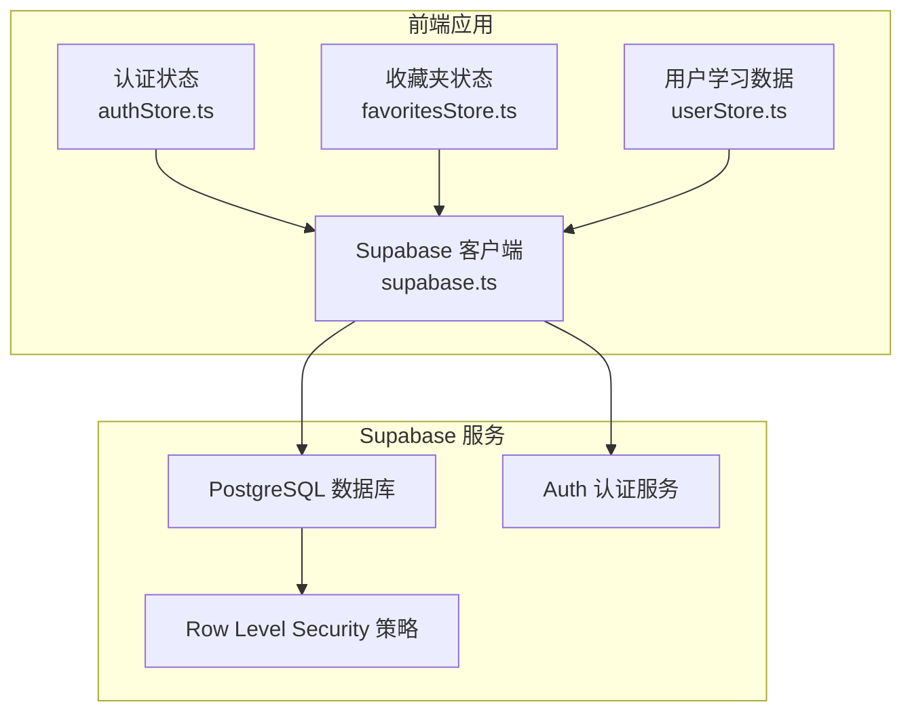
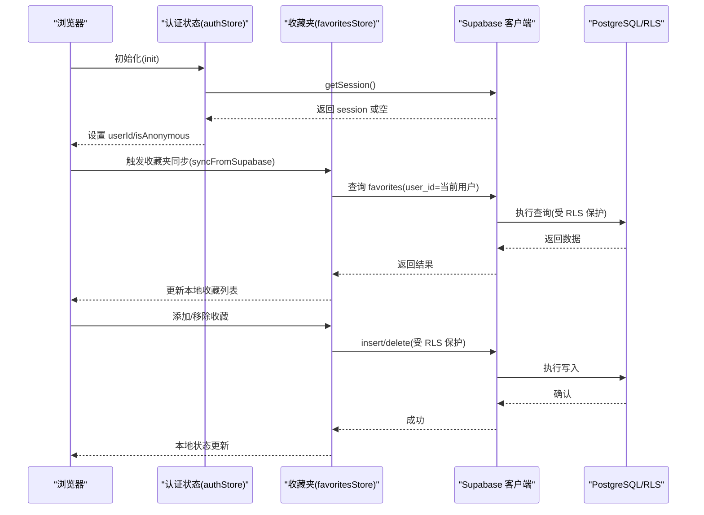
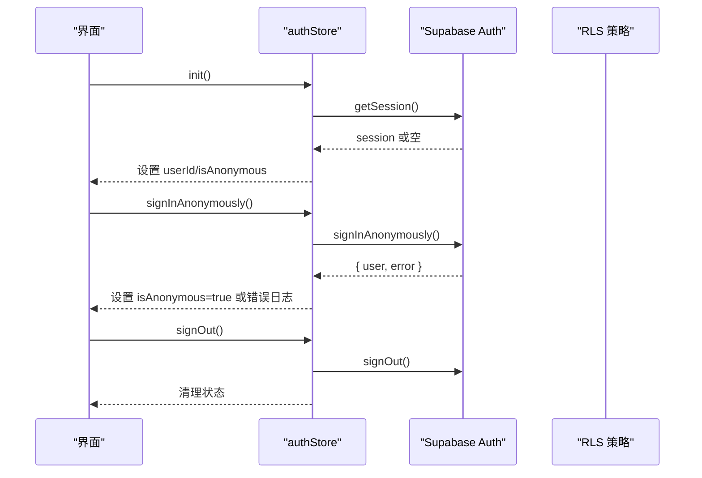
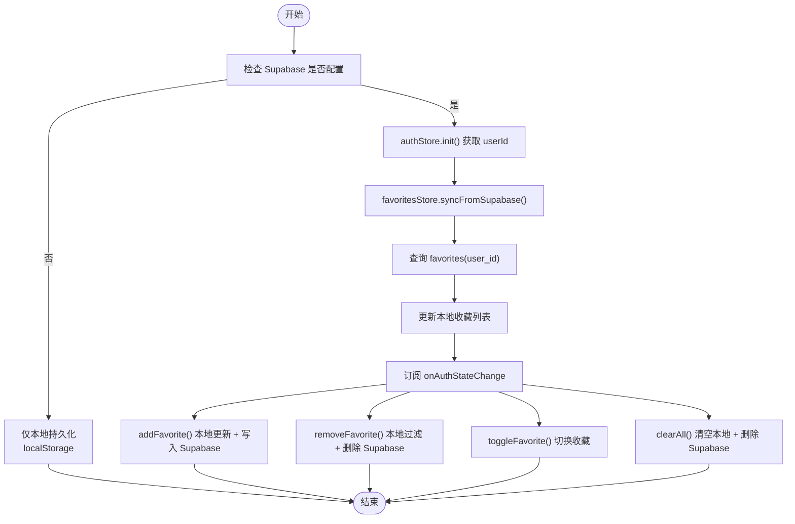
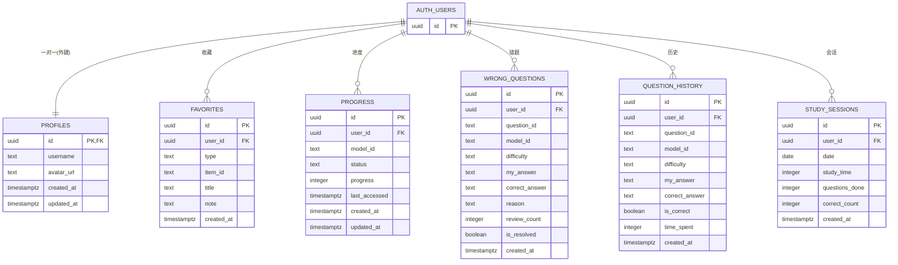
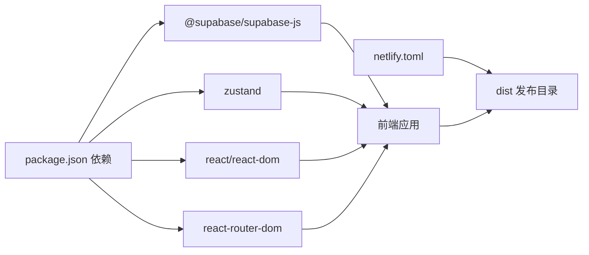

# 数据库集成

<cite>
**本文引用的文件**
- [supabase.ts](file://src/lib/supabase.ts)
- [supabase_schema.sql](file://supabase_schema.sql)
- [authStore.ts](file://src/stores/authStore.ts)
- [favoritesStore.ts](file://src/stores/favoritesStore.ts)
- [userStore.ts](file://src/stores/userStore.ts)
- [types.ts](file://src/stores/types.ts)
- [index.ts](file://src/stores/index.ts)
- [package.json](file://package.json)
- [netlify.toml](file://netlify.toml)
- [index.ts（问题索引示例）](file://src/data/physics/questions/index.ts)
- [index.ts（问题索引示例）](file://src/data/english/questions/index.ts)
- [index.ts（问题索引示例）](file://src/data/chinese/questions/index.ts)
- [index.ts（问题索引示例）](file://src/data/biology/questions/index.ts)
</cite>

## 目录
1. [简介](#简介)
2. [项目结构](#项目结构)
3. [核心组件](#核心组件)
4. [架构总览](#架构总览)
5. [详细组件分析](#详细组件分析)
6. [依赖分析](#依赖分析)
7. [性能考虑](#性能考虑)
8. [故障排查指南](#故障排查指南)
9. [结论](#结论)
10. [附录](#附录)

## 简介
本文件系统性梳理星耀教育平台的数据库集成方案，围绕 Supabase 云数据库展开，涵盖以下主题：
- 数据库连接与认证配置
- 用户认证系统（登录、匿名访问、登出）
- 权限管理（Row Level Security，RLS）
- 收藏夹数据的存储与同步机制
- 用户数据的 CRUD 操作与实时性
- 数据库模式图与实体关系图
- 数据备份、恢复与迁移最佳实践

## 项目结构
本项目采用前端直连 Supabase 的架构，核心文件分布如下：
- 数据库客户端与配置：src/lib/supabase.ts
- 数据库模式与策略：supabase_schema.sql
- 认证状态管理：src/stores/authStore.ts
- 收藏夹状态管理与同步：src/stores/favoritesStore.ts
- 用户学习数据状态管理：src/stores/userStore.ts
- 类型定义：src/stores/types.ts
- 构建与部署配置：package.json、netlify.toml
- 示例数据文件（用于理解数据结构）：src/data/*/questions/index.ts

图表来源
- [supabase.ts:1-18](file://src/lib/supabase.ts#L1-L18)
- [authStore.ts:1-63](file://src/stores/authStore.ts#L1-L63)
- [favoritesStore.ts:1-172](file://src/stores/favoritesStore.ts#L1-L172)
- [userStore.ts:1-236](file://src/stores/userStore.ts#L1-L236)
- [supabase_schema.sql:1-178](file://supabase_schema.sql#L1-L178)

章节来源
- [supabase.ts:1-18](file://src/lib/supabase.ts#L1-L18)
- [supabase_schema.sql:1-178](file://supabase_schema.sql#L1-L178)
- [authStore.ts:1-63](file://src/stores/authStore.ts#L1-L63)
- [favoritesStore.ts:1-172](file://src/stores/favoritesStore.ts#L1-L172)
- [userStore.ts:1-236](file://src/stores/userStore.ts#L1-L236)
- [package.json:1-86](file://package.json#L1-L86)
- [netlify.toml:1-13](file://netlify.toml#L1-L13)

## 核心组件
- Supabase 客户端封装：负责读取环境变量、创建客户端、启用自动刷新与会话持久化，并暴露 isSupabaseConfigured 判定。
- 认证状态管理：初始化会话、匿名登录、登出；基于 Auth 状态变化驱动收藏夹同步。
- 收藏夹状态管理：本地内存 + Supabase 同步；支持添加、移除、切换、清空；监听认证变化自动拉取。
- 用户学习数据状态管理：维护进度、错题、做题记录与学习统计；提供本地持久化与更新逻辑。

章节来源
- [supabase.ts:1-18](file://src/lib/supabase.ts#L1-L18)
- [authStore.ts:1-63](file://src/stores/authStore.ts#L1-L63)
- [favoritesStore.ts:1-172](file://src/stores/favoritesStore.ts#L1-L172)
- [userStore.ts:1-236](file://src/stores/userStore.ts#L1-L236)

## 架构总览
下图展示从浏览器到 Supabase 的调用链路，以及 RLS 对数据访问的约束。

图表来源
- [authStore.ts:20-37](file://src/stores/authStore.ts#L20-L37)
- [favoritesStore.ts:37-63](file://src/stores/favoritesStore.ts#L37-L63)
- [favoritesStore.ts:82-94](file://src/stores/favoritesStore.ts#L82-L94)
- [favoritesStore.ts:103-114](file://src/stores/favoritesStore.ts#L103-L114)
- [supabase.ts:7-15](file://src/lib/supabase.ts#L7-L15)

## 详细组件分析

### Supabase 客户端与认证配置
- 环境变量读取：从 import.meta.env 读取 VITE_SUPABASE_URL 与 VITE_SUPABASE_ANON_KEY。
- 客户端创建：启用自动刷新令牌、持久化会话、禁用 URL 中的会话检测。
- 配置判定：isSupabaseConfigured 用于分支逻辑（如收藏夹持久化策略）。

章节来源
- [supabase.ts:3-17](file://src/lib/supabase.ts#L3-L17)

### 用户认证系统
- 初始化：获取当前会话，设置 userId 与 isAnonymous。
- 匿名登录：调用 Supabase Auth 的匿名登录接口。
- 登出：调用 signOut 并清理本地状态。
- 行为特点：初始化阶段不强制匿名登录，避免 422；登录/登出事件通过 onAuthStateChange 驱动收藏夹重新同步。

图表来源
- [authStore.ts:20-37](file://src/stores/authStore.ts#L20-L37)
- [authStore.ts:39-55](file://src/stores/authStore.ts#L39-L55)
- [authStore.ts:57-61](file://src/stores/authStore.ts#L57-L61)

章节来源
- [authStore.ts:1-63](file://src/stores/authStore.ts#L1-L63)

### 收藏夹数据存储与同步
- 数据模型：favorites 表，唯一约束 (user_id, type, item_id)，RLS 限制仅本人可读写。
- 同步策略：
  - 初始化：authStore.init 后，favoritesStore 自动拉取当前用户收藏。
  - 本地优先：先更新本地状态，再异步写入 Supabase。
  - 认证变化：onAuthStateChange 触发重新同步。
  - 持久化：未配置 Supabase 时持久化到 localStorage；已配置时以 Supabase 为准。
- 关键操作：addFavorite、removeFavorite、toggleFavorite、clearAll、isFavorited、syncFromSupabase。

图表来源
- [favoritesStore.ts:37-63](file://src/stores/favoritesStore.ts#L37-L63)
- [favoritesStore.ts:65-94](file://src/stores/favoritesStore.ts#L65-L94)
- [favoritesStore.ts:96-114](file://src/stores/favoritesStore.ts#L96-L114)
- [favoritesStore.ts:116-126](file://src/stores/favoritesStore.ts#L116-L126)
- [favoritesStore.ts:134-142](file://src/stores/favoritesStore.ts#L134-L142)
- [favoritesStore.ts:154-171](file://src/stores/favoritesStore.ts#L154-L171)

章节来源
- [favoritesStore.ts:1-172](file://src/stores/favoritesStore.ts#L1-L172)
- [types.ts:1-12](file://src/stores/types.ts#L1-L12)

### 用户学习数据的 CRUD 与统计
- 进度管理：updateProgress/getProgress，维护每个知识点的状态与进度。
- 错题管理：addWrongQuestion/updateWrongQuestion/markAsReviewed/markAsMastered/removeWrongQuestion。
- 做题记录：addQuestionAttempt，维护每次答题的正确性与时长。
- 统计更新：updateLearningStats，按学科聚合做题次数、正确数、错误数、掌握数与模型维度统计。
- 数据持久化：useUserStore 提供部分字段的本地持久化，便于离线体验与快速加载。

章节来源
- [userStore.ts:1-236](file://src/stores/userStore.ts#L1-L236)

### 数据库模式与实体关系
- 模式概览：启用 uuid-ossp 扩展；创建 profiles、favorites、progress、wrong_questions、question_history、study_sessions 等表。
- RLS 策略：为 favorites、progress、wrong_questions、question_history、study_sessions 启用 RLS，并为每个表创建“仅本人可读写”的策略。
- 唯一性约束：favorites(type, item_id)、progress(user_id, model_id)、wrong_questions(user_id, question_id)、study_sessions(user_id, date)。
- 索引：为高频查询字段建立索引，提升查询性能。
- 匿名模式：启用 auth.users 的 RLS，并允许匿名 session 插入，支持匿名访问。

图表来源
- [supabase_schema.sql:12-178](file://supabase_schema.sql#L12-L178)

章节来源
- [supabase_schema.sql:1-178](file://supabase_schema.sql#L1-L178)

### 数据备份、恢复与迁移最佳实践
- 备份
  - 使用 Supabase 后台的 SQL Editor 导出 schema 与数据，或通过项目设置中的备份功能定期导出。
  - 对关键业务表（如 favorites、progress、wrong_questions、question_history、study_sessions）进行周期性导出。
- 恢复
  - 在新环境中先执行 supabase_schema.sql，确保表结构与 RLS 策略就绪。
  - 使用导入工具将备份数据恢复到对应表中；注意 UUID 与外键关系。
- 迁移
  - 字段变更：先在测试环境执行 ALTER TABLE，再逐步灰度到生产；对 RLS 策略进行兼容性校验。
  - 数据迁移：编写迁移脚本，处理旧字段到新字段的映射，保持 user_id 的一致性。
  - 版本控制：将 schema 变更纳入版本管理，配合 Netlify 部署流程进行灰度发布。

章节来源
- [supabase_schema.sql:1-178](file://supabase_schema.sql#L1-L178)
- [netlify.toml:1-13](file://netlify.toml#L1-L13)

## 依赖分析
- 前端依赖：@supabase/supabase-js 用于数据库与认证；zustand 用于状态管理；react-router-dom 等 UI 与路由。
- 构建与部署：Vite 构建，Netlify SPA 回退至 index.html；NODE_VERSION 固定为 18。

图表来源
- [package.json:14-66](file://package.json#L14-L66)
- [netlify.toml:1-13](file://netlify.toml#L1-L13)

章节来源
- [package.json:1-86](file://package.json#L1-L86)
- [netlify.toml:1-13](file://netlify.toml#L1-L13)

## 性能考虑
- 查询优化：为 favorites、progress、wrong_questions、question_history、study_sessions 建立常用查询索引，减少全表扫描。
- RLS 开销：RLS 在每次查询/写入时生效，建议合理设计唯一性约束与索引，避免不必要的策略匹配开销。
- 本地缓存：favoritesStore 采用本地内存 + localStorage（未配置 Supabase 时），减少重复请求。
- 批量写入：在高频写入场景（如做题记录）考虑批量提交，降低网络往返。

## 故障排查指南
- Supabase 未配置
  - 现象：isSupabaseConfigured 为 false，收藏夹仅本地持久化。
  - 排查：检查 VITE_SUPABASE_URL 与 VITE_SUPABASE_ANON_KEY 是否正确注入。
- 匿名登录失败
  - 现象：signInAnonymously 报错或返回 error。
  - 排查：确认 Supabase 项目已启用匿名登录；检查网络与 CORS 设置。
- 收藏不同步
  - 现象：添加/删除收藏后，页面未更新或数据未落库。
  - 排查：确认 authStore.init 已成功获取 userId；检查 favoritesStore 的 onAuthStateChange 订阅是否生效；查看 Supabase 控制台的 RLS 策略是否允许当前用户写入。
- 数据不一致
  - 现象：本地与云端数据不一致。
  - 排查：优先以云端为准；检查 unique 约束冲突（如 favorites 的 (type, item_id)）；必要时执行数据修复脚本。

章节来源
- [supabase.ts:7-15](file://src/lib/supabase.ts#L7-L15)
- [authStore.ts:39-55](file://src/stores/authStore.ts#L39-L55)
- [favoritesStore.ts:154-171](file://src/stores/favoritesStore.ts#L154-L171)

## 结论
本项目通过 Supabase 实现了轻量、可扩展的数据库与认证集成：前端直连 Supabase，结合 RLS 实现细粒度权限控制；使用 Zustand 管理状态并在认证变化时自动同步收藏数据。schema 设计覆盖用户档案、收藏、学习进度、错题、做题历史与学习会话六大核心领域，配合索引与策略保障性能与安全。建议持续完善数据备份与迁移流程，确保在功能演进过程中数据的稳定性与一致性。

## 附录
- 示例数据文件：src/data/*/questions/index.ts 展示了问题数据的组织方式，有助于理解数据结构与 ID 规范，便于与数据库中的 question_id、model_id 等字段对齐。

章节来源
- [index.ts（问题索引示例）:1-15](file://src/data/physics/questions/index.ts#L1-L15)
- [index.ts（问题索引示例）:1-15](file://src/data/english/questions/index.ts#L1-L15)
- [index.ts（问题索引示例）:1-15](file://src/data/chinese/questions/index.ts#L1-L15)
- [index.ts（问题索引示例）:1-15](file://src/data/biology/questions/index.ts#L1-L15)