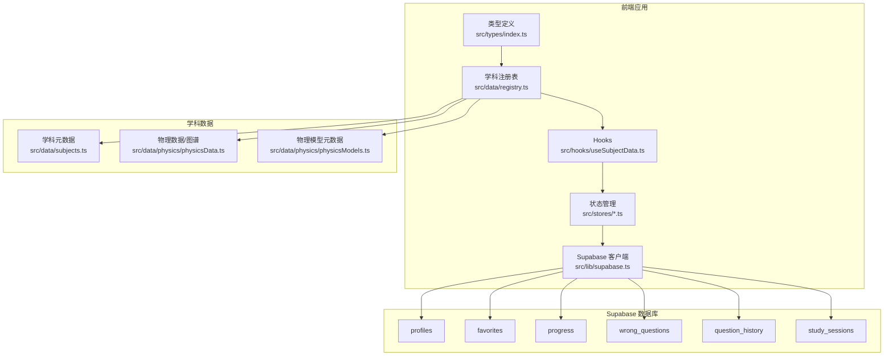
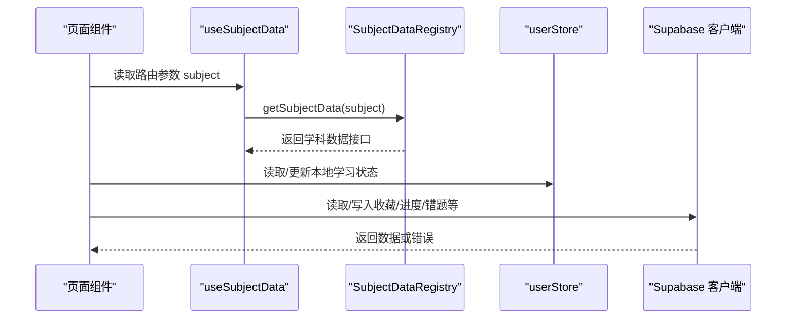
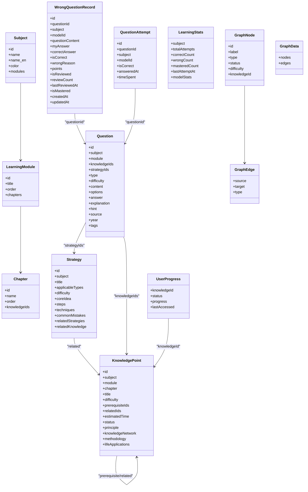
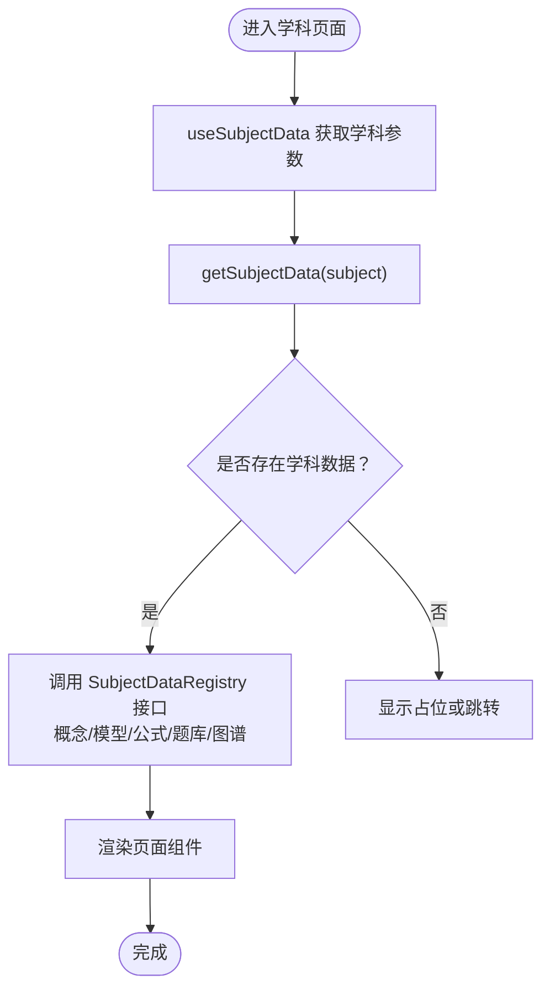
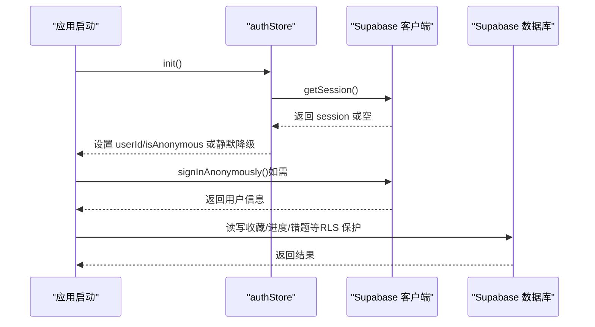
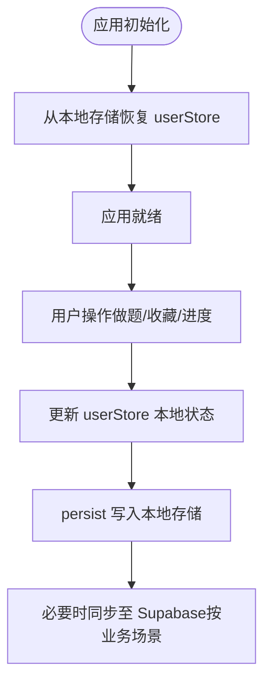
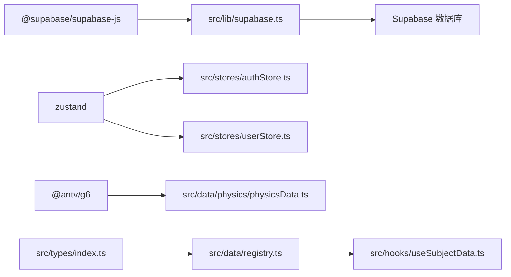
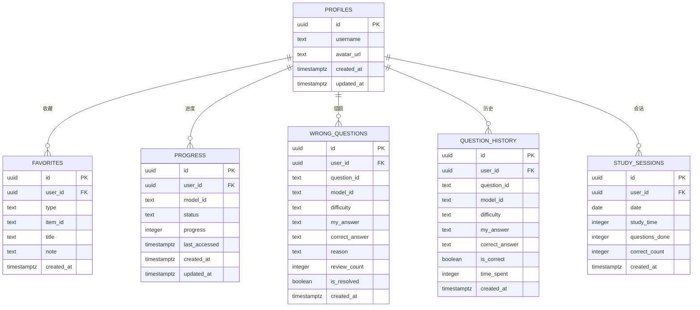

# 数据架构

<cite>
**本文引用的文件**
- [supabase_schema.sql](file://supabase_schema.sql)
- [supabase.ts](file://src/lib/supabase.ts)
- [authStore.ts](file://src/stores/authStore.ts)
- [userStore.ts](file://src/stores/userStore.ts)
- [types.ts](file://src/stores/types.ts)
- [index.ts](file://src/types/index.ts)
- [registry.ts](file://src/data/registry.ts)
- [subjects.ts](file://src/data/subjects.ts)
- [physicsData.ts](file://src/data/physics/physicsData.ts)
- [physicsModels.ts](file://src/data/physics/physicsModels.ts)
- [useSubjectData.ts](file://src/hooks/useSubjectData.ts)
- [ARCHITECTURE.md](file://ARCHITECTURE.md)
- [WORKFLOW.md](file://WORKFLOW.md)
- [package.json](file://package.json)
</cite>

## 目录
1. [简介](#简介)
2. [项目结构](#项目结构)
3. [核心组件](#核心组件)
4. [架构总览](#架构总览)
5. [详细组件分析](#详细组件分析)
6. [依赖分析](#依赖分析)
7. [性能考虑](#性能考虑)
8. [故障排查指南](#故障排查指南)
9. [结论](#结论)
10. [附录](#附录)

## 简介
本文件系统化阐述星耀平台的数据架构，覆盖数据模型设计、学科数据结构、数据注册表机制、Supabase 云数据库集成、用户认证与数据同步、数据访问模式与缓存策略、数据生命周期与保留策略、迁移路径与版本管理、安全与隐私、访问控制，以及数据流图与实体关系图。目标是帮助开发者与产品人员快速理解并高效迭代平台数据层。

## 项目结构
星耀平台采用前端驱动的静态/动态混合架构，数据层以本地 TypeScript 类型与静态学科数据为主，结合 Supabase 实现用户认证、收藏、学习进度、错题与做题历史等个性化数据的云端持久化与同步。核心目录要点如下：
- 数据模型与类型：src/types/index.ts 定义学科、知识点、模型、策略、题目、学习状态等核心类型。
- 学科数据：src/data/ 下按学科组织，包含概念、模型、公式、题库、策略等数据与元数据。
- 注册表：src/data/registry.ts 提供 SubjectDataRegistry 抽象，统一学科数据的查询接口。
- 状态管理：src/stores/ 下的 authStore、userStore 管理认证与本地学习状态，并持久化至浏览器存储。
- Supabase 集成：src/lib/supabase.ts 创建客户端并启用自动刷新与会话持久化。
- 路由与导航：ARCHITECTURE.md 描述路由与组件关系，指导数据访问与渲染路径。

**图表来源**
- [index.ts:1-209](file://src/types/index.ts#L1-L209)
- [registry.ts:1-48](file://src/data/registry.ts#L1-L48)
- [useSubjectData.ts:1-19](file://src/hooks/useSubjectData.ts#L1-L19)
- [authStore.ts:1-63](file://src/stores/authStore.ts#L1-L63)
- [userStore.ts:1-236](file://src/stores/userStore.ts#L1-L236)
- [supabase.ts:1-18](file://src/lib/supabase.ts#L1-L18)
- [subjects.ts:1-30](file://src/data/subjects.ts#L1-L30)
- [physicsData.ts:1-138](file://src/data/physics/physicsData.ts#L1-L138)
- [physicsModels.ts:1-66](file://src/data/physics/physicsModels.ts#L1-L66)
- [supabase_schema.sql:1-178](file://supabase_schema.sql#L1-L178)

**章节来源**
- [ARCHITECTURE.md:1-369](file://ARCHITECTURE.md#L1-L369)
- [package.json:1-86](file://package.json#L1-L86)

## 核心组件
- 数据模型与类型：统一定义学科、模块、章节、知识点、模型、策略、题目、学习状态、认知图谱等核心实体与关系。
- 学科注册表：SubjectDataRegistry 抽象学科数据的查询接口，支持概念、模型、公式、题库、图谱等数据的统一访问。
- 状态管理：authStore 管理认证初始化与匿名登录；userStore 管理本地学习进度、错题、做题历史与统计，并持久化至本地存储。
- Supabase 客户端：创建具备自动刷新与会话持久化的客户端，提供安全访问数据库的能力。
- 学科数据：subjects.ts 提供学科元数据；physicsData.ts 与 physicsModels.ts 提供物理模型与认知图谱数据。

**章节来源**
- [index.ts:1-209](file://src/types/index.ts#L1-L209)
- [registry.ts:1-48](file://src/data/registry.ts#L1-L48)
- [authStore.ts:1-63](file://src/stores/authStore.ts#L1-L63)
- [userStore.ts:1-236](file://src/stores/userStore.ts#L1-L236)
- [supabase.ts:1-18](file://src/lib/supabase.ts#L1-L18)
- [subjects.ts:1-30](file://src/data/subjects.ts#L1-L30)
- [physicsData.ts:1-138](file://src/data/physics/physicsData.ts#L1-L138)
- [physicsModels.ts:1-66](file://src/data/physics/physicsModels.ts#L1-L66)

## 架构总览
星耀平台采用“静态学科数据 + 动态用户数据”的双轨架构：
- 静态学科数据：通过 registry.ts 与各学科数据文件提供概念、模型、公式、题库等数据，路由与页面组件通过 useSubjectData.ts 获取学科上下文与数据。
- 动态用户数据：通过 Supabase 持久化用户档案、收藏、学习进度、错题与做题历史，并基于 Row Level Security（RLS）保障数据隔离与安全。
- 认知图谱：physicsData.ts 生成物理模型的图谱数据，用于可视化学习路径与前置关系。

**图表来源**
- [useSubjectData.ts:1-19](file://src/hooks/useSubjectData.ts#L1-L19)
- [registry.ts:1-48](file://src/data/registry.ts#L1-L48)
- [userStore.ts:1-236](file://src/stores/userStore.ts#L1-L236)
- [supabase.ts:1-18](file://src/lib/supabase.ts#L1-L18)

**章节来源**
- [ARCHITECTURE.md:205-248](file://ARCHITECTURE.md#L205-L248)

## 详细组件分析

### 数据模型与类型体系
- 学科与结构：Subject、LearningModule、Chapter 等定义学科的层级结构与模块关系。
- 知识点：包含难度、前置与关联关系、预计学习时间、状态、原理、知识网络、方法论、生活应用等。
- 模型与策略：模型与策略均包含适用范围、难度、核心思想、步骤、技巧、常见误区、相关资源等。
- 题目：包含类型、难度、内容、选项、答案、解析、提示、来源、年份、标签等。
- 学习状态：UserProgress、WrongQuestionRecord、QuestionAttempt、LearningStats 等支撑个性化学习与统计。
- 认知图谱：GraphNode、GraphEdge、GraphData 用于可视化模块、章节与知识点的关系。

**图表来源**
- [index.ts:1-209](file://src/types/index.ts#L1-L209)

**章节来源**
- [index.ts:1-209](file://src/types/index.ts#L1-L209)

### 学科数据结构与注册表机制
- SubjectDataRegistry：定义学科数据的统一查询接口，包括概念列表、概念元数据、模型章节、公式章节、题库数据、图谱数据等。
- 注册与获取：registerSubject(id, data) 注册学科数据，getSubjectData(id) 获取对应学科数据对象。
- 学科元数据：subjects.ts 提供学科的路由前缀、模型前缀、概念前缀、可用性等元信息。
- 物理数据：physicsData.ts 提供模型列表与认知图谱生成函数；physicsModels.ts 提供物理模型的静态元数据列表。

**图表来源**
- [useSubjectData.ts:1-19](file://src/hooks/useSubjectData.ts#L1-L19)
- [registry.ts:1-48](file://src/data/registry.ts#L1-L48)
- [subjects.ts:1-30](file://src/data/subjects.ts#L1-L30)
- [physicsData.ts:1-138](file://src/data/physics/physicsData.ts#L1-L138)
- [physicsModels.ts:1-66](file://src/data/physics/physicsModels.ts#L1-L66)

**章节来源**
- [registry.ts:1-48](file://src/data/registry.ts#L1-L48)
- [subjects.ts:1-30](file://src/data/subjects.ts#L1-L30)
- [physicsData.ts:1-138](file://src/data/physics/physicsData.ts#L1-L138)
- [physicsModels.ts:1-66](file://src/data/physics/physicsModels.ts#L1-L66)

### Supabase 云数据库集成与认证
- 客户端创建：src/lib/supabase.ts 在环境变量有效时创建 Supabase 客户端，并开启自动刷新与会话持久化。
- 认证初始化：src/stores/authStore.ts 在应用启动时读取会话，若无会话则保持静默降级；支持匿名登录与登出。
- 数据表与策略：supabase_schema.sql 定义 profiles、favorites、progress、wrong_questions、question_history、study_sessions 等表，并为每张表启用 RLS 与相应策略，确保用户只能访问自身数据。
- 保护原则：ARCHITECTURE.md 强调所有 Supabase 调用前需检查 isSupabaseConfigured，未配置时安静降级。

**图表来源**
- [supabase.ts:1-18](file://src/lib/supabase.ts#L1-L18)
- [authStore.ts:1-63](file://src/stores/authStore.ts#L1-L63)
- [supabase_schema.sql:1-178](file://supabase_schema.sql#L1-L178)
- [ARCHITECTURE.md:205-224](file://ARCHITECTURE.md#L205-L224)

**章节来源**
- [supabase.ts:1-18](file://src/lib/supabase.ts#L1-L18)
- [authStore.ts:1-63](file://src/stores/authStore.ts#L1-L63)
- [supabase_schema.sql:1-178](file://supabase_schema.sql#L1-L178)
- [ARCHITECTURE.md:205-224](file://ARCHITECTURE.md#L205-L224)

### 数据访问模式与缓存策略
- 本地缓存：userStore.ts 使用 persist 中间件将用户信息、进度、错题、做题历史与统计持久化至本地存储，减少重复请求与提升首屏体验。
- 类型安全：types.ts 与 src/types/index.ts 提供统一类型定义，确保数据访问的一致性与可维护性。
- 懒加载与按需加载：ARCHITECTURE.md 描述了题库与专区组件的懒加载策略，避免首屏膨胀，提高性能。

**图表来源**
- [userStore.ts:1-236](file://src/stores/userStore.ts#L1-L236)
- [types.ts:1-12](file://src/stores/types.ts#L1-L12)
- [ARCHITECTURE.md:27-44](file://ARCHITECTURE.md#L27-L44)

**章节来源**
- [userStore.ts:1-236](file://src/stores/userStore.ts#L1-L236)
- [types.ts:1-12](file://src/stores/types.ts#L1-L12)
- [ARCHITECTURE.md:27-44](file://ARCHITECTURE.md#L27-L44)

### 数据生命周期、保留策略与归档规则
- 生命周期阶段：数据从“创建”到“使用”再到“归档/清理”的全生命周期管理。
- 保留策略：建议对用户产生的做题历史与错题记录设定保留期限（例如 1 年），到期后进行匿名化归档或删除，以满足隐私合规要求。
- 归档规则：对历史数据进行压缩与索引优化，保留关键统计字段以便审计与报表使用。
- 版本管理：题库与学科数据遵循 WORKFLOW.md 的版本发布流程，确保变更可追溯与可回滚。

**章节来源**
- [WORKFLOW.md:178-232](file://WORKFLOW.md#L178-L232)

### 数据迁移路径与版本管理
- 题库数据工作流：按照 WORKFLOW.md 的步骤在 M0X_questions.ts 中修改数据，检查 index.ts 导入无重复，构建并验证部署。
- URL 管理：每次部署使用新 URL，保留旧 URL 以便紧急回退，回退流程明确且可执行。
- 版本发布：通过构建脚本与自动化流程保证数据与代码的一致性与稳定性。

**章节来源**
- [WORKFLOW.md:178-232](file://WORKFLOW.md#L178-L232)
- [package.json:1-86](file://package.json#L1-L86)

### 数据安全、隐私与访问控制
- 认证与授权：支持匿名登录与会话持久化，未配置时静默降级，避免阻塞用户体验。
- 行级安全策略（RLS）：所有用户相关表均启用 RLS，并为收藏、进度、错题、做题历史、学习会话等表设置“仅本人可见/可写”的策略。
- 匿名模式：启用匿名登录，允许用户在未注册情况下使用平台核心功能。

**章节来源**
- [supabase_schema.sql:171-178](file://supabase_schema.sql#L171-L178)
- [authStore.ts:1-63](file://src/stores/authStore.ts#L1-L63)
- [ARCHITECTURE.md:205-224](file://ARCHITECTURE.md#L205-L224)

## 依赖分析
- 外部依赖：@supabase/supabase-js 提供云端数据库与认证能力；zustand 用于状态管理；AntV G6 用于认知图谱可视化。
- 内部依赖：类型定义被注册表与状态管理广泛复用；学科数据通过注册表暴露统一接口；路由与导航组件依赖注册表与状态管理。

**图表来源**
- [package.json:14-66](file://package.json#L14-L66)
- [supabase.ts:1-18](file://src/lib/supabase.ts#L1-L18)
- [authStore.ts:1-63](file://src/stores/authStore.ts#L1-L63)
- [userStore.ts:1-236](file://src/stores/userStore.ts#L1-L236)
- [physicsData.ts:1-138](file://src/data/physics/physicsData.ts#L1-L138)
- [index.ts:1-209](file://src/types/index.ts#L1-L209)
- [registry.ts:1-48](file://src/data/registry.ts#L1-L48)
- [useSubjectData.ts:1-19](file://src/hooks/useSubjectData.ts#L1-L19)

**章节来源**
- [package.json:14-66](file://package.json#L14-L66)

## 性能考虑
- 懒加载与按需加载：题库与专区组件采用懒加载，减少首屏资源压力。
- 本地持久化：userStore 使用 persist 中间件，降低重复请求与网络开销。
- 索引优化：数据库为常用查询字段建立索引，提升查询性能。
- 图谱渲染：认知图谱使用 G6，建议在大数据量时进行分层渲染与交互优化。

**章节来源**
- [ARCHITECTURE.md:27-44](file://ARCHITECTURE.md#L27-L44)
- [supabase_schema.sql:160-169](file://supabase_schema.sql#L160-L169)

## 故障排查指南
- Supabase 未配置：检查环境变量是否正确设置，未配置时所有 Supabase 调用应静默降级。
- 认证异常：确认 authStore.init 是否在应用启动时调用；匿名登录失败时查看控制台错误信息。
- 数据不一致：核对 userStore 的本地状态与云端数据同步策略；必要时清理本地存储并重新登录。
- 题库数据未更新：按照 WORKFLOW.md 的步骤检查题库文件与汇总导出，重新构建并验证部署。

**章节来源**
- [ARCHITECTURE.md:205-224](file://ARCHITECTURE.md#L205-L224)
- [WORKFLOW.md:203-232](file://WORKFLOW.md#L203-L232)

## 结论
星耀平台的数据架构以清晰的类型体系为基础，结合静态学科数据与 Supabase 动态用户数据，实现了高性能、可扩展且安全的学习数据管理。通过注册表抽象、状态持久化与行级安全策略，平台在保障用户体验的同时兼顾了数据隐私与合规。未来可在数据生命周期治理、图谱渲染性能与题库版本管理方面持续优化。

## 附录

### 实体关系图（ER）

**图表来源**
- [supabase_schema.sql:11-178](file://supabase_schema.sql#L11-L178)