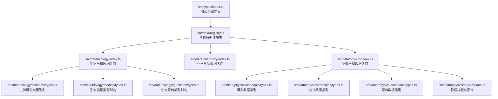
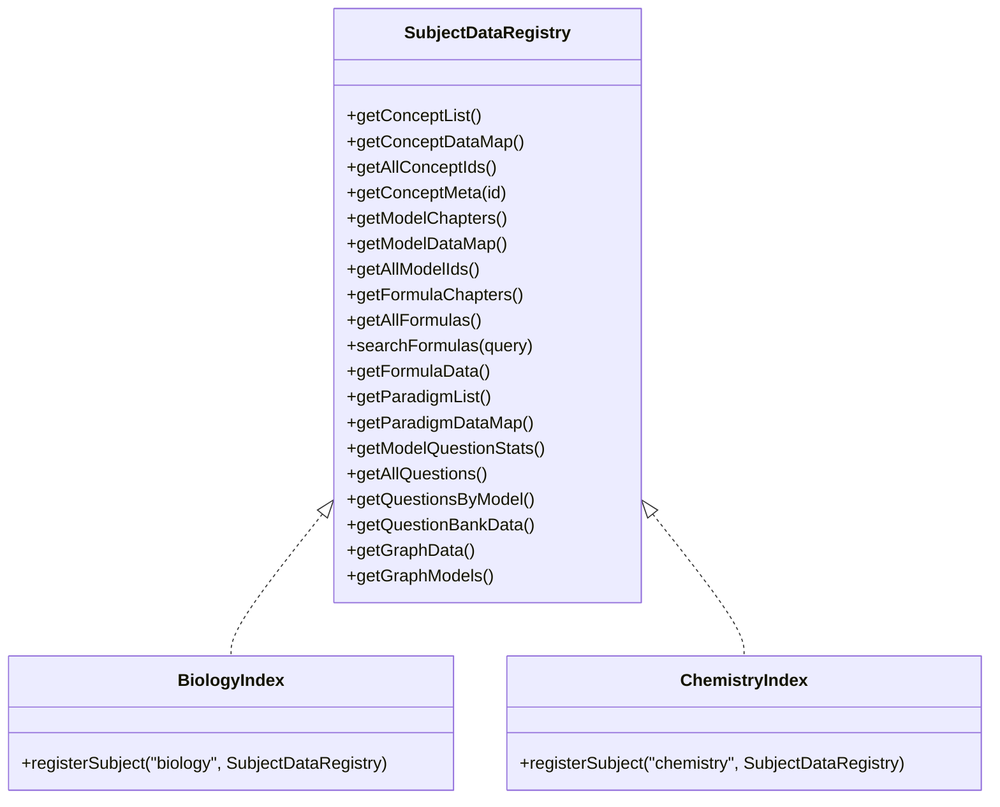
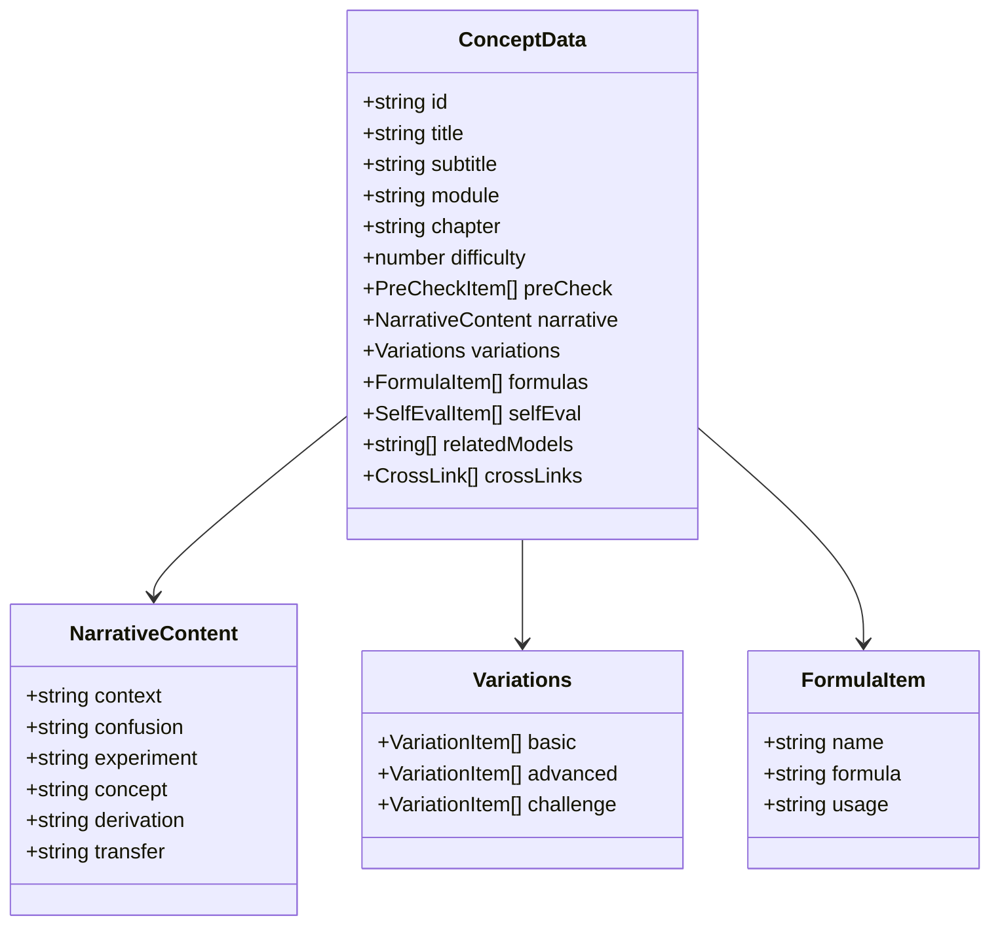
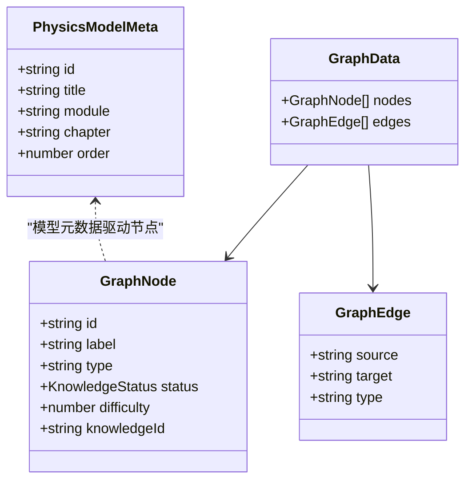
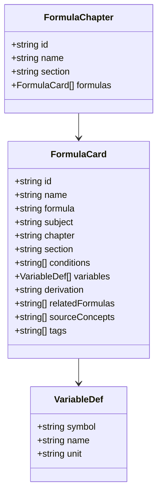
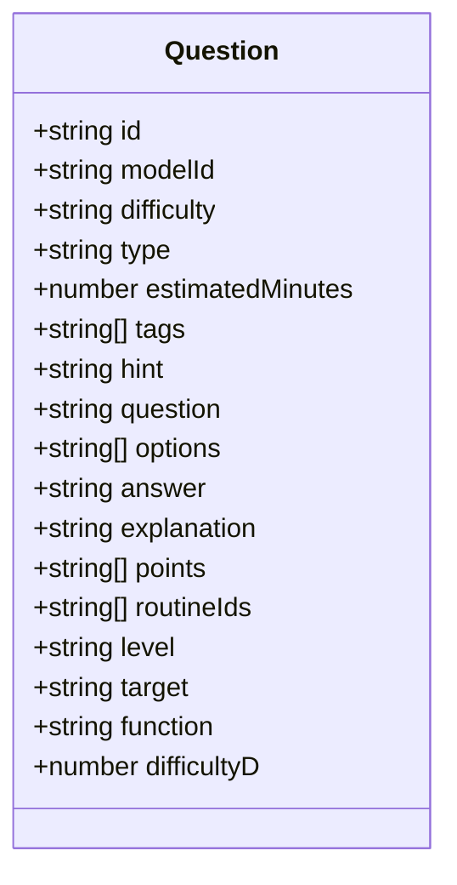
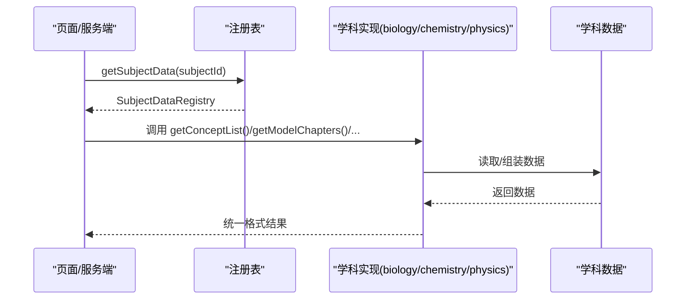
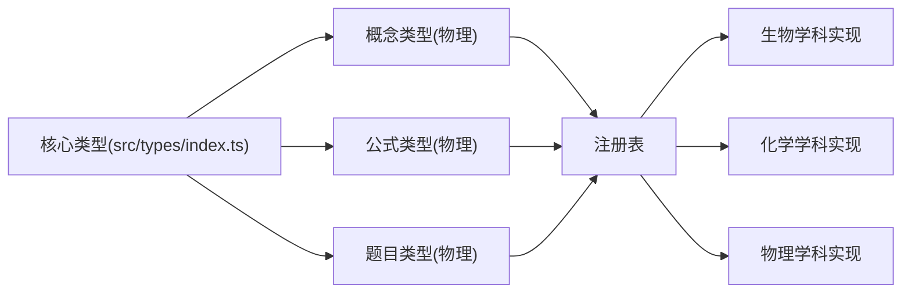

# 数据模型设计

<cite>
**本文引用的文件**
- [src/types/index.ts](file://src/types/index.ts)
- [src/data/registry.ts](file://src/data/registry.ts)
- [src/data/physics/concepts/types.ts](file://src/data/physics/concepts/types.ts)
- [src/data/physics/formulas/types.ts](file://src/data/physics/formulas/types.ts)
- [src/data/physics/questions/types.ts](file://src/data/physics/questions/types.ts)
- [src/data/physics/physicsData.ts](file://src/data/physics/physicsData.ts)
- [src/data/physics/physicsModels.ts](file://src/data/physics/physicsModels.ts)
- [src/data/biology/index.ts](file://src/data/biology/index.ts)
- [src/data/biology/concepts/types.ts](file://src/data/biology/concepts/types.ts)
- [src/data/biology/models/types.ts](file://src/data/biology/models/types.ts)
- [src/data/biology/questions/types.ts](file://src/data/biology/questions/types.ts)
- [src/data/chemistry/index.ts](file://src/data/chemistry/index.ts)
</cite>

## 目录
1. [引言](#引言)
2. [项目结构](#项目结构)
3. [核心组件](#核心组件)
4. [架构总览](#架构总览)
5. [详细组件分析](#详细组件分析)
6. [依赖分析](#依赖分析)
7. [性能考虑](#性能考虑)
8. [故障排查指南](#故障排查指南)
9. [结论](#结论)
10. [附录](#附录)

## 引言
本文件系统化梳理星耀平台的学科数据模型设计，聚焦“统一类型定义与接口规范”，覆盖概念数据、模型数据、公式数据、题目数据等核心数据类型，并阐明其继承关系与扩展机制。文档同时给出字段定义、数据类型约束、业务规则、验证与错误处理建议，以及各学科模型的设计原则与命名规范，帮助开发者在多学科场景下保持一致的数据契约与可维护性。

## 项目结构
星耀平台采用“学科域内聚、统一类型外显”的组织方式：
- 核心类型集中于 src/types/index.ts，定义学科代码、学习模块、知识点、策略、题目、学习状态、认知图谱等通用数据结构。
- 各学科通过 src/data/<subject>/index.ts 暴露 SubjectDataRegistry 接口，实现概念、模型、公式、题目、图谱等数据的注册与查询。
- 物理作为范例，提供完整的概念、公式、题目、模型清单与认知图谱生成逻辑；生物、化学等学科遵循相同模式，通过类型别名复用物理模型以保证一致性。

图表来源
- [src/types/index.ts:1-209](file://src/types/index.ts#L1-L209)
- [src/data/registry.ts:1-48](file://src/data/registry.ts#L1-L48)
- [src/data/biology/index.ts:1-150](file://src/data/biology/index.ts#L1-L150)
- [src/data/chemistry/index.ts:1-186](file://src/data/chemistry/index.ts#L1-L186)
- [src/data/physics/concepts/types.ts:1-78](file://src/data/physics/concepts/types.ts#L1-L78)
- [src/data/physics/formulas/types.ts:1-30](file://src/data/physics/formulas/types.ts#L1-L30)
- [src/data/physics/questions/types.ts:1-35](file://src/data/physics/questions/types.ts#L1-L35)
- [src/data/physics/physicsData.ts:1-138](file://src/data/physics/physicsData.ts#L1-L138)

章节来源
- [src/types/index.ts:1-209](file://src/types/index.ts#L1-L209)
- [src/data/registry.ts:1-48](file://src/data/registry.ts#L1-L48)

## 核心组件
本节对统一类型定义进行深入解读，涵盖学科、学习模块、知识点、策略、题目、学习状态与认知图谱等核心数据结构。

- 学科与结构
  - SubjectCode/SubjectName：限定学科枚举与中文名称，确保跨模块一致引用。
  - Subject/LearningModule/Chapter：描述学科的模块化组织，便于导航与内容编排。
- 知识点
  - KnowledgePoint：包含学科、模块、章节、难度、前置与关联知识、预计学习时长、状态、原理区段、知识网络、方法论、生活应用等字段。
  - PrincipleSection：知识点的叙事结构（情境、困惑、实验、概念、推导、应用）。
  - KnowledgeNetwork/KnowledgeNode/KnowledgeEdge：知识点的图结构表示，支持前置关系与扩展关系建模。
  - Methodology/LifeApplication：学习方法与生活应用条目。
- 解题套路
  - Strategy/StrategyStep：套路标题、适用类型、难度、核心思想、步骤、技巧、常见误区、关联套路与知识、模板题等。
- 题目
  - Question/QuestionOption：题目主体、选项、答案、解析、提示、来源、年份、标签等；支持单选、多选、填空、计算等类型。
- 学习状态
  - UserProgress/WrongQuestionRecord/QuestionAttempt：学习进度、错题记录、答题尝试与统计。
  - ModelStat/LearningStats：按模型维度的统计聚合。
- 认知图谱
  - GraphNode/GraphEdge/GraphData：模块、章节、知识点节点与前置/包含/关联边，支撑学习路径与能力画像。

章节来源
- [src/types/index.ts:10-209](file://src/types/index.ts#L10-L209)

## 架构总览
星耀平台采用“统一类型 + 学科注册表”的架构：
- 统一类型：所有学科共享同一套核心类型，保证跨学科一致性与互操作性。
- 注册表：SubjectDataRegistry 抽象出学科数据的统一访问接口，具体学科通过 index.ts 实现该接口，暴露概念、模型、公式、题目、图谱等数据。
- 扩展机制：新学科只需实现 SubjectDataRegistry 的方法，即可无缝接入平台；类型别名可复用物理模型，降低重复成本。

图表来源
- [src/data/registry.ts:4-38](file://src/data/registry.ts#L4-L38)
- [src/data/biology/index.ts:125-150](file://src/data/biology/index.ts#L125-L150)
- [src/data/chemistry/index.ts:135-183](file://src/data/chemistry/index.ts#L135-L183)

章节来源
- [src/data/registry.ts:1-48](file://src/data/registry.ts#L1-L48)
- [src/data/biology/index.ts:1-150](file://src/data/biology/index.ts#L1-L150)
- [src/data/chemistry/index.ts:1-186](file://src/data/chemistry/index.ts#L1-L186)

## 详细组件分析

### 概念数据模型（ConceptData）
- 设计原则
  - 分块化叙事：前置检测、叙事正文、分层变形、公式卡片、理解度自评、跨学科关联等模块清晰划分，便于教学与学习。
  - 可扩展性：Variations 支持基础/进阶/挑战三层变形，满足不同层次学习需求。
  - 关联性：relatedModels 与 crossLinks 提供模型与跨学科链接，强化知识网络。
- 字段与约束
  - id/title/module/chapter/difficulty：唯一标识、标题、所属模块与章节、难度等级。
  - narrative：包含情境锚定、困惑预设、实验/现象、概念涌现、推导叙事、迁移与应用等子字段，字数范围明确，保障内容质量。
  - formulas：变量符号、名称、单位、使用场景、推导过程、关联公式、来源概念、标签等。
  - selfEval：A/B/C 等级与描述，辅助形成学习反馈闭环。
- 类型别名
  - 生物/化学等学科通过类型别名复用物理概念模型，保持字段一致与行为兼容。

图表来源
- [src/data/physics/concepts/types.ts:51-77](file://src/data/physics/concepts/types.ts#L51-L77)
- [src/data/physics/concepts/types.ts:11-18](file://src/data/physics/concepts/types.ts#L11-L18)
- [src/data/physics/concepts/types.ts:26-30](file://src/data/physics/concepts/types.ts#L26-L30)
- [src/data/physics/concepts/types.ts:32-36](file://src/data/physics/concepts/types.ts#L32-L36)

章节来源
- [src/data/physics/concepts/types.ts:1-78](file://src/data/physics/concepts/types.ts#L1-L78)
- [src/data/biology/concepts/types.ts:1-3](file://src/data/biology/concepts/types.ts#L1-L3)

### 模型数据模型（ModelData）
- 设计原则
  - 模型即知识载体：每个模型对应一个典型物理过程或方法，强调“可迁移”的学习价值。
  - 模块化组织：按模块与章节组织，便于导航与检索。
- 字段与约束
  - id/title/module/chapter/order：唯一标识、标题、模块、章节、顺序号。
  - 物理模型清单与前置关系：提供完整的模型列表与前置关系边，支撑认知图谱生成。
- 类型别名
  - 生物/化学等学科通过类型别名复用物理模型，减少重复定义。

图表来源
- [src/data/physics/physicsModels.ts:12-18](file://src/data/physics/physicsModels.ts#L12-L18)
- [src/data/physics/physicsModels.ts:22-65](file://src/data/physics/physicsModels.ts#L22-L65)
- [src/data/physics/physicsData.ts:81-120](file://src/data/physics/physicsData.ts#L81-L120)

章节来源
- [src/data/physics/physicsModels.ts:1-66](file://src/data/physics/physicsModels.ts#L1-L66)
- [src/data/physics/physicsData.ts:1-138](file://src/data/physics/physicsData.ts#L1-L138)
- [src/data/biology/models/types.ts:1-3](file://src/data/biology/models/types.ts#L1-L3)

### 公式数据模型（FormulaData）
- 设计原则
  - 公式卡片化：每张卡片包含名称、LaTeX 表达式、变量说明、适用条件、推导过程、关联公式、来源概念、标签等，便于检索与收藏。
- 字段与约束
  - id/name/formula/subject/chapter/section：唯一标识、名称、公式、学科、章节、小节。
  - conditions/variables：适用条件数组与变量定义（符号、名称、单位）。
  - derivation/relatedFormulas/sourceConcepts/tags：推导、关联公式、来源概念、标签。
- 应用
  - 物理公式章节与卡片结构，支持搜索与收藏；生物/化学等学科可沿用该结构。

图表来源
- [src/data/physics/formulas/types.ts:10-23](file://src/data/physics/formulas/types.ts#L10-L23)
- [src/data/physics/formulas/types.ts:4-8](file://src/data/physics/formulas/types.ts#L4-L8)
- [src/data/physics/formulas/types.ts:25-30](file://src/data/physics/formulas/types.ts#L25-L30)

章节来源
- [src/data/physics/formulas/types.ts:1-30](file://src/data/physics/formulas/types.ts#L1-L30)
- [src/data/biology/formulas/types.ts:未提供:1-3](file://src/data/biology/formulas/types.ts#L1-L3)

### 题目数据模型（Question）
- 设计原则
  - 多学科适配：物理题目类型与字段在生物/化学等学科通过类型别名复用，保持一致性。
  - 五维筛选：新增能力层级、学习目标、题目功能、六级难度等字段，提升题库可发现性与个性化。
- 字段与约束
  - 物理题目：id/modelId/difficulty/type/estimatedMinutes/tags/hint/question/options/answer/explanation/points/routineIds 等。
  - 新增五维：level/target/function/difficultyD，与 B/J/T 标签建立映射关系。
- 类型别名
  - 生物/化学等学科通过类型别名直接复用物理题目类型。

图表来源
- [src/data/physics/questions/types.ts:4-35](file://src/data/physics/questions/types.ts#L4-L35)
- [src/data/biology/questions/types.ts:1-3](file://src/data/biology/questions/types.ts#L1-L3)

章节来源
- [src/data/physics/questions/types.ts:1-35](file://src/data/physics/questions/types.ts#L1-L35)
- [src/data/biology/questions/types.ts:1-3](file://src/data/biology/questions/types.ts#L1-L3)

### 学科数据注册与扩展（SubjectDataRegistry）
- 设计原则
  - 统一接口：所有学科实现相同的 SubjectDataRegistry，屏蔽内部数据结构差异。
  - 可插拔扩展：新增学科仅需实现注册函数，即可被平台统一调度。
- 方法族
  - 概念：getConceptList/getConceptDataMap/getAllConceptIds/getConceptMeta
  - 模型：getModelChapters/getModelDataMap/getAllModelIds
  - 公式：getFormulaChapters/getAllFormulas/searchFormulas/getFormulaData
  - 套路：getParadigmList/getParadigmDataMap
  - 题库：getModelQuestionStats/getAllQuestions/getQuestionsByModel/getQuestionBankData
  - 图谱：getGraphData/getGraphModels
- 实现示例
  - 生物/化学等学科通过 registerSubject 将自身实现注册到全局注册表，供页面与服务端统一调用。

图表来源
- [src/data/registry.ts:42-48](file://src/data/registry.ts#L42-L48)
- [src/data/biology/index.ts:125-150](file://src/data/biology/index.ts#L125-L150)
- [src/data/chemistry/index.ts:135-183](file://src/data/chemistry/index.ts#L135-L183)

章节来源
- [src/data/registry.ts:1-48](file://src/data/registry.ts#L1-L48)
- [src/data/biology/index.ts:1-150](file://src/data/biology/index.ts#L1-L150)
- [src/data/chemistry/index.ts:1-186](file://src/data/chemistry/index.ts#L1-L186)

## 依赖分析
- 内部依赖
  - 统一类型依赖：所有学科数据均依赖 src/types/index.ts 中的核心类型。
  - 物理范例：物理学科提供完整的概念、公式、题目、模型与图谱实现，其他学科通过类型别名复用。
- 外部依赖
  - 注册表：SubjectDataRegistry 作为抽象接口，被各学科实现依赖。
  - 页面与服务端：通过 getSubjectData 获取学科数据，再调用具体方法族。

图表来源
- [src/types/index.ts:1-209](file://src/types/index.ts#L1-L209)
- [src/data/registry.ts:1-48](file://src/data/registry.ts#L1-L48)
- [src/data/physics/concepts/types.ts:1-78](file://src/data/physics/concepts/types.ts#L1-L78)
- [src/data/physics/formulas/types.ts:1-30](file://src/data/physics/formulas/types.ts#L1-L30)
- [src/data/physics/questions/types.ts:1-35](file://src/data/physics/questions/types.ts#L1-L35)

章节来源
- [src/types/index.ts:1-209](file://src/types/index.ts#L1-L209)
- [src/data/registry.ts:1-48](file://src/data/registry.ts#L1-L48)

## 性能考虑
- 数据结构优化
  - 使用 Map/Record 作为数据映射容器，提升查找效率；避免频繁深拷贝。
  - 将静态清单（如模型元数据）与动态数据分离，减少渲染与序列化开销。
- 查询与缓存
  - 在学科实现中缓存常用查询结果（如概念元数据、模型统计），避免重复计算。
  - 对公式搜索与题目筛选建立索引或预处理，缩短响应时间。
- 渲染与懒加载
  - 页面按需加载学科数据，延迟初始化大型图谱与题库。
  - 使用虚拟列表与分页策略处理大量题目与模型列表。

## 故障排查指南
- 类型不匹配
  - 现象：跨学科类型别名导致字段缺失或类型冲突。
  - 处理：确认别名类型与物理类型一致；若需扩展，优先在物理类型中增加字段，再通过别名同步。
- 数据缺失
  - 现象：getConceptMeta/getAllQuestions 等返回空或异常。
  - 处理：检查学科 index.ts 的数据初始化与注册是否正确；确认数据映射结构与键名一致。
- 图谱生成失败
  - 现象：generatePhysicsGraphData 返回空节点或边。
  - 处理：校验模块/章节/模型清单与前置关系边；确保节点与边的 source/target 存在于已生成节点集合。
- 题库筛选异常
  - 现象：五维筛选字段无效或映射错误。
  - 处理：核对 difficultyD 与 B/J/T 的映射关系；检查 level/target/function 的取值范围与页面绑定。

章节来源
- [src/data/biology/index.ts:26-35](file://src/data/biology/index.ts#L26-L35)
- [src/data/physics/physicsData.ts:81-120](file://src/data/physics/physicsData.ts#L81-L120)
- [src/data/physics/questions/types.ts:30-35](file://src/data/physics/questions/types.ts#L30-L35)

## 结论
星耀平台通过“统一类型 + 学科注册表”的设计，在多学科场景下实现了数据模型的一致性与可扩展性。物理作为范例提供了完整的概念、模型、公式与题目数据结构，生物/化学等学科通过类型别名复用这些结构，显著降低了重复成本并提升了维护效率。建议在新增学科时严格遵循现有接口与命名规范，确保数据质量与用户体验的持续提升。

## 附录
- 设计原则与命名规范
  - 统一类型：所有学科共享 src/types/index.ts 中的核心类型，确保跨学科一致性。
  - 命名规范：字段采用语义化英文命名，缩写仅限广泛接受的领域术语；模块/章节/模型 ID 采用学科前缀与序号组合。
  - 扩展机制：新增字段优先在物理类型中定义，再通过类型别名同步至其他学科。
- 字段定义与约束速览
  - 概念数据：id/title/module/chapter/difficulty、narrative（情境/困惑/实验/概念/推导/迁移）、formulas（变量/单位/使用场景）、selfEval（等级/描述）、relatedModels/crossLinks。
  - 模型数据：id/title/module/chapter/order；前置关系边用于生成认知图谱。
  - 公式数据：id/name/formula/subject/chapter/section、conditions/variables、derivation/relatedFormulas/sourceConcepts/tags。
  - 题目数据：id/modelId/difficulty/type/estimatedMinutes/tags/hint/question/options/answer/explanation/points/routineIds；新增五维字段 level/target/function/difficultyD。
- 验证与默认值建议
  - 必填字段：id、title、module、chapter、difficulty；未提供时应设置默认值或触发校验错误。
  - 数值范围：difficulty 与 difficultyD 应在合法区间内；tags 与 points 应为非空数组。
  - 关系完整性：relatedModels 与 crossLinks 的引用 ID 必须存在于已注册的知识或模型集合。
- 错误处理机制
  - 类型别名：当物理类型变更时，别名类型需同步更新；否则在编译期或运行期暴露类型不匹配。
  - 注册校验：registerSubject 时校验方法签名与返回值结构；缺失或不一致的方法会导致调用失败。
  - 数据校验：在学科实现中对输入数据进行校验，对异常数据记录日志并降级处理（如返回空集或默认值）。