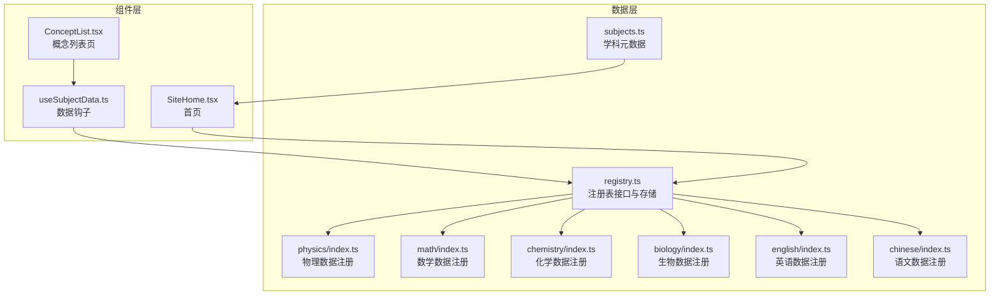
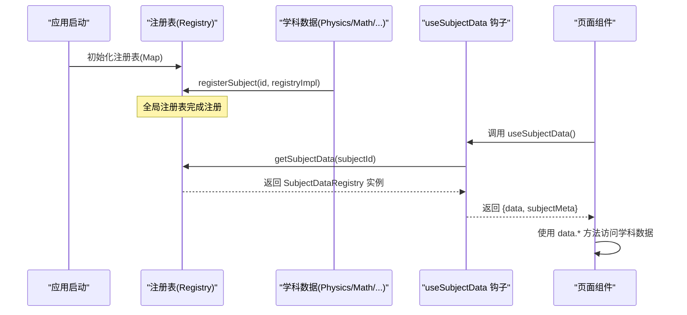
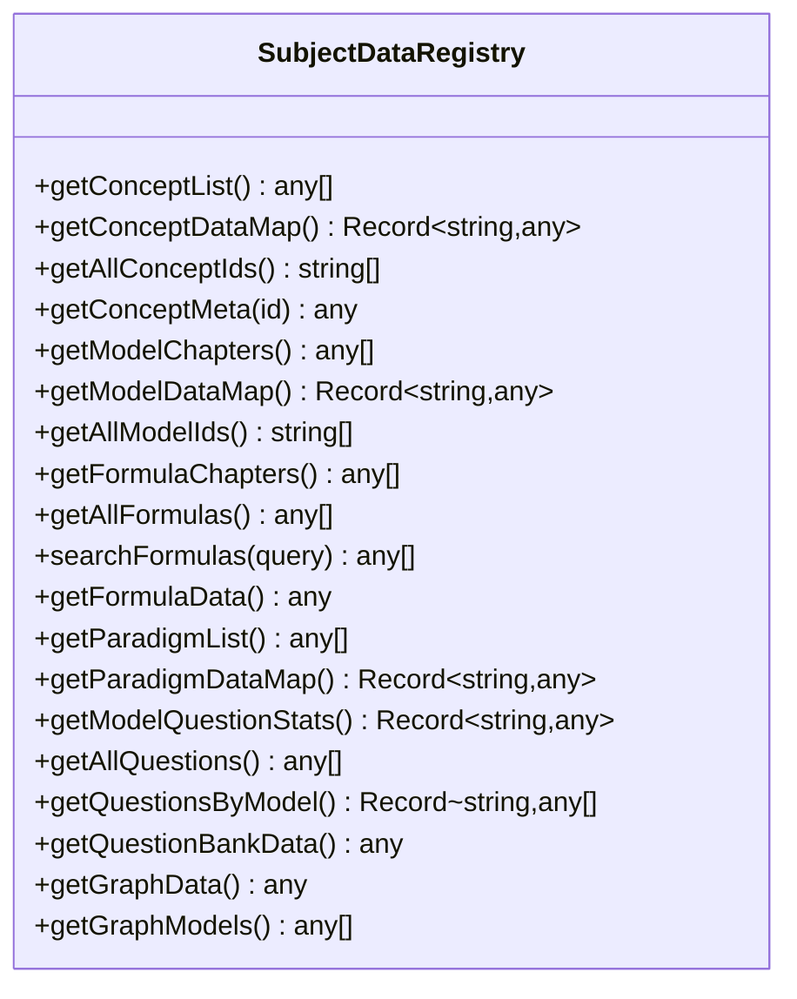
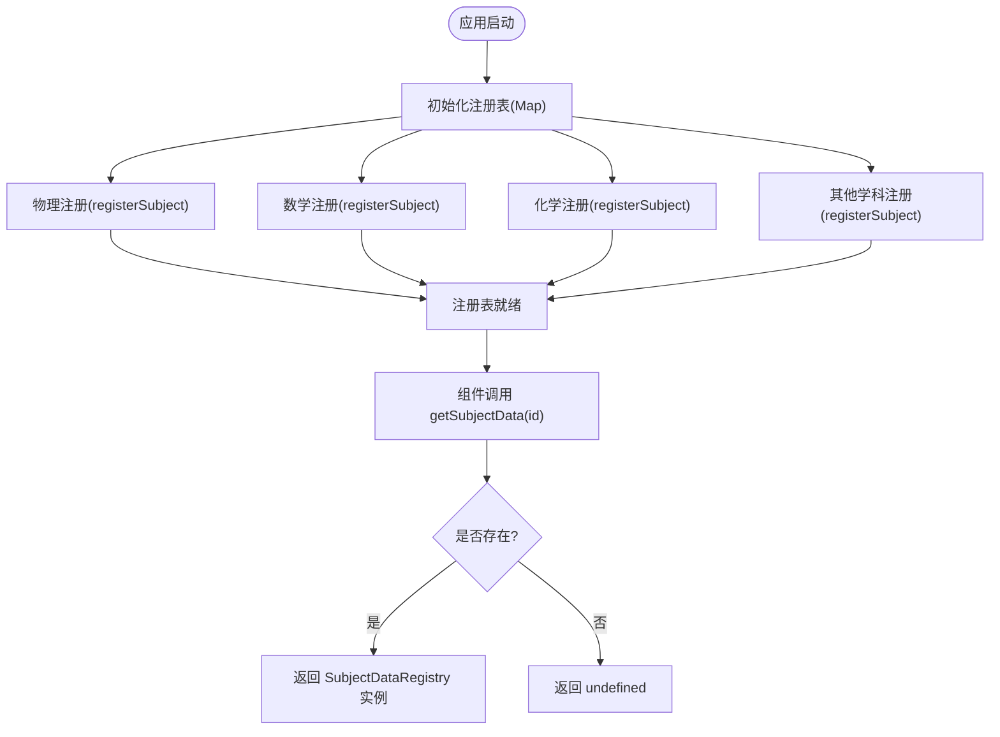
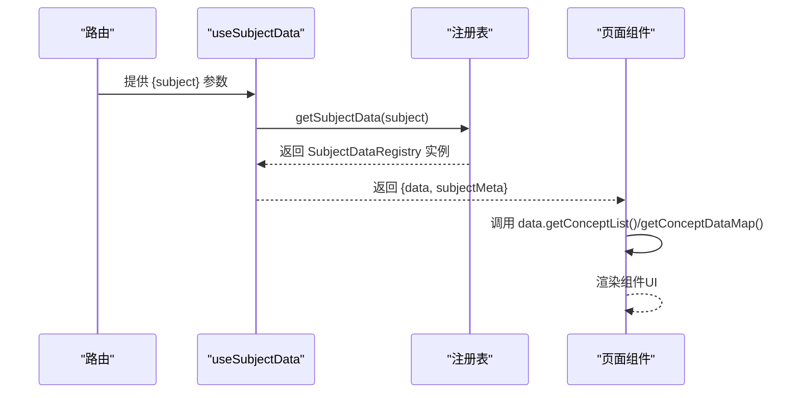
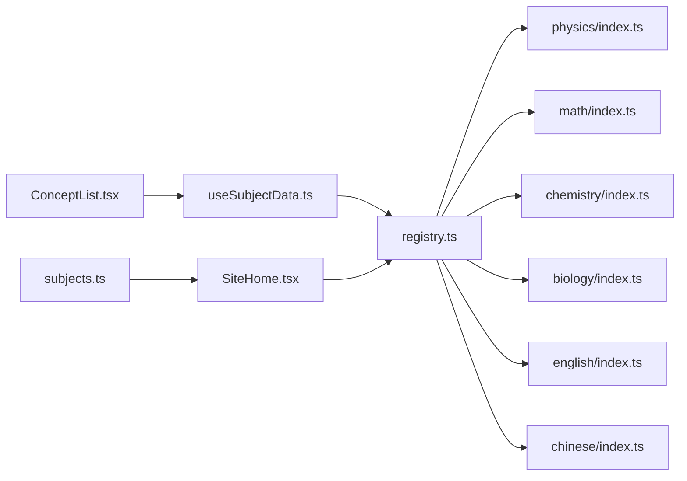

# 数据注册表机制

<cite>
**本文档引用的文件**
- [src/data/registry.ts](file://src/data/registry.ts)
- [src/data/subjects.ts](file://src/data/subjects.ts)
- [src/hooks/useSubjectData.ts](file://src/hooks/useSubjectData.ts)
- [src/data/physics/index.ts](file://src/data/physics/index.ts)
- [src/data/math/index.ts](file://src/data/math/index.ts)
- [src/data/chemistry/index.ts](file://src/data/chemistry/index.ts)
- [src/data/biology/index.ts](file://src/data/biology/index.ts)
- [src/data/english/index.ts](file://src/data/english/index.ts)
- [src/data/chinese/index.ts](file://src/data/chinese/index.ts)
- [src/sections/ConceptList.tsx](file://src/sections/ConceptList.tsx)
- [src/sections/SiteHome.tsx](file://src/sections/SiteHome.tsx)
</cite>

## 目录
1. [简介](#简介)
2. [项目结构](#项目结构)
3. [核心组件](#核心组件)
4. [架构总览](#架构总览)
5. [详细组件分析](#详细组件分析)
6. [依赖分析](#依赖分析)
7. [性能考虑](#性能考虑)
8. [故障排除指南](#故障排除指南)
9. [结论](#结论)
10. [附录](#附录)

## 简介
本文件系统性阐述“数据注册表机制”的设计理念、实现方式与使用方法，重点覆盖以下方面：
- SubjectDataRegistry 接口的设计目标与职责边界
- 注册表的初始化流程、数据缓存策略与性能优化
- getSubjectData 与 registerSubject 的使用方法与最佳实践
- 在组件中的集成方式与数据获取模式（含懒加载与按需访问）
- 多学科数据的统一接入与扩展机制

该机制通过单一注册表集中管理各学科数据的统一访问接口，实现“按需加载、按学科注册、统一查询”的数据访问模式，既保证了前端组件的简洁性，又提升了数据访问的一致性与可维护性。

## 项目结构
围绕数据注册表机制的关键目录与文件如下：
- 数据注册表与接口定义：src/data/registry.ts
- 学科元数据与路由解析：src/data/subjects.ts
- 组件层数据钩子：src/hooks/useSubjectData.ts
- 各学科数据入口与注册：src/data/{subject}/index.ts（physics、math、chemistry、biology、english、chinese）
- 页面组件使用示例：src/sections/ConceptList.tsx、src/sections/SiteHome.tsx

图表来源
- [src/data/registry.ts:1-48](file://src/data/registry.ts#L1-L48)
- [src/data/subjects.ts:1-30](file://src/data/subjects.ts#L1-L30)
- [src/hooks/useSubjectData.ts:1-19](file://src/hooks/useSubjectData.ts#L1-L19)
- [src/data/physics/index.ts:383-431](file://src/data/physics/index.ts#L383-L431)
- [src/data/math/index.ts:126-151](file://src/data/math/index.ts#L126-L151)
- [src/data/chemistry/index.ts:135-183](file://src/data/chemistry/index.ts#L135-L183)
- [src/data/biology/index.ts:125-150](file://src/data/biology/index.ts#L125-L150)
- [src/data/english/index.ts:125-150](file://src/data/english/index.ts#L125-L150)
- [src/data/chinese/index.ts:125-150](file://src/data/chinese/index.ts#L125-L150)
- [src/sections/ConceptList.tsx:23-30](file://src/sections/ConceptList.tsx#L23-L30)
- [src/sections/SiteHome.tsx:59-66](file://src/sections/SiteHome.tsx#L59-L66)

章节来源
- [src/data/registry.ts:1-48](file://src/data/registry.ts#L1-L48)
- [src/data/subjects.ts:1-30](file://src/data/subjects.ts#L1-L30)
- [src/hooks/useSubjectData.ts:1-19](file://src/hooks/useSubjectData.ts#L1-L19)
- [src/data/physics/index.ts:383-431](file://src/data/physics/index.ts#L383-L431)
- [src/data/math/index.ts:126-151](file://src/data/math/index.ts#L126-L151)
- [src/data/chemistry/index.ts:135-183](file://src/data/chemistry/index.ts#L135-L183)
- [src/data/biology/index.ts:125-150](file://src/data/biology/index.ts#L125-L150)
- [src/data/english/index.ts:125-150](file://src/data/english/index.ts#L125-L150)
- [src/data/chinese/index.ts:125-150](file://src/data/chinese/index.ts#L125-L150)
- [src/sections/ConceptList.tsx:23-30](file://src/sections/ConceptList.tsx#L23-L30)
- [src/sections/SiteHome.tsx:59-66](file://src/sections/SiteHome.tsx#L59-L66)

## 核心组件
- SubjectDataRegistry 接口：定义统一的学科数据访问能力，涵盖概念、模型、公式、题库、范式、图谱等维度的查询与统计接口。
- 注册表存储：基于 Map 的全局注册表，键为学科标识（如 physics、math），值为 SubjectDataRegistry 实现。
- 注册函数 registerSubject：在应用启动阶段将各学科数据注册到注册表。
- 查询函数 getSubjectData：在运行时根据学科标识获取对应的 SubjectDataRegistry 实例。
- 组件钩子 useSubjectData：封装路由参数与注册表查询，为页面组件提供便捷的数据访问入口。
- 学科元数据 SUBJECTS：提供学科的路由前缀、颜色、可用性等元信息，辅助页面渲染与导航。

章节来源
- [src/data/registry.ts:4-38](file://src/data/registry.ts#L4-L38)
- [src/data/registry.ts:40-48](file://src/data/registry.ts#L40-L48)
- [src/hooks/useSubjectData.ts:5-19](file://src/hooks/useSubjectData.ts#L5-L19)
- [src/data/subjects.ts:12-29](file://src/data/subjects.ts#L12-L29)

## 架构总览
注册表机制采用“接口抽象 + 工厂注册 + 组件钩子”的三层架构：
- 接口层：SubjectDataRegistry 定义统一能力边界，确保不同学科数据对外行为一致。
- 注册层：各学科在自身 index.ts 中实现 SubjectDataRegistry，并通过 registerSubject 完成注册。
- 访问层：组件通过 useSubjectData 或直接调用 getSubjectData 获取数据，实现按需访问与懒加载。

图表来源
- [src/data/registry.ts:40-48](file://src/data/registry.ts#L40-L48)
- [src/data/physics/index.ts:383-431](file://src/data/physics/index.ts#L383-L431)
- [src/hooks/useSubjectData.ts:10-12](file://src/hooks/useSubjectData.ts#L10-L12)
- [src/sections/ConceptList.tsx:26](file://src/sections/ConceptList.tsx#L26)

## 详细组件分析

### SubjectDataRegistry 接口设计
- 职责边界清晰：涵盖概念、模型、公式、题库、范式、图谱等六大类数据的统一查询接口。
- 数据粒度与返回形式：提供列表、映射、统计、过滤等多种返回形式，满足不同页面的展示需求。
- 扩展性：接口预留新增能力的空间，便于未来扩展新的数据维度。

图表来源
- [src/data/registry.ts:4-38](file://src/data/registry.ts#L4-L38)

章节来源
- [src/data/registry.ts:4-38](file://src/data/registry.ts#L4-L38)

### 注册表初始化与注册机制
- 初始化：注册表内部维护一个 Map，键为学科标识，值为 SubjectDataRegistry 实现。
- 注册：各学科在自身入口文件中实现 SubjectDataRegistry，并调用 registerSubject 完成注册。
- 查询：组件通过 getSubjectData(id) 获取对应学科的数据实例，若不存在则返回 undefined。

图表来源
- [src/data/registry.ts:40-48](file://src/data/registry.ts#L40-L48)
- [src/data/physics/index.ts:383-431](file://src/data/physics/index.ts#L383-L431)
- [src/data/math/index.ts:126-151](file://src/data/math/index.ts#L126-L151)
- [src/data/chemistry/index.ts:135-183](file://src/data/chemistry/index.ts#L135-L183)

章节来源
- [src/data/registry.ts:40-48](file://src/data/registry.ts#L40-L48)
- [src/data/physics/index.ts:383-431](file://src/data/physics/index.ts#L383-L431)
- [src/data/math/index.ts:126-151](file://src/data/math/index.ts#L126-L151)
- [src/data/chemistry/index.ts:135-183](file://src/data/chemistry/index.ts#L135-L183)

### getSubjectData 与 registerSubject 使用方法
- registerSubject(id, registryImpl)：在应用启动阶段调用，将学科数据注册到全局注册表。
- getSubjectData(id)：在运行时根据学科标识获取数据实例，建议配合空值检查使用。
- 最佳实践：
  - 在各学科入口文件末尾调用 registerSubject，确保数据完整加载后再注册。
  - 组件侧使用时先判断返回值是否为空，再进行渲染或数据处理。
  - 对于需要跨页面共享的静态数据（如学科总数、题库规模），可在首页或布局组件中提前查询并缓存。

章节来源
- [src/data/registry.ts:42-47](file://src/data/registry.ts#L42-L47)
- [src/data/physics/index.ts:383-431](file://src/data/physics/index.ts#L383-L431)
- [src/sections/SiteHome.tsx:61-66](file://src/sections/SiteHome.tsx#L61-L66)

### 组件集成与数据获取模式
- useSubjectData 钩子：从路由参数中解析学科标识，调用 getSubjectData 获取数据实例，并返回学科元数据。
- 页面组件使用：在 ConceptList.tsx 中，通过 useSubjectData 获取 data 后，调用 data.getConceptList()、data.getConceptDataMap() 等方法进行数据渲染。
- 懒加载与按需访问：
  - 注册表本身不强制加载数据，仅在调用 getSubjectData 时返回实例。
  - 各学科数据实现通常在模块内部完成数据聚合与缓存，组件侧按需调用具体方法，避免一次性加载所有数据。

图表来源
- [src/hooks/useSubjectData.ts:10-12](file://src/hooks/useSubjectData.ts#L10-L12)
- [src/sections/ConceptList.tsx:26](file://src/sections/ConceptList.tsx#L26)

章节来源
- [src/hooks/useSubjectData.ts:1-19](file://src/hooks/useSubjectData.ts#L1-L19)
- [src/sections/ConceptList.tsx:23-30](file://src/sections/ConceptList.tsx#L23-L30)

### 多学科数据实现对比
- 物理：提供概念、模型、公式、题库、范式、图谱等完整能力，支持难度标注与模块化组织。
- 数学：提供概念、模型、公式、题库、范式等能力，支持难度与目标层级配置。
- 化学：提供概念、模型、公式、题库、范式等能力，支持模块化与难度标注。
- 生物、英语、语文：提供概念、模型、公式、题库、范式等能力，支持难度与模块化组织。

章节来源
- [src/data/physics/index.ts:383-431](file://src/data/physics/index.ts#L383-L431)
- [src/data/math/index.ts:126-151](file://src/data/math/index.ts#L126-L151)
- [src/data/chemistry/index.ts:135-183](file://src/data/chemistry/index.ts#L135-L183)
- [src/data/biology/index.ts:125-150](file://src/data/biology/index.ts#L125-L150)
- [src/data/english/index.ts:125-150](file://src/data/english/index.ts#L125-L150)
- [src/data/chinese/index.ts:125-150](file://src/data/chinese/index.ts#L125-L150)

## 依赖分析
- 组件依赖注册表：页面组件通过 useSubjectData 或直接调用 getSubjectData 获取数据，间接依赖注册表。
- 学科实现依赖注册表：各学科在入口文件中实现 SubjectDataRegistry 并调用 registerSubject。
- 学科元数据依赖：页面组件依赖 SUBJECTS 提供的学科元信息用于渲染与导航。

图表来源
- [src/data/registry.ts:40-48](file://src/data/registry.ts#L40-L48)
- [src/data/physics/index.ts:383-431](file://src/data/physics/index.ts#L383-L431)
- [src/data/math/index.ts:126-151](file://src/data/math/index.ts#L126-L151)
- [src/data/chemistry/index.ts:135-183](file://src/data/chemistry/index.ts#L135-L183)
- [src/data/biology/index.ts:125-150](file://src/data/biology/index.ts#L125-L150)
- [src/data/english/index.ts:125-150](file://src/data/english/index.ts#L125-L150)
- [src/data/chinese/index.ts:125-150](file://src/data/chinese/index.ts#L125-L150)
- [src/hooks/useSubjectData.ts:1-19](file://src/hooks/useSubjectData.ts#L1-L19)
- [src/sections/ConceptList.tsx:26](file://src/sections/ConceptList.tsx#L26)
- [src/sections/SiteHome.tsx:61](file://src/sections/SiteHome.tsx#L61)
- [src/data/subjects.ts:12-29](file://src/data/subjects.ts#L12-L29)

章节来源
- [src/data/registry.ts:40-48](file://src/data/registry.ts#L40-L48)
- [src/hooks/useSubjectData.ts:1-19](file://src/hooks/useSubjectData.ts#L1-L19)
- [src/sections/ConceptList.tsx:26](file://src/sections/ConceptList.tsx#L26)
- [src/sections/SiteHome.tsx:61](file://src/sections/SiteHome.tsx#L61)
- [src/data/subjects.ts:12-29](file://src/data/subjects.ts#L12-L29)

## 性能考虑
- 按需访问：注册表本身不强制加载数据，组件侧按需调用具体方法，避免一次性加载所有数据。
- 数据缓存策略：各学科数据实现通常在模块内部完成数据聚合与缓存，减少重复计算与内存占用。
- 组件渲染优化：页面组件在获取到 data 后，应避免不必要的重新渲染，合理使用 useMemo/useCallback 等优化手段。
- 静态数据预取：对于首页等关键页面，可预先调用 getSubjectData 获取静态指标（如概念数、模型数、题库数）并缓存，提升首屏体验。

## 故障排除指南
- getSubjectData 返回 undefined：检查学科是否已正确注册，确认 registerSubject 调用顺序与学科标识一致。
- 组件渲染异常：确认 useSubjectData 返回的 data 是否为空，为空时应渲染占位组件或提示信息。
- 学科元数据不生效：检查 SUBJECTS 中学科的 available 字段与路由前缀，确保与实际路由一致。
- 数据不一致：确认各学科数据实现中的 getConceptList/getConceptDataMap 等方法返回的数据结构与接口定义一致。

章节来源
- [src/data/registry.ts:42-47](file://src/data/registry.ts#L42-L47)
- [src/hooks/useSubjectData.ts:10-12](file://src/hooks/useSubjectData.ts#L10-L12)
- [src/sections/ConceptList.tsx:28-30](file://src/sections/ConceptList.tsx#L28-L30)
- [src/data/subjects.ts:12-19](file://src/data/subjects.ts#L12-L19)

## 结论
数据注册表机制通过统一接口、集中注册与按需访问，实现了多学科数据的标准化接入与高效使用。其设计兼顾了扩展性与性能，适合在大型前端应用中推广使用。建议在后续迭代中持续完善接口定义、增强错误处理与监控告警，并探索更细粒度的数据懒加载策略。

## 附录
- 使用示例路径
  - 注册学科数据：[src/data/physics/index.ts:383-431](file://src/data/physics/index.ts#L383-L431)
  - 组件获取数据：[src/hooks/useSubjectData.ts:10-12](file://src/hooks/useSubjectData.ts#L10-L12)
  - 页面渲染使用：[src/sections/ConceptList.tsx](file://src/sections/ConceptList.tsx#L26)
  - 首页静态指标预取：[src/sections/SiteHome.tsx:61-66](file://src/sections/SiteHome.tsx#L61-L66)