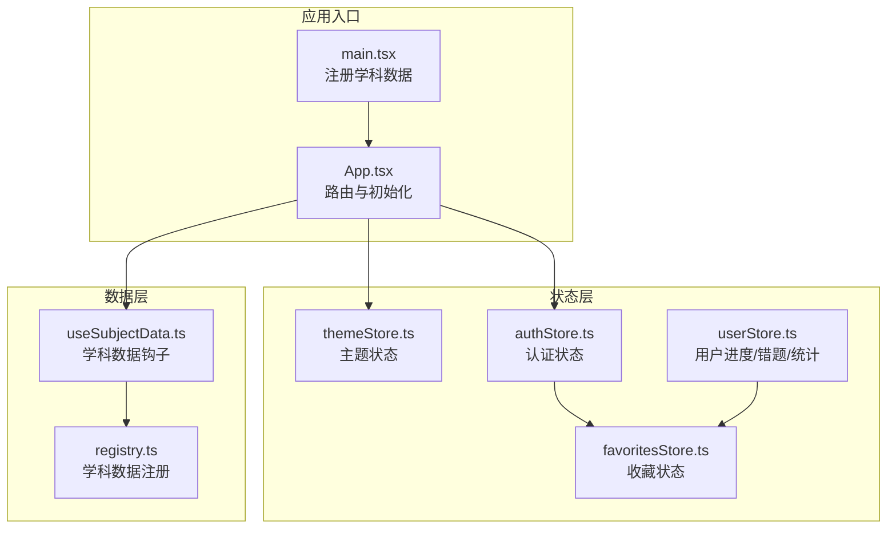
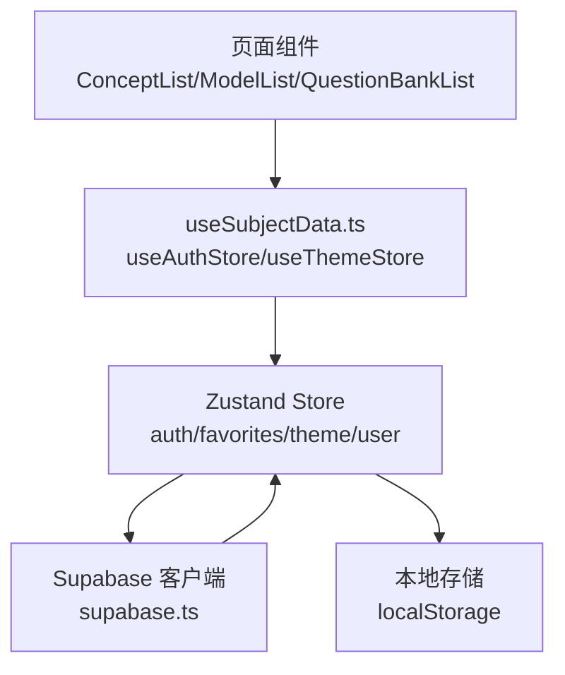
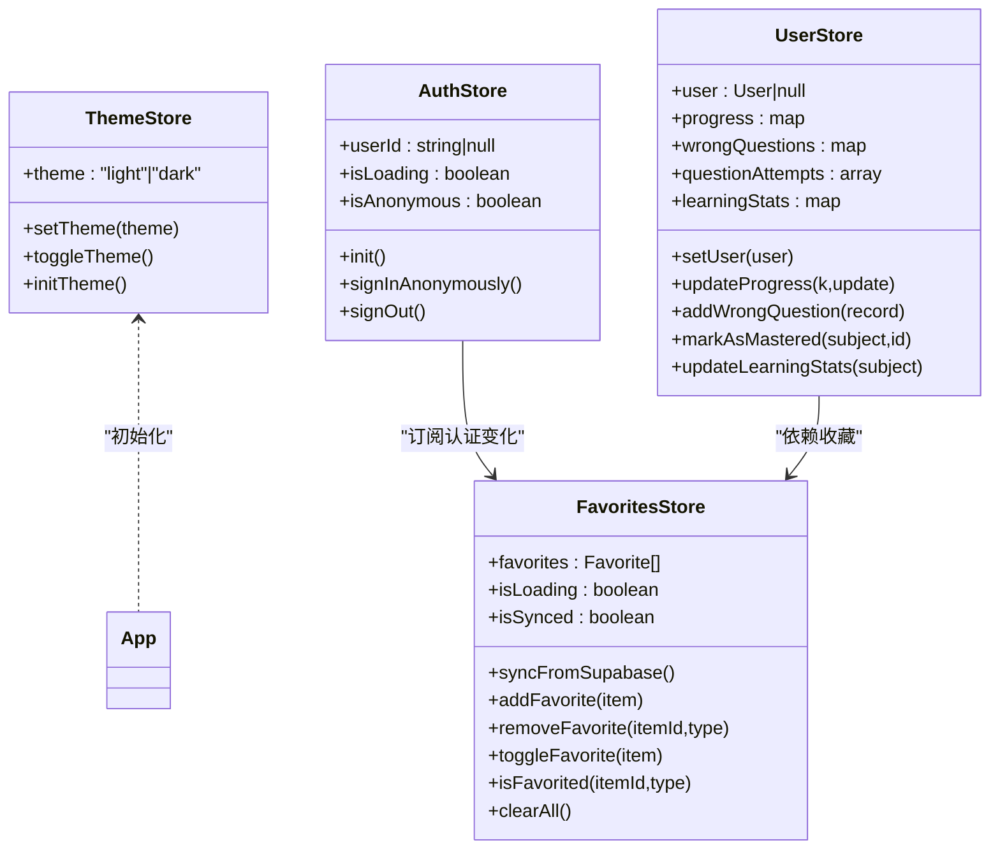
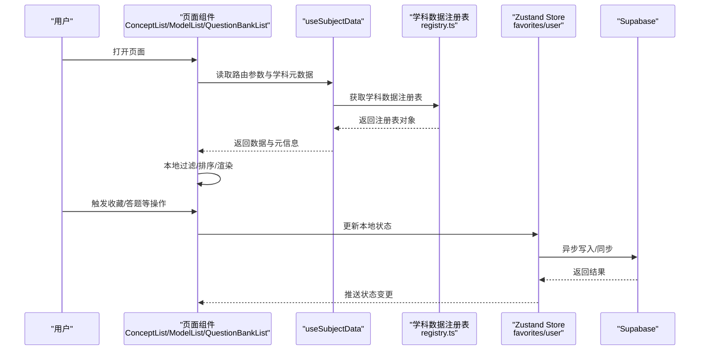
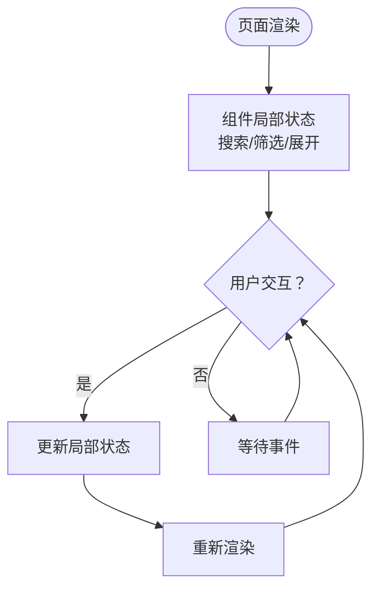
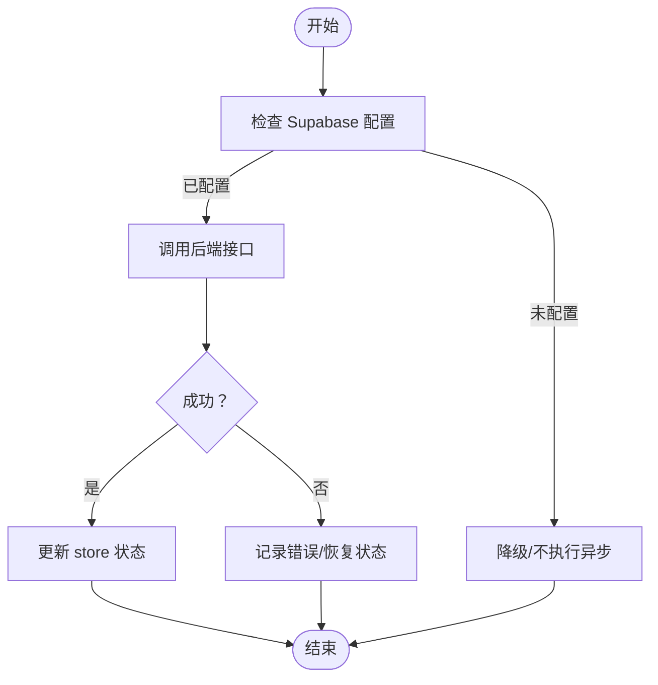
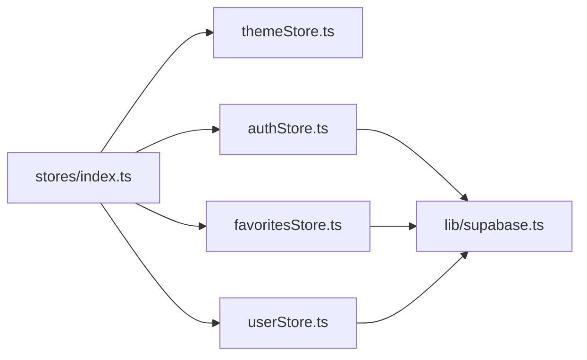

# 数据流管理

<cite>
**本文引用的文件**
- [src/stores/index.ts](file://src/stores/index.ts)
- [src/stores/types.ts](file://src/stores/types.ts)
- [src/stores/authStore.ts](file://src/stores/authStore.ts)
- [src/stores/favoritesStore.ts](file://src/stores/favoritesStore.ts)
- [src/stores/themeStore.ts](file://src/stores/themeStore.ts)
- [src/stores/userStore.ts](file://src/stores/userStore.ts)
- [src/lib/supabase.ts](file://src/lib/supabase.ts)
- [src/hooks/useSubjectData.ts](file://src/hooks/useSubjectData.ts)
- [src/data/registry.ts](file://src/data/registry.ts)
- [src/App.tsx](file://src/App.tsx)
- [src/main.tsx](file://src/main.tsx)
- [src/sections/ConceptList.tsx](file://src/sections/ConceptList.tsx)
- [src/sections/ModelList.tsx](file://src/sections/ModelList.tsx)
- [src/sections/QuestionBankList.tsx](file://src/sections/QuestionBankList.tsx)
</cite>

## 目录
1. [引言](#引言)
2. [项目结构](#项目结构)
3. [核心组件](#核心组件)
4. [架构总览](#架构总览)
5. [详细组件分析](#详细组件分析)
6. [依赖分析](#依赖分析)
7. [性能考虑](#性能考虑)
8. [故障排查指南](#故障排查指南)
9. [结论](#结论)

## 引言
本文件系统化梳理星耀平台的数据流与状态管理模式，重点覆盖以下方面：
- Zustand 状态管理的实现与数据同步机制
- 组件间的数据传递方式、状态提升与局部状态管理策略
- 数据的获取、处理、存储与更新流程，含异步加载与错误处理
- 数据流图与状态流转图，展示从用户操作到数据更新的完整路径
- 性能优化策略：缓存、批量更新与防抖

## 项目结构
星耀平台采用“路由驱动 + 懒加载 + 数据注册”的前端架构。应用入口在 main 中注册各学科数据，App 负责路由与初始化；页面组件通过 hooks 获取主题、认证与学科数据；Zustand store 提供全局状态与持久化。

图表来源
- [src/main.tsx:1-19](file://src/main.tsx#L1-L19)
- [src/App.tsx:1-174](file://src/App.tsx#L1-L174)
- [src/stores/themeStore.ts:1-37](file://src/stores/themeStore.ts#L1-L37)
- [src/stores/authStore.ts:1-63](file://src/stores/authStore.ts#L1-L63)
- [src/stores/favoritesStore.ts:1-172](file://src/stores/favoritesStore.ts#L1-L172)
- [src/stores/userStore.ts:1-236](file://src/stores/userStore.ts#L1-L236)
- [src/hooks/useSubjectData.ts:1-19](file://src/hooks/useSubjectData.ts#L1-L19)
- [src/data/registry.ts:19-48](file://src/data/registry.ts#L19-L48)

章节来源
- [src/main.tsx:1-19](file://src/main.tsx#L1-L19)
- [src/App.tsx:1-174](file://src/App.tsx#L1-L174)

## 核心组件
- 主题状态：提供主题切换与初始化，支持持久化到本地存储。
- 认证状态：封装 Supabase 会话初始化、匿名登录与登出，暴露加载状态与用户标识。
- 收藏状态：本地优先的收藏列表，支持与 Supabase 同步；监听认证变化自动刷新。
- 用户状态：集中管理用户信息、学习进度、错题记录、题目作答与学习统计，并持久化关键字段。
- 学科数据钩子：根据路由参数获取学科数据注册表，为页面组件提供概念、模型、题库等数据。

章节来源
- [src/stores/themeStore.ts:1-37](file://src/stores/themeStore.ts#L1-L37)
- [src/stores/authStore.ts:1-63](file://src/stores/authStore.ts#L1-L63)
- [src/stores/favoritesStore.ts:1-172](file://src/stores/favoritesStore.ts#L1-L172)
- [src/stores/userStore.ts:1-236](file://src/stores/userStore.ts#L1-L236)
- [src/hooks/useSubjectData.ts:1-19](file://src/hooks/useSubjectData.ts#L1-L19)
- [src/data/registry.ts:19-48](file://src/data/registry.ts#L19-L48)

## 架构总览
星耀平台采用“Zustand 全局状态 + Supabase 同步 + 本地持久化 + 路由懒加载”的混合架构。页面组件通过 hooks 与 store 交互，store 通过 Supabase 客户端与后端同步数据；同时利用 persist 中间件在未配置 Supabase 时回退到本地存储。

图表来源
- [src/sections/ConceptList.tsx:1-139](file://src/sections/ConceptList.tsx#L1-L139)
- [src/sections/ModelList.tsx:1-150](file://src/sections/ModelList.tsx#L1-L150)
- [src/sections/QuestionBankList.tsx:1-412](file://src/sections/QuestionBankList.tsx#L1-L412)
- [src/hooks/useSubjectData.ts:1-19](file://src/hooks/useSubjectData.ts#L1-L19)
- [src/stores/authStore.ts:1-63](file://src/stores/authStore.ts#L1-L63)
- [src/stores/favoritesStore.ts:1-172](file://src/stores/favoritesStore.ts#L1-L172)
- [src/stores/themeStore.ts:1-37](file://src/stores/themeStore.ts#L1-L37)
- [src/stores/userStore.ts:1-236](file://src/stores/userStore.ts#L1-L236)
- [src/lib/supabase.ts:1-18](file://src/lib/supabase.ts#L1-L18)

## 详细组件分析

### Zustand 状态管理与数据同步
- 主题状态
  - 功能：设置/切换主题，初始化时同步 DOM 类名；持久化到本地存储。
  - 关键点：通过文档根元素类名切换深色模式，避免闪烁。
- 认证状态
  - 功能：初始化会话、匿名登录、登出；暴露加载状态与匿名标记。
  - 关键点：在未配置 Supabase 时优雅降级，避免异常。
- 收藏状态
  - 功能：本地收藏列表，支持添加/删除/切换/清空；与 Supabase 同步。
  - 关键点：监听认证状态变化自动同步；未配置 Supabase 时跳过水合。
- 用户状态
  - 功能：用户信息、学习进度、错题、作答与统计；持久化关键字段。
  - 关键点：按学科维度维护统计，支持增量更新与批量计算。

图表来源
- [src/stores/themeStore.ts:1-37](file://src/stores/themeStore.ts#L1-L37)
- [src/stores/authStore.ts:1-63](file://src/stores/authStore.ts#L1-L63)
- [src/stores/favoritesStore.ts:1-172](file://src/stores/favoritesStore.ts#L1-L172)
- [src/stores/userStore.ts:1-236](file://src/stores/userStore.ts#L1-L236)
- [src/App.tsx:1-174](file://src/App.tsx#L1-L174)

章节来源
- [src/stores/themeStore.ts:1-37](file://src/stores/themeStore.ts#L1-L37)
- [src/stores/authStore.ts:1-63](file://src/stores/authStore.ts#L1-L63)
- [src/stores/favoritesStore.ts:1-172](file://src/stores/favoritesStore.ts#L1-L172)
- [src/stores/userStore.ts:1-236](file://src/stores/userStore.ts#L1-L236)

### 数据获取、处理与存储流程
- 页面组件通过 useSubjectData 获取学科数据注册表，再调用注册表提供的方法获取概念、模型、题库等数据。
- 页面内部进行本地过滤、排序与展示，形成“远程数据 + 本地处理”的模式。
- 收藏与用户学习数据通过 Zustand store 与 Supabase 同步，实现跨设备一致。

图表来源
- [src/sections/ConceptList.tsx:1-139](file://src/sections/ConceptList.tsx#L1-L139)
- [src/sections/ModelList.tsx:1-150](file://src/sections/ModelList.tsx#L1-L150)
- [src/sections/QuestionBankList.tsx:1-412](file://src/sections/QuestionBankList.tsx#L1-L412)
- [src/hooks/useSubjectData.ts:1-19](file://src/hooks/useSubjectData.ts#L1-L19)
- [src/data/registry.ts:19-48](file://src/data/registry.ts#L19-L48)
- [src/stores/favoritesStore.ts:1-172](file://src/stores/favoritesStore.ts#L1-L172)
- [src/stores/userStore.ts:1-236](file://src/stores/userStore.ts#L1-L236)
- [src/lib/supabase.ts:1-18](file://src/lib/supabase.ts#L1-L18)

章节来源
- [src/sections/ConceptList.tsx:1-139](file://src/sections/ConceptList.tsx#L1-L139)
- [src/sections/ModelList.tsx:1-150](file://src/sections/ModelList.tsx#L1-L150)
- [src/sections/QuestionBankList.tsx:1-412](file://src/sections/QuestionBankList.tsx#L1-L412)
- [src/hooks/useSubjectData.ts:1-19](file://src/hooks/useSubjectData.ts#L1-L19)
- [src/data/registry.ts:19-48](file://src/data/registry.ts#L19-L48)

### 组件间数据传递与状态策略
- 局部状态：页面组件内部使用 useState 管理搜索、筛选、展开折叠等 UI 状态，降低全局压力。
- 状态提升：用户认证与主题偏好属于跨页面共享的状态，放入 Zustand store。
- 局部状态管理：题库筛选面板的展开/收起、当前筛选项等，均在组件内维护，避免污染全局 store。
- 组件通信：通过路由参数与 hooks 读取学科数据，减少 props drilling。

图表来源
- [src/sections/QuestionBankList.tsx:1-412](file://src/sections/QuestionBankList.tsx#L1-L412)
- [src/sections/ConceptList.tsx:1-139](file://src/sections/ConceptList.tsx#L1-L139)
- [src/sections/ModelList.tsx:1-150](file://src/sections/ModelList.tsx#L1-L150)

章节来源
- [src/sections/QuestionBankList.tsx:1-412](file://src/sections/QuestionBankList.tsx#L1-L412)
- [src/sections/ConceptList.tsx:1-139](file://src/sections/ConceptList.tsx#L1-L139)
- [src/sections/ModelList.tsx:1-150](file://src/sections/ModelList.tsx#L1-L150)

### 异步数据加载与错误处理
- 认证初始化：若未配置 Supabase，则直接降级，不阻塞首屏。
- 收藏同步：请求前设置加载态，捕获异常并恢复状态；成功后标记已同步。
- 用户学习数据：通过 store 内部方法更新，避免直接暴露异步细节给组件。

图表来源
- [src/stores/authStore.ts:20-37](file://src/stores/authStore.ts#L20-L37)
- [src/stores/favoritesStore.ts:37-63](file://src/stores/favoritesStore.ts#L37-L63)
- [src/lib/supabase.ts:1-18](file://src/lib/supabase.ts#L1-L18)

章节来源
- [src/stores/authStore.ts:1-63](file://src/stores/authStore.ts#L1-L63)
- [src/stores/favoritesStore.ts:1-172](file://src/stores/favoritesStore.ts#L1-L172)
- [src/lib/supabase.ts:1-18](file://src/lib/supabase.ts#L1-L18)

## 依赖分析
- store 导出入口：统一导出各 store 的 hook 与初始化函数，便于模块化使用。
- store 间耦合：favoritesStore 依赖 authStore 的用户 ID；userStore 与 favoritesStore 独立，但可被页面组件共同消费。
- 外部依赖：Supabase 客户端按环境变量动态创建；persist 中间件用于本地持久化。

图表来源
- [src/stores/index.ts:1-3](file://src/stores/index.ts#L1-L3)
- [src/stores/authStore.ts:1-63](file://src/stores/authStore.ts#L1-L63)
- [src/stores/favoritesStore.ts:1-172](file://src/stores/favoritesStore.ts#L1-L172)
- [src/stores/userStore.ts:1-236](file://src/stores/userStore.ts#L1-L236)
- [src/lib/supabase.ts:1-18](file://src/lib/supabase.ts#L1-L18)

章节来源
- [src/stores/index.ts:1-3](file://src/stores/index.ts#L1-L3)
- [src/stores/authStore.ts:1-63](file://src/stores/authStore.ts#L1-L63)
- [src/stores/favoritesStore.ts:1-172](file://src/stores/favoritesStore.ts#L1-L172)
- [src/stores/userStore.ts:1-236](file://src/stores/userStore.ts#L1-L236)
- [src/lib/supabase.ts:1-18](file://src/lib/supabase.ts#L1-L18)

## 性能考虑
- 缓存策略
  - 本地持久化：主题与用户关键数据持久化，减少重复初始化成本。
  - 本地优先：收藏在未配置 Supabase 时使用本地存储，避免网络依赖。
- 批量更新
  - 用户学习统计：按学科聚合计算，避免频繁重渲染。
  - 错题管理：批量更新与去重插入，减少无效写入。
- 防抖与节流
  - 页面筛选：建议对搜索输入使用防抖，降低高频过滤带来的重排压力。
- 渲染优化
  - 路由懒加载：题库、竞赛等模块按需加载，缩短首屏时间。
  - 组件拆分：将静态内容与动态内容分离，缩小 re-render 范围。

## 故障排查指南
- Supabase 未配置
  - 现象：认证初始化不生效、收藏无法同步。
  - 处理：确认环境变量是否正确；store 已内置降级逻辑。
- 匿名登录失败
  - 现象：匿名登录报错或无用户 ID。
  - 处理：检查服务端配置与网络；store 已捕获错误并记录日志。
- 收藏不同步
  - 现象：本地添加/删除后刷新丢失。
  - 处理：确认已登录且 Supabase 配置正确；store 已监听认证变化自动同步。
- 学习统计异常
  - 现象：统计数值不更新或不准确。
  - 处理：确保调用更新学习统计的方法；检查作答记录与错题状态。

章节来源
- [src/stores/authStore.ts:39-55](file://src/stores/authStore.ts#L39-L55)
- [src/stores/favoritesStore.ts:21-28](file://src/stores/favoritesStore.ts#L21-L28)
- [src/stores/userStore.ts:179-214](file://src/stores/userStore.ts#L179-L214)

## 结论
星耀平台通过 Zustand 实现轻量高效的全局状态管理，结合 Supabase 的认证与数据同步能力，形成“本地优先 + 远端同步”的稳健数据流。页面组件以 hooks 为中心获取数据，配合局部状态与懒加载策略，兼顾易用性与性能。建议在高频交互场景引入防抖与批处理，持续优化用户体验与系统稳定性。