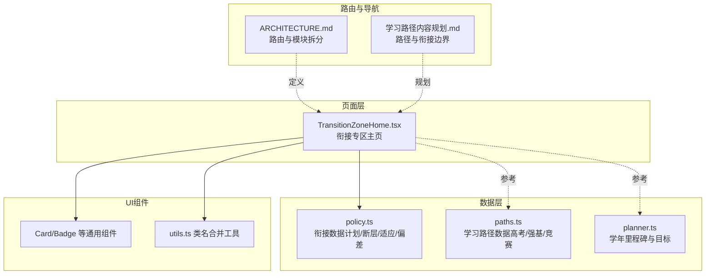
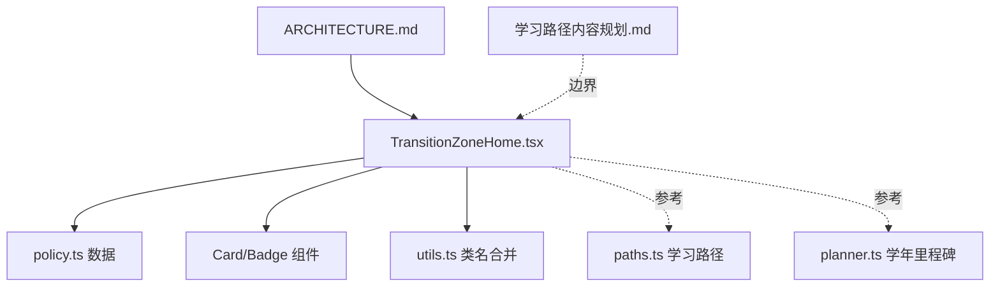
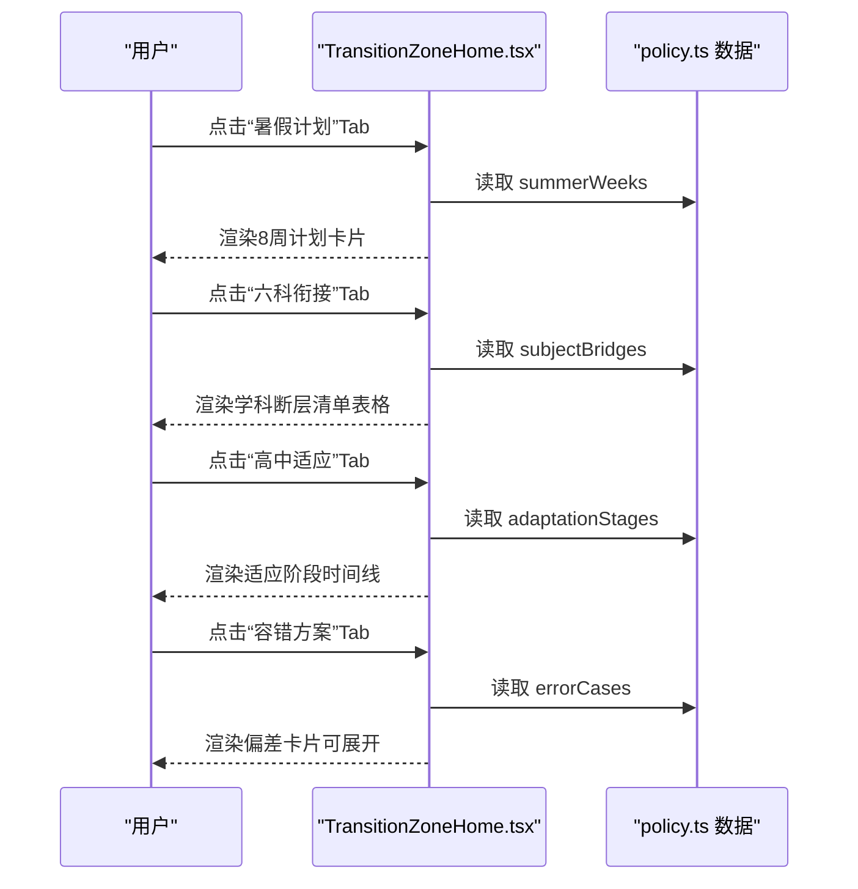
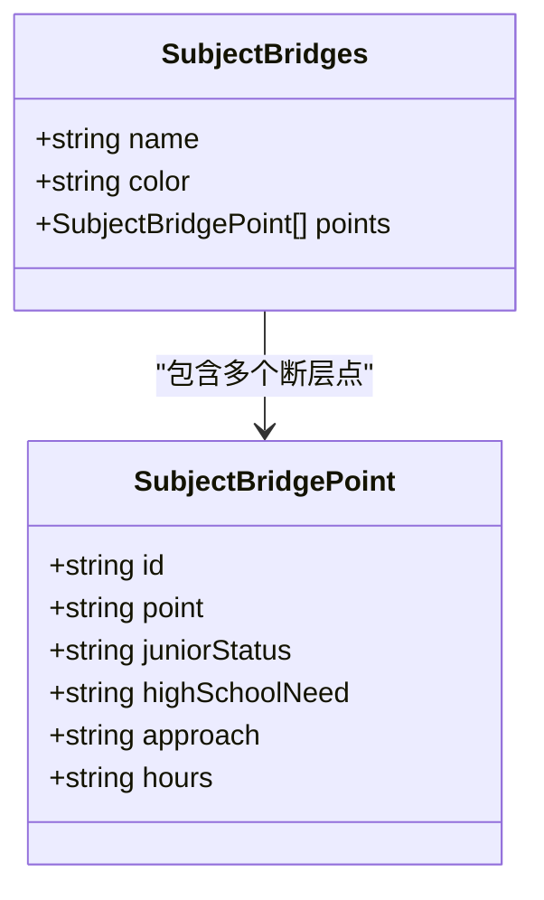
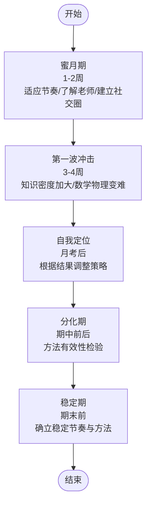
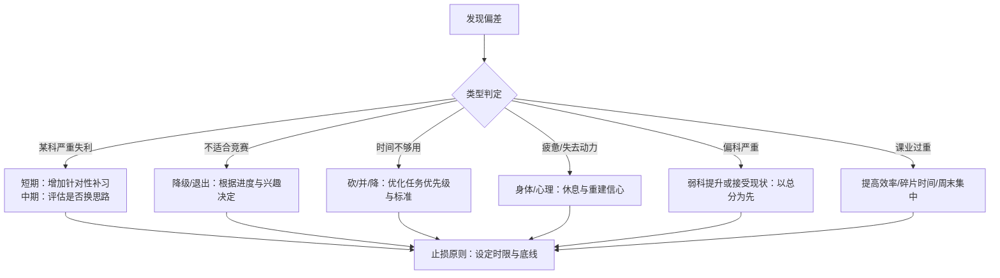
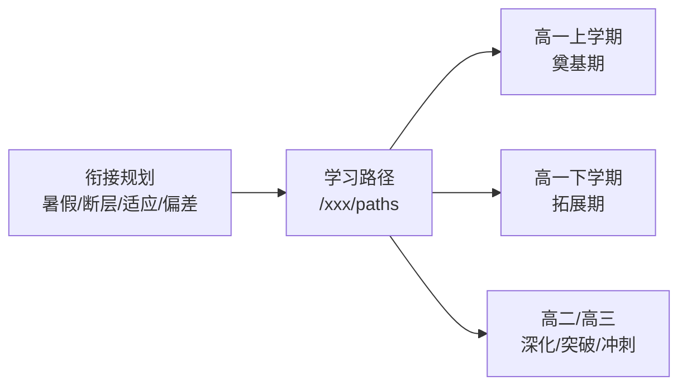
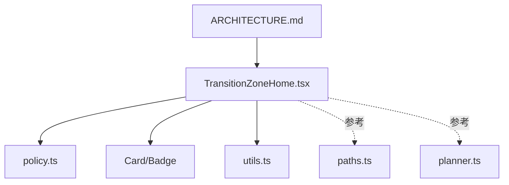

# 初高中衔接

<cite>
**本文引用的文件**
- [src/sections/transition/TransitionZoneHome.tsx](file://src/sections/transition/TransitionZoneHome.tsx)
- [src/data/transition/policy.ts](file://src/data/transition/policy.ts)
- [src/data/tools/paths.ts](file://src/data/tools/paths.ts)
- [src/data/tools/planner.ts](file://src/data/tools/planner.ts)
- [src/sections/tools/PathDetailPage.tsx](file://src/sections/tools/PathDetailPage.tsx)
- [src/components/ui/card.tsx](file://src/components/ui/card.tsx)
- [src/components/ui/badge.tsx](file://src/components/ui/badge.tsx)
- [src/lib/utils.ts](file://src/lib/utils.ts)
- [ARCHITECTURE.md](file://ARCHITECTURE.md)
- [docs/tools/学习路径内容规划.md](file://docs/tools/学习路径内容规划.md)
- [docs/references/reference-case-2-khan-academy.md](file://docs/references/reference-case-2-khan-acadady.md)
</cite>

## 目录
1. [引言](#引言)
2. [项目结构](#项目结构)
3. [核心组件](#核心组件)
4. [架构总览](#架构总览)
5. [详细组件分析](#详细组件分析)
6. [依赖分析](#依赖分析)
7. [性能考量](#性能考量)
8. [故障排查指南](#故障排查指南)
9. [结论](#结论)
10. [附录](#附录)

## 引言
本文件面向“初高中衔接专区”的设计与实现，围绕暑假衔接计划、六科内容衔接、适应性指导三大支柱，系统阐述页面布局、内容组织、学习路径规划与数据结构设计，并给出组件架构、用户交互与教育效果评估机制的分析与建议。文档同时结合平台整体路由与学习路径体系，说明衔接内容与长期学习路径的衔接关系。

## 项目结构
衔接专区位于“过渡”模块，页面组件负责渲染四大板块：暑假8周计划、六科衔接断层清单、高一适应指南与容错方案。数据层提供结构化的计划、断层点、适应阶段与偏差案例。UI层通过卡片、徽标等通用组件统一视觉与交互体验。

**图表来源**
- [src/sections/transition/TransitionZoneHome.tsx:43-383](file://src/sections/transition/TransitionZoneHome.tsx#L43-L383)
- [src/data/transition/policy.ts:44-243](file://src/data/transition/policy.ts#L44-L243)
- [src/data/tools/paths.ts:58-208](file://src/data/tools/paths.ts#L58-L208)
- [src/data/tools/planner.ts:40-105](file://src/data/tools/planner.ts#L40-L105)
- [src/components/ui/card.tsx:5-92](file://src/components/ui/card.tsx#L5-L92)
- [src/components/ui/badge.tsx:7-46](file://src/components/ui/badge.tsx#L7-L46)
- [src/lib/utils.ts:4-6](file://src/lib/utils.ts#L4-L6)
- [ARCHITECTURE.md:46-83](file://ARCHITECTURE.md#L46-L83)
- [docs/tools/学习路径内容规划.md:37-72](file://docs/tools/学习路径内容规划.md#L37-L72)

**章节来源**
- [src/sections/transition/TransitionZoneHome.tsx:43-383](file://src/sections/transition/TransitionZoneHome.tsx#L43-L383)
- [src/data/transition/policy.ts:44-243](file://src/data/transition/policy.ts#L44-L243)
- [ARCHITECTURE.md:46-83](file://ARCHITECTURE.md#L46-L83)
- [docs/tools/学习路径内容规划.md:37-72](file://docs/tools/学习路径内容规划.md#L37-L72)

## 核心组件
- 页面容器与Tab切换：提供“暑假计划/六科衔接/高中适应/容错方案”四个板块的切换与内容渲染。
- 学科断层清单：按物理/数学/化学/生物/语文/英语六个学科展示衔接断层点、现状、需求、衔接方式与时长。
- 高一适应时间线：以阶段化时间线展示高一上学期关键适应期与常见问题。
- 容错与偏差：提供六类典型偏差的触发条件、诊断步骤、调整策略与止损原则。
- UI组件：卡片、徽标等通用组件统一视觉与交互，支持进度标记、展开折叠等交互。

**章节来源**
- [src/sections/transition/TransitionZoneHome.tsx:125-383](file://src/sections/transition/TransitionZoneHome.tsx#L125-L383)
- [src/components/ui/card.tsx:5-92](file://src/components/ui/card.tsx#L5-L92)
- [src/components/ui/badge.tsx:7-46](file://src/components/ui/badge.tsx#L7-L46)

## 架构总览
衔接专区采用“页面组件 + 数据层 + UI组件 + 工具函数”的分层设计。页面组件负责状态管理与渲染，数据层提供结构化数据，UI组件提供可复用的视觉与交互能力，工具函数提供类名合并等辅助能力。路由与导航在整体架构文档中定义，衔接专区通过懒加载方式接入。

**图表来源**
- [src/sections/transition/TransitionZoneHome.tsx:1-23](file://src/sections/transition/TransitionZoneHome.tsx#L1-L23)
- [src/data/transition/policy.ts:1-42](file://src/data/transition/policy.ts#L1-L42)
- [src/data/tools/paths.ts:1-54](file://src/data/tools/paths.ts#L1-L54)
- [src/data/tools/planner.ts:1-38](file://src/data/tools/planner.ts#L1-L38)
- [src/lib/utils.ts:4-6](file://src/lib/utils.ts#L4-L6)
- [ARCHITECTURE.md:46-83](file://ARCHITECTURE.md#L46-L83)
- [docs/tools/学习路径内容规划.md:19-33](file://docs/tools/学习路径内容规划.md#L19-L33)

**章节来源**
- [ARCHITECTURE.md:46-83](file://ARCHITECTURE.md#L46-L83)
- [docs/tools/学习路径内容规划.md:19-33](file://docs/tools/学习路径内容规划.md#L19-L33)

## 详细组件分析

### 页面与Tab切换组件
- 功能要点
  - 四个Tab：暑假计划、六科衔接、高中适应、容错方案。
  - 暑假计划：8周周计划，含主题、每日时长、任务与检测点。
  - 六科衔接：学科切换器 + 衔接断层清单表格（含现状/需求/方式/时间）。
  - 高中适应：高一上学期适应阶段时间线与常见问题。
  - 容错方案：六类偏差的触发条件、诊断步骤、调整策略与止损原则。
- 交互设计
  - Tab切换与学科切换均为按钮式交互，支持高亮与展开折叠。
  - 容错方案支持逐条展开查看详情。

**图表来源**
- [src/sections/transition/TransitionZoneHome.tsx:125-383](file://src/sections/transition/TransitionZoneHome.tsx#L125-L383)
- [src/data/transition/policy.ts:44-243](file://src/data/transition/policy.ts#L44-L243)

**章节来源**
- [src/sections/transition/TransitionZoneHome.tsx:125-383](file://src/sections/transition/TransitionZoneHome.tsx#L125-L383)
- [src/data/transition/policy.ts:44-243](file://src/data/transition/policy.ts#L44-L243)

### 六科衔接断层清单
- 设计要点
  - 每个学科维护若干衔接断层点，包含断层名称、初中现状、高中需要、衔接方式与时长。
  - 支持按学科切换，表格展示便于对比与检索。
- 数据结构
  - 学科对象包含 name/color/points，points为断层点数组，每项含 id/point/juniorStatus/highSchoolNeed/approach/hours。

**图表来源**
- [src/data/transition/policy.ts:12-172](file://src/data/transition/policy.ts#L12-L172)

**章节来源**
- [src/data/transition/policy.ts:105-172](file://src/data/transition/policy.ts#L105-L172)

### 高一适应阶段时间线
- 设计要点
  - 以时间线形式展示高一上学期五个关键阶段，标注时间、任务与常见问题。
  - 通过阶段编号与徽标提示，增强可读性与节奏感。

**图表来源**
- [src/data/transition/policy.ts:174-181](file://src/data/transition/policy.ts#L174-L181)

**章节来源**
- [src/data/transition/policy.ts:174-181](file://src/data/transition/policy.ts#L174-L181)

### 容错与偏差应对
- 设计要点
  - 六类典型偏差：某科严重失利、不适合竞赛、时间不够用、疲惫/失去动力、偏科严重、学校课业过重。
  - 每类包含触发条件、诊断步骤、调整策略与止损原则。
- 交互设计
  - 支持逐条展开，查看诊断与策略；折叠时仅显示标题与触发条件摘要。

**图表来源**
- [src/data/transition/policy.ts:193-243](file://src/data/transition/policy.ts#L193-L243)

**章节来源**
- [src/data/transition/policy.ts:193-243](file://src/data/transition/policy.ts#L193-L243)

### 学习路径与衔接的衔接关系
- 边界与归属
  - 初三暑假过渡方案、各科衔接重点清单、容错与调整方案属于“学习路径/衔接规划”的一部分，放置于“/xxx/paths”下的“暑假阶段”。
- 数据复用策略
  - 暑假与容错内容来自《初高中衔接专题内容规划》，在学习路径页中可直接引用或按科目裁剪复制。
- 与长期路径的联动
  - 高一上学期目标、模块顺序、星耀使用建议与期末自检，构成“奠基期”的学习路径内容。

**图表来源**
- [docs/tools/学习路径内容规划.md:19-72](file://docs/tools/学习路径内容规划.md#L19-L72)
- [src/data/tools/paths.ts:58-208](file://src/data/tools/paths.ts#L58-L208)

**章节来源**
- [docs/tools/学习路径内容规划.md:19-72](file://docs/tools/学习路径内容规划.md#L19-L72)
- [src/data/tools/paths.ts:58-208](file://src/data/tools/paths.ts#L58-L208)

## 依赖分析
- 组件耦合
  - 页面组件与数据层松耦合：通过导入数据文件提供渲染所需结构化数据。
  - UI组件与页面组件松耦合：通过通用组件库提供一致的视觉与交互。
- 外部依赖
  - 路由系统与导航：整体架构文档定义路由与模块拆分，衔接专区通过懒加载接入。
  - 学习路径与规划：学习路径数据与学年里程碑数据为衔接内容提供长期支撑。

**图表来源**
- [src/sections/transition/TransitionZoneHome.tsx:1-23](file://src/sections/transition/TransitionZoneHome.tsx#L1-L23)
- [src/data/transition/policy.ts:1-42](file://src/data/transition/policy.ts#L1-L42)
- [src/data/tools/paths.ts:1-54](file://src/data/tools/paths.ts#L1-L54)
- [src/data/tools/planner.ts:1-38](file://src/data/tools/planner.ts#L1-L38)
- [src/lib/utils.ts:4-6](file://src/lib/utils.ts#L4-L6)
- [ARCHITECTURE.md:46-83](file://ARCHITECTURE.md#L46-L83)

**章节来源**
- [src/sections/transition/TransitionZoneHome.tsx:1-23](file://src/sections/transition/TransitionZoneHome.tsx#L1-L23)
- [ARCHITECTURE.md:46-83](file://ARCHITECTURE.md#L46-L83)

## 性能考量
- 渲染优化
  - Tab切换与学科切换采用本地状态管理，避免不必要的全局状态更新。
  - 容错方案支持展开/折叠，减少一次性渲染的DOM节点数量。
- 数据访问
  - 数据文件为纯TS/JS，导入即用，无需额外序列化/反序列化开销。
- UI组件
  - 通用组件具备良好的可复用性，减少重复渲染与样式冲突。

[本节为通用性能建议，不直接分析具体文件]

## 故障排查指南
- 常见问题与解决
  - Tab无法切换：检查状态管理与事件绑定是否正确。
  - 学科断层清单为空：确认数据文件导入与字段名一致。
  - 容错方案无法展开：检查展开状态与CSS类名。
- 数据一致性
  - 若发现断层点或适应阶段描述与实际不符，优先更新数据文件并核对字段。
- 路由与导航
  - 若页面无法正常加载，检查路由配置与懒加载设置。

**章节来源**
- [src/sections/transition/TransitionZoneHome.tsx:43-383](file://src/sections/transition/TransitionZoneHome.tsx#L43-L383)
- [src/data/transition/policy.ts:44-243](file://src/data/transition/policy.ts#L44-L243)

## 结论
初高中衔接专区以“诊断—补漏—方法—先修—适应—容错”为主线，形成闭环的学习规划与风险控制机制。页面通过Tab与学科切换实现信息的有序组织，数据层提供结构化支撑，UI组件保障一致体验。与学习路径体系的衔接明确了“暑假阶段”的内容边界与复用策略，为长期学习路径提供了坚实基础。

[本节为总结性内容，不直接分析具体文件]

## 附录

### 数据结构与类型定义
- 暑假周计划：包含周次、主题、每日时长、任务与检测点。
- 六科断层点：包含断层名称、初中现状、高中需要、衔接方式与时长。
- 高一适应阶段：包含阶段名称、时间、任务与常见问题。
- 容错与偏差：包含触发条件、诊断步骤、调整策略与止损原则。

**章节来源**
- [src/data/transition/policy.ts:4-42](file://src/data/transition/policy.ts#L4-L42)

### 学习路径与规划参考
- 学习路径数据：包含三条主线（高考/强基/竞赛）与阶段、里程碑、任务与关联模型。
- 学年里程碑：包含初三衔接、高一、高二、高三的关键节点与目标。

**章节来源**
- [src/data/tools/paths.ts:44-208](file://src/data/tools/paths.ts#L44-L208)
- [src/data/tools/planner.ts:40-105](file://src/data/tools/planner.ts#L40-L105)

### 教育效果评估机制建议
- 掌握度追踪（参考 Khan Academy）
  - 建议在答题提交时更新掌握度指标，结合尝试次数与正确率计算。
  - 通过进度存储与模型进度关联，实现数据驱动的内容推荐与复习提醒。
- 自评与反馈
  - 在学习路径详情页提供自评与进度标记，结合本地存储保存用户反馈。

**章节来源**
- [docs/references/reference-case-2-khan-academy.md:272-666](file://docs/references/reference-case-2-khan-academy.md#L272-L666)
- [src/sections/tools/PathDetailPage.tsx:48-55](file://src/sections/tools/PathDetailPage.tsx#L48-L55)