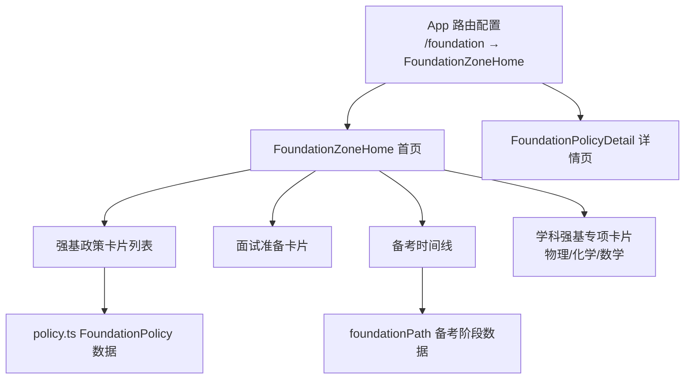
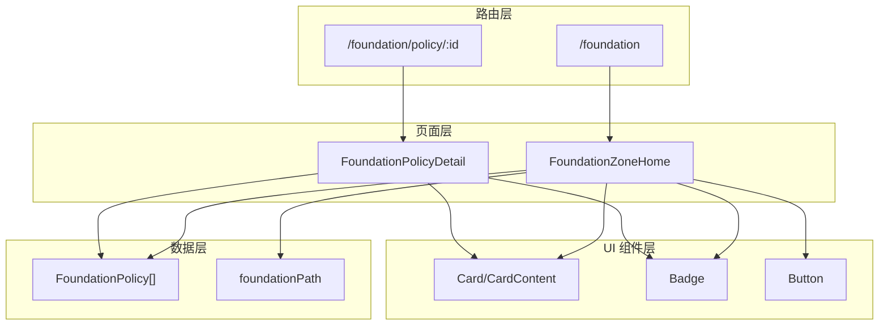
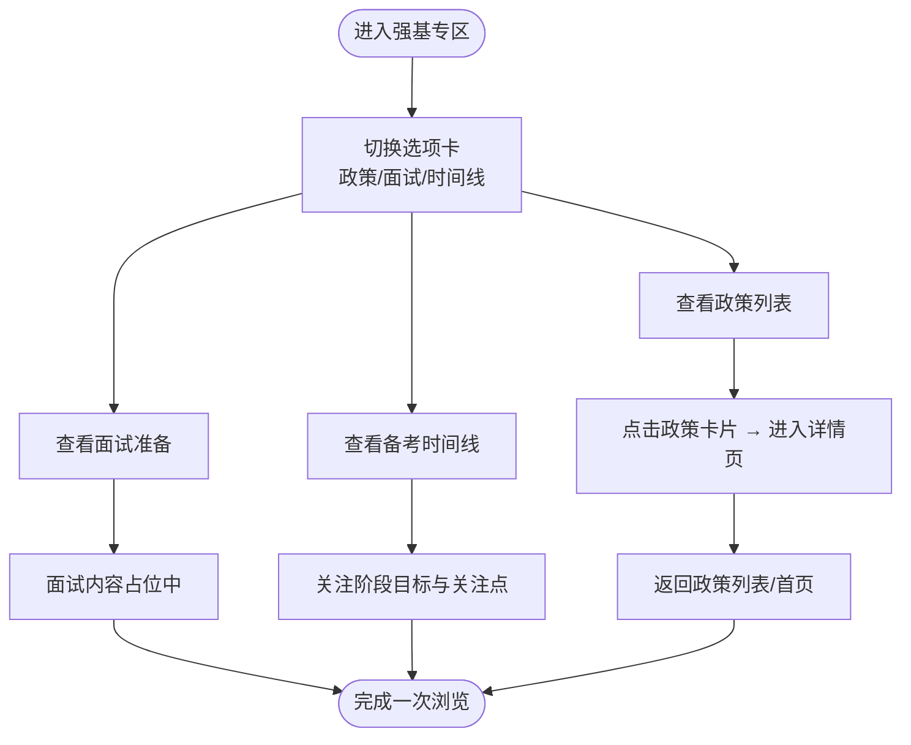
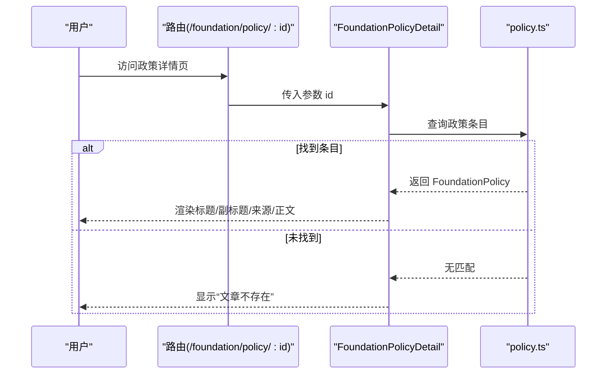
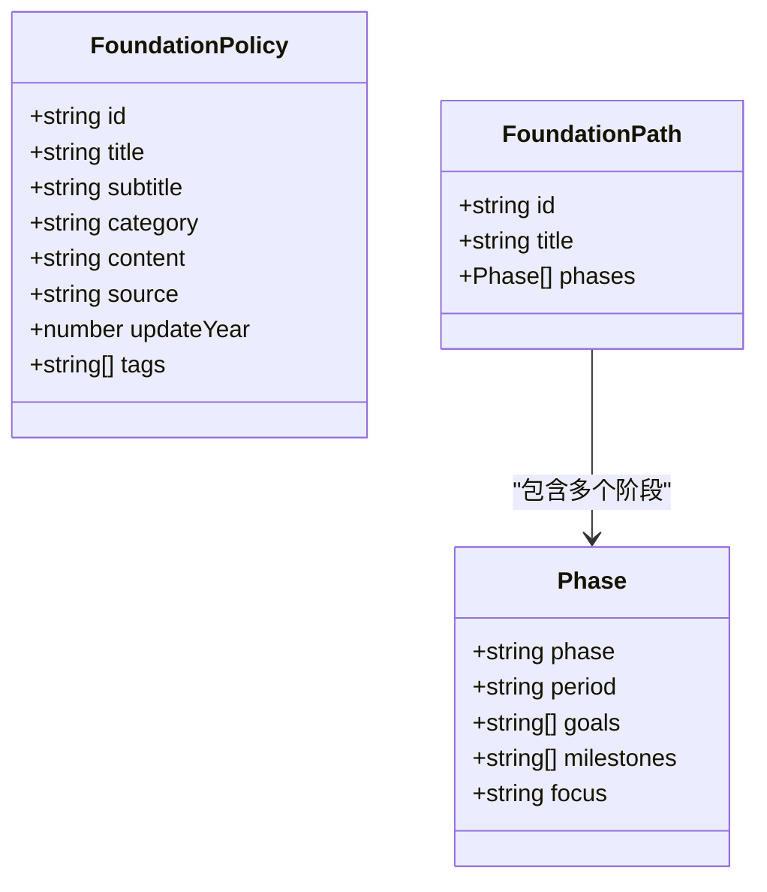
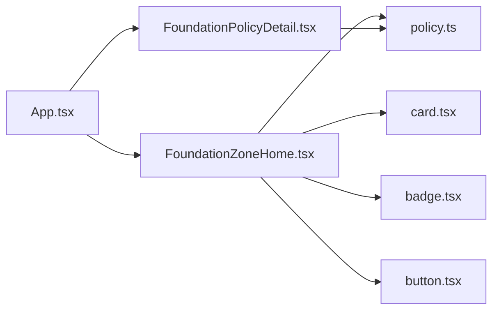

# 强基计划专区

<cite>
**本文引用的文件**
- [FoundationZoneHome.tsx](file://src/sections/foundation/FoundationZoneHome.tsx)
- [policy.ts](file://src/data/foundation/policy.ts)
- [强基计划专题内容规划.md](file://docs/zones/强基计划专题内容规划.md)
- [App.tsx](file://src/App.tsx)
- [card.tsx](file://src/components/ui/card.tsx)
- [badge.tsx](file://src/components/ui/badge.tsx)
- [button.tsx](file://src/components/ui/button.tsx)
- [types.ts](file://src/stores/types.ts)
</cite>

## 目录
1. [引言](#引言)
2. [项目结构](#项目结构)
3. [核心组件](#核心组件)
4. [架构总览](#架构总览)
5. [详细组件分析](#详细组件分析)
6. [依赖分析](#依赖分析)
7. [性能考虑](#性能考虑)
8. [故障排查指南](#故障排查指南)
9. [结论](#结论)
10. [附录](#附录)

## 引言
本文件为“强基计划专区”的综合文档，围绕星耀平台的强基计划模块，系统阐述政策解读、专业选择指导、备考规划体系与页面布局设计，并对数据结构、状态管理与个性化推荐机制进行技术化说明。文档同时提供组件架构分析与用户体验优化策略，帮助开发者与产品人员高效落地与迭代该专区。

## 项目结构
强基计划专区位于前端路由的独立模块，采用“独立一级模块”的页面组织方式，便于跨学科（物理/数学/化学）整合与统一运营。页面由首页与政策详情页构成，首页提供三大功能区：强基政策、面试准备、备考时间线；并提供“学科强基专项”快捷入口，分别指向物理/化学/数学的强基专项页面。

图表来源
- [App.tsx:182-183](file://src/App.tsx#L182-L183)
- [FoundationZoneHome.tsx:8-83](file://src/sections/foundation/FoundationZoneHome.tsx#L8-L83)
- [policy.ts:13-361](file://src/data/foundation/policy.ts#L13-L361)

章节来源
- [App.tsx:182-183](file://src/App.tsx#L182-L183)
- [FoundationZoneHome.tsx:8-83](file://src/sections/foundation/FoundationZoneHome.tsx#L8-L83)
- [强基计划专题内容规划.md:533-587](file://docs/zones/强基计划专题内容规划.md#L533-L587)

## 核心组件
- 页面容器与交互
  - FoundationZoneHome：负责页面头部、选项卡切换、学科专项入口、政策列表、面试准备与备考时间线渲染。
  - FoundationPolicyDetail：根据路由参数渲染强基政策详情，包含标题、副标题、来源与正文解析。
- 数据层
  - FoundationPolicy 接口与 foundationPolicies 数据：承载强基政策条目的元数据与正文内容。
  - foundationPath：强基备考阶段化路径，包含阶段、周期、目标、里程碑与关注点。
- UI 组件
  - Card、CardContent：用于政策卡片与时间线卡片的结构化展示。
  - Badge：用于分类标签、数量徽标与状态提示。
  - Button：用于选项卡按钮与交互元素。

章节来源
- [FoundationZoneHome.tsx:8-111](file://src/sections/foundation/FoundationZoneHome.tsx#L8-L111)
- [policy.ts:2-11](file://src/data/foundation/policy.ts#L2-L11)
- [policy.ts:13-361](file://src/data/foundation/policy.ts#L13-L361)
- [card.tsx:1-93](file://src/components/ui/card.tsx#L1-L93)
- [badge.tsx:1-47](file://src/components/ui/badge.tsx#L1-L47)
- [button.tsx:1-63](file://src/components/ui/button.tsx#L1-L63)

## 架构总览
强基专区采用“路由驱动 + 数据驱动”的前端架构：
- 路由层：App.tsx 定义 /foundation 与 /foundation/policy/:id 的页面映射。
- 页面层：FoundationZoneHome 负责首页聚合展示；FoundationPolicyDetail 负责详情页渲染。
- 数据层：policy.ts 提供强基政策与备考路径数据，供页面直接消费。
- UI 层：基于 Card、Badge、Button 等组件实现一致的视觉与交互体验。

图表来源
- [App.tsx:182-183](file://src/App.tsx#L182-L183)
- [FoundationZoneHome.tsx:8-111](file://src/sections/foundation/FoundationZoneHome.tsx#L8-L111)
- [policy.ts:13-361](file://src/data/foundation/policy.ts#L13-L361)
- [card.tsx:1-93](file://src/components/ui/card.tsx#L1-L93)
- [badge.tsx:1-47](file://src/components/ui/badge.tsx#L1-L47)
- [button.tsx:1-63](file://src/components/ui/button.tsx#L1-L63)

## 详细组件分析

### 页面布局与功能分区
- 顶部导航与面包屑：提供返回首页与当前页面标识，增强上下文感知。
- 选项卡切换：policy/interview/timeline 三类内容互斥展示，降低页面复杂度。
- 学科强基专项：以卡片网格形式提供物理/化学/数学的专项入口，颜色与背景区分学科。
- 政策列表：卡片式展示政策条目，右侧带分类徽标与跳转箭头，便于快速浏览。
- 面试准备：以卡片网格呈现各主题模块，当前为占位内容，未来可接入面试题库与模拟练习。
- 备考时间线：以时间轴形式展示五个阶段，左侧序号、右侧卡片展示阶段目标与关注点。

图表来源
- [FoundationZoneHome.tsx:24-79](file://src/sections/foundation/FoundationZoneHome.tsx#L24-L79)
- [FoundationZoneHome.tsx:39-79](file://src/sections/foundation/FoundationZoneHome.tsx#L39-L79)

章节来源
- [FoundationZoneHome.tsx:8-83](file://src/sections/foundation/FoundationZoneHome.tsx#L8-L83)

### 政策详情页渲染流程
- 参数解析：根据路由参数 id 获取对应政策条目。
- 内容渲染：标题、副标题、来源、更新年份与正文逐段渲染；支持标题层级与段落样式。
- 错误处理：当 id 不存在时，显示“文章不存在”。

图表来源
- [FoundationZoneHome.tsx:85-111](file://src/sections/foundation/FoundationZoneHome.tsx#L85-L111)
- [policy.ts:13-361](file://src/data/foundation/policy.ts#L13-L361)

章节来源
- [FoundationZoneHome.tsx:85-111](file://src/sections/foundation/FoundationZoneHome.tsx#L85-L111)

### 数据结构与内容组织
- FoundationPolicy 接口字段：id、title、subtitle、category、content、source、updateYear、tags。
- 政策条目分类：overview/process/exam_format/school_compare/admission/career_advice。
- 备考路径 foundationPath：包含阶段数组，每阶段包含阶段名、周期、目标、里程碑与关注点。
- 页面消费方式：首页直接遍历 policies 渲染卡片；详情页按 id 查找并渲染 content。

图表来源
- [policy.ts:2-11](file://src/data/foundation/policy.ts#L2-L11)
- [policy.ts:363-404](file://src/data/foundation/policy.ts#L363-L404)

章节来源
- [policy.ts:2-11](file://src/data/foundation/policy.ts#L2-L11)
- [policy.ts:13-361](file://src/data/foundation/policy.ts#L13-L361)
- [policy.ts:363-404](file://src/data/foundation/policy.ts#L363-L404)

### 页面与路由映射
- /foundation → FoundationZoneHome 首页
- /foundation/policy/:id → FoundationPolicyDetail 详情页

章节来源
- [App.tsx:182-183](file://src/App.tsx#L182-L183)

### 用户体验与交互优化
- 选项卡切换：减少页面滚动与信息密度，提升信息检索效率。
- 卡片式布局：政策卡片与时间线卡片统一使用 Card/CardContent，保证一致的点击反馈与阴影效果。
- 分类徽标：Badge 用于标识类别与数量，辅助用户快速筛选。
- 颜色与背景：学科专项卡片使用学科色与浅背景，增强视觉区分度。
- 可访问性：按钮与链接具备焦点状态与键盘可达性，确保无障碍使用。

章节来源
- [FoundationZoneHome.tsx:24-79](file://src/sections/foundation/FoundationZoneHome.tsx#L24-L79)
- [card.tsx:1-93](file://src/components/ui/card.tsx#L1-L93)
- [badge.tsx:1-47](file://src/components/ui/badge.tsx#L1-L47)
- [button.tsx:1-63](file://src/components/ui/button.tsx#L1-L63)

## 依赖分析
- 组件依赖
  - FoundationZoneHome 依赖 Card、Badge、Button、lucide-react 图标与 foundationPolicies、foundationPath 数据。
  - FoundationPolicyDetail 依赖路由参数解析与 FoundationPolicy 数据。
- 路由依赖
  - App.tsx 定义 /foundation 与 /foundation/policy/:id 的路由映射，确保页面正确加载。
- 数据依赖
  - 政策与路径数据集中于 policy.ts，页面通过直接导入消费，无需额外请求。

图表来源
- [FoundationZoneHome.tsx:6-6](file://src/sections/foundation/FoundationZoneHome.tsx#L6-L6)
- [FoundationZoneHome.tsx:8-111](file://src/sections/foundation/FoundationZoneHome.tsx#L8-L111)
- [policy.ts:13-361](file://src/data/foundation/policy.ts#L13-L361)
- [App.tsx:182-183](file://src/App.tsx#L182-L183)
- [card.tsx:1-93](file://src/components/ui/card.tsx#L1-L93)
- [badge.tsx:1-47](file://src/components/ui/badge.tsx#L1-L47)
- [button.tsx:1-63](file://src/components/ui/button.tsx#L1-L63)

章节来源
- [FoundationZoneHome.tsx:6-6](file://src/sections/foundation/FoundationZoneHome.tsx#L6-L6)
- [policy.ts:13-361](file://src/data/foundation/policy.ts#L13-L361)
- [App.tsx:182-183](file://src/App.tsx#L182-L183)

## 性能考虑
- 懒加载与代码分割：App.tsx 对强基专区采用懒加载，避免首屏负载过高。
- 数据内联：政策与路径数据直接导入，减少网络请求，提升首屏渲染速度。
- 组件复用：Card、Badge、Button 等通用组件减少重复实现，降低包体积。
- 图标按需：lucide-react 图标按需引入，避免打包无关图标资源。

章节来源
- [App.tsx:19-20](file://src/App.tsx#L19-L20)
- [FoundationZoneHome.tsx:6-6](file://src/sections/foundation/FoundationZoneHome.tsx#L6-L6)

## 故障排查指南
- 政策详情页空白
  - 检查路由参数 id 是否存在于 FoundationPolicy[]。
  - 确认 policy.ts 中 content 字段是否包含有效 Markdown 文本。
- 选项卡切换无效
  - 检查 activeTab 状态绑定与按钮事件是否正确。
  - 确认选项卡内容区域的条件渲染逻辑。
- 学科专项卡片无法跳转
  - 检查卡片的 Link 路由地址是否正确。
  - 确认路由表中是否存在对应路由。
- 面试准备模块为空
  - 当前为占位内容，需在后续版本接入面试题库与模拟练习。

章节来源
- [FoundationZoneHome.tsx:85-111](file://src/sections/foundation/FoundationZoneHome.tsx#L85-L111)
- [policy.ts:13-361](file://src/data/foundation/policy.ts#L13-L361)

## 结论
强基计划专区以清晰的页面结构与数据驱动的方式，实现了政策解读、专业选择与备考规划的统一入口。通过选项卡与卡片化布局，用户可在有限信息密度下高效获取所需内容。未来可进一步完善面试准备模块、引入个性化推荐与学习路径诊断，以提升用户的学习闭环与转化效果。

## 附录

### 强基计划与高考的关系处理
- 强基计划以高考成绩（85%）+ 校测（15%）为核心，强调“高考是基础层，强基是进阶层”的分层关系。
- 备考策略需在保证高考成绩的前提下进行强基超纲内容与真题训练，避免顾此失彼。

章节来源
- [强基计划专题内容规划.md:9-36](file://docs/zones/强基计划专题内容规划.md#L9-L36)

### 学科选择建议与职业发展方向
- 数学类：就业面广、薪资水平高，适合追求广泛职业选择的学生。
- 物理学类：科研与高校路径稳定但周期较长，适合有长期研究志向的学生。
- 化学类：新能源、医药、材料等领域就业稳定，适合关注应用领域的学生。

章节来源
- [policy.ts:316-360](file://src/data/foundation/policy.ts#L316-L360)

### 备考策略与学习路径规划
- 高一：打牢基础，建立物理直觉。
- 高二上：正式开始超纲学习，覆盖力学与电磁学进阶。
- 高二下：完成全部超纲内容并开始真题训练。
- 高三上：按学校分类刷真题，查漏补缺。
- 校测冲刺：高考结束后集中复习与模拟面试。

章节来源
- [强基计划专题内容规划.md:451-486](file://docs/zones/强基计划专题内容规划.md#L451-L486)

### 数据结构设计与状态管理
- FoundationPolicy：承载政策条目元数据与正文内容，支持分类与标签。
- foundationPath：阶段化学习路径，包含目标、周期与里程碑。
- 状态管理：页面内使用 useState 管理选项卡状态，详情页使用 useParams 获取路由参数。

章节来源
- [policy.ts:2-11](file://src/data/foundation/policy.ts#L2-L11)
- [policy.ts:363-404](file://src/data/foundation/policy.ts#L363-L404)
- [FoundationZoneHome.tsx:9-88](file://src/sections/foundation/FoundationZoneHome.tsx#L9-L88)