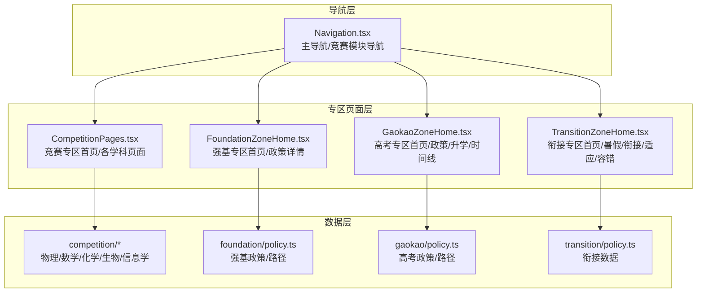
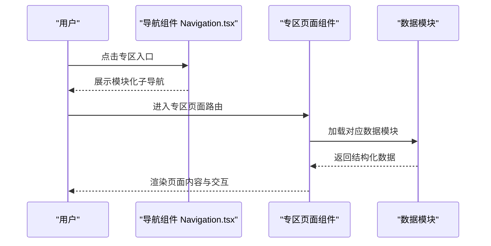
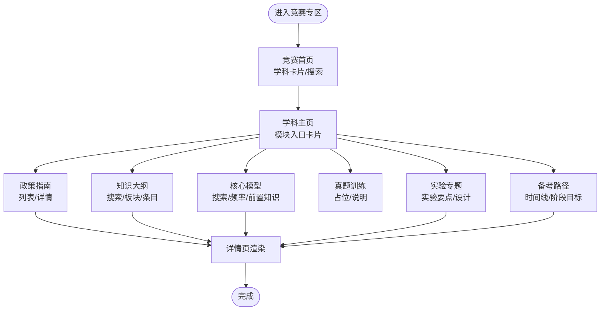
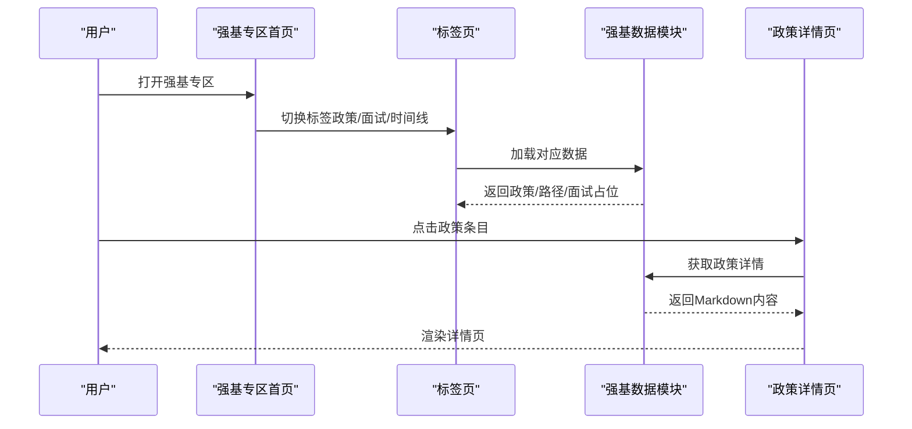
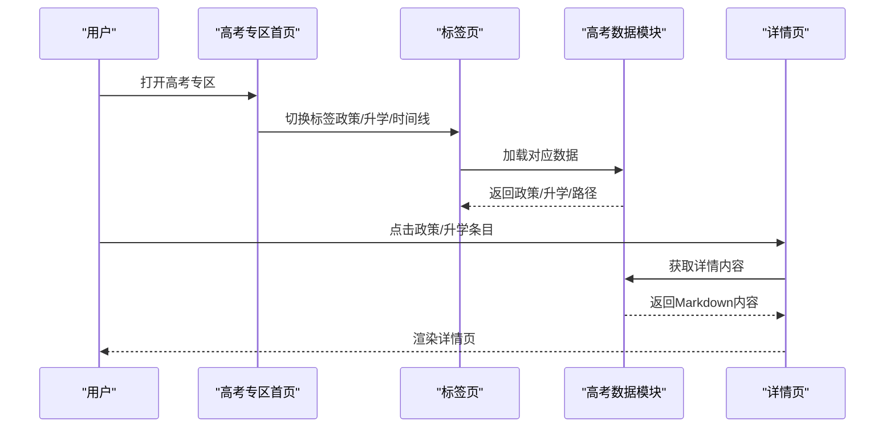
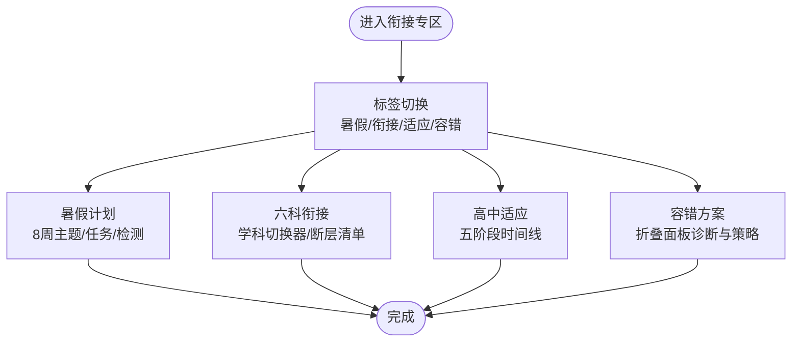
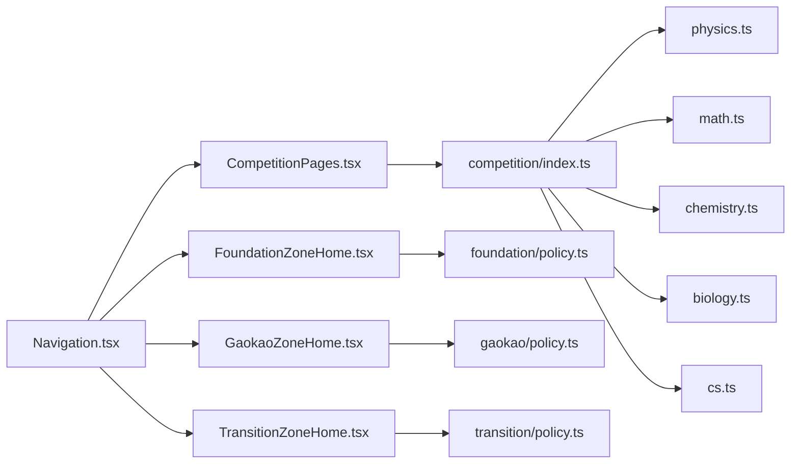

# 特色功能专区

<cite>
**本文档引用的文件**
- [src/sections/CompetitionPages.tsx](file://src/sections/CompetitionPages.tsx)
- [src/sections/foundation/FoundationZoneHome.tsx](file://src/sections/foundation/FoundationZoneHome.tsx)
- [src/sections/gaokao/GaokaoZoneHome.tsx](file://src/sections/gaokao/GaokaoZoneHome.tsx)
- [src/sections/transition/TransitionZoneHome.tsx](file://src/sections/transition/TransitionZoneHome.tsx)
- [src/data/competition/index.ts](file://src/data/competition/index.ts)
- [src/data/competition/physics.ts](file://src/data/competition/physics.ts)
- [src/data/competition/math.ts](file://src/data/competition/math.ts)
- [src/data/competition/chemistry.ts](file://src/data/competition/chemistry.ts)
- [src/data/competition/biology.ts](file://src/data/competition/biology.ts)
- [src/data/competition/cs.ts](file://src/data/competition/cs.ts)
- [src/data/foundation/policy.ts](file://src/data/foundation/policy.ts)
- [src/data/gaokao/policy.ts](file://src/data/gaokao/policy.ts)
- [src/data/transition/policy.ts](file://src/data/transition/policy.ts)
- [src/components/layout/Navigation.tsx](file://src/components/layout/Navigation.tsx)
</cite>

## 目录
1. [引言](#引言)
2. [项目结构](#项目结构)
3. [核心组件](#核心组件)
4. [架构总览](#架构总览)
5. [详细组件分析](#详细组件分析)
6. [依赖分析](#依赖分析)
7. [性能考量](#性能考量)
8. [故障排查指南](#故障排查指南)
9. [结论](#结论)
10. [附录](#附录)

## 引言
本文件系统化梳理星耀平台的特色功能专区，围绕竞赛支持、强基计划、高考专区、初高中衔接四大区域，阐述设计理念、页面布局、内容组织与交互体验，并说明数据来源与更新机制。文档旨在帮助开发者与运营人员快速理解专区实现与维护要点。

## 项目结构
四大专区分别由独立页面组件承载，配套专用数据模块，导航菜单提供统一入口与模块化子导航。页面组件通过路由参数与数据模块驱动内容渲染，形成“页面组件 + 数据模块”的清晰分层。

图表来源
- [src/components/layout/Navigation.tsx:47-150](file://src/components/layout/Navigation.tsx#L47-L150)
- [src/sections/CompetitionPages.tsx:1-800](file://src/sections/CompetitionPages.tsx#L1-L800)
- [src/sections/foundation/FoundationZoneHome.tsx:1-111](file://src/sections/foundation/FoundationZoneHome.tsx#L1-L111)
- [src/sections/gaokao/GaokaoZoneHome.tsx:1-316](file://src/sections/gaokao/GaokaoZoneHome.tsx#L1-L316)
- [src/sections/transition/TransitionZoneHome.tsx:1-384](file://src/sections/transition/TransitionZoneHome.tsx#L1-L384)
- [src/data/competition/index.ts:1-10](file://src/data/competition/index.ts#L1-L10)
- [src/data/foundation/policy.ts:1-405](file://src/data/foundation/policy.ts#L1-L405)
- [src/data/gaokao/policy.ts:1-309](file://src/data/gaokao/policy.ts#L1-L309)
- [src/data/transition/policy.ts:1-244](file://src/data/transition/policy.ts#L1-L244)

章节来源
- [src/components/layout/Navigation.tsx:47-150](file://src/components/layout/Navigation.tsx#L47-L150)
- [src/sections/CompetitionPages.tsx:1-800](file://src/sections/CompetitionPages.tsx#L1-L800)
- [src/sections/foundation/FoundationZoneHome.tsx:1-111](file://src/sections/foundation/FoundationZoneHome.tsx#L1-L111)
- [src/sections/gaokao/GaokaoZoneHome.tsx:1-316](file://src/sections/gaokao/GaokaoZoneHome.tsx#L1-L316)
- [src/sections/transition/TransitionZoneHome.tsx:1-384](file://src/sections/transition/TransitionZoneHome.tsx#L1-L384)
- [src/data/competition/index.ts:1-10](file://src/data/competition/index.ts#L1-L10)
- [src/data/foundation/policy.ts:1-405](file://src/data/foundation/policy.ts#L1-L405)
- [src/data/gaokao/policy.ts:1-309](file://src/data/gaokao/policy.ts#L1-L309)
- [src/data/transition/policy.ts:1-244](file://src/data/transition/policy.ts#L1-L244)

## 核心组件
- 竞赛专区页面：提供五大学科竞赛总览与各学科子页面，包含政策指南、知识大纲、核心模型、真题训练、实验专题、备考路径等模块化入口。
- 强基专区页面：提供强基政策、面试准备、备考时间线三大标签页；支持政策详情页渲染。
- 高考专区页面：提供高考政策、升学参考、备考时间线三大标签页；支持政策与升学详情页渲染。
- 初高中衔接专区：提供暑假计划、六科衔接、高中适应、容错方案四大模块，支持学科切换与折叠面板交互。

章节来源
- [src/sections/CompetitionPages.tsx:64-165](file://src/sections/CompetitionPages.tsx#L64-L165)
- [src/sections/foundation/FoundationZoneHome.tsx:8-83](file://src/sections/foundation/FoundationZoneHome.tsx#L8-L83)
- [src/sections/gaokao/GaokaoZoneHome.tsx:11-210](file://src/sections/gaokao/GaokaoZoneHome.tsx#L11-L210)
- [src/sections/transition/TransitionZoneHome.tsx:43-383](file://src/sections/transition/TransitionZoneHome.tsx#L43-L383)

## 架构总览
四大专区遵循统一的页面-数据分层架构：页面组件负责UI与交互，数据模块负责内容与结构，导航组件提供入口与模块化子导航。页面通过路由参数与数据模块联动，实现“按需加载、模块化渲染”。

图表来源
- [src/components/layout/Navigation.tsx:47-150](file://src/components/layout/Navigation.tsx#L47-L150)
- [src/sections/CompetitionPages.tsx:1-800](file://src/sections/CompetitionPages.tsx#L1-L800)
- [src/sections/foundation/FoundationZoneHome.tsx:1-111](file://src/sections/foundation/FoundationZoneHome.tsx#L1-L111)
- [src/sections/gaokao/GaokaoZoneHome.tsx:1-316](file://src/sections/gaokao/GaokaoZoneHome.tsx#L1-L316)
- [src/sections/transition/TransitionZoneHome.tsx:1-384](file://src/sections/transition/TransitionZoneHome.tsx#L1-L384)
- [src/data/competition/index.ts:1-10](file://src/data/competition/index.ts#L1-L10)
- [src/data/foundation/policy.ts:1-405](file://src/data/foundation/policy.ts#L1-L405)
- [src/data/gaokao/policy.ts:1-309](file://src/data/gaokao/policy.ts#L1-L309)
- [src/data/transition/policy.ts:1-244](file://src/data/transition/policy.ts#L1-L244)

## 详细组件分析

### 竞赛支持专区
- 设计理念：以“模块化导航 + 结构化数据”为核心，覆盖政策、知识、模型、真题、实验、路径六大模块，满足不同阶段学习需求。
- 页面布局：
  - 竞赛首页：学科卡片网格、搜索过滤、状态标识。
  - 学科主页：模块入口卡片、深度标准提示、历年考频统计。
  - 政策指南/知识大纲/核心模型/实验专题/备考路径：列表卡片、搜索/筛选、标签分类、详情入口。
- 学科内容展示：物理竞赛作为完整范例，其他学科沿用相同结构与数据接口。
- 政策信息管理：通过数据模块导出的指南条目、大纲条目、模型条目、实验条目与路径阶段，页面组件按模块渲染。

图表来源
- [src/sections/CompetitionPages.tsx:64-165](file://src/sections/CompetitionPages.tsx#L64-L165)
- [src/sections/CompetitionPages.tsx:168-268](file://src/sections/CompetitionPages.tsx#L168-L268)
- [src/sections/CompetitionPages.tsx:271-320](file://src/sections/CompetitionPages.tsx#L271-L320)
- [src/sections/CompetitionPages.tsx:323-388](file://src/sections/CompetitionPages.tsx#L323-L388)
- [src/sections/CompetitionPages.tsx:391-482](file://src/sections/CompetitionPages.tsx#L391-L482)
- [src/sections/CompetitionPages.tsx:561-612](file://src/sections/CompetitionPages.tsx#L561-L612)
- [src/sections/CompetitionPages.tsx:615-654](file://src/sections/CompetitionPages.tsx#L615-L654)

章节来源
- [src/sections/CompetitionPages.tsx:64-165](file://src/sections/CompetitionPages.tsx#L64-L165)
- [src/sections/CompetitionPages.tsx:168-268](file://src/sections/CompetitionPages.tsx#L168-L268)
- [src/sections/CompetitionPages.tsx:271-320](file://src/sections/CompetitionPages.tsx#L271-L320)
- [src/sections/CompetitionPages.tsx:323-388](file://src/sections/CompetitionPages.tsx#L323-L388)
- [src/sections/CompetitionPages.tsx:391-482](file://src/sections/CompetitionPages.tsx#L391-L482)
- [src/sections/CompetitionPages.tsx:561-612](file://src/sections/CompetitionPages.tsx#L561-L612)
- [src/sections/CompetitionPages.tsx:615-654](file://src/sections/CompetitionPages.tsx#L615-L654)
- [src/data/competition/physics.ts:125-158](file://src/data/competition/physics.ts#L125-L158)
- [src/data/competition/math.ts:52-115](file://src/data/competition/math.ts#L52-L115)
- [src/data/competition/chemistry.ts:51-113](file://src/data/competition/chemistry.ts#L51-L113)
- [src/data/competition/biology.ts:55-120](file://src/data/competition/biology.ts#L55-L120)
- [src/data/competition/cs.ts:53-117](file://src/data/competition/cs.ts#L53-L117)

### 强基计划专区
- 设计理念：以“政策解读 + 备考路径 + 面试准备”为主线，提供一站式强基信息与规划工具。
- 页面布局：
  - 顶部标签切换：强基政策、面试准备、备考时间线。
  - 学科强基专项入口：物理/化学/数学三个学科专项入口。
  - 政策详情页：Markdown渲染，支持标题/段落/表格等结构化内容。
- 政策解读：提供强基定位、报名条件、校测内容、高校对比、录取规则、专业选择等维度。
- 备考规划：提供强基备考时间线，标注阶段目标、周期与里程碑。
- 面试准备：当前为占位，后续可接入面试题库与模拟案例。

图表来源
- [src/sections/foundation/FoundationZoneHome.tsx:8-83](file://src/sections/foundation/FoundationZoneHome.tsx#L8-L83)
- [src/sections/foundation/FoundationZoneHome.tsx:85-111](file://src/sections/foundation/FoundationZoneHome.tsx#L85-L111)
- [src/data/foundation/policy.ts:13-361](file://src/data/foundation/policy.ts#L13-L361)
- [src/data/foundation/policy.ts:364-405](file://src/data/foundation/policy.ts#L364-L405)

章节来源
- [src/sections/foundation/FoundationZoneHome.tsx:8-83](file://src/sections/foundation/FoundationZoneHome.tsx#L8-L83)
- [src/sections/foundation/FoundationZoneHome.tsx:85-111](file://src/sections/foundation/FoundationZoneHome.tsx#L85-L111)
- [src/data/foundation/policy.ts:13-361](file://src/data/foundation/policy.ts#L13-L361)
- [src/data/foundation/policy.ts:364-405](file://src/data/foundation/policy.ts#L364-L405)

### 高考专区
- 设计理念：以“政策解读 + 升学参考 + 时间线规划”为核心，提供权威政策与实用参考。
- 页面布局：
  - 顶部标签切换：高考政策、升学参考、备考时间线。
  - 学科备考专项入口：物理/化学/数学专项入口。
  - 政策/升学详情页：Markdown渲染，支持标题/段落/表格等结构化内容。
- 内容组织：政策条目按类别（政策/趋势/分析）分类；升学参考按类别（强基/选科/竞赛/升学）分类；时间线按阶段标注目标与风险提示。

图表来源
- [src/sections/gaokao/GaokaoZoneHome.tsx:11-210](file://src/sections/gaokao/GaokaoZoneHome.tsx#L11-L210)
- [src/sections/gaokao/GaokaoZoneHome.tsx:213-261](file://src/sections/gaokao/GaokaoZoneHome.tsx#L213-L261)
- [src/sections/gaokao/GaokaoZoneHome.tsx:264-315](file://src/sections/gaokao/GaokaoZoneHome.tsx#L264-L315)
- [src/data/gaokao/policy.ts:13-259](file://src/data/gaokao/policy.ts#L13-L259)
- [src/data/gaokao/policy.ts:261-309](file://src/data/gaokao/policy.ts#L261-L309)

章节来源
- [src/sections/gaokao/GaokaoZoneHome.tsx:11-210](file://src/sections/gaokao/GaokaoZoneHome.tsx#L11-L210)
- [src/sections/gaokao/GaokaoZoneHome.tsx:213-261](file://src/sections/gaokao/GaokaoZoneHome.tsx#L213-L261)
- [src/sections/gaokao/GaokaoZoneHome.tsx:264-315](file://src/sections/gaokao/GaokaoZoneHome.tsx#L264-L315)
- [src/data/gaokao/policy.ts:13-259](file://src/data/gaokao/policy.ts#L13-L259)
- [src/data/gaokao/policy.ts:261-309](file://src/data/gaokao/policy.ts#L261-L309)

### 初高中衔接专区
- 设计理念：以“暑假计划 + 六科衔接 + 高中适应 + 容错方案”为主线，提供系统化过渡方案。
- 页面布局：
  - 顶部标签切换：暑假计划、六科衔接、高中适应、容错方案。
  - 学科切换器：支持物理/数学/化学/生物/语文/英语学科切换。
  - 容错方案：折叠面板展示偏差类型、触发条件、诊断步骤与调整策略。
- 内容组织：暑假8周计划按阶段标注主题、每日时长、任务与检测；六科衔接按“现状/需求/方式/时间”维度呈现；适应阶段按“蜜月期/冲击期/定位/分化/稳定”五阶段描述；容错方案提供六类典型偏差的标准化处理流程。

图表来源
- [src/sections/transition/TransitionZoneHome.tsx:43-383](file://src/sections/transition/TransitionZoneHome.tsx#L43-L383)
- [src/data/transition/policy.ts:44-244](file://src/data/transition/policy.ts#L44-L244)

章节来源
- [src/sections/transition/TransitionZoneHome.tsx:43-383](file://src/sections/transition/TransitionZoneHome.tsx#L43-L383)
- [src/data/transition/policy.ts:44-244](file://src/data/transition/policy.ts#L44-L244)

## 依赖分析
- 页面组件与数据模块：竞赛专区依赖各学科数据模块；强基/高考/衔接专区分别依赖对应数据模块。
- 导航组件：主导航提供专区入口与竞赛模块导航；竞赛模块导航包含政策、大纲、模型、真题、实验、路径等子导航。
- 数据聚合：竞赛数据入口统一导出各学科数据，便于页面按需导入。

图表来源
- [src/components/layout/Navigation.tsx:47-150](file://src/components/layout/Navigation.tsx#L47-L150)
- [src/sections/CompetitionPages.tsx:1-800](file://src/sections/CompetitionPages.tsx#L1-L800)
- [src/sections/foundation/FoundationZoneHome.tsx:1-111](file://src/sections/foundation/FoundationZoneHome.tsx#L1-L111)
- [src/sections/gaokao/GaokaoZoneHome.tsx:1-316](file://src/sections/gaokao/GaokaoZoneHome.tsx#L1-L316)
- [src/sections/transition/TransitionZoneHome.tsx:1-384](file://src/sections/transition/TransitionZoneHome.tsx#L1-L384)
- [src/data/competition/index.ts:1-10](file://src/data/competition/index.ts#L1-L10)
- [src/data/competition/physics.ts:1-265](file://src/data/competition/physics.ts#L1-L265)
- [src/data/competition/math.ts:1-116](file://src/data/competition/math.ts#L1-L116)
- [src/data/competition/chemistry.ts:1-114](file://src/data/competition/chemistry.ts#L1-L114)
- [src/data/competition/biology.ts:1-121](file://src/data/competition/biology.ts#L1-L121)
- [src/data/competition/cs.ts:1-118](file://src/data/competition/cs.ts#L1-L118)
- [src/data/foundation/policy.ts:1-405](file://src/data/foundation/policy.ts#L1-L405)
- [src/data/gaokao/policy.ts:1-309](file://src/data/gaokao/policy.ts#L1-L309)
- [src/data/transition/policy.ts:1-244](file://src/data/transition/policy.ts#L1-L244)

章节来源
- [src/components/layout/Navigation.tsx:47-150](file://src/components/layout/Navigation.tsx#L47-L150)
- [src/data/competition/index.ts:1-10](file://src/data/competition/index.ts#L1-L10)

## 性能考量
- 模块化渲染：页面按模块加载数据，避免一次性渲染全部内容，降低首屏压力。
- 搜索与筛选：在前端提供关键词搜索与标签筛选，减少无效渲染。
- 折叠面板与时间线：通过折叠与分阶段展示，控制DOM节点数量，提升滚动性能。
- 图标与样式：统一使用轻量图标库与Tailwind样式，减少额外依赖。

## 故障排查指南
- 页面空白或路由错误
  - 检查路由参数与页面组件是否匹配。
  - 确认数据模块是否存在对应条目。
- 内容缺失或占位
  - 竞赛真题训练/强基面试准备等为占位页，需按约定填充内容。
- 标签页切换异常
  - 确认标签状态与数据模块加载逻辑一致。
- 折叠面板无法展开
  - 检查状态管理与事件绑定，确保展开/收起逻辑正常。

章节来源
- [src/sections/CompetitionPages.tsx:615-654](file://src/sections/CompetitionPages.tsx#L615-L654)
- [src/sections/foundation/FoundationZoneHome.tsx:54-63](file://src/sections/foundation/FoundationZoneHome.tsx#L54-L63)
- [src/sections/transition/TransitionZoneHome.tsx:330-378](file://src/sections/transition/TransitionZoneHome.tsx#L330-L378)

## 结论
四大特色功能专区通过“页面组件 + 数据模块”的架构实现了高内聚、低耦合的内容组织与交互体验。竞赛专区强调模块化与结构化，强基与高考专区强调政策权威与规划实用，衔接专区强调系统化过渡与容错机制。未来可在详情页渲染、面试准备、真题训练等方面进一步完善内容与交互。

## 附录
- 内容更新机制
  - 政策类内容：通过数据模块的条目字段（如更新年份、更新频率）标识更新状态。
  - 真题训练：当前为占位，后续可对接官方真题与解析。
  - 面试准备：当前为占位，后续可接入题库与模拟案例。
- 用户交互设计
  - 标签页切换：统一的标签页组件与状态管理。
  - 折叠面板：容错方案采用折叠面板，支持展开/收起。
  - 搜索与筛选：在知识大纲与核心模型等页面提供关键词搜索与标签筛选。