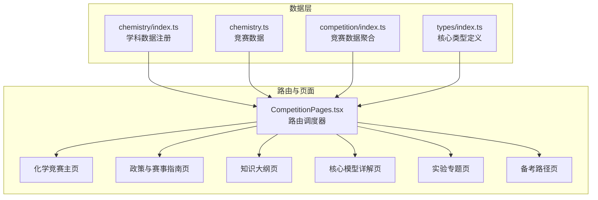
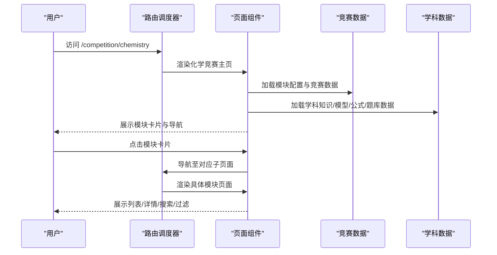
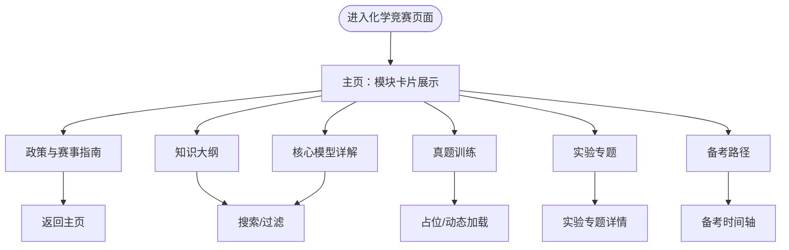
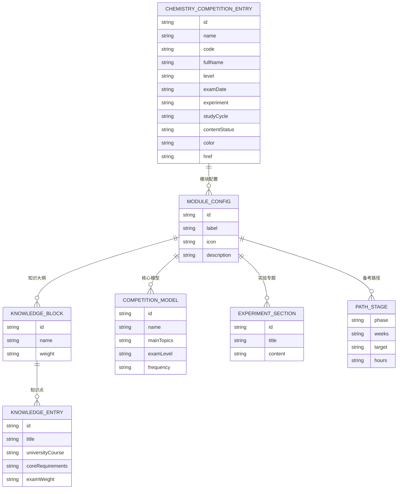
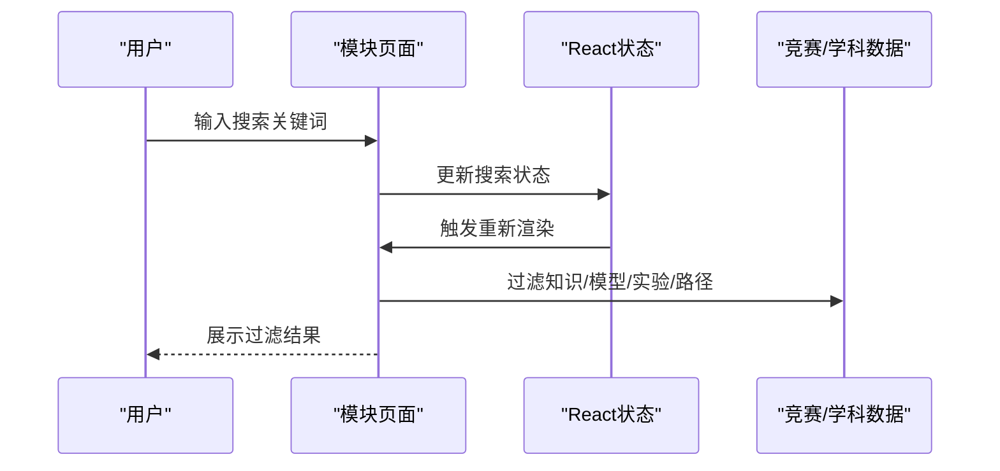
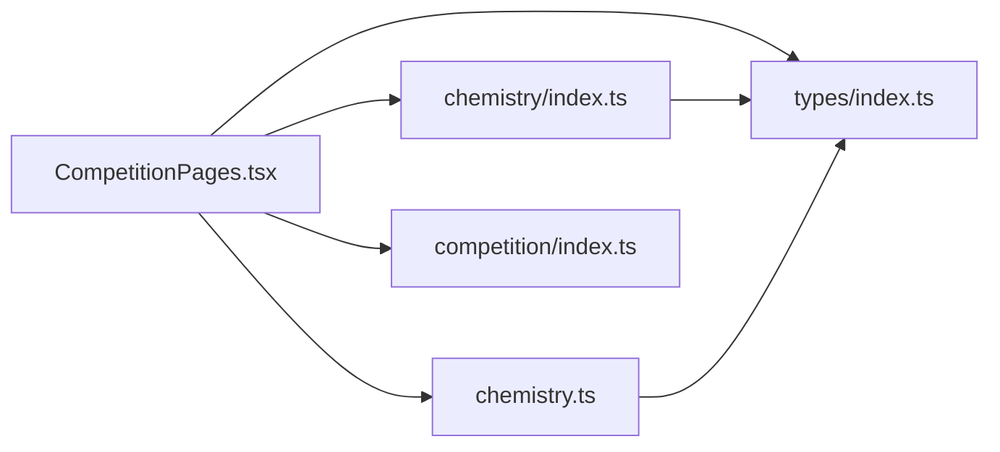

# 化学竞赛专区

<cite>
**本文档引用的文件**
- [CompetitionPages.tsx](file://src/sections/CompetitionPages.tsx)
- [chemistry.ts](file://src/data/competition/chemistry.ts)
- [index.ts](file://src/data/chemistry/index.ts)
- [index.ts](file://src/data/chemistry/concepts/index.ts)
- [index.ts](file://src/data/chemistry/models/index.ts)
- [index.ts](file://src/data/chemistry/questions/index.ts)
- [index.ts](file://src/data/chemistry/formulas/index.ts)
- [index.ts](file://src/data/competition/index.ts)
- [index.ts](file://src/types/index.ts)
</cite>

## 目录
1. [简介](#简介)
2. [项目结构](#项目结构)
3. [核心组件](#核心组件)
4. [架构总览](#架构总览)
5. [详细组件分析](#详细组件分析)
6. [依赖关系分析](#依赖关系分析)
7. [性能考量](#性能考量)
8. [故障排除指南](#故障排除指南)
9. [结论](#结论)

## 简介
本文件面向星耀平台的化学竞赛专区，系统化阐述CChO（中国化学奥林匹克竞赛）的完整支持体系，涵盖政策与赛事指南、知识大纲、核心模型、真题训练、实验专题与备考路径六大模块。文档详细说明页面的模块化设计、数据结构、组件结构、状态管理与用户交互，并给出动态加载与响应式布局的实现思路。

## 项目结构
化学竞赛专区采用“路由分发 + 模块化页面”的前端架构，通过统一的竞赛页面调度器按路径动态渲染对应模块页面。数据层采用“学科数据注册 + 竞赛数据聚合”的模式，既保证学科内容的可扩展性，又确保竞赛专区的数据完整性与一致性。

**图表来源**
- [CompetitionPages.tsx:1554-1633](file://src/sections/CompetitionPages.tsx#L1554-L1633)
- [chemistry.ts:1-114](file://src/data/competition/chemistry.ts#L1-L114)
- [index.ts:1-186](file://src/data/chemistry/index.ts#L1-L186)
- [index.ts:1-10](file://src/data/competition/index.ts#L1-L10)
- [index.ts:1-209](file://src/types/index.ts#L1-L209)

**章节来源**
- [CompetitionPages.tsx:1554-1633](file://src/sections/CompetitionPages.tsx#L1554-L1633)
- [chemistry.ts:1-114](file://src/data/competition/chemistry.ts#L1-L114)
- [index.ts:1-186](file://src/data/chemistry/index.ts#L1-L186)
- [index.ts:1-10](file://src/data/competition/index.ts#L1-L10)
- [index.ts:1-209](file://src/types/index.ts#L1-L209)

## 核心组件
- 路由调度器：根据URL路径精确匹配并渲染对应模块页面，避免重复加载与代码分割浪费。
- 模块页面组件：政策指南、知识大纲、核心模型、真题训练、实验专题、备考路径六个页面，均采用统一的卡片式布局与搜索过滤能力。
- 数据聚合：竞赛数据通过聚合入口统一导出，便于页面按需引入。

关键实现位置：
- 路由调度与模块渲染：[CompetitionPages.tsx:1554-1633](file://src/sections/CompetitionPages.tsx#L1554-L1633)
- 化学竞赛模块页面：[CompetitionPages.tsx:882-1146](file://src/sections/CompetitionPages.tsx#L882-L1146)
- 竞赛数据定义：[chemistry.ts:1-114](file://src/data/competition/chemistry.ts#L1-L114)
- 学科数据注册：[index.ts:135-183](file://src/data/chemistry/index.ts#L135-L183)

**章节来源**
- [CompetitionPages.tsx:882-1146](file://src/sections/CompetitionPages.tsx#L882-L1146)
- [chemistry.ts:1-114](file://src/data/competition/chemistry.ts#L1-L114)
- [index.ts:135-183](file://src/data/chemistry/index.ts#L135-L183)

## 架构总览
化学竞赛专区采用“页面路由 + 数据聚合 + 学科注册”的三层架构：
- 页面层：统一的路由调度器，按模块渲染页面，支持返回导航与模块跳转。
- 数据层：竞赛数据与学科数据分离，竞赛数据提供CChO专属模块，学科数据提供通用知识与模型。
- 类型层：统一的核心类型定义，确保页面与数据的契约一致。

**图表来源**
- [CompetitionPages.tsx:1554-1633](file://src/sections/CompetitionPages.tsx#L1554-L1633)
- [chemistry.ts:33-40](file://src/data/competition/chemistry.ts#L33-L40)
- [index.ts:135-183](file://src/data/chemistry/index.ts#L135-L183)

**章节来源**
- [CompetitionPages.tsx:1554-1633](file://src/sections/CompetitionPages.tsx#L1554-L1633)
- [chemistry.ts:33-40](file://src/data/competition/chemistry.ts#L33-L40)
- [index.ts:135-183](file://src/data/chemistry/index.ts#L135-L183)

## 详细组件分析

### 页面模块化设计
- 模块卡片：主页以网格卡片展示六大模块，包含图标、颜色标识、描述与数量统计，点击进入对应页面。
- 搜索与过滤：知识大纲与核心模型页面提供输入框进行关键词搜索，提升内容检索效率。
- 返回导航：所有子页面均提供返回上级页面的导航按钮，保持用户体验连贯性。

**图表来源**
- [CompetitionPages.tsx:882-1146](file://src/sections/CompetitionPages.tsx#L882-L1146)

**章节来源**
- [CompetitionPages.tsx:882-1146](file://src/sections/CompetitionPages.tsx#L882-L1146)

### 数据结构设计
竞赛专区的数据分为“竞赛数据”和“学科数据”两大类，分别服务于CChO专属模块与通用学习内容。

- 竞赛数据（chemistry.ts）
  - 竞赛入口：包含CChO基本信息、模块配置、颜色与链接。
  - 模块配置：政策指南、知识大纲、核心模型、真题训练、实验专题、备考路径。
  - 知识大纲：四大板块与权重、知识点条目。
  - 核心模型：竞赛高频模型与前置知识。
  - 实验专题：决赛实验六大主题。
  - 备考路径：三阶段规划与目标。

- 学科数据（chemistry/index.ts）
  - 学科元数据：模块与章节组织。
  - 概念数据：C01-C57的知识节点与分组。
  - 模型数据：M01-M48的模型索引与排序。
  - 公式库：公式章节与搜索接口。
  - 题库：模型题库框架与统计。

**图表来源**
- [chemistry.ts:18-114](file://src/data/competition/chemistry.ts#L18-L114)

**章节来源**
- [chemistry.ts:18-114](file://src/data/competition/chemistry.ts#L18-L114)
- [index.ts:22-183](file://src/data/chemistry/index.ts#L22-L183)

### 组件结构与状态管理
- 状态管理：页面内部使用React状态管理搜索关键字与过滤结果，保证交互即时性与低耦合。
- 用户交互：模块卡片点击跳转、返回按钮导航、搜索框输入实时过滤、详情按钮查看内容。
- 动态加载：真题训练页面采用占位组件，预留真实题目内容接入点；公式库与题库提供搜索接口，便于后续AI填充。

**图表来源**
- [CompetitionPages.tsx:964-1040](file://src/sections/CompetitionPages.tsx#L964-L1040)
- [index.ts:135-183](file://src/data/chemistry/index.ts#L135-L183)

**章节来源**
- [CompetitionPages.tsx:964-1040](file://src/sections/CompetitionPages.tsx#L964-L1040)
- [index.ts:135-183](file://src/data/chemistry/index.ts#L135-L183)

### 响应式布局与视觉设计
- 统一风格：模块页面采用卡片式布局，颜色与图标与学科主题一致，增强品牌识别。
- 响应式网格：主页模块卡片在小屏、中屏、大屏下自适应排列，保证内容密度与可读性。
- 进度与强调：备考路径采用时间轴样式，突出阶段目标与时间安排；实验专题强调决赛占比，引导学习重点。

**章节来源**
- [CompetitionPages.tsx:882-1146](file://src/sections/CompetitionPages.tsx#L882-L1146)

## 依赖关系分析
化学竞赛专区的依赖关系清晰，遵循“页面依赖数据、数据依赖类型”的原则，降低耦合度并提升可维护性。

**图表来源**
- [CompetitionPages.tsx:1-46](file://src/sections/CompetitionPages.tsx#L1-L46)
- [chemistry.ts:1-114](file://src/data/competition/chemistry.ts#L1-L114)
- [index.ts:1-186](file://src/data/chemistry/index.ts#L1-L186)
- [index.ts:1-10](file://src/data/competition/index.ts#L1-L10)
- [index.ts:1-209](file://src/types/index.ts#L1-L209)

**章节来源**
- [CompetitionPages.tsx:1-46](file://src/sections/CompetitionPages.tsx#L1-L46)
- [chemistry.ts:1-114](file://src/data/competition/chemistry.ts#L1-L114)
- [index.ts:1-186](file://src/data/chemistry/index.ts#L1-L186)
- [index.ts:1-10](file://src/data/competition/index.ts#L1-L10)
- [index.ts:1-209](file://src/types/index.ts#L1-L209)

## 性能考量
- 路由按需渲染：通过URL精确匹配渲染对应模块，避免一次性加载全部页面资源。
- 数据懒加载：真题训练与公式库采用占位与搜索接口，减少初始数据体积。
- 组件复用：模块页面共享统一的卡片、输入、徽章等UI组件，降低重复实现成本。
- 状态局部化：搜索与过滤在页面内部完成，避免全局状态风暴。

## 故障排除指南
- 页面空白或模块缺失
  - 检查路由路径是否正确，确认URL前缀与模块子路径匹配。
  - 确认竞赛数据聚合导出是否包含化学模块。
- 搜索无结果
  - 检查搜索关键词大小写与拼写，确认数据源是否已填充内容。
  - 确认过滤逻辑是否正确映射到知识/模型/实验/路径数据。
- 图标与颜色异常
  - 检查模块配置中的图标与颜色字段是否正确设置。
  - 确认CSS类名与主题色变量是否生效。

**章节来源**
- [CompetitionPages.tsx:1554-1633](file://src/sections/CompetitionPages.tsx#L1554-L1633)
- [chemistry.ts:33-40](file://src/data/competition/chemistry.ts#L33-L40)

## 结论
化学竞赛专区通过模块化页面、统一路由调度与数据聚合，构建了CChO的完整支持体系。页面具备良好的可扩展性与可维护性，能够随着竞赛内容与学科数据的丰富逐步完善。建议后续优先填充竞赛指南、知识大纲与核心模型的内容，并接入真题训练与公式库，以形成闭环的学习与备考体验。