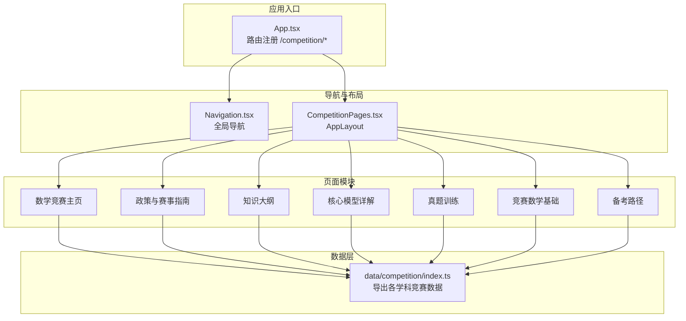
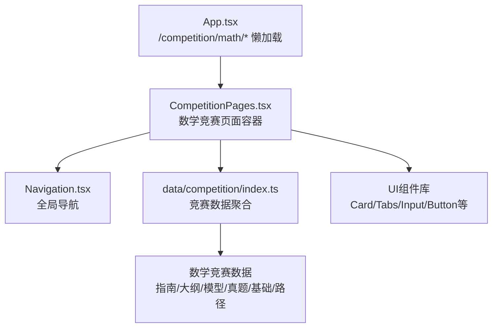
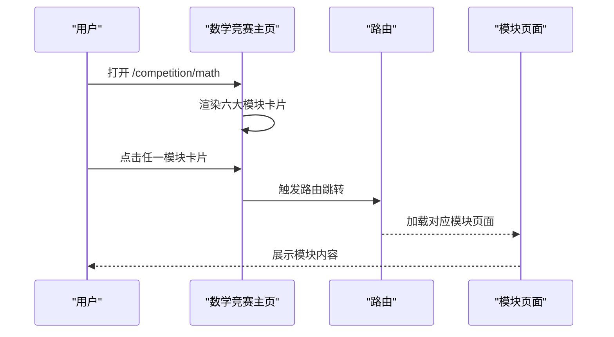
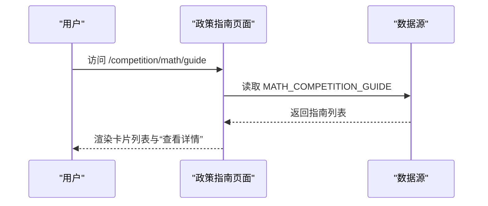
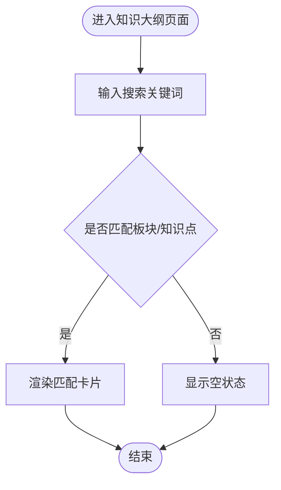
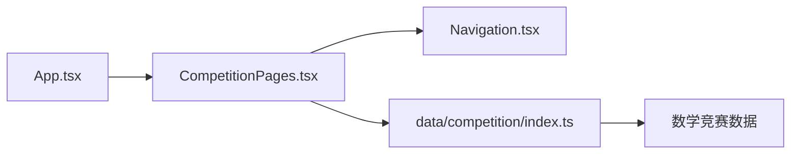

# 数学竞赛专区

<cite>
**本文引用的文件**
- [CompetitionPages.tsx](file://src/sections/CompetitionPages.tsx)
- [MathGuidePage.tsx](file://src/sections/MathGuidePage.tsx)
- [App.tsx](file://src/App.tsx)
- [Navigation.tsx](file://src/components/layout/Navigation.tsx)
- [index.ts](file://src/data/competition/index.ts)
- [subjects.ts](file://src/data/subjects.ts)
- [useSubjectData.ts](file://src/hooks/useSubjectData.ts)
</cite>

## 目录
1. [引言](#引言)
2. [项目结构](#项目结构)
3. [核心组件](#核心组件)
4. [架构总览](#架构总览)
5. [详细组件分析](#详细组件分析)
6. [依赖分析](#依赖分析)
7. [性能考虑](#性能考虑)
8. [故障排查指南](#故障排查指南)
9. [结论](#结论)
10. [附录](#附录)

## 引言
本文件面向“星耀平台”的数学竞赛专区，系统化梳理数学竞赛（CMO）的完整支持体系，包括政策与赛事指南（CM01-CM08）、知识大纲（四大板块16个知识点）、核心模型详解（MM01-MM10）、真题训练、竞赛数学基础（大学数学工具5个）和备考路径（三年3个阶段）。文档同时阐述数学竞赛页面的模块化设计、学科卡片展示、模块导航系统与内容状态管理，以及数据结构设计与组件结构分析、状态管理与用户交互设计，并给出动态加载机制与响应式布局实现建议。

## 项目结构
数学竞赛专区由“页面容器 + 数据聚合 + 导航 + 布局”四部分构成：
- 页面容器：位于 sections/CompetitionPages.tsx，负责数学竞赛主页、政策指南、知识大纲、核心模型、真题训练、竞赛数学基础、备考路径等模块化页面渲染与路由挂载。
- 数据聚合：位于 data/competition/index.ts，统一导出各学科竞赛数据（含数学），供页面按需使用。
- 导航与布局：位于 components/layout/Navigation.tsx 与 sections/CompetitionPages.tsx 中的 AppLayout 组合，提供全局导航与页面布局。
- 入口路由：位于 App.tsx，将 /competition/math/* 路由懒加载至 CompetitionPages.tsx。

图表来源
- [App.tsx:145-157](file://src/App.tsx#L145-L157)
- [Navigation.tsx:56](file://src/components/layout/Navigation.tsx#L56)
- [CompetitionPages.tsx:688-736](file://src/sections/CompetitionPages.tsx#L688-L736)
- [index.ts:1-10](file://src/data/competition/index.ts#L1-L10)

章节来源
- [App.tsx:11](file://src/App.tsx#L11)
- [App.tsx:145-157](file://src/App.tsx#L145-L157)
- [Navigation.tsx:56](file://src/components/layout/Navigation.tsx#L56)
- [CompetitionPages.tsx:688-736](file://src/sections/CompetitionPages.tsx#L688-L736)
- [index.ts:1-10](file://src/data/competition/index.ts#L1-L10)

## 核心组件
- 数学竞赛主页：展示政策、知识、模型、真题、竞赛数学基础、备考路径六大模块卡片，支持模块跳转与计数标注。
- 政策与赛事指南：以卡片列表形式呈现 CM01-CM08，支持快速查看与跳转。
- 知识大纲：按四大板块与16个知识点展示，支持搜索过滤与权重标识。
- 核心模型详解：按 MM01-MM10 展示高频模型，标注频度与适用层级。
- 真题训练：提供联赛/IMO真题入口与说明。
- 竞赛数学基础：展示大学数学工具5个模块。
- 备考路径：以时间轴形式展示三年三阶段目标与主题。

章节来源
- [CompetitionPages.tsx:688-736](file://src/sections/CompetitionPages.tsx#L688-L736)
- [CompetitionPages.tsx:738-768](file://src/sections/CompetitionPages.tsx#L738-L768)
- [CompetitionPages.tsx:770-800](file://src/sections/CompetitionPages.tsx#L770-L800)

## 架构总览
数学竞赛专区采用“页面容器 + 数据聚合 + 导航布局”的分层架构。页面容器通过路由懒加载方式引入，减少初始包体；数据通过 data/competition/index.ts 统一导出，页面按需消费；导航与布局组件提供一致的用户体验与交互。

图表来源
- [App.tsx:11](file://src/App.tsx#L11)
- [App.tsx:145-157](file://src/App.tsx#L145-L157)
- [CompetitionPages.tsx:18-46](file://src/sections/CompetitionPages.tsx#L18-L46)
- [index.ts:1-10](file://src/data/competition/index.ts#L1-L10)

## 详细组件分析

### 数学竞赛主页（模块化卡片）
- 功能要点
  - 展示六大模块卡片：政策与赛事指南、知识大纲、核心模型详解、真题训练、竞赛数学基础、备考路径。
  - 每个模块包含图标、颜色标识、描述与数量统计，点击进入对应模块。
  - 使用链接组件进行模块跳转，保证可访问性与SEO友好。
- 设计与交互
  - 卡片悬停阴影与边框过渡提升交互反馈。
  - 模块描述与计数信息帮助用户快速了解模块规模与价值。
- 响应式布局
  - 使用网格布局在不同屏幕尺寸下自适应排列（1列/2列/3列）。

图表来源
- [CompetitionPages.tsx:688-736](file://src/sections/CompetitionPages.tsx#L688-L736)

章节来源
- [CompetitionPages.tsx:688-736](file://src/sections/CompetitionPages.tsx#L688-L736)

### 政策与赛事指南（CM01-CM08）
- 功能要点
  - 列表展示 CM01 至 CM08，每条包含编号、标题、副标题与摘要。
  - 提供“查看详情”按钮，便于进一步阅读。
- 数据来源
  - 通过 data/competition/index.ts 导出的 MATH_COMPETITION_GUIDE 提供数据。
- 用户体验
  - 编号以等宽字体突出显示，摘要支持截断与展开。

图表来源
- [CompetitionPages.tsx:738-768](file://src/sections/CompetitionPages.tsx#L738-L768)
- [index.ts:1-10](file://src/data/competition/index.ts#L1-L10)

章节来源
- [CompetitionPages.tsx:738-768](file://src/sections/CompetitionPages.tsx#L738-L768)
- [index.ts:1-10](file://src/data/competition/index.ts#L1-L10)

### 知识大纲（四大板块16个知识点）
- 功能要点
  - 展示四大板块与权重，支持按知识点标题/编号搜索。
  - 每个知识点包含大学课程归属、核心要求与考试权重。
- 搜索与过滤
  - 输入框实时过滤，提升查找效率。
- 响应式布局
  - 板块区域采用网格布局，知识点列表卡片化展示。

图表来源
- [CompetitionPages.tsx:770-800](file://src/sections/CompetitionPages.tsx#L770-L800)

章节来源
- [CompetitionPages.tsx:770-800](file://src/sections/CompetitionPages.tsx#L770-L800)

### 核心模型详解（MM01-MM10）
- 功能要点
  - 展示10个核心模型，标注出现频度与适用层级。
  - 列表支持按模型编号/名称搜索。
- 前置知识
  - 每个模型列出前置知识标签，帮助用户建立知识关联。
- 交互设计
  - “查看详情”按钮用于跳转到模型详情页（含真题精讲）。

章节来源
- [CompetitionPages.tsx:18-46](file://src/sections/CompetitionPages.tsx#L18-L46)

### 真题训练（联赛/IMO真题）
- 功能要点
  - 提供联赛、复赛、决赛真题入口说明。
  - 当前状态为“即将上线”，页面提供占位提示。
- 用户指引
  - 通过卡片说明真题类型与难度，引导用户关注官方发布渠道。

章节来源
- [CompetitionPages.tsx:614-654](file://src/sections/CompetitionPages.tsx#L614-L654)

### 竞赛数学基础（大学数学工具5个）
- 功能要点
  - 展示大学数学工具5个模块，作为竞赛学习的数学基础支撑。
  - 页面提供模块概览与入口，便于用户按需学习。

章节来源
- [CompetitionPages.tsx:18-46](file://src/sections/CompetitionPages.tsx#L18-L46)

### 备考路径（三年3个阶段）
- 功能要点
  - 以时间轴形式展示三年三阶段目标与每周安排。
  - 每个阶段包含目标、时长与主题清单，帮助用户制定学习计划。
- 风险提示
  - 页面顶部提供风险提示，提醒用户关注高考成绩与停课风险。

章节来源
- [CompetitionPages.tsx:484-558](file://src/sections/CompetitionPages.tsx#L484-L558)

### 数学学科指南（概念与方法）
- 功能要点
  - 提供数学学习的“为什么学”“四种探索模式”“四个习惯”“四次升级”“与社会的关系”等模块化内容。
  - 采用分节布局与滚动锚点，便于用户按需阅读。
- 设计特色
  - 使用图标与颜色标识不同模块，增强可读性与记忆点。

章节来源
- [MathGuidePage.tsx:1-139](file://src/sections/MathGuidePage.tsx#L1-L139)

## 依赖分析
- 路由与懒加载
  - App.tsx 中将 /competition/* 路由懒加载至 CompetitionPages.tsx，减少首屏包体。
- 导航与模块
  - Navigation.tsx 提供“竞赛”模块入口，CompetitionPages.tsx 中的模块导航与页面容器配合，形成清晰的导航链路。
- 数据依赖
  - CompetitionPages.tsx 通过 import 从 data/competition/index.ts 获取数学竞赛数据，确保页面与数据解耦。

图表来源
- [App.tsx:145-157](file://src/App.tsx#L145-L157)
- [Navigation.tsx:56](file://src/components/layout/Navigation.tsx#L56)
- [CompetitionPages.tsx:18-46](file://src/sections/CompetitionPages.tsx#L18-L46)
- [index.ts:1-10](file://src/data/competition/index.ts#L1-L10)

章节来源
- [App.tsx:145-157](file://src/App.tsx#L145-L157)
- [Navigation.tsx:56](file://src/components/layout/Navigation.tsx#L56)
- [CompetitionPages.tsx:18-46](file://src/sections/CompetitionPages.tsx#L18-L46)
- [index.ts:1-10](file://src/data/competition/index.ts#L1-L10)

## 性能考虑
- 路由懒加载
  - 竞赛页面通过路由懒加载引入，降低首屏资源占用，提升初始加载速度。
- 组件按需渲染
  - 页面仅在进入模块时渲染对应内容，避免一次性加载所有模块。
- 数据聚合与缓存
  - 数据通过 data/competition/index.ts 聚合导出，页面按需消费，减少重复请求与计算。
- 响应式与交互优化
  - 使用轻量级UI组件与CSS Grid/Flex布局，确保在移动端与桌面端均有良好体验。

章节来源
- [App.tsx:11](file://src/App.tsx#L11)
- [CompetitionPages.tsx:688-736](file://src/sections/CompetitionPages.tsx#L688-L736)

## 故障排查指南
- 页面空白或模块未显示
  - 检查路由配置是否正确挂载至 /competition/math/*。
  - 确认 data/competition/index.ts 是否正确导出数学竞赛数据。
- 搜索无结果
  - 确认搜索关键词与知识点/板块名称是否匹配大小写与格式。
  - 检查过滤逻辑是否正确调用数据源。
- 导航异常
  - 检查 Navigation.tsx 中竞赛模块的可用性与链接地址。
- 性能问题
  - 确认未在页面中进行不必要的重复渲染或大数据量未做分页/虚拟化处理。

章节来源
- [App.tsx:145-157](file://src/App.tsx#L145-L157)
- [Navigation.tsx:56](file://src/components/layout/Navigation.tsx#L56)
- [CompetitionPages.tsx:770-800](file://src/sections/CompetitionPages.tsx#L770-L800)

## 结论
数学竞赛专区通过模块化页面设计、统一的数据聚合与清晰的导航体系，为用户提供从政策指南、知识大纲、核心模型、真题训练、竞赛数学基础到备考路径的完整学习支持。页面采用懒加载与响应式布局，在保证功能完整性的同时兼顾性能与可维护性。建议后续完善真题训练模块与竞赛数学基础的交互细节，持续优化搜索与过滤体验。

## 附录
- 数据结构设计（基于现有代码可见字段）
  - 政策与赛事指南（CM01-CM08）
    - 字段：id、title、subtitle、content、updateFrequency
    - 示例来源：[CompetitionPages.tsx:738-768](file://src/sections/CompetitionPages.tsx#L738-L768)
  - 知识大纲（四大板块16个知识点）
    - 字段：id、title、universityCourse、coreRequirements、examWeight
    - 示例来源：[CompetitionPages.tsx:770-800](file://src/sections/CompetitionPages.tsx#L770-L800)
  - 核心模型详解（MM01-MM10）
    - 字段：id、name、mainTopics、frequency、examLevel、prerequisiteKnowledge、content
    - 示例来源：[CompetitionPages.tsx:18-46](file://src/sections/CompetitionPages.tsx#L18-L46)
  - 真题训练
    - 字段：当前为占位说明，后续将包含真题类型与难度说明
    - 示例来源：[CompetitionPages.tsx:614-654](file://src/sections/CompetitionPages.tsx#L614-L654)
  - 竞赛数学基础（大学数学工具5个）
    - 字段：当前为模块概览，后续将细化为具体工具与学习路径
    - 示例来源：[CompetitionPages.tsx:18-46](file://src/sections/CompetitionPages.tsx#L18-L46)
  - 备考路径（三年3个阶段）
    - 字段：phase、weeks、target、hours、topics
    - 示例来源：[CompetitionPages.tsx:484-558](file://src/sections/CompetitionPages.tsx#L484-L558)