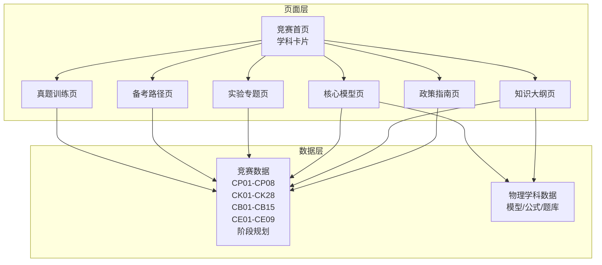
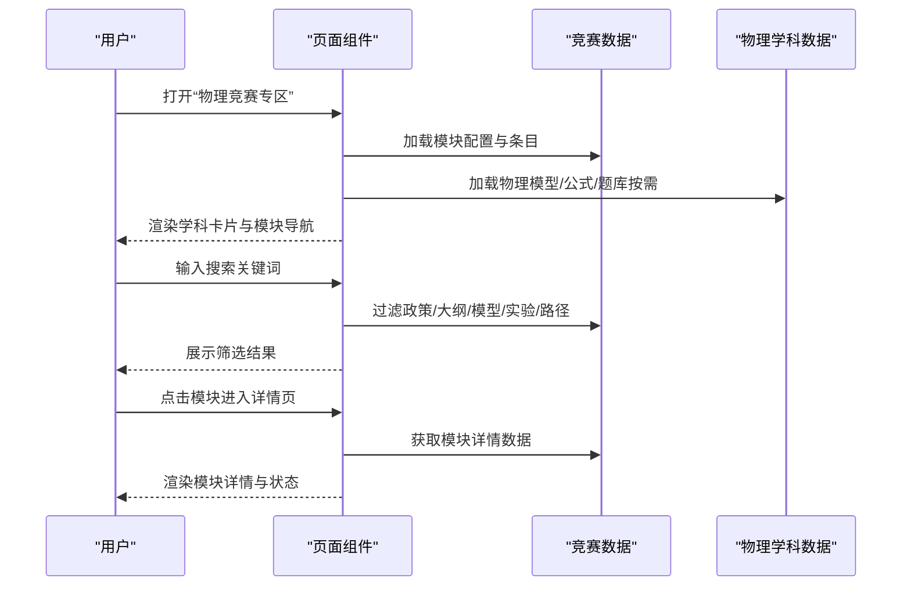
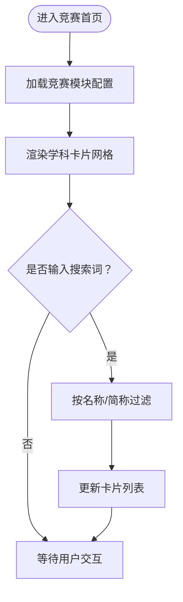
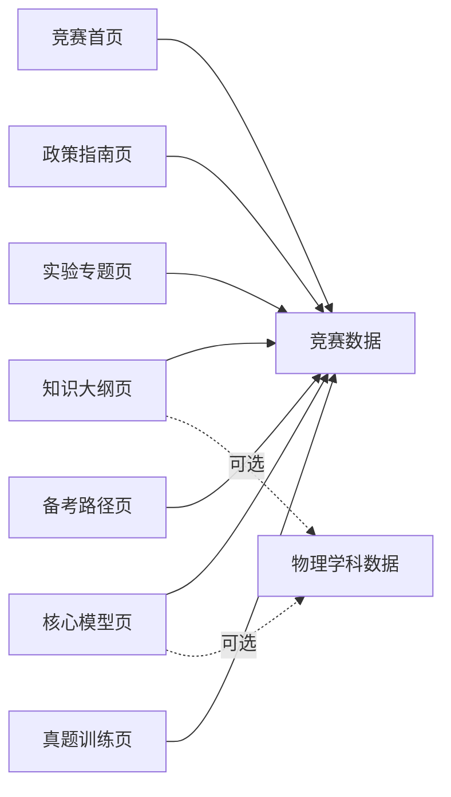

# 物理竞赛专区

<cite>
**本文档引用的文件**
- [CompetitionPages.tsx](file://src/sections/CompetitionPages.tsx)
- [physics.ts](file://src/data/competition/physics.ts)
- [physicsData.ts](file://src/data/physics/physicsData.ts)
- [physicsModels.ts](file://src/data/physics/physicsModels.ts)
- [P07_力学常见力.md](file://docs/knowledge/physics/P07_力学常见力.md)
- [P08_力的合成与分解.md](file://docs/knowledge/physics/P08_力的合成与分解.md)
- [P09_牛顿三定律.md](file://docs/knowledge/physics/P09_牛顿三定律.md)
- [P10_超重与失重.md](file://docs/knowledge/physics/P10_超重与失重.md)
</cite>

## 目录
1. [引言](#引言)
2. [项目结构](#项目结构)
3. [核心组件](#核心组件)
4. [架构总览](#架构总览)
5. [详细组件分析](#详细组件分析)
6. [依赖分析](#依赖分析)
7. [性能考虑](#性能考虑)
8. [故障排查指南](#故障排查指南)
9. [结论](#结论)
10. [附录](#附录)

## 引言
本文件为星耀平台“物理竞赛专区”的系统化文档，围绕全国中学生物理竞赛（CPhO）的完整支持体系进行深入阐述，涵盖政策与赛事指南（CP01-CP08）、知识大纲（十一大板块28个知识点）、核心模型详解（CB01-CB15）、真题训练（2010-2025年48套）、实验专题（CE01-CE09）和备考路径（三年6个阶段）。文档同时解析物理竞赛页面的模块化设计、学科卡片展示、搜索过滤功能、模块导航系统与内容状态管理，给出数据结构设计、组件结构分析、状态管理与用户交互设计，并提供动态加载机制与响应式布局实现建议。

## 项目结构
物理竞赛专区位于前端路由与数据层之间，采用“页面组件 + 竞赛数据 + 物理学科数据”三层协同：
- 页面组件：负责UI渲染、交互与状态管理（学科卡片、搜索、导航、内容状态）。
- 竞赛数据：提供CPhO政策、大纲、模型、实验、路径等结构化数据。
- 物理学科数据：提供物理知识、模型、公式、题库等通用数据，支撑竞赛内容的深度讲解与拓展。

图表来源
- [CompetitionPages.tsx](file://src/sections/CompetitionPages.tsx)
- [physics.ts](file://src/data/competition/physics.ts)
- [physicsData.ts](file://src/data/physics/physicsData.ts)

章节来源
- [CompetitionPages.tsx](file://src/sections/CompetitionPages.tsx)
- [physics.ts](file://src/data/competition/physics.ts)

## 核心组件
- 竞赛首页（学科卡片展示）：以卡片形式展示五大学科竞赛概览，突出CPhO的层级、时间、实验占比与学习周期；支持关键词搜索（名称/简称）。
- 政策与赛事指南（CP01-CP08）：列表展示政策条目，标注更新频率，支持“查看详情”入口。
- 知识大纲（CK01-CK28）：按十一大板块展示，支持按知识点编号/名称搜索；展示大学课程对标、核心要求、考试权重。
- 核心模型（CB01-CB15）：按模型编号/名称搜索，展示难度等级、出现频率、前置知识、训练题列表。
- 实验专题（CE01-CE09）：强调实验在复赛/决赛中的高占比，提供实验理论与实践要点。
- 备考路径（三年6阶段）：以时间轴形式展示阶段性目标、周次、投入时长与主题。
- 真题训练（2010-2025）：提供预赛/复赛/决赛真题的占位页，标注题量与难度说明。

章节来源
- [CompetitionPages.tsx](file://src/sections/CompetitionPages.tsx)

## 架构总览
页面组件通过导入竞赛数据与物理学科数据，实现“模块化导航 + 结构化内容 + 搜索过滤 + 状态管理”的一体化体验。页面层与数据层解耦，便于扩展其他竞赛与学科。

图表来源
- [CompetitionPages.tsx](file://src/sections/CompetitionPages.tsx)
- [physics.ts](file://src/data/competition/physics.ts)
- [physicsData.ts](file://src/data/physics/physicsData.ts)

## 详细组件分析

### 组件A：竞赛首页（学科卡片与搜索）
- 模块化导航：以卡片形式展示六大模块（政策、大纲、模型、真题、实验、路径），并标注数量与描述。
- 搜索过滤：支持按名称/简称过滤五大学科卡片，提升入口可达性。
- 状态管理：使用本地状态存储搜索词，实时过滤列表。

图表来源
- [CompetitionPages.tsx](file://src/sections/CompetitionPages.tsx)

章节来源
- [CompetitionPages.tsx](file://src/sections/CompetitionPages.tsx)

### 组件B：政策与赛事指南（CP01-CP08）
- 数据结构：每条政策包含ID、标题、副标题、内容占位、更新频率。
- 展示逻辑：列表项包含序号徽标、标题/副标题、摘要、更新频率徽章与“查看详情”按钮。
- 交互设计：返回上级页面、查看详情入口，便于快速浏览与深入学习。

章节来源
- [CompetitionPages.tsx](file://src/sections/CompetitionPages.tsx)
- [physics.ts](file://src/data/competition/physics.ts)

### 组件C：知识大纲（CK01-CK28）
- 数据结构：每个知识点包含ID、标题、大学课程、核心要求、考试权重、内容占位。
- 展示逻辑：顶部展示十一大板块与权重；列表项包含编号徽标、标题、大学课程标签、核心要求摘要、权重徽章。
- 搜索过滤：支持按知识点编号/名称搜索，提升检索效率。

章节来源
- [CompetitionPages.tsx](file://src/sections/CompetitionPages.tsx)
- [physics.ts](file://src/data/competition/physics.ts)

### 组件D：核心模型（CB01-CB15）
- 数据结构：每个模型包含ID、名称、主主题、考试层级、出现频率、前置知识列表、内容占位、训练题ID列表。
- 展示逻辑：列表项包含编号徽标、名称、主主题、频率徽章、层级徽章、前置知识标签云、“查看详情”按钮。
- 搜索过滤：支持按模型编号/名称搜索，便于快速定位高频模型。

章节来源
- [CompetitionPages.tsx](file://src/sections/CompetitionPages.tsx)
- [physics.ts](file://src/data/competition/physics.ts)

### 组件E：实验专题（CE01-CE09）
- 数据结构：每个专题包含ID、标题、内容占位。
- 展示逻辑：强调实验在复赛/决赛中的高占比，提供九个专题的列表展示与“查看详情”入口。
- 交互设计：风险提示卡片提醒实验能力的重要性与备考侧重点。

章节来源
- [CompetitionPages.tsx](file://src/sections/CompetitionPages.tsx)
- [physics.ts](file://src/data/competition/physics.ts)

### 组件F：备考路径（三年6阶段）
- 数据结构：每个阶段包含阶段名、周次、目标、投入时长、主题列表。
- 展示逻辑：时间轴样式展示六个阶段，使用渐变色标识不同阶段，左侧序号与右侧内容区分开来。
- 交互设计：风险提示卡片提醒高考兜底、停课风险与心理压力等注意事项。

章节来源
- [CompetitionPages.tsx](file://src/sections/CompetitionPages.tsx)
- [physics.ts](file://src/data/competition/physics.ts)

### 组件G：真题训练（2010-2025）
- 展示逻辑：提供预赛/复赛/决赛三类真题的占位卡片，标注题量与难度说明，当前状态为“即将上线”。
- 交互设计：提供统一入口，便于后续接入官方真题与解析。

章节来源
- [CompetitionPages.tsx](file://src/sections/CompetitionPages.tsx)
- [physics.ts](file://src/data/competition/physics.ts)

### 组件H：物理学科数据联动（可选）
- 物理学科数据：提供物理模型、公式、题库等通用数据，可用于知识大纲与核心模型的深度讲解与拓展。
- 数据联动：页面组件可按需加载物理学科数据，实现“竞赛内容 + 学科知识”的双轨支撑。

章节来源
- [physicsData.ts](file://src/data/physics/physicsData.ts)
- [physicsModels.ts](file://src/data/physics/physicsModels.ts)

## 依赖分析
- 页面组件依赖竞赛数据模块，确保模块导航与内容展示的一致性。
- 页面组件可按需依赖物理学科数据模块，实现知识深度与竞赛广度的互补。
- 数据层内部模块解耦，便于独立维护与扩展。

图表来源
- [CompetitionPages.tsx](file://src/sections/CompetitionPages.tsx)
- [physics.ts](file://src/data/competition/physics.ts)
- [physicsData.ts](file://src/data/physics/physicsData.ts)

章节来源
- [CompetitionPages.tsx](file://src/sections/CompetitionPages.tsx)
- [physics.ts](file://src/data/competition/physics.ts)

## 性能考虑
- 列表渲染优化：使用虚拟滚动或分页加载，减少DOM节点数量，提升长列表性能。
- 搜索过滤：前端搜索建议使用防抖与索引化（如按标题/编号建立索引），降低频繁重排成本。
- 按需加载：页面组件按模块懒加载物理学科数据，避免一次性加载过多资源。
- 缓存策略：对静态数据（如竞赛模块配置、政策条目）进行内存缓存，减少重复请求。
- 响应式布局：采用CSS Grid/Flexbox与媒体查询，确保在移动端与桌面端均具备良好体验。

## 故障排查指南
- 搜索无结果：检查搜索关键词大小写与拼写；确认数据源是否包含对应条目。
- 模块空白：检查数据导入是否成功；确认模块ID与路由路径一致。
- 实验专题占位：确认“即将上线”状态为预期设计；后续接入官方真题与解析。
- 备考路径风险提示：关注“高考成绩下滑”“停课风险”“竞赛未获奖”等提示，制定合理的时间与学习策略。

章节来源
- [CompetitionPages.tsx](file://src/sections/CompetitionPages.tsx)

## 结论
物理竞赛专区通过模块化设计与结构化数据，构建了从政策到实战的完整学习路径。页面组件以清晰的导航与搜索过滤提升用户体验，数据层以竞赛与学科双轨支撑实现内容深度与广度的平衡。建议后续完善真题训练接入、增强交互反馈与个性化学习路径推荐，持续迭代以满足不同层次学习者的需求。

## 附录

### 数据结构设计（竞赛侧）
- 政策与赛事指南（CP01-CP08）：条目数组，包含ID、标题、副标题、内容占位、更新频率。
- 知识大纲（CK01-CK28）：条目数组，包含ID、标题、大学课程、核心要求、考试权重、内容占位。
- 核心模型（CB01-CB15）：条目数组，包含ID、名称、主主题、考试层级、出现频率、前置知识列表、内容占位、训练题ID列表。
- 实验专题（CE01-CE09）：条目数组，包含ID、标题、内容占位。
- 备考路径（三年6阶段）：阶段数组，包含阶段名、周次、目标、投入时长、主题列表。

章节来源
- [physics.ts](file://src/data/competition/physics.ts)

### 物理学科数据（可选联动）
- 物理模型：提供模型元数据（ID、名称、模块、章节、排序），支持认知图谱与题库统计。
- 物理公式与题库：提供公式章节、公式列表与题库筛选选项，辅助知识大纲与模型的深度讲解。

章节来源
- [physicsData.ts](file://src/data/physics/physicsData.ts)
- [physicsModels.ts](file://src/data/physics/physicsModels.ts)

### 示例文档（知识点）
- 力学常见力（P07）：包含情境锚定、困惑预设、实验/现象呈现、概念涌现、推导叙事、迁移应用、公式卡片与分层变形。
- 力的合成与分解（P08）：包含情境锚定、困惑预设、实验/现象呈现、概念涌现、推导叙事、迁移应用、公式卡片与分层变形。
- 牛顿三定律（P09）：包含情境锚定、困惑预设、实验/现象呈现、概念涌现、推导叙事、迁移应用、公式卡片与分层变形。
- 超重与失重（P10）：包含情境锚定、困惑预设、实验/现象呈现、概念涌现、推导叙事、迁移应用、公式卡片与分层变形。

章节来源
- [P07_力学常见力.md](file://docs/knowledge/physics/P07_力学常见力.md)
- [P08_力的合成与分解.md](file://docs/knowledge/physics/P08_力的合成与分解.md)
- [P09_牛顿三定律.md](file://docs/knowledge/physics/P09_牛顿三定律.md)
- [P10_超重与失重.md](file://docs/knowledge/physics/P10_超重与失重.md)