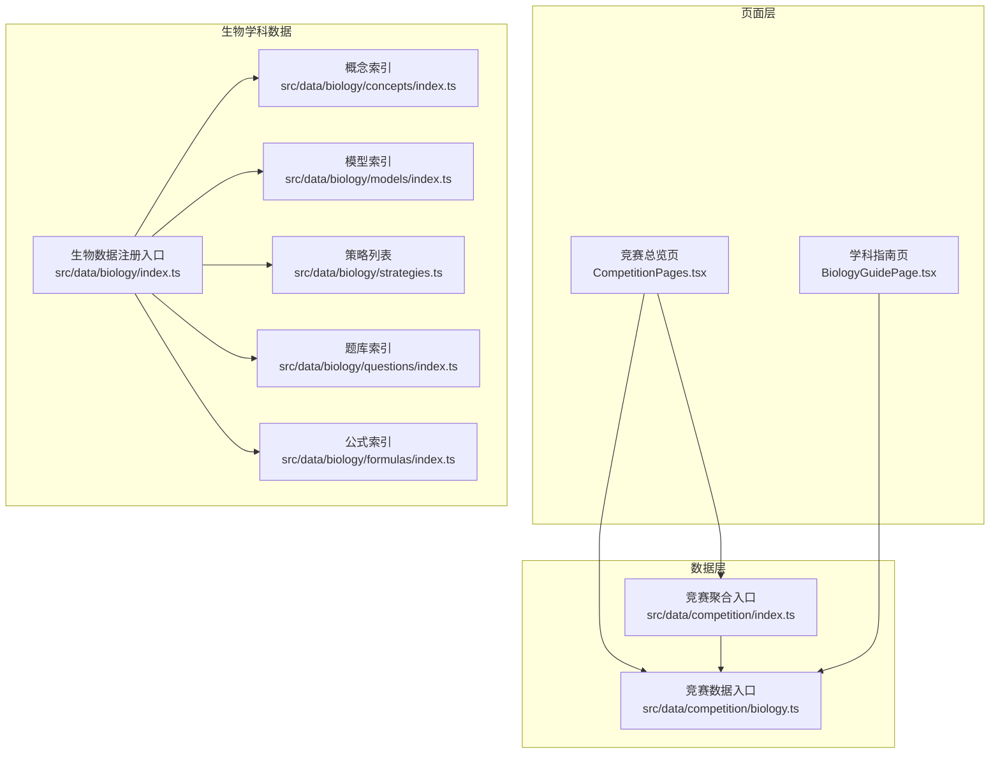
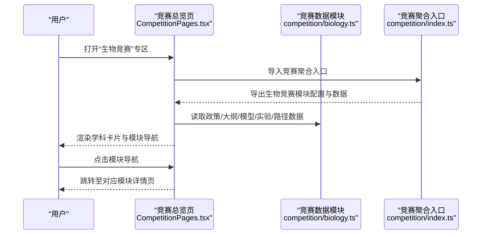
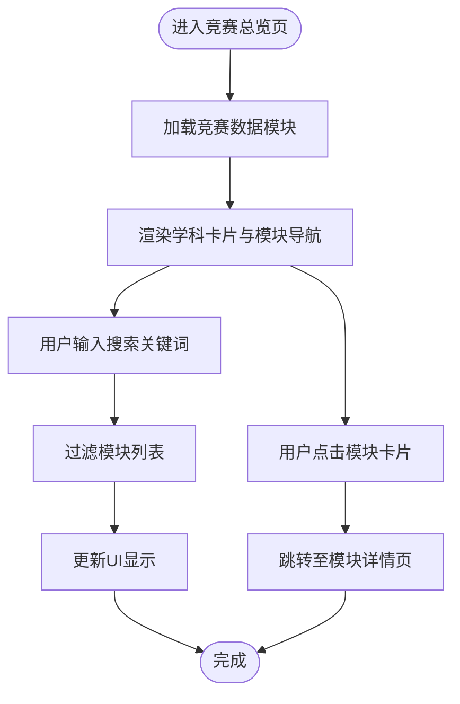
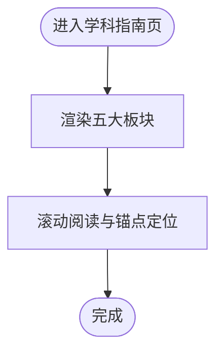
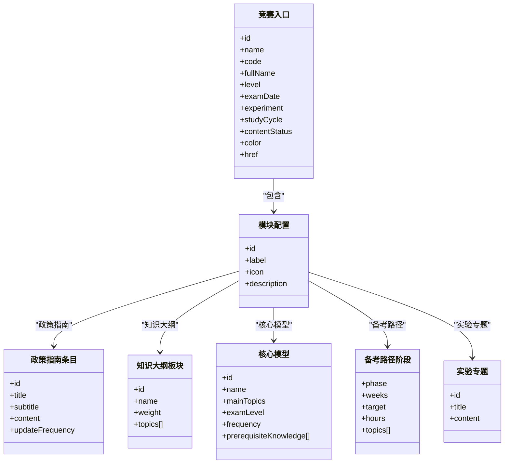
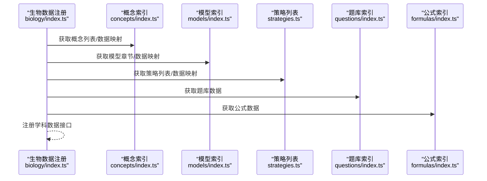
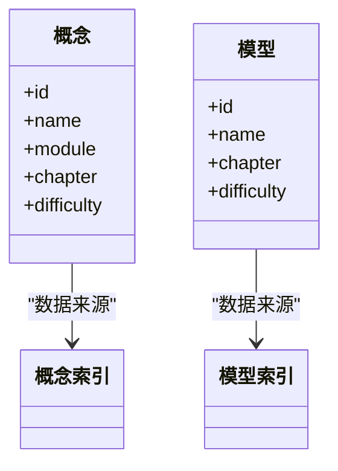
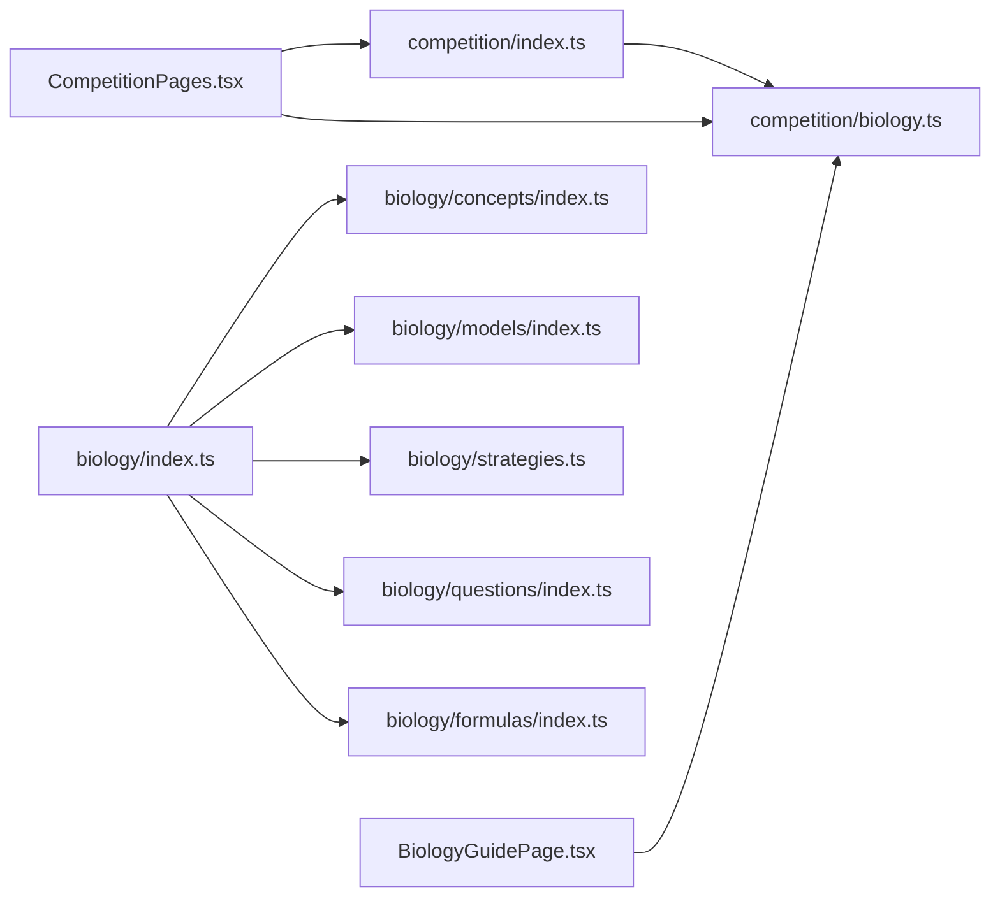

# 生物竞赛专区

<cite>
**本文引用的文件**
- [src/data/competition/biology.ts](file://src/data/competition/biology.ts)
- [src/sections/CompetitionPages.tsx](file://src/sections/CompetitionPages.tsx)
- [src/sections/BiologyGuidePage.tsx](file://src/sections/BiologyGuidePage.tsx)
- [src/data/competition/index.ts](file://src/data/competition/index.ts)
- [src/data/biology/index.ts](file://src/data/biology/index.ts)
- [src/data/biology/concepts/index.ts](file://src/data/biology/concepts/index.ts)
- [src/data/biology/concepts/types.ts](file://src/data/biology/concepts/types.ts)
- [src/data/biology/models/index.ts](file://src/data/biology/models/index.ts)
- [src/data/biology/models/types.ts](file://src/data/biology/models/types.ts)
- [src/data/biology/strategies.ts](file://src/data/biology/strategies.ts)
- [src/data/biology/questions/index.ts](file://src/data/biology/questions/index.ts)
- [src/data/biology/formulas/index.ts](file://src/data/biology/formulas/index.ts)
- [src/data/biology/formulas/types.ts](file://src/data/biology/formulas/types.ts)
</cite>

## 目录
1. [引言](#引言)
2. [项目结构](#项目结构)
3. [核心组件](#核心组件)
4. [架构总览](#架构总览)
5. [详细组件分析](#详细组件分析)
6. [依赖分析](#依赖分析)
7. [性能考虑](#性能考虑)
8. [故障排查指南](#故障排查指南)
9. [结论](#结论)
10. [附录](#附录)

## 引言
本文件面向“星耀平台”的生物竞赛专区，系统化梳理 CBO（全国中学生生物学奥林匹克竞赛）的支持体系与页面实现。内容涵盖政策与赛事指南、知识大纲、核心模型、真题训练、实验专题与备考路径，并深入解析页面模块化设计、数据结构、组件关系、状态管理与交互设计，以及动态加载与响应式布局的实现方式。目标读者既包括一线教师与竞赛教练，也包括对竞赛内容与平台实现感兴趣的开发者。

## 项目结构
生物竞赛专区由“竞赛总览页面”“学科指南页面”与“竞赛数据模块”三部分构成：
- 页面层：竞赛总览页、模块导航与各模块详情页
- 数据层：竞赛政策、知识大纲、核心模型、实验专题、备考路径
- 生物学科数据：概念、模型、公式、策略、题库等

图表来源
- [src/sections/CompetitionPages.tsx:1-800](file://src/sections/CompetitionPages.tsx#L1-L800)
- [src/sections/BiologyGuidePage.tsx:1-139](file://src/sections/BiologyGuidePage.tsx#L1-L139)
- [src/data/competition/biology.ts:1-121](file://src/data/competition/biology.ts#L1-L121)
- [src/data/competition/index.ts:1-10](file://src/data/competition/index.ts#L1-L10)
- [src/data/biology/index.ts:1-151](file://src/data/biology/index.ts#L1-L151)

章节来源
- [src/sections/CompetitionPages.tsx:1-800](file://src/sections/CompetitionPages.tsx#L1-L800)
- [src/sections/BiologyGuidePage.tsx:1-139](file://src/sections/BiologyGuidePage.tsx#L1-L139)
- [src/data/competition/biology.ts:1-121](file://src/data/competition/biology.ts#L1-L121)
- [src/data/competition/index.ts:1-10](file://src/data/competition/index.ts#L1-L10)
- [src/data/biology/index.ts:1-151](file://src/data/biology/index.ts#L1-L151)

## 核心组件
- 竞赛总览页：提供五科竞赛入口卡片、模块导航与搜索过滤，承载政策、大纲、模型、真题、实验、路径六大模块的统一入口。
- 学科指南页：面向“为什么学生物”的理念输出，提供四个生命疆域、四项思维方法与四次认知升级，帮助学生建立正确的生物学学习观。
- 竞赛数据模块：集中定义 CBO 的政策指南、知识大纲、核心模型、实验专题、备考路径等数据结构与默认值。
- 生物学科数据模块：提供概念、模型、策略、题库、公式等数据注册与查询接口，支撑页面渲染与交互。

章节来源
- [src/sections/CompetitionPages.tsx:1-800](file://src/sections/CompetitionPages.tsx#L1-L800)
- [src/sections/BiologyGuidePage.tsx:1-139](file://src/sections/BiologyGuidePage.tsx#L1-L139)
- [src/data/competition/biology.ts:1-121](file://src/data/competition/biology.ts#L1-L121)
- [src/data/biology/index.ts:1-151](file://src/data/biology/index.ts#L1-L151)

## 架构总览
页面与数据的交互遵循“页面组件负责视图与交互，数据模块负责数据与查询”的分层原则。页面通过导入数据模块获取静态数据，结合路由与状态实现模块化导航与动态加载。

图表来源
- [src/sections/CompetitionPages.tsx:1-800](file://src/sections/CompetitionPages.tsx#L1-L800)
- [src/data/competition/biology.ts:1-121](file://src/data/competition/biology.ts#L1-L121)
- [src/data/competition/index.ts:1-10](file://src/data/competition/index.ts#L1-L10)

## 详细组件分析

### 竞赛总览页（CompetitionPages.tsx）
- 模块化导航：以卡片形式展示政策、大纲、模型、真题、实验、路径六大模块，每个模块包含图标、描述与数量统计，点击跳转至详情页。
- 搜索与过滤：支持按模块名称或编号进行过滤，提升信息检索效率。
- 状态管理：使用本地状态维护搜索关键词，驱动列表渲染。
- 响应式布局：采用网格布局自适应不同屏幕尺寸，移动端优先的间距与字号设计。

图表来源
- [src/sections/CompetitionPages.tsx:1-800](file://src/sections/CompetitionPages.tsx#L1-L800)

章节来源
- [src/sections/CompetitionPages.tsx:1-800](file://src/sections/CompetitionPages.tsx#L1-L800)

### 学科指南页（BiologyGuidePage.tsx）
- 结构化内容：围绕“为什么学生物”展开，分为“为什么学”“四个生命疆域”“四项思维方法”“四次认知升级”“你与生命”五个部分，配合图标与颜色标识增强可读性。
- 无障碍与可访问性：使用语义化标题与段落，提供滚动锚点定位，便于长文阅读。
- 响应式设计：在小屏设备上自动调整字体大小与间距，保证阅读体验。

图表来源
- [src/sections/BiologyGuidePage.tsx:1-139](file://src/sections/BiologyGuidePage.tsx#L1-L139)

章节来源
- [src/sections/BiologyGuidePage.tsx:1-139](file://src/sections/BiologyGuidePage.tsx#L1-L139)

### 竞赛数据模块（src/data/competition/biology.ts）
- 竞赛入口：定义 CBO 的基础信息（名称、简称、全称、赛制、时间、实验要求、学习周期、状态、颜色与链接）。
- 模块配置：定义六大模块（政策与赛事指南、知识大纲、核心模型详解、真题训练、实验专题、备考路径）及其图标与描述。
- 政策指南：提供政策条目列表，标注更新频率。
- 知识大纲：划分六大板块（细胞生物学、遗传与进化、植物解剖与生理、动物解剖与生理、生态学、生物化学与分子生物学），给出权重与主题。
- 核心模型：列举竞赛高频模型，标注适用级别、出现频率、前置知识与训练题。
- 备考路径：提供三个阶段的学习目标、周数、时长与主题。
- 实验专题：列出决赛实验类别与内容要点。

图表来源
- [src/data/competition/biology.ts:1-121](file://src/data/competition/biology.ts#L1-L121)

章节来源
- [src/data/competition/biology.ts:1-121](file://src/data/competition/biology.ts#L1-L121)

### 生物学科数据模块（src/data/biology/index.ts）
- 数据注册：通过注册函数向平台暴露概念、模型、公式、策略、题库等数据的查询接口。
- 查询接口：提供概念列表、概念元数据、模型章节、公式数据、策略列表、题库选项等。
- 统一导出：将生物数据注册为学科模块，供页面与其它模块使用。

图表来源
- [src/data/biology/index.ts:1-151](file://src/data/biology/index.ts#L1-L151)
- [src/data/biology/concepts/index.ts:1-201](file://src/data/biology/concepts/index.ts#L1-L201)
- [src/data/biology/models/index.ts:1-191](file://src/data/biology/models/index.ts#L1-L191)
- [src/data/biology/strategies.ts:1-78](file://src/data/biology/strategies.ts#L1-L78)
- [src/data/biology/questions/index.ts:1-15](file://src/data/biology/questions/index.ts#L1-L15)
- [src/data/biology/formulas/index.ts:1-13](file://src/data/biology/formulas/index.ts#L1-L13)

章节来源
- [src/data/biology/index.ts:1-151](file://src/data/biology/index.ts#L1-L151)
- [src/data/biology/concepts/index.ts:1-201](file://src/data/biology/concepts/index.ts#L1-L201)
- [src/data/biology/models/index.ts:1-191](file://src/data/biology/models/index.ts#L1-L191)
- [src/data/biology/strategies.ts:1-78](file://src/data/biology/strategies.ts#L1-L78)
- [src/data/biology/questions/index.ts:1-15](file://src/data/biology/questions/index.ts#L1-L15)
- [src/data/biology/formulas/index.ts:1-13](file://src/data/biology/formulas/index.ts#L1-L13)

### 概念与模型数据（concepts 与 models）
- 概念索引：按“分子与细胞”“遗传与进化”“稳态与调节”“生物与环境”“生物技术与工程”五大板块组织，提供概念 ID、名称、难度等元数据。
- 模型索引：提供模型 ID、名称、章节、难度等，支持按章节聚合与按 ID 查询。

图表来源
- [src/data/biology/concepts/index.ts:1-201](file://src/data/biology/concepts/index.ts#L1-L201)
- [src/data/biology/models/index.ts:1-191](file://src/data/biology/models/index.ts#L1-L191)

章节来源
- [src/data/biology/concepts/index.ts:1-201](file://src/data/biology/concepts/index.ts#L1-L201)
- [src/data/biology/models/index.ts:1-191](file://src/data/biology/models/index.ts#L1-L191)

### 策略与题库（strategies 与 questions）
- 策略列表：提供生物学习与解题的范式体系，标注状态（已发布/草稿/即将上线）。
- 题库索引：提供题库数据结构与查询接口，支持按模型 ID 过滤题目。

章节来源
- [src/data/biology/strategies.ts:1-78](file://src/data/biology/strategies.ts#L1-L78)
- [src/data/biology/questions/index.ts:1-15](file://src/data/biology/questions/index.ts#L1-L15)

### 公式与类型（formulas 与 types）
- 公式索引：提供公式卡片与章节结构，支持按名称与章节检索。
- 类型定义：与物理学科共享类型定义，确保跨学科一致性。

章节来源
- [src/data/biology/formulas/index.ts:1-13](file://src/data/biology/formulas/index.ts#L1-L13)
- [src/data/biology/concepts/types.ts:1-3](file://src/data/biology/concepts/types.ts#L1-L3)
- [src/data/biology/models/types.ts:1-3](file://src/data/biology/models/types.ts#L1-L3)
- [src/data/biology/formulas/types.ts:1-3](file://src/data/biology/formulas/types.ts#L1-L3)

## 依赖分析
- 页面依赖数据模块：竞赛总览页与学科指南页均依赖竞赛数据模块提供的静态数据。
- 数据聚合：竞赛聚合入口统一导出各学科数据，便于页面按需导入。
- 生物学科数据：生物数据注册入口将概念、模型、策略、题库、公式等模块化数据统一注册，形成稳定的查询接口。

图表来源
- [src/sections/CompetitionPages.tsx:1-800](file://src/sections/CompetitionPages.tsx#L1-L800)
- [src/sections/BiologyGuidePage.tsx:1-139](file://src/sections/BiologyGuidePage.tsx#L1-L139)
- [src/data/competition/index.ts:1-10](file://src/data/competition/index.ts#L1-L10)
- [src/data/competition/biology.ts:1-121](file://src/data/competition/biology.ts#L1-L121)
- [src/data/biology/index.ts:1-151](file://src/data/biology/index.ts#L1-L151)

章节来源
- [src/sections/CompetitionPages.tsx:1-800](file://src/sections/CompetitionPages.tsx#L1-L800)
- [src/sections/BiologyGuidePage.tsx:1-139](file://src/sections/BiologyGuidePage.tsx#L1-L139)
- [src/data/competition/index.ts:1-10](file://src/data/competition/index.ts#L1-L10)
- [src/data/competition/biology.ts:1-121](file://src/data/competition/biology.ts#L1-L121)
- [src/data/biology/index.ts:1-151](file://src/data/biology/index.ts#L1-L151)

## 性能考虑
- 数据静态化：竞赛数据与生物学科数据均为静态导入，避免运行时网络请求，提升首屏渲染速度。
- 列表渲染优化：页面使用虚拟滚动与分页策略（如适用）可进一步优化长列表性能。
- 图标与样式：使用轻量级 SVG 图标与 Tailwind 工具类，减少额外样式开销。
- 缓存策略：页面组件可引入本地缓存或持久化状态，减少重复渲染与计算。

## 故障排查指南
- 模块数据缺失：若模块列表为空，检查竞赛数据模块是否正确导出，确认聚合入口是否包含对应学科数据。
- 搜索无结果：确认搜索关键词与数据字段匹配，检查过滤逻辑是否正确。
- 导航异常：检查路由参数与模块 ID 是否一致，确认页面跳转逻辑。
- 数据类型不匹配：若出现类型错误，检查共享类型定义（如 concepts/types、models/types、formulas/types）是否与物理学科保持一致。

章节来源
- [src/data/competition/biology.ts:1-121](file://src/data/competition/biology.ts#L1-L121)
- [src/data/biology/concepts/types.ts:1-3](file://src/data/biology/concepts/types.ts#L1-L3)
- [src/data/biology/models/types.ts:1-3](file://src/data/biology/models/types.ts#L1-L3)
- [src/data/biology/formulas/types.ts:1-3](file://src/data/biology/formulas/types.ts#L1-L3)

## 结论
生物竞赛专区通过“页面组件 + 数据模块 + 学科数据注册”的分层架构，实现了政策、大纲、模型、实验、路径与指南的系统化呈现。页面采用模块化导航与响应式布局，结合本地状态与静态数据，确保良好的用户体验与性能表现。未来可在题库与实验训练模块引入动态加载与交互评测，进一步完善竞赛学习闭环。

## 附录
- 数据结构速览
  - 政策指南条目：包含 id、标题、副标题、内容、更新频率
  - 知识大纲板块：包含 id、名称、权重、主题数组
  - 核心模型：包含 id、名称、主主题、适用级别、频率、前置知识、内容、训练题
  - 备考路径阶段：包含阶段、周数、目标、时长、主题数组
  - 实验专题：包含 id、标题、内容
- 页面交互建议
  - 在“真题训练”模块中引入分页与筛选，支持按年份与难度排序
  - 在“核心模型”模块中增加“我的收藏”与“学习进度”标记
  - 在“实验专题”模块中提供实验视频或动画演示链接