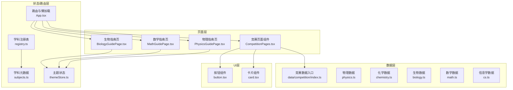
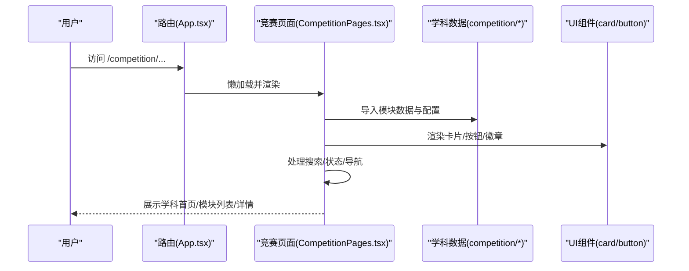
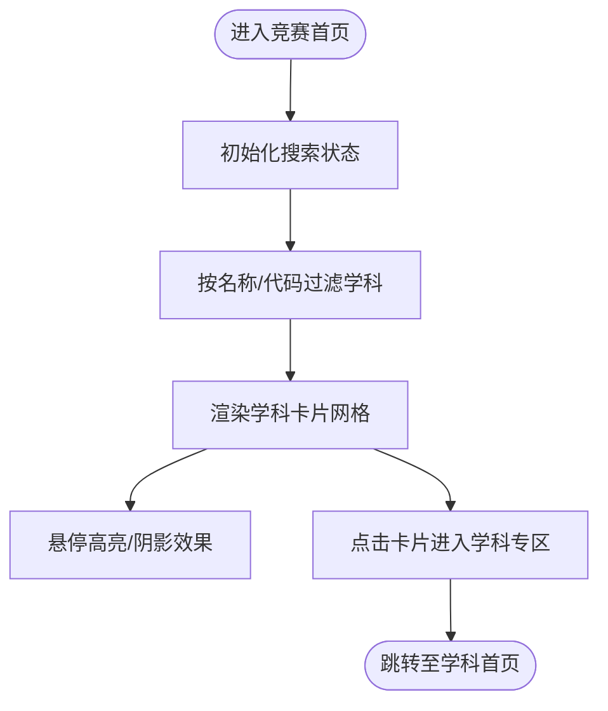
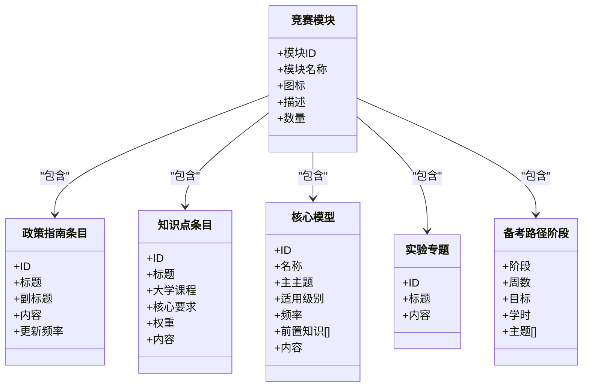
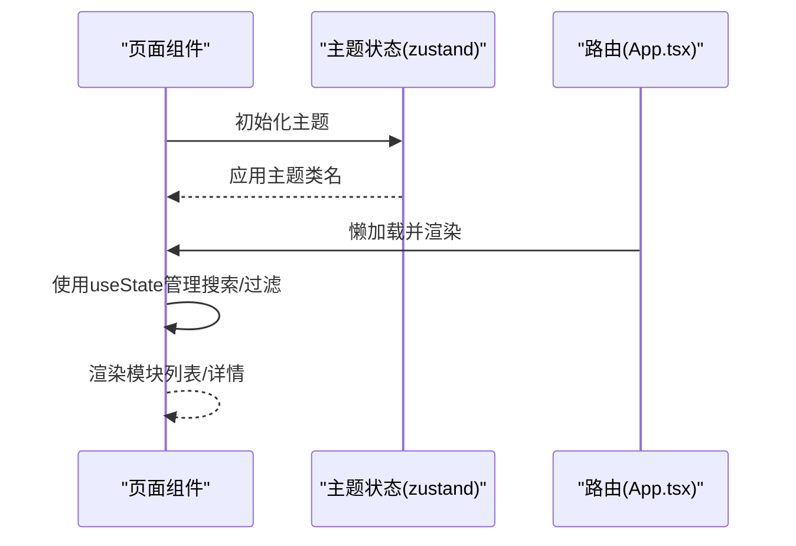
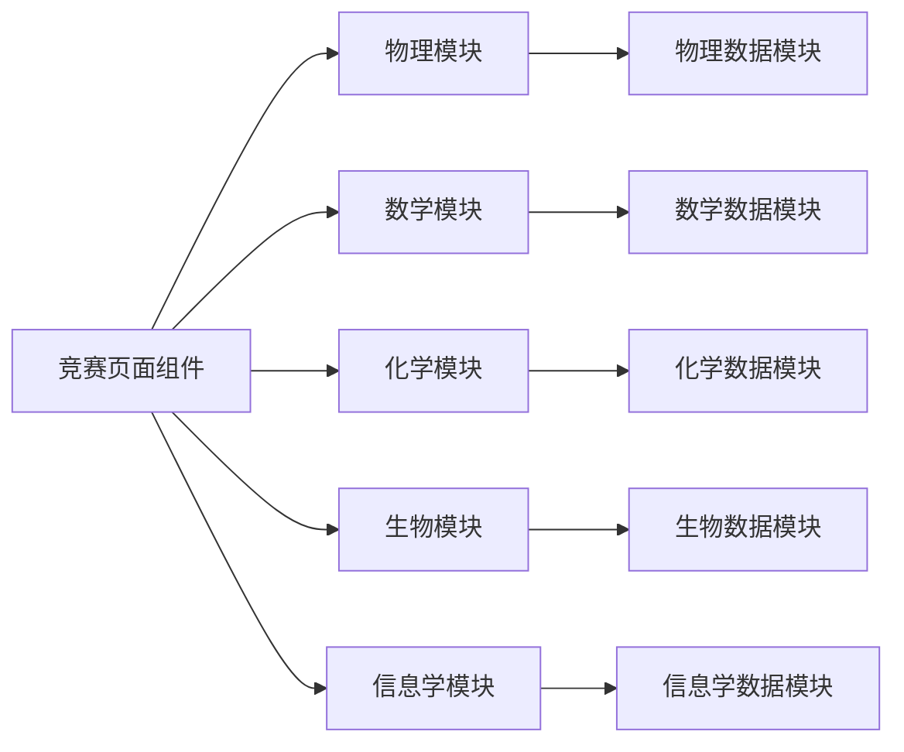
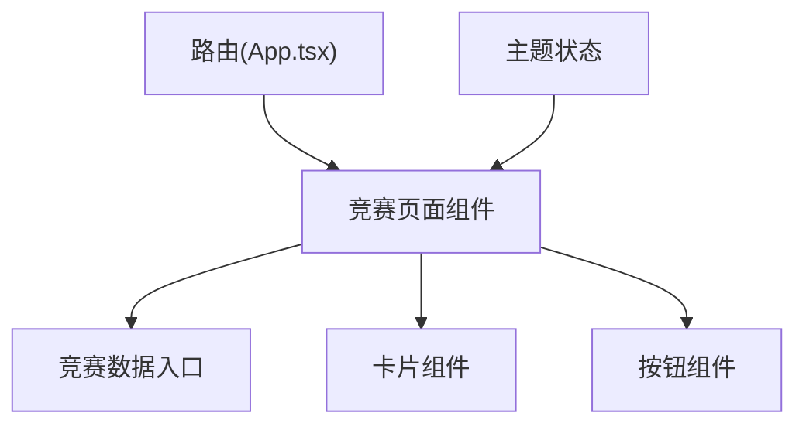

# 竞赛支持系统

<cite>
**本文档引用的文件**
- [src\sections\CompetitionPages.tsx](file://src\sections\CompetitionPages.tsx)
- [src\data\competition\index.ts](file://src\data\competition\index.ts)
- [src\data\competition\physics.ts](file://src\data\competition\physics.ts)
- [src\data\competition\chemistry.ts](file://src\data\competition\chemistry.ts)
- [src\data\competition\biology.ts](file://src\data\competition\biology.ts)
- [src\data\competition\math.ts](file://src\data\competition\math.ts)
- [src\data\competition\cs.ts](file://src\data\competition\cs.ts)
- [src\sections\PhysicsGuidePage.tsx](file://src\sections\PhysicsGuidePage.tsx)
- [src\sections\MathGuidePage.tsx](file://src\sections\MathGuidePage.tsx)
- [src\sections\BiologyGuidePage.tsx](file://src\sections\BiologyGuidePage.tsx)
- [src\components\ui\card.tsx](file://src\components\ui\card.tsx)
- [src\components\ui\button.tsx](file://src\components\ui\button.tsx)
- [src\stores\themeStore.ts](file://src\stores\themeStore.ts)
- [src\hooks\useSubjectData.ts](file://src\hooks\useSubjectData.ts)
- [src\App.tsx](file://src\App.tsx)
- [src\data\registry.ts](file://src\data\registry.ts)
- [src\data\subjects.ts](file://src\data\subjects.ts)
</cite>

## 目录
1. [引言](#引言)
2. [项目结构](#项目结构)
3. [核心组件](#核心组件)
4. [架构总览](#架构总览)
5. [详细组件分析](#详细组件分析)
6. [依赖分析](#依赖分析)
7. [性能考虑](#性能考虑)
8. [故障排查指南](#故障排查指南)
9. [结论](#结论)
10. [附录](#附录)

## 引言
本文件面向“星耀平台”的竞赛支持系统，系统性阐述五大学科竞赛（物理、数学、化学、生物、信息学/计算机科学）的完整支持体系设计。内容涵盖：
- 竞赛首页布局、学科卡片展示与搜索过滤
- 各学科模块化内容结构（政策指南、知识大纲、核心模型、真题训练、实验专题、备考路径）
- 数据结构设计、状态管理与动态加载机制
- 竞赛选择指南实现原理、学科图标映射与颜色主题配置
- 用户交互设计与路由/懒加载策略

## 项目结构
竞赛支持系统采用“页面组件 + 数据模块 + UI 组件 + 状态/路由”分层组织：
- 页面层：竞赛首页与各学科页面由单一页面组件按路由动态渲染
- 数据层：按学科拆分的数据模块，统一导出入口
- UI 层：通用卡片、按钮等组件封装
- 状态/路由层：主题状态、路由懒加载、学科元数据注册

图表来源
- [src\sections\CompetitionPages.tsx:1-800](file://src\sections\CompetitionPages.tsx#L1-L800)
- [src\data\competition\index.ts:1-10](file://src\data\competition\index.ts#L1-L10)
- [src\data\competition\physics.ts:1-265](file://src\data\competition\physics.ts#L1-L265)
- [src\data\competition\chemistry.ts:1-114](file://src\data\competition\chemistry.ts#L1-L114)
- [src\data\competition\biology.ts:1-121](file://src\data\competition\biology.ts#L1-L121)
- [src\data\competition\math.ts:1-116](file://src\data\competition\math.ts#L1-L116)
- [src\data\competition\cs.ts:1-118](file://src\data\competition\cs.ts#L1-L118)
- [src\components\ui\card.tsx:1-93](file://src\components\ui\card.tsx#L1-L93)
- [src\components\ui\button.tsx:1-63](file://src\components\ui\button.tsx#L1-L63)
- [src\stores\themeStore.ts:1-37](file://src\stores\themeStore.ts#L1-L37)
- [src\App.tsx:1-214](file://src\App.tsx#L1-L214)
- [src\data\registry.ts:1-48](file://src\data\registry.ts#L1-L48)
- [src\data\subjects.ts:1-30](file://src\data\subjects.ts#L1-L30)

章节来源
- [src\App.tsx:186-198](file://src\App.tsx#L186-L198)
- [src\sections\CompetitionPages.tsx:1-800](file://src\sections\CompetitionPages.tsx#L1-L800)
- [src\data\competition\index.ts:1-10](file://src\data\competition\index.ts#L1-L10)

## 核心组件
- 竞赛页面组件：统一承载五大学科首页、各模块列表页与通用占位页，内置搜索、状态徽章、模块导航与进度可视化
- 学科数据模块：定义政策指南、知识大纲、核心模型、实验专题、备考路径等数据结构与条目
- UI 组件：卡片、按钮等通用组件，保证一致的视觉与交互体验
- 主题状态：提供浅色/深色主题切换与初始化
- 路由与懒加载：竞赛页面统一懒加载，减少首屏体积

章节来源
- [src\sections\CompetitionPages.tsx:64-165](file://src\sections\CompetitionPages.tsx#L64-L165)
- [src\components\ui\card.tsx:1-93](file://src\components\ui\card.tsx#L1-L93)
- [src\components\ui\button.tsx:1-63](file://src\components\ui\button.tsx#L1-L63)
- [src\stores\themeStore.ts:1-37](file://src\stores\themeStore.ts#L1-L37)
- [src\App.tsx:12-13](file://src\App.tsx#L12-L13)

## 架构总览
系统采用“单页面组件 + 多模块数据 + 统一路由”的架构：
- 单页面组件负责布局、导航、搜索与模块入口
- 各学科数据模块提供结构化数据与模块配置
- 路由层统一懒加载竞赛页面，按路径动态渲染不同模块
- UI 组件与主题状态提供一致的交互与外观

图表来源
- [src\App.tsx:186-198](file://src\App.tsx#L186-L198)
- [src\sections\CompetitionPages.tsx:1-800](file://src\sections\CompetitionPages.tsx#L1-L800)
- [src\data\competition\physics.ts:47-54](file://src\data\competition\physics.ts#L47-L54)

## 详细组件分析

### 竞赛首页与学科卡片
- 布局与头部：展示竞赛徽章、标题与副标题，营造权威感
- 竞赛选择指南：以卡片形式展示指引入口与标签，帮助用户决策
- 学科卡片网格：按学科渲染卡片，包含图标、颜色、状态徽章、基本信息与进入按钮
- 搜索过滤：基于学科名称/代码进行本地过滤

图表来源
- [src\sections\CompetitionPages.tsx:64-165](file://src\sections\CompetitionPages.tsx#L64-L165)

章节来源
- [src\sections\CompetitionPages.tsx:64-165](file://src\sections\CompetitionPages.tsx#L64-L165)

### 学科模块化内容结构
以物理为例，各模块均采用统一的模块配置与数据结构：
- 政策与赛事指南：8条条目，含标题、副标题、内容与更新频率
- 知识大纲：11大板块与28个知识点，含大学课程对标、核心要求、权重与内容
- 核心模型：15个模型，含主主题、适用级别、频率、前置知识与内容
- 实验专题：9个专题，聚焦实验设计与创新
- 备考路径：6阶段规划，含周数、目标、学时与主题
- 真题训练：占位页，预留真题与解析

图表来源
- [src\data\competition\physics.ts:4-54](file://src\data\competition\physics.ts#L4-L54)
- [src\data\competition\physics.ts:125-158](file://src\data\competition\physics.ts#L125-L158)
- [src\data\competition\physics.ts:67-104](file://src\data\competition\physics.ts#L67-L104)
- [src\data\competition\physics.ts:106-123](file://src\data\competition\physics.ts#L106-L123)
- [src\data\competition\physics.ts:137-145](file://src\data\competition\physics.ts#L137-L145)
- [src\data\competition\physics.ts:147-158](file://src\data\competition\physics.ts#L147-L158)

章节来源
- [src\sections\CompetitionPages.tsx:168-268](file://src\sections\CompetitionPages.tsx#L168-L268)
- [src\sections\CompetitionPages.tsx:270-320](file://src\sections\CompetitionPages.tsx#L270-L320)
- [src\sections\CompetitionPages.tsx:322-388](file://src\sections\CompetitionPages.tsx#L322-L388)
- [src\sections\CompetitionPages.tsx:390-482](file://src\sections\CompetitionPages.tsx#L390-L482)
- [src\sections\CompetitionPages.tsx:484-558](file://src\sections\CompetitionPages.tsx#L484-L558)
- [src\sections\CompetitionPages.tsx:560-612](file://src\sections\CompetitionPages.tsx#L560-L612)
- [src\sections\CompetitionPages.tsx:614-654](file://src\sections\CompetitionPages.tsx#L614-L654)

### 数据结构设计与状态管理
- 数据结构：统一的接口定义（政策指南条目、知识点条目、核心模型、备考路径阶段、实验专题）确保各学科一致性
- 状态管理：页面内通过 useState 管理搜索状态与过滤结果；主题状态通过 zustand 管理浅色/深色主题
- 动态加载：路由层对竞赛页面进行懒加载，按路径动态渲染模块

图表来源
- [src\stores\themeStore.ts:13-34](file://src\stores\themeStore.ts#L13-L34)
- [src\App.tsx:12-13](file://src\App.tsx#L12-L13)
- [src\sections\CompetitionPages.tsx:168-268](file://src\sections\CompetitionPages.tsx#L168-L268)

章节来源
- [src\data\competition\physics.ts:4-54](file://src\data\competition\physics.ts#L4-L54)
- [src\stores\themeStore.ts:1-37](file://src\stores\themeStore.ts#L1-L37)
- [src\App.tsx:186-198](file://src\App.tsx#L186-L198)

### 竞赛选择指南与学科图标映射
- 竞赛选择指南：以卡片形式展示GS01-GS06系列标签，帮助用户进行兴趣、能力、投入产出与学校资源的综合评估
- 学科图标映射：通过 SUBJECT_ICONS 将学科ID映射到对应图标，结合颜色配置实现统一视觉风格

章节来源
- [src\sections\CompetitionPages.tsx:87-108](file://src\sections\CompetitionPages.tsx#L87-L108)
- [src\sections\CompetitionPages.tsx:54-61](file://src\sections\CompetitionPages.tsx#L54-L61)

### 颜色主题配置与用户交互
- 颜色主题：主题状态维护当前主题并同步到 DOM，支持切换与初始化
- 用户交互：卡片悬停阴影、按钮尺寸与状态、徽章颜色与文本、进度条可视化等

章节来源
- [src\stores\themeStore.ts:1-37](file://src\stores\themeStore.ts#L1-L37)
- [src\components\ui\card.tsx:1-93](file://src\components\ui\card.tsx#L1-L93)
- [src\components\ui\button.tsx:1-63](file://src\components\ui\button.tsx#L1-L63)

### 各学科页面组件结构与数据流
- 物理页面：政策指南、知识大纲、核心模型、实验专题、备考路径、真题训练（占位）
- 数学页面：政策指南、知识大纲、核心模型、真题训练、竞赛数学基础、备考路径
- 化学页面：政策指南、知识大纲、核心模型、真题训练、实验专题、备考路径
- 生物页面：政策指南、知识大纲、核心模型、真题训练、实验专题、备考路径
- 信息学页面：政策指南、知识大纲、核心模型、真题训练、数学基础、备考路径

图表来源
- [src\sections\CompetitionPages.tsx:168-268](file://src\sections\CompetitionPages.tsx#L168-L268)
- [src\sections\CompetitionPages.tsx:688-736](file://src\sections\CompetitionPages.tsx#L688-L736)
- [src\sections\CompetitionPages.tsx:738-768](file://src\sections\CompetitionPages.tsx#L738-L768)
- [src\sections\CompetitionPages.tsx:770-820](file://src\sections\CompetitionPages.tsx#L770-L820)
- [src\sections\CompetitionPages.tsx:822-880](file://src\sections\CompetitionPages.tsx#L822-L880)
- [src\sections\CompetitionPages.tsx:882-940](file://src\sections\CompetitionPages.tsx#L882-L940)

章节来源
- [src\sections\CompetitionPages.tsx:168-940](file://src\sections\CompetitionPages.tsx#L168-L940)
- [src\data\competition\physics.ts:160-265](file://src\data\competition\physics.ts#L160-L265)
- [src\data\competition\math.ts:17-116](file://src\data\competition\math.ts#L17-L116)
- [src\data\competition\chemistry.ts:17-114](file://src\data\competition\chemistry.ts#L17-L114)
- [src\data\competition\biology.ts:17-121](file://src\data\competition\biology.ts#L17-L121)
- [src\data\competition\cs.ts:17-118](file://src\data\competition\cs.ts#L17-L118)

## 依赖分析
- 页面到数据：竞赛页面组件通过数据入口统一导入各学科数据
- 页面到UI：使用卡片与按钮组件保证一致的视觉与交互
- 路由到页面：竞赛页面统一懒加载，路由层集中管理
- 状态到页面：主题状态初始化与切换影响全局外观

图表来源
- [src\sections\CompetitionPages.tsx:1-800](file://src\sections\CompetitionPages.tsx#L1-L800)
- [src\data\competition\index.ts:1-10](file://src\data\competition\index.ts#L1-L10)
- [src\App.tsx:186-198](file://src\App.tsx#L186-L198)
- [src\stores\themeStore.ts:1-37](file://src\stores\themeStore.ts#L1-L37)

章节来源
- [src\sections\CompetitionPages.tsx:1-800](file://src\sections\CompetitionPages.tsx#L1-L800)
- [src\App.tsx:186-198](file://src\App.tsx#L186-L198)

## 性能考虑
- 懒加载：竞赛页面统一懒加载，减少首屏资源占用
- 本地搜索：页面内 useState 管理搜索状态，避免额外请求
- 组件复用：UI 组件统一风格，降低维护成本与打包体积
- 数据结构：统一接口定义，便于扩展与维护

## 故障排查指南
- 页面无法渲染：检查路由配置与懒加载是否正确
- 主题不生效：确认主题初始化与 DOM 类名同步逻辑
- 搜索无效：确认搜索状态与过滤逻辑
- 数据缺失：检查数据入口与模块导出是否正确

章节来源
- [src\App.tsx:186-198](file://src\App.tsx#L186-L198)
- [src\stores\themeStore.ts:26-30](file://src\stores\themeStore.ts#L26-L30)
- [src\sections\CompetitionPages.tsx:64-165](file://src\sections\CompetitionPages.tsx#L64-L165)
- [src\data\competition\index.ts:1-10](file://src\data\competition\index.ts#L1-L10)

## 结论
本系统以“统一页面组件 + 模块化数据 + 统一路由”的方式，实现了五大学科竞赛的完整支持体系。通过清晰的数据结构、一致的UI组件与主题状态管理，既保证了良好的用户体验，也为后续扩展与维护提供了坚实基础。

## 附录
- 学科指南页面：物理、数学、生物指南页提供学科学习理念与方法论，作为竞赛学习的前置引导
- 学科元数据：学科元数据注册表与路由前缀，支撑页面与数据的一致性

章节来源
- [src\sections\PhysicsGuidePage.tsx:1-139](file://src\sections\PhysicsGuidePage.tsx#L1-L139)
- [src\sections\MathGuidePage.tsx:1-139](file://src\sections\MathGuidePage.tsx#L1-L139)
- [src\sections\BiologyGuidePage.tsx:1-139](file://src\sections\BiologyGuidePage.tsx#L1-L139)
- [src\data\registry.ts:1-48](file://src\data\registry.ts#L1-L48)
- [src\data\subjects.ts:1-30](file://src\data\subjects.ts#L1-L30)