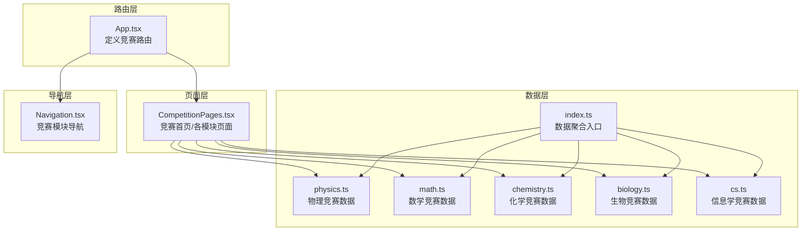
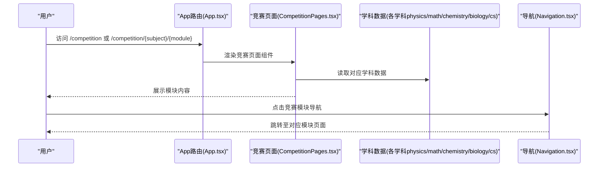
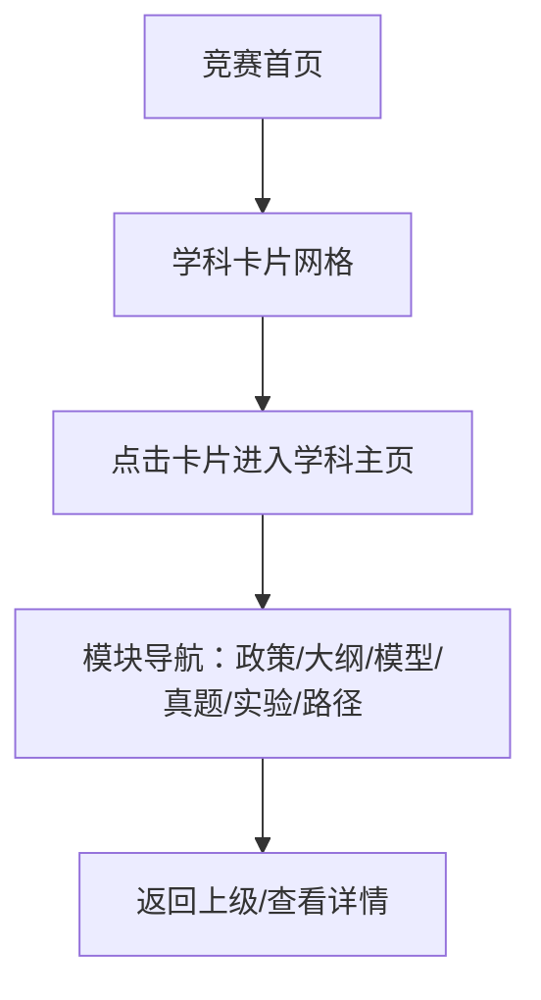
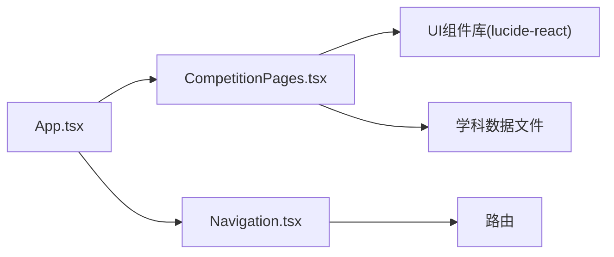

# 计算机竞赛专区

<cite>
**本文档引用的文件**
- [CompetitionPages.tsx](file://src/sections/CompetitionPages.tsx)
- [index.ts](file://src/data/competition/index.ts)
- [physics.ts](file://src/data/competition/physics.ts)
- [math.ts](file://src/data/competition/math.ts)
- [chemistry.ts](file://src/data/competition/chemistry.ts)
- [biology.ts](file://src/data/competition/biology.ts)
- [cs.ts](file://src/data/competition/cs.ts)
- [Navigation.tsx](file://src/components/layout/Navigation.tsx)
- [App.tsx](file://src/App.tsx)
- [useSubjectData.ts](file://src/hooks/useSubjectData.ts)
- [types.ts](file://src/stores/types.ts)
- [utils.ts](file://src/lib/utils.ts)
</cite>

## 目录
1. [简介](#简介)
2. [项目结构](#项目结构)
3. [核心组件](#核心组件)
4. [架构总览](#架构总览)
5. [详细组件分析](#详细组件分析)
6. [依赖分析](#依赖分析)
7. [性能考虑](#性能考虑)
8. [故障排除指南](#故障排除指南)
9. [结论](#结论)
10. [附录](#附录)

## 简介
本文件面向星耀平台的“计算机竞赛专区”，系统化阐述其完整的支持体系与实现方式，涵盖：
- 政策与赛事指南：竞赛历史、赛制、获奖等级、升学政策与资源推荐
- 知识大纲：学科知识板块、权重与核心知识点
- 核心模型详解：高频题型与模型的分类、前置知识与难度层次
- 真题训练：预赛/复赛/决赛真题与训练安排
- 竞赛数学基础：离散数学、数论、组合数学、概率与线性代数等
- 备考路径：三年系统规划与阶段性目标

同时，文档将详细说明页面的模块化设计、组件结构、状态管理与用户交互，并给出数据结构设计与动态加载机制、响应式布局实现的说明。

## 项目结构
计算机竞赛专区采用模块化页面与数据驱动的架构：
- 页面层：统一的竞赛页面组件负责渲染不同学科的竞赛模块
- 数据层：每个学科维护独立的数据文件，包含政策指南、知识大纲、核心模型、实验专题、备考路径等
- 导航层：全局导航与学科导航联动，支持竞赛模块的快速跳转
- 路由层：通过单一路由组件承载所有竞赛模块，实现按需渲染与共享打包

图表来源
- [App.tsx:146-158](file://src/App.tsx#L146-L158)
- [CompetitionPages.tsx:1-800](file://src/sections/CompetitionPages.tsx#L1-L800)
- [physics.ts:1-265](file://src/data/competition/physics.ts#L1-L265)
- [math.ts:1-116](file://src/data/competition/math.ts#L1-L116)
- [chemistry.ts:1-114](file://src/data/competition/chemistry.ts#L1-L114)
- [biology.ts:1-121](file://src/data/competition/biology.ts#L1-L121)
- [cs.ts:1-118](file://src/data/competition/cs.ts#L1-L118)
- [Navigation.tsx:61-150](file://src/components/layout/Navigation.tsx#L61-L150)

章节来源
- [App.tsx:146-158](file://src/App.tsx#L146-L158)
- [CompetitionPages.tsx:1-800](file://src/sections/CompetitionPages.tsx#L1-L800)
- [index.ts:1-10](file://src/data/competition/index.ts#L1-L10)

## 核心组件
- 竞赛首页组件：展示五大学科竞赛卡片，支持搜索过滤，呈现赛制、时间、实验、周期与状态
- 学科竞赛主页：展示学科模块导航（政策指南、知识大纲、核心模型、真题训练、实验专题、备考路径）
- 各模块页面：政策指南列表、知识大纲列表、核心模型列表、备考路径、实验专题、真题训练占位页
- 导航系统：竞赛模块导航与学科导航联动，支持移动端与桌面端

章节来源
- [CompetitionPages.tsx:64-165](file://src/sections/CompetitionPages.tsx#L64-L165)
- [CompetitionPages.tsx:168-268](file://src/sections/CompetitionPages.tsx#L168-L268)
- [CompetitionPages.tsx:271-320](file://src/sections/CompetitionPages.tsx#L271-L320)
- [CompetitionPages.tsx:323-388](file://src/sections/CompetitionPages.tsx#L323-L388)
- [CompetitionPages.tsx:391-482](file://src/sections/CompetitionPages.tsx#L391-L482)
- [CompetitionPages.tsx:485-558](file://src/sections/CompetitionPages.tsx#L485-L558)
- [CompetitionPages.tsx:561-612](file://src/sections/CompetitionPages.tsx#L561-L612)
- [CompetitionPages.tsx:615-654](file://src/sections/CompetitionPages.tsx#L615-L654)
- [Navigation.tsx:61-150](file://src/components/layout/Navigation.tsx#L61-L150)

## 架构总览
竞赛专区采用“单一页面多模块”模式，通过路由参数决定渲染哪个模块；数据通过独立文件按学科组织，统一导出入口便于页面引用。

图表来源
- [App.tsx:146-158](file://src/App.tsx#L146-L158)
- [CompetitionPages.tsx:1-800](file://src/sections/CompetitionPages.tsx#L1-L800)
- [Navigation.tsx:61-150](file://src/components/layout/Navigation.tsx#L61-L150)

## 详细组件分析

### 页面模块化设计与导航系统
- 学科卡片展示：竞赛首页以网格卡片展示五大学科，支持搜索过滤，卡片包含学科颜色、赛制、时间、实验、周期与内容状态
- 模块导航系统：学科主页提供六个模块入口，分别对应政策指南、知识大纲、核心模型、真题训练、实验专题、备考路径
- 导航联动：全局导航中的“竞赛”模块提供快速跳转，移动端与桌面端适配

图表来源
- [CompetitionPages.tsx:111-161](file://src/sections/CompetitionPages.tsx#L111-L161)
- [CompetitionPages.tsx:168-268](file://src/sections/CompetitionPages.tsx#L168-L268)
- [Navigation.tsx:61-150](file://src/components/layout/Navigation.tsx#L61-L150)

章节来源
- [CompetitionPages.tsx:64-165](file://src/sections/CompetitionPages.tsx#L64-L165)
- [CompetitionPages.tsx:168-268](file://src/sections/CompetitionPages.tsx#L168-L268)
- [Navigation.tsx:61-150](file://src/components/layout/Navigation.tsx#L61-L150)

### 政策与赛事指南
- 物理竞赛：包含竞赛概述、报名流程、各阶段考试形式与难度、获奖等级与升学优惠、各省竞赛水平与名额、竞赛 vs 强基 vs 高考的选择、学习资源推荐、IPhO与APhO简介
- 数学竞赛：包含竞赛概述、赛制详解、奖项等级与作用、入门路径、一试与二试区别、竞赛与强基计划、竞赛与物理/信息学、常见误区与备考建议
- 化学竞赛：包含竞赛概述、赛制详解、奖项等级与作用、入门路径、初赛与决赛区别、竞赛与强基计划、竞赛与生物/医学、常见误区与备考建议
- 生物竞赛：包含竞赛概述、赛制详解、奖项等级与作用、入门路径、联赛与决赛区别、竞赛与医学/生命科学、竞赛与化学、常见误区与备考建议
- 信息学竞赛：包含竞赛概述、赛制详解、奖项等级与作用、编程语言选择、CSP-J与CSP-S区别、竞赛与强基计划、竞赛与计算机专业、常见误区与备考建议

章节来源
- [physics.ts:125-135](file://src/data/competition/physics.ts#L125-L135)
- [math.ts:52-61](file://src/data/competition/math.ts#L52-L61)
- [chemistry.ts:51-60](file://src/data/competition/chemistry.ts#L51-L60)
- [biology.ts:55-64](file://src/data/competition/biology.ts#L55-L64)
- [cs.ts:53-62](file://src/data/competition/cs.ts#L53-L62)

### 知识大纲
- 物理竞赛：十一大板块，涵盖力学、热学、电磁学、光学、近代物理、实验物理、数学物理方法，每个板块包含权重与核心知识点
- 数学竞赛：四大板块，涵盖代数、几何、组合数学、数论，每个板块包含权重与核心知识点
- 化学竞赛：四大板块，涵盖普通化学、有机化学、无机化学、分析化学，每个板块包含权重与核心知识点
- 生物竞赛：六大板块，涵盖细胞生物学、遗传与进化、植物解剖与生理、动物解剖与生理、生态学、生物化学与分子生物学，每个板块包含权重与核心知识点
- 信息学竞赛：四大板块，涵盖基础算法、数据结构、图论、数学基础，每个板块包含权重与核心知识点

章节来源
- [physics.ts:57-104](file://src/data/competition/physics.ts#L57-L104)
- [math.ts:44-85](file://src/data/competition/math.ts#L44-L85)
- [chemistry.ts:43-84](file://src/data/competition/chemistry.ts#L43-L84)
- [biology.ts:45-92](file://src/data/competition/biology.ts#L45-L92)
- [cs.ts:45-89](file://src/data/competition/cs.ts#L45-L89)

### 核心模型详解
- 物理竞赛：15个核心模型，覆盖刚体复合运动、多过程力学综合、非惯性系综合问题、耦合振子与简正模、复杂电路网络模型、介质电磁场模型、电磁感应综合模型、带电粒子复杂运动、波动光学综合模型、热力学过程综合、相对论动力学模型、原子物理综合、核反应与衰变模型、变分法与拉格朗日力学、物理实验设计模型
- 数学竞赛：10个核心模型，覆盖不等式证明综合、递推数列构造、平面几何四大定理、几何变换综合、图论经典问题、组合构造存在性、数论综合证明、多变量函数最值、圆锥曲线竞赛结论、集合与组合计数
- 医学竞赛：8个核心模型，覆盖遗传系谱分析、光合呼吸综合、神经-体液-免疫网络、种群增长模型、中心法则与基因表达、能量流动与物质循环、细胞代谢整合、分子杂交与基因工程
- 信息学竞赛：8个核心模型，覆盖背包DP、区间DP、树形DP、最短路综合、搜索与剪枝、单调性与队列优化、Tarjan算法族、数论与多项式

章节来源
- [physics.ts:107-123](file://src/data/competition/physics.ts#L107-L123)
- [math.ts:88-99](file://src/data/competition/math.ts#L88-L99)
- [biology.ts:95-104](file://src/data/competition/biology.ts#L95-L104)
- [cs.ts:92-101](file://src/data/competition/cs.ts#L92-L101)

### 真题训练
- 物理竞赛：提供预赛真题、复赛真题、决赛真题的占位页面，标注“即将上线”
- 数学竞赛：提供历年联赛/IMO真题的占位页面
- 化学竞赛：提供历年预赛/初赛/决赛真题的占位页面
- 生物竞赛：提供历年联赛/决赛真题的占位页面
- 信息学竞赛：提供历年CSP/NOIP/NOI真题（知识内容）的占位页面

章节来源
- [CompetitionPages.tsx:615-654](file://src/sections/CompetitionPages.tsx#L615-L654)
- [CompetitionPages.tsx:661-686](file://src/sections/CompetitionPages.tsx#L661-L686)

### 竞赛数学基础
- 数学竞赛：提供微积分初步、线性代数基础、初等数论进阶、概率与统计初步、复数与多项式等基础模块
- 信息学竞赛：提供离散数学基础、数论基础、组合数学基础、概率与信息论基础、线性代数基础等基础模块

章节来源
- [math.ts:109-115](file://src/data/competition/math.ts#L109-L115)
- [cs.ts:111-117](file://src/data/competition/cs.ts#L111-L117)

### 备考路径
- 物理竞赛：六阶段规划，涵盖高一到高三的系统准备，明确每周、目标、学时与主题
- 数学竞赛：三阶段规划，涵盖高一到高三的系统准备，明确每周、目标、学时与主题
- 化学竞赛：三阶段规划，涵盖高一到高三的系统准备，明确每周、目标、学时与主题
- 生物竞赛：三阶段规划，涵盖高一到高三的系统准备，明确每周、目标、学时与主题
- 信息学竞赛：三阶段规划，涵盖初一到高二的系统准备，明确每周、目标、学时与主题

章节来源
- [physics.ts:138-145](file://src/data/competition/physics.ts#L138-L145)
- [math.ts:102-106](file://src/data/competition/math.ts#L102-L106)
- [chemistry.ts:99-103](file://src/data/competition/chemistry.ts#L99-L103)
- [biology.ts:107-111](file://src/data/competition/biology.ts#L107-L111)
- [cs.ts:104-108](file://src/data/competition/cs.ts#L104-L108)

### 组件结构分析与状态管理
- 状态管理：页面内部使用React状态管理（如搜索框状态），模块间通过路由参数切换，无需全局状态
- 用户交互：卡片点击、模块导航、搜索输入、查看详情按钮等
- 响应式布局：桌面端网格布局与移动端卡片布局，导航采用汉堡菜单与下拉菜单

章节来源
- [CompetitionPages.tsx:64-165](file://src/sections/CompetitionPages.tsx#L64-L165)
- [CompetitionPages.tsx:168-268](file://src/sections/CompetitionPages.tsx#L168-L268)
- [Navigation.tsx:369-547](file://src/components/layout/Navigation.tsx#L369-L547)

### 数据结构设计
- 政策指南条目：包含唯一标识、标题、副标题、内容、更新频率
- 知识大纲条目：包含唯一标识、标题、大学课程对标、核心要求描述、考试权重、内容
- 核心模型：包含唯一标识、名称、主要主题、考试层级、频率、前置知识列表、内容、训练题ID列表
- 备考路径阶段：包含阶段名称、周数、目标、学时、主题列表
- 实验专题：包含唯一标识、标题、内容
- 学科概览：包含学科ID、名称、代码、全名、颜色、赛制、考试时间、实验、数学需求、学习周期、内容状态、链接、模块列表

章节来源
- [physics.ts:4-44](file://src/data/competition/physics.ts#L4-L44)
- [physics.ts:161-265](file://src/data/competition/physics.ts#L161-L265)

### 动态加载机制与响应式布局
- 动态加载：竞赛页面组件通过单一路由加载，按模块渲染，减少重复加载
- 响应式布局：导航采用移动端汉堡菜单与桌面端下拉菜单，页面采用网格布局与卡片布局

章节来源
- [App.tsx:12-13](file://src/App.tsx#L12-L13)
- [Navigation.tsx:369-547](file://src/components/layout/Navigation.tsx#L369-L547)

## 依赖分析
- 组件依赖：页面组件依赖UI组件库（Card、Button、Tabs、Input等）与图标库（lucide-react）
- 数据依赖：页面组件依赖学科数据文件，统一通过聚合入口导出
- 导航依赖：导航组件依赖路由与主题状态，提供竞赛模块导航

图表来源
- [CompetitionPages.tsx:1-800](file://src/sections/CompetitionPages.tsx#L1-L800)
- [Navigation.tsx:1-719](file://src/components/layout/Navigation.tsx#L1-L719)
- [App.tsx:1-174](file://src/App.tsx#L1-L174)

章节来源
- [CompetitionPages.tsx:1-800](file://src/sections/CompetitionPages.tsx#L1-L800)
- [Navigation.tsx:1-719](file://src/components/layout/Navigation.tsx#L1-L719)
- [App.tsx:1-174](file://src/App.tsx#L1-L174)

## 性能考虑
- 代码分割：竞赛页面组件通过懒加载与路由共享，减少首屏加载体积
- 组件复用：模块化设计提升组件复用率，降低重复渲染
- 状态最小化：页面内部状态集中在必要字段，避免过度状态提升
- 响应式优化：移动端与桌面端布局差异优化，减少不必要的DOM节点

## 故障排除指南
- 路由无法访问：检查路由配置是否包含竞赛相关路径
- 模块内容为空：确认数据文件是否正确导出，页面是否正确引用
- 导航异常：检查导航组件的模块配置与路径是否一致
- 性能问题：确认是否启用代码分割与懒加载，避免一次性加载过多模块

章节来源
- [App.tsx:146-158](file://src/App.tsx#L146-L158)
- [Navigation.tsx:61-150](file://src/components/layout/Navigation.tsx#L61-L150)

## 结论
星耀平台的计算机竞赛专区通过模块化页面与数据驱动的方式，构建了覆盖政策、知识、模型、真题、数学基础与备考路径的完整支持体系。页面采用统一的导航与响应式布局，数据按学科独立维护并通过聚合入口导出，既保证了内容的完整性，也确保了良好的用户体验与可维护性。

## 附录
- 数据聚合入口：学科数据通过聚合入口统一导出，便于页面按需引用
- 类型定义：共享类型定义位于stores/types.ts，便于跨模块使用

章节来源
- [index.ts:1-10](file://src/data/competition/index.ts#L1-L10)
- [types.ts:1-12](file://src/stores/types.ts#L1-L12)