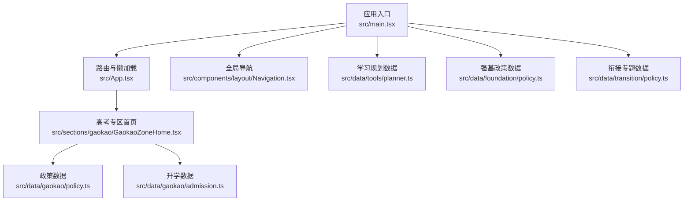
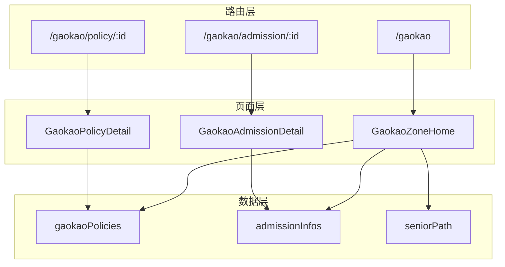
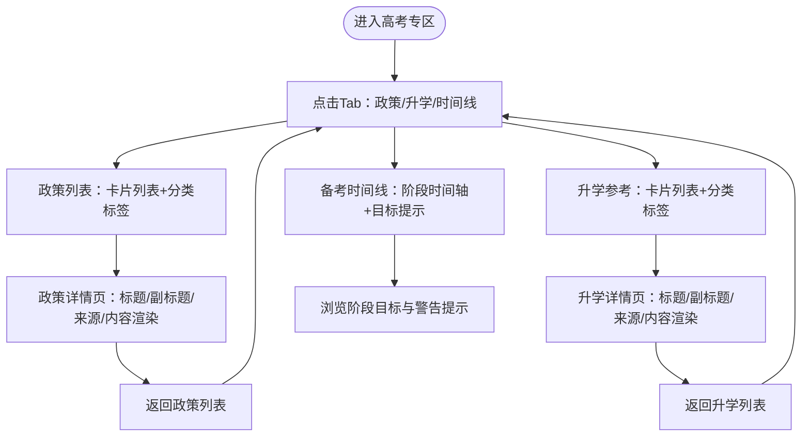
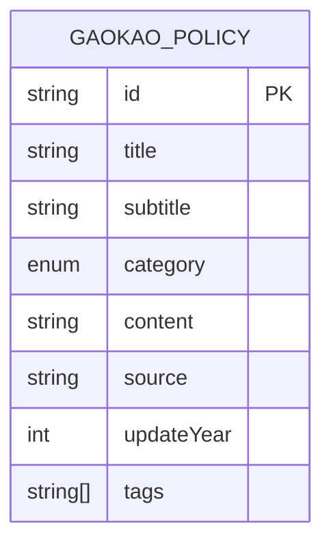
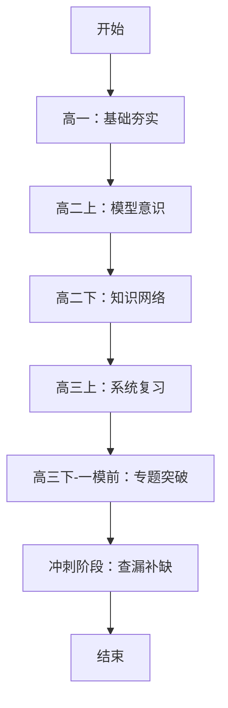
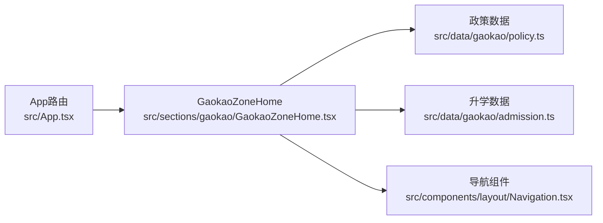

# 高考专区

<cite>
**本文引用的文件**
- [src/App.tsx](file://src/App.tsx)
- [src/main.tsx](file://src/main.tsx)
- [src/sections/gaokao/GaokaoZoneHome.tsx](file://src/sections/gaokao/GaokaoZoneHome.tsx)
- [src/data/gaokao/policy.ts](file://src/data/gaokao/policy.ts)
- [src/data/gaokao/admission.ts](file://src/data/gaokao/admission.ts)
- [src/components/layout/Navigation.tsx](file://src/components/layout/Navigation.tsx)
- [src/stores/types.ts](file://src/stores/types.ts)
- [src/hooks/useSubjectData.ts](file://src/hooks/useSubjectData.ts)
- [SPEC.md](file://SPEC.md)
- [src/data/tools/planner.ts](file://src/data/tools/planner.ts)
- [src/data/foundation/policy.ts](file://src/data/foundation/policy.ts)
- [src/data/transition/policy.ts](file://src/data/transition/policy.ts)
</cite>

## 目录
1. [引言](#引言)
2. [项目结构](#项目结构)
3. [核心组件](#核心组件)
4. [架构总览](#架构总览)
5. [详细组件分析](#详细组件分析)
6. [依赖分析](#依赖分析)
7. [性能考量](#性能考量)
8. [故障排查指南](#故障排查指南)
9. [结论](#结论)
10. [附录](#附录)

## 引言
本文件面向“星耀平台”的“高考专区”，系统化阐述其页面布局、政策文件展示、升学数据管理、时间线规划、实时更新机制、省份差异处理、个性化推荐（现有与待实现）、志愿填报指导、专业选择建议、院校信息查询、复习策略与应试技巧、时间管理、数据结构设计、状态管理与学习轨迹跟踪，并提供组件架构分析、性能优化策略与用户体验设计原则。文档以代码为依据，辅以可视化图表，帮助开发者与产品人员快速理解与迭代。

## 项目结构
- 路由与懒加载：高考专区路由在应用入口集中注册，采用懒加载以优化首屏性能。
- 页面与数据：高考专区页面组件负责展示政策、升学参考与备考时间线；数据来自独立的 TypeScript 模块，便于维护与版本化。
- 导航与布局：顶部导航与侧边栏组件提供跨学科与工具导航，贯穿专区页面。
- 学习工具与路径：学习规划与目标路径数据与高考专区形成互补，支持“应试策略”与“志愿填报”等后续扩展。

**图表来源**
- [src/main.tsx:1-19](file://src/main.tsx#L1-L19)
- [src/App.tsx:178-181](file://src/App.tsx#L178-L181)
- [src/sections/gaokao/GaokaoZoneHome.tsx:1-316](file://src/sections/gaokao/GaokaoZoneHome.tsx#L1-L316)
- [src/data/gaokao/policy.ts:1-309](file://src/data/gaokao/policy.ts#L1-L309)
- [src/data/gaokao/admission.ts:1-313](file://src/data/gaokao/admission.ts#L1-L313)
- [src/components/layout/Navigation.tsx:1-719](file://src/components/layout/Navigation.tsx#L1-L719)
- [src/data/tools/planner.ts:98-124](file://src/data/tools/planner.ts#L98-L124)
- [src/data/foundation/policy.ts:1-405](file://src/data/foundation/policy.ts#L1-L405)
- [src/data/transition/policy.ts:1-244](file://src/data/transition/policy.ts#L1-L244)

**章节来源**
- [src/App.tsx:178-181](file://src/App.tsx#L178-L181)
- [src/main.tsx:6-12](file://src/main.tsx#L6-L12)

## 核心组件
- 高考专区首页：提供“高考政策”“升学参考”“备考时间线”三栏切换，支持学科专项入口（物理/化学/数学）。
- 政策详情页：展示政策/趋势/新题型等内容，支持表格渲染与层级标题渲染。
- 升学参考详情页：展示强基/综合评价/选科组合等升学信息，支持表格渲染与层级标题渲染。
- 数据模块：政策与升学数据以接口定义与数组形式提供，便于扩展与版本化。

**章节来源**
- [src/sections/gaokao/GaokaoZoneHome.tsx:11-210](file://src/sections/gaokao/GaokaoZoneHome.tsx#L11-L210)
- [src/sections/gaokao/GaokaoZoneHome.tsx:213-316](file://src/sections/gaokao/GaokaoZoneHome.tsx#L213-L316)
- [src/data/gaokao/policy.ts:2-11](file://src/data/gaokao/policy.ts#L2-L11)
- [src/data/gaokao/admission.ts:2-11](file://src/data/gaokao/admission.ts#L2-L11)

## 架构总览
高考专区采用“页面组件 + 数据模块 + 路由懒加载”的分层架构：
- 页面组件负责 UI 呈现与交互（Tab 切换、链接跳转、详情渲染）。
- 数据模块负责结构化数据（政策、升学、时间线），支持分类、标签、来源与更新年份。
- 路由层负责页面挂载与参数解析（如政策/升学详情页的 id 参数）。
- 导航层提供跨学科与工具导航，增强用户在平台内的流转体验。

**图表来源**
- [src/App.tsx:178-181](file://src/App.tsx#L178-L181)
- [src/sections/gaokao/GaokaoZoneHome.tsx:7-9](file://src/sections/gaokao/GaokaoZoneHome.tsx#L7-L9)

## 详细组件分析

### 页面布局与交互
- 顶部导航：包含“首页”返回、“高考专区”标识，便于用户定位。
- Tab 切换：支持“高考政策”“升学参考”“备考时间线”三类内容切换。
- 学科专项入口：提供物理/化学/数学的“高考专项”快捷入口，颜色与背景区分，增强视觉引导。
- 详情页导航：政策与升学详情页提供返回“高考专区”的面包屑导航。

**图表来源**
- [src/sections/gaokao/GaokaoZoneHome.tsx:11-210](file://src/sections/gaokao/GaokaoZoneHome.tsx#L11-L210)
- [src/sections/gaokao/GaokaoZoneHome.tsx:213-316](file://src/sections/gaokao/GaokaoZoneHome.tsx#L213-L316)

**章节来源**
- [src/sections/gaokao/GaokaoZoneHome.tsx:11-210](file://src/sections/gaokao/GaokaoZoneHome.tsx#L11-L210)

### 政策文件展示与渲染
- 数据结构：政策条目包含 id、标题、副标题、分类（政策/趋势/新题型/分析）、内容（Markdown）、来源、更新年份、标签。
- 列表展示：卡片列表，支持分类标签与简要描述。
- 详情渲染：对标题层级、加粗、表格等 Markdown 片段进行正则替换与表格渲染，确保可读性。
- 分类与标签：用于筛选与检索，便于扩展个性化推荐。

**图表来源**
- [src/data/gaokao/policy.ts:2-11](file://src/data/gaokao/policy.ts#L2-L11)

**章节来源**
- [src/data/gaokao/policy.ts:13-259](file://src/data/gaokao/policy.ts#L13-L259)
- [src/sections/gaokao/GaokaoZoneHome.tsx:89-120](file://src/sections/gaokao/GaokaoZoneHome.tsx#L89-L120)
- [src/sections/gaokao/GaokaoZoneHome.tsx:213-261](file://src/sections/gaokao/GaokaoZoneHome.tsx#L213-L261)

### 升学参考信息管理
- 数据结构：升学条目包含 id、标题、副标题、分类（强基/综合评价/竞赛/选科组合等）、内容（Markdown）、来源、更新年份、标签。
- 列表展示：卡片列表，支持分类标签与简要描述。
- 详情渲染：对标题层级、加粗、表格等 Markdown 片段进行正则替换与表格渲染，确保可读性。
- 分类与标签：用于筛选与检索，便于扩展个性化推荐。

**图表来源**
- [src/data/gaokao/admission.ts:2-11](file://src/data/gaokao/admission.ts#L2-L11)

**章节来源**
- [src/data/gaokao/admission.ts:13-312](file://src/data/gaokao/admission.ts#L13-L312)
- [src/sections/gaokao/GaokaoZoneHome.tsx:122-154](file://src/sections/gaokao/GaokaoZoneHome.tsx#L122-L154)
- [src/sections/gaokao/GaokaoZoneHome.tsx:264-315](file://src/sections/gaokao/GaokaoZoneHome.tsx#L264-L315)

### 备考时间线规划
- 数据结构：包含阶段数组，每阶段包含阶段名称、时间段、目标、关键模型与警告提示。
- 展示方式：时间轴样式，左侧序号圆点，右侧卡片展示阶段目标与警告，增强可读性与提醒效果。

**图表来源**
- [src/data/gaokao/policy.ts:261-309](file://src/data/gaokao/policy.ts#L261-L309)
- [src/sections/gaokao/GaokaoZoneHome.tsx:156-206](file://src/sections/gaokao/GaokaoZoneHome.tsx#L156-L206)

**章节来源**
- [src/data/gaokao/policy.ts:261-309](file://src/data/gaokao/policy.ts#L261-L309)
- [src/sections/gaokao/GaokaoZoneHome.tsx:156-206](file://src/sections/gaokao/GaokaoZoneHome.tsx#L156-L206)

### 实时更新机制与省份差异处理
- 更新机制：政策与升学条目包含“更新年份”字段，便于前端展示最新版本；内容以 Markdown 字符串存储，支持版本化管理。
- 省份差异：政策数据包含“来源”字段与“更新年份”，可在详情页标注来源与时效；页面支持按分类筛选，便于用户快速定位目标信息。
- 建议：未来可引入“地区维度”字段与“版本号”字段，配合前端缓存与版本切换，实现更精细的更新与回溯。

**章节来源**
- [src/data/gaokao/policy.ts:52-54](file://src/data/gaokao/policy.ts#L52-L54)
- [src/data/gaokao/admission.ts:56-58](file://src/data/gaokao/admission.ts#L56-L58)

### 个性化推荐算法（现状与待实现）
- 现状：页面通过分类标签与关键词进行内容呈现，未见显式的推荐算法实现。
- 待实现：参考“应试策略”规划（S01-S07），可引入“基于学科与题型的策略推荐”“基于学习目标的路径推荐”“基于错题与薄弱点的题目推荐”等模块，结合用户学习轨迹与偏好进行排序与过滤。

**章节来源**
- [SPEC.md:692-716](file://SPEC.md#L692-L716)

### 志愿填报指导、专业选择建议与院校信息查询
- 志愿填报：学习规划数据包含“志愿填报”节点，建议在高考专区新增“志愿填报指导”模块，结合分数与批次线进行可视化建议。
- 专业选择：升学参考数据包含“选科要求”“强基专业”“综合评价”等，建议在政策与升学模块之间增加“专业库”与“院校库”入口，支持按专业/院校/地区/批次线筛选。
- 院校信息：强基政策数据包含“各校强基政策对比”，建议在高考专区新增“院校信息查询”模块，支持按高校类型、专业、入围线等维度检索。

**章节来源**
- [src/data/tools/planner.ts:98-104](file://src/data/tools/planner.ts#L98-L104)
- [src/data/gaokao/admission.ts:14-59](file://src/data/gaokao/admission.ts#L14-L59)
- [src/data/foundation/policy.ts:165-215](file://src/data/foundation/policy.ts#L165-L215)

### 复习策略、应试技巧与时间管理
- 复习策略：强基政策数据包含“备考路径”，建议在高考专区新增“应试策略”模块，按学科与题型提炼通用方法（参考“应试策略”规划）。
- 应试技巧：政策详情页支持表格与层级标题渲染，建议在策略模块中增加“技巧清单”“易错清单”“限时训练”等子模块。
- 时间管理：学习规划数据包含“关键焦点”“推荐路径”，建议在高考专区新增“时间管理”模块，提供“三轮复习计划”“应试技巧训练”“心态调整”等子模块。

**章节来源**
- [src/data/foundation/policy.ts:364-404](file://src/data/foundation/policy.ts#L364-L404)
- [SPEC.md:692-716](file://SPEC.md#L692-L716)
- [src/data/tools/planner.ts:107-119](file://src/data/tools/planner.ts#L107-L119)

### 数据结构设计、状态管理与学习轨迹跟踪
- 数据结构：政策与升学条目采用统一接口定义，便于扩展与维护；时间线采用阶段数组结构，便于渲染与迭代。
- 状态管理：当前页面组件使用本地状态（activeTab），建议引入全局状态（如用户偏好、收藏、学习进度）以支持跨页面联动。
- 学习轨迹：建议引入“学习轨迹”模块，记录用户访问、收藏、练习与测试等行为，结合“应试策略”与“学习规划”进行个性化推荐。

**章节来源**
- [src/stores/types.ts:2-11](file://src/stores/types.ts#L2-L11)
- [src/hooks/useSubjectData.ts:5-19](file://src/hooks/useSubjectData.ts#L5-L19)

## 依赖分析
- 路由依赖：高考专区路由依赖页面组件与数据模块；页面组件依赖数据模块与 UI 组件。
- 组件依赖：页面组件依赖 UI 卡片、徽章、图标等基础组件；导航组件提供跨学科与工具导航。
- 数据依赖：政策与升学数据模块独立于页面组件，便于版本化与扩展。

**图表来源**
- [src/App.tsx:178-181](file://src/App.tsx#L178-L181)
- [src/sections/gaokao/GaokaoZoneHome.tsx:7-9](file://src/sections/gaokao/GaokaoZoneHome.tsx#L7-L9)
- [src/components/layout/Navigation.tsx:1-719](file://src/components/layout/Navigation.tsx#L1-L719)

**章节来源**
- [src/App.tsx:178-181](file://src/App.tsx#L178-L181)
- [src/sections/gaokao/GaokaoZoneHome.tsx:7-9](file://src/sections/gaokao/GaokaoZoneHome.tsx#L7-L9)

## 性能考量
- 懒加载：路由层采用懒加载，减少初始包体，提升首屏加载速度。
- 组件渲染：政策与升学详情页对 Markdown 进行正则替换与表格渲染，建议在服务端或构建期进行预处理，减少客户端渲染开销。
- 数据体积：政策与升学数据以数组形式存储，建议引入分页或按需加载，避免一次性渲染过多条目。
- 缓存策略：建议引入浏览器缓存与版本号机制，确保用户获取最新内容的同时减少重复请求。

[本节为通用性能建议，无需特定文件引用]

## 故障排查指南
- 页面空白或路由不生效：检查路由注册与懒加载是否正确，确认页面组件导出与路径一致。
- 数据未显示：检查数据模块导出与页面组件导入，确认数据结构与渲染逻辑一致。
- 表格渲染异常：检查 Markdown 正则替换逻辑与表格片段过滤，确保边界条件处理正确。
- 导航异常：检查导航组件的路径匹配与可用性判断，确保学科与工具导航正常显示。

**章节来源**
- [src/App.tsx:178-181](file://src/App.tsx#L178-L181)
- [src/sections/gaokao/GaokaoZoneHome.tsx:233-257](file://src/sections/gaokao/GaokaoZoneHome.tsx#L233-L257)

## 结论
高考专区以清晰的页面布局、结构化的数据模块与路由懒加载为基础，实现了政策解读、升学参考与时间线规划的完整闭环。建议后续引入个性化推荐、志愿填报指导、专业与院校信息查询、应试策略与时间管理模块，并完善状态管理与学习轨迹跟踪，以进一步提升用户体验与平台价值。

## 附录
- 术语说明：政策、升学、强基、综合评价、选科组合、应试策略、学习规划、时间线。
- 扩展建议：引入地区维度、版本号、收藏与学习轨迹、个性化推荐算法与可视化建议。

[本节为补充说明，无需特定文件引用]