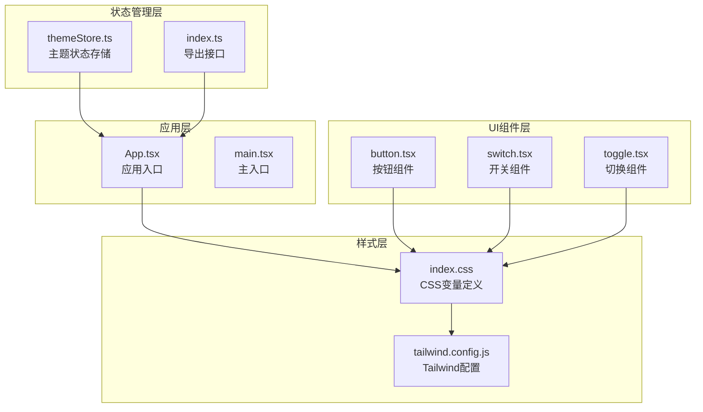
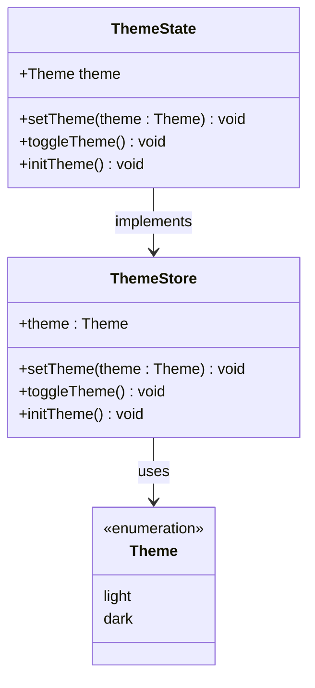
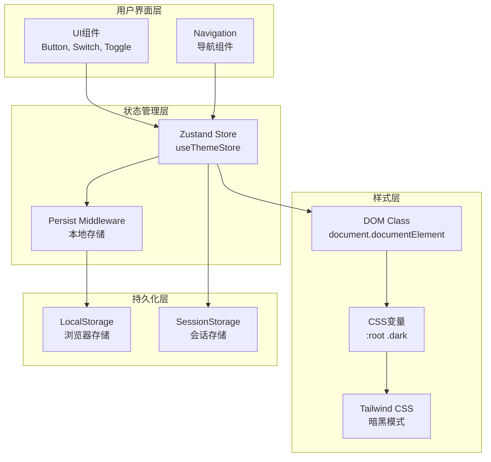
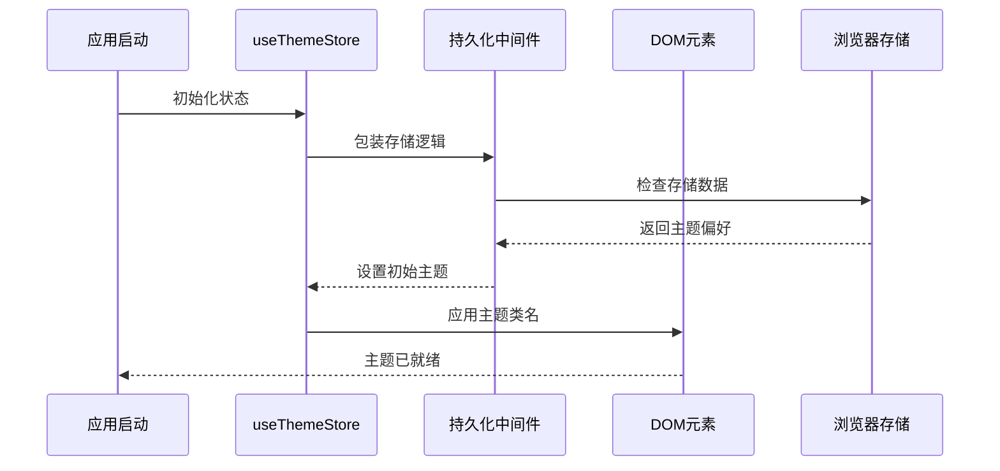
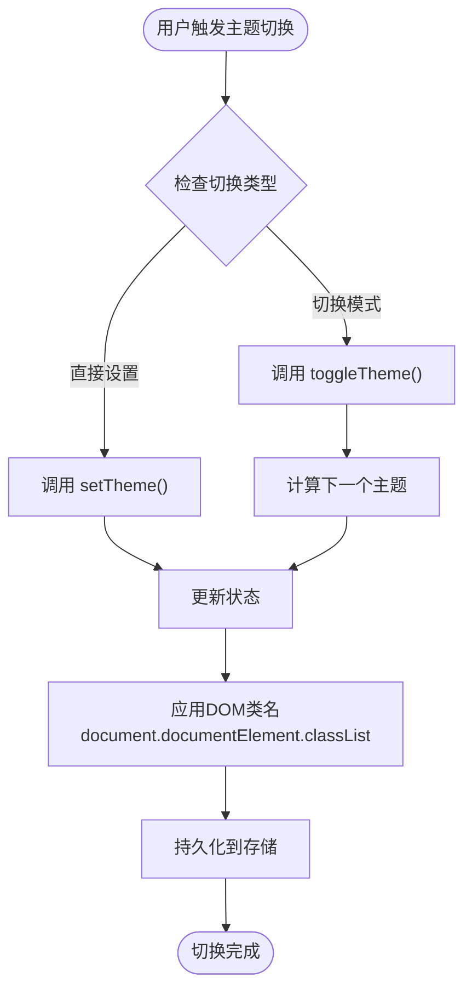
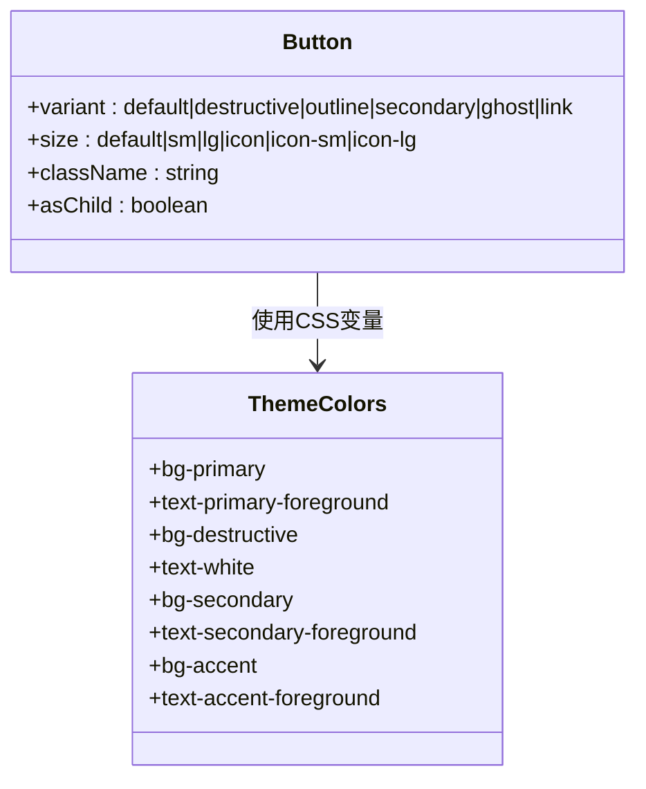
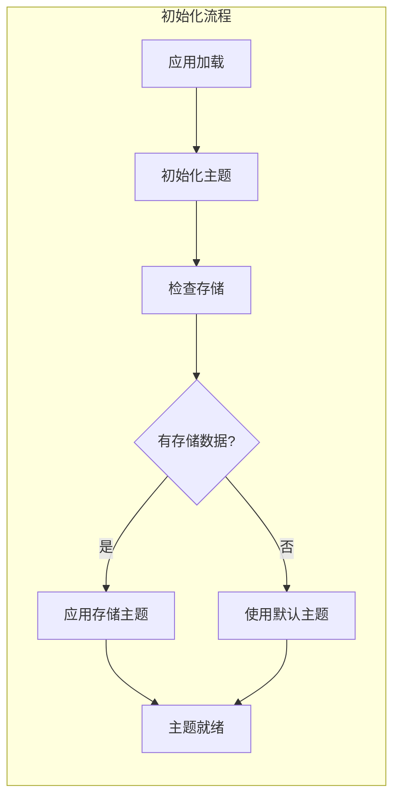

# 主题状态管理

<cite>
**本文档引用的文件**
- [themeStore.ts](file://src/stores/themeStore.ts)
- [index.ts](file://src/stores/index.ts)
- [App.tsx](file://src/App.tsx)
- [main.tsx](file://src/main.tsx)
- [index.css](file://src/index.css)
- [tailwind.config.js](file://tailwind.config.js)
- [button.tsx](file://src/components/ui/button.tsx)
- [switch.tsx](file://src/components/ui/switch.tsx)
- [toggle.tsx](file://src/components/ui/toggle.tsx)
</cite>

## 目录
1. [简介](#简介)
2. [项目结构](#项目结构)
3. [核心组件](#核心组件)
4. [架构概览](#架构概览)
5. [详细组件分析](#详细组件分析)
6. [依赖分析](#依赖分析)
7. [性能考虑](#性能考虑)
8. [故障排除指南](#故障排除指南)
9. [结论](#结论)

## 简介

星耀平台的主题状态管理系统是一个基于 Zustand 的轻量级状态管理解决方案，专门用于管理应用的主题切换、颜色方案和暗黑模式支持。该系统通过持久化存储确保用户偏好的跨会话保持，并与 Tailwind CSS 的暗黑模式功能无缝集成。

系统采用现代化的状态管理模式，提供简洁的 API 接口，支持动态主题切换和用户偏好保存。通过与 UI 组件的深度集成，实现了流畅的主题切换体验和一致的视觉效果。

## 项目结构

主题状态管理系统在项目中的组织结构如下：



**图表来源**
- [themeStore.ts:1-37](file://src/stores/themeStore.ts#L1-L37)
- [index.ts:1-3](file://src/stores/index.ts#L1-L3)
- [App.tsx:1-174](file://src/App.tsx#L1-L174)

**章节来源**
- [themeStore.ts:1-37](file://src/stores/themeStore.ts#L1-L37)
- [index.ts:1-3](file://src/stores/index.ts#L1-L3)
- [App.tsx:1-174](file://src/App.tsx#L1-L174)

## 核心组件

### useThemeStore 核心状态管理

useThemeStore 是整个主题系统的核心，基于 Zustand 创建的状态存储，提供了完整的主题管理功能。

#### 主要功能特性

1. **主题状态管理**
   - 支持 'light' 和 'dark' 两种主题模式
   - 类型安全的主题枚举定义
   - 默认主题设置为 'light'

2. **主题切换机制**
   - `setTheme(theme: Theme)` - 直接设置指定主题
   - `toggleTheme()` - 在明暗主题间切换
   - `initTheme()` - 初始化主题状态

3. **持久化存储**
   - 使用 Zustand middleware 进行本地存储
   - 存储键名为 'xingyao-theme'
   - 自动恢复用户上次的主题偏好

#### 状态结构定义



**图表来源**
- [themeStore.ts:4-11](file://src/stores/themeStore.ts#L4-L11)
- [themeStore.ts:13-34](file://src/stores/themeStore.ts#L13-L34)

**章节来源**
- [themeStore.ts:1-37](file://src/stores/themeStore.ts#L1-L37)

## 架构概览

主题状态管理系统采用分层架构设计，确保了良好的可维护性和扩展性：



**图表来源**
- [themeStore.ts:13-34](file://src/stores/themeStore.ts#L13-L34)
- [index.css:5-46](file://src/index.css#L5-L46)
- [tailwind.config.js:4-52](file://tailwind.config.js#L4-L52)

## 详细组件分析

### 主题状态存储实现

#### Zustand Store 配置

useThemeStore 使用 Zustand 的 create 函数创建，结合 persist 中间件实现持久化：



**图表来源**
- [themeStore.ts:13-34](file://src/stores/themeStore.ts#L13-L34)
- [App.tsx:69-75](file://src/App.tsx#L69-L75)

#### 主题切换流程



**图表来源**
- [themeStore.ts:17-30](file://src/stores/themeStore.ts#L17-L30)

### 样式系统集成

#### CSS 变量定义

系统使用 CSS 自定义属性实现主题颜色管理：

| 层级 | 变量 | 说明 |
|------|------|------|
| :root | --background, --foreground | 基础背景和前景色 |
| :root | --primary, --secondary | 主要和次要品牌色 |
| :root | --muted, --accent | 柔和和强调色 |
| :root | --destructive | 错误和危险色 |
| :root | --border, --input, --ring | 边框、输入和焦点环色 |
| .dark | 同上 | 暗黑模式下的颜色值 |

#### Tailwind CSS 集成

Tailwind CSS 通过配置启用暗黑模式支持：

```mermaid
graph LR
subgraph "Tailwind配置"
DM[darkMode: 'class']
EXT[colors扩展]
end
subgraph "CSS变量映射"
BG[background -> var(--background)]
FG[foreground -> var(--foreground)]
PR[primary -> var(--primary)]
SEC[secondary -> var(--secondary)]
end
DM --> BG
DM --> FG
DM --> PR
DM --> SEC
EXT --> BG
EXT --> FG
EXT --> PR
EXT --> SEC
```

**图表来源**
- [tailwind.config.js:5](file://tailwind.config.js#L5)
- [tailwind.config.js:12-42](file://tailwind.config.js#L12-L42)
- [index.css:6-45](file://src/index.css#L6-L45)

**章节来源**
- [index.css:1-77](file://src/index.css#L1-L77)
- [tailwind.config.js:1-52](file://tailwind.config.js#L1-L52)

### UI 组件集成

#### 按钮组件主题适配

按钮组件通过 CSS 变量自动适配主题：



**图表来源**
- [button.tsx:7-37](file://src/components/ui/button.tsx#L7-L37)

#### 开关和切换组件

开关组件提供直观的主题切换交互：

| 组件 | 功能 | 主题适配 |
|------|------|----------|
| Switch | 二进制主题切换 | 使用 data-[state=checked] 适配 |
| Toggle | 复合状态切换 | 使用 data-[state=on] 适配 |

**章节来源**
- [button.tsx:1-63](file://src/components/ui/button.tsx#L1-L63)
- [switch.tsx:1-31](file://src/components/ui/switch.tsx#L1-L31)
- [toggle.tsx:1-45](file://src/components/ui/toggle.tsx#L1-L45)

## 依赖分析

### 核心依赖关系

```mermaid
graph TD
subgraph "外部依赖"
ZUS[zustand<br/>状态管理库]
PERSIST[zustand/middleware<br/>持久化中间件]
RADIX[@radix-ui/react-*<br/>UI组件库]
CVAVA[class-variance-authority<br/>样式变体库]
end
subgraph "内部模块"
THEME[themeStore.ts<br/>主题状态]
APP[App.tsx<br/>应用入口]
CSS[index.css<br/>样式定义]
TWC[tailwind.config.js<br/>配置文件]
end
ZUS --> THEME
PERSIST --> THEME
RADIX --> APP
CVAVA --> APP
THEME --> APP
CSS --> TWC
THEME --> CSS
```

**图表来源**
- [themeStore.ts:1-2](file://src/stores/themeStore.ts#L1-L2)
- [button.tsx:2-3](file://src/components/ui/button.tsx#L2-L3)

### 模块耦合度分析

系统采用低耦合设计，各模块职责明确：

| 模块 | 耦合度 | 说明 |
|------|--------|------|
| themeStore.ts | 低 | 仅依赖外部状态管理库 |
| App.tsx | 低 | 通过导出接口使用主题功能 |
| UI组件 | 低 | 通过CSS变量自动适配主题 |
| 样式文件 | 中 | 与Tailwind配置存在依赖关系 |

**章节来源**
- [index.ts:1-3](file://src/stores/index.ts#L1-L3)

## 性能考虑

### 状态更新优化

1. **最小化重渲染**
   - 使用 Zustand 的浅比较优化
   - 避免不必要的状态订阅
   - 批量更新相关状态

2. **持久化存储策略**
   - 仅存储必要的主题数据
   - 异步存储避免阻塞主线程
   - 内存缓存减少存储访问

3. **DOM 操作优化**
   - 单次 DOM 类名切换
   - 避免重复的样式计算
   - 利用 CSS 变量减少重绘

### 加载性能



**图表来源**
- [themeStore.ts:26-30](file://src/stores/themeStore.ts#L26-L30)
- [App.tsx:69-75](file://src/App.tsx#L69-L75)

## 故障排除指南

### 常见问题及解决方案

#### 主题不生效

**症状**: 主题切换后界面颜色未改变

**可能原因**:
1. CSS 变量未正确定义
2. Tailwind 配置问题
3. DOM 类名未正确应用

**解决步骤**:
1. 检查 `index.css` 中的 CSS 变量定义
2. 验证 `tailwind.config.js` 的 darkMode 配置
3. 确认 `document.documentElement` 类名切换逻辑

#### 主题偏好丢失

**症状**: 用户刷新页面后主题偏好恢复默认

**可能原因**:
1. 浏览器存储禁用
2. 持久化中间件配置错误
3. 存储键名冲突

**解决步骤**:
1. 检查浏览器存储功能
2. 验证 `persist` 中间件配置
3. 确认存储键名唯一性

#### 性能问题

**症状**: 主题切换响应缓慢

**优化建议**:
1. 减少不必要的状态订阅
2. 避免在主题切换时执行重型操作
3. 使用防抖处理频繁的主题切换

**章节来源**
- [themeStore.ts:17-30](file://src/stores/themeStore.ts#L17-L30)
- [index.css:5-46](file://src/index.css#L5-L46)

## 结论

星耀平台的主题状态管理系统通过精心设计的架构实现了高效的主题管理功能。系统采用现代化的技术栈，提供了简洁易用的 API 接口和良好的用户体验。

### 主要优势

1. **简洁性**: 基于 Zustand 的轻量级实现，API 设计直观
2. **持久化**: 自动保存用户偏好，提供一致的使用体验
3. **可扩展性**: 支持未来添加更多主题选项和自定义功能
4. **性能**: 优化的状态管理和 DOM 操作确保流畅的用户体验

### 技术亮点

- **类型安全**: 完整的 TypeScript 类型定义
- **样式集成**: 与 Tailwind CSS 的无缝集成
- **组件适配**: UI 组件自动适配主题变化
- **初始化优化**: 应用启动时的快速主题初始化

该系统为星耀平台提供了坚实的主题管理基础，支持未来的功能扩展和性能优化需求。