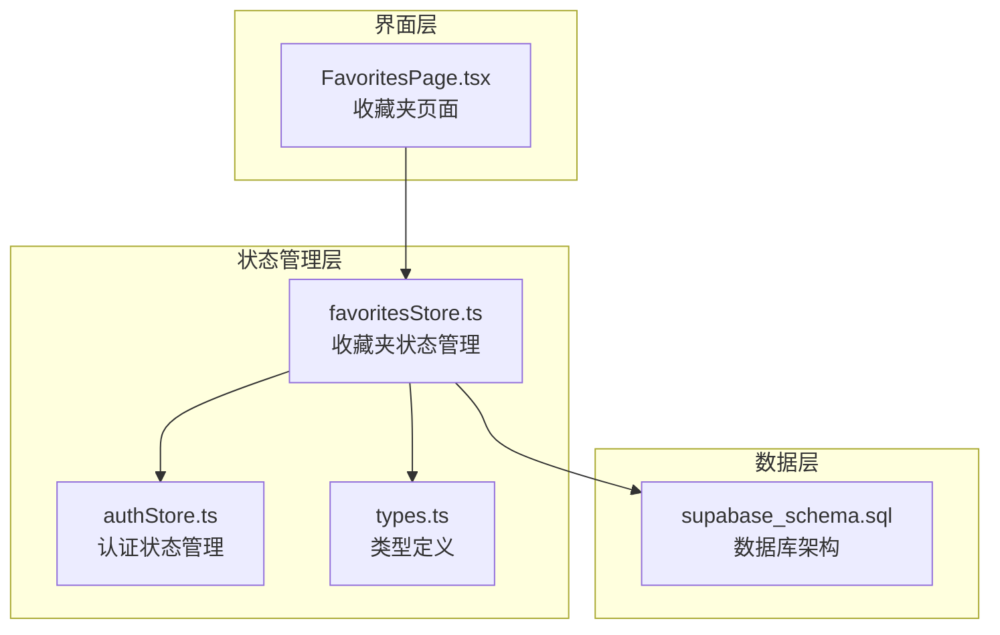
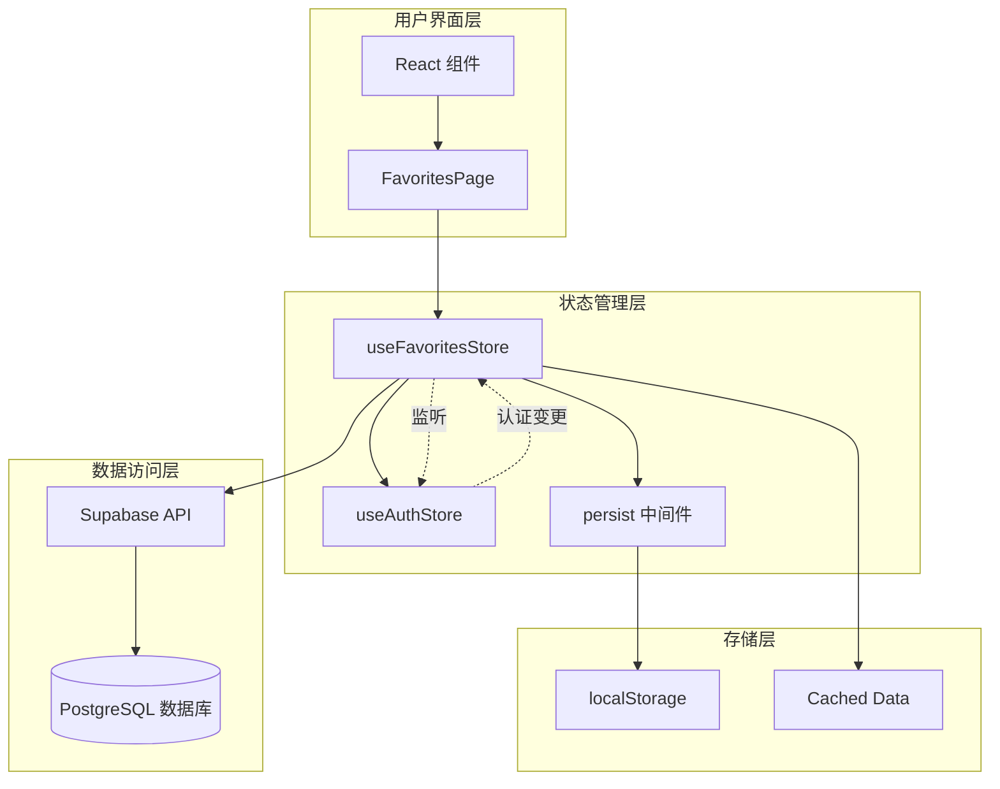
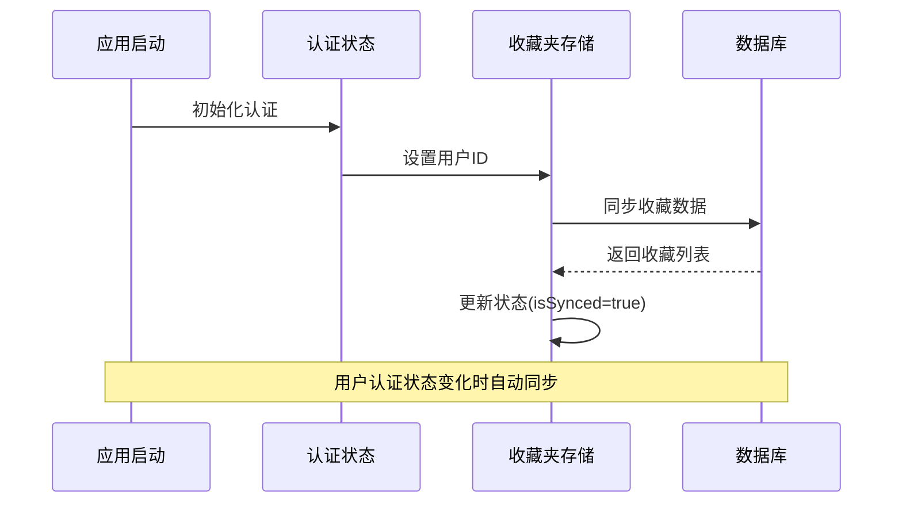
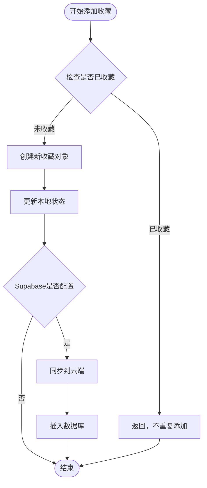
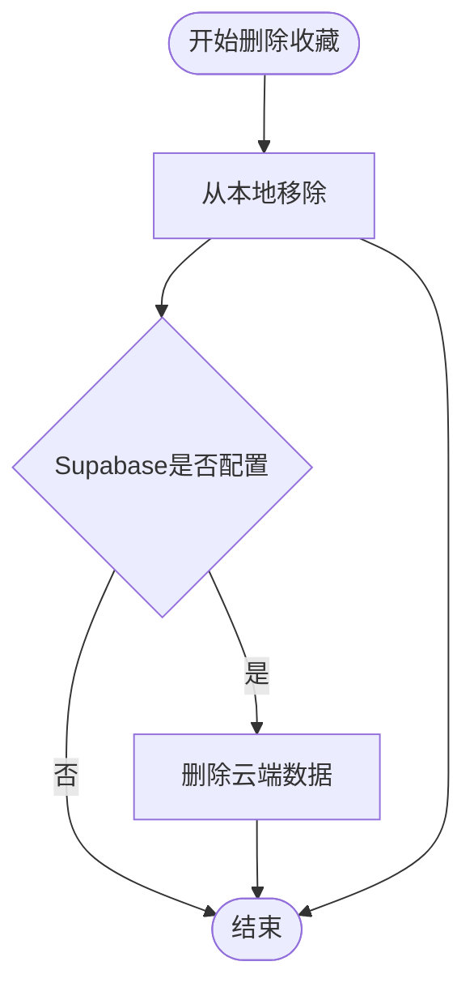
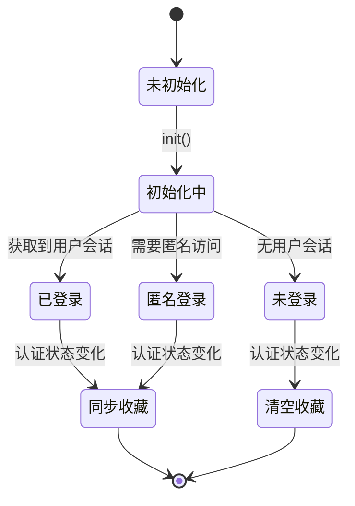
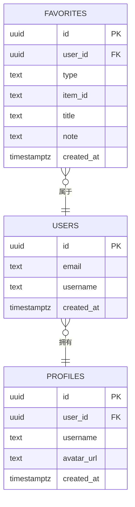
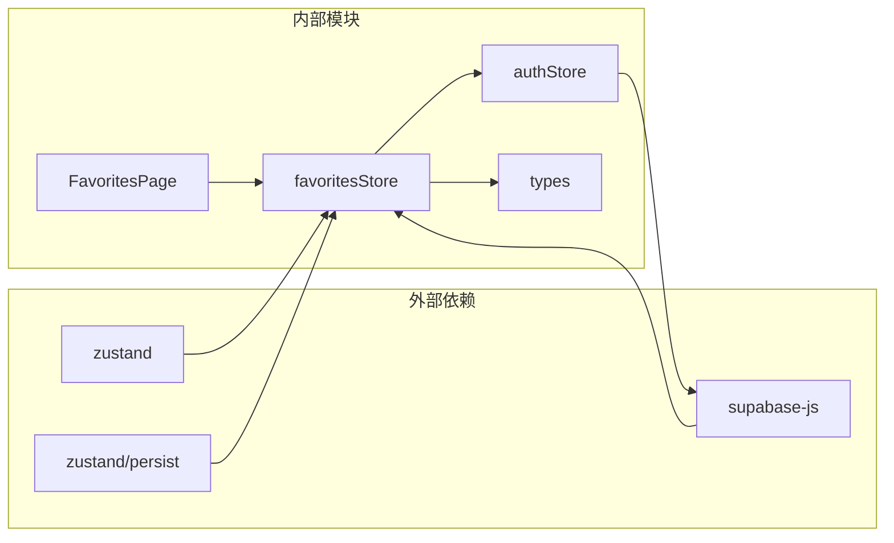
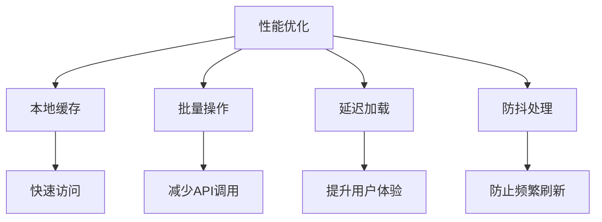

# 收藏夹状态管理

<cite>
**本文档引用的文件**
- [favoritesStore.ts](file://src/stores/favoritesStore.ts)
- [types.ts](file://src/stores/types.ts)
- [authStore.ts](file://src/stores/authStore.ts)
- [FavoritesPage.tsx](file://src/sections/FavoritesPage.tsx)
- [supabase_schema.sql](file://supabase_schema.sql)
</cite>

## 目录
1. [简介](#简介)
2. [项目结构](#项目结构)
3. [核心组件](#核心组件)
4. [架构概览](#架构概览)
5. [详细组件分析](#详细组件分析)
6. [依赖关系分析](#依赖关系分析)
7. [性能考虑](#性能考虑)
8. [故障排除指南](#故障排除指南)
9. [结论](#结论)
10. [附录](#附录)

## 简介

星耀平台的收藏夹状态管理系统是一个基于 Zustand 的状态管理解决方案，用于管理用户的学习内容收藏。该系统实现了本地状态管理、云端同步、数据一致性保证和用户体验优化等核心功能。

系统支持四种收藏类型：知识模型(model)、解题套路(strategy)、物理视界(vision)和题目(question)，为用户提供统一的收藏体验。通过与 Supabase 的深度集成，系统确保了数据的实时同步和持久化存储。

## 项目结构

收藏夹状态管理系统主要分布在以下文件中：



**图表来源**
- [favoritesStore.ts:1-172](file://src/stores/favoritesStore.ts#L1-L172)
- [authStore.ts:1-63](file://src/stores/authStore.ts#L1-L63)
- [FavoritesPage.tsx:1-257](file://src/sections/FavoritesPage.tsx#L1-L257)

**章节来源**
- [favoritesStore.ts:1-172](file://src/stores/favoritesStore.ts#L1-L172)
- [authStore.ts:1-63](file://src/stores/authStore.ts#L1-L63)
- [FavoritesPage.tsx:1-257](file://src/sections/FavoritesPage.tsx#L1-L257)

## 核心组件

### 收藏夹状态存储器

`useFavoritesStore` 是整个系统的核心，基于 Zustand 实现，提供了完整的 CRUD 操作和同步机制。

#### 主要功能特性

1. **本地状态管理**：使用 Zustand 管理内存中的收藏夹数据
2. **云端同步**：与 Supabase 实时同步收藏数据
3. **数据持久化**：支持本地存储和云端存储的无缝切换
4. **类型安全**：严格的 TypeScript 类型定义确保数据完整性

#### 数据结构设计

```mermaid
classDiagram
class Favorite {
+string id
+FavoriteType type
+string itemId
+string title
+string addedAt
+string note
}
class FavoriteType {
<<enumeration>>
"model"
"strategy"
"vision"
"question"
}
class FavoritesState {
+Favorite[] favorites
+boolean isLoading
+boolean isSynced
+syncFromSupabase() Promise~void~
+addFavorite(item) void
+removeFavorite(itemId, type) void
+toggleFavorite(item) void
+isFavorited(itemId, type) boolean
+clearAll() void
}
Favorite --> FavoriteType : "uses"
FavoritesState --> Favorite : "manages"
```

**图表来源**
- [types.ts:1-12](file://src/stores/types.ts#L1-L12)
- [favoritesStore.ts:7-19](file://src/stores/favoritesStore.ts#L7-L19)

**章节来源**
- [favoritesStore.ts:1-172](file://src/stores/favoritesStore.ts#L1-L172)
- [types.ts:1-12](file://src/stores/types.ts#L1-L12)

## 架构概览

系统采用分层架构设计，确保了良好的可维护性和扩展性：



**图表来源**
- [favoritesStore.ts:30-151](file://src/stores/favoritesStore.ts#L30-L151)
- [authStore.ts:15-62](file://src/stores/authStore.ts#L15-L62)

系统架构的关键特点：

1. **响应式设计**：通过 Zustand 的订阅机制实现实时状态更新
2. **渐进式增强**：支持离线模式和在线模式的无缝切换
3. **数据一致性**：通过 Supabase 的实时同步确保多设备数据一致
4. **错误处理**：完善的异常处理和降级机制

## 详细组件分析

### 收藏夹状态管理器

#### 状态初始化与生命周期



**图表来源**
- [favoritesStore.ts:153-171](file://src/stores/favoritesStore.ts#L153-L171)
- [authStore.ts:20-37](file://src/stores/authStore.ts#L20-L37)

#### 添加收藏流程



**图表来源**
- [favoritesStore.ts:65-94](file://src/stores/favoritesStore.ts#L65-L94)

#### 删除收藏流程



**图表来源**
- [favoritesStore.ts:96-114](file://src/stores/favoritesStore.ts#L96-L114)

### 认证状态管理

认证系统与收藏夹状态紧密集成，确保用户数据的安全性和一致性：



**图表来源**
- [authStore.ts:15-62](file://src/stores/authStore.ts#L15-L62)
- [favoritesStore.ts:154-171](file://src/stores/favoritesStore.ts#L154-L171)

### 数据库架构

收藏夹数据存储在 Supabase 的 PostgreSQL 数据库中，具有完善的数据约束和索引：



**图表来源**
- [supabase_schema.sql:39-59](file://supabase_schema.sql#L39-L59)

**章节来源**
- [favoritesStore.ts:1-172](file://src/stores/favoritesStore.ts#L1-L172)
- [authStore.ts:1-63](file://src/stores/authStore.ts#L1-L63)
- [supabase_schema.sql:1-178](file://supabase_schema.sql#L1-L178)

## 依赖关系分析

系统依赖关系清晰，层次分明：



**图表来源**
- [favoritesStore.ts:1-5](file://src/stores/favoritesStore.ts#L1-L5)
- [authStore.ts:1-2](file://src/stores/authStore.ts#L1-L2)

### 关键依赖特性

1. **Zustand 集成**：提供轻量级的状态管理解决方案
2. **持久化中间件**：支持本地存储和云端存储的智能切换
3. **Supabase 集成**：实现实时数据同步和认证管理
4. **类型安全**：完整的 TypeScript 类型定义确保编译时检查

**章节来源**
- [favoritesStore.ts:1-5](file://src/stores/favoritesStore.ts#L1-L5)
- [authStore.ts:1-2](file://src/stores/authStore.ts#L1-L2)

## 性能考虑

### 缓存策略

系统采用了多层次的缓存策略来优化性能：

1. **本地缓存**：使用 Zustand 在内存中缓存收藏数据
2. **持久化缓存**：在 Supabase 未配置时使用 localStorage
3. **智能同步**：只在用户认证状态变化时触发同步

### 性能优化措施



### 数据一致性保证

1. **乐观更新**：先更新本地状态，再同步到云端
2. **冲突解决**：通过 Supabase 的唯一约束防止重复收藏
3. **回滚机制**：云端操作失败时自动回滚本地状态

## 故障排除指南

### 常见问题及解决方案

#### 认证相关问题

| 问题描述 | 可能原因 | 解决方案 |
|---------|---------|---------|
| 收藏数据无法同步 | Supabase 未正确配置 | 检查环境变量和数据库连接 |
| 登录后数据丢失 | 认证状态未正确初始化 | 调用 `useAuthStore.getState().init()` |
| 匿名用户权限不足 | RLS 策略配置错误 | 检查 `favorites` 表的 RLS 策略 |

#### 性能相关问题

| 问题描述 | 可能原因 | 解决方案 |
|---------|---------|---------|
| 页面加载缓慢 | 收藏数据过多 | 实现分页加载和虚拟滚动 |
| 同步延迟 | 网络连接不稳定 | 添加重试机制和错误提示 |
| 内存泄漏 | 订阅未正确清理 | 确保组件卸载时清理订阅 |

#### 数据相关问题

| 问题描述 | 可能原因 | 解决方案 |
|---------|---------|---------|
| 重复收藏 | 唯一约束未生效 | 检查数据库索引和约束 |
| 数据不一致 | 同步机制故障 | 实现手动同步按钮 |
| 删除失败 | 权限验证失败 | 检查用户认证状态 |

**章节来源**
- [favoritesStore.ts:21-28](file://src/stores/favoritesStore.ts#L21-L28)
- [supabase_schema.sql:48-59](file://supabase_schema.sql#L48-L59)

## 结论

星耀平台的收藏夹状态管理系统通过精心设计的架构和实现，成功地解决了学习内容收藏的复杂需求。系统的主要优势包括：

1. **架构清晰**：分层设计确保了良好的可维护性
2. **性能优秀**：多层缓存和优化策略提升了用户体验
3. **可靠性强**：完善的错误处理和数据一致性保证
4. **扩展性强**：模块化设计便于功能扩展

该系统为用户提供了流畅的收藏体验，同时为未来的功能扩展奠定了坚实的基础。

## 附录

### 开发最佳实践

1. **状态管理**：始终使用 `useFavoritesStore` 进行收藏操作
2. **错误处理**：在关键操作中添加适当的错误处理
3. **性能监控**：定期检查收藏数据的加载性能
4. **测试覆盖**：为关键功能编写单元测试和集成测试

### 未来发展方向

1. **搜索功能**：实现更强大的收藏内容搜索和过滤
2. **标签系统**：添加自定义标签和分类管理
3. **导入导出**：支持收藏数据的批量导入和导出
4. **协作功能**：实现收藏内容的分享和协作
5. **移动端优化**：针对移动设备优化用户体验