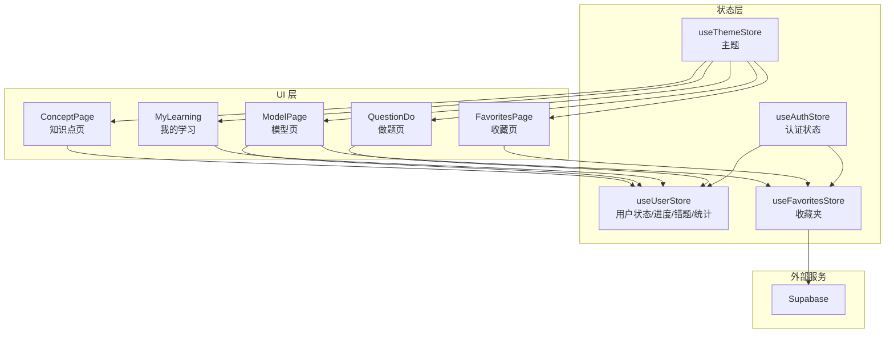
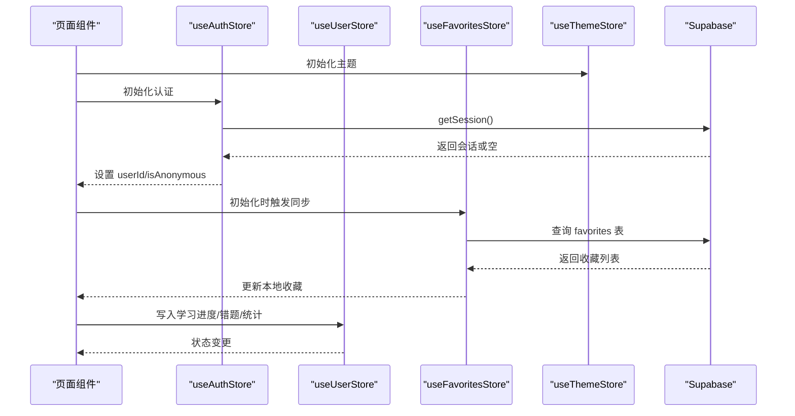
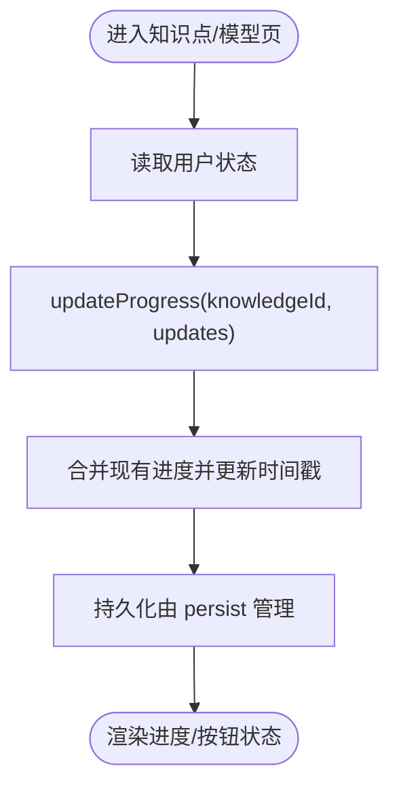
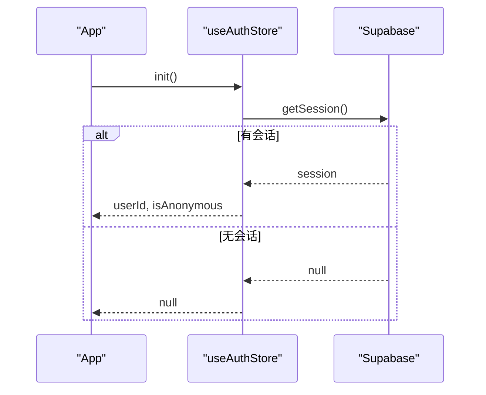
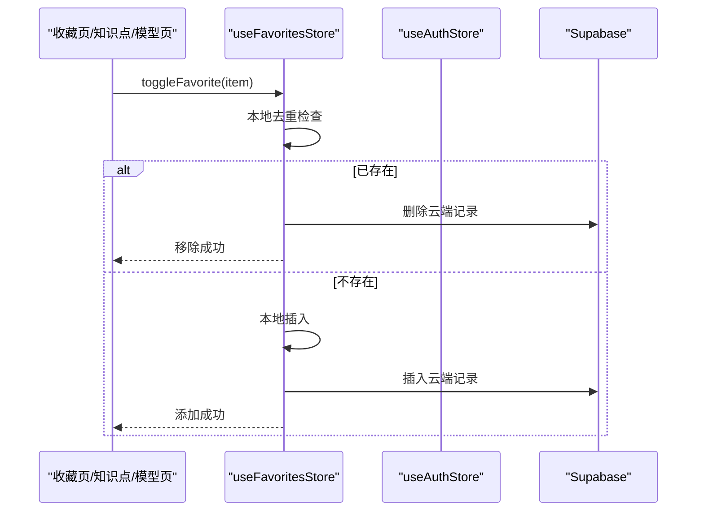
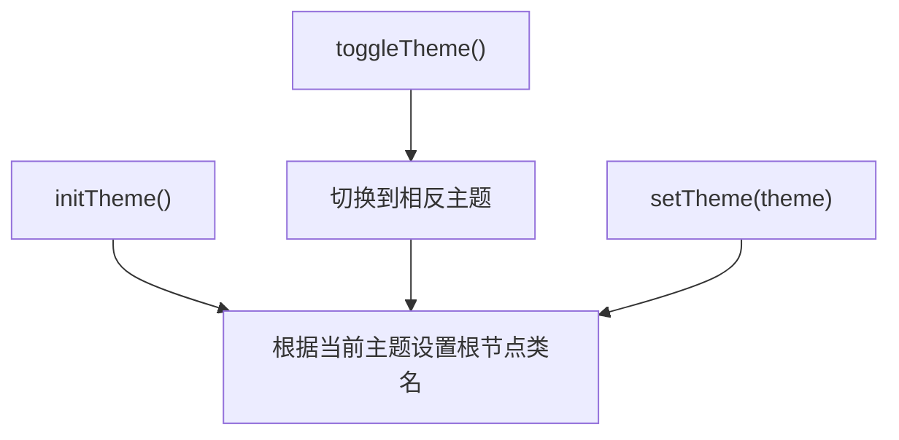
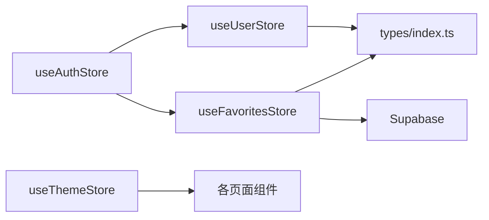

# 状态管理系统

<cite>
**本文引用的文件**
- [src/stores/index.ts](file://src/stores/index.ts)
- [src/stores/types.ts](file://src/stores/types.ts)
- [src/stores/userStore.ts](file://src/stores/userStore.ts)
- [src/stores/authStore.ts](file://src/stores/authStore.ts)
- [src/stores/favoritesStore.ts](file://src/stores/favoritesStore.ts)
- [src/stores/themeStore.ts](file://src/stores/themeStore.ts)
- [src/App.tsx](file://src/App.tsx)
- [src/tabs.tsx](file://src/tabs.tsx)
- [src/sections/ConceptPage.tsx](file://src/sections/ConceptPage.tsx)
- [src/sections/ModelPage.tsx](file://src/sections/ModelPage.tsx)
- [src/sections/FavoritesPage.tsx](file://src/sections/FavoritesPage.tsx)
- [src/sections/MyLearning.tsx](file://src/sections/MyLearning.tsx)
- [src/sections/QuestionDo.tsx](file://src/sections/QuestionDo.tsx)
- [src/lib/supabase.ts](file://src/lib/supabase.ts)
- [src/types/index.ts](file://src/types/index.ts)
</cite>

## 目录
1. [引言](#引言)
2. [项目结构](#项目结构)
3. [核心组件](#核心组件)
4. [架构总览](#架构总览)
5. [详细组件分析](#详细组件分析)
6. [依赖关系分析](#依赖关系分析)
7. [性能考量](#性能考量)
8. [故障排查指南](#故障排查指南)
9. [结论](#结论)
10. [附录](#附录)

## 引言
本文件系统性梳理星耀平台基于 Zustand 的轻量级状态管理架构，覆盖用户状态、认证状态、收藏夹、主题管理四大模块。文档重点阐述：
- 状态持久化策略与同步机制
- 状态间依赖关系、数据流向与更新策略
- 性能优化与最佳实践
- 错误处理与调试技巧
- 扩展指导与未来方向
- 如何通过状态管理提升用户体验与应用性能

## 项目结构
状态管理相关代码集中于 src/stores 目录，采用“按域划分”的模块化组织：
- userStore：用户学习进度、错题本、做题记录与学情统计
- authStore：认证初始化、匿名登录、登出
- favoritesStore：收藏夹本地/云端同步
- themeStore：主题切换与初始化
- types.ts：收藏夹条目类型定义
- index.ts：统一导出入口

图表来源
- [src/stores/userStore.ts:1-236](file://src/stores/userStore.ts#L1-L236)
- [src/stores/authStore.ts:1-63](file://src/stores/authStore.ts#L1-L63)
- [src/stores/favoritesStore.ts:1-172](file://src/stores/favoritesStore.ts#L1-L172)
- [src/stores/themeStore.ts:1-37](file://src/stores/themeStore.ts#L1-L37)
- [src/sections/ConceptPage.tsx:60-70](file://src/sections/ConceptPage.tsx#L60-L70)
- [src/sections/ModelPage.tsx:70-85](file://src/sections/ModelPage.tsx#L70-L85)
- [src/sections/FavoritesPage.tsx:40-55](file://src/sections/FavoritesPage.tsx#L40-L55)
- [src/sections/MyLearning.tsx:10-25](file://src/sections/MyLearning.tsx#L10-L25)
- [src/sections/QuestionDo.tsx:60-75](file://src/sections/QuestionDo.tsx#L60-L75)

章节来源
- [src/stores/index.ts:1-3](file://src/stores/index.ts#L1-L3)
- [src/stores/types.ts:1-12](file://src/stores/types.ts#L1-L12)

## 核心组件
- 用户状态管理（useUserStore）
  - 管理用户对象、加载状态、认证状态
  - 进度跟踪：知识点掌握状态与进度
  - 错题管理：按学科维护错题记录，支持标记已复习/已掌握
  - 学习统计：按学科聚合做题次数、正确/错误计数、模型维度统计
  - 做题记录：最近一次答题记录用于统计
- 认证状态管理（useAuthStore）
  - 初始化：读取 Supabase 会话，设置用户 ID 与匿名标志
  - 匿名登录：在配置可用时发起匿名登录
  - 登出：调用 Supabase 退出并清空本地状态
- 收藏夹管理（useFavoritesStore）
  - 本地优先：默认持久化至 localStorage
  - 云端同步：启用 Supabase 时，以用户为中心拉取/推送收藏
  - 自动同步：监听认证状态变化，登录/登出即触发同步
- 主题管理（useThemeStore）
  - 切换明暗主题，自动更新根节点 HTML 类名
  - 初始化：根据当前主题设置根节点类名

章节来源
- [src/stores/userStore.ts:13-35](file://src/stores/userStore.ts#L13-L35)
- [src/stores/authStore.ts:4-13](file://src/stores/authStore.ts#L4-L13)
- [src/stores/favoritesStore.ts:7-19](file://src/stores/favoritesStore.ts#L7-L19)
- [src/stores/themeStore.ts:6-11](file://src/stores/themeStore.ts#L6-L11)

## 架构总览
下图展示状态管理的整体交互：UI 组件通过 hooks 访问状态；认证与收藏夹依赖 Supabase；主题直接作用于 DOM。

图表来源
- [src/App.tsx:69-75](file://src/App.tsx#L69-L75)
- [src/stores/authStore.ts:20-37](file://src/stores/authStore.ts#L20-L37)
- [src/stores/favoritesStore.ts:37-63](file://src/stores/favoritesStore.ts#L37-L63)
- [src/stores/userStore.ts:46-236](file://src/stores/userStore.ts#L46-L236)

## 详细组件分析

### 用户状态管理（useUserStore）
- 数据结构
  - 用户信息、加载与认证标志
  - 进度映射：以知识点 ID 为键
  - 错题映射：按学科分组数组
  - 做题记录：最近记录数组
  - 学习统计：按学科聚合指标
- 关键动作
  - 用户设置与登出清理
  - 进度更新（幂等合并）
  - 错题增删改查与状态标记
  - 做题记录追加
  - 学习统计重算（基于做题记录与错题）
- 持久化
  - 使用 persist 中间件，仅持久化必要字段，减少存储体积
- 复杂度
  - 进度更新：O(1)
  - 错题去重插入：O(n)，n 为学科错题数
  - 统计重算：O(n_attempts + n_wrong)，适合高频但数据规模可控

图表来源
- [src/stores/userStore.ts:90-102](file://src/stores/userStore.ts#L90-L102)
- [src/stores/userStore.ts:224-235](file://src/stores/userStore.ts#L224-L235)

章节来源
- [src/stores/userStore.ts:46-236](file://src/stores/userStore.ts#L46-L236)
- [src/types/index.ts:139-188](file://src/types/index.ts#L139-L188)

### 认证状态管理（useAuthStore）
- 初始化流程
  - 若未配置 Supabase：静默降级，不尝试匿名登录
  - 已配置：读取会话，设置用户 ID 与匿名标志
- 匿名登录
  - 安全地发起匿名登录，捕获错误并记录日志
- 登出
  - 调用 Supabase 退出，清空本地状态
- 与收藏夹联动
  - 通过订阅认证变化，在登录/登出时触发收藏夹同步

图表来源
- [src/stores/authStore.ts:20-37](file://src/stores/authStore.ts#L20-L37)
- [src/App.tsx:70-75](file://src/App.tsx#L70-L75)

章节来源
- [src/stores/authStore.ts:15-62](file://src/stores/authStore.ts#L15-L62)

### 收藏夹管理（useFavoritesStore）
- 本地优先策略
  - 默认持久化至 localStorage，保证离线可用
- 云端同步策略
  - 启用 Supabase 时，按用户 ID 拉取/推送收藏
  - 插入前先本地更新，再异步同步至云端，避免闪烁
- 自动同步机制
  - 监听认证状态变化，登录/登出即触发同步
  - 初始化时静默降级，避免强制匿名登录导致的 422
- 数据结构
  - 条目包含类型、目标 ID、标题、添加时间与备注

图表来源
- [src/stores/favoritesStore.ts:116-126](file://src/stores/favoritesStore.ts#L116-L126)
- [src/stores/favoritesStore.ts:154-171](file://src/stores/favoritesStore.ts#L154-L171)

章节来源
- [src/stores/favoritesStore.ts:30-172](file://src/stores/favoritesStore.ts#L30-L172)
- [src/stores/types.ts:4-11](file://src/stores/types.ts#L4-L11)

### 主题管理（useThemeStore）
- 功能
  - 设置主题、切换主题、初始化主题
  - 切换时自动更新根节点 HTML 的 dark 类名
- 持久化
  - 使用 persist 中间件保存主题偏好

图表来源
- [src/stores/themeStore.ts:26-30](file://src/stores/themeStore.ts#L26-L30)
- [src/stores/themeStore.ts:17-25](file://src/stores/themeStore.ts#L17-L25)

章节来源
- [src/stores/themeStore.ts:13-37](file://src/stores/themeStore.ts#L13-L37)

### 组件使用示例
- 知识点页与模型页
  - 读取进度与收藏状态，支持收藏切换
- 我的学习页
  - 读取学科统计与错题列表
- 做题页
  - 写入错题与做题记录，并触发统计更新

章节来源
- [src/sections/ConceptPage.tsx:60-70](file://src/sections/ConceptPage.tsx#L60-L70)
- [src/sections/ModelPage.tsx:70-85](file://src/sections/ModelPage.tsx#L70-L85)
- [src/sections/MyLearning.tsx:10-25](file://src/sections/MyLearning.tsx#L10-L25)
- [src/sections/QuestionDo.tsx:60-75](file://src/sections/QuestionDo.tsx#L60-L75)

## 依赖关系分析
- 模块耦合
  - userStore 与 authStore：通过用户 ID 关联学习数据
  - favoritesStore 与 authStore：通过用户 ID 同步云端收藏
  - themeStore 与 UI：通过根节点类名影响全局样式
- 外部依赖
  - Supabase：认证与收藏夹云端能力
- 潜在环路
  - 通过订阅与状态读取避免直接循环依赖

图表来源
- [src/stores/authStore.ts:15-62](file://src/stores/authStore.ts#L15-L62)
- [src/stores/userStore.ts:46-236](file://src/stores/userStore.ts#L46-L236)
- [src/stores/favoritesStore.ts:30-172](file://src/stores/favoritesStore.ts#L30-L172)
- [src/stores/themeStore.ts:13-37](file://src/stores/themeStore.ts#L13-L37)
- [src/types/index.ts:1-209](file://src/types/index.ts#L1-L209)

## 性能考量
- 状态粒度与选择器
  - 在组件中使用选择器（如 state => state.getWrongQuestionsBySubject(subjectCode)）仅订阅所需字段，降低重渲染范围
- 持久化策略
  - userStore 与 favoritesStore 使用 persist，仅持久化必要字段，减少存储与序列化开销
- 并发与批处理
  - 错题与做题记录的更新为 O(n) 操作，建议在高频场景下合并写入或节流
- 渲染优化
  - 页面组件懒加载与 Suspense 提升首屏性能
- 主题切换
  - 通过根节点类名切换，避免全局样式重算

章节来源
- [src/sections/MyLearning.tsx:10-25](file://src/sections/MyLearning.tsx#L10-L25)
- [src/stores/userStore.ts:224-235](file://src/stores/userStore.ts#L224-L235)
- [src/stores/favoritesStore.ts:144-150](file://src/stores/favoritesStore.ts#L144-L150)

## 故障排查指南
- Supabase 未配置
  - 认证初始化静默降级，收藏夹走本地持久化
  - 日志：匿名登录失败时输出错误
- 同步异常
  - 收藏夹同步失败时保持本地状态不变，避免数据丢失
- 主题初始化
  - 服务端渲染环境下需确保在客户端执行初始化，避免 SSR 不一致
- 调试技巧
  - 使用 React DevTools 的 Zustand 插件观察状态变化
  - 在浏览器控制台打印 store 状态快照，定位更新路径

章节来源
- [src/stores/authStore.ts:20-37](file://src/stores/authStore.ts#L20-L37)
- [src/stores/favoritesStore.ts:37-63](file://src/stores/favoritesStore.ts#L37-L63)
- [src/stores/themeStore.ts:26-30](file://src/stores/themeStore.ts#L26-L30)

## 结论
星耀平台采用轻量、可组合的 Zustand 架构，围绕用户学习、认证、收藏与主题四个核心域构建状态管理。通过本地优先与云端同步相结合的持久化策略、细粒度的选择器订阅以及清晰的模块边界，系统在易用性与性能之间取得良好平衡。未来可在以下方面持续演进：
- 将统计计算进一步抽象为派生状态，减少重复计算
- 引入乐观更新与冲突解决策略，增强离线体验
- 增加状态快照与回滚能力，提升学习数据的安全性
- 扩展收藏夹类型枚举与标签体系，支持更丰富的检索与聚合

## 附录
- 最佳实践
  - 为每个 store 定义明确的动作边界与选择器
  - 对高频写入操作进行去重与幂等处理
  - 使用 persist 的 partialize 精准控制持久化字段
  - 在组件中最小化订阅范围，避免不必要的重渲染
- 错误处理
  - 对外部服务调用进行 try/catch 包裹，失败时保持本地状态稳定
  - 对不可恢复的异常进行降级处理（如认证初始化失败）
- 调试建议
  - 在开发环境开启严格模式，尽早暴露状态异常
  - 使用时间旅行调试（结合中间件）回溯状态变更历史