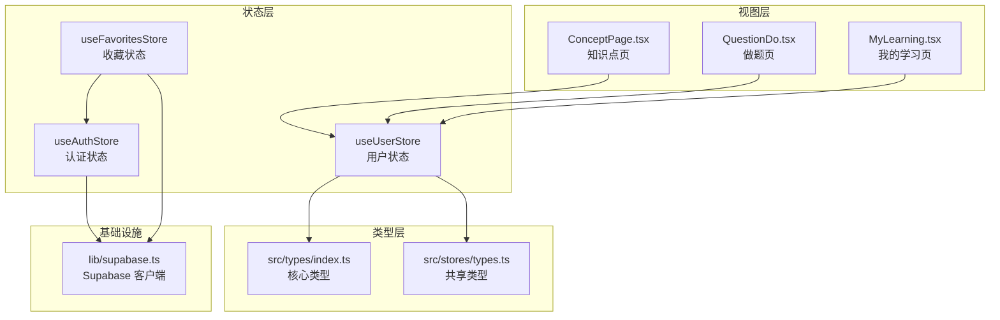
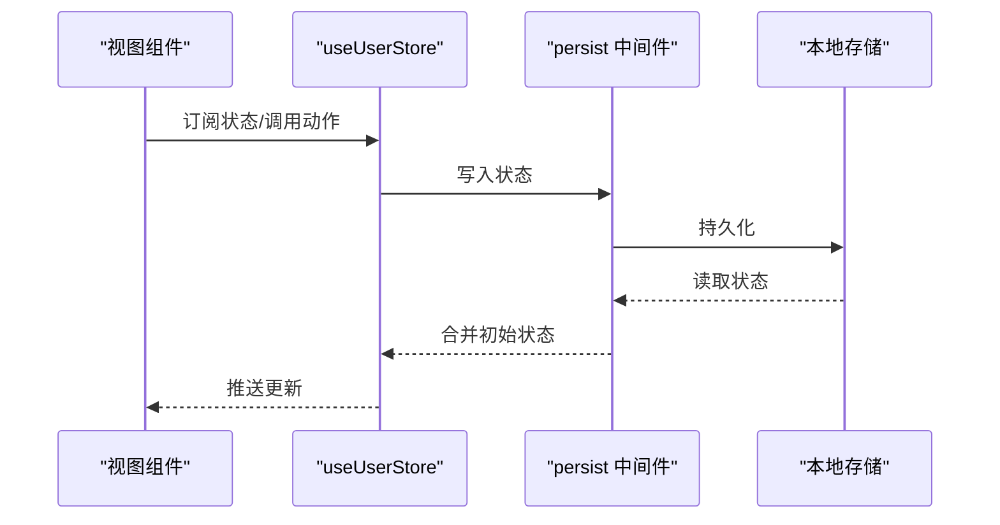
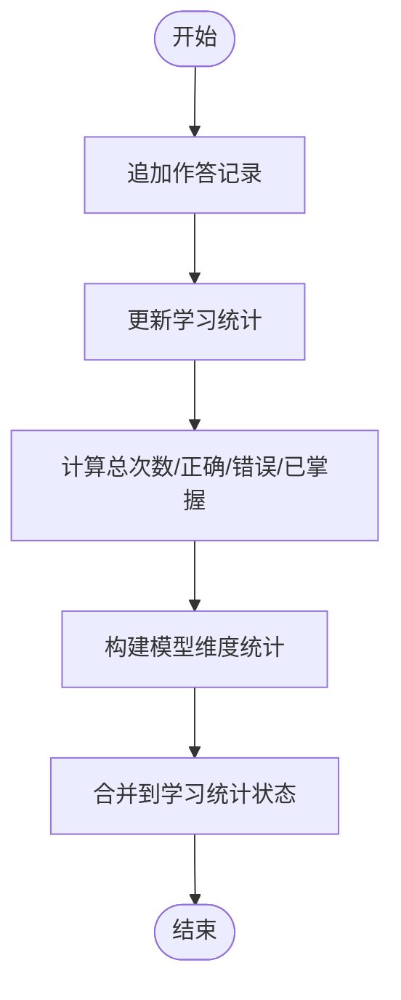
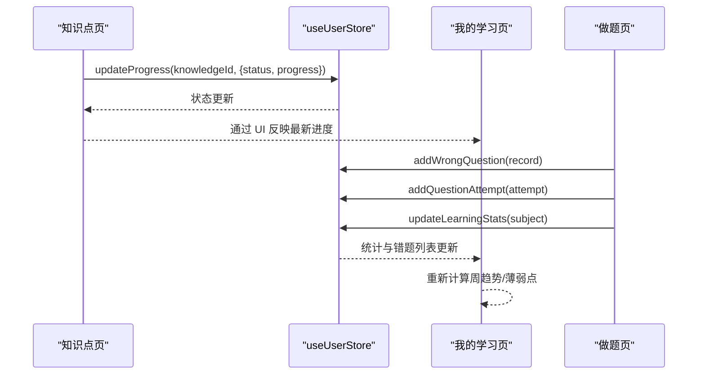
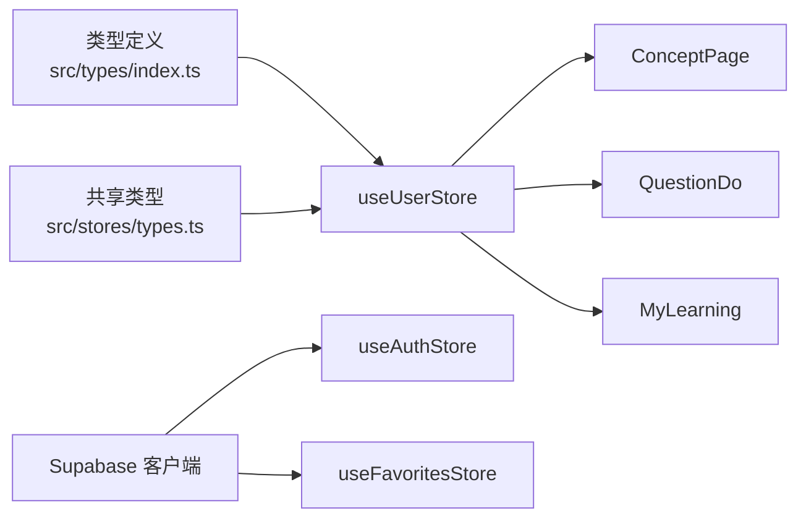

# 用户状态管理

<cite>
**本文档引用的文件**
- [src/stores/userStore.ts](file://src/stores/userStore.ts)
- [src/stores/index.ts](file://src/stores/index.ts)
- [src/stores/types.ts](file://src/stores/types.ts)
- [src/types/index.ts](file://src/types/index.ts)
- [src/sections/ConceptPage.tsx](file://src/sections/ConceptPage.tsx)
- [src/sections/QuestionDo.tsx](file://src/sections/QuestionDo.tsx)
- [src/sections/MyLearning.tsx](file://src/sections/MyLearning.tsx)
- [src/stores/authStore.ts](file://src/stores/authStore.ts)
- [src/stores/favoritesStore.ts](file://src/stores/favoritesStore.ts)
- [src/lib/supabase.ts](file://src/lib/supabase.ts)
- [src/App.tsx](file://src/App.tsx)
</cite>

## 目录
1. [简介](#简介)
2. [项目结构](#项目结构)
3. [核心组件](#核心组件)
4. [架构总览](#架构总览)
5. [详细组件分析](#详细组件分析)
6. [依赖关系分析](#依赖关系分析)
7. [性能考量](#性能考量)
8. [故障排查指南](#故障排查指南)
9. [结论](#结论)
10. [附录](#附录)

## 简介
本文件系统化梳理星耀平台的用户状态管理，围绕 useUserStore 的实现原理与使用方式进行深入解析。内容涵盖用户基本信息、学习进度、错题与作答记录、学科维度学习统计等状态的数据结构与管理方式；阐述初始化流程、数据更新机制与持久化策略；说明与认证、收藏等其他 store 的交互关系，以及状态变更对 UI 的影响；最后给出最佳实践、性能优化技巧、常见问题解决方案与扩展指导。

## 项目结构
用户状态管理位于 src/stores 目录，核心文件为 userStore.ts；类型定义分布在 src/types 与 src/stores/types 中；多个页面组件通过 useUserStore 订阅状态并驱动 UI 更新；认证与收藏等其他 store 与用户状态存在间接协作关系。

图表来源
- [src/stores/userStore.ts:1-236](file://src/stores/userStore.ts#L1-L236)
- [src/stores/authStore.ts:1-63](file://src/stores/authStore.ts#L1-L63)
- [src/stores/favoritesStore.ts:1-172](file://src/stores/favoritesStore.ts#L1-L172)
- [src/types/index.ts:1-209](file://src/types/index.ts#L1-L209)
- [src/stores/types.ts:1-12](file://src/stores/types.ts#L1-L12)
- [src/sections/ConceptPage.tsx:1-375](file://src/sections/ConceptPage.tsx#L1-L375)
- [src/sections/QuestionDo.tsx:1-348](file://src/sections/QuestionDo.tsx#L1-L348)
- [src/sections/MyLearning.tsx:1-303](file://src/sections/MyLearning.tsx#L1-L303)
- [src/lib/supabase.ts:1-18](file://src/lib/supabase.ts#L1-L18)

章节来源
- [src/stores/userStore.ts:1-236](file://src/stores/userStore.ts#L1-L236)
- [src/stores/index.ts:1-3](file://src/stores/index.ts#L1-L3)
- [src/types/index.ts:1-209](file://src/types/index.ts#L1-L209)
- [src/stores/types.ts:1-12](file://src/stores/types.ts#L1-L12)

## 核心组件
- useUserStore：基于 zustand/persist 的用户状态容器，负责用户信息、学习进度、错题记录、作答历史与学科维度学习统计的集中管理与持久化。
- 类型系统：在 src/types/index.ts 与 src/stores/types.ts 中定义 SubjectCode、UserProgress、WrongQuestionRecord、QuestionAttempt、LearningStats 等关键类型，确保状态结构清晰、约束明确。
- 视图组件：ConceptPage、QuestionDo、MyLearning 等页面通过 useUserStore 订阅状态并渲染 UI。

章节来源
- [src/stores/userStore.ts:13-35](file://src/stores/userStore.ts#L13-L35)
- [src/types/index.ts:6-188](file://src/types/index.ts#L6-L188)
- [src/stores/types.ts:1-12](file://src/stores/types.ts#L1-L12)
- [src/sections/ConceptPage.tsx:62-103](file://src/sections/ConceptPage.tsx#L62-L103)
- [src/sections/QuestionDo.tsx:66-125](file://src/sections/QuestionDo.tsx#L66-L125)
- [src/sections/MyLearning.tsx:17-79](file://src/sections/MyLearning.tsx#L17-L79)

## 架构总览
useUserStore 采用 zustand 的 create + persist 中间件，将用户状态持久化到浏览器存储；同时通过 get/set API 提供细粒度的状态更新能力。视图层通过 hooks 订阅状态，实现响应式 UI 更新。认证与收藏等其他 store 通过 Supabase 客户端与服务端协同，形成完整的用户数据生态。

图表来源
- [src/stores/userStore.ts:46-236](file://src/stores/userStore.ts#L46-L236)

章节来源
- [src/stores/userStore.ts:46-236](file://src/stores/userStore.ts#L46-L236)

## 详细组件分析

### useUserStore 数据结构与职责
- 用户信息 user：包含 id、email、username、avatar_url、created_at 等字段，用于标识当前登录用户。
- 加载与认证标志 isLoading、isAuthenticated：用于控制 UI 加载态与登录态显示。
- 学习进度 progress：以知识 ID 为键的映射，记录每个知识点的学习状态与进度。
- 错题记录 wrongQuestions：按学科划分的错题数组，支持新增、删除、更新、标记“已复习”、“已掌握”等操作。
- 作答历史 questionAttempts：记录每次作答的 subject、questionId、isCorrect、answeredAt、timeSpent 等。
- 学科维度学习统计 learningStats：按学科聚合的统计指标，包括总作答次数、正确/错误计数、已掌握计数、最近一次作答时间、模型维度统计等。
- 动作接口：setUser、setLoading、logout、updateProgress、getProgress、addWrongQuestion、removeWrongQuestion、updateWrongQuestion、markAsReviewed、markAsMastered、addQuestionAttempt、updateLearningStats、getWrongQuestionsBySubject、getLearningStats。

章节来源
- [src/stores/userStore.ts:5-35](file://src/stores/userStore.ts#L5-L35)
- [src/stores/userStore.ts:46-236](file://src/stores/userStore.ts#L46-L236)
- [src/types/index.ts:138-188](file://src/types/index.ts#L138-L188)

### 初始化流程
- 应用启动时，App 在挂载阶段调用 initTheme 并在 Supabase 配置可用时初始化认证状态。
- 认证初始化成功后，useUserStore 通过 persist 中间件从本地存储恢复用户状态（若存在），随后视图层根据状态渲染相应 UI。
- 若用户执行 logout，useUserStore 清空用户信息与相关状态，并重置学习统计为初始值。

章节来源
- [src/App.tsx:69-75](file://src/App.tsx#L69-L75)
- [src/stores/userStore.ts:74-88](file://src/stores/userStore.ts#L74-L88)

### 数据更新机制
- 进度更新：updateProgress 支持部分更新，自动维护 lastAccessed 时间戳，保证状态合并的幂等性。
- 错题管理：addWrongQuestion 防重复插入；updateWrongQuestion 支持更新任意字段并刷新 updatedAt；markAsReviewed/markAsMastered 更新状态与计数。
- 作答与统计：addQuestionAttempt 追加新作答；updateLearningStats 基于 questionAttempts 与 wrongQuestions 计算学科统计，包括模型维度统计与最近作答时间。

图表来源
- [src/stores/userStore.ts:179-214](file://src/stores/userStore.ts#L179-L214)

章节来源
- [src/stores/userStore.ts:90-102](file://src/stores/userStore.ts#L90-L102)
- [src/stores/userStore.ts:106-171](file://src/stores/userStore.ts#L106-L171)
- [src/stores/userStore.ts:179-214](file://src/stores/userStore.ts#L179-L214)

### 持久化策略
- 使用 persist 中间件，将 user、isAuthenticated、progress、wrongQuestions、questionAttempts、learningStats 等关键字段持久化到本地存储。
- 通过 partialize 精准选择需要持久化的字段，减少存储开销与序列化成本。
- 初始状态来自本地存储恢复，若本地无数据则使用内存默认值。

章节来源
- [src/stores/userStore.ts:224-235](file://src/stores/userStore.ts#L224-L235)

### 与认证、收藏等 store 的交互
- 认证 store：在 Supabase 配置可用时，初始化用户会话；logout 时清空用户状态。
- 收藏 store：与认证状态联动，监听用户登录/登出事件，自动同步云端收藏数据；虽然与用户学习状态无直接耦合，但两者均依赖 Supabase 客户端与认证上下文。

章节来源
- [src/stores/authStore.ts:20-61](file://src/stores/authStore.ts#L20-L61)
- [src/stores/favoritesStore.ts:21-28](file://src/stores/favoritesStore.ts#L21-L28)
- [src/stores/favoritesStore.ts:154-171](file://src/stores/favoritesStore.ts#L154-L171)
- [src/lib/supabase.ts:1-18](file://src/lib/supabase.ts#L1-L18)

### 状态变更对 UI 的影响
- 知识点页：订阅 progress，根据当前知识点状态渲染“理解度自评”按钮样式与等级标签。
- 做题页：提交答案后写入错题与作答记录，并更新学习统计，驱动“我的学习”页的实时展示。
- 我的学习页：订阅学习统计与错题列表，计算周趋势、薄弱与强项模型、待复习数量等，动态更新图表与卡片。

图表来源
- [src/sections/ConceptPage.tsx:62-93](file://src/sections/ConceptPage.tsx#L62-L93)
- [src/sections/QuestionDo.tsx:66-125](file://src/sections/QuestionDo.tsx#L66-L125)
- [src/sections/MyLearning.tsx:17-79](file://src/sections/MyLearning.tsx#L17-L79)

章节来源
- [src/sections/ConceptPage.tsx:62-93](file://src/sections/ConceptPage.tsx#L62-L93)
- [src/sections/QuestionDo.tsx:66-125](file://src/sections/QuestionDo.tsx#L66-L125)
- [src/sections/MyLearning.tsx:17-79](file://src/sections/MyLearning.tsx#L17-L79)

## 依赖关系分析
- 类型依赖：useUserStore 的状态结构与动作签名严格依赖 src/types/index.ts 与 src/stores/types.ts 中的类型定义。
- 视图依赖：ConceptPage、QuestionDo、MyLearning 通过 hooks 订阅 useUserStore，形成单向数据流。
- 基础设施依赖：Supabase 客户端用于认证与收藏同步，useUserStore 本身通过 persist 实现本地持久化，二者互补。

图表来源
- [src/types/index.ts:1-209](file://src/types/index.ts#L1-L209)
- [src/stores/types.ts:1-12](file://src/stores/types.ts#L1-L12)
- [src/stores/userStore.ts:1-35](file://src/stores/userStore.ts#L1-L35)
- [src/sections/ConceptPage.tsx:6-6](file://src/sections/ConceptPage.tsx#L6-L6)
- [src/sections/QuestionDo.tsx:8-8](file://src/sections/QuestionDo.tsx#L8-L8)
- [src/sections/MyLearning.tsx:8-8](file://src/sections/MyLearning.tsx#L8-L8)
- [src/lib/supabase.ts:1-18](file://src/lib/supabase.ts#L1-L18)
- [src/stores/authStore.ts:1-1](file://src/stores/authStore.ts#L1-L1)
- [src/stores/favoritesStore.ts:1-1](file://src/stores/favoritesStore.ts#L1-L1)

章节来源
- [src/types/index.ts:1-209](file://src/types/index.ts#L1-L209)
- [src/stores/types.ts:1-12](file://src/stores/types.ts#L1-L12)
- [src/stores/userStore.ts:1-35](file://src/stores/userStore.ts#L1-L35)
- [src/sections/ConceptPage.tsx:6-6](file://src/sections/ConceptPage.tsx#L6-L6)
- [src/sections/QuestionDo.tsx:8-8](file://src/sections/QuestionDo.tsx#L8-L8)
- [src/sections/MyLearning.tsx:8-8](file://src/sections/MyLearning.tsx#L8-L8)
- [src/lib/supabase.ts:1-18](file://src/lib/supabase.ts#L1-L18)
- [src/stores/authStore.ts:1-1](file://src/stores/authStore.ts#L1-L1)
- [src/stores/favoritesStore.ts:1-1](file://src/stores/favoritesStore.ts#L1-L1)

## 性能考量
- 状态粒度：将 progress、wrongQuestions、learningStats 按知识 ID 或学科维度拆分，避免单一大对象导致的全量重渲染。
- 订阅最小化：视图组件仅订阅所需字段（如 MyLearning 仅订阅 stats 与列表），降低不必要的 re-render。
- 计算缓存：MyLearning 中使用 useMemo 缓存周趋势与薄弱/强项模型，减少重复计算。
- 持久化瘦身：persist 的 partialize 仅持久化必要字段，缩短序列化/反序列化耗时。
- 批量更新：在高频场景下（如批量导入错题或统计），尽量合并多次 set 调用，减少中间态渲染。

## 故障排查指南
- 状态未持久化：检查 persist 配置与浏览器存储权限；确认 partialize 字段覆盖范围是否正确。
- 登录后状态异常：确认 App 初始化时已调用认证初始化；logout 后状态应被清空并重置。
- 统计不准确：检查 updateLearningStats 的触发时机与 questionAttempts/wrongQuestions 的完整性；确保 subject 匹配一致。
- UI 不更新：确认组件使用了正确的订阅方式（如按字段订阅），避免订阅整个状态对象导致的过度渲染。

章节来源
- [src/stores/userStore.ts:224-235](file://src/stores/userStore.ts#L224-L235)
- [src/App.tsx:69-75](file://src/App.tsx#L69-L75)
- [src/stores/userStore.ts:74-88](file://src/stores/userStore.ts#L74-L88)
- [src/stores/userStore.ts:179-214](file://src/stores/userStore.ts#L179-L214)

## 结论
useUserStore 以清晰的数据结构与细粒度的动作接口，实现了用户学习状态的高效管理与持久化。配合类型系统与视图层的订阅模式，形成了稳定、可维护且易于扩展的状态管理体系。通过合理的性能优化与完善的故障排查策略，可进一步提升用户体验与系统可靠性。

## 附录

### 最佳实践
- 明确状态边界：将用户信息、学习进度、错题与统计分层管理，避免混杂。
- 严格类型约束：在类型层面约束状态字段，减少运行时错误。
- 精准订阅：组件仅订阅所需字段，避免全量状态订阅引发的性能问题。
- 有序持久化：通过 partialize 控制持久化字段，兼顾数据完整性与性能。
- 事件驱动更新：在关键业务流程（如答题）后及时更新统计，保证 UI 实时性。

### 扩展指导
- 新增学科：在 SubjectCode 与相关类型中扩展学科枚举，初始化 learningStats 与 wrongQuestions 对应键值。
- 新增状态域：在 UserState 中添加字段与动作，确保类型定义同步更新，并在 persist 的 partialize 中纳入持久化。
- 统计维度：在 updateLearningStats 中增加新的聚合指标，如平均用时、知识点掌握曲线等。
- 服务端同步：若需要跨设备同步，可引入 Supabase 同步策略，与本地 persist 协同工作。