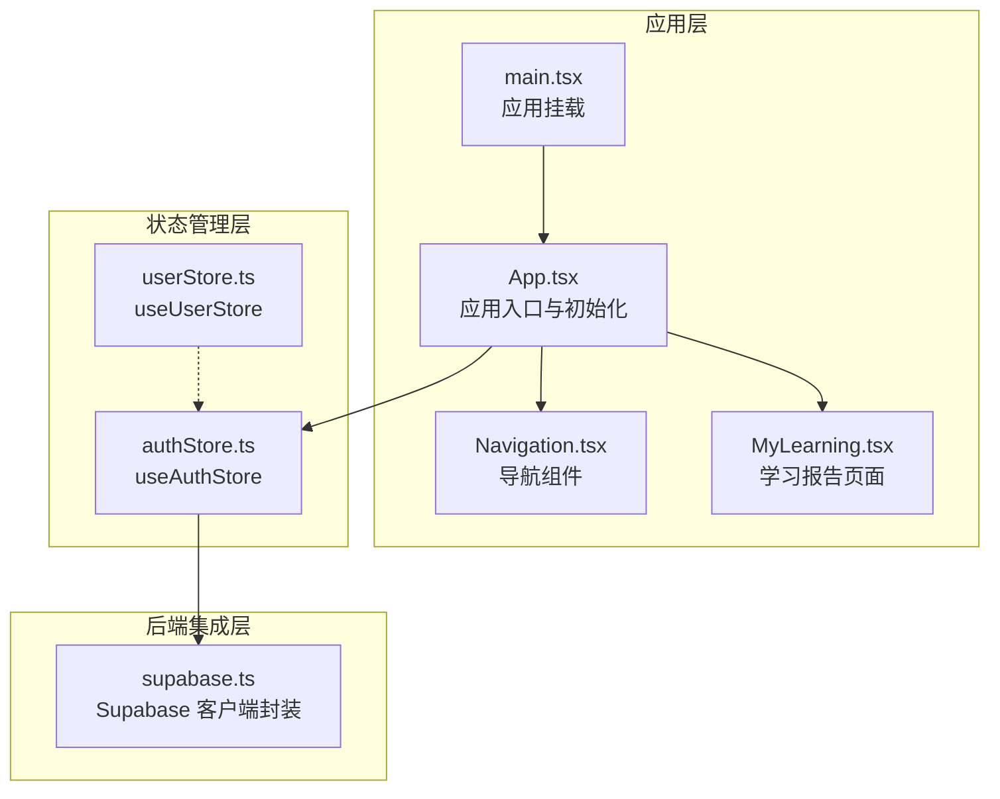
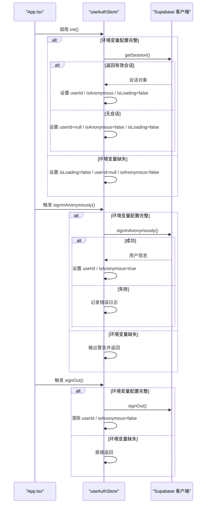
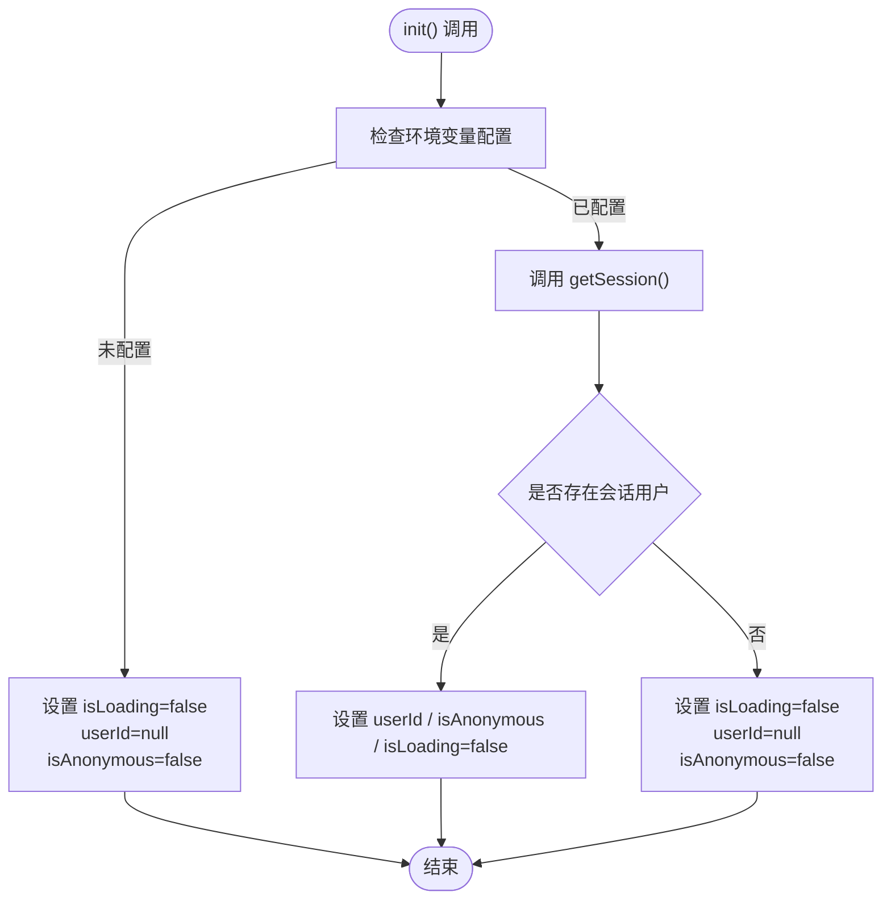
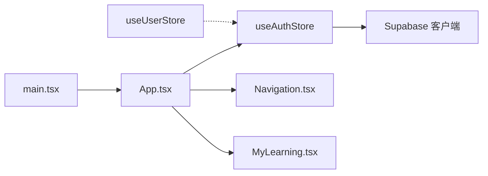

# 认证状态管理

<cite>
**本文档引用的文件**
- [src/stores/authStore.ts](file://src/stores/authStore.ts)
- [src/lib/supabase.ts](file://src/lib/supabase.ts)
- [src/stores/userStore.ts](file://src/stores/userStore.ts)
- [src/App.tsx](file://src/App.tsx)
- [src/main.tsx](file://src/main.tsx)
- [src/components/layout/Navigation.tsx](file://src/components/layout/Navigation.tsx)
- [src/sections/MyLearning.tsx](file://src/sections/MyLearning.tsx)
- [src/stores/index.ts](file://src/stores/index.ts)
</cite>

## 目录
1. [简介](#简介)
2. [项目结构](#项目结构)
3. [核心组件](#核心组件)
4. [架构总览](#架构总览)
5. [详细组件分析](#详细组件分析)
6. [依赖关系分析](#依赖关系分析)
7. [性能考量](#性能考量)
8. [故障排查指南](#故障排查指南)
9. [结论](#结论)
10. [附录](#附录)

## 简介
本文件针对星耀平台的认证状态管理系统进行深入文档化，重点围绕 useAuthStore 的实现机制，涵盖用户登录状态、会话管理、权限控制、与 Supabase 后端的集成方式（自动登录检测、token 管理、用户信息同步）、认证状态生命周期管理、错误处理机制与安全考虑，并说明认证状态与其他 store 的协作关系及对应用行为的影响。同时提供最佳实践与安全建议，帮助开发者在保证用户体验的同时确保系统安全与稳定。

## 项目结构
认证状态管理涉及的核心文件与职责如下：
- 认证状态 store：useAuthStore，负责用户登录状态、会话初始化、匿名登录与登出
- Supabase 客户端封装：supabase.ts，负责客户端创建、自动刷新与持久化配置
- 用户信息与学习数据 store：useUserStore，负责用户数据、学习进度与统计
- 应用入口与初始化：App.tsx、main.tsx，负责应用启动时的认证初始化
- 导航与页面：Navigation.tsx、MyLearning.tsx，展示认证状态对界面行为的影响

**图表来源**
- [src/App.tsx:69-75](file://src/App.tsx#L69-L75)
- [src/main.tsx:1-19](file://src/main.tsx#L1-L19)
- [src/stores/authStore.ts:1-63](file://src/stores/authStore.ts#L1-L63)
- [src/lib/supabase.ts:1-18](file://src/lib/supabase.ts#L1-L18)
- [src/stores/userStore.ts:1-236](file://src/stores/userStore.ts#L1-L236)
- [src/components/layout/Navigation.tsx:1-719](file://src/components/layout/Navigation.tsx#L1-L719)
- [src/sections/MyLearning.tsx:1-303](file://src/sections/MyLearning.tsx#L1-L303)

**章节来源**
- [src/App.tsx:69-75](file://src/App.tsx#L69-L75)
- [src/main.tsx:1-19](file://src/main.tsx#L1-L19)
- [src/stores/authStore.ts:1-63](file://src/stores/authStore.ts#L1-L63)
- [src/lib/supabase.ts:1-18](file://src/lib/supabase.ts#L1-L18)
- [src/stores/userStore.ts:1-236](file://src/stores/userStore.ts#L1-L236)
- [src/components/layout/Navigation.tsx:1-719](file://src/components/layout/Navigation.tsx#L1-L719)
- [src/sections/MyLearning.tsx:1-303](file://src/sections/MyLearning.tsx#L1-L303)

## 核心组件
本节聚焦 useAuthStore 的关键能力与实现要点：
- 状态字段
  - userId：当前登录用户的标识，未登录或初始化中为 null
  - isLoading：初始化阶段的加载状态
  - isAnonymous：是否为匿名登录用户
- 行为方法
  - init：初始化认证状态，从 Supabase 获取当前会话，设置用户 ID 与匿名标记
  - signInAnonymously：执行匿名登录，成功后设置 userId 与 isAnonymous
  - signOut：调用 Supabase 登出并清除本地认证状态

useAuthStore 通过 zustand 管理状态，结合 Supabase 客户端提供的会话管理能力，实现自动登录检测与会话持久化。

**章节来源**
- [src/stores/authStore.ts:4-13](file://src/stores/authStore.ts#L4-L13)
- [src/stores/authStore.ts:15-62](file://src/stores/authStore.ts#L15-L62)

## 架构总览
useAuthStore 与 Supabase 的交互遵循以下流程：
- 初始化阶段：若环境变量配置完整，则调用 Supabase getSession 获取会话；若存在用户会话则设置 userId 与 isAnonymous；否则置空状态
- 匿名登录：若 Supabase 配置可用，调用 signInAnonymously 并更新状态
- 登出：调用 Supabase.signOut 并清除本地状态

**图表来源**
- [src/App.tsx:70-74](file://src/App.tsx#L70-L74)
- [src/stores/authStore.ts:20-37](file://src/stores/authStore.ts#L20-L37)
- [src/stores/authStore.ts:39-55](file://src/stores/authStore.ts#L39-L55)
- [src/stores/authStore.ts:57-61](file://src/stores/authStore.ts#L57-L61)
- [src/lib/supabase.ts:1-18](file://src/lib/supabase.ts#L1-L18)

**章节来源**
- [src/App.tsx:70-74](file://src/App.tsx#L70-L74)
- [src/stores/authStore.ts:20-61](file://src/stores/authStore.ts#L20-L61)
- [src/lib/supabase.ts:1-18](file://src/lib/supabase.ts#L1-L18)

## 详细组件分析

### useAuthStore 实现机制
- 初始化流程
  - 在应用启动时由 App.tsx 调用 useAuthStore.getState().init()
  - 若环境变量 VITE_SUPABASE_URL 与 VITE_SUPABASE_ANON_KEY 均存在，则通过 Supabase 客户端获取会话；否则直接结束初始化
  - 若存在会话用户，设置 userId 与 isAnonymous；否则置空状态
- 匿名登录
  - 调用 Supabase 的匿名登录接口，成功后更新本地状态；失败时记录错误日志
- 登出
  - 调用 Supabase 的 signOut 接口，随后清除本地状态

**图表来源**
- [src/stores/authStore.ts:20-37](file://src/stores/authStore.ts#L20-L37)
- [src/App.tsx:70-74](file://src/App.tsx#L70-L74)

**章节来源**
- [src/stores/authStore.ts:20-37](file://src/stores/authStore.ts#L20-L37)
- [src/App.tsx:70-74](file://src/App.tsx#L70-L74)

### Supabase 客户端集成
- 客户端创建
  - 仅当 VITE_SUPABASE_URL 与 VITE_SUPABASE_ANON_KEY 均存在时才创建 Supabase 客户端，避免空 URL 导致连接失败
- 自动刷新与持久化
  - 启用自动刷新 token、持久化会话、禁用 URL 中的会话检测，减少手动干预与潜在安全风险
- 配置开关
  - isSupabaseConfigured 用于运行时判断 Supabase 是否可用，作为 store 内部分支逻辑的基础

**章节来源**
- [src/lib/supabase.ts:1-18](file://src/lib/supabase.ts#L1-L18)

### 与 useUserStore 的协作关系
- 认证状态驱动用户数据加载
  - 当 useAuthStore 初始化成功且存在用户时，useUserStore 可根据用户 ID 加载或同步用户信息与学习数据
- 登出清理
  - useAuthStore.signOut 会清除本地认证状态，useUserStore.logout 将用户数据、进度、错题与统计清空，确保前后端状态一致
- 数据持久化
  - useUserStore 使用 persist 中间件，将用户数据与学习统计持久化至本地存储，提升体验与容错性

**章节来源**
- [src/stores/userStore.ts:74-88](file://src/stores/userStore.ts#L74-L88)
- [src/stores/userStore.ts:224-236](file://src/stores/userStore.ts#L224-L236)

### 认证状态对应用行为的影响
- 导航可见性
  - Navigation.tsx 中的导航与模块链接可根据认证状态进行显隐控制（例如“我的学习”、“收藏夹”等）
- 页面访问控制
  - MyLearning.tsx 展示学习数据，通常仅在用户登录后可访问或展示完整数据
- 初始化时机
  - App.tsx 在应用启动时调用 useAuthStore.init()，确保在路由渲染前完成认证状态探测

**章节来源**
- [src/components/layout/Navigation.tsx:1-719](file://src/components/layout/Navigation.tsx#L1-L719)
- [src/sections/MyLearning.tsx:1-303](file://src/sections/MyLearning.tsx#L1-L303)
- [src/App.tsx:69-75](file://src/App.tsx#L69-L75)

## 依赖关系分析
- useAuthStore 依赖 Supabase 客户端与 isSupabaseConfigured
- App.tsx 在启动时调用 useAuthStore.init()，确保认证状态在应用早期可用
- useUserStore 与 useAuthStore 解耦，通过用户 ID 关联用户数据，支持独立扩展
- 导出入口 stores/index.ts 仅导出主题与用户 store，认证 store 通过 App.tsx 直接初始化

**图表来源**
- [src/App.tsx:69-75](file://src/App.tsx#L69-L75)
- [src/stores/authStore.ts:1-63](file://src/stores/authStore.ts#L1-L63)
- [src/lib/supabase.ts:1-18](file://src/lib/supabase.ts#L1-L18)
- [src/stores/userStore.ts:1-236](file://src/stores/userStore.ts#L1-L236)
- [src/main.tsx:1-19](file://src/main.tsx#L1-L19)

**章节来源**
- [src/App.tsx:69-75](file://src/App.tsx#L69-L75)
- [src/stores/authStore.ts:1-63](file://src/stores/authStore.ts#L1-L63)
- [src/lib/supabase.ts:1-18](file://src/lib/supabase.ts#L1-L18)
- [src/stores/userStore.ts:1-236](file://src/stores/userStore.ts#L1-L236)
- [src/main.tsx:1-19](file://src/main.tsx#L1-L19)

## 性能考量
- 初始化开销最小化
  - 仅在环境变量配置完整时创建 Supabase 客户端，避免无效连接与初始化成本
- 会话获取优化
  - 通过 getSession 一次性获取会话，避免重复请求
- 状态更新粒度
  - useAuthStore 仅维护少量关键字段，降低状态更新与渲染成本
- 数据持久化
  - useUserStore 使用持久化中间件，减少重复加载与网络请求

[本节为通用指导，无需列出具体文件来源]

## 故障排查指南
- 环境变量缺失
  - 现象：初始化后 userId 为空且 isAnonymous 为 false
  - 处理：确认 VITE_SUPABASE_URL 与 VITE_SUPABASE_ANON_KEY 已正确配置
- 匿名登录失败
  - 现象：调用 signInAnonymously 后未更新状态
  - 处理：检查 Supabase 后端服务状态与网络连接，查看控制台错误日志
- 登出后状态未清除
  - 现象：登出后仍显示用户信息
  - 处理：确认 useAuthStore.signOut 已被调用，且 useUserStore.logout 同步执行
- 会话未持久化
  - 现象：刷新页面后认证状态丢失
  - 处理：检查 Supabase 客户端的持久化配置与浏览器存储权限

**章节来源**
- [src/stores/authStore.ts:20-61](file://src/stores/authStore.ts#L20-L61)
- [src/lib/supabase.ts:7-15](file://src/lib/supabase.ts#L7-L15)
- [src/stores/userStore.ts:74-88](file://src/stores/userStore.ts#L74-L88)

## 结论
useAuthStore 通过简洁的状态模型与与 Supabase 的紧密集成，实现了可靠的认证状态管理：自动登录检测、匿名登录与登出流程清晰、错误处理稳健。配合 useUserStore 的数据持久化与 Navigation/MyLearning 等页面的协作，认证状态成为驱动应用行为与用户体验的核心枢纽。建议在生产环境中严格管理环境变量、完善错误监控，并持续优化初始化与状态更新路径。

[本节为总结性内容，无需列出具体文件来源]

## 附录

### 最佳实践与安全建议
- 环境变量管理
  - 严格区分开发与生产环境变量，避免在前端暴露敏感密钥
- 会话安全
  - 启用自动刷新与持久化时，确保 HTTPS 传输与安全 Cookie 配置
- 错误处理
  - 对匿名登录与登出失败进行统一错误上报与用户提示
- 状态一致性
  - 登出时同步清除 useUserStore 数据，避免前后端状态不一致
- 初始化策略
  - 在应用启动阶段尽早初始化认证状态，确保路由与 UI 行为的一致性

[本节为通用指导，无需列出具体文件来源]