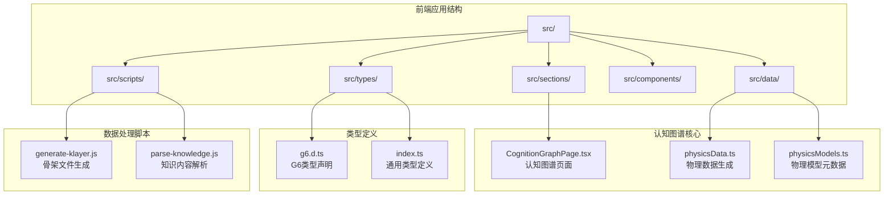
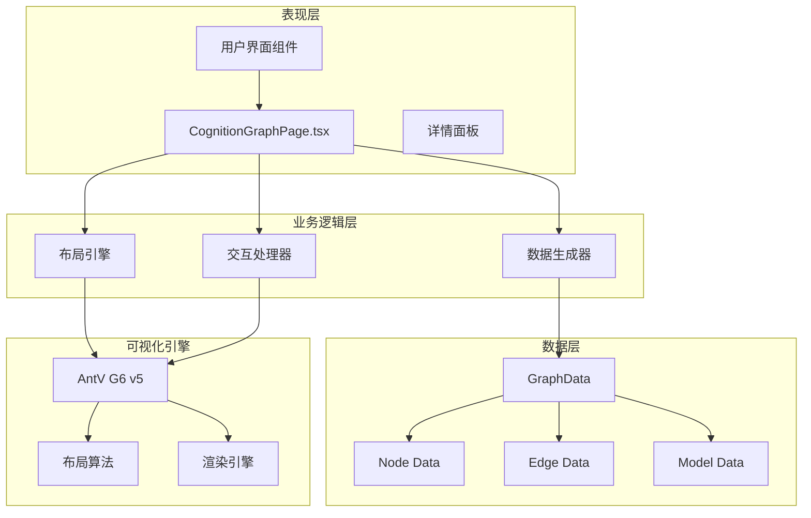
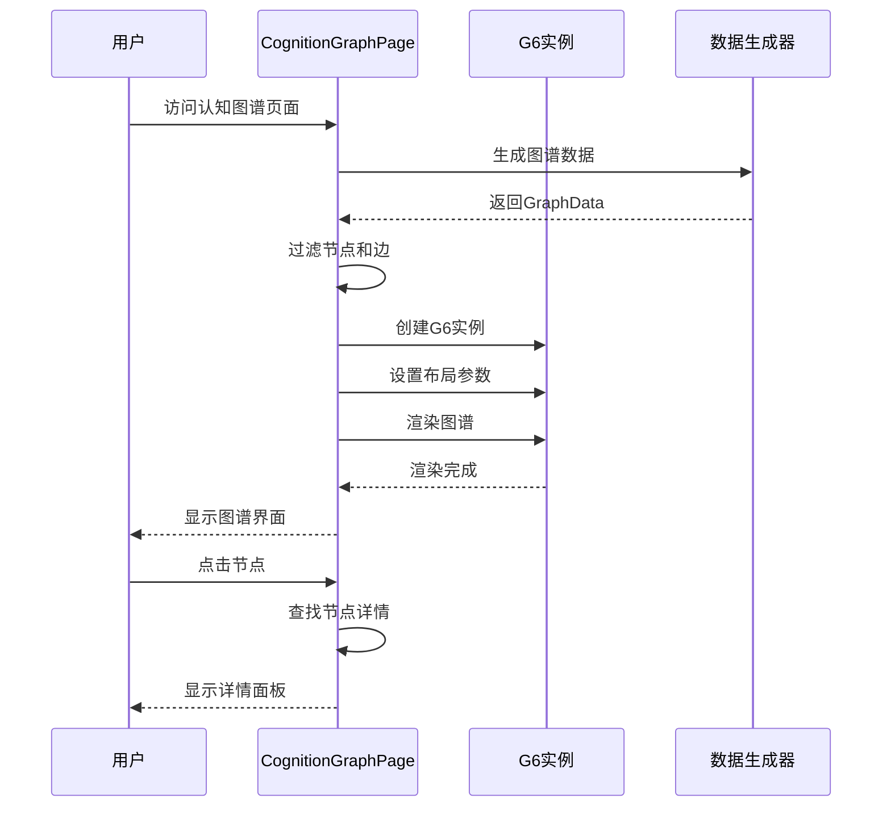
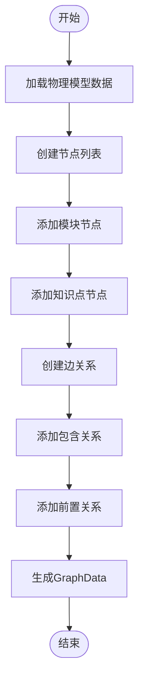
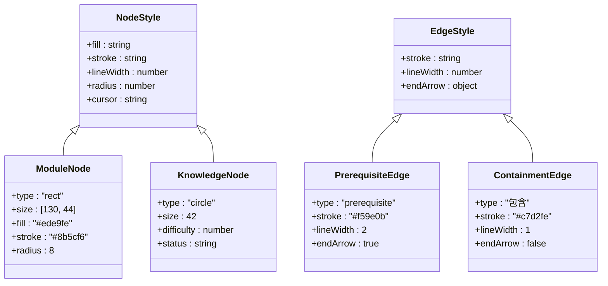
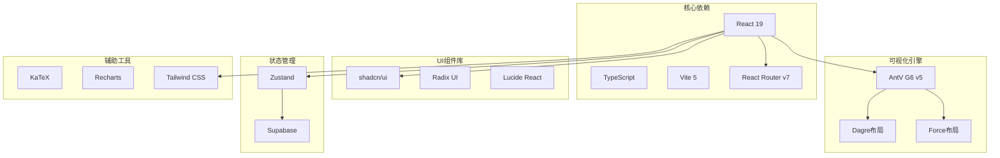
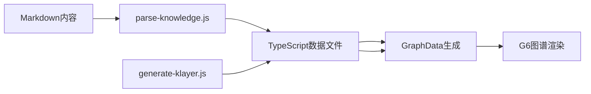

# 认知图谱系统

<cite>
**本文档引用的文件**
- [CognitionGraphPage.tsx](file://src/sections/CognitionGraphPage.tsx)
- [physicsData.ts](file://src/data/physics/physicsData.ts)
- [physicsModels.ts](file://src/data/physics/physicsModels.ts)
- [g6.d.ts](file://src/types/g6.d.ts)
- [index.ts](file://src/types/index.ts)
- [package.json](file://package.json)
- [ARCHITECTURE.md](file://ARCHITECTURE.md)
- [generate-klayer.js](file://scripts/generate-klayer.js)
- [parse-knowledge.js](file://scripts/parse-knowledge.js)
</cite>

## 目录
1. [引言](#引言)
2. [项目结构](#项目结构)
3. [核心组件](#核心组件)
4. [架构概览](#架构概览)
5. [详细组件分析](#详细组件分析)
6. [依赖分析](#依赖分析)
7. [性能考虑](#性能考虑)
8. [故障排除指南](#故障排除指南)
9. [结论](#结论)
10. [附录](#附录)

## 引言

星耀平台的认知图谱系统是一个基于AntV G6 v5的可视化知识网络系统，旨在帮助学生建立知识间的联系和理解。该系统通过图形化的界面展示学科知识的结构关系，支持多种交互功能，包括节点点击查看详情、缩放和平移、模块筛选等。

系统的核心设计理念是通过可视化的知识网络帮助学习者理解知识间的层次关系和前置依赖，从而建立完整的知识体系。不同的学科（物理、化学、生物、语文、英语、数学）都采用了相似的架构模式，确保了系统的可扩展性和一致性。

## 项目结构

星耀平台采用模块化的项目结构，认知图谱系统主要分布在以下几个关键目录中：

**图表来源**
- [CognitionGraphPage.tsx:1-252](file://src/sections/CognitionGraphPage.tsx#L1-L252)
- [physicsData.ts:1-138](file://src/data/physics/physicsData.ts#L1-L138)
- [physicsModels.ts:1-66](file://src/data/physics/physicsModels.ts#L1-L66)

**章节来源**
- [ARCHITECTURE.md:1-369](file://ARCHITECTURE.md#L1-L369)

## 核心组件

### 认知图谱页面组件

CognitionGraphPage.tsx是认知图谱系统的核心组件，负责渲染和管理整个图谱界面。该组件实现了以下关键功能：

- **动态图谱渲染**：根据学科数据动态生成G6图谱实例
- **交互式导航**：支持节点点击、缩放、平移等用户交互
- **模块筛选**：提供"全部"和"模块"两种视图模式
- **详情面板**：显示选中节点的详细信息和相关操作

### 数据生成模块

physicsData.ts提供了完整的数据生成逻辑，包括：

- **节点定义**：模块节点和知识点节点的结构定义
- **关系映射**：前置依赖关系和包含关系的建立
- **难度分级**：基于学习复杂度的知识点难度标记
- **视界故事**：物理发展史和科学发现的背景故事

### 类型系统

系统采用严格的TypeScript类型定义，确保数据结构的一致性和完整性：

- **GraphData接口**：定义图谱数据的标准结构
- **GraphNode接口**：描述节点的各种属性和状态
- **GraphEdge接口**：定义边的关系类型和属性
- **学科通用类型**：支持多学科的统一数据模型

**章节来源**
- [CognitionGraphPage.tsx:17-252](file://src/sections/CognitionGraphPage.tsx#L17-L252)
- [physicsData.ts:80-120](file://src/data/physics/physicsData.ts#L80-L120)
- [index.ts:190-209](file://src/types/index.ts#L190-L209)

## 架构概览

系统采用分层架构设计，确保了良好的可维护性和扩展性：

**图表来源**
- [CognitionGraphPage.tsx:27-112](file://src/sections/CognitionGraphPage.tsx#L27-L112)
- [physicsData.ts:80-120](file://src/data/physics/physicsData.ts#L80-L120)

系统的核心优势在于其模块化设计，使得不同学科的知识图谱可以共享相同的渲染逻辑和交互模式，同时又能灵活地适配各学科特有的知识结构。

## 详细组件分析

### 图谱渲染组件

CognitionGraphPage.tsx实现了完整的图谱渲染流程：

**图表来源**
- [CognitionGraphPage.tsx:27-112](file://src/sections/CognitionGraphPage.tsx#L27-L112)

组件的关键特性包括：

- **响应式布局**：根据容器尺寸动态调整图谱大小
- **智能过滤**：支持按模块类型筛选显示内容
- **实时交互**：节点点击事件处理和状态更新
- **错误处理**：完善的异常捕获和用户反馈机制

### 数据生成算法

physicsData.ts中的数据生成算法体现了系统的核心设计思路：

**图表来源**
- [physicsData.ts:80-120](file://src/data/physics/physicsData.ts#L80-L120)

算法的核心逻辑包括：

- **模块层级**：将知识点按照所属模块进行分组
- **前置依赖**：基于物理学科的知识逻辑关系建立依赖链
- **难度计算**：根据知识点在学习路径中的位置确定难度级别
- **关系映射**：将复杂的学科关系简化为清晰的图结构

### 可视化样式设计

系统在视觉设计上采用了层次化的样式系统：

**图表来源**
- [CognitionGraphPage.tsx:46-75](file://src/sections/CognitionGraphPage.tsx#L46-L75)

## 依赖分析

系统的技术栈和依赖关系体现了现代化前端开发的最佳实践：

**图表来源**
- [package.json:14-66](file://package.json#L14-L66)

### 关键依赖说明

- **AntV G6 v5**：提供高性能的图可视化能力，支持复杂的交互和动画效果
- **Dagre布局**：专门用于有向无环图的层次布局，适合展示学科知识的层级关系
- **Force布局**：提供物理模拟的布局算法，适合展示复杂的关系网络
- **shadcn/ui**：提供高质量的React组件，确保一致的用户体验

**章节来源**
- [package.json:14-66](file://package.json#L14-L66)

## 性能考虑

系统在性能优化方面采用了多项策略：

### 渲染优化

- **按需加载**：G6库采用动态导入，减少初始包体积
- **虚拟滚动**：对于大量节点的情况，考虑使用虚拟滚动技术
- **增量渲染**：只重新渲染发生变化的部分，而非整图重绘

### 内存管理

- **组件销毁**：正确清理G6实例和事件监听器
- **状态管理**：使用Zustand进行轻量级状态管理
- **缓存策略**：缓存已生成的数据和布局结果

### 网络优化

- **懒加载**：题库等大型组件采用懒加载策略
- **CDN加速**：外部依赖通过CDN加载
- **压缩传输**：启用Gzip压缩减少传输体积

## 故障排除指南

### 常见问题及解决方案

**G6初始化失败**
- 检查容器元素是否正确挂载
- 确认G6库版本兼容性
- 验证数据格式是否符合GraphData接口

**布局渲染异常**
- 检查节点ID的唯一性
- 验证边关系的完整性
- 确认布局参数的合理性

**交互功能失效**
- 检查事件绑定是否正确
- 验证节点状态更新逻辑
- 确认路由配置的正确性

**性能问题**
- 监控内存使用情况
- 优化大数据集的渲染
- 实施适当的缓存策略

**章节来源**
- [CognitionGraphPage.tsx:100-103](file://src/sections/CognitionGraphPage.tsx#L100-L103)

## 结论

星耀平台的认知图谱系统通过精心设计的架构和实现，成功地将复杂的学科知识以直观的图形方式呈现给学习者。系统不仅具备优秀的视觉效果，更重要的是能够帮助学生建立知识间的联系，形成完整的知识体系。

系统的主要优势包括：

- **高度可扩展性**：模块化设计支持轻松添加新的学科和知识点
- **优秀的用户体验**：流畅的交互和直观的视觉设计
- **强大的技术基础**：基于AntV G6 v5的专业图可视化引擎
- **完善的类型系统**：TypeScript确保代码质量和开发效率

未来的发展方向包括：

- **增强AI辅助功能**：集成智能推荐和个性化学习路径
- **多模态内容整合**：支持视频、音频等多种媒体形式
- **协作学习功能**：支持小组讨论和知识分享
- **移动端优化**：提升移动设备上的使用体验

## 附录

### 学科知识图谱的差异性与共性

不同学科的知识图谱在结构上既有共性也有差异：

**共性特征**：
- 都采用模块-知识点的两级结构
- 都包含前置依赖关系
- 都支持难度分级
- 都提供交互式学习功能

**学科差异**：
- **物理**：强调实验验证和数学公式
- **化学**：注重分子结构和反应机理
- **生物**：重视系统性和生态关系
- **语文**：侧重文学鉴赏和写作技巧
- **英语**：突出语言应用和文化背景
- **数学**：强调逻辑推理和证明方法

### 数据处理流程

系统采用自动化数据处理流程，确保内容的及时更新和质量保证：

**图表来源**
- [parse-knowledge.js:187-289](file://scripts/parse-knowledge.js#L187-L289)
- [generate-klayer.js:1-73](file://scripts/generate-klayer.js#L1-L73)