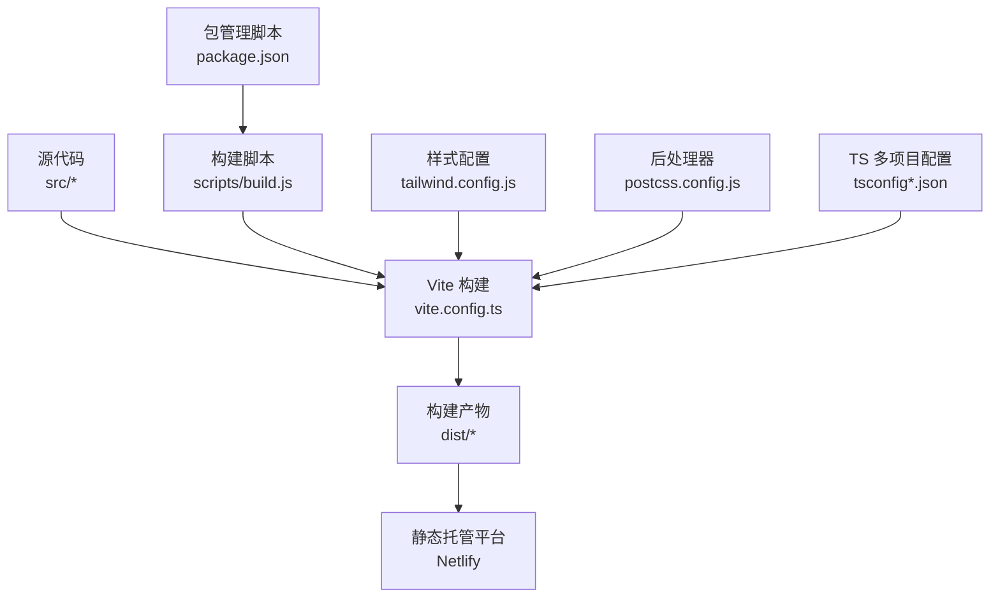
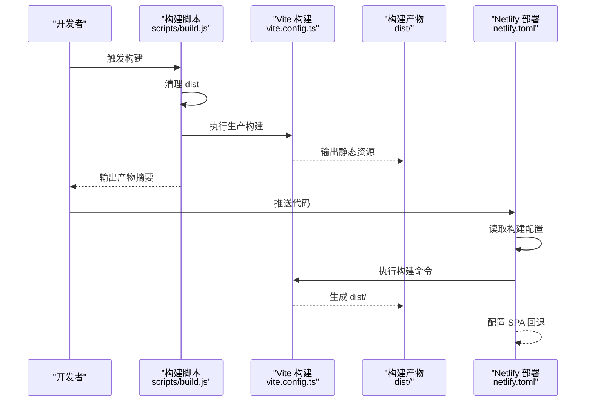
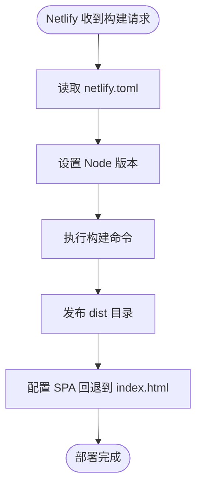
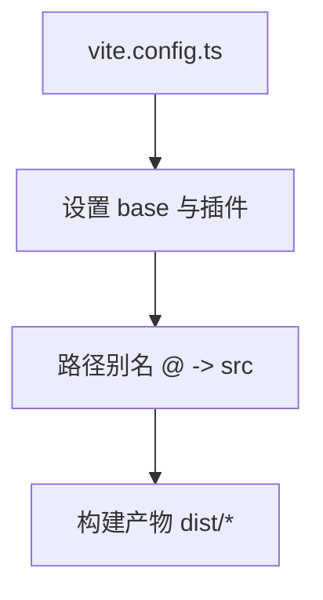
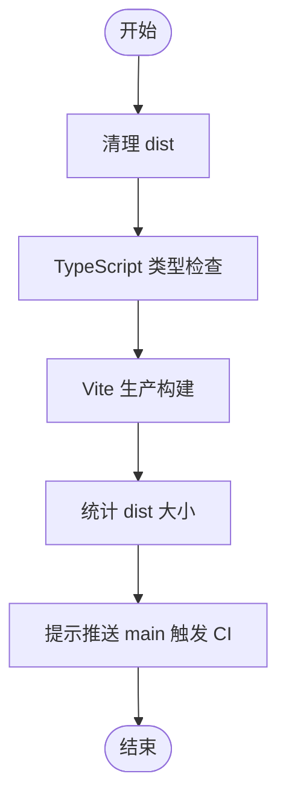
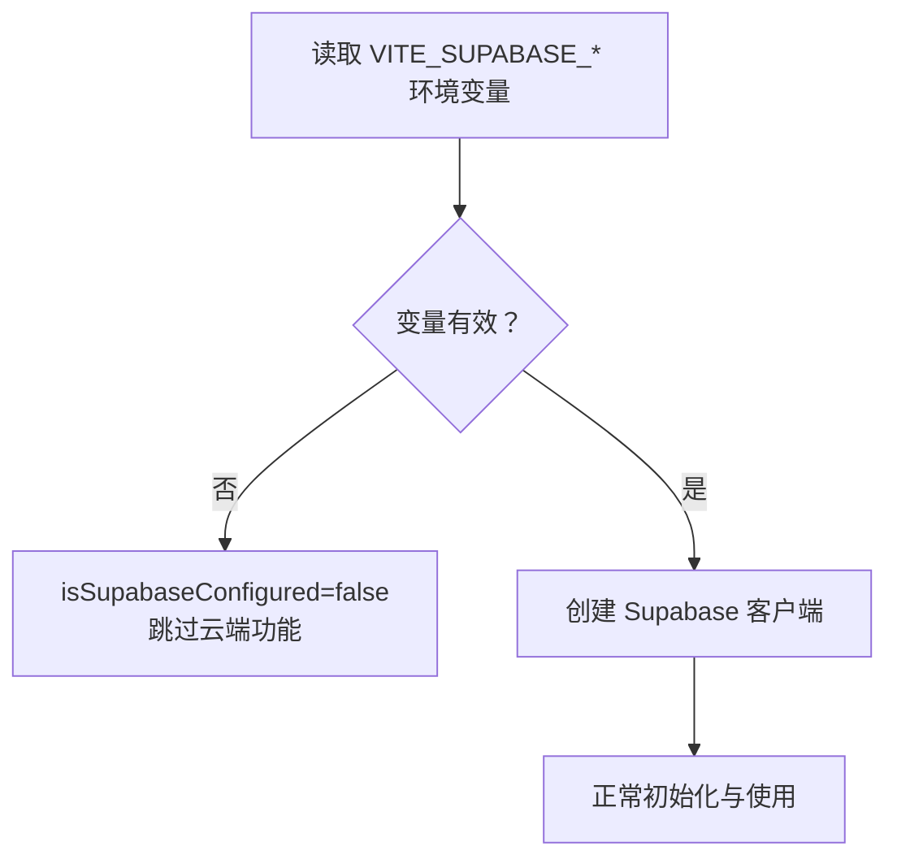
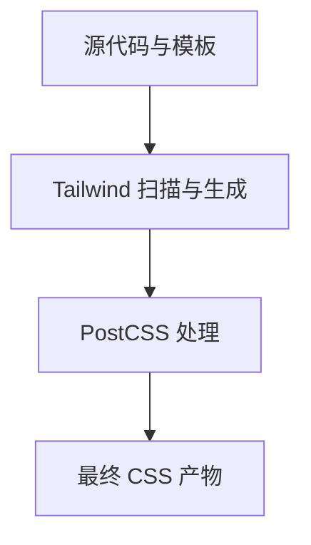
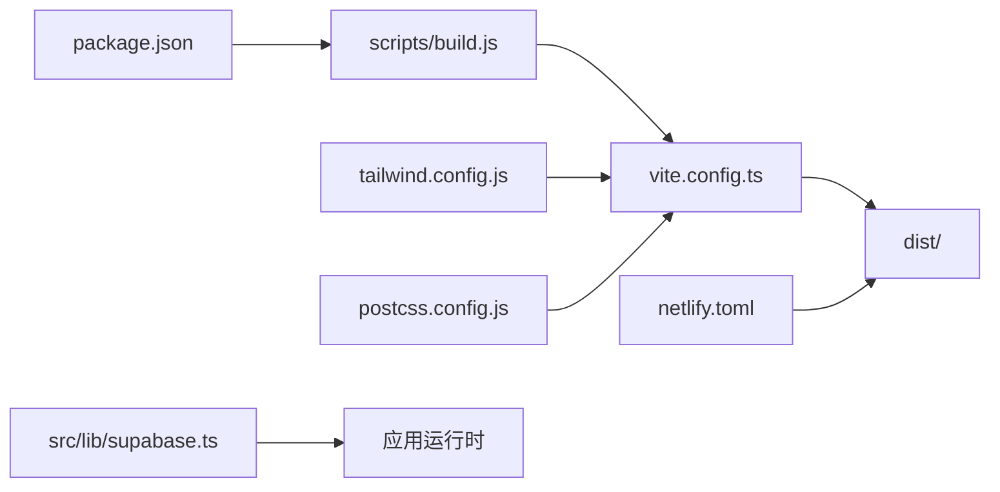

# 部署指南

<cite>
**本文引用的文件**
- [netlify.toml](file://netlify.toml)
- [package.json](file://package.json)
- [vite.config.ts](file://vite.config.ts)
- [scripts/build.js](file://scripts/build.js)
- [ARCHITECTURE.md](file://ARCHITECTURE.md)
- [tailwind.config.js](file://tailwind.config.js)
- [postcss.config.js](file://postcss.config.js)
- [tsconfig.json](file://tsconfig.json)
- [tsconfig.app.json](file://tsconfig.app.json)
- [tsconfig.node.json](file://tsconfig.node.json)
- [src/lib/supabase.ts](file://src/lib/supabase.ts)
</cite>

## 目录
1. [简介](#简介)
2. [项目结构](#项目结构)
3. [核心组件](#核心组件)
4. [架构总览](#架构总览)
5. [详细组件分析](#详细组件分析)
6. [依赖分析](#依赖分析)
7. [性能考虑](#性能考虑)
8. [故障排除指南](#故障排除指南)
9. [结论](#结论)
10. [附录](#附录)

## 简介
本指南面向运维与开发团队，系统化说明星耀平台在 Netlify 上的部署配置、构建流程与环境变量设置，解释 Vite 构建配置、静态资源处理与生产优化策略，并文档化部署脚本的实现原理、自动化流程与 CI/CD 集成现状。同时提供域名配置、SSL 与 CDN 加速建议，以及性能监控、错误日志与故障排除方法，最后总结多环境部署、回滚策略与版本管理的最佳实践。

## 项目结构
星耀平台采用 React + Vite + TypeScript 技术栈，构建产物输出至 dist 目录，供静态托管平台发布。关键配置文件包括构建脚本、Vite 配置、Tailwind 与 PostCSS 配置、TypeScript 多项目配置以及 Netlify 部署配置。

**图表来源**
- [vite.config.ts:1-14](file://vite.config.ts#L1-L14)
- [scripts/build.js:1-96](file://scripts/build.js#L1-L96)
- [package.json:6-12](file://package.json#L6-L12)
- [tailwind.config.js:1-52](file://tailwind.config.js#L1-L52)
- [postcss.config.js:1-7](file://postcss.config.js#L1-L7)
- [tsconfig.json:1-8](file://tsconfig.json#L1-L8)

**章节来源**
- [vite.config.ts:1-14](file://vite.config.ts#L1-L14)
- [scripts/build.js:58-82](file://scripts/build.js#L58-L82)
- [package.json:6-12](file://package.json#L6-L12)
- [tailwind.config.js:1-52](file://tailwind.config.js#L1-L52)
- [postcss.config.js:1-7](file://postcss.config.js#L1-L7)
- [tsconfig.json:1-8](file://tsconfig.json#L1-L8)

## 核心组件
- 构建脚本：统一执行清理、类型检查与 Vite 生产构建，输出 dist 目录并统计产物大小。
- Vite 配置：设置路径别名、React 插件与站点基础路径 base。
- 静态资源与样式：Tailwind 与 PostCSS 配置，确保样式正确打包与运行时生效。
- 环境变量：通过 Vite 环境变量注入 Supabase 凭据，实现按需启用云端能力。
- 部署配置：Netlify 配置指定构建命令、发布目录与 SPA 回退规则。

**章节来源**
- [scripts/build.js:58-95](file://scripts/build.js#L58-L95)
- [vite.config.ts:5-13](file://vite.config.ts#L5-L13)
- [tailwind.config.js:4-51](file://tailwind.config.js#L4-L51)
- [postcss.config.js:1-7](file://postcss.config.js#L1-L7)
- [src/lib/supabase.ts:1-17](file://src/lib/supabase.ts#L1-L17)
- [netlify.toml:1-13](file://netlify.toml#L1-L13)

## 架构总览
下图展示了从源码到 Netlify 部署的关键流程：开发者通过构建脚本或直接调用 Vite，生成 dist 目录；Netlify 读取配置，执行构建命令并将 dist 作为发布目录；浏览器访问时，Netlify 将所有路由回退到 index.html，由前端路由接管。

**图表来源**
- [scripts/build.js:58-82](file://scripts/build.js#L58-L82)
- [vite.config.ts:5-13](file://vite.config.ts#L5-L13)
- [netlify.toml:1-13](file://netlify.toml#L1-L13)

**章节来源**
- [scripts/build.js:58-95](file://scripts/build.js#L58-L95)
- [vite.config.ts:5-13](file://vite.config.ts#L5-L13)
- [netlify.toml:1-13](file://netlify.toml#L1-L13)

## 详细组件分析

### Netlify 部署配置
- 构建命令与发布目录：Netlify 通过 [build.command](file://netlify.toml#L2) 与 [build.publish](file://netlify.toml#L3) 指定构建入口与发布目录。
- 环境变量：通过 [build.environment.NODE_VERSION:5-6](file://netlify.toml#L5-L6) 固定 Node 版本，保证构建一致性。
- SPA 回退：通过 [[redirects]] 将所有路由回退到 index.html，配合前端路由实现单页应用。

**图表来源**
- [netlify.toml:1-13](file://netlify.toml#L1-L13)

**章节来源**
- [netlify.toml:1-13](file://netlify.toml#L1-L13)

### Vite 构建配置与静态资源处理
- 基础路径 base：Vite 配置中设置 base，用于在子路径部署场景下正确解析静态资源。
- 路径别名：通过 alias 将 @ 映射到 src，提升导入可读性。
- 插件：集成 React 插件以支持 JSX 与 React 18 的特性。

**图表来源**
- [vite.config.ts:5-13](file://vite.config.ts#L5-L13)

**章节来源**
- [vite.config.ts:5-13](file://vite.config.ts#L5-L13)

### 构建脚本实现原理与自动化流程
- 步骤一：清理 dist 目录，确保构建环境干净。
- 步骤二：执行 TypeScript 类型检查，防止类型错误进入生产构建。
- 步骤三：调用 Vite 生产构建，生成最终静态资源。
- 摘要：统计 dist 目录大小并输出构建结果，提示下一步推送 main 触发 CI 自动部署。

**图表来源**
- [scripts/build.js:58-95](file://scripts/build.js#L58-L95)

**章节来源**
- [scripts/build.js:58-95](file://scripts/build.js#L58-L95)

### 环境变量与 Supabase 集成
- 环境变量：通过 Vite 环境变量注入 Supabase URL 与匿名密钥，未配置时静默降级，避免运行时异常。
- 客户端初始化：根据环境变量决定是否创建 Supabase 客户端，确保在不同环境下的安全与稳定性。

**图表来源**
- [src/lib/supabase.ts:1-17](file://src/lib/supabase.ts#L1-L17)

**章节来源**
- [src/lib/supabase.ts:1-17](file://src/lib/supabase.ts#L1-L17)

### 样式与后处理器配置
- Tailwind：通过 content 指定扫描范围，确保按需生成样式；主题与插件配置集中于 tailwind.config.js。
- PostCSS：在 postcss.config.js 中启用 Tailwind 与 Autoprefixer，保障兼容性与最小化输出。

**图表来源**
- [tailwind.config.js:4-51](file://tailwind.config.js#L4-L51)
- [postcss.config.js:1-7](file://postcss.config.js#L1-L7)

**章节来源**
- [tailwind.config.js:4-51](file://tailwind.config.js#L4-L51)
- [postcss.config.js:1-7](file://postcss.config.js#L1-L7)

### TypeScript 多项目配置
- tsconfig.json 作为聚合入口，分别引用 tsconfig.app.json 与 tsconfig.node.json。
- app 侧启用 bundler 模式与 JSX，node 侧聚焦 Vite 配置文件的类型检查。

**章节来源**
- [tsconfig.json:1-8](file://tsconfig.json#L1-L8)
- [tsconfig.app.json:1-27](file://tsconfig.app.json#L1-L27)
- [tsconfig.node.json:1-25](file://tsconfig.node.json#L1-L25)

## 依赖分析
- 构建链路：package.json 的 build 脚本委托给 scripts/build.js，后者再调用 Vite 执行生产构建。
- 配置耦合：Vite 配置与构建脚本共同决定 dist 输出与资源路径；Netlify 依赖 dist 作为发布目录。
- 运行时依赖：Tailwind 与 PostCSS 在构建阶段参与样式处理；Supabase 客户端在运行时按环境变量启用。

**图表来源**
- [package.json:6-12](file://package.json#L6-L12)
- [scripts/build.js:78-82](file://scripts/build.js#L78-L82)
- [vite.config.ts:5-13](file://vite.config.ts#L5-L13)
- [netlify.toml:1-13](file://netlify.toml#L1-L13)
- [tailwind.config.js:4-51](file://tailwind.config.js#L4-L51)
- [postcss.config.js:1-7](file://postcss.config.js#L1-L7)
- [src/lib/supabase.ts:1-17](file://src/lib/supabase.ts#L1-L17)

**章节来源**
- [package.json:6-12](file://package.json#L6-L12)
- [scripts/build.js:78-82](file://scripts/build.js#L78-L82)
- [vite.config.ts:5-13](file://vite.config.ts#L5-L13)
- [netlify.toml:1-13](file://netlify.toml#L1-L13)
- [tailwind.config.js:4-51](file://tailwind.config.js#L4-L51)
- [postcss.config.js:1-7](file://postcss.config.js#L1-L7)
- [src/lib/supabase.ts:1-17](file://src/lib/supabase.ts#L1-L17)

## 性能考虑
- 静态资源优化：Vite 默认启用代码分割与压缩；Tailwind 按需生成样式，减少冗余 CSS。
- 资源路径：base 设置需与实际部署路径一致，避免静态资源 404。
- 构建缓存：合理利用 Vite 的快速冷启动与增量构建，缩短本地开发与 CI 时间。
- 运行时性能：按需加载路由组件，降低首屏体积；避免在未配置环境下调用云端服务。

[本节为通用指导，无需列出具体文件来源]

## 故障排除指南
- 构建失败
  - 现象：构建脚本输出失败并退出。
  - 排查：确认 TypeScript 检查通过；检查 Vite 构建命令是否可执行；查看 dist 是否生成。
  - 参考：[scripts/build.js:71-82](file://scripts/build.js#L71-L82)
- SPA 路由 404
  - 现象：刷新或直接访问深层路由返回 404。
  - 排查：确认 Netlify 的 [[redirects]] 已启用，将所有路由回退到 index.html。
  - 参考：[netlify.toml:8-12](file://netlify.toml#L8-L12)
- 静态资源路径错误
  - 现象：图片、字体等资源 404。
  - 排查：检查 vite.config.ts 中 base 设置是否与部署路径一致。
  - 参考：[vite.config.ts:6](file://vite.config.ts#L6)
- Supabase 未生效
  - 现象：云端功能不可用。
  - 排查：确认 VITE_SUPABASE_URL 与 VITE_SUPABASE_ANON_KEY 已正确注入；检查 isSupabaseConfigured。
  - 参考：[src/lib/supabase.ts:1-17](file://src/lib/supabase.ts#L1-L17)

**章节来源**
- [scripts/build.js:71-82](file://scripts/build.js#L71-L82)
- [netlify.toml:8-12](file://netlify.toml#L8-L12)
- [vite.config.ts:6](file://vite.config.ts#L6)
- [src/lib/supabase.ts:1-17](file://src/lib/supabase.ts#L1-L17)

## 结论
通过标准化的构建脚本、明确的 Vite 配置与 Netlify 部署规则，星耀平台可在 Netlify 上实现稳定、可复现的静态部署。结合按需加载、样式按需生成与环境变量保护，可进一步提升性能与安全性。建议在现有基础上完善 CI/CD 流程与监控告警，持续优化构建速度与用户体验。

[本节为总结性内容，无需列出具体文件来源]

## 附录

### 域名配置、SSL 与 CDN 加速
- 域名与 SSL：在 Netlify 控制台绑定自定义域名并启用自动 SSL 证书；如需强制 HTTPS，可启用重定向策略。
- CDN 加速：Netlify 默认提供全球 CDN；如需更细粒度控制，可在 DNS 层配置 CNAME 或使用 Netlify 的代理与缓存策略。
- 资源缓存：合理设置静态资源缓存策略，结合哈希文件名实现长效缓存与更新。

[本节为通用指导，无需列出具体文件来源]

### 多环境部署、回滚策略与版本管理
- 多环境：通过分支策略（如 main/staging/dev）与 Netlify 的环境变量分层，实现不同环境的差异化配置。
- 回滚：Netlify 支持基于提交历史的回滚；建议保留最近几个版本的构建产物以便快速回滚。
- 版本管理：以 Git Tag 作为发布版本标识，结合构建产物的哈希值进行溯源与审计。

[本节为通用指导，无需列出具体文件来源]