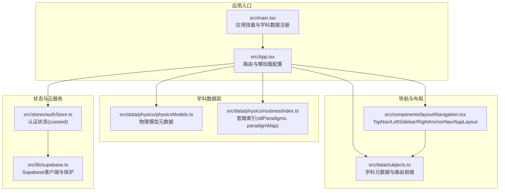
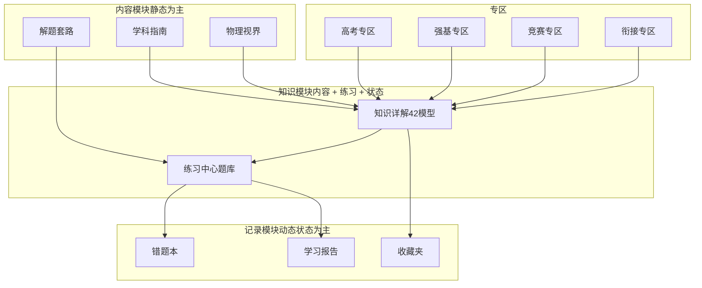
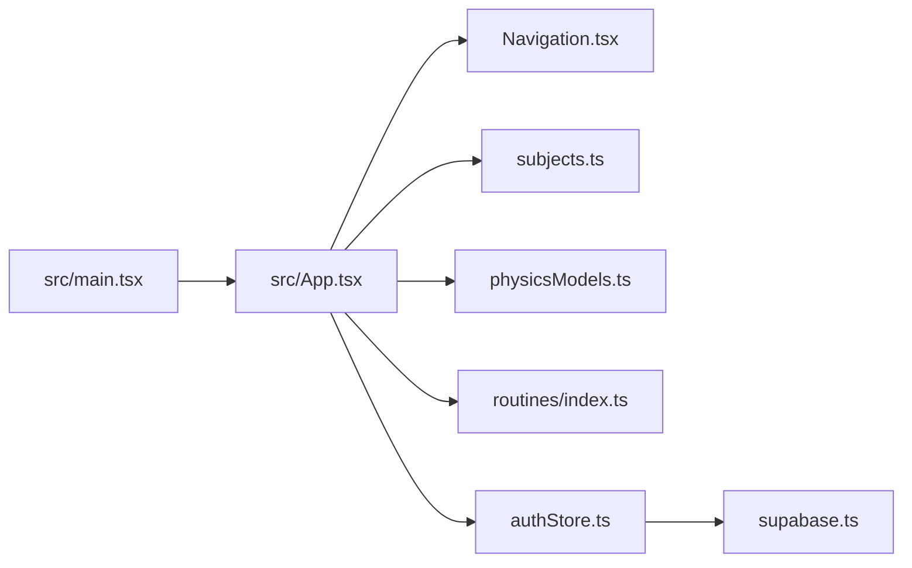

# 项目概述

<cite>
**本文档引用的文件**
- [package.json](file://package.json)
- [vite.config.ts](file://vite.config.ts)
- [ARCHITECTURE.md](file://ARCHITECTURE.md)
- [SPEC.md](file://SPEC.md)
- [TECH_ARCHITECTURE.md](file://TECH_ARCHITECTURE.md)
- [src/App.tsx](file://src/App.tsx)
- [src/main.tsx](file://src/main.tsx)
- [src/components/layout/Navigation.tsx](file://src/components/layout/Navigation.tsx)
- [src/data/subjects.ts](file://src/data/subjects.ts)
- [src/data/physics/physicsModels.ts](file://src/data/physics/physicsModels.ts)
- [src/data/physics/routines/index.ts](file://src/data/physics/routines/index.ts)
- [src/stores/authStore.ts](file://src/stores/authStore.ts)
- [src/lib/supabase.ts](file://src/lib/supabase.ts)
</cite>

## 目录
1. [简介](#简介)
2. [项目结构](#项目结构)
3. [核心组件](#核心组件)
4. [架构总览](#架构总览)
5. [详细组件分析](#详细组件分析)
6. [依赖分析](#依赖分析)
7. [性能考虑](#性能考虑)
8. [故障排查指南](#故障排查指南)
9. [结论](#结论)
10. [附录](#附录)

## 简介
星耀高中教育平台是一个现代化的前端教育平台，面向高中生提供“认知图谱 + 解题套路”的学习支持。平台采用 React 19 + TypeScript + Vite 5 技术栈，结合模块化的学科知识体系、智能学习工具与题库系统，帮助学生建立系统的知识网络、掌握可迁移的解题方法，并通过练习与反馈形成闭环学习。

平台的核心价值主张：
- 建立学科知识网络：通过认知图谱与知识节点，帮助学生理解知识间的关联。
- 提供可操作的解题思维框架：以“套路”和“模型”为核心，形成可复用的解题方法论。
- 支持个性化学习路径：通过诊断、规划、方法工具，辅助学生制定并执行学习计划。
- 一体化学习体验：从知识详解到题库练习，再到错题本与学习报告，形成完整闭环。

## 项目结构
项目采用模块化与分层架构，围绕“学科 + 模块”的组织方式，配合统一的导航与布局骨架，确保内容可扩展、路由可复用、组件可复用。

图表来源
- [src/main.tsx:1-19](file://src/main.tsx#L1-L19)
- [src/App.tsx:1-214](file://src/App.tsx#L1-L214)
- [src/components/layout/Navigation.tsx:1-719](file://src/components/layout/Navigation.tsx#L1-L719)
- [src/data/subjects.ts:1-30](file://src/data/subjects.ts#L1-L30)
- [src/data/physics/physicsModels.ts:1-66](file://src/data/physics/physicsModels.ts#L1-L66)
- [src/data/physics/routines/index.ts:1-279](file://src/data/physics/routines/index.ts#L1-L279)
- [src/stores/authStore.ts:1-63](file://src/stores/authStore.ts#L1-L63)
- [src/lib/supabase.ts:1-18](file://src/lib/supabase.ts#L1-L18)

章节来源
- [src/main.tsx:1-19](file://src/main.tsx#L1-L19)
- [src/App.tsx:1-214](file://src/App.tsx#L1-L214)
- [src/components/layout/Navigation.tsx:1-719](file://src/components/layout/Navigation.tsx#L1-L719)
- [src/data/subjects.ts:1-30](file://src/data/subjects.ts#L1-L30)
- [src/data/physics/physicsModels.ts:1-66](file://src/data/physics/physicsModels.ts#L1-L66)
- [src/data/physics/routines/index.ts:1-279](file://src/data/physics/routines/index.ts#L1-L279)
- [src/stores/authStore.ts:1-63](file://src/stores/authStore.ts#L1-L63)
- [src/lib/supabase.ts:1-18](file://src/lib/supabase.ts#L1-L18)

## 核心组件
- 应用入口与路由
  - 应用入口负责注册所有学科数据并渲染根组件，路由采用 React Router v7，大量使用懒加载以优化首屏性能。
  - 路由覆盖物理/化学/数学/生物/语文/英语等学科模块，以及高考/强基/竞赛/衔接等专区，同时提供学习工具（诊断/规划/方法）与占位页。
- 导航与布局骨架
  - 顶部导航支持学科切换与学习工具下拉；左侧边栏按学科动态生成模块导航；右侧锚点导航用于详情页章节跳转。
  - AppLayout 统一承载导航与内容区域，支持是否显示左侧导航与右侧锚点的灵活配置。
- 数据与内容
  - 物理模型元数据与套路索引集中管理，便于认知图谱与模块页面复用。
  - 学科元数据定义了路由前缀、模型/概念前缀与可用性，支撑多学科扩展。
- 状态与云服务
  - 认证状态通过 Zustand 管理，初始化时根据 Supabase 配置决定是否启用匿名认证。
  - Supabase 客户端按环境变量创建，未配置时静默降级，避免运行时异常。

章节来源
- [src/App.tsx:1-214](file://src/App.tsx#L1-L214)
- [src/components/layout/Navigation.tsx:1-719](file://src/components/layout/Navigation.tsx#L1-L719)
- [src/data/physics/physicsModels.ts:1-66](file://src/data/physics/physicsModels.ts#L1-L66)
- [src/data/physics/routines/index.ts:1-279](file://src/data/physics/routines/index.ts#L1-L279)
- [src/data/subjects.ts:1-30](file://src/data/subjects.ts#L1-L30)
- [src/stores/authStore.ts:1-63](file://src/stores/authStore.ts#L1-L63)
- [src/lib/supabase.ts:1-18](file://src/lib/supabase.ts#L1-L18)

## 架构总览
平台采用“内容 + 练习 + 记录”的三层模块化设计，结合统一的导航与布局骨架，形成可扩展、可复用的前端架构。

图表来源
- [TECH_ARCHITECTURE.md:10-380](file://TECH_ARCHITECTURE.md#L10-L380)
- [SPEC.md:1-1075](file://SPEC.md#L1-L1075)

章节来源
- [TECH_ARCHITECTURE.md:10-380](file://TECH_ARCHITECTURE.md#L10-L380)
- [SPEC.md:1-1075](file://SPEC.md#L1-L1075)

## 详细组件分析

### 技术栈与构建配置
- 技术栈
  - 前端框架：React 19（vite.config.ts 中使用 @vitejs/plugin-react）
  - 状态管理：Zustand（用户/主题/收藏/认证）
  - 路由：React Router v7（支持懒加载）
  - UI 组件库：shadcn/ui（基于 Radix UI）
  - 样式：Tailwind CSS v3
  - 数学公式：KaTeX（当前禁用，ENABLE_KATEX=false）
  - 可视化：AntV G6 v5（认知图谱）
  - 云服务：Supabase（匿名认证与数据持久化）
- 构建与别名
  - Vite 5，base 设置为 '/stellar-glory/'，路径别名为 '@' 指向 src
  - 开发脚本：dev、build、build:fast、lint、preview、audit
- 依赖与开发依赖
  - 依赖涵盖 UI、路由、状态、图表、KaTeX、Supabase、Zustand 等
  - 开发依赖包括 TypeScript、ESLint、PostCSS、Tailwind CSS、Vite 插件等

章节来源
- [package.json:1-86](file://package.json#L1-L86)
- [vite.config.ts:1-14](file://vite.config.ts#L1-L14)

### 路由与懒加载
- 路由覆盖范围
  - 物理/化学/数学/生物/语文/英语：学科指南、知识详解、概念/公式、解题套路、思维方法、物理视界、练习中心、错题本、学习报告、收藏夹、高考/强基/竞赛/衔接专区等
  - 学习工具：诊断评估、目标规划、学习方法
  - 旧路由重定向：/physics/practice* → PracticeRedirect → 新路由
- 懒加载策略
  - 题库相关页面（QuestionBankList/Detail/Do）与竞赛专区、高考/强基/衔接专区采用懒加载，减少首屏体积与崩溃链风险

章节来源
- [ARCHITECTURE.md:27-202](file://ARCHITECTURE.md#L27-L202)
- [src/App.tsx:1-214](file://src/App.tsx#L1-L214)

### 导航与布局骨架
- 顶部导航（TopNav）
  - 支持学科切换、当前学科下拉、学习工具下拉、移动端抽屉菜单
- 左侧边栏（LeftSidebar）
  - 按学科动态生成模块导航，支持高亮当前模块
- 右侧锚点导航（RightAnchorNav）
  - 基于 IntersectionObserver 的章节锚点跳转
- 布局骨架（AppLayout）
  - 统一承载 TopNav + LeftSidebar + 内容区 + 右侧锚点，支持 showSubjectNav 与 anchors 参数

章节来源
- [src/components/layout/Navigation.tsx:1-719](file://src/components/layout/Navigation.tsx#L1-L719)
- [ARCHITECTURE.md:121-192](file://ARCHITECTURE.md#L121-L192)

### 数据与内容体系
- 物理模型元数据
  - physicsModels.ts 提供 42 个模型的基础元信息（id/title/module/chapter/order），用于认知图谱、学科指南与模型列表
- 套路索引
  - routines/index.ts 汇总 R01-R90，提供 allParadigms 与 paradigmMap，便于按模型/套路检索
- 学科元数据
  - subjects.ts 定义学科 id/code/name/color/routePrefix/modelPrefix/conceptPrefix/available，支撑多学科扩展

章节来源
- [src/data/physics/physicsModels.ts:1-66](file://src/data/physics/physicsModels.ts#L1-L66)
- [src/data/physics/routines/index.ts:1-279](file://src/data/physics/routines/index.ts#L1-L279)
- [src/data/subjects.ts:1-30](file://src/data/subjects.ts#L1-L30)

### 认知图谱与学习路径
- 认知图谱
  - 基于 AntV G6 v5，结合 K 层知识节点与 M 层模型，构建可视化知识网络
- 学习路径
  - 从 K 层知识 → M 层模型 → R 层套路 → P 层练习，形成由浅入深的学习路径
  - 高考/强基专区作为跨学科的延伸与进阶

章节来源
- [SPEC.md:9-72](file://SPEC.md#L9-L72)
- [ARCHITECTURE.md:10-33](file://ARCHITECTURE.md#L10-L33)

### 题库系统与练习流程
- 题库数据结构
  - 每个模型配套 B/J/T 三层题（基础/进阶/挑战），支持难度标识、题型、标签、提示、解析、关联知识点与套路
- 练习流程
  - 列表页：按模型筛选与难度折叠
  - 详情页：DiffSection + QuestionCard（预览与开始做题）
  - 做题页：进度条 + 计时器 + QuestionCard（提交后显示解析与关联知识点/套路跳转）

章节来源
- [SPEC.md:190-236](file://SPEC.md#L190-L236)
- [ARCHITECTURE.md:139-173](file://ARCHITECTURE.md#L139-L173)

### 学习记录与云服务
- 认证与状态
  - authStore 管理 userId/isAnonymous/isLoading，初始化时根据 Supabase 配置决定是否启用匿名认证
- 云服务保护
  - supabase.ts 仅在环境变量有效时创建客户端，未配置时静默降级
- 数据模型（Supabase）
  - profiles、favorites、progress、wrong_questions、study_sessions 等表支撑错题本、收藏夹、学习报告等记录模块

章节来源
- [src/stores/authStore.ts:1-63](file://src/stores/authStore.ts#L1-L63)
- [src/lib/supabase.ts:1-18](file://src/lib/supabase.ts#L1-L18)
- [TECH_ARCHITECTURE.md:139-173](file://TECH_ARCHITECTURE.md#L139-L173)

### 学习工具模块
- 诊断评估：学科能力诊断 → 评级 → 推荐
- 目标规划：年级/目标 → 三年时间线
- 学习方法：五大高效学习法 + 自评量表

章节来源
- [ARCHITECTURE.md:159-162](file://ARCHITECTURE.md#L159-L162)
- [ARCHITECTURE.md:164-172](file://ARCHITECTURE.md#L164-L172)

## 依赖分析
平台依赖关系围绕“应用入口 → 路由 → 导航/布局 → 数据/内容 → 状态/云服务”的主线展开，耦合度低、内聚度高，便于扩展与维护。

图表来源
- [src/main.tsx:1-19](file://src/main.tsx#L1-L19)
- [src/App.tsx:1-214](file://src/App.tsx#L1-L214)
- [src/components/layout/Navigation.tsx:1-719](file://src/components/layout/Navigation.tsx#L1-L719)
- [src/data/subjects.ts:1-30](file://src/data/subjects.ts#L1-L30)
- [src/data/physics/physicsModels.ts:1-66](file://src/data/physics/physicsModels.ts#L1-L66)
- [src/data/physics/routines/index.ts:1-279](file://src/data/physics/routines/index.ts#L1-L279)
- [src/stores/authStore.ts:1-63](file://src/stores/authStore.ts#L1-L63)
- [src/lib/supabase.ts:1-18](file://src/lib/supabase.ts#L1-L18)

章节来源
- [src/main.tsx:1-19](file://src/main.tsx#L1-L19)
- [src/App.tsx:1-214](file://src/App.tsx#L1-L214)
- [src/components/layout/Navigation.tsx:1-719](file://src/components/layout/Navigation.tsx#L1-L719)
- [src/data/subjects.ts:1-30](file://src/data/subjects.ts#L1-L30)
- [src/data/physics/physicsModels.ts:1-66](file://src/data/physics/physicsModels.ts#L1-L66)
- [src/data/physics/routines/index.ts:1-279](file://src/data/physics/routines/index.ts#L1-L279)
- [src/stores/authStore.ts:1-63](file://src/stores/authStore.ts#L1-L63)
- [src/lib/supabase.ts:1-18](file://src/lib/supabase.ts#L1-L18)

## 性能考虑
- 懒加载与按需加载
  - 题库与竞赛/高考/强基/衔接专区采用懒加载，显著降低首屏体积与崩溃链风险
- 资源基座
  - Vite 5 + React 19 + TypeScript，构建与类型检查效率高
- 组件复用
  - AppLayout 与共享组件（MarkdownRenderer、QuestionCard 等）减少重复实现，提升维护效率
- 云服务保护
  - Supabase 未配置时静默降级，避免运行时异常导致的性能与稳定性问题

章节来源
- [ARCHITECTURE.md:27-44](file://ARCHITECTURE.md#L27-L44)
- [vite.config.ts:1-14](file://vite.config.ts#L1-L14)
- [ARCHITECTURE.md:209-318](file://ARCHITECTURE.md#L209-L318)

## 故障排查指南
- Supabase 未配置
  - 现象：认证初始化不生效，收藏/进度/错题等云端功能不可用
  - 处理：检查环境变量 VITE_SUPABASE_URL 与 VITE_SUPABASE_ANON_KEY 是否正确设置
- KaTeX 渲染问题
  - 现象：数学公式未渲染或报错
  - 处理：当前 ENABLE_KATEX=false，需解决 CDN 问题后启用
- 路由跳转异常
  - 现象：/physics/practice* 旧路由无法访问
  - 处理：使用 PracticeRedirect 统一跳转至新路由（/physics/exercises 等）
- 导航高亮错位
  - 现象：useCurrentModule 高亮错位、桌面端硬编码 physicsModules
  - 处理：等待已知 Bug 修复（见 ARCHITECTURE.md 技术债务）

章节来源
- [src/lib/supabase.ts:1-18](file://src/lib/supabase.ts#L1-L18)
- [ARCHITECTURE.md:207-223](file://ARCHITECTURE.md#L207-L223)
- [ARCHITECTURE.md:321-332](file://ARCHITECTURE.md#L321-L332)
- [ARCHITECTURE.md:112-118](file://ARCHITECTURE.md#L112-L118)

## 结论
星耀高中教育平台以“认知图谱 + 解题套路”为核心，结合 React 19 + TypeScript + Vite 5 技术栈，构建了模块化、可扩展且高性能的前端教育平台。通过统一的导航与布局骨架、完善的路由与懒加载策略、以及基于 Supabase 的云服务保护，平台为高中生提供了从知识详解到题库练习再到学习记录的完整学习闭环。未来可在搜索、全局导航移除、跨学科关联等方面持续优化，进一步提升用户体验与教学效果。

## 附录
- 项目目标与价值主张
  - 帮助学生建立学科知识网络（认知图谱）
  - 提供可操作的解题思维框架（套路 + 练习）
  - 支持个性化学习路径（诊断/规划/方法）
  - 一体化学习体验（知识详解 → 题库 → 错题本 → 学习报告）
- 用户群体定位
  - 高中生（高一至高三）
  - 竞赛选手（物理/化学/数学/生物/信息学）
  - 高考/强基备考学生
  - 需要系统化学习方法的中学生
- 教育理念
  - 以模型与套路为抓手，强调知识迁移与方法论
  - 通过练习与反馈形成学习闭环，注重过程性评价与个性化指导
  - 以可视化与故事化内容增强学习兴趣与理解深度