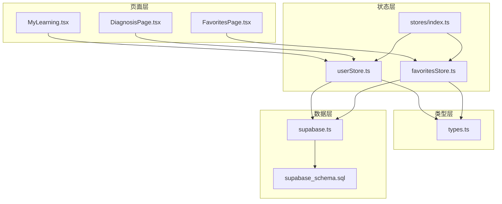
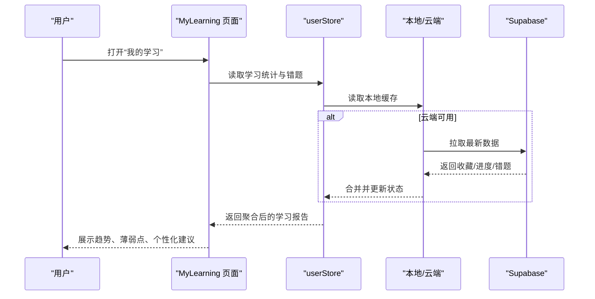
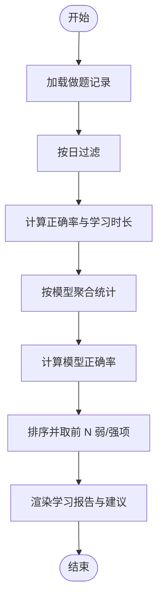
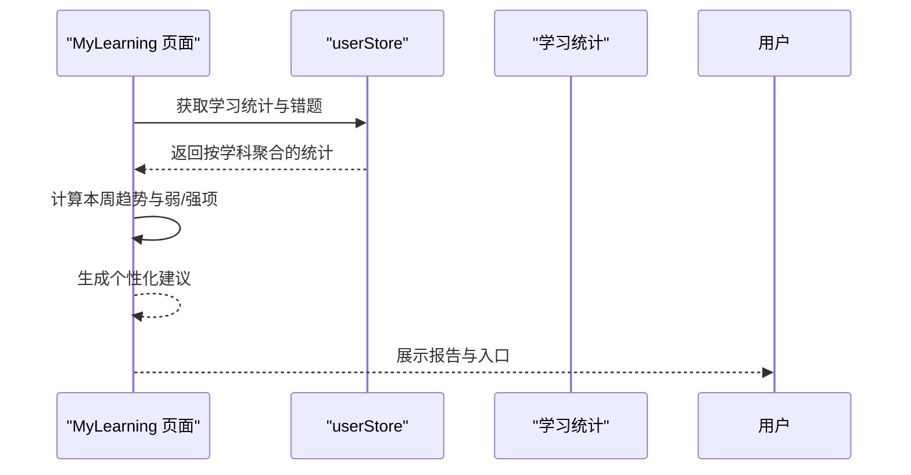
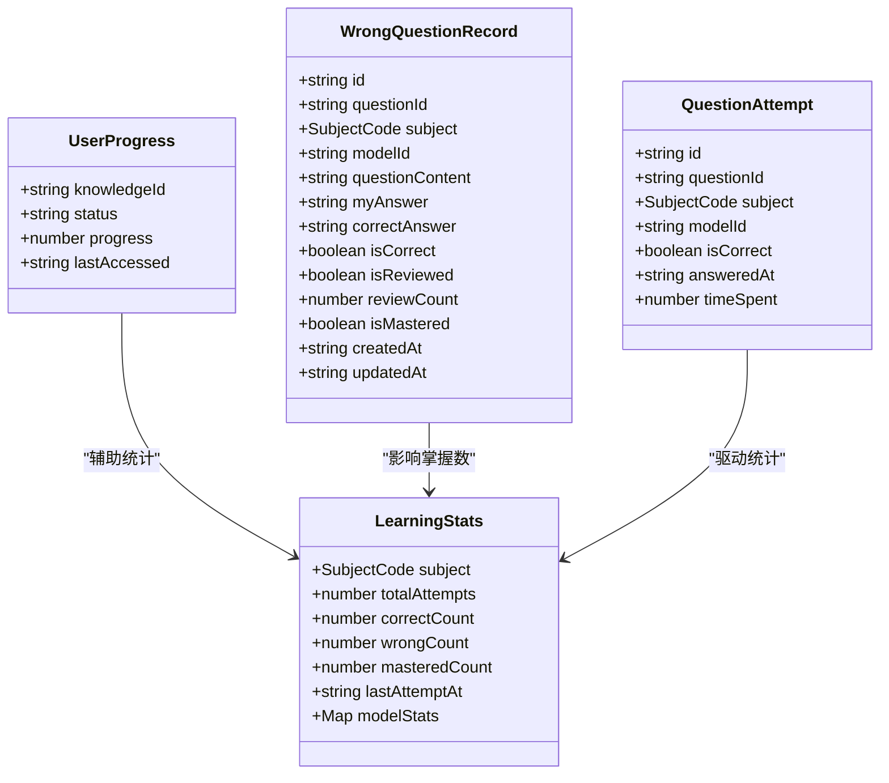
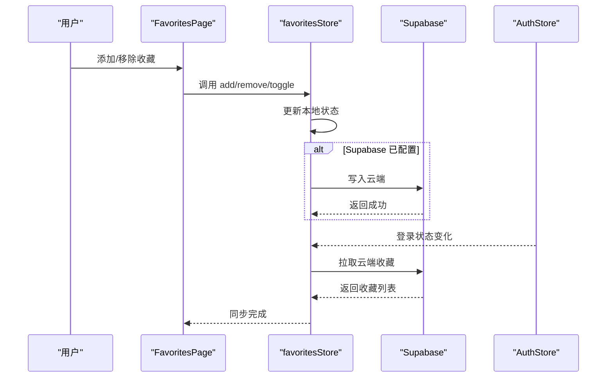
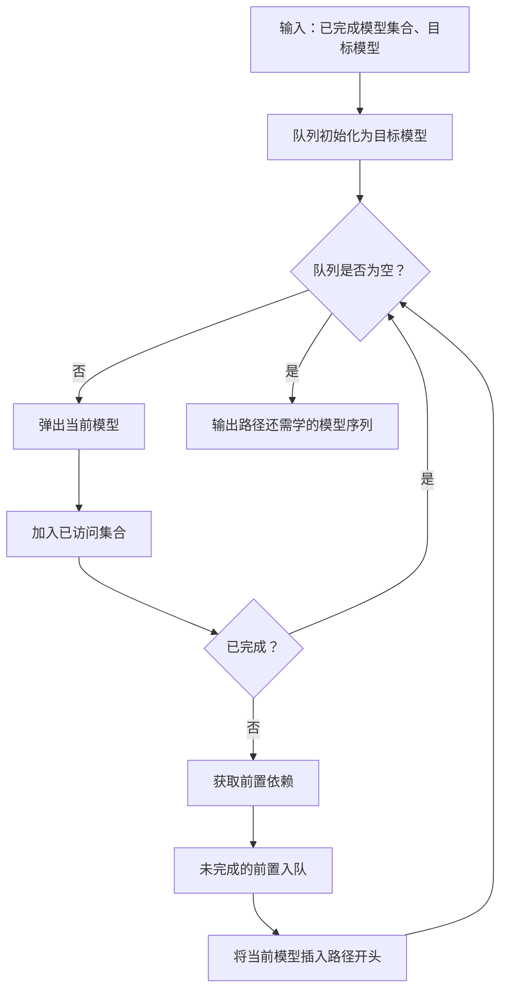
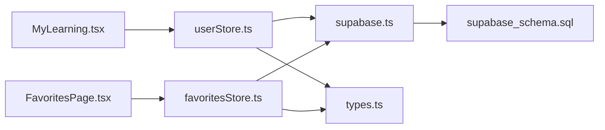

# 我的学习系统

<cite>
**本文引用的文件**
- [MyLearning.tsx](file://src/sections/MyLearning.tsx)
- [userStore.ts](file://src/stores/userStore.ts)
- [favoritesStore.ts](file://src/stores/favoritesStore.ts)
- [index.ts](file://src/stores/index.ts)
- [types.ts](file://src/types/index.ts)
- [supabase.ts](file://src/lib/supabase.ts)
- [supabase_schema.sql](file://supabase_schema.sql)
- [DiagnosisPage.tsx](file://src/sections/tools/DiagnosisPage.tsx)
- [FavoritesPage.tsx](file://src/sections/FavoritesPage.tsx)
- [reference-case-2-khan-academy.md](file://docs/references/reference-case-2-khan-academy.md)
- [reference-case-3-studynotion.md](file://docs/references/reference-case-3-studynotion.md)
- [paths.ts](file://src/data-backup-broken/tools/paths.ts)
</cite>

## 目录
1. [简介](#简介)
2. [项目结构](#项目结构)
3. [核心组件](#核心组件)
4. [架构总览](#架构总览)
5. [详细组件分析](#详细组件分析)
6. [依赖分析](#依赖分析)
7. [性能考虑](#性能考虑)
8. [故障排查指南](#故障排查指南)
9. [结论](#结论)
10. [附录](#附录)

## 简介
本文件面向“星耀平台”的“我的学习”系统，围绕以下主题进行系统化文档化：
- 错题本设计理念、数据存储结构与查询算法
- 学习报告生成机制、知识点掌握分析与个性化复习建议
- 学习进度跟踪、完成度统计与成就系统实现
- 收藏夹功能、学习历史记录与笔记管理
- 数据同步机制、离线缓存策略与隐私保护措施
- 学习数据分析算法、推荐引擎实现与用户体验优化方案
- 提供具体代码实现与配置示例的路径引用

## 项目结构
“我的学习”系统由前端页面、状态管理、类型定义、数据库与权限策略共同构成。关键模块如下：
- 页面层：MyLearning、FavoritesPage、DiagnosisPage 等
- 状态层：userStore（学习统计、错题、做题记录）、favoritesStore（收藏夹）
- 类型层：统一的数据结构定义（知识点、错题、做题记录、学习统计等）
- 数据层：Supabase 表结构与 RLS 策略
- 工具与参考：Khan Academy 掌握度与 StudyNotion 进度模型参考

图表来源
- [MyLearning.tsx:1-303](file://src/sections/MyLearning.tsx#L1-L303)
- [userStore.ts:1-236](file://src/stores/userStore.ts#L1-L236)
- [favoritesStore.ts:1-172](file://src/stores/favoritesStore.ts#L1-L172)
- [index.ts:1-3](file://src/stores/index.ts#L1-L3)
- [types.ts:1-209](file://src/types/index.ts#L1-L209)
- [supabase.ts:1-18](file://src/lib/supabase.ts#L1-L18)
- [supabase_schema.sql:1-178](file://supabase_schema.sql#L1-L178)

章节来源
- [MyLearning.tsx:1-303](file://src/sections/MyLearning.tsx#L1-L303)
- [userStore.ts:1-236](file://src/stores/userStore.ts#L1-L236)
- [favoritesStore.ts:1-172](file://src/stores/favoritesStore.ts#L1-L172)
- [types.ts:1-209](file://src/types/index.ts#L1-L209)
- [supabase.ts:1-18](file://src/lib/supabase.ts#L1-L18)
- [supabase_schema.sql:1-178](file://supabase_schema.sql#L1-L178)

## 核心组件
- 错题本与学习统计
  - 错题记录结构：字段覆盖题目标识、学科、模型、答案、正误、复习计数、掌握标记、时间戳等
  - 学习统计结构：按学科聚合总做题数、正确数、错误数、掌握数、最后作答时间、按模型维度的统计
  - 统计更新：基于做题记录过滤与聚合，维护 per-model 的正确率与尝试次数
- 收藏夹
  - 支持本地与云端同步；未配置 Supabase 时使用本地持久化；配置后以云端为主，本地作为降级与快速响应
  - 自动监听登录状态变化，登录后拉取云端收藏并合并本地
- 学习报告与个性化建议
  - 本周趋势：按日聚合正确率与学习时长，用于可视化展示
  - 薄弱点与强项：按模型正确率排序，输出前 N 名弱项与强项
  - 个性化建议：根据弱项与强项动态生成学习建议
- 学习历史与诊断
  - 历史记录：做题记录包含题目、模型、学科、正误、耗时、时间戳
  - 诊断页面：学科能力诊断，支持本地历史记录保存与展示

章节来源
- [userStore.ts:139-236](file://src/stores/userStore.ts#L139-L236)
- [types.ts:146-188](file://src/types/index.ts#L146-L188)
- [MyLearning.tsx:17-79](file://src/sections/MyLearning.tsx#L17-L79)
- [favoritesStore.ts:30-172](file://src/stores/favoritesStore.ts#L30-L172)
- [DiagnosisPage.tsx:1-200](file://src/sections/tools/DiagnosisPage.tsx#L1-L200)

## 架构总览
“我的学习”系统采用前端状态管理 + Supabase 同步的架构：
- 前端状态：Zustand Store 管理用户学习状态、错题、做题记录与学习统计
- 同步策略：未配置 Supabase 时本地持久化；配置后优先云端，本地作为快速响应与降级
- 权限与安全：Supabase RLS 策略确保每条记录仅用户本人可访问
- 数据库：收藏夹、学习进度、错题、做题历史、学习会话等表

图表来源
- [MyLearning.tsx:14-303](file://src/sections/MyLearning.tsx#L14-L303)
- [userStore.ts:46-236](file://src/stores/userStore.ts#L46-L236)
- [favoritesStore.ts:30-172](file://src/stores/favoritesStore.ts#L30-L172)
- [supabase.ts:1-18](file://src/lib/supabase.ts#L1-L18)
- [supabase_schema.sql:36-178](file://supabase_schema.sql#L36-L178)

## 详细组件分析

### 错题本与学习统计
- 设计理念
  - 将错题视为“学习反馈”，通过复习计数、掌握标记与错因记录驱动个性化复习
  - 学习统计按学科与模型维度聚合，形成“知识点掌握画像”
- 数据存储结构
  - 错题记录：包含题目标识、学科、模型、我的答案、正确答案、正误、复习计数、是否掌握、时间戳
  - 学习统计：包含总尝试、正确数、错误数、掌握数、最后作答时间、按模型的尝试与正确次数
- 查询与聚合算法
  - 按日聚合：以日期字符串过滤做题记录，计算当日正确率与学习时长
  - 按模型聚合：遍历做题记录，统计每个模型的尝试与正确次数，计算正确率
- 个性化复习建议
  - 输出弱项与强项清单，结合“继续挑战”“去复习”等入口，引导用户行动

图表来源
- [MyLearning.tsx:21-79](file://src/sections/MyLearning.tsx#L21-L79)
- [userStore.ts:179-214](file://src/stores/userStore.ts#L179-L214)
- [types.ts:165-188](file://src/types/index.ts#L165-L188)

章节来源
- [MyLearning.tsx:17-79](file://src/sections/MyLearning.tsx#L17-L79)
- [userStore.ts:179-214](file://src/stores/userStore.ts#L179-L214)
- [types.ts:146-188](file://src/types/index.ts#L146-L188)

### 学习报告生成机制
- 本周学习趋势
  - 以最近 7 天为窗口，按日统计正确率与学习时长，用于柱状图与折线图展示
- 薄弱点与强项
  - 基于模型正确率排序，分别输出弱项与强项列表，并提供“去复习”“继续挑战”入口
- 个性化建议
  - 动态生成三条建议，结合当前弱项与强项，给出针对性提升方向

图表来源
- [MyLearning.tsx:17-299](file://src/sections/MyLearning.tsx#L17-L299)
- [userStore.ts:37-236](file://src/stores/userStore.ts#L37-L236)

章节来源
- [MyLearning.tsx:17-299](file://src/sections/MyLearning.tsx#L17-L299)

### 知识点掌握分析
- 掌握度指标
  - 模型正确率：模型维度的正确率作为掌握度参考
  - 复习计数：反映用户对错题的关注程度
- 掌握画像
  - 结合“弱项”“强项”与“完成题目数”“总正确率”等指标，形成个人掌握画像
- 参考模型
  - Khan Academy 掌握度原理：连续正确次数、错误间隔、题目难度、时间衰减
  - StudyNotion 进度模型：章节进度、模型进度、整体进度与推荐

图表来源
- [types.ts:139-188](file://src/types/index.ts#L139-L188)
- [userStore.ts:179-214](file://src/stores/userStore.ts#L179-L214)

章节来源
- [types.ts:139-188](file://src/types/index.ts#L139-L188)
- [reference-case-2-khan-academy.md:218-270](file://docs/references/reference-case-2-khan-academy.md#L218-L270)
- [reference-case-3-studynotion.md:571-616](file://docs/references/reference-case-3-studynotion.md#L571-L616)

### 个性化复习建议
- 触发条件
  - 当存在弱项或强项时，动态生成建议
- 建议内容
  - 针对弱项提出“重点复习相关知识点”的建议
  - 针对强项建议“挑战更高难度”
  - 通用建议“坚持每天练习，逐步提升正确率”

章节来源
- [MyLearning.tsx:281-299](file://src/sections/MyLearning.tsx#L281-L299)

### 学习进度跟踪与完成度统计
- 进度跟踪
  - 基于做题记录统计每日学习时长与正确率
  - 基于错题记录统计掌握数与复习计数
- 完成度统计
  - 总尝试、正确率、待复习数等指标
- 成就系统
  - 连续学习天数徽章等轻量成就提示

章节来源
- [MyLearning.tsx:77-99](file://src/sections/MyLearning.tsx#L77-L99)
- [userStore.ts:179-214](file://src/stores/userStore.ts#L179-L214)

### 收藏夹功能
- 功能要点
  - 支持添加、移除、切换收藏；支持按类型与标题搜索
  - 自动同步：登录状态变化时触发云端同步
- 数据同步策略
  - 未配置 Supabase：本地持久化
  - 已配置 Supabase：云端为主，本地作为快速响应与降级
- 权限与隐私
  - RLS 策略：用户仅可读写自己的收藏

图表来源
- [FavoritesPage.tsx:1-200](file://src/sections/FavoritesPage.tsx#L1-L200)
- [favoritesStore.ts:30-172](file://src/stores/favoritesStore.ts#L30-L172)
- [supabase_schema.sql:36-60](file://supabase_schema.sql#L36-L60)

章节来源
- [FavoritesPage.tsx:1-200](file://src/sections/FavoritesPage.tsx#L1-L200)
- [favoritesStore.ts:30-172](file://src/stores/favoritesStore.ts#L30-L172)
- [supabase_schema.sql:36-60](file://supabase_schema.sql#L36-L60)

### 学习历史记录与笔记管理
- 历史记录
  - 做题历史包含题目、模型、学科、正误、耗时、时间戳
- 诊断历史
  - 诊断页面将每次诊断结果保存至本地，支持查看历史与等级描述
- 笔记管理
  - 收藏夹支持为收藏项添加备注（note 字段），便于笔记管理

章节来源
- [types.ts:165-173](file://src/types/index.ts#L165-L173)
- [DiagnosisPage.tsx:38-85](file://src/sections/tools/DiagnosisPage.tsx#L38-L85)
- [supabase_schema.sql:113-135](file://supabase_schema.sql#L113-L135)

### 推荐引擎实现
- 路径推荐（参考 Khan Academy）
  - 基于前置依赖图，从目标模型反向 BFS，返回“还需学习”的模型序列
- 掌握度（参考 Khan Academy）
  - 连续正确次数、错误间隔、题目难度、时间衰减等综合计算
- 进度模型（参考 StudyNotion）
  - 章节进度、模型进度、整体进度与下一个推荐

图表来源
- [reference-case-2-khan-academy.md:218-250](file://docs/references/reference-case-2-khan-academy.md#L218-L250)
- [reference-case-3-studynotion.md:571-616](file://docs/references/reference-case-3-studynotion.md#L571-L616)

章节来源
- [reference-case-2-khan-academy.md:218-270](file://docs/references/reference-case-2-khan-academy.md#L218-L270)
- [reference-case-3-studynotion.md:571-616](file://docs/references/reference-case-3-studynotion.md#L571-L616)

### 数据分析算法
- 本周趋势分析
  - 以当前日期为基准，向前推 7 天，按日统计正确率与学习时长
- 模型掌握分析
  - 对每个模型统计尝试次数与正确次数，计算正确率并排序
- 诊断评分
  - 基于答对题数与总题数计算等级，保存至本地历史

章节来源
- [MyLearning.tsx:21-79](file://src/sections/MyLearning.tsx#L21-L79)
- [DiagnosisPage.tsx:60-77](file://src/sections/tools/DiagnosisPage.tsx#L60-L77)

### 学习路径与完成度统计（参考）
- 学习路径
  - 计算路径完成度：遍历阶段与里程碑，统计完成数量与总数，返回百分比

章节来源
- [paths.ts:492-504](file://src/data-backup-broken/tools/paths.ts#L492-L504)

## 依赖分析
- 组件耦合
  - MyLearning 依赖 userStore 的学习统计与错题数据
  - FavoritesPage 依赖 favoritesStore 的收藏数据
  - userStore 与 favoritesStore 均依赖 Supabase 客户端与认证状态
- 外部依赖
  - Supabase：提供 RLS、表结构与索引
  - Zustand：状态管理与持久化中间件
- 潜在风险
  - 云端不可用时的降级策略需保证本地数据一致性
  - RLS 策略需与前端逻辑一致，避免越权访问

图表来源
- [MyLearning.tsx:1-303](file://src/sections/MyLearning.tsx#L1-L303)
- [userStore.ts:1-236](file://src/stores/userStore.ts#L1-L236)
- [favoritesStore.ts:1-172](file://src/stores/favoritesStore.ts#L1-L172)
- [supabase.ts:1-18](file://src/lib/supabase.ts#L1-L18)
- [supabase_schema.sql:1-178](file://supabase_schema.sql#L1-L178)
- [types.ts:1-209](file://src/types/index.ts#L1-L209)

章节来源
- [index.ts:1-3](file://src/stores/index.ts#L1-L3)

## 性能考虑
- 查询优化
  - Supabase 侧为收藏、进度、错题、历史、会话建立索引，降低查询成本
- 状态更新
  - 使用局部状态与 useMemo 优化渲染，减少不必要的重绘
- 缓存策略
  - 本地持久化与云端同步结合，缩短首屏等待时间
- 建议
  - 对高频聚合（如模型正确率）增加本地缓存与增量更新
  - 对云端请求增加防抖与并发控制

章节来源
- [supabase_schema.sql:160-169](file://supabase_schema.sql#L160-L169)
- [MyLearning.tsx:21-79](file://src/sections/MyLearning.tsx#L21-L79)

## 故障排查指南
- 无法看到云端收藏
  - 检查 Supabase 是否配置（URL 与密钥）
  - 确认用户已登录，Auth 状态变化是否触发同步
- 本地与云端数据不一致
  - 清理本地持久化后重新登录，触发云端同步
- 权限错误（RLS）
  - 确认 RLS 策略生效，用户仅能访问自己的数据
- 诊断历史未保存
  - 检查浏览器本地存储权限与容量

章节来源
- [supabase.ts:1-18](file://src/lib/supabase.ts#L1-L18)
- [favoritesStore.ts:153-171](file://src/stores/favoritesStore.ts#L153-L171)
- [supabase_schema.sql:52-59](file://supabase_schema.sql#L52-L59)
- [DiagnosisPage.tsx:38-85](file://src/sections/tools/DiagnosisPage.tsx#L38-L85)

## 结论
“我的学习”系统通过前端状态管理与 Supabase 同步，实现了错题本、学习报告、收藏夹与学习历史的完整闭环。系统具备清晰的数据结构、完善的同步与隐私保护机制，并提供了可扩展的推荐与掌握度分析框架。建议在后续迭代中引入更精细的掌握度算法与学习路径推荐，进一步提升个性化体验。

## 附录
- 关键实现路径
  - 错题与统计：[userStore.ts:139-236](file://src/stores/userStore.ts#L139-L236)
  - 页面渲染与分析：[MyLearning.tsx:17-299](file://src/sections/MyLearning.tsx#L17-L299)
  - 收藏夹同步：[favoritesStore.ts:30-172](file://src/stores/favoritesStore.ts#L30-L172)
  - 类型定义：[types.ts:139-188](file://src/types/index.ts#L139-L188)
  - Supabase 客户端与策略：[supabase.ts:1-18](file://src/lib/supabase.ts#L1-L18)、[supabase_schema.sql:36-178](file://supabase_schema.sql#L36-L178)
  - 诊断与历史：[DiagnosisPage.tsx:1-200](file://src/sections/tools/DiagnosisPage.tsx#L1-L200)
  - 推荐与掌握度参考：[reference-case-2-khan-academy.md:218-270](file://docs/references/reference-case-2-khan-academy.md#L218-L270)、[reference-case-3-studynotion.md:571-616](file://docs/references/reference-case-3-studynotion.md#L571-L616)
  - 学习路径完成度：[paths.ts:492-504](file://src/data-backup-broken/tools/paths.ts#L492-L504)