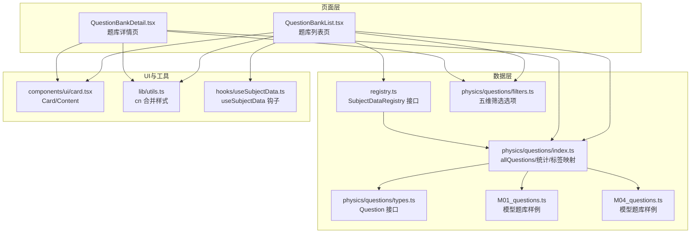
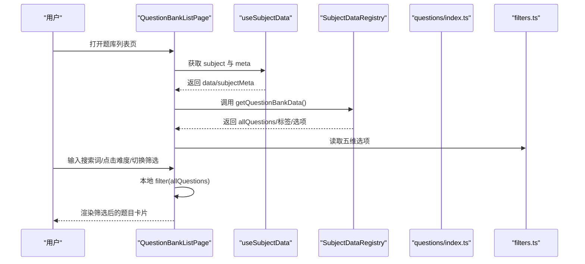
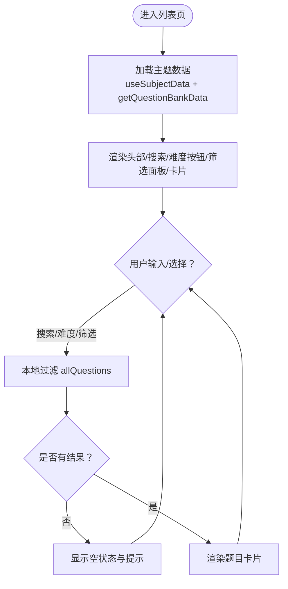
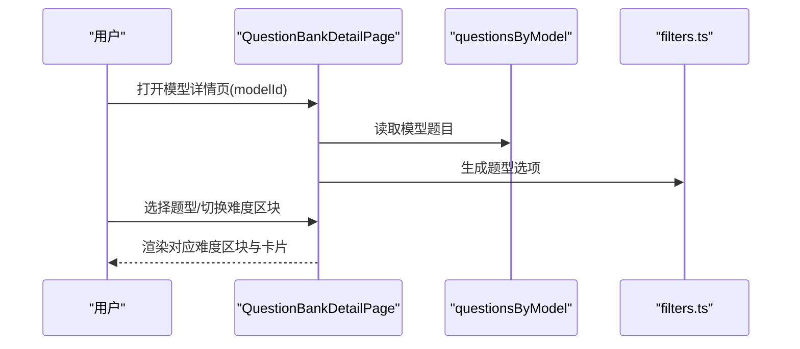
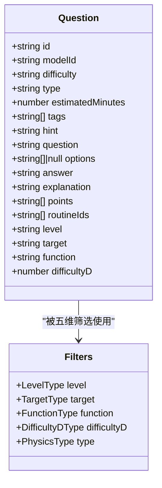
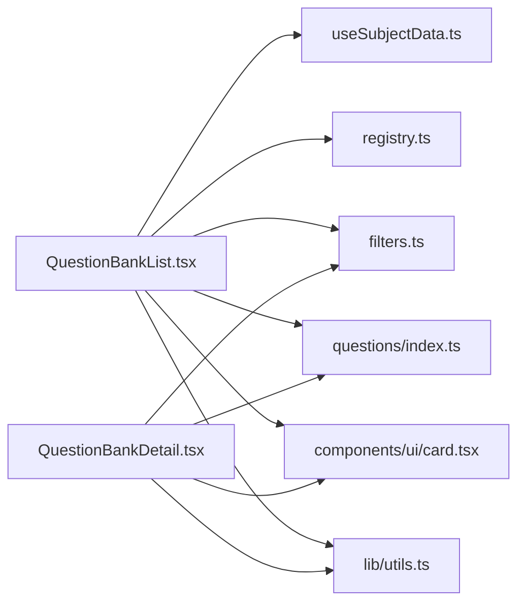

# 题库列表系统

<cite>
**本文引用的文件**
- [QuestionBankList.tsx](file://src/sections/QuestionBankList.tsx)
- [QuestionBankDetail.tsx](file://src/sections/QuestionBankDetail.tsx)
- [filters.ts](file://src/data/physics/questions/filters.ts)
- [types.ts](file://src/data/physics/questions/types.ts)
- [index.ts](file://src/data/physics/questions/index.ts)
- [M01_questions.ts](file://src/data/physics/questions/M01_questions.ts)
- [M04_questions.ts](file://src/data/physics/questions/M04_questions.ts)
- [useSubjectData.ts](file://src/hooks/useSubjectData.ts)
- [registry.ts](file://src/data/registry.ts)
- [card.tsx](file://src/components/ui/card.tsx)
- [utils.ts](file://src/lib/utils.ts)
</cite>

## 目录
1. [简介](#简介)
2. [项目结构](#项目结构)
3. [核心组件](#核心组件)
4. [架构总览](#架构总览)
5. [详细组件分析](#详细组件分析)
6. [依赖分析](#依赖分析)
7. [性能考虑](#性能考虑)
8. [故障排查指南](#故障排查指南)
9. [结论](#结论)
10. [附录](#附录)

## 简介
本文件针对星耀平台“题库列表系统”的设计与实现进行全面技术文档化，覆盖以下关键主题：
- 题库列表页面的搜索与筛选交互
- 难度标签系统与六级难度映射
- 五维筛选体系（能力层级、学习目标、题目功能、难度等级、题型分类）
- 题目数据组织结构、标签系统与排序策略
- 响应式布局与可访问性
- 性能优化与用户体验提升建议
- 代码级架构图与交互序列图

## 项目结构
题库列表系统由页面组件、数据层、过滤配置与UI组件构成，采用“页面组件 + 数据注册表 + 类型约束 + 过滤配置”的分层设计。

图表来源
- [QuestionBankList.tsx:1-412](file://src/sections/QuestionBankList.tsx#L1-L412)
- [QuestionBankDetail.tsx:1-185](file://src/sections/QuestionBankDetail.tsx#L1-L185)
- [filters.ts:1-56](file://src/data/physics/questions/filters.ts#L1-L56)
- [types.ts:1-35](file://src/data/physics/questions/types.ts#L1-L35)
- [index.ts:1-45](file://src/data/physics/questions/index.ts#L1-L45)
- [M01_questions.ts:1-161](file://src/data/physics/questions/M01_questions.ts#L1-L161)
- [M04_questions.ts:1-175](file://src/data/physics/questions/M04_questions.ts#L1-L175)
- [useSubjectData.ts:1-19](file://src/hooks/useSubjectData.ts#L1-L19)
- [registry.ts:1-48](file://src/data/registry.ts#L1-L48)
- [card.tsx:1-93](file://src/components/ui/card.tsx#L1-L93)
- [utils.ts:1-7](file://src/lib/utils.ts#L1-L7)

章节来源
- [QuestionBankList.tsx:1-412](file://src/sections/QuestionBankList.tsx#L1-L412)
- [QuestionBankDetail.tsx:1-185](file://src/sections/QuestionBankDetail.tsx#L1-L185)
- [filters.ts:1-56](file://src/data/physics/questions/filters.ts#L1-L56)
- [types.ts:1-35](file://src/data/physics/questions/types.ts#L1-L35)
- [index.ts:1-45](file://src/data/physics/questions/index.ts#L1-L45)
- [M01_questions.ts:1-161](file://src/data/physics/questions/M01_questions.ts#L1-L161)
- [M04_questions.ts:1-175](file://src/data/physics/questions/M04_questions.ts#L1-L175)
- [useSubjectData.ts:1-19](file://src/hooks/useSubjectData.ts#L1-L19)
- [registry.ts:1-48](file://src/data/registry.ts#L1-L48)
- [card.tsx:1-93](file://src/components/ui/card.tsx#L1-L93)
- [utils.ts:1-7](file://src/lib/utils.ts#L1-L7)

## 核心组件
- 题库列表页（QuestionBankListPage）
  - 负责渲染题目卡片、难度标签、搜索输入、五维筛选面板与筛选标签聚合。
  - 实现本地过滤逻辑，支持难度（B/J/T）、六级难度（D1-D6）、能力层级、学习目标、题目功能、题型分类以及关键词搜索。
- 题库详情页（QuestionBankDetailPage）
  - 按模型维度展示题目，支持按题型进一步筛选与难度区块折叠。
- 数据与类型
  - Question 接口定义了题目的完整字段集，包含五维筛选字段与难度映射。
  - filters.ts 定义了五维筛选选项与默认值。
  - index.ts 提供 allQuestions、按模型分组的 questionsByModel 与难度统计。
- UI 与工具
  - Card/Content 提供卡片容器与内容区。
  - cn 工具函数合并 Tailwind 类名，保证样式稳定叠加。

章节来源
- [QuestionBankList.tsx:28-412](file://src/sections/QuestionBankList.tsx#L28-L412)
- [QuestionBankDetail.tsx:92-185](file://src/sections/QuestionBankDetail.tsx#L92-L185)
- [types.ts:4-35](file://src/data/physics/questions/types.ts#L4-L35)
- [filters.ts:50-56](file://src/data/physics/questions/filters.ts#L50-L56)
- [index.ts:8-45](file://src/data/physics/questions/index.ts#L8-L45)
- [card.tsx:64-72](file://src/components/ui/card.tsx#L64-L72)
- [utils.ts:4-6](file://src/lib/utils.ts#L4-L6)

## 架构总览
题库列表系统遵循“页面组件 + 数据注册表 + 类型约束 + 过滤配置”的分层架构，页面组件通过钩子获取主题数据，再基于过滤器与本地过滤逻辑生成最终展示列表。

图表来源
- [QuestionBankList.tsx:28-71](file://src/sections/QuestionBankList.tsx#L28-L71)
- [useSubjectData.ts:5-19](file://src/hooks/useSubjectData.ts#L5-L19)
- [registry.ts:25-34](file://src/data/registry.ts#L25-L34)
- [index.ts:8-45](file://src/data/physics/questions/index.ts#L8-L45)
- [filters.ts:1-56](file://src/data/physics/questions/filters.ts#L1-L56)

## 详细组件分析

### 题库列表页（QuestionBankListPage）
- 搜索与难度筛选
  - 支持关键词搜索题干与标签，难度按钮快速筛选 B/J/T。
  - 搜索词、难度按钮与五维筛选条件共同参与过滤。
- 五维筛选面板
  - 能力层级（L1/L2/L3）、学习目标（SYNC/EXAM/GAOKAO/FOUNDATION/COMPETE）、题目功能（DIAG/PRACTICE/VARIATION/INTEGRATED/REAL/METHOD）、难度等级（D1-D6）、题型（选择/填空/计算/多选/图像/多过程/实验/选做）。
  - 展开/收起面板，支持一键清空筛选。
- 筛选标签聚合
  - 将当前生效的筛选条件以标签形式展示，支持逐项移除与一键清空。
- 题目卡片展示
  - 卡片包含难度标签（B/J/T）、六级难度徽标（D1-D6）、题型、模型标签、题干截断、标签云、预计时长。
  - 点击进入单题练习路由。
- 交互与状态管理
  - 使用 useState 管理搜索词、难度按钮、筛选面板开关、五维筛选状态与清空逻辑。
  - 过滤函数对 allQuestions 做 AND 组合过滤，确保性能与可读性。

图表来源
- [QuestionBankList.tsx:28-412](file://src/sections/QuestionBankList.tsx#L28-L412)
- [index.ts:8-45](file://src/data/physics/questions/index.ts#L8-L45)
- [filters.ts:50-56](file://src/data/physics/questions/filters.ts#L50-L56)

章节来源
- [QuestionBankList.tsx:28-412](file://src/sections/QuestionBankList.tsx#L28-L412)

### 题库详情页（QuestionBankDetailPage）
- 模型维度展示
  - 根据 modelId 从 questionsByModel 获取题目，按难度分块（B/J/T）折叠/展开。
- 题型筛选
  - 支持按题型进一步筛选，仅展示可用题型。
- 单题卡片
  - 展示题号、难度、题型、时长、标签与题干预览，提供“开始练习”入口。

图表来源
- [QuestionBankDetail.tsx:92-185](file://src/sections/QuestionBankDetail.tsx#L92-L185)
- [index.ts:14-17](file://src/data/physics/questions/index.ts#L14-L17)
- [filters.ts:33-42](file://src/data/physics/questions/filters.ts#L33-L42)

章节来源
- [QuestionBankDetail.tsx:92-185](file://src/sections/QuestionBankDetail.tsx#L92-L185)

### 数据模型与标签系统
- Question 接口
  - 包含基础字段（id/modelId/difficulty/type/estimatedMinutes/tags/hint/question/options/answer/explanation/points/routineIds）与五维筛选字段（level/target/function/difficultyD）。
- 难度映射
  - 用户可见难度 B/J/T 与内部六级难度 D1-D6 映射：B 对应 D2/D3，J 对应 D4，T 对应 D5/D6。
- 标签系统
  - tags 字段用于关键词检索与卡片标签云展示；DIFF_LABEL/ DIFF_COLOR 提供难度标签文案与样式映射。
- 模型分组与统计
  - allQuestions 汇总所有题目；questionsByModel 按 modelId 分组；modelQuestionStats 提供难度计数与总数。

图表来源
- [types.ts:4-35](file://src/data/physics/questions/types.ts#L4-L35)
- [filters.ts:50-56](file://src/data/physics/questions/filters.ts#L50-L56)

章节来源
- [types.ts:4-35](file://src/data/physics/questions/types.ts#L4-L35)
- [index.ts:8-45](file://src/data/physics/questions/index.ts#L8-L45)
- [filters.ts:1-56](file://src/data/physics/questions/filters.ts#L1-L56)

### 过滤与排序逻辑
- 过滤策略
  - 搜索：题干或标签任一匹配即命中。
  - 难度：支持 B/J/T 三档与 D1-D6 六档。
  - 五维：能力层级、学习目标、题目功能、难度等级、题型。
  - 组合：AND 关系，确保筛选结果精准。
- 排序策略
  - 默认按原始数据顺序；如需排序可在 allQuestions 上添加 sort 逻辑（例如按 difficultyD 或预计时长排序）。
- 性能建议
  - 本地过滤在中小规模数据下性能良好；若数据量增长，可考虑服务端分页或索引化搜索。

章节来源
- [QuestionBankList.tsx:57-71](file://src/sections/QuestionBankList.tsx#L57-L71)
- [index.ts:8-45](file://src/data/physics/questions/index.ts#L8-L45)

## 依赖分析
- 页面组件依赖
  - QuestionBankListPage 依赖 useSubjectData、SubjectDataRegistry、filters.ts、index.ts 与 UI 组件。
  - QuestionBankDetailPage 依赖 index.ts 的 questionsByModel 与 filters.ts 的题型选项。
- 数据耦合
  - Question 接口与 filters.ts 的枚举值形成稳定的契约，避免硬编码。
  - DIFF_LABEL/ DIFF_COLOR 与 DIFFICULTY_D_OPTIONS 作为展示层常量，便于统一风格。
- 外部依赖
  - 使用 lucide-react 图标与 Tailwind CSS 样式，cn 工具保证类名合并。

图表来源
- [QuestionBankList.tsx:1-10](file://src/sections/QuestionBankList.tsx#L1-L10)
- [QuestionBankDetail.tsx:1-10](file://src/sections/QuestionBankDetail.tsx#L1-L10)
- [useSubjectData.ts:1-19](file://src/hooks/useSubjectData.ts#L1-L19)
- [registry.ts:1-48](file://src/data/registry.ts#L1-L48)
- [filters.ts:1-56](file://src/data/physics/questions/filters.ts#L1-L56)
- [index.ts:1-45](file://src/data/physics/questions/index.ts#L1-L45)
- [card.tsx:1-93](file://src/components/ui/card.tsx#L1-L93)
- [utils.ts:1-7](file://src/lib/utils.ts#L1-L7)

章节来源
- [QuestionBankList.tsx:1-10](file://src/sections/QuestionBankList.tsx#L1-L10)
- [QuestionBankDetail.tsx:1-10](file://src/sections/QuestionBankDetail.tsx#L1-L10)
- [useSubjectData.ts:1-19](file://src/hooks/useSubjectData.ts#L1-L19)
- [registry.ts:1-48](file://src/data/registry.ts#L1-L48)
- [filters.ts:1-56](file://src/data/physics/questions/filters.ts#L1-L56)
- [index.ts:1-45](file://src/data/physics/questions/index.ts#L1-L45)
- [card.tsx:1-93](file://src/components/ui/card.tsx#L1-L93)
- [utils.ts:1-7](file://src/lib/utils.ts#L1-L7)

## 性能考虑
- 本地过滤
  - 在中等规模数据下，一次性过滤 allQuestions 具备良好性能；建议保持数据结构扁平、字段精简。
- 渲染优化
  - 使用虚拟滚动（如 react-window）处理超大数据集；对卡片内容做懒加载（如图片、公式渲染）。
- 搜索优化
  - 对题干与标签建立轻量索引（如前缀索引）以加速模糊匹配；防抖搜索输入。
- 缓存策略
  - 将过滤结果缓存于组件状态，避免重复计算；在路由参数变化时重置缓存。
- 样式与图标
  - 合理使用 cn 工具合并类名，减少不必要的样式冲突与重绘。

## 故障排查指南
- 筛选无效
  - 检查 filters.state 是否正确更新；确认过滤函数中 AND 条件是否遗漏。
- 题目为空
  - 确认 questionsByModel 是否包含对应 modelId；检查路由参数与 modelId 映射。
- 难度标签不显示
  - 检查 DIFF_LABEL/ DIFF_COLOR 与 DIFFICULTY_D_OPTIONS 是否正确传入组件。
- 样式异常
  - 确认 cn 工具调用顺序与 Tailwind 配置；避免覆盖关键样式类。

章节来源
- [QuestionBankList.tsx:78-88](file://src/sections/QuestionBankList.tsx#L78-L88)
- [QuestionBankDetail.tsx:95-104](file://src/sections/QuestionBankDetail.tsx#L95-L104)
- [index.ts:40-45](file://src/data/physics/questions/index.ts#L40-L45)
- [utils.ts:4-6](file://src/lib/utils.ts#L4-L6)

## 结论
题库列表系统通过清晰的分层设计与稳定的类型契约，实现了灵活的搜索与五维筛选体验。结合难度标签与题型分类，用户可高效定位目标题目。建议在数据规模扩大后引入索引与虚拟滚动等优化手段，并持续完善筛选标签的可访问性与交互反馈。

## 附录
- 最佳实践
  - 保持 Question 接口稳定，新增字段需兼容旧数据。
  - 过滤逻辑集中于页面组件，便于测试与维护。
  - 使用 cn 工具统一样式合并，避免类名冲突。
  - 对搜索与筛选做防抖与缓存，提升交互流畅度。
- 示例路径
  - 列表页过滤逻辑：[QuestionBankList.tsx:57-71](file://src/sections/QuestionBankList.tsx#L57-L71)
  - 难度标签映射：[index.ts:40-45](file://src/data/physics/questions/index.ts#L40-L45)
  - 五维选项定义：[filters.ts:1-56](file://src/data/physics/questions/filters.ts#L1-L56)
  - 题目数据样例（M01）：[M01_questions.ts:1-161](file://src/data/physics/questions/M01_questions.ts#L1-L161)
  - 题目数据样例（M04）：[M04_questions.ts:1-175](file://src/data/physics/questions/M04_questions.ts#L1-L175)