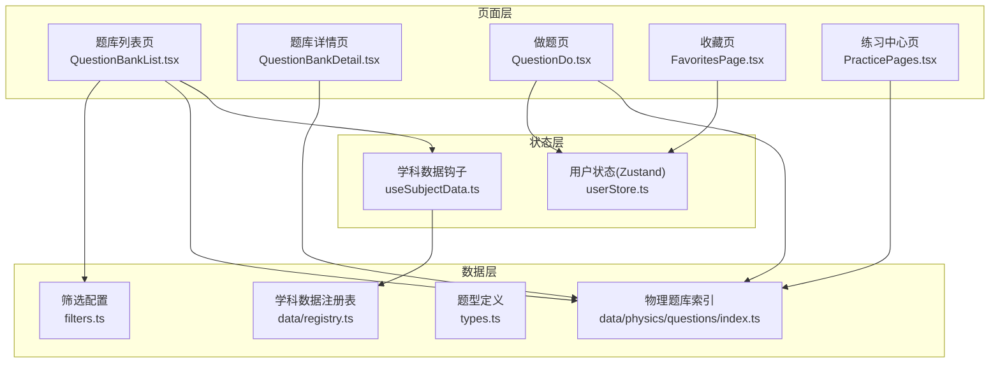
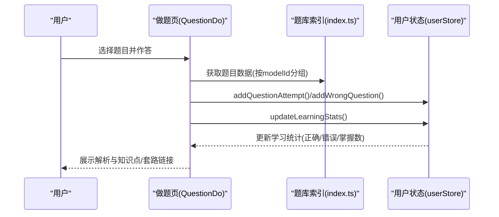
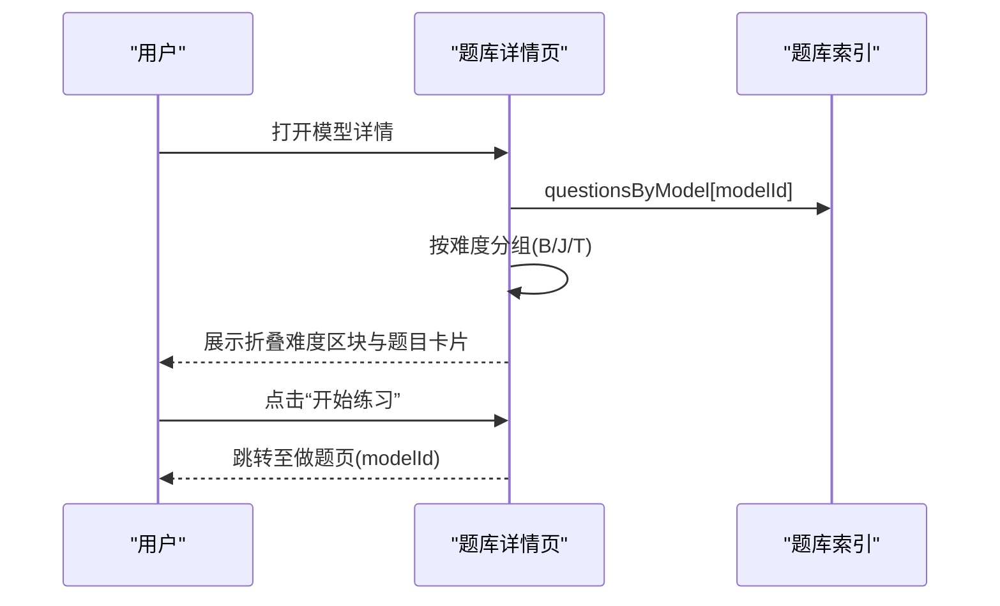
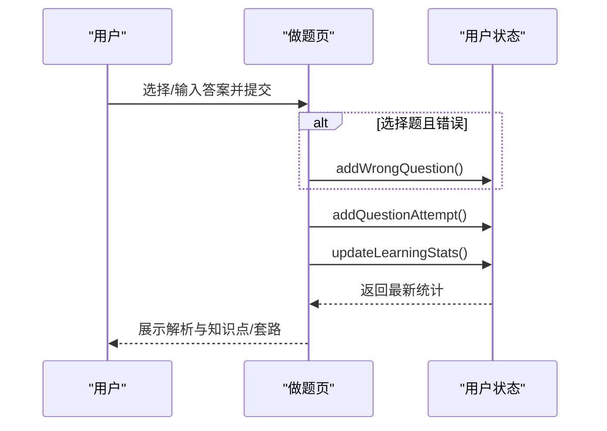
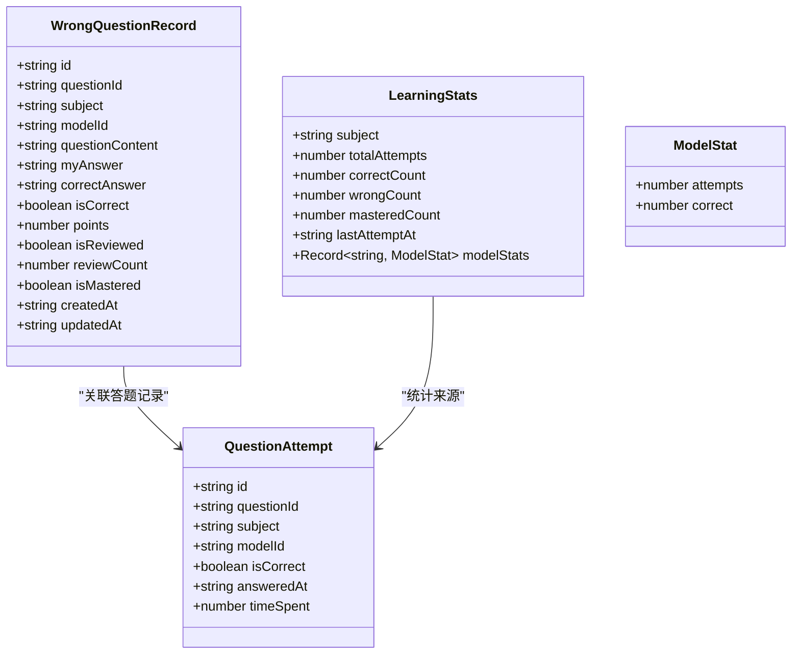
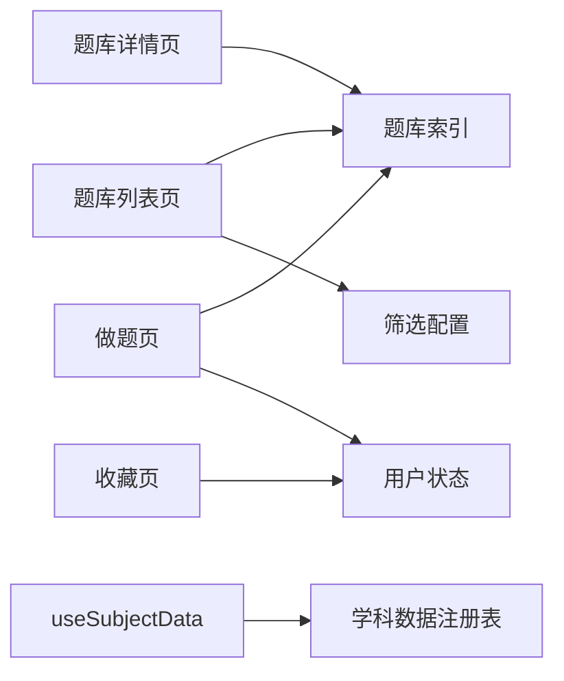

# 题库练习系统

<cite>
**本文档引用的文件**
- [QuestionBankList.tsx](file://src/sections/QuestionBankList.tsx)
- [QuestionBankDetail.tsx](file://src/sections/QuestionBankDetail.tsx)
- [QuestionDo.tsx](file://src/sections/QuestionDo.tsx)
- [FavoritesPage.tsx](file://src/sections/FavoritesPage.tsx)
- [PracticePages.tsx](file://src/sections/PracticePages.tsx)
- [index.ts](file://src/data/physics/questions/index.ts)
- [filters.ts](file://src/data/physics/questions/filters.ts)
- [types.ts](file://src/data/physics/questions/types.ts)
- [userStore.ts](file://src/stores/userStore.ts)
- [useSubjectData.ts](file://src/hooks/useSubjectData.ts)
- [registry.ts](file://src/data/registry.ts)
</cite>

## 目录
1. [简介](#简介)
2. [项目结构](#项目结构)
3. [核心组件](#核心组件)
4. [架构总览](#架构总览)
5. [详细组件分析](#详细组件分析)
6. [依赖关系分析](#依赖关系分析)
7. [性能考虑](#性能考虑)
8. [故障排查指南](#故障排查指南)
9. [结论](#结论)
10. [附录](#附录)

## 简介
本文件为星耀平台“题库练习系统”的综合技术文档，覆盖题库列表系统、题目练习系统与错题管理系统的设计与实现要点。重点包括：
- 题库页面的设计思路、五维筛选机制与难度分类展示
- 做题页面的交互逻辑、答案提交机制与实时反馈
- 错题本的设计理念、学习报告生成与复习提醒机制
- 题库数据的组织结构、筛选算法与个性化推荐策略
- 练习系统的性能优化与用户体验改进方案

## 项目结构
题库练习系统由“页面层”“数据层”“状态层”“工具层”构成，采用 React + TypeScript + Zustand 架构，配合主题与布局组件，形成清晰的职责划分。

图表来源
- [QuestionBankList.tsx:1-412](file://src/sections/QuestionBankList.tsx#L1-L412)
- [QuestionBankDetail.tsx:1-185](file://src/sections/QuestionBankDetail.tsx#L1-L185)
- [QuestionDo.tsx:1-348](file://src/sections/QuestionDo.tsx#L1-L348)
- [FavoritesPage.tsx:1-257](file://src/sections/FavoritesPage.tsx#L1-L257)
- [PracticePages.tsx:1-375](file://src/sections/PracticePages.tsx#L1-L375)
- [index.ts:1-45](file://src/data/physics/questions/index.ts#L1-L45)
- [filters.ts:1-56](file://src/data/physics/questions/filters.ts#L1-L56)
- [types.ts:1-35](file://src/data/physics/questions/types.ts#L1-L35)
- [userStore.ts:1-236](file://src/stores/userStore.ts#L1-L236)
- [useSubjectData.ts:1-19](file://src/hooks/useSubjectData.ts#L1-L19)
- [registry.ts:1-48](file://src/data/registry.ts#L1-L48)

章节来源
- [QuestionBankList.tsx:1-412](file://src/sections/QuestionBankList.tsx#L1-L412)
- [QuestionBankDetail.tsx:1-185](file://src/sections/QuestionBankDetail.tsx#L1-L185)
- [QuestionDo.tsx:1-348](file://src/sections/QuestionDo.tsx#L1-L348)
- [FavoritesPage.tsx:1-257](file://src/sections/FavoritesPage.tsx#L1-L257)
- [PracticePages.tsx:1-375](file://src/sections/PracticePages.tsx#L1-L375)
- [index.ts:1-45](file://src/data/physics/questions/index.ts#L1-L45)
- [filters.ts:1-56](file://src/data/physics/questions/filters.ts#L1-L56)
- [types.ts:1-35](file://src/data/physics/questions/types.ts#L1-L35)
- [userStore.ts:1-236](file://src/stores/userStore.ts#L1-L236)
- [useSubjectData.ts:1-19](file://src/hooks/useSubjectData.ts#L1-L19)
- [registry.ts:1-48](file://src/data/registry.ts#L1-L48)

## 核心组件
- 题库列表页：提供搜索、难度标签切换、五维筛选面板、模型标签与计数展示，并支持按题型与难度分组浏览。
- 题库详情页：按难度折叠展示题目卡片，支持题型筛选与“随机练习”入口。
- 做题页：单题答题卡、计时器、提示开关、提交后即时反馈、解析与知识点/套路链接。
- 收藏页：收藏内容分组与搜索、按类型筛选、删除与跳转。
- 练习中心页：练习模式入口、难度说明、章节浏览与直达做题。
- 数据与类型：题库索引、筛选选项、题型定义；学科数据注册表抽象。
- 用户状态：错题记录、答题尝试、学习统计与持久化。

章节来源
- [QuestionBankList.tsx:28-412](file://src/sections/QuestionBankList.tsx#L28-L412)
- [QuestionBankDetail.tsx:92-185](file://src/sections/QuestionBankDetail.tsx#L92-L185)
- [QuestionDo.tsx:277-348](file://src/sections/QuestionDo.tsx#L277-L348)
- [FavoritesPage.tsx:48-202](file://src/sections/FavoritesPage.tsx#L48-L202)
- [PracticePages.tsx:88-184](file://src/sections/PracticePages.tsx#L88-L184)
- [index.ts:1-45](file://src/data/physics/questions/index.ts#L1-L45)
- [filters.ts:1-56](file://src/data/physics/questions/filters.ts#L1-L56)
- [types.ts:1-35](file://src/data/physics/questions/types.ts#L1-L35)
- [userStore.ts:1-236](file://src/stores/userStore.ts#L1-L236)

## 架构总览
系统采用“页面-数据-状态”三层协作：
- 页面层负责交互与渲染，调用数据层接口与状态层动作。
- 数据层提供题库索引、筛选配置与类型定义，通过注册表抽象学科数据。
- 状态层使用 Zustand 管理用户答题与错题记录，持久化存储，便于学习报告与复习提醒。

图表来源
- [QuestionDo.tsx:50-275](file://src/sections/QuestionDo.tsx#L50-L275)
- [index.ts:14-17](file://src/data/physics/questions/index.ts#L14-L17)
- [userStore.ts:106-214](file://src/stores/userStore.ts#L106-L214)

章节来源
- [QuestionDo.tsx:1-348](file://src/sections/QuestionDo.tsx#L1-L348)
- [index.ts:1-45](file://src/data/physics/questions/index.ts#L1-L45)
- [userStore.ts:1-236](file://src/stores/userStore.ts#L1-L236)

## 详细组件分析

### 题库列表系统
- 设计思路
  - 顶部展示学科题库概览与匹配计数；支持关键词搜索与标签搜索。
  - 难度标签快速切换基础/进阶/挑战；活跃筛选以“标签云”形式直观呈现。
  - 可折叠筛选面板，提供能力层级、学习目标、题目功能、难度等级(D1-D6)、题型五维筛选。
  - 列表卡片展示难度徽标、D等级徽标、题型、模型、标签与预估时长；支持跳转到做题页。
- 筛选机制
  - 前端全量过滤：同时匹配搜索词与多维筛选项；支持清除全部筛选。
  - 活跃筛选标签：点击可逐项移除；支持一键清空。
- 难度分类展示
  - B/J/T 三级难度与 D1-D6 六级难度并行展示，便于不同场景选择。
- 性能与体验
  - 列表项截断显示题干，避免渲染过长内容；标签最多展示前 N 个。
  - 使用路由参数携带题目 ID，支持直接跳题。

```mermaid
flowchart TD
Start(["进入题库列表"]) --> Search["输入搜索词"]
Start --> ToggleDiff["切换难度标签(B/J/T)"]
Start --> OpenFilters["展开筛选面板"]
OpenFilters --> SelectLevel["选择能力层级"]
OpenFilters --> SelectTarget["选择学习目标"]
OpenFilters --> SelectFunction["选择题目功能"]
OpenFilters --> SelectD["选择D等级"]
OpenFilters --> SelectType["选择题型"]
Search --> Apply["应用筛选"]
ToggleDiff --> Apply
SelectLevel --> Apply
SelectTarget --> Apply
SelectFunction --> Apply
SelectD --> Apply
SelectType --> Apply
Apply --> Render["渲染筛选结果列表"]
Render --> Empty{"是否有结果？"}
Empty --> |否| Hint["提示清空筛选或等待更多题目"]
Empty --> |是| Detail["点击卡片进入做题页"]
```

图表来源
- [QuestionBankList.tsx:28-412](file://src/sections/QuestionBankList.tsx#L28-L412)
- [filters.ts:1-56](file://src/data/physics/questions/filters.ts#L1-L56)

章节来源
- [QuestionBankList.tsx:28-412](file://src/sections/QuestionBankList.tsx#L28-L412)
- [filters.ts:1-56](file://src/data/physics/questions/filters.ts#L1-L56)

### 题库详情系统
- 设计思路
  - 按难度折叠展示题目卡片，支持题型筛选；提供“随机练习”快捷入口。
  - 卡片展示难度、题型、预估时长与标签；底部提供“开始练习”按钮。
- 交互逻辑
  - 折叠/展开难度区块；按题型过滤；点击卡片跳转做题页。
- 数据组织
  - 通过按模型分组的数据结构，快速聚合与展示。

图表来源
- [QuestionBankDetail.tsx:92-185](file://src/sections/QuestionBankDetail.tsx#L92-L185)
- [index.ts:14-17](file://src/data/physics/questions/index.ts#L14-L17)

章节来源
- [QuestionBankDetail.tsx:92-185](file://src/sections/QuestionBankDetail.tsx#L92-L185)
- [index.ts:1-45](file://src/data/physics/questions/index.ts#L1-L45)

### 做题系统
- 交互逻辑
  - 选择题：点击选项后禁用更改，提交后高亮正确/错误选项并显示正确答案。
  - 填空/计算题：输入答案后“查看答案”，展示对比与解析。
  - 提示：可隐藏/显示提示，节省时间。
  - 计时：每题预估时长倒计时，临近结束有视觉提醒。
  - 翻题：支持上一题/下一题导航与进度条。
- 答案提交机制
  - 选择题：标准化答案字符串后与标准答案比对，错误时写入错题记录。
  - 非选择题：默认视为正确（可扩展为人工阅卷或自动评分）。
  - 写入答题尝试与更新学习统计。
- 实时反馈系统
  - 提交后即时展示结果徽章、解析、知识点与套路链接。
  - 错题记录支持标记已复习/已掌握，用于复习提醒与报告生成。

图表来源
- [QuestionDo.tsx:88-125](file://src/sections/QuestionDo.tsx#L88-L125)
- [userStore.ts:106-214](file://src/stores/userStore.ts#L106-L214)

章节来源
- [QuestionDo.tsx:1-348](file://src/sections/QuestionDo.tsx#L1-L348)
- [userStore.ts:1-236](file://src/stores/userStore.ts#L1-L236)

### 错题管理系统
- 设计理念
  - 错题记录包含题目ID、科目、模型ID、题目内容摘要、我的答案、正确答案、是否正确、分值、是否已复习/已掌握、创建/更新时间。
  - 学习统计按科目维护：总尝试次数、正确数、错误数、掌握数、模型维度统计、最近一次答题时间。
- 复习提醒机制
  - 可标记“已复习”“已掌握”，支持按科目/模型维度检索与筛选。
  - 结合学习统计生成“学习报告”，指导复习优先级。
- 与收藏联动
  - 收藏页支持按类型筛选与搜索，便于将错题与收藏结合管理。

图表来源
- [userStore.ts:106-214](file://src/stores/userStore.ts#L106-L214)
- [types.ts:4-35](file://src/data/physics/questions/types.ts#L4-L35)

章节来源
- [userStore.ts:1-236](file://src/stores/userStore.ts#L1-L236)
- [types.ts:1-35](file://src/data/physics/questions/types.ts#L1-L35)

### 练习中心与题库浏览
- 练习中心模式
  - 知识点练习：按知识点搜索与跳转做题。
  - 章节测试：按章节与难度选择做题。
  - 考试真题/竞赛练习：预留入口，当前不可用。
- 题库浏览
  - 按难度(B/J/T)浏览题库，提供开始做题入口与题目计划说明。

章节来源
- [PracticePages.tsx:88-375](file://src/sections/PracticePages.tsx#L88-L375)

## 依赖关系分析
- 页面与数据层
  - 题库列表/详情/做题页依赖题库索引与筛选配置；详情页依赖按模型分组数据。
- 页面与状态层
  - 做题页依赖用户状态写入错题与答题尝试，并更新学习统计。
- 工具与钩子
  - useSubjectData 提供学科数据注册表访问，统一获取题库数据与选项。

图表来源
- [QuestionBankList.tsx:28-48](file://src/sections/QuestionBankList.tsx#L28-L48)
- [QuestionBankDetail.tsx:6-9](file://src/sections/QuestionBankDetail.tsx#L6-L9)
- [QuestionDo.tsx:7-8](file://src/sections/QuestionDo.tsx#L7-L8)
- [FavoritesPage.tsx:7](file://src/sections/FavoritesPage.tsx#L7)
- [useSubjectData.ts:5-18](file://src/hooks/useSubjectData.ts#L5-L18)
- [registry.ts:25-34](file://src/data/registry.ts#L25-L34)

章节来源
- [QuestionBankList.tsx:1-412](file://src/sections/QuestionBankList.tsx#L1-L412)
- [QuestionBankDetail.tsx:1-185](file://src/sections/QuestionBankDetail.tsx#L1-L185)
- [QuestionDo.tsx:1-348](file://src/sections/QuestionDo.tsx#L1-L348)
- [FavoritesPage.tsx:1-257](file://src/sections/FavoritesPage.tsx#L1-L257)
- [useSubjectData.ts:1-19](file://src/hooks/useSubjectData.ts#L1-L19)
- [registry.ts:1-48](file://src/data/registry.ts#L1-L48)

## 性能考虑
- 列表渲染优化
  - 使用虚拟滚动或分页（建议）以减少长列表渲染压力。
  - 对题干内容进行截断与纯文本处理，避免复杂 DOM 结构。
- 筛选性能
  - 当前为前端全量过滤，建议在数据量增大时引入服务端筛选或 IndexedDB 索引。
- 状态持久化
  - 用户状态已持久化，注意序列化字段与存储体积，避免冗余数据。
- 图片与公式
  - 题干与解析使用 Markdown/KaTeX，建议懒加载与缓存渲染结果。

## 故障排查指南
- 题库为空
  - 检查学科数据注册表是否正确注册；确认 useSubjectData 返回数据非空。
- 筛选无效
  - 确认筛选项值与数据字段一致；检查 activeDiff 与 filters 的状态同步。
- 做题无记录
  - 确认用户状态动作被调用；检查 addQuestionAttempt 与 addWrongQuestion 的触发条件。
- 学习统计不更新
  - 确认 updateLearningStats 在答题后执行；检查 attempts/wrongQuestions 的数据来源。

章节来源
- [useSubjectData.ts:5-18](file://src/hooks/useSubjectData.ts#L5-L18)
- [QuestionBankList.tsx:78-88](file://src/sections/QuestionBankList.tsx#L78-L88)
- [QuestionDo.tsx:114-125](file://src/sections/QuestionDo.tsx#L114-L125)
- [userStore.ts:179-214](file://src/stores/userStore.ts#L179-L214)

## 结论
本系统以清晰的页面-数据-状态分层实现了题库浏览、筛选与做题的核心流程，配合错题与学习统计，形成闭环的学习支持体系。建议在数据规模扩大后引入服务端筛选与持久化索引，进一步提升性能与可扩展性。

## 附录
- 题库数据组织
  - 按模型分组的题目数组与汇总数组；模型题库概览用于列表页展示。
- 五维筛选字段
  - 能力层级(L1/L2/L3)、学习目标(SYNC/EXAM/GAOKAO/FOUNDATION/COMPETE)、题目功能(DIAG/PRACTICE/VARIATION/INTEGRATED/REAL/METHOD)、难度等级(D1-D6)、题型(选择/填空/计算等)。
- 个性化推荐策略（建议）
  - 基于学习统计与错题分布，优先推送薄弱模型与高频错误题目。
  - 结合章节测试与知识点练习，提供“易错-巩固-挑战”阶梯式推荐。

章节来源
- [index.ts:14-37](file://src/data/physics/questions/index.ts#L14-L37)
- [filters.ts:1-56](file://src/data/physics/questions/filters.ts#L1-L56)
- [types.ts:30-35](file://src/data/physics/questions/types.ts#L30-L35)